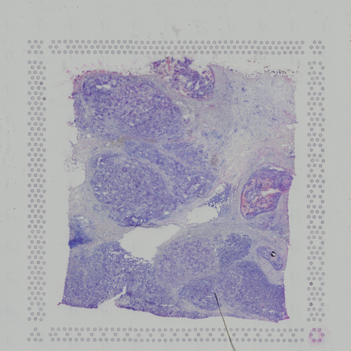

Breast tumours are mixtures of malignant epithelial cells, fibroblasts, vascular cells and infiltrating immune populations, and the location of those populations can be as informative as their expression state (, ). Spatial transcriptomics (ST) preserves that positional information, making it possible to ask whether expression programmes form coherent territories, meet at interfaces or avoid one another (, ). Applied to breast tumours, the same approach has been used to show that regions of one tumour can differ enough to matter clinically ().

This tutorial uses the 10x Genomics **Human Breast Cancer, Block A Section 1** dataset . 10x Genomics obtained fresh-frozen invasive ductal carcinoma tissue, cryosectioned it at 10 µm onto a Visium Gene Expression slide and imaged the section with haematoxylin and eosin (H&E) before library preparation. The sample is described as AJCC/UICC Stage Group IIA, ER positive, PR negative and HER2 positive, and the section is annotated as containing **ductal carcinoma *in situ*, lobular carcinoma *in situ* and invasive carcinoma**. This tutorial uses the Space Ranger 1.1.0 release of the dataset, which reports 3,798 spots under tissue and quantifies 36,601 genes. The data are licensed CC BY 4.0.



The expression table entering this analysis contains **3,798 observations and 36,601 genes**.

The unit of measurement matters throughout this tutorial. A standard Visium observation is a **capture spot**, not a segmented cell. Each spot is 55 µm across with 100 µm between spot centres, arranged on a fixed hexagonal grid, and 10x Genomics describes the resulting resolution as one to ten cells per spot (). That is why the biological language below is deliberately conservative: Leiden defines **tissue domains** made of transcriptionally similar spots, CellTypist transfers the closest labels from a single-cell reference, and LIANA ranks expression-compatible ligand-receptor pairs. None of these operations converts a multicellular spot into a known single cell.

> <comment-title>Why this pipeline has no doublet detection and no deconvolution step</comment-title>
>
> Two steps that are routine in single-cell tutorials are deliberately absent here, and both omissions follow from the size of a capture spot.
>
> **Doublet detection is not applicable.** Tools such as Scrublet look for droplets that accidentally captured two cells, because in droplet-based single-cell RNA-seq a two-cell measurement is a technical artefact (). A Visium spot is multicellular *by design*, so flagging multicellular spots would discard valid data rather than clean it.
>
> **Deconvolution is not run.** Methods such as cell2location and RCTD estimate the cell-type proportions inside each spot by borrowing a matched single-cell reference (, ). They are the standard way to recover cell-type composition from Visium, but they need a reference dataset from the same tissue and are not part of the workflow validated here. Their absence is precisely why the results below are described as domains and reference matches rather than cell counts.
>
{: .comment}

The validated Galaxy workflow used for this tutorial has been run end to end, and the prepared SpatialData input together with the reference outputs of every step are archived on the [Zenodo record]({{ page.zenodo_link }}) linked above. The hands-on instructions below reproduce that **passed workflow**, including its current IUC/ToolShed parameter labels and dataset names.



> <agenda-title></agenda-title>
>
> In this tutorial, we will cover:
>
> 1. TOC
> {:toc}
>
{: .agenda}

# Analysis strategy


| Analysis stage | Question it answers | Main output |
| --- | --- | --- |
| SpatialData input | What spatial and expression information belongs to the same tissue section? | SpatialData object and exported AnnData `table` |
| Scanpy QC | How much RNA and how many genes does each spot contain? | `total_counts`, `n_genes_by_counts` and top-gene proportions |
| Filtering | Which low-information spots and rarely detected genes are removed by the chosen thresholds? | 3,790 spots × 22,240 genes |
| Normalisation and HVGs | How can depth be made comparable while focusing PCA on informative genes? | Log-normalised object with 3,000 HVGs flagged |
| PCA and regression comparison | Is total count associated with major axes, and what happens if that covariate is residualised? | Main PCA plus optional comparison PCA |
| Expression graph, UMAP and Leiden | Which spots have similar transcriptomic profiles, and how stable are graph partitions across resolution? | 15-neighbour graph, UMAP and three Leiden keys |
| Ranked genes | Which expression programmes distinguish the selected groups? | Wilcoxon-ranked genes for `leiden_res_0.8` |
| Squidpy | How are the same groups arranged on the physical Visium grid? | Spatial graph, centrality, neighbourhood enrichment and Moran's I |
| CellTypist | Which adult-breast reference profiles are the closest transcriptional matches to the spots? | Direct `predicted_labels` and confidence scores |
| LIANA | Which ligand-receptor pairs are expression-compatible between Leiden groups? | `liana_res` rankings |
| SpatialData output | Where do the selected transcriptomic groups sit on the histology? | `table_processed` and final spatial overlay |

Two graphs are used, and confusing them changes the biological meaning of the result. **Scanpy's neighbour graph** is calculated from PCA coordinates: two spots can be connected because their expression profiles are similar even if they lie far apart on the slide. **Squidpy's spatial graph** is calculated later from the Visium coordinates: it connects physically neighbouring spots whether or not their transcriptomes resemble one another.

> <question-title>Keep the two graphs separate</question-title>
>
> 1. Two spots sit on opposite sides of the tissue but have very similar expression profiles. In which graph could they still be neighbours?
> 2. A Leiden group is compact on UMAP. Does that show the spots form a compact region on the histology?
>
> > <solution-title></solution-title>
> >
> > 1. The Scanpy expression-neighbour graph. Its edges are based on PCA-space similarity, not tissue distance.
> > 2. No. UMAP visualises the expression graph. The spatial distribution must be checked using the Visium coordinates and histology. A group can be transcriptomically coherent while occupying several physical regions.
> >
> {: .solution}
>
{: .question}

# Get the data

The tutorial starts from `V1_Breast_Cancer_Block_A_Section_1.spatialdata.zip`. SpatialData keeps the histology image, Visium spot geometry, coordinate system and annotated expression table in one object so they can be moved through the workflow without losing their alignment ().

> <hands-on-title>Data upload</hands-on-title>
>
> 1. Create a new Galaxy history and name it `Visium breast cancer TME`.
>
>    
>
>    
>
> 2. Import the prepared SpatialData object from [Zenodo]({{ page.zenodo_link }}):
>
>    ```
>    {{ page.zenodo_link }}/files/V1_Breast_Cancer_Block_A_Section_1.spatialdata.zip
>    ```
>
>    
>
> 3. Confirm that Galaxy assigns the datatype `spatialdata.zip`.
>
>    
>
{: .hands_on}

## What the SpatialData object represents

Unlike Xenium, Visium does not segment individual cells. The spatial element used for expression plotting is the collection of capture spots, represented as shapes and registered to the tissue image. The table stores the expression matrix and observation annotations for those spots.

> <details-title>Optional: reconstruct the SpatialData object from the Visium files</details-title>
>
> This preparation is not required for the analysis: the completed SpatialData object above is the workflow input. The same training-data record contains the files used to build it, which is useful if you want to repeat the preparation for another Visium section.
>
> 1. Import:
>
>    ```
>    {{ page.zenodo_link }}/files/V1_Breast_Cancer_Block_A_Section_1_filtered_feature_bc_matrix.h5
>    {{ page.zenodo_link }}/files/V1_Breast_Cancer_Block_A_Section_1_image.tif
>    {{ page.zenodo_link }}/files/tissue_hires_image.png
>    {{ page.zenodo_link }}/files/tissue_lowres_image.png
>    {{ page.zenodo_link }}/files/tissue_positions_list.csv
>    {{ page.zenodo_link }}/files/scalefactors_json.json
>    ```
>
> 2.  with the following parameters:
>    - *"Spatial Technology"*: `10x Genomics Visium`
>        - *"Dataset identifier"*: `V1_Breast_Cancer_Block_A_Section_1`
>        -  *"feature BC matrix (Counts file)"*: `V1_Breast_Cancer_Block_A_Section_1_filtered_feature_bc_matrix.h5`
>        -  *"Scale factors file"*: `scalefactors_json.json`
>        -  *"Full resolution image"*: `V1_Breast_Cancer_Block_A_Section_1_image.tif`
>        -  *"Tissue high resolution image"*: `tissue_hires_image.png`
>        -  *"Tissue low resolution image"*: `tissue_lowres_image.png`
>        -  *"Tissue positions file"*: `tissue_positions_list.csv`
>
> The dataset identifier matters because it becomes the prefix used for the image, shapes and coordinate-system names referenced by later SpatialData Plot jobs.
>
> Do not mix files from different Space Ranger reprocessings of the section. Reprocessing can alter the set of spots treated as under tissue and the summary statistics, even when the histology is the same.
>
{: .details}

# Extract and inspect the expression table

Scanpy works on AnnData, the annotated-matrix container that pairs an expression matrix with per-observation and per-gene annotation (). The first workflow job exports the table while the original SpatialData object remains available for spatial plots later.

> <hands-on-title>Export and inspect the AnnData table</hands-on-title>
>
> 1.  with the following parameters:
>    -  *"SpatialData object"*: `V1_Breast_Cancer_Block_A_Section_1.spatialdata.zip`
>    - *"Operation"*: `Export the table of a SpatialData object to anndata`
>        - *"Table name"*: `table`
>
> 2. Rename the generated file `Initial AnnData table`.
>
> 3.  with the following parameters:
>    -  *"Annotated data matrix"*: `Initial AnnData table`
>    - *"What to inspect?"*: `General information about the object`
>
>    Rename the text output `Initial AnnData dimensions`.
>
>    > <question-title>Check the dimensions before doing anything else</question-title>
>    >
>    > ```
>    > AnnData object with n_obs × n_vars = 3798 × 36601
>    > ```
>    >
>    > What do the two numbers mean in a Visium experiment, and why should the first not be called a cell count?
>    >
>    > > <solution-title></solution-title>
>    > >
>    > > `n_obs` is the number of capture-spot observations in this prepared table and `n_vars` is the number of genes. A Visium spot covers an area large enough to receive RNA from several cells, so 3,798 observations does not mean 3,798 cells.
>    > >
>    > > Checking these dimensions before filtering also provides the denominator for every removal tally later in the tutorial.
>    > >
>    > {: .solution}
>    >
>    {: .question}
>
{: .hands_on}

# Quality control before filtering

`total_counts` measures the amount of expression signal recorded for each spot, while `n_genes_by_counts` records how many distinct genes are detected. The `pct_counts_in_top_N_genes` columns show how concentrated the counts are in the most abundant genes. A spot with a small detected-gene set and low total counts may be poorly captured, but low RNA can also reflect a genuine tissue region, which is why the same metrics are inspected both as distributions and on the histology.

The validated workflow does **not** define mitochondrial or ribosomal gene sets and does not apply mitochondrial/ribosomal thresholds. Adding those filters here would create an analysis that is different from the passed workflow.

> <hands-on-title>Compute QC metrics</hands-on-title>
>
> 1.  with the following parameters:
>    -  *"Annotated data matrix"*: `Initial AnnData table`
>    - *"Method used for inspecting"*: `Calculate quality control metrics, using 'pp.calculate_qc_metrics'`
>        - *"Name of kind of values in X"*: `counts`
>        - *"The kind of thing the variables are"*: `genes`
>        - *"Proportions of top genes to cover"*: `50,100,200,300`
>        - *"Use 'raw' attribute of input if present"*: `No`
>        - *"Compute log1p transformed annotations"*: `Yes`
>
> 2. Rename the generated file `QC metrics before filtering`.
>
> 3.  with the following parameters:
>    -  *"Annotated data matrix"*: `QC metrics before filtering`
>    - *"What to inspect?"*: `General information about the object`
>
>    Rename the text output `QC summary before filtering`.
>
{: .hands_on}

In the reference run, the median `total_counts` is **20,761.5** and the median `n_genes_by_counts` is **6,026.5**. The distribution is wide at both ends: the lowest spot has 578 counts across 430 genes, the highest has 81,624 counts across 10,012 genes, and the most extreme complexity reaches 10,153 genes. Those extremes are what the lower and upper filters will act on.

> <hands-on-title>Visualise QC metrics</hands-on-title>
>
> 1.  with the following parameters:
>    -  *"Annotated data matrix"*: `QC metrics before filtering`
>    - *"Method used for plotting"*: `Generic: Scatter plot along observations or variables axes, using 'pl.scatter'`
>        - *"x coordinate"*: `total_counts`
>        - *"y coordinate"*: `n_genes_by_counts`
>        - *"Color by"*: `pct_counts_in_top_50_genes`
>
>    Rename the output `Scatter plot before filtering`.
>
> 2.  with the following parameters:
>    -  *"Annotated data matrix"*: `QC metrics before filtering`
>    - *"Method used for plotting"*: `Generic: Violin plot, using 'pl.violin'`
>        - *"Keys for accessing variables"*: `Subset of variables in 'adata.var_names' or fields of '.obs'`
>            - *"Keys for accessing variables"*: `n_genes_by_counts, total_counts`
>        - In *"Violin plot attributes"*:
>            - *"Display keys in multiple panels"*: `Yes`
>
>    Rename the output `Violin plots before filtering`.
>
{: .hands_on}


The distributions show how unusual a spot is, but not where it sits. Before removing the tail, map the same QC fields back onto the section.

> <hands-on-title>Map the QC metrics onto histology</hands-on-title>
>
> 1.  with the following parameters:
>    -  *"SpatialData object"*: `V1_Breast_Cancer_Block_A_Section_1.spatialdata.zip`
>    - *"Operation"*: `Import anndata table to a SpatialData object`
>        -  *"annotated data object to add"*: `QC metrics before filtering`
>        - *"Table name"*: `table_qc`
>
> 2.  with the following parameters:
>    -  *"SpatialData object"*: output of **SpatialData Operations** 
>    - In *"Render Images"*:
>        - *"Image element name"*: `V1_Breast_Cancer_Block_A_Section_1_hires_image`
>    - In *"Render Shapes"*:
>        - *"Shapes element name"*: `V1_Breast_Cancer_Block_A_Section_1`
>        - *"Color column"*: `total_counts`
>        - *"Scale factor"*: `1.0`
>        - *"Table name"*: `table_qc`
>    - In *"Plot Display Parameters"*:
>        - *"Coordinate system(s)"*: `V1_Breast_Cancer_Block_A_Section_1`
>        - *"Legend location"*: `Right margin`
>        - *"Enable colorbars?"*: `Yes`
>        - *"Image format"*: `JPG`
>
>    Rename the output `Spatial Plot total_counts before filtering`.
>
> 3. Repeat **SpatialData Plot** with *"Color column"*: `n_genes_by_counts` and rename the output `Spatial Plot n_genes_by_counts before filtering`.
>
{: .hands_on}


> <question-title>Interpret the QC output</question-title>
>
> 1. Why is `n_genes_by_counts` expected to increase with `total_counts` but not in a perfectly linear way?
> 2. Why is a spatial map useful before removing a low-count tail?
> 3. The minimum is 524 counts, while the later count threshold is 1,000. Does that mean every spot below 1,000 is necessarily a technical failure?
>
> > <solution-title></solution-title>
> >
> > 1. As more transcripts are sampled, an increasing fraction are repeats of genes already detected, so the number of distinct genes does not grow one-for-one with the count total.
> > 2. A low value can be technical, but it can also correspond to tissue with genuinely low RNA abundance or poor cellularity. A spatial map shows whether low values are scattered or associated with a coherent anatomical region that should be reported.
> > 3. No. The threshold is a dataset-specific filtering decision used in this validated workflow, not a biological definition of failure. Its effect must be quantified and interpreted in context.
> >
> {: .solution}
>
{: .question}

# Filtering

The workflow applies six filters sequentially: two lower spot filters, two lower gene filters and two upper spot filters. The important point is not just the thresholds; it is **what each threshold actually removes from this dataset**.

## Lower spot filters

> <hands-on-title>Remove spots with very low detected-gene complexity</hands-on-title>
>
> 1.  with the following parameters:
>    -  *"Annotated data matrix"*: `QC metrics before filtering`
>    - *"Method used for filtering"*: `Filter cell outliers based on counts and numbers of genes expressed, using 'pp.filter_cells'`
>        - *"Filter"*: `Minimum number of genes expressed`
>            - *"Minimum number of genes expressed required for a cell to pass filtering"*: `500`
>
> 2. Rename the generated file `Filter minimum genes expressed per spot`.
>
{: .hands_on}

The wrapper uses the generic Scanpy word **cell** because `pp.filter_cells` filters AnnData observations. In this tutorial those observations are Visium **spots**. The workflow places its next Inspect AnnData checkpoint after the second lower filter, so the combined effect of the two is what gets recorded below.

> <hands-on-title>Remove spots with very low total counts</hands-on-title>
>
> 1.  with the following parameters:
>    -  *"Annotated data matrix"*: `Filter minimum genes expressed per spot`
>    - *"Method used for filtering"*: `Filter cell outliers based on counts and numbers of genes expressed, using 'pp.filter_cells'`
>        - *"Filter"*: `Minimum number of counts`
>            - *"Minimum number of counts required for a cell to pass filtering"*: `1000`
>
> 2. Rename the generated file `Filter minimum counts per spot`.
>
> 3.  with the following parameters:
>    -  *"Annotated data matrix"*: `Filter minimum counts per spot`
>    - *"What to inspect?"*: `General information about the object`
>
>    Rename the output `Inspect after minimum spot filters`.
>
>    > <question-title>What did the second threshold add?</question-title>
>    >
>    > ```
>    > AnnData object with n_obs × n_vars = 3795 × 36601
>    > ```
>    >
>    > How many spots have the two lower filters removed between them, what fraction of the starting observations is that, and why has the gene count not changed?
>    >
>    > > <solution-title></solution-title>
>    > >
>    > > Together the two lower filters remove 3,798 − 3,795 = **3 spots**, about **0.08%** of the starting observations, so more than 99.9% are retained. The filters therefore trim a very small tail rather than removing a tissue compartment. The gene count is unchanged because `pp.filter_cells` acts on observations only; nothing about a gene's detection has been tested yet.
>    > >
>    > {: .solution}
>    >
>    {: .question}
>
{: .hands_on}

## Gene filters

> <hands-on-title>Remove genes detected in too few spots</hands-on-title>
>
> 1.  with the following parameters:
>    -  *"Annotated data matrix"*: `Filter minimum counts per spot`
>    - *"Method used for filtering"*: `Filter genes based on number of cells or counts, using 'pp.filter_genes'`
>        - *"Filter"*: `Minimum number of cells expressed`
>            - *"Minimum number of cells expressed required for a gene to pass filtering"*: `3`
>
> 2. Rename the generated file `Filter minimum spots expressed per gene`.
>
> 3.  with the following parameters:
>    -  *"Annotated data matrix"*: `Filter minimum spots expressed per gene`
>    - *"Method used for filtering"*: `Filter genes based on number of cells or counts, using 'pp.filter_genes'`
>        - *"Filter"*: `Minimum number of counts`
>            - *"Minimum number of counts required for a gene to pass filtering"*: `3`
>
> 4. Rename the generated file `Filter minimum counts per gene`.
>
> 5.  with the following parameters:
>    -  *"Annotated data matrix"*: `Filter minimum counts per gene`
>    - *"What to inspect?"*: `General information about the object`
>
>    Rename the output `Inspect after gene filters`.
>
>    > <question-title>Which gene filter changes the matrix?</question-title>
>    >
>    > ```
>    > AnnData object with n_obs × n_vars = 3795 × 22240
>    > ```
>    >
>    > How many genes have the two gene filters removed, and why is that number so much larger than the number of spots removed earlier?
>    >
>    > > <solution-title></solution-title>
>    > >
>    > > 36,601 − 22,240 = **14,361 genes** are removed, roughly 39% of the starting features, against 3 spots removed by the previous stage. The asymmetry is expected: the reference transcriptome quantifies every annotated gene, including large numbers that are simply not transcribed in breast tissue, so a requirement as mild as detection in three spots eliminates a large fraction of the feature space while barely touching the observations.
>    > >
>    > {: .solution}
>    >
>    {: .question}
>
{: .hands_on}

> <comment-title>Two gene filters, one checkpoint</comment-title>
>
> Both gene filters are minimum thresholds: `min_cells = 3` requires a gene to be detected in at least three spots, and `min_counts = 3` requires it to have at least three counts in total. They overlap heavily, because a gene detected in three spots has at least three counts by definition. The workflow runs them in sequence and inspects the result once, so the table below reports their combined effect rather than attributing genes to one or the other.
>
{: .comment}

## Upper spot filters

> <hands-on-title>Check the high-count and high-complexity tails</hands-on-title>
>
> 1.  with the following parameters:
>    -  *"Annotated data matrix"*: `Filter minimum counts per gene`
>    - *"Method used for filtering"*: `Filter cell outliers based on counts and numbers of genes expressed, using 'pp.filter_cells'`
>        - *"Filter"*: `Maximum number of counts`
>            - *"Maximum number of counts required for a cell to pass filtering"*: `75000`
>
> 2. Rename the generated file `Filter maximum counts per spot`.
>
> 3.  with the following parameters:
>    -  *"Annotated data matrix"*: `Filter maximum counts per spot`
>    - *"Method used for filtering"*: `Filter cell outliers based on counts and numbers of genes expressed, using 'pp.filter_cells'`
>        - *"Filter"*: `Maximum number of genes expressed`
>            - *"Maximum number of genes expressed required for a cell to pass filtering"*: `10000`
>
> 4. Rename the generated file `Filter maximum genes per spot`.
>
> 5.  with the following parameters:
>    -  *"Annotated data matrix"*: `Filter maximum genes per spot`
>    - *"What to inspect?"*: `General information about the object`
>
>    Rename the output `Inspect after upper spot filters`.
>
>    > <question-title>Did the upper filters remove anything?</question-title>
>    >
>    > ```
>    > AnnData object with n_obs × n_vars = 3790 × 22240
>    > ```
>    >
>    > The previous checkpoint recorded 3,795 spots. How many spots did the two upper filters remove, and what kind of observation are they removing?
>    >
>    > > <solution-title></solution-title>
>    > >
>    > > The upper filters remove 3,795 − 3,790 = **5 spots**. Unlike the lower filters, which target spots with too little signal, these target the opposite tail: spots whose total counts or detected-gene count are unusually high. A very high value can indicate genuinely dense, transcriptionally active tissue, but it can also indicate a capture artefact, so the threshold is a decision about which risk you would rather take. Five spots out of 3,795 is a small enough number that either choice has little effect on the analysis, but it should still be reported.
>    > >
>    > {: .solution}
>    >
>    {: .question}
>
{: .hands_on}

The complete filtering path is therefore:

| Checkpoint | Filters applied since the previous row | Dimensions | Spots removed | Genes removed |
| --- | --- | ---: | ---: | ---: |
| Initial table | – | 3,798 × 36,601 | – | – |
| After lower spot filters | spot `min_genes = 500`, spot `min_counts = 1000` | 3,795 × 36,601 | 3 | 0 |
| After gene filters | gene `min_cells = 3`, gene `min_counts = 3` | 3,795 × 22,240 | 0 | 14,361 |
| After upper spot filters | spot `max_counts = 75000`, spot `max_genes = 10000` | 3,790 × 22,240 | 5 | 0 |

The rows correspond to the four Inspect AnnData checkpoints in the workflow, which is why they group the six filters into three stages. Over the whole sequence, **8 of 3,798 spots (0.21%) and 14,361 of 36,601 genes (39.2%) are removed**, leaving a matrix of 3,790 spots × 22,240 genes.

# Recalculate QC after filtering

The filtering itself modifies the matrix; the QC fields should therefore be recalculated on the retained spots and genes rather than carrying the old summaries forward.

> <hands-on-title>Recompute and visualise post-filter QC</hands-on-title>
>
> 1.  with the following parameters:
>    -  *"Annotated data matrix"*: `Filter maximum genes per spot`
>    - *"Method used for inspecting"*: `Calculate quality control metrics, using 'pp.calculate_qc_metrics'`
>        - *"Name of kind of values in X"*: `counts`
>        - *"The kind of thing the variables are"*: `genes`
>        - *"Proportions of top genes to cover"*: `50,100,200,300`
>        - *"Use 'raw' attribute of input if present"*: `No`
>        - *"Compute log1p transformed annotations"*: `Yes`
>
> 2. Rename the generated file `QC metrics after filtering`.
>
> 3. Repeat the Scanpy scatter plot from the pre-filter section on this object and rename it `Scatter plot after filtering`.
>
> 4. Repeat the two-panel Scanpy violin plot for `n_genes_by_counts, total_counts` and rename it `Violin plots after filtering`.
>
> 5.  with the following parameters:
>    -  *"SpatialData object"*: `V1_Breast_Cancer_Block_A_Section_1.spatialdata.zip`
>    - *"Operation"*: `Import anndata table to a SpatialData object`
>        -  *"annotated data object to add"*: `QC metrics after filtering`
>        - *"Table name"*: `table_qc_filtered`
>
> 6. Plot `total_counts` and `n_genes_by_counts` over the Visium shapes with the same SpatialData Plot settings used before filtering, changing *"Table name"* to `table_qc_filtered`. Rename the two outputs `Spatial Plot total_counts after filtering` and `Spatial Plot n_genes_by_counts after filtering`.
>
{: .hands_on}


After filtering, the median `total_counts` is **20,751.5** and the median `n_genes_by_counts` is **6,024.5**, both essentially unchanged from before. What has changed is the range: the minimum rises from 578 to 1,023 counts and from 430 to 742 genes, while the maximum falls from 81,624 to 72,337 counts and from 10,153 to 9,911 genes. Filtering has trimmed both tails without shifting the body of the distribution, which is exactly what removing 8 of 3,798 spots should look like.

# Normalisation and highly variable genes

Count depth differs between spots. `pp.normalize_total` rescales each spot so that its expression sums to the same target, and `pp.log1p` compresses the dynamic range. The validated main branch uses a target sum of **10,000 counts per spot**, which also produces the form of log-normalised expression expected later by CellTypist ().

> <hands-on-title>Normalise and log-transform the filtered expression matrix</hands-on-title>
>
> 1.  with the following parameters:
>    -  *"Annotated data matrix"*: `QC metrics after filtering`
>    - *"Method used for normalization"*: `Normalize counts per cell, using 'pp.normalize_total'`
>        - *"Target sum"*: `10000.0`
>        - *"Exclude (very) highly expressed genes for the computation of the normalization factor (size factor) for each cell"*: `No`
>
> 2. Rename the generated file `Normalised AnnData`.
>
> 3.  with the following parameters:
>    -  *"Annotated data matrix"*: `Normalised AnnData`
>    - *"Method used for inspecting"*: `Logarithmize the data matrix, using 'pp.log1p'`
>
> 4. Rename the generated file `Log-normalised AnnData`.
>
{: .hands_on}

Highly variable genes (HVGs) are genes whose between-spot variation is high relative to genes of similar abundance. They are useful for building an embedding around the most informative expression differences rather than letting thousands of nearly uniform genes contribute equal noise.

> <hands-on-title>Identify highly variable genes</hands-on-title>
>
> 1.  with the following parameters:
>    -  *"Annotated data matrix"*: `Log-normalised AnnData`
>    - *"Method used for filtering"*: `Annotate (and filter) highly variable genes, using 'pp.highly_variable_genes'`
>        - *"Choose the flavor for identifying highly variable genes"*: `Cell Ranger`
>            - *"Number of highly-variable genes to keep"*: `3000`
>        - *"Number of bins for binning the mean gene expression"*: `20`
>        - *"Inplace subset to highly-variable genes"*: `No`
>
> 2. Rename the generated file `AnnData with HVGs`.
>
> 3.  with the following parameters:
>    -  *"Annotated data matrix"*: `AnnData with HVGs`
>    - *"Method used for plotting"*: `Preprocessing: Plot dispersions versus means for genes, using 'pl.highly_variable_genes'`
>
>    Rename the output `Plot HVGs`.
>
{: .hands_on}


The object still contains **22,240 genes**; exactly **3,000** are marked as highly variable. `Inplace subset to highly-variable genes = No` is important here: PCA can use the HVG flag without deleting the other genes, so ranked-gene analysis, CellTypist and LIANA still have access to the wider log-normalised expression matrix.

> <question-title>Feature selection is not feature deletion</question-title>
>
> If the object still contains 22,240 genes, what does "3,000 HVGs" mean, and why is that distinction important later?
>
> > <solution-title></solution-title>
> >
> > The 3,000 genes are flagged as highly variable and are the informative feature set used by PCA; the remaining genes stay in the object because subsetting is disabled. A gene does not have to drive PCA to be biologically useful as a marker, reference feature or ligand/receptor partner.
> >
> {: .solution}
>
{: .question}

# PCA and an optional total-count regression comparison

PCA reduces correlated gene-expression variation to a smaller set of orthogonal components (). The passed workflow computes a **50-component PCA on the non-regressed log-normalised branch**, and that is the PCA used for the main neighbour graph.

The workflow also branches from `AnnData with HVGs` into `pp.regress_out(total_counts)` and calculates a second PCA. This is a QC comparison, not a replacement for the main expression path. `regress_out` replaces `.X` with residuals, which can be negative; those residuals no longer satisfy the log-normalised 10,000-count interpretation required by CellTypist.

> <hands-on-title>Run the main PCA</hands-on-title>
>
> 1.  with the following parameters:
>    -  *"Annotated data matrix"*: `AnnData with HVGs`
>    - *"Method used"*: `Computes PCA (principal component analysis) coordinates, loadings and variance decomposition, using 'pp.pca'`
>        - *"Number of principal components to compute"*: `50`
>        - *"Change to use different initial states for the optimization"*: `0`
>        - *"Zero center"*: `Yes`
>        - *"Data type of the output"*: `float32`
>
> 2. Rename the generated file `AnnData with PCA`.
>
> 3.  with the following parameters:
>    -  *"Annotated data matrix"*: `AnnData with PCA`
>    - *"Method used for plotting"*: `PCA: Scatter plot in PCA coordinates, using 'pl.pca'`
>        - *"Keys for annotations of observations/cells or variables/genes"*: `log1p_total_counts,log1p_n_genes_by_counts,total_counts`
>
>    Rename the output `Plot PCA before regression`.
>
{: .hands_on}


In the reference object, `total_counts` correlates with PC1 at approximately **−0.480**, with PC2 at **+0.255** and with PC3 at **−0.357**. Count depth therefore contributes to several early components, but correlation alone does not tell us whether that variation is purely technical or partly biological. In a tumour section, regions differ genuinely in cellularity and transcriptional activity, so depth and biology are expected to covary.

> <hands-on-title>Optional: regress total counts and compare the PCA</hands-on-title>
>
> Start from `AnnData with HVGs` again. This is a parallel branch; do not use `AnnData with PCA` as the regression input.
>
> 1.  with the following parameters:
>    -  *"Annotated data matrix"*: `AnnData with HVGs`
>    - *"Method used for plotting"*: `Regress out unwanted sources of variation, using 'pp.regress_out'`
>        - *"Keys for observation annotation on which to regress on"*: `total_counts`
>
> 2. Rename the generated file `AnnData regressed for total_counts`.
>
> 3. Run  on `AnnData regressed for total_counts` with the same PCA parameters used above. Rename the result `PCA after regression AnnData`.
>
> 4. Plot that PCA with the same three colour fields and rename the output `Plot PCA after regression`.
>
{: .hands_on}


After regression, the association between `total_counts` and the first PCs is effectively zero. That shows the operation did what it was asked to do; it does **not** show that the residualised matrix is biologically preferable. Total RNA content can covary with real cell composition and tissue structure, so removing it can remove biological signal as well as technical depth effects.

> <question-title>Which branch should continue?</question-title>
>
> 1. Why is the post-regression PCA useful even though it is not used for the main clustering branch?
> 2. Why would sending the residualised `.X` to CellTypist be a category error?
>
> > <solution-title></solution-title>
> >
> > 1. It is a diagnostic comparison: it shows how strongly the early components change when the total-count association is removed. That helps you judge whether depth is influencing the embedding without automatically deciding that every depth-associated component is technical.
> > 2. CellTypist expects log1p-normalised expression scaled to 10,000 counts per observation. `regress_out` replaces `.X` with residuals, including negative values, so the matrix no longer has that interpretation. The workflow therefore keeps CellTypist and the main graph on the non-regressed branch.
> >
> {: .solution}
>
{: .question}

# Build the expression-neighbour graph and UMAP

The main path now continues from **`AnnData with PCA`**, not from `PCA after regression AnnData`. The neighbour graph connects spots with similar PCA profiles. UMAP gives a two-dimensional view of that graph, but it does not recover physical tissue coordinates.

> <hands-on-title>Compute the neighbourhood graph and UMAP</hands-on-title>
>
> 1.  with the following parameters:
>    -  *"Annotated data matrix"*: `AnnData with PCA`
>    - *"Method used for inspecting"*: `Compute a neighborhood graph of observations, using 'pp.neighbors'`
>        - *"The size of local neighborhood (in terms of number of neighboring data points) used for manifold approximation"*: `15`
>        - *"Use a hard threshold to restrict the number of neighbors to n_neighbors?"*: `Yes`
>        - *"Method for computing connectivities"*: `umap (McInnes et al, 2018)`
>        - *"Distance metric"*: `euclidean`
>        - *"Numpy random seed"*: `0`
>
> 2. Rename the generated file `Compute a neighborhood graph of observations`.
>
> 3.  with the following parameters:
>    -  *"Annotated data matrix"*: `Compute a neighborhood graph of observations`
>    - *"Method used"*: `Embed the neighborhood graph using UMAP, using 'tl.umap'`
>        - *"Minimum distance"*: `0.5`
>        - *"Spread"*: `1.0`
>        - *"Random state"*: `0`
>
> 4. Rename the generated file `AnnData with UMAP`.
>
> 5.  with the following parameters:
>    -  *"Annotated data matrix"*: `AnnData with UMAP`
>    - *"Method used for plotting"*: `Embeddings: Scatter plot in UMAP basis, using 'pl.umap'`
>        - *"Keys for annotations of observations/cells or variables/genes"*: `log1p_total_counts,log1p_n_genes_by_counts,total_counts`
>
>    Rename the output `Plot UMAP`.
>
{: .hands_on}


# Clustering at three Leiden resolutions

Leiden clustering partitions a graph into communities (). The resolution controls how readily larger communities are subdivided. No single resolution is intrinsically correct: the useful question is whether an extra split produces stable and interpretable expression programmes or merely fragments an already coherent group.

The learner-facing comparison is deliberately limited to **0.4, 0.8 and 1.2**. Additional 0.6 and 1.0 runs were used during validation of the choice but are not extra tutorial steps.

> <hands-on-title>Cluster the expression-neighbour graph</hands-on-title>
>
> 1.  with the following parameters:
>    -  *"Annotated data matrix"*: `AnnData with UMAP`
>    - *"Method used"*: `Cluster cells into subgroups, using 'tl.leiden'`
>        - *"Coarseness of the clustering"*: `0.4`
>        - *"Key under which to add the cluster labels"*: `leiden_res_0.4`
>        - *"Use weights from knn graph?"*: `Yes`
>        - *"How many iterations of the Leiden clustering algorithm to perform"*: `2`
>        - *"Random state"*: `0`
>
> 2. Rename the generated file `AnnData with leiden_res_0.4`.
>
> 3. Repeat **Scanpy cluster, embed** on that output with resolution `0.8` and key `leiden_res_0.8`, keeping the same weights, iterations and random state. Rename the result `AnnData with Leiden comparison 0.4 and 0.8`.
>
> 4. Repeat the job on that output with resolution `1.2` and key `leiden_res_1.2`. Rename the result `AnnData with Leiden comparison 0.4 and 0.8 and 1.2`.
>
> 5.  with the following parameters:
>    -  *"Annotated data matrix"*: `AnnData with Leiden comparison 0.4 and 0.8 and 1.2`
>    - *"Method used for plotting"*: `Embeddings: Scatter plot in UMAP basis, using 'pl.umap'`
>        - *"Keys for annotations of observations/cells or variables/genes"*: `leiden_res_0.4,leiden_res_0.8,leiden_res_1.2`
>
>    Rename the output `Plot Leiden comparison`.
>
{: .hands_on}


| Resolution | Groups | Largest group | Reading |
| ---: | ---: | ---: | --- |
| 0.4 | 9 | 1,354 spots | Coarser; one group holds over a third of the section |
| 0.8 | 12 | 601 spots | Selected intermediate partition |
| 1.2 | 15 | 471 spots | Finer; existing groups subdivide further |

A useful resolution is not the one whose UMAP looks most attractive. Here the 0.4 and 0.8 partitions have an **adjusted Rand index of 0.653**, and the 0.8 and 1.2 partitions an **ARI of 0.735**. Neither pair is close to identical, so the choice of resolution genuinely changes the partition rather than relabelling it. Weighted graph modularity rises from **0.735** at 0.4 to **0.783** at 0.8 and then stops improving, sitting at 0.783 again at 1.2. PCA-space silhouette peaks at 0.8 as well.

> <details-title>Quantitative checks used to support the resolution choice</details-title>
>
> These diagnostics support interpretation; they do not select a biological resolution automatically. Silhouette was calculated in PCA space rather than from UMAP distances.
>
> | Resolution | ARI versus 0.8 | Weighted modularity | PCA-space silhouette |
> | ---: | ---: | ---: | ---: |
> | 0.4 | 0.653 | 0.735 | +0.109 |
> | 0.8 | — | 0.783 | +0.121 |
> | 1.2 | 0.735 | 0.783 | +0.114 |
>
> Resolution 0.8 is the only one of the three that is best on both criteria: it has the highest weighted modularity and the highest PCA-space silhouette. The 1.2 run adds three more groups without improving modularity at all and with a slightly lower silhouette, so the extra splits are not buying better-separated structure. That makes the biological content of the additional groups the deciding evidence rather than the group count itself.
>
{: .details}

One transition is especially informative. At resolution 0.4 a single group labelled `0` holds **1,354 spots**, more than a third of the section. At 0.8 it separates into three: **575 spots stay in group `0`, 573 form group `1` and 167 form group `9`**. The ranked genes below show that this is not arbitrary fragmentation. The three products carry a mixed stromal and plasma-cell programme, a plasma-cell-dominated programme, and a myofibroblast and perivascular programme respectively, which are distinct compartments of the tumour microenvironment that the coarser partition had merged into one.

A second, smaller transition matters more than its size suggests. The 21-spot group `8` at resolution 0.4 resolves at 0.8 into a 16-spot group `11` whose markers are unambiguously lymphoid. Small groups are easy to dismiss as noise, and this one is the most biologically specific structure in the whole section.

> <question-title>Choose a resolution from evidence</question-title>
>
> Which argument best supports carrying `leiden_res_0.8` forward?
>
> A. It creates exactly twelve groups, which is a convenient number of cell types.
>
> B. It has the highest modularity and silhouette of the three, and the groups it adds separate compartments that are distinct in their marker genes, while 1.2 subdivides further without improving either statistic.
>
> C. Its UMAP panel appears visually cleaner than the others.
>
> > <solution-title></solution-title>
> >
> > **B.** Leiden groups are graph partitions, not predefined cell types, so the group count is not itself an argument. Resolution 0.8 is retained because it is best on both quantitative criteria *and* because the splits it introduces are interpretable: a large merged stromal group separates into stromal, plasma-cell and perivascular programmes, and a lymphoid aggregate is resolved. Resolution 1.2 subdivides these further with identical modularity and a slightly lower silhouette, so its extra groups have to justify themselves biologically, and they do not.
> >
> {: .solution}
>
{: .question}

# Rank genes for `leiden_res_0.8`

Marker ranking asks which genes are most different between each selected group and the rest of the spots. This is where a numerical cluster label starts to acquire biological meaning, but the interpretation should remain at the level supported by the genes. In a multicellular Visium spot, a coherent programme is often more defensible than a pure cell-type name.

> <hands-on-title>Rank genes for the selected partition</hands-on-title>
>
> 1.  with the following parameters:
>    -  *"Annotated data matrix"*: `AnnData with Leiden comparison 0.4 and 0.8 and 1.2`
>    - *"Method used for inspecting"*: `Rank genes for characterizing groups, using 'tl.rank_genes_groups'`
>        - *"Get ranked genes as a Tabular file?"*: `True`
>        - *"The key of the observations grouping to consider"*: `leiden_res_0.8`
>        - *"Use 'raw' attribute of input if present"*: `No`
>        - *"Comparison"*: `Compare each group to the union of the rest of the group`
>        - *"Method"*: `Wilcoxon-Rank-Sum`
>            - *"Correction method"*: `Benjamini-Hochberg`
>            - *"Use tie correction for 'wilcoxon' scores"*: `No`
>
> 2. Rename the AnnData output `AnnData with markers` and the table output `Rank genes for characterizing groups`.
>
> 3.  with the following parameters:
>    -  *"Annotated data matrix"*: `AnnData with markers`
>    - *"Method used for plotting"*: `Marker genes: Plot ranking of genes, using 'pl.rank_genes_groups'`
>        - *"Number of genes to show"*: `20`
>        - *"Font size"*: `8`
>        - *"Number of panels per row"*: `4`
>        - *"Share the y-axis across panels"*: `Yes`
>
>    Rename the output `Plot ranking of genes`.
>
{: .hands_on}


Reading the table means matching each group's high-ranked genes against marker sets established in published breast tissue. The single-cell and spatial atlas of human breast cancers is the most directly comparable reference, because it defines the major epithelial, mesenchymal and immune lineages of this exact tumour type (), and the adult human breast atlas provides the normal-tissue counterpart (). Integrated single-cell and spatial studies of breast tumours supply the same marker vocabulary in a spatial setting ().

| Group | Spots | Examples among high-ranked genes | Compartment the markers point to | Basis |
| --- | ---: | --- | --- | --- |
| `0` | 601 | *C3*, *IGHG1*, *TIMP1*, *HLA-DRA*, *IGKC*, *CD74*, *DCN*, *SFRP2*, *LUM*, *C1QA* | Stroma mixed with plasma cells and antigen-presenting signal | *DCN*, *LUM* and *SFRP2* are fibroblast markers, immunoglobulin transcripts mark plasma cells, and *HLA-DRA*, *CD74* and *C1QA* indicate macrophages () |
| `1` | 596 | *MALAT1*, *IGHG4*, *IGHG3*, *IGKC*, *IGLC2*, *IGHG1*, *CTSD*, *FTL*, *APOE* | Plasma-cell-dominated programme | Immunoglobulin heavy and light chains are the defining plasma-cell signature () |
| `2` | 447 | *CXCL14*, *CCND1*, *GFRA1*, *AGR2*, *KRT18*, *KRT8*, *MUC1* | Luminal tumour epithelium | *KRT8*, *KRT18* and *MUC1* define luminal epithelium; *CCND1* and *GFRA1* associate with oestrogen-receptor-positive luminal tumour cells () |
| `3` | 430 | *COX6C*, *SLC39A6*, *WFDC2*, *SNCG*, *FASN*, *RAB11FIP1* | Hormone-responsive luminal epithelium | *SLC39A6* is an oestrogen-regulated luminal gene and *WFDC2* a secretory epithelial gene () |
| `4` | 424 | *CRISP3*, *SLITRK6*, *IGFBP5*, *VTCN1*, *CEACAM6* | A distinct epithelial programme | *VTCN1*, *IGFBP5* and *CEACAM6* are epithelial; the combination separates this group from the other luminal groups without matching one published subtype () |
| `5` | 359 | *MGP*, *SERPINA3*, *DSP*, *S100G*, *TFF3*, *TFF1*, *STC2* | Hormone-responsive luminal epithelium | *TFF1*, *TFF3* and *STC2* are oestrogen-regulated luminal genes () |
| `6` | 354 | *CPB1*, *IL6ST*, *CFB*, *HLA-B*, *HLA-C*, *TAP1*, *TNFSF10* | Secretory epithelium with antigen-processing signal | *CPB1* is a breast secretory gene; *HLA-B*, *HLA-C* and *TAP1* form the MHC class I antigen-processing machinery () |
| `7` | 185 | *IFI27*, *IFI6*, *HLA-B*, *S100G*, *HEBP1* | Interferon-associated epithelial signal | *IFI6* and *IFI27* are interferon-stimulated genes appearing with MHC class I on an epithelial background () |
| `8` | 170 | *MUC5B*, *PVALB*, *SLC30A8*, *IGFBP2*, *COLEC12* | Mixed, not resolvable from markers alone | These genes do not co-occur in one published breast lineage; the group is left undescribed rather than forced onto a label |
| `9` | 168 | *VIM*, *IGFBP7*, *MYL9*, *TAGLN*, *CAVIN1*, *SPARCL1*, *BGN*, *A2M*, *COL6A2*, *DCN* | Myofibroblast and perivascular programme | *MYL9*, *TAGLN* and *CAVIN1* mark smooth muscle and pericytes, alongside the fibroblast markers *DCN* and *BGN* (, ) |
| `10` | 40 | *RPLP1*, *RPL7*, *RPS14*, *RPL39*, *RPS27*, *COL2A1*, *SHISA2* | Ribosomal-protein-dominated; treat with caution | A marker list consisting almost entirely of ribosomal protein genes usually reflects low library complexity rather than a distinct cell population |
| `11` | 16 | *CD52*, *TRBC2*, *MS4A1*, *CD79A*, *CORO1A*, *CCL19*, *TRAC*, *CD37* | Lymphoid aggregate | *TRAC* and *TRBC2* are T-cell receptor constant chains, *MS4A1* and *CD79A* mark B cells, and *CCL19* is the chemokine that organises lymphoid tissue () |

Four features of this table are worth stating plainly rather than smoothing over.

First, **several groups point to the same compartment**. Groups `2`, `3`, `5` and `7` all carry luminal epithelial signal. That is expected in a tumour annotated as containing carcinoma *in situ* and invasive carcinoma: a Leiden partition of spots splits one compartment into several domains that differ in state, in surrounding stroma, or simply in position, and it does not collapse them into one "epithelial" cluster.

Second, **group `8` is left unannotated and group `10` is flagged as suspect**. Group `8`'s markers do not correspond to any single published breast lineage, and group `10`'s are almost all ribosomal protein genes, which is a common signature of low-complexity spots rather than of a biological population. Recording both honestly is the accurate result; inventing labels to fill the rows would be the error.

Third, **the three-way split of the large stromal group is the clearest justification for resolution 0.8**. Group `0` retains mixed stroma with plasma-cell and macrophage signal, group `1` is plasma-cell dominated, and group `9` carries a myofibroblast and perivascular programme. These are different compartments, and at resolution 0.4 all three sat in one group of 1,354 spots.

Fourth, **the smallest group is the most specific**. Group `11` holds only 16 spots, but its markers combine T-cell, B-cell and lymphoid-chemokine transcripts, which together describe a lymphoid aggregate rather than scattered infiltrating lymphocytes. Small groups deserve inspection before dismissal; this one reappears in both the spatial statistics and the ligand-receptor analysis below.

> <comment-title>Why marker-based annotation is weaker on Visium than on single cells</comment-title>
>
> In a segmented single-cell experiment, a group whose cells all express *COL1A1* and *DCN* can reasonably be called fibroblasts. On Visium, the same ranking means that spots in that group contain more fibroblast RNA than other spots do. The spot may still contain epithelium, vessels and immune cells alongside the fibroblasts, and that mixture is why group `0` also shows immunoglobulin signal.
>
> Recovering actual proportions requires deconvolution against a matched single-cell reference (, ). Without that step, the defensible statement is about which programme dominates a domain, not about which cells are present.
>
{: .comment}

> <question-title>What does a marker list let you claim?</question-title>
>
> 1. Group `11` carries T-cell, B-cell and lymphoid-chemokine markers together. Why is "lymphoid aggregate" a safer description than "these 16 spots are B cells"?
> 2. Groups `2`, `3`, `5` and `7` all carry luminal epithelial markers. Does that mean the clustering has failed?
>
> > <solution-title></solution-title>
> >
> > 1. Because the marker ranking describes expression enriched across a group of **spots**, and each spot may mix several cells. Finding T-cell and B-cell transcripts together in the same spots is evidence that both lineages occupy the same small region, which is what an aggregate is; it is not evidence that any individual spot contains one lineage only. Naming the structure rather than the cell is the claim the data supports.
> > 2. No. A section annotated as containing carcinoma *in situ* and invasive carcinoma is expected to hold several epithelial domains that differ in state and in surroundings. Leiden partitions the graph at the resolution it was given; recovering four luminal domains rather than one is additional structure, not an error. The question to ask next is what distinguishes them, which is where spatial position and the ranked genes beyond the shared keratins become informative.
> >
> {: .solution}
>
{: .question}

# Spatial statistics with Squidpy

Up to this point, neighbourhood meant **expression similarity**. Squidpy now constructs a separate graph from the Visium coordinates ().

The settings used here follow directly from how Visium works. Capture spots are printed at fixed positions in a hexagonal lattice, so every interior spot has exactly six immediate neighbours at a known distance. The workflow therefore sets `coord_type = grid` with `n_neighs = 6` and `n_rings = 1`, which connects each spot to its six touching neighbours. This is the one place where a Visium analysis differs structurally from an imaging-based one: in a platform that segments individual cells, positions are irregular, there is no lattice to exploit, and the graph has to be built with `coord_type = generic` using Delaunay triangulation or a distance threshold instead.

> <comment-title>What `n_rings` controls</comment-title>
>
> Increasing `n_rings` extends the graph outwards by whole rings of the lattice: two rings connect each spot to its six immediate neighbours plus the twelve beyond them. A wider graph smooths the statistics that follow, which can help when domains are large and diffuse, but it also blurs boundaries between adjacent domains. One ring keeps the analysis at the finest spatial scale Visium can support.
>
{: .comment}

> <hands-on-title>Build the Visium spatial-neighbour graph</hands-on-title>
>
> 1.  with the following parameters:
>    -  *"spatial object (in SpatialData or AnnData format)"*: `AnnData with markers`
>    - *"Operation"*: `Create a graph from spatial coordinates (gr.spatial_neighbors)`
>        - *"Spatial key"*: `spatial`
>        - *"Coordinate type"*: `grid`
>        - *"Number of neighbors"*: `6`
>        - *"Number of rings"*: `1`
>        - *"Delaunay triangulation"*: `No`
>        - *"Set diagonal"*: `No`
>        - *"Key added"*: `spatial`
>
> 2. Rename the generated file `AnnData with spatial neighbours`.
>
{: .hands_on}

The resulting `spatial_connectivities` matrix describes physical adjacency on the capture grid. It does not replace the Scanpy graph used for UMAP and Leiden; both graphs remain in the object for different analyses.

## Centrality and neighbourhood enrichment

Centrality scores summarise how groups sit in the spatial graph. Neighbourhood enrichment asks whether pairs of group labels occur next to each other more or less often than expected after label permutation.

> <hands-on-title>Calculate group-level spatial statistics</hands-on-title>
>
> 1.  with the following parameters:
>    -  *"spatial object (in SpatialData or AnnData format)"*: `AnnData with spatial neighbours`
>    - *"Operation"*: `Compute centrality scores per cluster or cell type (gr.centrality_scores)`
>        - *"Key in adata.obs where clustering is stored"*: `leiden_res_0.8`
>        - *"Connectivity key"*: `spatial_connectivities`
>
> 2. Rename the generated file `AnnData with centrality scores`.
>
> 3.  with the following parameters:
>    -  *"spatial object (in SpatialData or AnnData format)"*: `AnnData with centrality scores`
>    - *"Operation"*: `Plot centrality scores (pl.centrality_scores)`
>        - *"Key in adata.obs where clustering is stored"*: `leiden_res_0.8`
>
>    Rename the output `Plot Centrality Scores`.
>
> 4.  with the following parameters:
>    -  *"spatial object (in SpatialData or AnnData format)"*: `AnnData with centrality scores`
>    - *"Operation"*: `Compute neighborhood enrichment by permutation test (gr.nhood_enrichment)`
>        - *"Key in adata.obs where clustering is stored"*: `leiden_res_0.8`
>        - *"Connectivity key"*: `spatial_connectivities`
>        - *"Number of permutations"*: `1000`
>
> 5. Rename the generated file `AnnData with neighborhood enrichment`.
>
> 6.  with the following parameters:
>    -  *"spatial object (in SpatialData or AnnData format)"*: `AnnData with neighborhood enrichment`
>    - *"Operation"*: `Plot neighborhood enrichment (pl.nhood_enrichment)`
>        - *"Key in adata.obs where clustering is stored"*: `leiden_res_0.8`
>        - *"Mode"*: `zscore`
>        - *"Annotate cells"*: `No`
>        - *"Color map"*: `viridis`
>
>    Rename the output `Plot Neighborhood Enrichment`.
>
{: .hands_on}


In this run, group `0` has both the highest degree centrality (**0.252**) and the highest closeness centrality (**0.272**), with group `1` close behind at 0.214 and 0.231. At the other end, group `11` scores lowest on both (**0.006** and **0.046**). Those values describe position in the graph: groups `0` and `1` are large and distributed through the section, so they touch many other spots, whereas group `11` is a compact 16-spot island. Low centrality does not make a group unimportant, and high centrality does not make one biologically central.

The largest values in this matrix are on the diagonal: every group is adjacent to itself far more often than chance, from **z ≈ 38** for group `9` up to **z ≈ 93** for group `2`. That is the expected signature of spots forming coherent territories rather than being scattered.

Off the diagonal, only three pairs are positive at all. Groups `1`–`9` are the strongest (**z ≈ 14.4**), followed by `0`–`11` (**z ≈ 3.1**) and `0`–`9` (**z ≈ 1.4**). Every other pair is depleted, most strongly `1`–`2` (**z ≈ −21.3**) and `0`–`2` (**z ≈ −20.6**). The reading is that the plasma-cell-rich group `1` and the myofibroblast/perivascular group `9` sit next to each other more often than chance, while the epithelial group `2` avoids both stromal groups. A positive z-score supports **non-random adjacency** between labels; it does not identify a ligand, receptor or signalling direction.

> <question-title>Adjacency is not communication</question-title>
>
> Groups `1` and `9` are adjacent more often than expected. Which statement is justified?
>
> A. Group `1` sends a signal to group `9`.
>
> B. Spots carrying labels `1` and `9` share edges in the Visium spatial graph more often than expected under the permutation null.
>
> > <solution-title></solution-title>
> >
> > **B.** The enrichment analysis works on labels and physical adjacency. It contains no ligand-receptor model and establishes neither molecular interaction nor causal direction.
> >
> {: .solution}
>
{: .question}

## Spatial autocorrelation with Moran's I

Moran's I asks whether expression values for a gene are spatially autocorrelated over the graph: a high positive value means similar expression tends to occur in neighbouring spots. It is a statement about pattern, not mechanism.

> <hands-on-title>Calculate Moran's I</hands-on-title>
>
> 1.  with the following parameters:
>    -  *"spatial object (in SpatialData or AnnData format)"*: `AnnData with neighborhood enrichment`
>    - *"Operation"*: `Calculate Global Autocorrelation Statistic (Moran’s I or Geary's C) (gr.spatial_autocorr)`
>        - *"Connectivity key"*: `spatial_connectivities`
>        - *"Mode"*: `Moran's I`
>        - *"Attribute"*: `X`
>        - *"Transformation"*: `Yes`
>        - *"Number of permutations"*: `1000`
>        - *"Two tailed"*: `No`
>        - *"Use raw counts"*: `No`
>
> 2. Rename the generated file `AnnData with Moran's I`.
>
{: .hands_on}

Genes near the top of the reference ranking include:

| Gene | Moran's I | Reading |
| --- | ---: | --- |
| *CRISP3* | 0.727 | Strongly localised expression, matching group `4` |
| *CPB1* | 0.712 | Secretory epithelial signal confined to group `6` |
| *IGHG3* | 0.706 | Spatially structured immunoglobulin signal |
| *IGLC2* | 0.701 | Spatially structured immunoglobulin signal |
| *ALB* | 0.668 | Spatially patterned expression |
| *IGHG1* | 0.638 | Spatially structured immunoglobulin signal |
| *CXCL14* | 0.620 | Spatially patterned chemokine expression |
| *SLITRK6* | 0.617 | Spatially patterned epithelial signal |
| *S100G* | 0.615 | Spatially patterned epithelial signal |
| *C3* | 0.613 | Spatial structure in the stromal programme |

Moran's I is calculated over the 3,000 highly variable genes. Three of the top ten are immunoglobulin chains, which is consistent with the plasma-cell programmes that dominate groups `0` and `1` being concentrated in particular parts of the section rather than spread evenly through the stroma.

## Visual confirmation on the tissue

A high Moran's I indicates that a gene is more spatially structured than random, but the statistic alone does not show what that structure looks like. Plotting a high-scoring gene back onto the section is therefore a necessary check: a gene that is genuinely spatially informative should resolve into a coherent territory or gradient rather than scattered speckle. The plot also helps separate a real biological pattern from an apparent one driven by a handful of very high-expressing spots.

To do this we import the AnnData table carrying the Squidpy results back into the SpatialData object, then colour the capture spots by expression of the gene of interest. The steps below use *CRISP3*, the highest-scoring gene in this section.

> <hands-on-title>Visualise a high-scoring gene on the tissue</hands-on-title>
>
> 1.  with the following parameters:
>    -  *"SpatialData object"*: `V1_Breast_Cancer_Block_A_Section_1.spatialdata.zip`
>    - *"Operation"*: `Import anndata table to a SpatialData object`
>        -  *"annotated data object to add"*: `AnnData with Moran's I`
>        - *"Table name"*: `table_processed`
>
>    Rename the generated file `SpatialData with Moran's I`.
>
> 2.  with the following parameters:
>    -  *"SpatialData object"*: `SpatialData with Moran's I`
>    - In *"Render Images"*:
>        - *"Image element name"*: `V1_Breast_Cancer_Block_A_Section_1_hires_image`
>    - In *"Render Shapes"*:
>        - *"Shapes element name"*: `V1_Breast_Cancer_Block_A_Section_1`
>        - *"Color column"*: `CRISP3`
>        - *"Scale factor"*: `1.0`
>        - *"Table name"*: `table_processed`
>    - In *"Plot Display Parameters"*:
>        - *"Coordinate system(s)"*: `V1_Breast_Cancer_Block_A_Section_1`
>        - *"Legend location"*: `Right margin`
>        - *"Enable colorbars?"*: `Yes`
>        - *"Image format"*: `JPG`
>
> 3. Rename the plot output `Plot spatial Morans clusters`.
>
{: .hands_on}

> <comment-title>Shapes, not labels</comment-title>
>
> Visium capture spots are stored in the SpatialData object as **shapes**, that is, circles of fixed radius positioned on the capture grid. They are not a segmentation mask, so there is no labels element to render. Use *"Render Shapes"* for any Visium overlay. In a Xenium analysis, where cells really are segmented, the equivalent overlay would use *"Render Labels"* instead.
>
{: .comment}

, and the plot shows what that score means: expression is concentrated in one compact territory in the lower right rather than spread across the section. This is the visual counterpart of a high spatial autocorrelation score.")

The map also closes a loop with the earlier marker analysis. *CRISP3* is the top-ranked gene for Leiden group `4`, and the region of high *CRISP3* expression here coincides with the part of the section that group `4` occupies in the final cluster overlay. Two independent analyses, one carried out in expression space and one in physical space, point at the same territory. That convergence is stronger evidence for a real tissue domain than either result would be on its own.

> <question-title>Read the statistic and the map together</question-title>
>
> 1. *CRISP3* and *C3* both appear in the Moran's I ranking, at 0.727 and 0.613 respectively. What would you expect the two tissue maps to look like relative to one another?
> 2. A gene returns a low Moran's I but is clearly a strong marker for one Leiden group in the ranked-gene table. Is that a contradiction?
>
> > <solution-title></solution-title>
> >
> > 1. Both should show non-random structure, but *CRISP3* should be the tighter pattern: a higher Moran's I means expression at a spot is more strongly predicted by expression at its neighbours, so the territory should have sharper edges and fewer isolated high spots. *C3* should look more diffuse, spread across a broader stromal area rather than concentrated in one region.
> > 2. No. The two statistics ask different questions. Ranked genes ask whether expression differs between groups of spots defined in expression space; Moran's I asks whether expression is arranged coherently in physical space. A marker for a group whose spots are scattered across several parts of the section can be highly discriminative and still have low spatial autocorrelation.
> >
> {: .solution}
>
{: .question}

> <question-title>What does a high Moran's I leave unanswered?</question-title>
>
> *CRISP3* has Moran's I ≈ 0.727. Which of the following still requires additional evidence: whether its expression is spatially patterned, why that pattern occurs, or whether the gene causes the neighbouring tissue state?
>
> > <solution-title></solution-title>
> >
> > The statistic supports the first statement: expression is spatially autocorrelated on this graph. The **cause** of the pattern and any **functional effect** remain unanswered. A spatial statistic does not provide a mechanism.
> >
> {: .solution}
>
{: .question}

# Reference-based annotation with CellTypist

CellTypist was designed to compare query expression profiles with labelled single-cell references (). The model used here contains cell states from adult human breast tissue (); the full catalogue of available models is published by the CellTypist developers (). For this Visium analysis, the appropriate interpretation is therefore **reference-based label transfer**: each mixed spot is assigned the reference profile with the largest score, not proven to be one cell of that type.

The input is `AnnData with Moran's I`, which still carries the **non-regressed**, log1p-normalised expression matrix scaled to 10,000 counts per spot.

> <hands-on-title>Transfer adult-breast reference labels to the spots</hands-on-title>
>
> 1.  with the following parameters:
>    -  *"Input AnnData file"*: `AnnData with Moran's I`
>    - *"Model source"*: `Use a cached model`
>        - *"Choose CellTypist model"*: `cell types from the adult human breast (v1)`
>    - *"Annotation mode"*: `Choose the cell type with the largest score/probability as the final prediction`
>    - *"Probability threshold"*: `0.5`
>    - *"Refine the predicted labels by running the majority voting classifier after over-clustering"*: `No`
>    - *"Generate a dotplot of the predicted cell types"*: `Yes`
>        - *"Reference column in AnnData.obs for dotplot"*: `leiden_res_0.8`
>        - *"Prediction to plot"*: `predicted_labels`
>
> 2. Rename the AnnData output `CellTypist-annotated AnnData` and the plot output `Plot CellTypist predicted labels`.
>
{: .hands_on}

The direct result contains **32 distinct `predicted_labels`** across 3,790 spots. The most frequent are:

| Reference label | Spots | Percentage |
| --- | ---: | ---: |
| `plasma_IgG` | 1,833 | 48.36% |
| `LummHR-SCGB` | 1,136 | 29.97% |
| `CD8-activated` | 204 | 5.38% |
| `Fibro-matrix` | 127 | 3.35% |
| `LummHR-major` | 126 | 3.32% |
| `Lumsec-prol` | 103 | 2.72% |
| `Macro-lipo` | 52 | 1.37% |

Two labels account for more than three-quarters of the section, and the median CellTypist confidence across spots is **0.743**. A confidence score describes the classifier's support for its closest reference category; it does not measure how many underlying cells in a Visium spot belong to that category.


The relationship with the marker evidence is informative in both directions.

Where the two agree, the annotation is strengthened. Group `1`, whose markers are dominated by immunoglobulin chains, matches `plasma_IgG` for **315 of its 596 spots (52.9%)**. Groups `2`, `4` and `5`, all annotated as luminal epithelium from their markers, match `LummHR-SCGB` most often, for 47.0%, 50.7% and 46.5% of their spots. Group `11`, the lymphoid aggregate, matches `CD8-activated` for **7 of its 16 spots (43.8%)** and draws on only four distinct labels in total.

Where they disagree, the disagreement is the lesson. Group `0` carries fibroblast markers alongside immunoglobulin and macrophage signal, yet **412 of its 601 spots (68.6%)** match `plasma_IgG`, with 21 different reference labels appearing across the group. A spot containing a few plasma cells among fibroblasts can be pulled toward `plasma_IgG` because immunoglobulin transcripts are extraordinarily abundant per cell. The classifier reports the closest single profile for a mixture; it does not report the mixture.

> <details-title>Why majority voting is disabled in this tutorial</details-title>
>
> Majority voting refines each prediction by taking the most common label among transcriptionally similar neighbours. On multicellular spots that tends to collapse the result, erasing smaller populations, including the 16-spot lymphoid group, that the direct predictions recover. Because those minority signals are much of the point of a tumour microenvironment analysis, the workflow keeps voting switched off and accepts the noisier but more informative direct output.
>
> The passed workflow therefore sets majority voting to **No** and plots `predicted_labels` directly.
>
{: .details}

> <question-title>Is a CellTypist label a cell identity?</question-title>
>
> Which sentence is better supported by this experiment?
>
> A. "This spot is a plasma cell."
>
> B. "This spot has its closest reference match to the `plasma_IgG` profile."
>
> > <solution-title></solution-title>
> >
> > **B.** The measurement is a Visium spot that can contain RNA from several cells. CellTypist reports transcriptional similarity to categories in a single-cell reference. A defensible interpretation combines that result with Leiden markers, spatial position, histology and biological knowledge.
> >
> {: .solution}
>
{: .question}

# Ligand-receptor rankings with LIANA

LIANA combines ligand-receptor resources and inference methods to rank expression-compatible source-to-target pairs (, ). Here the source and target categories are the **`leiden_res_0.8` groups of Visium spots**, not purified cell populations. That distinction makes the results hypotheses about tissue regions/programmes rather than direct observations of cell-to-cell signalling.

> <hands-on-title>Rank candidate ligand-receptor pairs</hands-on-title>
>
> 1.  with the following parameters:
>    -  *"Annotated data matrix"*: `CellTypist-annotated AnnData`
>    - *"Method for ligand-receptor inference"*: `Aggregate ligand-receptor scores from multiple methods (rank_aggregate)`
>        - *"Group By"*: `leiden_res_0.8`
>        - *"Interaction source"*: `Use built-in database`
>            - *"Resource source"*: `Download from LIANA API`
>            - *"Resource name"*: `consensus`
>        - *"Expression proportion"*: `0.1`
>        - *"Minimum number of cells"*: `5`
>        - *"Subset cell type pairs"*: `Use all possible combinations`
>        - *"Aggregation method"*: `RobustRankAggregate (rra)`
>        - *"Consensus options"*: `Default (Specificity and Magnitude)`
>        - *"Return all ligand-receptor pairs"*: `No`
>        - *"Results key in adata.uns"*: `liana_res`
>        - *"Use raw counts"*: `No`
>        - *"Differential expression method"*: `t-test`
>        - *"Number of permutations"*: `1000`
>        - *"Random seed"*: `1337`
>
> 2. Rename the generated file `Final LIANA AnnData`.
>
{: .hands_on}

The retained `liana_res` table contains **172,351 source/target/LR rows**. The top of the specificity ranking is strikingly coherent:

| Source | Target | Ligand | Receptor | Specificity rank |
| --- | --- | --- | --- | ---: |
| `11` | `11` | *CCL19* | *CCR7* | 6.87 × 10⁻¹² |
| `11` | `9` | *CXCL13* | *ACKR1* | 1.34 × 10⁻¹⁰ |
| `11` | `11` | *CCL19* | *CXCR3* | 1.46 × 10⁻¹⁰ |
| `11` | `11` | *FCER2* | *CR2* | 8.08 × 10⁻¹⁰ |
| `9` | `11` | *CCL21* | *CCR7* | 1.03 × 10⁻⁹ |
| `11` | `11` | *CD52* | *SIGLEC10* | 1.60 × 10⁻⁹ |
| `0` | `11` | *C3* | *CD19* | 2.51 × 10⁻⁹ |

Seven of the eight highest-ranked pairs involve group `11`, the 16-spot lymphoid aggregate. The identities of the pairs are consistent with what that structure is: *CCL19* and *CCL21* signalling through *CCR7* is the chemokine axis that recruits and organises T cells in lymphoid tissue, *CXCL13* organises B-cell follicles, and *FCER2*–*CR2* is a follicular dendritic cell and B cell interaction. The group `9` involvement is notable because group `9` is the myofibroblast and perivascular programme, and perivascular cells are a documented source of *CCL21* in breast tumours ().

A small rank means a pair scores highly under the selected aggregate criterion. It does **not** prove that the ligand reaches the receptor, that the receptor is active, or that the interaction changes a phenotype. What makes this particular result worth following up is that three independent analyses converge on the same 16 spots: the marker ranking called them lymphoid, the neighbourhood enrichment showed them adjacent to group `0` more often than chance, and the ligand-receptor ranking returns the canonical lymphoid-organising chemokines.

> <details-title>Magnitude and specificity rank different things</details-title>
>
> Ranking the same table by `magnitude_rank` instead returns an almost entirely different top list, dominated by *HLA-A*–*ERBB2* between many pairs of groups. *HLA-A* is expressed almost everywhere in this section and *ERBB2* is highly expressed in the epithelial groups, so the product of their expression is large for many combinations.
>
> That is exactly what magnitude measures: the strength of the signal, irrespective of how selective it is. Specificity asks the opposite question, whether a pair is distinctive to particular groups. A pair that is high on both is the strongest candidate; a pair that is high on magnitude alone usually reflects a ubiquitously expressed partner rather than a targeted interaction.
>
{: .details}

> <question-title>Read LIANA together with the spatial graph</question-title>
>
> *CCL21*–*CCR7* ranks highly for a `9` → `11` source-target combination, and *CCL19*–*CCR7* for `11` → `11`. What can you conclude?
>
> > <solution-title></solution-title>
> >
> > That group `11` expresses both the chemokine and its receptor, and that a neighbouring stromal group expresses a second ligand for the same receptor, is **convergent observational evidence** for a self-organising lymphoid structure supported by the surrounding stroma. It is a stronger candidate for follow-up than an expression-only hit between spatially separated groups. It still does not demonstrate direct molecular contact, receptor activation, direction of effect or causality, and with 16 spots the result rests on a small number of observations.
> >
> {: .solution}
>
{: .question}

> <comment-title>What would make a ligand-receptor candidate worth following up?</comment-title>
>
> Look for several independent forms of support: ligand and receptor expression in the relevant source and target groups; a good specificity as well as magnitude ranking; spatial adjacency or a biologically plausible diffusible mechanism; marker genes that independently support the interpretation of the source and target programmes; literature in breast cancer or the relevant tissue context; and replication in another section. Protein-level or perturbation evidence is needed before the language moves from "candidate" to a functional interaction.
>
{: .comment}

# Return the processed table to SpatialData

The analysis results now live in AnnData: QC fields, PCA and UMAP coordinates, three Leiden assignments, ranked-gene metadata, the Squidpy graph/statistics, CellTypist annotations and LIANA results. The final workflow operation puts that processed table back next to the image and spot geometry so every annotation can be checked against the tissue it came from.

> <hands-on-title>Create the final processed SpatialData object</hands-on-title>
>
> 1.  with the following parameters:
>    -  *"SpatialData object"*: `V1_Breast_Cancer_Block_A_Section_1.spatialdata.zip`
>    - *"Operation"*: `Import anndata table to a SpatialData object`
>        -  *"annotated data object to add"*: `Final LIANA AnnData`
>        - *"Table name"*: `table_processed`
>
> 2.  with the following parameters:
>    -  *"SpatialData object"*: output of **SpatialData Operations** 
>    - In *"Render Images"*:
>        - *"Image element name"*: `V1_Breast_Cancer_Block_A_Section_1_hires_image`
>    - In *"Render Shapes"*:
>        - *"Shapes element name"*: `V1_Breast_Cancer_Block_A_Section_1`
>        - *"Color column"*: `leiden_res_0.8`
>        - *"Scale factor"*: `1.0`
>        - *"Table name"*: `table_processed`
>    - In *"Plot Display Parameters"*:
>        - *"Coordinate system(s)"*: `V1_Breast_Cancer_Block_A_Section_1`
>        - *"Legend location"*: `Right margin`
>        - *"Enable colorbars?"*: `Yes`
>
> 3. Rename the plot output `Plot spatial clusters`.
>
{: .hands_on}


The tissue view is the final consistency check. A UMAP group that looked coherent in expression space can now be judged against histology and neighbouring groups. Group territories that are spatially coherent strengthen the interpretation that clustering has captured reproducible tissue programmes, while mixed boundaries are expected where Visium spots collect RNA from more than one cell population.

> <question-title>Integrate all four sources of evidence</question-title>
>
> Consider group `11`: marker ranking supports a lymphoid aggregate; CellTypist matches most of its spots to `CD8-activated`; neighbourhood enrichment shows non-random adjacency with group `0`; LIANA returns lymphoid-organising chemokines; and the final map shows where those 16 spots sit on the tissue. Which result should be treated as the "ground truth" label?
>
> > <solution-title></solution-title>
> >
> > None of them is ground truth on its own. The marker genes give direct evidence for the programme enriched in the group, CellTypist provides external reference similarity, Squidpy describes physical arrangement, LIANA proposes expression-compatible interactions, and the histology provides tissue context. Here they agree, which is why the lymphoid interpretation is defensible despite the group's small size. The defensible interpretation is always the one that remains consistent across these forms of evidence while respecting the mixed-cell nature of a Visium spot.
> >
> {: .solution}
>
{: .question}

# Conclusion

We analysed the **Human Breast Cancer, Block A Section 1** Visium tissue section as a spatial transcriptomics experiment rather than as a single-cell dataset. The prepared expression table began with **3,798 capture spots × 36,601 genes**. Sequential spot and gene filtering retained **3,790 spots × 22,240 genes**: only 8 spots were removed, while the requirement that a gene be detected in at least three spots removed 14,361 rarely detected features.

The filtered expression matrix was normalised to **10,000 counts per spot**, log-transformed and annotated with **3,000 highly variable genes** without subsetting away the remaining genes. The main 50-component PCA was calculated on this non-regressed log-normalised branch and used to build a **15-neighbour expression graph** and UMAP. A separate `regress_out(total_counts)` branch showed that the association of early PCs with total count could be removed, but that residualised matrix was deliberately kept out of CellTypist and the main graph because it no longer represents log-normalised expression.

Leiden resolutions **0.4, 0.8 and 1.2** yielded **9, 12 and 15 groups**. Resolution 0.8 was carried forward because it had the highest weighted modularity (0.783) and the highest PCA-space silhouette (+0.121) of the three, and because the groups it adds are interpretable: a single 1,354-spot group at resolution 0.4 separates into a mixed stromal group, a plasma-cell-dominated group and a myofibroblast and perivascular group, while a 16-spot lymphoid aggregate is resolved (). Resolution 1.2 subdivides further with identical modularity and a slightly lower silhouette.

Squidpy then replaced expression similarity with **physical adjacency on the Visium grid**. Centrality described graph position, neighbourhood enrichment described label adjacency relative to permutation, and Moran's I identified spatially autocorrelated genes such as *CRISP3* (0.727), *CPB1* (0.712) and the immunoglobulin chains *IGHG3* and *IGLC2*. Mapping the highest-scoring gene back onto the section showed *CRISP3* confined to the territory occupied by Leiden group `4`, so the expression-space and physical-space analyses agreed. Those analyses established spatial structure, not a signalling mechanism.

CellTypist supplied **32 direct adult-breast reference matches** with majority voting disabled. The mismatch between some reference labels and group markers is a useful property of the exercise: it demonstrates why a mixed Visium spot should be described as having a **closest reference match**, not as being one particular cell. LIANA then ranked candidate ligand-receptor relationships between the selected Leiden groups, and its strongest specificity hits centred on the 16-spot lymphoid group: *CCL19*–*CCR7*, *CCL21*–*CCR7* from the neighbouring perivascular group, *CXCL13*–*ACKR1* and *FCER2*–*CR2*. Marker genes, neighbourhood enrichment and ligand-receptor ranking therefore converge on the same small structure, which is the strongest result in this analysis. It remains a hypothesis until supported by orthogonal or functional validation.

Finally, the processed AnnData table was returned to the original SpatialData object as `table_processed`, and `leiden_res_0.8` was drawn over the histology. The final object therefore keeps expression-derived groups, reference annotations, spatial statistics and ligand-receptor rankings attached to the tissue coordinates that give them context.

The single limitation to carry forward is the one stated at the outset: every result here describes a 55 µm capture spot holding several cells. The domains recovered are real and their spatial arrangement is measured, but converting them into cell-type proportions would require deconvolution against a matched breast single-cell reference (, ). An analysis that segments individual cells, such as the companion Xenium tutorial on melanoma, answers that question directly and makes an instructive comparison with the workflow followed here.
