Breast tumours are mixtures of malignant epithelial cells, fibroblasts, vascular cells and infiltrating immune populations, and the location of those populations can be as informative as their expression state (, ). Spatial transcriptomics (ST) preserves that positional information, making it possible to ask whether expression programmes form coherent territories, meet at interfaces or avoid one another (, ).

This tutorial uses the 10x Genomics **Human Breast Cancer, Block A Section 1** dataset . The prepared training object was generated from the Space Ranger 1.0.0 version of the dataset with the Spatial 3' v1 assay. The expression table entering this analysis contains **3,813 observations and 33,538 genes**.

The unit of measurement matters throughout this tutorial. A standard Visium observation is a **capture spot**, not a segmented cell. Spots occupy fixed positions on the Visium capture grid, and the expression measured at one spot can be a mixture of RNA from several nearby cells. That is why the biological language below is deliberately conservative: Leiden defines groups of transcriptionally similar spots, CellTypist transfers the closest labels from a single-cell reference, and LIANA ranks expression-compatible ligand-receptor pairs. None of these operations converts a multicellular spot into a known single cell.

The validated Galaxy workflow used for this tutorial has also been run end to end. Its non-SpatialData reference outputs are archived on [Zenodo record 22676369](https://zenodo.org/records/22676369); the large prepared SpatialData input remains on the training-data record linked above. The hands-on instructions below reproduce the **passed workflow**, including its current IUC/ToolShed parameter labels and dataset names.



> <agenda-title></agenda-title>
>
> In this tutorial, we will cover:
>
> 1. TOC
> {:toc}
>
{: .agenda}

# Analysis strategy


| Analysis stage | Question it answers | Main output |
| --- | --- | --- |
| SpatialData input | What spatial and expression information belongs to the same tissue section? | SpatialData object and exported AnnData `table` |
| Scanpy QC | How much RNA and how many genes does each spot contain? | `total_counts`, `n_genes_by_counts` and top-gene proportions |
| Filtering | Which low-information spots and rarely detected genes are removed by the chosen thresholds? | 3,800 spots × 20,687 genes |
| Normalisation and HVGs | How can depth be made comparable while focusing PCA on informative genes? | Log-normalised object with 3,000 HVGs flagged |
| PCA and regression comparison | Is total count associated with major axes, and what happens if that covariate is residualised? | Main PCA plus optional comparison PCA |
| Expression graph, UMAP and Leiden | Which spots have similar transcriptomic profiles, and how stable are graph partitions across resolution? | 15-neighbour graph, UMAP and three Leiden keys |
| Ranked genes | Which expression programmes distinguish the selected groups? | Wilcoxon-ranked genes for `leiden_res_0.8` |
| Squidpy | How are the same groups arranged on the physical Visium grid? | Spatial graph, centrality, neighbourhood enrichment and Moran's I |
| CellTypist | Which adult-breast reference profiles are the closest transcriptional matches to the spots? | Direct `predicted_labels` and confidence scores |
| LIANA | Which ligand-receptor pairs are expression-compatible between Leiden groups? | `liana_res` rankings |
| SpatialData output | Where do the selected transcriptomic groups sit on the histology? | `table_processed` and final spatial overlay |

Two graphs are used, and confusing them changes the biological meaning of the result. **Scanpy's neighbour graph** is calculated from PCA coordinates: two spots can be connected because their expression profiles are similar even if they lie far apart on the slide. **Squidpy's spatial graph** is calculated later from the Visium coordinates: it connects physically neighbouring spots whether or not their transcriptomes resemble one another.

> <question-title>Keep the two graphs separate</question-title>
>
> 1. Two spots sit on opposite sides of the tissue but have very similar expression profiles. In which graph could they still be neighbours?
> 2. A Leiden group is compact on UMAP. Does that show the spots form a compact region on the histology?
>
> > <solution-title></solution-title>
> >
> > 1. The Scanpy expression-neighbour graph. Its edges are based on PCA-space similarity, not tissue distance.
> > 2. No. UMAP visualises the expression graph. The spatial distribution must be checked using the Visium coordinates and histology. A group can be transcriptomically coherent while occupying several physical regions.
> >
> {: .solution}
>
{: .question}

# Get the data

The tutorial starts from `V1_Breast_Cancer_Block_A_Section_1.spatialdata.zip`. SpatialData keeps the histology image, Visium spot geometry, coordinate system and annotated expression table in one object so they can be moved through the workflow without losing their alignment ().

> <hands-on-title>Data upload</hands-on-title>
>
> 1. Create a new Galaxy history and name it `Visium breast cancer TME`.
>
>    
>
>    
>
> 2. Import the prepared SpatialData object from [Zenodo]({{ page.zenodo_link }}):
>
>    ```
>    {{ page.zenodo_link }}/files/V1_Breast_Cancer_Block_A_Section_1.spatialdata.zip
>    ```
>
>    
>
> 3. Confirm that Galaxy assigns the datatype `spatialdata.zip`.
>
>    
>
{: .hands_on}

## What the SpatialData object represents

Unlike Xenium, Visium does not segment individual cells. The spatial element used for expression plotting is the collection of capture spots, represented as shapes and registered to the tissue image. The table stores the expression matrix and observation annotations for those spots.

> <details-title>Optional: reconstruct the SpatialData object from the Visium files</details-title>
>
> This preparation is not required for the analysis: the completed SpatialData object above is the workflow input. The same training-data record contains the files used to build it, which is useful if you want to repeat the preparation for another Visium section.
>
> 1. Import:
>
>    ```
>    {{ page.zenodo_link }}/files/V1_Breast_Cancer_Block_A_Section_1_filtered_feature_bc_matrix.h5
>    {{ page.zenodo_link }}/files/V1_Breast_Cancer_Block_A_Section_1_image.tif
>    {{ page.zenodo_link }}/files/tissue_hires_image.png
>    {{ page.zenodo_link }}/files/tissue_lowres_image.png
>    {{ page.zenodo_link }}/files/tissue_positions_list.csv
>    {{ page.zenodo_link }}/files/scalefactors_json.json
>    ```
>
> 2.  with the following parameters:
>    - *"Spatial Technology"*: `10x Genomics Visium`
>        - *"Dataset identifier"*: `V1_Breast_Cancer_Block_A_Section_1`
>        -  *"feature BC matrix (Counts file)"*: `V1_Breast_Cancer_Block_A_Section_1_filtered_feature_bc_matrix.h5`
>>        -  *"Scale factors file"*: `scalefactors_json.json`
>        -  *"Full resolution image"*: `V1_Breast_Cancer_Block_A_Section_1_image.tif`
>        -  *"Tissue high resolution image"*: `tissue_hires_image.png`
>        -  *"Tissue low resolution image"*: `tissue_lowres_image.png`
>        -  *"Tissue positions file"*: `tissue_positions_list.csv`
>
> The dataset identifier matters because it becomes the prefix used for the image, shapes and coordinate-system names referenced by later SpatialData Plot jobs.
>
> Do not mix files from different Space Ranger reprocessings of the section. Reprocessing can alter the set of spots treated as under tissue and the summary statistics, even when the histology is the same.
>
{: .details}

# Extract and inspect the expression table

Scanpy works on AnnData, so the first workflow job exports the table while the original SpatialData object remains available for spatial plots later.

> <hands-on-title>Export and inspect the AnnData table</hands-on-title>
>
> 1.  with the following parameters:
>    -  *"SpatialData object"*: `V1_Breast_Cancer_Block_A_Section_1.spatialdata.zip`
>    - *"Operation"*: `Export the table of a SpatialData object to anndata`
>        - *"Table name"*: `table`
>
> 2. Rename the generated file `Initial AnnData table`.
>
> 3.  with the following parameters:
>    -  *"Annotated data matrix"*: `Initial AnnData table`
>    - *"What to inspect?"*: `General information about the object`
>
>    Rename the text output `Initial AnnData dimensions`.
>
>    > <question-title>Check the dimensions before doing anything else</question-title>
>    >
>    > ```
>    > AnnData object with n_obs × n_vars = 3813 × 33538
>    > ```
>    >
>    > What do the two numbers mean in a Visium experiment, and why should the first not be called a cell count?
>    >
>    > > <solution-title></solution-title>
>    > >
>    > > `n_obs` is the number of capture-spot observations in this prepared table and `n_vars` is the number of genes. A Visium spot covers an area large enough to receive RNA from several cells, so 3,813 observations does not mean 3,813 cells.
>    > >
>    > > Checking these dimensions before filtering also provides the denominator for every removal tally later in the tutorial.
>    > >
>    > {: .solution}
>    >
>    {: .question}
>
{: .hands_on}

# Quality control before filtering

`total_counts` measures the amount of expression signal recorded for each spot, while `n_genes_by_counts` records how many distinct genes are detected. The `pct_counts_in_top_N_genes` columns show how concentrated the counts are in the most abundant genes. A spot with a small detected-gene set and low total counts may be poorly captured, but low RNA can also reflect a genuine tissue region, which is why the same metrics are inspected both as distributions and on the histology.

The validated workflow does **not** define mitochondrial or ribosomal gene sets and does not apply mitochondrial/ribosomal thresholds. Adding those filters here would create an analysis that is different from the passed workflow.

> <hands-on-title>Compute QC metrics</hands-on-title>
>
> 1.  with the following parameters:
>    -  *"Annotated data matrix"*: `Initial AnnData table`
>    - *"Method used for inspecting"*: `Calculate quality control metrics, using 'pp.calculate_qc_metrics'`
>        - *"Name of kind of values in X"*: `counts`
>        - *"The kind of thing the variables are"*: `genes`
>        - *"Proportions of top genes to cover"*: `50,100,200,300`
>        - *"Use 'raw' attribute of input if present"*: `No`
>        - *"Compute log1p transformed annotations"*: `Yes`
>
> 2. Rename the generated file `QC metrics before filtering`.
>
> 3.  with the following parameters:
>    -  *"Annotated data matrix"*: `QC metrics before filtering`
>    - *"What to inspect?"*: `General information about the object`
>
>    Rename the text output `QC summary before filtering`.
>
{: .hands_on}

In the reference run, the median `total_counts` is **17,531** and the median `n_genes_by_counts` is **5,394**. The lowest observed total count is 524 and the lowest detected-gene count is 393. These values put the low-information tail in context before a threshold is chosen.

> <hands-on-title>Visualise QC metrics</hands-on-title>
>
> 1.  with the following parameters:
>    -  *"Annotated data matrix"*: `QC metrics before filtering`
>    - *"Method used for plotting"*: `Generic: Scatter plot along observations or variables axes, using 'pl.scatter'`
>        - *"x coordinate"*: `total_counts`
>        - *"y coordinate"*: `n_genes_by_counts`
>        - *"Color by"*: `pct_counts_in_top_50_genes`
>>
>    Rename the output `Scatter plot before filtering`.
>
> 2.  with the following parameters:
>    -  *"Annotated data matrix"*: `QC metrics before filtering`
>    - *"Method used for plotting"*: `Generic: Violin plot, using 'pl.violin'`
>        - *"Keys for accessing variables"*: `Subset of variables in 'adata.var_names' or fields of '.obs'`
>            - *"Keys for accessing variables"*: `n_genes_by_counts, total_counts`
>        - In *"Violin plot attributes"*:
>            - *"Display keys in multiple panels"*: `Yes`
>>
>    Rename the output `Violin plots before filtering`.
>
{: .hands_on}

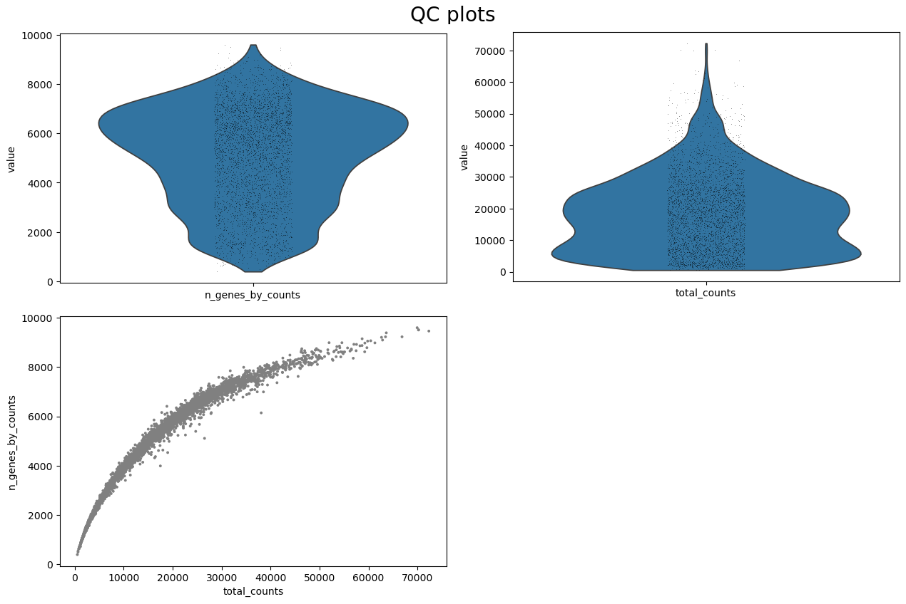

The distributions show how unusual a spot is, but not where it sits. Before removing the tail, map the same QC fields back onto the section.

> <hands-on-title>Map the QC metrics onto histology</hands-on-title>
>
> 1.  with the following parameters:
>    -  *"SpatialData object"*: `V1_Breast_Cancer_Block_A_Section_1.spatialdata.zip`
>    - *"Operation"*: `Import anndata table to a SpatialData object`
>        -  *"annotated data object to add"*: `QC metrics before filtering`
>        - *"Table name"*: `table_qc`
>
> 2.  with the following parameters:
>    -  *"SpatialData object"*: output of **SpatialData Operations** 
>    - In *"Render Images"*:
>        - *"Image element name"*: `V1_Breast_Cancer_Block_A_Section_1_hires_image`
>    - In *"Render Shapes"*:
>        - *"Shapes element name"*: `V1_Breast_Cancer_Block_A_Section_1`
>        - *"Color column"*: `total_counts`
>        - *"Scale factor"*: `1.0`
>        - *"Table name"*: `table_qc`
>    - In *"Plot Display Parameters"*:
>        - *"Coordinate system(s)"*: `V1_Breast_Cancer_Block_A_Section_1`
>        - *"Legend location"*: `Right margin`
>        - *"Enable colorbars?"*: `Yes`
>        - *"Image format"*: `JPG`
>
>    Rename the output `Spatial Plot total_counts before filtering`.
>
> 3. Repeat **SpatialData Plot** with *"Color column"*: `n_genes_by_counts` and rename the output `Spatial Plot n_genes_by_counts before filtering`.
>
{: .hands_on}

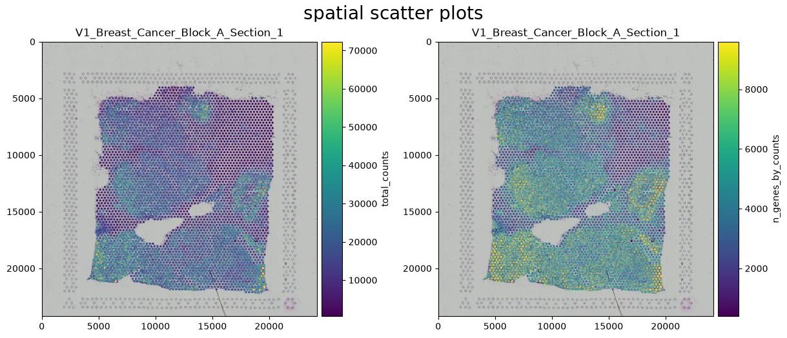

> <question-title>Interpret the QC output</question-title>
>
> 1. Why is `n_genes_by_counts` expected to increase with `total_counts` but not in a perfectly linear way?
> 2. Why is a spatial map useful before removing a low-count tail?
> 3. The minimum is 524 counts, while the later count threshold is 1,000. Does that mean every spot below 1,000 is necessarily a technical failure?
>
> > <solution-title></solution-title>
> >
> > 1. As more transcripts are sampled, an increasing fraction are repeats of genes already detected, so the number of distinct genes does not grow one-for-one with the count total.
> > 2. A low value can be technical, but it can also correspond to tissue with genuinely low RNA abundance or poor cellularity. A spatial map shows whether low values are scattered or associated with a coherent anatomical region that should be reported.
> > 3. No. The threshold is a dataset-specific filtering decision used in this validated workflow, not a biological definition of failure. Its effect must be quantified and interpreted in context.
> >
> {: .solution}
>
{: .question}

# Filtering

The workflow applies six filters sequentially: two lower spot filters, two lower gene filters and two upper spot filters. The important point is not just the thresholds; it is **what each threshold actually removes from this dataset**.

## Lower spot filters

> <hands-on-title>Remove spots with very low detected-gene complexity</hands-on-title>
>
> 1.  with the following parameters:
>    -  *"Annotated data matrix"*: `QC metrics before filtering`
>    - *"Method used for filtering"*: `Filter cell outliers based on counts and numbers of genes expressed, using 'pp.filter_cells'`
>        - *"Filter"*: `Minimum number of genes expressed`
>            - *"Minimum number of genes expressed required for a cell to pass filtering"*: `500`
>
> 2. Rename the generated file `Filter minimum genes expressed per spot`.
>
{: .hands_on}

The wrapper uses the generic Scanpy word **cell** because `pp.filter_cells` filters AnnData observations. In this tutorial those observations are Visium **spots**. The reference output has 3,811 observations, so this first filter removes **2 spots**.

> <hands-on-title>Remove spots with very low total counts</hands-on-title>
>
> 1.  with the following parameters:
>    -  *"Annotated data matrix"*: `Filter minimum genes expressed per spot`
>    - *"Method used for filtering"*: `Filter cell outliers based on counts and numbers of genes expressed, using 'pp.filter_cells'`
>        - *"Filter"*: `Minimum number of counts`
>            - *"Minimum number of counts required for a cell to pass filtering"*: `1000`
>
> 2. Rename the generated file `Filter minimum counts per spot`.
>
> 3.  with the following parameters:
>    -  *"Annotated data matrix"*: `Filter minimum counts per spot`
>    - *"What to inspect?"*: `General information about the object`
>
>    Rename the output `Inspect after minimum spot filters`.
>
>    > <question-title>What did the second threshold add?</question-title>
>    >
>    > ```
>    > AnnData object with n_obs × n_vars = 3800 × 33538
>    > ```
>    >
>    > The first filter left 3,811 spots. How many additional spots did `min_counts = 1000` remove, and what fraction of the starting 3,813 spots have the two filters removed together?
>    >
>    > > <solution-title></solution-title>
>    > >
>    > > The second filter removes 3,811 − 3,800 = **11 spots**. Together, the lower spot filters remove 13 of 3,813 spots, about **0.34%**, retaining approximately 99.66% of the starting observations. The filtering therefore trims a small tail rather than removing a large tissue compartment.
>    > >
>    > {: .solution}
>    >
>    {: .question}
>
{: .hands_on}

## Gene filters

> <hands-on-title>Remove genes detected in too few spots</hands-on-title>
>
> 1.  with the following parameters:
>    -  *"Annotated data matrix"*: `Filter minimum counts per spot`
>    - *"Method used for filtering"*: `Filter genes based on number of cells or counts, using 'pp.filter_genes'`
>        - *"Filter"*: `Minimum number of cells expressed`
>            - *"Minimum number of cells expressed required for a gene to pass filtering"*: `3`
>
> 2. Rename the generated file `Filter minimum spots expressed per gene`.
>
> 3.  with the following parameters:
>    -  *"Annotated data matrix"*: `Filter minimum spots expressed per gene`
>    - *"Method used for filtering"*: `Filter genes based on number of cells or counts, using 'pp.filter_genes'`
>        - *"Filter"*: `Minimum number of counts`
>            - *"Minimum number of counts required for a gene to pass filtering"*: `3`
>
> 4. Rename the generated file `Filter minimum counts per gene`.
>
> 5.  with the following parameters:
>    -  *"Annotated data matrix"*: `Filter minimum counts per gene`
>    - *"What to inspect?"*: `General information about the object`
>
>    Rename the output `Inspect after gene filters`.
>
>    > <question-title>Which gene filter changes the matrix?</question-title>
>    >
>    > ```
>    > AnnData object with n_obs × n_vars = 3800 × 20687
>    > ```
>    >
>    > The `min_cells = 3` output already has 20,687 genes, and the subsequent gene `min_counts = 3` output has the same dimensions. How many genes did the first gene filter remove, and what does the unchanged second step tell you?
>    >
>    > > <solution-title></solution-title>
>    > >
>    > > 33,538 − 20,687 = **12,851 genes** are removed by the requirement that a gene be detected in at least three spots. The following `min_counts = 3` step removes none, because every gene that survived the first criterion already has at least three counts in total in this dataset. The second threshold is still part of the documented workflow, but its observed effect here is zero.
>    > >
>    > {: .solution}
>    >
>    {: .question}
>
{: .hands_on}

> <comment-title>Minimum counts, not maximum counts</comment-title>
>
> The fourth filter is **gene `min_counts = 3`**. Earlier tutorial versions incorrectly described this as a maximum-count filter. The current passed workflow and the IUC Scanpy wrapper both use the `pp.filter_genes` **Minimum number of counts** option here.
>
{: .comment}

## Upper spot filters

> <hands-on-title>Check the high-count and high-complexity tails</hands-on-title>
>
> 1.  with the following parameters:
>    -  *"Annotated data matrix"*: `Filter minimum counts per gene`
>    - *"Method used for filtering"*: `Filter cell outliers based on counts and numbers of genes expressed, using 'pp.filter_cells'`
>        - *"Filter"*: `Maximum number of counts`
>            - *"Maximum number of counts required for a cell to pass filtering"*: `75000`
>
> 2. Rename the generated file `Filter maximum counts per spot`.
>
> 3.  with the following parameters:
>    -  *"Annotated data matrix"*: `Filter maximum counts per spot`
>    - *"Method used for filtering"*: `Filter cell outliers based on counts and numbers of genes expressed, using 'pp.filter_cells'`
>        - *"Filter"*: `Maximum number of genes expressed`
>            - *"Maximum number of genes expressed required for a cell to pass filtering"*: `10000`
>
> 4. Rename the generated file `Filter maximum genes per spot`.
>
> 5.  with the following parameters:
>    -  *"Annotated data matrix"*: `Filter maximum genes per spot`
>    - *"What to inspect?"*: `General information about the object`
>
>    Rename the output `Inspect after upper spot filters`.
>
>    > <question-title>Did the upper filters remove anything?</question-title>
>    >
>    > ```
>    > AnnData object with n_obs × n_vars = 3800 × 20687
>    > ```
>    >
>    > What does an unchanged shape tell you, and why is that worth recording rather than deleting the steps from the tutorial?
>    >
>    > > <solution-title></solution-title>
>    > >
>    > > Neither upper threshold removes an additional spot in this run. That is useful information: it shows the observed high tail already falls within the chosen limits after the lower filters. Reporting a zero effect makes the workflow auditable and prevents a reader from assuming those thresholds were never checked.
>    > >
>    > {: .solution}
>    >
>    {: .question}
>
{: .hands_on}

The complete filtering path is therefore:

| Stage | Dimensions | Spots removed at this step | Genes removed at this step |
| --- | ---: | ---: | ---: |
| Start | 3,813 × 33,538 | – | – |
| spot `min_genes = 500` | 3,811 × 33,538 | 2 | 0 |
| spot `min_counts = 1000` | 3,800 × 33,538 | 11 | 0 |
| gene `min_cells = 3` | 3,800 × 20,687 | 0 | 12,851 |
| gene `min_counts = 3` | 3,800 × 20,687 | 0 | 0 |
| spot `max_counts = 75000` | 3,800 × 20,687 | 0 | 0 |
| spot `max_genes = 10000` | 3,800 × 20,687 | 0 | 0 |

# Recalculate QC after filtering

The filtering itself modifies the matrix; the QC fields should therefore be recalculated on the retained spots and genes rather than carrying the old summaries forward.

> <hands-on-title>Recompute and visualise post-filter QC</hands-on-title>
>
> 1.  with the following parameters:
>    -  *"Annotated data matrix"*: `Filter maximum genes per spot`
>    - *"Method used for inspecting"*: `Calculate quality control metrics, using 'pp.calculate_qc_metrics'`
>        - *"Name of kind of values in X"*: `counts`
>        - *"The kind of thing the variables are"*: `genes`
>        - *"Proportions of top genes to cover"*: `50,100,200,300`
>        - *"Use 'raw' attribute of input if present"*: `No`
>        - *"Compute log1p transformed annotations"*: `Yes`
>
> 2. Rename the generated file `QC metrics after filtering`.
>
> 3. Repeat the Scanpy scatter plot from the pre-filter section on this object and rename it `Scatter plot after filtering`.
>
> 4. Repeat the two-panel Scanpy violin plot for `n_genes_by_counts, total_counts` and rename it `Violin plots after filtering`.
>
> 5.  with the following parameters:
>    -  *"SpatialData object"*: `V1_Breast_Cancer_Block_A_Section_1.spatialdata.zip`
>    - *"Operation"*: `Import anndata table to a SpatialData object`
>        -  *"annotated data object to add"*: `QC metrics after filtering`
>        - *"Table name"*: `table_qc_filtered`
>
> 6. Plot `total_counts` and `n_genes_by_counts` over the Visium shapes with the same SpatialData Plot settings used before filtering, changing *"Table name"* to `table_qc_filtered`. Rename the two outputs `Spatial Plot total_counts after filtering` and `Spatial Plot n_genes_by_counts after filtering`.
>
{: .hands_on}

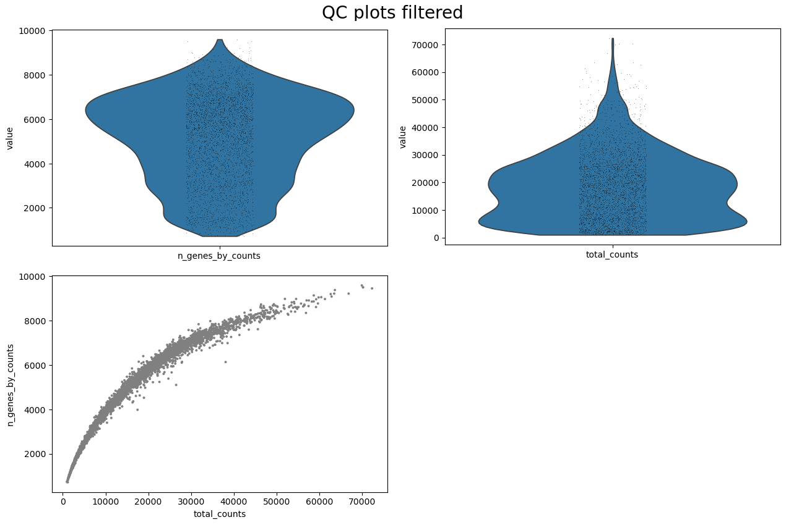

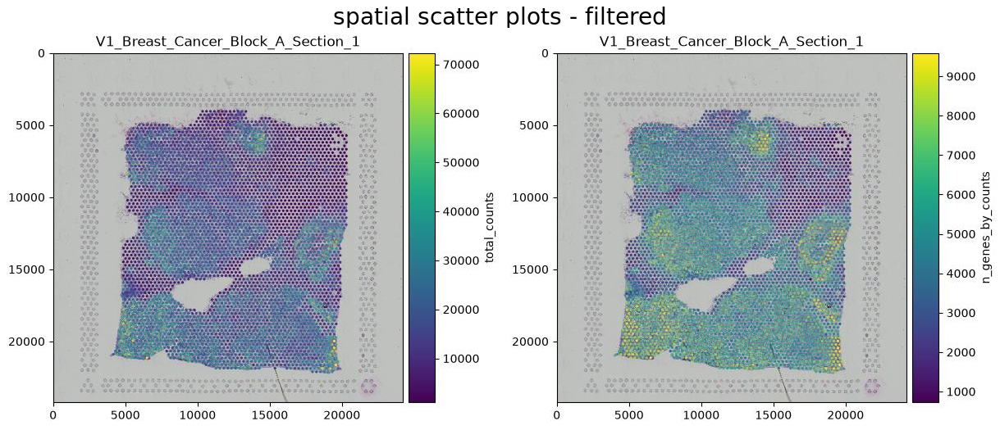

After filtering, the median `total_counts` is **17,588** and the median `n_genes_by_counts` is **5,401.5**. Their small increase is consistent with trimming a small low-information tail rather than removing a large part of the section.

# Normalisation and highly variable genes

Count depth differs between spots. `pp.normalize_total` rescales each spot so that its expression sums to the same target, and `pp.log1p` compresses the dynamic range. The validated main branch uses a target sum of **10,000 counts per spot**, which also produces the form of log-normalised expression expected later by CellTypist ().

> <hands-on-title>Normalise and log-transform the filtered expression matrix</hands-on-title>
>
> 1.  with the following parameters:
>    -  *"Annotated data matrix"*: `QC metrics after filtering`
>    - *"Method used for normalization"*: `Normalize counts per cell, using 'pp.normalize_total'`
>        - *"Target sum"*: `10000.0`
>        - *"Exclude (very) highly expressed genes for the computation of the normalization factor (size factor) for each cell"*: `No`
>
> 2. Rename the generated file `Normalised AnnData`.
>
> 3.  with the following parameters:
>    -  *"Annotated data matrix"*: `Normalised AnnData`
>    - *"Method used for inspecting"*: `Logarithmize the data matrix, using 'pp.log1p'`
>
> 4. Rename the generated file `Log-normalised AnnData`.
>
{: .hands_on}

Highly variable genes (HVGs) are genes whose between-spot variation is high relative to genes of similar abundance. They are useful for building an embedding around the most informative expression differences rather than letting thousands of nearly uniform genes contribute equal noise.

> <hands-on-title>Identify highly variable genes</hands-on-title>
>
> 1.  with the following parameters:
>    -  *"Annotated data matrix"*: `Log-normalised AnnData`
>    - *"Method used for filtering"*: `Annotate (and filter) highly variable genes, using 'pp.highly_variable_genes'`
>        - *"Choose the flavor for identifying highly variable genes"*: `Cell Ranger`
>            - *"Number of highly-variable genes to keep"*: `3000`
>        - *"Number of bins for binning the mean gene expression"*: `20`
>        - *"Inplace subset to highly-variable genes"*: `No`
>
> 2. Rename the generated file `AnnData with HVGs`.
>
> 3.  with the following parameters:
>    -  *"Annotated data matrix"*: `AnnData with HVGs`
>    - *"Method used for plotting"*: `Preprocessing: Plot dispersions versus means for genes, using 'pl.highly_variable_genes'`
>
>    Rename the output `Plot HVGs`.
>
{: .hands_on}

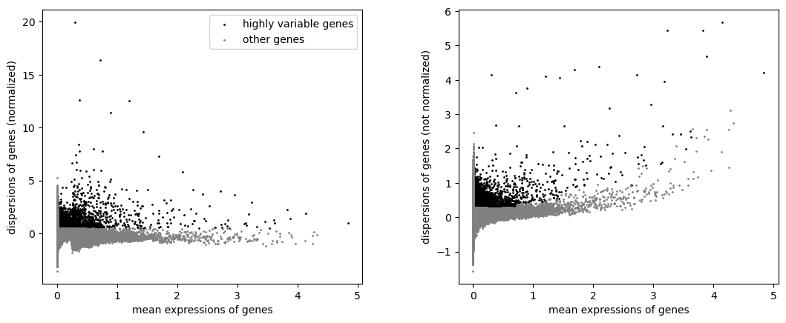

The object still contains **20,687 genes**; exactly **3,000** are marked as highly variable. `Inplace subset to highly-variable genes = No` is important here: PCA can use the HVG flag without deleting the other genes, so ranked-gene analysis, CellTypist and LIANA still have access to the wider log-normalised expression matrix.

> <question-title>Feature selection is not feature deletion</question-title>
>
> If the object still contains 20,687 genes, what does “3,000 HVGs” mean, and why is that distinction important later?
>
> > <solution-title></solution-title>
> >
> > The 3,000 genes are flagged as highly variable and are the informative feature set used by PCA; the remaining genes stay in the object because subsetting is disabled. A gene does not have to drive PCA to be biologically useful as a marker, reference feature or ligand/receptor partner.
> >
> {: .solution}
>
{: .question}

# PCA and an optional total-count regression comparison

PCA reduces correlated gene-expression variation to a smaller set of orthogonal components (). The passed workflow computes a **50-component PCA on the non-regressed log-normalised branch**, and that is the PCA used for the main neighbour graph.

The workflow also branches from `AnnData with HVGs` into `pp.regress_out(total_counts)` and calculates a second PCA. This is a QC comparison, not a replacement for the main expression path. `regress_out` replaces `.X` with residuals, which can be negative; those residuals no longer satisfy the log-normalised 10,000-count interpretation required by CellTypist.

> <hands-on-title>Run the main PCA</hands-on-title>
>
> 1.  with the following parameters:
>    -  *"Annotated data matrix"*: `AnnData with HVGs`
>    - *"Method used"*: `Computes PCA (principal component analysis) coordinates, loadings and variance decomposition, using 'pp.pca'`
>        - *"Number of principal components to compute"*: `50`
>        - *"Change to use different initial states for the optimization"*: `0`
>        - *"Zero center"*: `Yes`
>        - *"Data type of the output"*: `float32`
>
> 2. Rename the generated file `AnnData with PCA`.
>
> 3.  with the following parameters:
>    -  *"Annotated data matrix"*: `AnnData with PCA`
>    - *"Method used for plotting"*: `PCA: Scatter plot in PCA coordinates, using 'pl.pca'`
>        - *"Keys for annotations of observations/cells or variables/genes"*: `log1p_total_counts,log1p_n_genes_by_counts,total_counts`
>
>    Rename the output `Plot PCA before regression`.
>
{: .hands_on}

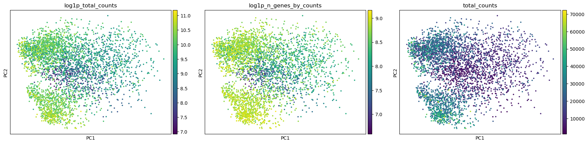

In the reference object, `total_counts` correlates with PC1 at approximately **−0.434** and PC2 at **−0.240**. Count depth therefore contributes to early variation, but correlation alone does not tell us whether that variation is purely technical or partly biological.

> <hands-on-title>Optional: regress total counts and compare the PCA</hands-on-title>
>
> Start from `AnnData with HVGs` again. This is a parallel branch; do not use `AnnData with PCA` as the regression input.
>
> 1.  with the following parameters:
>    -  *"Annotated data matrix"*: `AnnData with HVGs`
>    - *"Method used for plotting"*: `Regress out unwanted sources of variation, using 'pp.regress_out'`
>        - *"Keys for observation annotation on which to regress on"*: `total_counts`
>
> 2. Rename the generated file `AnnData regressed for total_counts`.
>
> 3. Run  on `AnnData regressed for total_counts` with the same PCA parameters used above. Rename the result `PCA after regression AnnData`.
>
> 4. Plot that PCA with the same three colour fields and rename the output `Plot PCA after regression`.
>
{: .hands_on}

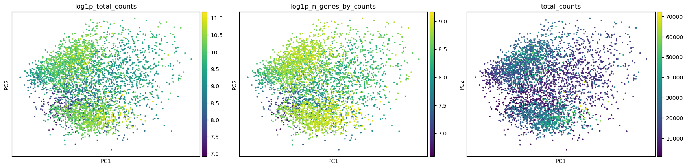

After regression, the association between `total_counts` and the first PCs is effectively zero. That shows the operation did what it was asked to do; it does **not** show that the residualised matrix is biologically preferable. Total RNA content can covary with real cell composition and tissue structure, so removing it can remove biological signal as well as technical depth effects.

> <question-title>Which branch should continue?</question-title>
>
> 1. Why is the post-regression PCA useful even though it is not used for the main clustering branch?
> 2. Why would sending the residualised `.X` to CellTypist be a category error?
>
> > <solution-title></solution-title>
> >
> > 1. It is a diagnostic comparison: it shows how strongly the early components change when the total-count association is removed. That helps you judge whether depth is influencing the embedding without automatically deciding that every depth-associated component is technical.
> > 2. CellTypist expects log1p-normalised expression scaled to 10,000 counts per observation. `regress_out` replaces `.X` with residuals, including negative values, so the matrix no longer has that interpretation. The workflow therefore keeps CellTypist and the main graph on the non-regressed branch.
> >
> {: .solution}
>
{: .question}

# Build the expression-neighbour graph and UMAP

The main path now continues from **`AnnData with PCA`**, not from `PCA after regression AnnData`. The neighbour graph connects spots with similar PCA profiles. UMAP gives a two-dimensional view of that graph, but it does not recover physical tissue coordinates.

> <hands-on-title>Compute the neighbourhood graph and UMAP</hands-on-title>
>
> 1.  with the following parameters:
>    -  *"Annotated data matrix"*: `AnnData with PCA`
>    - *"Method used for inspecting"*: `Compute a neighborhood graph of observations, using 'pp.neighbors'`
>        - *"The size of local neighborhood (in terms of number of neighboring data points) used for manifold approximation"*: `15`
>        - *"Use a hard threshold to restrict the number of neighbors to n_neighbors?"*: `Yes`
>        - *"Method for computing connectivities"*: `umap (McInnes et al, 2018)`
>        - *"Distance metric"*: `euclidean`
>        - *"Numpy random seed"*: `0`
>
> 2. Rename the generated file `Compute a neighborhood graph of observations`.
>
> 3.  with the following parameters:
>    -  *"Annotated data matrix"*: `Compute a neighborhood graph of observations`
>    - *"Method used"*: `Embed the neighborhood graph using UMAP, using 'tl.umap'`
>        - *"Minimum distance"*: `0.5`
>        - *"Spread"*: `1.0`
>        - *"Random state"*: `0`
>
> 4. Rename the generated file `AnnData with UMAP`.
>
> 5.  with the following parameters:
>    -  *"Annotated data matrix"*: `AnnData with UMAP`
>    - *"Method used for plotting"*: `Embeddings: Scatter plot in UMAP basis, using 'pl.umap'`
>        - *"Keys for annotations of observations/cells or variables/genes"*: `log1p_total_counts,log1p_n_genes_by_counts,total_counts`
>
>    Rename the output `Plot UMAP`.
>
{: .hands_on}

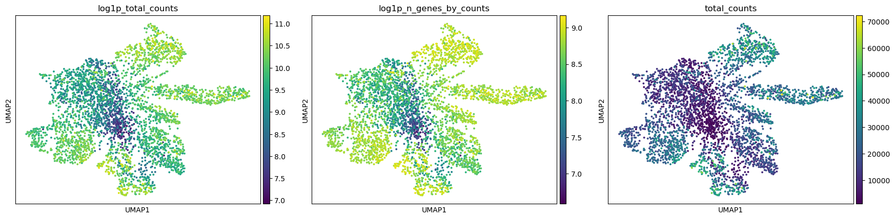

# Clustering at three Leiden resolutions

Leiden clustering partitions a graph into communities (). The resolution controls how readily larger communities are subdivided. No single resolution is intrinsically correct: the useful question is whether an extra split produces stable and interpretable expression programmes or merely fragments an already coherent group.

The learner-facing comparison is deliberately limited to **0.4, 0.8 and 1.2**. Additional 0.6 and 1.0 runs were used during validation of the choice but are not extra tutorial steps.

> <hands-on-title>Cluster the expression-neighbour graph</hands-on-title>
>
> 1.  with the following parameters:
>    -  *"Annotated data matrix"*: `AnnData with UMAP`
>    - *"Method used"*: `Cluster cells into subgroups, using 'tl.leiden'`
>        - *"Coarseness of the clustering"*: `0.4`
>        - *"Key under which to add the cluster labels"*: `leiden_res_0.4`
>        - *"Use weights from knn graph?"*: `Yes`
>        - *"How many iterations of the Leiden clustering algorithm to perform"*: `2`
>        - *"Random state"*: `0`
>
> 2. Rename the generated file `AnnData with leiden_res_0.4`.
>
> 3. Repeat **Scanpy cluster, embed** on that output with resolution `0.8` and key `leiden_res_0.8`, keeping the same weights, iterations and random state. Rename the result `AnnData with Leiden comparison 0.4 and 0.8`.
>
> 4. Repeat the job on that output with resolution `1.2` and key `leiden_res_1.2`. Rename the result `AnnData with Leiden comparison 0.4 and 0.8 and 1.2`.
>
> 5.  with the following parameters:
>    -  *"Annotated data matrix"*: `AnnData with Leiden comparison 0.4 and 0.8 and 1.2`
>    - *"Method used for plotting"*: `Embeddings: Scatter plot in UMAP basis, using 'pl.umap'`
>        - *"Keys for annotations of observations/cells or variables/genes"*: `leiden_res_0.4,leiden_res_0.8,leiden_res_1.2`
>
>    Rename the output `Plot Leiden comparison`.
>
{: .hands_on}

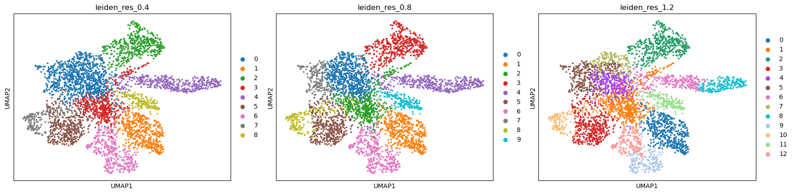

| Resolution | Groups | Largest group | Reading |
| ---: | ---: | ---: | --- |
| 0.4 | 9 | 915 spots | Coarser; some programmes remain merged |
| 0.8 | 10 | 668 spots | Selected intermediate partition |
| 1.2 | 13 | 482 spots | Finer; several populations fragment further |

A useful resolution is not the one whose UMAP looks most attractive. Here the 0.4 and 0.8 partitions have an **ARI of 0.864**, showing substantial agreement. The 0.8 and 1.2 partitions have an **ARI of 0.780**. Weighted graph modularity rises from approximately 0.766 at 0.4 to 0.774 at 0.8 and then essentially stops improving at 1.2, while PCA-space silhouette and weighted neighbour purity decline slightly as the partition becomes finer.

> <details-title>Quantitative checks used to support the resolution choice</details-title>
>
> These diagnostics support interpretation; they do not select a biological resolution automatically. Silhouette was calculated in PCA space rather than from UMAP distances.
>
> | Resolution | ARI versus 0.8 | Weighted modularity | PCA-space silhouette | Weighted neighbour purity |
> | ---: | ---: | ---: | ---: | ---: |
> | 0.4 | 0.864 | 0.766 | 0.118 | 0.910 |
> | 0.8 | — | 0.774 | 0.115 | 0.891 |
> | 1.2 | 0.780 | 0.774 | 0.107 | 0.862 |
>
> The 1.2 run adds three groups without improving weighted modularity over 0.8 and with slightly lower silhouette and neighbour purity. That makes the biological content of the extra splits the deciding evidence rather than the group count itself.
>
{: .details}

One transition is especially informative. At resolution 0.4, a large group labelled `0` contains spots that separate at 0.8. Most remain in `0`, but **196 form group `7`**. The ranked genes below show that this split separates an immune/MHC-II-associated programme from a stronger stromal/ECM programme. That is a biologically interpretable reason to prefer 0.8 over the coarser partition.

> <question-title>Choose a resolution from evidence</question-title>
>
> Which argument best supports carrying `leiden_res_0.8` forward?
>
> A. It creates exactly ten groups, which is a convenient number of cell types.
>
> B. It creates an additional marker-supported split while retaining high agreement with the 0.4 partition, and 1.2 adds fragmentation without improving graph modularity.
>
> C. Its UMAP panel appears visually cleaner than the others.
>
> > <solution-title></solution-title>
> >
> > **B.** Leiden groups are graph partitions, not predefined cell types. Resolution 0.8 is retained because the additional split has coherent marker evidence and the partition remains stable, while the finer 1.2 solution provides diminishing quantitative and interpretive benefit.
> >
> {: .solution}
>
{: .question}

# Rank genes for `leiden_res_0.8`

Marker ranking asks which genes are most different between each selected group and the rest of the spots. This is where a numerical cluster label starts to acquire biological meaning, but the interpretation should remain at the level supported by the genes. In a multicellular Visium spot, a coherent programme is often more defensible than a pure cell-type name.

> <hands-on-title>Rank genes for the selected partition</hands-on-title>
>
> 1.  with the following parameters:
>    -  *"Annotated data matrix"*: `AnnData with Leiden comparison 0.4 and 0.8 and 1.2`
>    - *"Method used for inspecting"*: `Rank genes for characterizing groups, using 'tl.rank_genes_groups'`
>        - *"Get ranked genes as a Tabular file?"*: `True`
>        - *"The key of the observations grouping to consider"*: `leiden_res_0.8`
>        - *"Use 'raw' attribute of input if present"*: `No`
>        - *"Comparison"*: `Compare each group to the union of the rest of the group`
>        - *"Method"*: `Wilcoxon-Rank-Sum`
>            - *"Correction method"*: `Benjamini-Hochberg`
>            - *"Use tie correction for 'wilcoxon' scores"*: `No`
>
> 2. Rename the AnnData output `AnnData with markers` and the table output `Rank genes for characterizing groups`.
>
> 3.  with the following parameters:
>    -  *"Annotated data matrix"*: `AnnData with markers`
>    - *"Method used for plotting"*: `Marker genes: Plot ranking of genes, using 'pl.rank_genes_groups'`
>        - *"Number of genes to show"*: `20`
>        - *"Font size"*: `8`
>        - *"Number of panels per row"*: `4`
>        - *"Share the y-axis across panels"*: `Yes`
>
>    Rename the output `Plot ranking of genes`.
>
{: .hands_on}

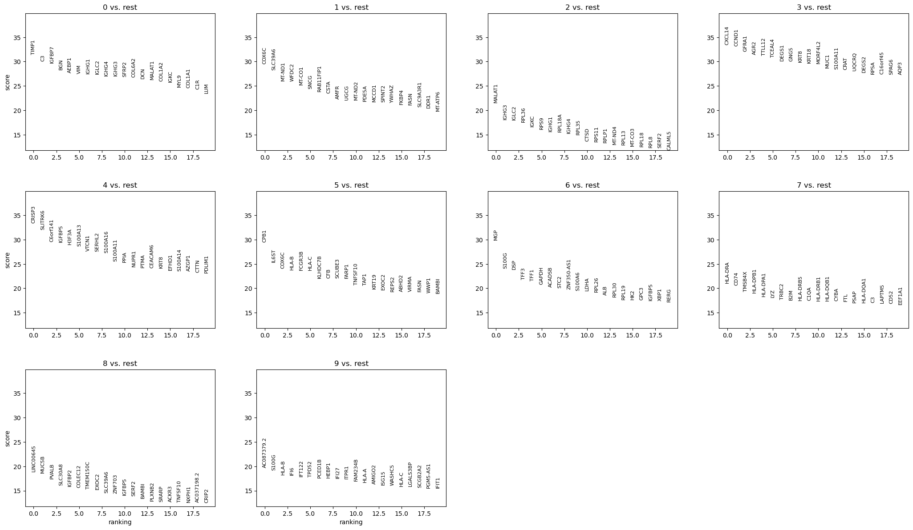

The marker table supports the following conservative descriptions:

| Group | Examples among high-ranked genes | What the evidence supports |
| --- | --- | --- |
| `0` | *TIMP1*, *C3*, *IGFBP7*, *BGN*, *AEBP1*, *VIM*, *SFRP2*, *COL6A2*, *DCN*, *COL1A1*, *COL1A2*, *LUM* | Stromal/ECM-associated programme, with mixed immunoglobulin signal also present |
| `1` | *COX6C*, *SLC39A6*, *WFDC2*, *SNCG* | Epithelial-associated programme; insufficient evidence for a narrow hard label |
| `2` | *MALAT1*, *IGHG3*, *IGLC2*, *IGKC*, *IGHG1* | Immunoglobulin-rich/mixed programme |
| `3` | *CXCL14*, *CCND1*, *GFRA1*, *KRT8*, *KRT18*, *MUC1* | Epithelial-associated programme |
| `4` | *CRISP3*, *SLITRK6*, *IGFBP5*, *VTCN1* | Distinct epithelial/secretory-associated programme |
| `5` | *CPB1*, *HLA-B*, *FCGR3B*, *CFB*, *TAP1* | Mixed programme; keep interpretation cautious |
| `6` | *MGP*, *S100G*, *TFF3*, *TFF1*, *STC2* | Epithelial-associated programme |
| `7` | *HLA-DRA*, *CD74*, *HLA-DPB1*, *HLA-DPA1*, *LYZ*, *C1QA* | Immune/MHC-II-associated programme |
| `8` | *MUC5B*, *PVALB*, *SLC30A8*, *IGFBP2*, *COLEC12* | Distinct but biologically mixed/ambiguous programme |
| `9` | *S100G*, *HLA-B*, *IFI6*, *IFI27*, *HLA-A* | MHC-I/interferon-associated signal in a mixed programme |

The split between groups `0` and `7` is the strongest example of why resolution 0.8 was retained. Group `7` contains the antigen-presentation genes *HLA-DRA*, *CD74*, *HLA-DPB1* and *HLA-DPA1* together with myeloid-associated *LYZ* and *C1QA*. Group `0`, by contrast, contains collagens and matrix-associated genes such as *COL1A1*, *COL1A2*, *COL6A2*, *DCN* and *LUM* alongside *BGN* and *SFRP2*. The programmes are biologically distinct even though neither group can safely be described as a pure single-cell population.

> <question-title>What does a marker list let you claim?</question-title>
>
> Group `7` has a coherent MHC-II/myeloid-associated marker set, while group `0` has a strong extracellular-matrix programme. Why is “immune/MHC-II-associated” versus “stromal/ECM-associated” safer than naming every spot as one exact cell type?
>
> > <solution-title></solution-title>
> >
> > Because the marker ranking describes expression enriched across a group of **spots**, and each spot may mix several cells. The genes support different programmes and tissue compositions, but they do not prove every spot contains only one lineage. A precise cell-type label needs convergence with spatial context, reference transfer and biological knowledge.
> >
> {: .solution}
>
{: .question}

# Spatial statistics with Squidpy

Up to this point, neighbourhood meant **expression similarity**. Squidpy now constructs a separate graph from the Visium coordinates (). Because standard Visium capture spots sit on a regular lattice, the workflow explicitly uses `coord_type = grid` with six neighbours and one ring.

> <hands-on-title>Build the Visium spatial-neighbour graph</hands-on-title>
>
> 1.  with the following parameters:
>    -  *"spatial object (in SpatialData or AnnData format)"*: `AnnData with markers`
>    - *"Operation"*: `Create a graph from spatial coordinates (gr.spatial_neighbors)`
>        - *"Spatial key"*: `spatial`
>        - *"Coordinate type"*: `grid`
>        - *"Number of neighbors"*: `6`
>        - *"Number of rings"*: `1`
>        - *"Delaunay triangulation"*: `No`
>        - *"Set diagonal"*: `No`
>        - *"Key added"*: `spatial`
>
> 2. Rename the generated file `AnnData with spatial neighbours`.
>
{: .hands_on}

The resulting `spatial_connectivities` matrix describes physical adjacency on the capture grid. It does not replace the Scanpy graph used for UMAP and Leiden; both graphs remain in the object for different analyses.

## Centrality and neighbourhood enrichment

Centrality scores summarise how groups sit in the spatial graph. Neighbourhood enrichment asks whether pairs of group labels occur next to each other more or less often than expected after label permutation.

> <hands-on-title>Calculate group-level spatial statistics</hands-on-title>
>
> 1.  with the following parameters:
>    -  *"spatial object (in SpatialData or AnnData format)"*: `AnnData with spatial neighbours`
>    - *"Operation"*: `Compute centrality scores per cluster or cell type (gr.centrality_scores)`
>        - *"Key in adata.obs where clustering is stored"*: `leiden_res_0.8`
>        - *"Connectivity key"*: `spatial_connectivities`
>
> 2. Rename the generated file `AnnData with centrality scores`.
>
> 3.  with the following parameters:
>    -  *"spatial object (in SpatialData or AnnData format)"*: `AnnData with centrality scores`
>    - *"Operation"*: `Plot centrality scores (pl.centrality_scores)`
>        - *"Key in adata.obs where clustering is stored"*: `leiden_res_0.8`
>>
>    Rename the output `Plot Centrality Scores`.
>
> 4.  with the following parameters:
>    -  *"spatial object (in SpatialData or AnnData format)"*: `AnnData with centrality scores`
>    - *"Operation"*: `Compute neighborhood enrichment by permutation test (gr.nhood_enrichment)`
>        - *"Key in adata.obs where clustering is stored"*: `leiden_res_0.8`
>        - *"Connectivity key"*: `spatial_connectivities`
>        - *"Number of permutations"*: `1000`
>
> 5. Rename the generated file `AnnData with neighborhood enrichment`.
>
> 6.  with the following parameters:
>    -  *"spatial object (in SpatialData or AnnData format)"*: `AnnData with neighborhood enrichment`
>    - *"Operation"*: `Plot neighborhood enrichment (pl.nhood_enrichment)`
>        - *"Key in adata.obs where clustering is stored"*: `leiden_res_0.8`
>        - *"Mode"*: `zscore`
>        - *"Annotate cells"*: `No`
>        - *"Color map"*: `viridis`
>>
>    Rename the output `Plot Neighborhood Enrichment`.
>
{: .hands_on}

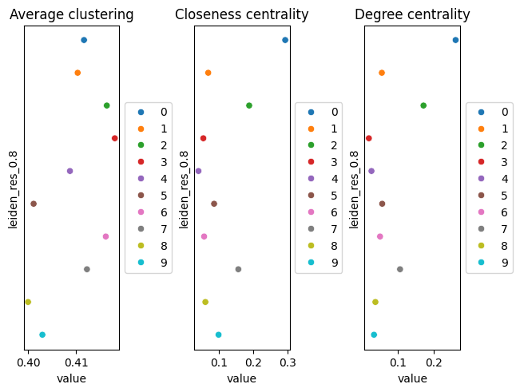

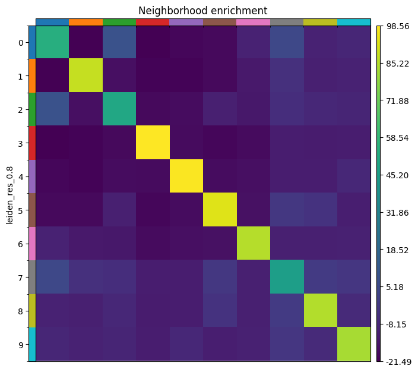

In this run, group `0` has the highest closeness centrality (approximately **0.292**) and degree centrality (approximately **0.261**). Those values say that its spots occupy a well-connected position in this spatial graph; they do not make group `0` biologically “more important”.

Among the strongest positive off-diagonal enrichments are groups `0`–`2` (**z ≈ 8.54**) and `0`–`7` (**z ≈ 4.54**). Group pair `0`–`3` is strongly depleted (**z ≈ −21.67**). A positive z-score supports **non-random adjacency** between labels. It does not identify a ligand, receptor or signalling direction.

> <question-title>Adjacency is not communication</question-title>
>
> Groups `0` and `7` are adjacent more often than expected. Which statement is justified?
>
> A. Group `0` sends a signal to group `7`.
>
> B. Spots carrying labels `0` and `7` share edges in the Visium spatial graph more often than expected under the permutation null.
>
> > <solution-title></solution-title>
> >
> > **B.** The enrichment analysis works on labels and physical adjacency. It contains no ligand-receptor model and establishes neither molecular interaction nor causal direction.
> >
> {: .solution}
>
{: .question}

## Spatial autocorrelation with Moran's I

Moran's I asks whether expression values for a gene are spatially autocorrelated over the graph: a high positive value means similar expression tends to occur in neighbouring spots. It is a statement about pattern, not mechanism.

> <hands-on-title>Calculate Moran's I</hands-on-title>
>
> 1.  with the following parameters:
>    -  *"spatial object (in SpatialData or AnnData format)"*: `AnnData with neighborhood enrichment`
>    - *"Operation"*: `Calculate Global Autocorrelation Statistic (Moran’s I or Geary's C) (gr.spatial_autocorr)`
>        - *"Connectivity key"*: `spatial_connectivities`
>        - *"Mode"*: `Moran's I`
>        - *"Attribute"*: `X`
>        - *"Transformation"*: `Yes`
>        - *"Number of permutations"*: `1000`
>        - *"Two tailed"*: `No`
>        - *"Use raw counts"*: `No`
>
> 2. Rename the generated file `AnnData with Moran's I`.
>
{: .hands_on}

Genes near the top of the reference ranking include:

| Gene | Moran's I | Reading |
| --- | ---: | --- |
| *CRISP3* | 0.736 | Strongly localised expression pattern |
| *IGLC2* | 0.704 | Spatially structured immunoglobulin-associated signal |
| *CPB1* | 0.703 | Strong spatial structure in this section |
| *ALB* | 0.644 | Spatially patterned expression |
| *SLITRK6* | 0.630 | Spatially patterned epithelial-associated signal |
| *IGHG1* | 0.626 | Spatially structured immunoglobulin-associated signal |
| *S100G* | 0.609 | Spatially patterned expression |
| *CXCL14* | 0.607 | Spatially patterned chemokine expression |
| *C3* | 0.566 | Spatial structure in the stromal/ECM-associated programme |
| *TIMP1* | 0.527 | Spatial structure in the stromal/ECM-associated programme |

> <question-title>What does a high Moran's I leave unanswered?</question-title>
>
> *CRISP3* has Moran's I ≈ 0.736. Which of the following still requires additional evidence: whether its expression is spatially patterned, why that pattern occurs, or whether the gene causes the neighbouring tissue state?
>
> > <solution-title></solution-title>
> >
> > The statistic supports the first statement: expression is spatially autocorrelated on this graph. The **cause** of the pattern and any **functional effect** remain unanswered. A spatial statistic does not provide a mechanism.
> >
> {: .solution}
>
{: .question}

# Reference-based annotation with CellTypist

CellTypist was designed to compare query expression profiles with labelled single-cell references (). The model used here contains cell states from adult human breast tissue (). For this Visium analysis, the appropriate interpretation is therefore **reference-based label transfer**: each mixed spot is assigned the reference profile with the largest score, not proven to be one cell of that type.

The input is `AnnData with Moran's I`, which still carries the **non-regressed**, log1p-normalised expression matrix scaled to 10,000 counts per spot.

> <hands-on-title>Transfer adult-breast reference labels to the spots</hands-on-title>
>
> 1.  with the following parameters:
>    -  *"Input AnnData file"*: `AnnData with Moran's I`
>    - *"Model source"*: `Use a cached model`
>        - *"Choose CellTypist model"*: `cell types from the adult human breast (v1)`
>    - *"Annotation mode"*: `Choose the cell type with the largest score/probability as the final prediction`
>    - *"Probability threshold"*: `0.5`
>    - *"Refine the predicted labels by running the majority voting classifier after over-clustering"*: `No`
>>    - *"Generate a dotplot of the predicted cell types"*: `Yes`
>        - *"Reference column in AnnData.obs for dotplot"*: `leiden_res_0.8`
>        - *"Prediction to plot"*: `predicted_labels`
>>
> 2. Rename the AnnData output `CellTypist-annotated AnnData` and the plot output `Plot CellTypist predicted labels`.
>
{: .hands_on}

The direct result contains **35 distinct `predicted_labels`** across 3,800 spots. The most frequent are:

| Reference label | Spots | Percentage |
| --- | ---: | ---: |
| `plasma_IgG` | 1,576 | 41.47% |
| `LummHR-SCGB` | 1,284 | 33.79% |
| `CD8-activated` | 211 | 5.55% |
| `Lumsec-prol` | 144 | 3.79% |
| `Macro-lipo` | 104 | 2.74% |
| `LummHR-major` | 99 | 2.61% |
| `Fibro-matrix` | 86 | 2.26% |

The median CellTypist confidence across spots is approximately **0.695**. A confidence score describes the classifier's support for its closest reference category; it does not measure how many underlying cells in a Visium spot belong to that category.

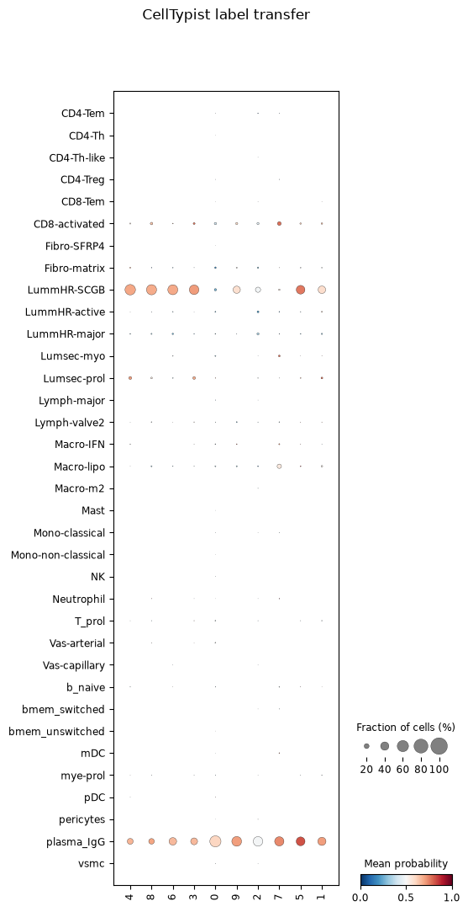

The disagreement with marker evidence is informative. Group `0` has a strong stromal/ECM marker programme, yet **396 of its 668 spots (59.3%)** have `plasma_IgG` as the closest reference match. Group `7` has the immune/MHC-II marker programme, but its predictions are distributed across several reference categories, including `plasma_IgG`, `Macro-lipo` and `CD8-activated`. The classifier and marker ranking are not answering exactly the same question, and mixed spots can pull a reference match toward a highly expressed component.

> <details-title>Why majority voting is disabled in this tutorial</details-title>
>
> An earlier validation run retained the same 35 direct predictions but then applied CellTypist majority voting. The voting column collapsed the 3,800 spots to only three labels: `plasma_IgG` (2,084 spots), `LummHR-SCGB` (1,690) and `Fibro-matrix` (26). That aggregation hid much of the direct reference diversity and made the presentation less informative for multicellular Visium spots.
>
> The passed workflow therefore sets majority voting to **No** and plots `predicted_labels` directly.
>
{: .details}

> <question-title>Is a CellTypist label a cell identity?</question-title>
>
> Which sentence is better supported by this experiment?
>
> A. “This spot is a plasma cell.”
>
> B. “This spot has its closest reference match to the `plasma_IgG` profile.”
>
> > <solution-title></solution-title>
> >
> > **B.** The measurement is a Visium spot that can contain RNA from several cells. CellTypist reports transcriptional similarity to categories in a single-cell reference. A defensible interpretation combines that result with Leiden markers, spatial position, histology and biological knowledge.
> >
> {: .solution}
>
{: .question}

# Ligand-receptor rankings with LIANA

LIANA combines ligand-receptor resources and inference methods to rank expression-compatible source-to-target pairs (, ). Here the source and target categories are the **`leiden_res_0.8` groups of Visium spots**, not purified cell populations. That distinction makes the results hypotheses about tissue regions/programmes rather than direct observations of cell-to-cell signalling.

> <hands-on-title>Rank candidate ligand-receptor pairs</hands-on-title>
>
> 1.  with the following parameters:
>    -  *"Annotated data matrix"*: `CellTypist-annotated AnnData`
>    - *"Method for ligand-receptor inference"*: `Aggregate ligand-receptor scores from multiple methods (rank_aggregate)`
>        - *"Group By"*: `leiden_res_0.8`
>        - *"Interaction source"*: `Use built-in database`
>            - *"Resource source"*: `Download from LIANA API`
>            - *"Resource name"*: `consensus`
>        - *"Expression proportion"*: `0.1`
>        - *"Minimum number of cells"*: `5`
>        - *"Subset cell type pairs"*: `Use all possible combinations`
>        - *"Aggregation method"*: `RobustRankAggregate (rra)`
>        - *"Consensus options"*: `Default (Specificity and Magnitude)`
>        - *"Return all ligand-receptor pairs"*: `No`
>        - *"Results key in adata.uns"*: `liana_res`
>        - *"Use raw counts"*: `No`
>        - *"Differential expression method"*: `t-test`
>        - *"Number of permutations"*: `1000`
>        - *"Random seed"*: `1337`
>
> 2. Rename the generated file `Final LIANA AnnData`.
>
{: .hands_on}

The retained `liana_res` table contains **101,684 source/target/LR rows** before compact evidence selection. Examples near the top of the specificity-oriented ranking include:

| Source | Target | Ligand | Receptor | Specificity rank |
| --- | --- | --- | --- | ---: |
| `7` | `7` | *CCL19* | *CCR7* | 7.79 × 10⁻⁹ |
| `0` | `7` | *C3* | *CD19* | 8.39 × 10⁻⁹ |
| `7` | `7` | *CXCL12* | *CXCR4* | 2.25 × 10⁻⁸ |
| `3` | `7` | *CXCL14* | *CXCR4* | 1.04 × 10⁻⁷ |
| `0` | `7` | *CXCL12* | *CXCR4* | 1.62 × 10⁻⁷ |

A small rank means a pair scores highly under the selected aggregate criterion. It does **not** prove that the ligand reaches the receptor, that the receptor is active, or that the interaction changes a phenotype. Spatial evidence is also separate: for example, groups `0` and `7` have enriched adjacency, which makes some cross-group candidates more spatially plausible, but even the combination of adjacency and expression remains observational.

> <question-title>Read LIANA together with the spatial graph</question-title>
>
> `CXCL12`–`CXCR4` ranks highly for a `0` → `7` source-target combination, and groups `0` and `7` are spatially enriched neighbours. What can you conclude?
>
> > <solution-title></solution-title>
> >
> > The two analyses provide **convergent observational evidence**: the groups are adjacent more often than expected, and their expression is compatible with the ranked ligand-receptor pair. That makes the pair a stronger candidate for follow-up than an expression-only hit between spatially separated groups. It still does not demonstrate direct molecular contact, receptor activation, direction of effect or causality.
> >
> {: .solution}
>
{: .question}

> <comment-title>What would make a ligand-receptor candidate worth following up?</comment-title>
>
> Look for several independent forms of support: ligand and receptor expression in the relevant source and target groups; a good specificity as well as magnitude ranking; spatial adjacency or a biologically plausible diffusible mechanism; marker genes that independently support the interpretation of the source and target programmes; literature in breast cancer or the relevant tissue context; and replication in another section. Protein-level or perturbation evidence is needed before the language moves from “candidate” to a functional interaction.
>
{: .comment}

# Return the processed table to SpatialData

The analysis results now live in AnnData: QC fields, PCA and UMAP coordinates, three Leiden assignments, ranked-gene metadata, the Squidpy graph/statistics, CellTypist annotations and LIANA results. The final workflow operation puts that processed table back next to the image and spot geometry so every annotation can be checked against the tissue it came from.

> <hands-on-title>Create the final processed SpatialData object</hands-on-title>
>
> 1.  with the following parameters:
>    -  *"SpatialData object"*: `V1_Breast_Cancer_Block_A_Section_1.spatialdata.zip`
>    - *"Operation"*: `Import anndata table to a SpatialData object`
>        -  *"annotated data object to add"*: `Final LIANA AnnData`
>        - *"Table name"*: `table_processed`
>
> 2.  with the following parameters:
>    -  *"SpatialData object"*: output of **SpatialData Operations** 
>    - In *"Render Images"*:
>        - *"Image element name"*: `V1_Breast_Cancer_Block_A_Section_1_hires_image`
>    - In *"Render Shapes"*:
>        - *"Shapes element name"*: `V1_Breast_Cancer_Block_A_Section_1`
>        - *"Color column"*: `leiden_res_0.8`
>        - *"Scale factor"*: `1.0`
>        - *"Table name"*: `table_processed`
>    - In *"Plot Display Parameters"*:
>        - *"Coordinate system(s)"*: `V1_Breast_Cancer_Block_A_Section_1`
>        - *"Legend location"*: `Right margin`
>        - *"Enable colorbars?"*: `Yes`
>        - *"Image format"*: `JPG`
>
> 3. Rename the plot output `Plot spatial clusters`.
>
{: .hands_on}

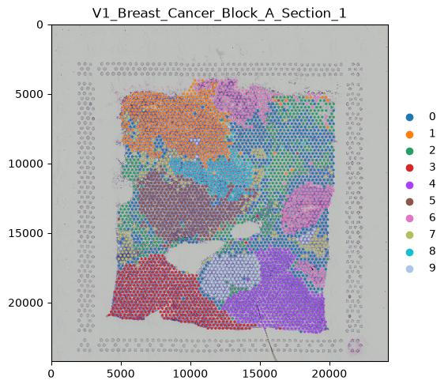

The tissue view is the final consistency check. A UMAP group that looked coherent in expression space can now be judged against histology and neighbouring groups. Group territories that are spatially coherent strengthen the interpretation that clustering has captured reproducible tissue programmes, while mixed boundaries are expected where Visium spots collect RNA from more than one cell population.

> <question-title>Integrate all four sources of evidence</question-title>
>
> Consider group `7`: marker ranking supports an immune/MHC-II programme; CellTypist assigns several different adult-breast reference matches within it; neighbourhood enrichment shows non-random adjacency with group `0`; and the final map shows where those spots sit on the tissue. Which result should be treated as the “ground truth” label?
>
> > <solution-title></solution-title>
> >
> > None of them is ground truth on its own. The marker genes give direct evidence for the programme enriched in the group, CellTypist provides external reference similarity, Squidpy describes physical arrangement, and the histology provides tissue context. The defensible interpretation is the one that remains consistent across these forms of evidence while respecting the mixed-cell nature of a Visium spot.
> >
> {: .solution}
>
{: .question}

# Conclusion

We analysed the **Human Breast Cancer, Block A Section 1** Visium tissue section as a spatial transcriptomics experiment rather than as a single-cell dataset. The prepared expression table began with **3,813 capture spots × 33,538 genes**. Sequential spot and gene filtering retained **3,800 spots × 20,687 genes**: only 13 spots were removed, while the requirement that a gene be detected in at least three spots removed 12,851 rarely detected features.

The filtered expression matrix was normalised to **10,000 counts per spot**, log-transformed and annotated with **3,000 highly variable genes** without subsetting away the remaining genes. The main 50-component PCA was calculated on this non-regressed log-normalised branch and used to build a **15-neighbour expression graph** and UMAP. A separate `regress_out(total_counts)` branch showed that the association of early PCs with total count could be removed, but that residualised matrix was deliberately kept out of CellTypist and the main graph because it no longer represents log-normalised expression.

Leiden resolutions **0.4, 0.8 and 1.2** yielded **9, 10 and 13 groups**. Resolution 0.8 was carried forward because it preserved substantial agreement with 0.4 while adding an interpretable split: group `7` gained an immune/MHC-II-associated programme containing *HLA-DRA*, *CD74*, *HLA-DPB1*, *HLA-DPA1*, *LYZ* and *C1QA*, while group `0` retained a stronger stromal/ECM programme containing *TIMP1*, *C3*, *BGN*, *SFRP2*, *COL6A2*, *COL1A1*, *COL1A2*, *DCN* and *LUM*. The finer 1.2 solution added fragmentation without improving weighted modularity over 0.8.

Squidpy then replaced expression similarity with **physical adjacency on the Visium grid**. Centrality described graph position, neighbourhood enrichment described label adjacency relative to permutation, and Moran's I identified spatially autocorrelated genes such as *CRISP3*, *IGLC2* and *CPB1*. Those analyses established spatial structure, not a signalling mechanism.

CellTypist supplied **35 direct adult-breast reference matches** with majority voting disabled. The mismatch between some reference labels and group markers is a useful property of the exercise: it demonstrates why a mixed Visium spot should be described as having a **closest reference match**, not as being one particular cell. LIANA then ranked candidate ligand-receptor relationships between the selected Leiden groups. These rankings can be strengthened by spatial adjacency and marker evidence but remain hypotheses until supported by orthogonal or functional validation.

Finally, the processed AnnData table was returned to the original SpatialData object as `table_processed`, and `leiden_res_0.8` was drawn over the histology. The final object therefore keeps expression-derived groups, reference annotations, spatial statistics and ligand-receptor rankings attached to the tissue coordinates that give them context.
