Cutaneous melanoma arises from melanocytes and grows inside skin that already contains keratinocytes, fibroblasts, blood vessels, and both resident and recruited immune cells. Where those populations sit relative to the tumour carries information that a dissociated measurement throws away: immune cells at a tumour margin behave differently from immune cells excluded from it, and the spatial arrangement of myeloid and lymphoid populations in primary melanoma changes as a lesion progresses (). {ST} records gene expression together with the position of each measurement, so expression can be compared with the tissue image and with neighbouring cells, which is what makes a {TME} accessible to analysis.

This tutorial uses the 10x Genomics **FFPE Human Skin Primary Dermal Melanoma** dataset, generated with the Xenium Prime 5K Human Pan Tissue and Pathways Panel (). 10x Genomics describes the sample as a primary dermal melanoma from the right lower extremity, with abundant tumour cells in the dermis, necrosis along the outer edge of the dermis, and pyknotic nuclei indicating cell death. The published run metrics are 112,551 cells detected and a median of 306 transcripts per cell. The panel used for this preview dataset was a development version targeting 5,006 genes, and the data are licensed CC BY 4.0.

Xenium differs from Visium in a way that changes the whole analysis. Visium measures barcoded capture spots, each of which can hold several cells, so any group of spots is a mixture. Xenium images individual transcripts and assigns them to segmented cells, so each row of the expression table is intended to be one cell. That makes cell-level annotation meaningful, and it brings failure modes that spot-based assays do not have: a segmentation boundary can merge two neighbouring cells into one object, or cut one cell into two. The morphological measurements Xenium reports for every cell, such as `cell_area` and `nucleus_area`, are therefore {QC} metrics alongside transcript counts.

We will start from the raw Xenium output bundle and build a SpatialData object, then analyse it: {QC} before and after filtering, normalisation and feature selection, {PCA} and {UMAP}, three Leiden resolutions, ranked genes, Squidpy spatial statistics, CellTypist annotation, LIANA rankings, and finally the processed table written back into the spatial object.



> <agenda-title></agenda-title>
>
> In this tutorial, we will cover:
>
> 1. TOC
> {:toc}
>
{: .agenda}

# Analysis strategy


Two different graphs are built during this analysis, and keeping them apart is the most useful distinction in the tutorial:

1. Scanpy builds an **expression-neighbour graph** from {PCA} coordinates. Cells with similar expression profiles are connected. Leiden clustering and {UMAP} both use these connections ().
2. Squidpy builds a **spatial-neighbour graph** from the cell coordinates. Cells that are physically close in the section are connected ().

A **Leiden group** is simply the set of cells given the same Leiden label. It becomes a candidate cell population only when its ranked genes, its position in the tissue and its {QC} profile all point the same way.

| Analysis stage | Purpose | Main output |
| --- | --- | --- |
| SpatialData IO | Read the Xenium output bundle into one object holding images, segmentation labels, transcripts and the expression table | SpatialData archive |
| Scanpy {QC} | Examine transcript content and segmented cell size, filter cells and genes, map the metrics onto the tissue | {QC} panels before and after filtering |
| Scanpy preprocessing | Normalise, log-transform, select highly variable genes and scale | Log-normalised object with {HVG} annotation |
| Scanpy clustering | Calculate {PCA}, build the expression-neighbour graph, generate {UMAP}, compare three Leiden resolutions | Embeddings and three sets of Leiden labels |
| Ranked genes | Rank genes for every group in the selected partition | Ranked-gene table and per-group plot |
| Squidpy | Build the spatial-neighbour graph, calculate adjacency statistics and spatial autocorrelation | Centrality scores, neighbourhood enrichment, Moran's I |
| CellTypist | Compare each cell with a healthy adult skin reference and refine by majority voting | Predicted labels, majority-voting labels, confidence scores |
| LIANA | Rank candidate {LR} pairs between Leiden groups | Ranked source-to-target {LR} table |
| SpatialData output | Write the processed table back into the spatial object | Archive containing `table_processed` |

> <question-title></question-title>
>
> 1. What is the difference between the expression-neighbour graph and the spatial-neighbour graph?
> 2. Name one {QC} problem that Xenium has and Visium does not.
>
> > <solution-title></solution-title>
> >
> > 1. The expression graph connects cells with similar {PCA} profiles, wherever they sit in the section. The spatial graph connects cells that are physically near one another, whatever they express.
> > 2. Cell segmentation error. A boundary drawn around two adjacent cells produces one object carrying the transcripts of both, and a boundary drawn through one cell splits it. Visium capture spots are a fixed array and are not segmented, so they cannot be merged or split this way, although each spot is still a mixture of cells.
> >
> {: .solution}
>
{: .question}

# Building the SpatialData object

The Xenium Analyzer writes an output bundle rather than a single file. The expression matrix, the cell metadata, the segmentation boundaries, the decoded transcripts and the morphology images all arrive as separate files, in several different formats. SpatialData was designed to hold exactly this kind of multi-modal output in one object, with all elements aligned to a shared coordinate system ().

These are the files from the bundle that we need:

| File | Format | Contents |
| --- | --- | --- |
| `cell_feature_matrix.h5` | HDF5 | Counts per gene per segmented cell |
| `cells.parquet` | Parquet | Per-cell metadata, including centroid coordinates, `cell_area` and `nucleus_area` |
| `cells.zarr.zip` | Zarr archive | Segmentation masks for cells and nuclei |
| `experiment.xenium` | JSON | Run specifications, including pixel size and channel names |
| `morphology_focus_0000.ome.tif` to `0003.ome.tif` | OME-TIFF | The multi-channel morphology image |
| `cell_boundaries.parquet` | Parquet | Cell boundary polygons |
| `nucleus_boundaries.parquet` | Parquet | Nucleus boundary polygons |
| `transcripts.parquet` | Parquet | Every decoded transcript with its coordinates |


# Get the prepared SpatialData object

> <hands-on-title>Import the training input</hands-on-title>
>
> 1. Create a new Galaxy history and name it `Xenium primary dermal melanoma`.
>
>    
>
>    
>
> 2. Import the prepared SpatialData archive from [Zenodo]({{ page.zenodo_link }}):
>
>    ```
>
>    
>
> 3. Confirm that Galaxy assigns the datatype `spatialdata.zip`.
>
>    
>
{: .hands_on}

> <tip-title>Rename Galaxy datasets</tip-title>
>
> 
>
{: .tip}


> <details-title>Elements in the converted object</details-title>
>
> | Element type | Name | Contents |
> | --- | --- | --- |
> | Images | `morphology_focus` | The multi-channel morphology image. The channel we plot is `DAPI` |
> | Labels | `cell_labels` | Segmentation mask, one integer label per cell |
> | Labels | `nucleus_labels` | Segmentation mask for nuclei |
> | Points | `transcripts` | Decoded transcripts with coordinates |
> | Shapes | `cell_boundaries`, `nucleus_boundaries` | Boundary polygons |
> | Tables | `table` | AnnData object with one observation per segmented cell |
> | Coordinate system | `global` | The shared coordinate system for all elements |
>
> The expression table annotates the **labels** element, not a shapes element. That is why the plots in this tutorial use **Render Labels** and leave the shapes inputs empty.
>
{: .details}


> <details-title>Optional: rebuild the SpatialData archive from the Visium files</details-title>
>
> The same Zenodo record contains the six files used to create the training input. This preparation is optional because the downstream analysis starts from the completed SpatialData archive.
>
> 1. Import these files from [Zenodo]({{ page.zenodo_link }}):
>
>    ```
>    {{ page.zenodo_link }}/files/cell_feature_matrix.h5
>    {{ page.zenodo_link }}/files/cells.parquet
>    {{ page.zenodo_link }}/files/cells.zarr.zip
>    {{ page.zenodo_link }}/files/experiment.xenium
>    {{ page.zenodo_link }}/files/tissue_positions_list.csv
>    {{ page.zenodo_link }}/files/morphology_focus_0000.ome.tif
>    {{ page.zenodo_link }}/files/morphology_focus_0001.ome.tif
>    {{ page.zenodo_link }}/files/morphology_focus_0002.ome.tif
>    {{ page.zenodo_link }}/files/morphology_focus_0003.ome.tif
>    {{ page.zenodo_link }}/files/cell_boundaries.parquet
>    {{ page.zenodo_link }}/files/nucleus_boundaries.parquet
>    {{ page.zenodo_link }}/files/transcripts.parquet
>    ```
>
> 2.  with the following parameters:
>    - *"Spatial Technology"*: `10x Genomics Xenium`
>        -  *"Cell feature matrix"*: `cell_feature_matrix.h5`
>        -  *"Cells metadata"*: `cells.parquet`
>        -  *"Cells zarr archive"*: `cells.zarr.zip`
>        -  *"Experiment xenium file containing specifications"*: `experiment.xenium`
>        -  *"Morphology focus images"*: the four `morphology_focus_000*.ome.tif` files
>        -  *"Polygons of cell boundaries"*: `cell_boundaries.parquet`
>        -  *"Polygons of nucleus boundaries"*: `nucleus_boundaries.parquet`
>        -  *"Transcripts"*: `transcripts.parquet`
>        - *"Represent cells as circles?"*: `No`
>        - *"Load cells labels?"*: `Yes`
>        - *"Load nucleus labels?"*: `Yes`
>        - *"Load morphology MIP?"*: `Yes`
>        - *"Load morphology focus?"*: `Yes`
>        - *"Load cells annotation from AnnData?"*: `Yes`
>        - *"Load gene expression only?"*: `Yes`
>        - *"Add H&E image?"*: `No`
>        - *"Add IF image?"*: `No`
>
> 3. Rename the generated file `melanoma.spatialdata.zip`
>
{: .details}

> <question-title>Understand the conversion settings</question-title>
>
> 1. *"Represent cells as circles?"* is set to `No`. What would `Yes` do, and why is it the wrong choice here?
> 2. *"Load gene expression only?"* is set to `Yes`. What is excluded, and is that information lost?
> 3. Why does the tool ask for the morphology images as four separate files rather than one?
>
> > <solution-title></solution-title>
> >
> > 1. It would replace each measured cell outline with a circle whose centre and radius are derived from the segmentation label. That is a useful simplification for fast plotting of very large sections, but it discards the real cell shape. Since this tutorial filters on `cell_area` and plots the segmentation directly, we keep the measured labels.
> > 2. The panel includes negative controls: control probes, genomic controls, control codewords and unassigned codewords. With this switch set to `Yes`, only the 5,006 gene-expression features enter the expression matrix. The control counts are not lost, because they are also summarised per cell in `cells.parquet` and end up as columns in the observation table, where we can inspect them.
> > 3. Because the morphology image is multi-channel and the Xenium Analyzer writes one OME-TIFF per channel. This run used cell segmentation staining, so there is a nuclear channel (`DAPI`) plus stains marking cell interiors and cell boundaries. The tool stacks them into one image element with named channels, which is why we can ask for the `DAPI` channel by name later.
> >
> {: .solution}
>
{: .question}


# Extract the expression table

The Scanpy tools work on AnnData, so the first analysis step pulls the `table` element out of the archive. The archive itself stays in the history, because we need it again for every spatial plot.

> <hands-on-title>Export and inspect the AnnData table</hands-on-title>
>
> 1.  with the following parameters:
>    -  *"SpatialData object"*: `melanoma.spatialdata.zip`
>    - *"Operation"*: `Export the table of a SpatialData object to anndata`
>        - *"Table name"*: `table`
>
> 2. Rename the generated file `initial Anndata table`
>
> 3.  with the following parameters:
>    -  *"Annotated data matrix"*: `initial Anndata table`
>    - *"What to inspect?"*: `General information about the object`
>
>    > <question-title></question-title>
>    >
>    > ```
>    > AnnData object with n_obs × n_vars = 112551 × 5006
>    > ```
>    >
>    > What do the two numbers refer to, and do they agree with the published metrics for this dataset?
>    >
>    > > <solution-title></solution-title>
>    > >
>    > > `n_obs` is the number of segmented cells and `n_vars` the number of measured genes. 10x Genomics reports 112,551 cells detected for this section, and the development panel targets 5,006 genes, so both match exactly (). Checking this before going further is a cheap way to catch a conversion that has silently dropped or duplicated an element.
>    > >
>    > {: .solution}
>    >
>    {: .question}
>
> 4.  with the following parameters:
>    -  *"Annotated data matrix"*: `initial Anndata table`
>    - *"What to inspect?"*: `Key-indexed observations annotation (obs)`
>
{: .hands_on}

The observation table already carries per-cell measurements made on the instrument, before Scanpy has calculated anything.

| Observation field | Meaning |
| --- | --- |
| `transcript_counts` | Transcripts assigned to the cell from the gene panel |
| `control_probe_counts`, `genomic_control_counts`, `control_codeword_counts` | Negative-control measurements used to estimate background |
| `unassigned_codeword_counts`, `deprecated_codeword_counts` | Decoded signal not attributed to a panel gene |
| `cell_area`, `nucleus_area` | Segmented areas in µm² |
| `nucleus_count` | Number of nuclei inside the cell boundary |
| `segmentation_method` | Which stain produced the boundary for this cell |
| `z_level`, `region`, `cell_id` | Imaging plane, annotated element, and cell identifier |

> <question-title>Read the observation table</question-title>
>
> In this section `segmentation_method` takes three values: interior stain (18S) for 82,690 cells, boundary stain for 23,050 cells, and nucleus expansion of 5.0 µm for 3,009 cells. `nucleus_count` is 1 for 108,030 cells, 0 for 2,756 cells, and 2 or more for 1,764 cells.
>
> 1. What does a `nucleus_count` of 2 suggest about that object?
> 2. What does a `nucleus_count` of 0 suggest?
> 3. Why is it useful to know that 3,009 cells were segmented by nucleus expansion rather than from a stained boundary?
>
> > <solution-title></solution-title>
> >
> > 1. Two nuclei inside one boundary is the signature of a segmentation merge: two neighbouring cells have probably been enclosed as a single object, so its transcript profile is a mixture. Genuinely multinucleated cells do exist, so this is a flag rather than a verdict.
> > 2. No nucleus was detected inside the boundary. The object may be a fragment of a cell whose nucleus sits in a different imaging plane, or a boundary drawn around cytoplasm alone.
> > 3. Nucleus expansion is the fallback used when the membrane stains do not give a usable boundary, so the boundary becomes a fixed geometric approximation instead of a measured one. Those cells are more likely to pick up transcripts from their neighbours, and it is worth knowing how many there are before annotating small clusters.
> >
> {: .solution}
>
{: .question}

# Quality control before filtering

`total_counts` measures how much signal a cell carries and `n_genes_by_counts` how many different genes it detects. The `pct_counts_in_top_N_genes` metrics report the share of a cell's counts held by its most abundant genes. On top of these, Xenium gives us `cell_area`, which is measured from the image and is independent of the transcripts.

> <hands-on-title>Compute QC metrics</hands-on-title>
>
> 1.  with the following parameters:
>    -  *"Annotated data matrix"*: `initial Anndata table`
>    - *"Method used for inspecting"*: `Calculate quality control metrics, using 'pp.calculate_qc_metrics'`
>        - *"Proportions of top genes to cover"*: `50,100,200,300`
>
> 2. Rename the generated file `QC metrics before filtering`
>
{: .hands_on}

> <hands-on-title>Visualise QC metrics</hands-on-title>
>
> 1.  with the following parameters:
>    -  *"Annotated data matrix"*: `QC metrics before filtering`
>    - *"Method used for plotting"*: `Generic: Violin plot, using 'pl.violin'`
>        - *"Keys for accessing variables"*: `Subset of variables in 'adata.var_names' or fields of '.obs'`
>            - *"Keys for accessing variables"*: `n_genes_by_counts`
>
> 2.  with the following parameters:
>    -  *"Annotated data matrix"*: `QC metrics before filtering`
>    - *"Method used for plotting"*: `Generic: Violin plot, using 'pl.violin'`
>        - *"Keys for accessing variables"*: `Subset of variables in 'adata.var_names' or fields of '.obs'`
>            - *"Keys for accessing variables"*: `total_counts`
>
> 3.  with the following parameters:
>    -  *"Annotated data matrix"*: `QC metrics before filtering`
>    - *"Method used for plotting"*: `Generic: Violin plot, using 'pl.violin'`
>        - *"Keys for accessing variables"*: `Subset of variables in 'adata.var_names' or fields of '.obs'`
>            - *"Keys for accessing variables"*: `cell_area`
>
> 4.  with the following parameters:
>    -  *"Annotated data matrix"*: `QC metrics before filtering`
>    - *"Method used for plotting"*: `Generic: Scatter plot along observations or variables axes, using 'pl.scatter'`
>        - *"x coordinate"*: `total_counts`
>        - *"y coordinate"*: `n_genes_by_counts`
>        - *"Color by"*: `cell_area`
>
{: .hands_on}

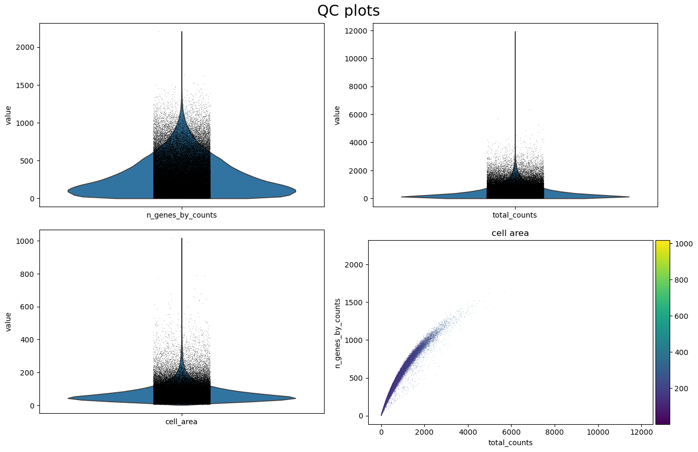

Plotting the same metrics on the tissue is the check that separates a technical failure from a real tissue compartment. To do that, the annotated table has to go back into the spatial object.

> <hands-on-title>Map the QC metrics onto the morphology image</hands-on-title>
>
> 1.  with the following parameters:
>    -  *"SpatialData object"*: `melanoma.spatialdata.zip`
>    - *"Operation"*: `Import anndata table to a SpatialData object`
>        -  *"annotated data object to add"*: `QC metrics before filtering`
>        - *"Table name"*: `table_processed`
>
> 2. Rename the generated file `SpatialData with QC metrics`
>
> 3.  with the following parameters:
>    -  *"SpatialData object"*: `SpatialData with QC metrics`
>    - In *"Render Images"*:
>        - *"Image element name"*: `morphology_focus`
>        - *"Channel"*: `DAPI`
>    - In *"Render Labels"*:
>        - *"Labels element name"*: `cell_labels`
>        - *"Color column"*: `total_counts`
>        - *"Table name"*: `table_processed`
>    - In *"Plot Display Parameters"*:
>        - *"Coordinate system(s)"*: `global`
>
> 4.  with the following parameters:
>    -  *"SpatialData object"*: `SpatialData with QC metrics`
>    - In *"Render Images"*:
>        - *"Image element name"*: `morphology_focus`
>        - *"Channel"*: `DAPI`
>    - In *"Render Labels"*:
>        - *"Labels element name"*: `cell_labels`
>        - *"Color column"*: `n_genes_by_counts`
>        - *"Table name"*: `table_processed`
>    - In *"Plot Display Parameters"*:
>        - *"Coordinate system(s)"*: `global`
>
{: .hands_on}

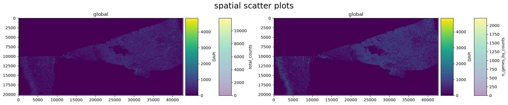

> <question-title>Interpret the QC output</question-title>
>
> The distributions for this section are a median of 305 total counts and 234 detected genes per cell, and a median cell area of 60.2 µm², with the first percentile at 10.9 µm², the 99.5th percentile at 326.9 µm² and a maximum of 1,016.8 µm².
>
> 1. The scatter plot shows a tight curved relationship between total counts and detected genes rather than a straight line. Why is that curve expected?
> 2. 840 objects have an area below 10 µm², with a median of 13 transcripts. 203 objects have an area above 400 µm², with a median of 2,694 transcripts against 305 across all cells. What two different problems do these tails suggest?
> 3. Why is the spatial map necessary before deciding to remove low-count cells?
>
> > <solution-title></solution-title>
> >
> > 1. Each additional transcript is more and more likely to be a repeat of a gene the cell has already detected, so the count of distinct genes saturates as total counts rise. On a 5,006-gene panel that ceiling arrives sooner than in a whole-transcriptome assay, which bends the curve visibly.
> > 2. The small, low-count tail looks like fragments: boundaries around part of a cell, or debris. The large, high-count tail looks like the opposite failure, boundaries enclosing more than one cell, which is why those objects carry roughly nine times the median transcript content. Both are candidate segmentation errors, and they need thresholds at opposite ends of the distribution.
> > 3. Because low counts can mark real biology rather than a technical failure. This sample is documented as containing necrosis along the outer dermal edge (), and dying tissue genuinely yields little RNA. The map shows whether low-count cells are scattered, which points to a technical cause, or concentrated in one region, which points to a tissue explanation that should be reported rather than quietly discarded.
> >
> {: .solution}
>
{: .question}

# Filtering

We filter in two stages: first on transcript content, then on segmented cell area. The transcript thresholds follow published Xenium practice, since the STHELAR resource filtered cells with fewer than 10 transcripts before clustering (). The area window is derived from the distribution above.

Each step below is a separate job that takes the output of the previous job, and inspecting the object after each one is what makes the effect of every threshold visible.

> <hands-on-title>Filter on transcript content</hands-on-title>
>
> 1.  with the following parameters:
>    -  *"Annotated data matrix"*: `QC metrics before filtering`
>    - *"Method used for filtering"*: `Filter cell outliers based on counts and numbers of genes expressed, using 'pp.filter_cells'`
>        - *"Filter"*: `Minimum number of genes expressed`
>            - *"Minimum number of genes expressed required for a cell to pass filtering"*: `10`
>
> 2.  with the following parameters:
>    -  *"Annotated data matrix"*: output of **Scanpy filter** 
>    - *"What to inspect?"*: `General information about the object`
>
>    > <question-title></question-title>
>    >
>    > ```
>    > AnnData object with n_obs × n_vars = 109430 × 5006
>    > ```
>    >
>    > How many cells have been removed because they express fewer than 10 genes?
>    >
>    > > <solution-title></solution-title>
>    > >
>    > > 112,551 − 109,430 = 3,121 cells.
>    > >
>    > {: .solution}
>    >
>    {: .question}
>
> 3.  with the following parameters:
>    -  *"Annotated data matrix"*: output of **Scanpy filter** 
>    - *"Method used for filtering"*: `Filter cell outliers based on counts and numbers of genes expressed, using 'pp.filter_cells'`
>        - *"Filter"*: `Minimum number of counts`
>            - *"Minimum number of counts required for a cell to pass filtering"*: `10`
>
> 4.  with the following parameters:
>    -  *"Annotated data matrix"*: output of **Scanpy filter** 
>    - *"What to inspect?"*: `General information about the object`
>
>    > <question-title></question-title>
>    >
>    > ```
>    > AnnData object with n_obs × n_vars = 109430 × 5006
>    > ```
>    >
>    > No cell has been removed by the minimum-counts filter. Why not?
>    >
>    > > <solution-title></solution-title>
>    > >
>    > > The two thresholds are nested for this data. A cell that detects at least 10 distinct genes must carry at least 10 transcripts, because every detected gene contributes at least one count, so every cell that survived the previous filter already satisfies this one. It is still worth running: the order of the two filters is not fixed, and the tally documents that the threshold was applied.
>    > >
>    > {: .solution}
>    >
>    {: .question}
>
> 5.  with the following parameters:
>    -  *"Annotated data matrix"*: output of **Scanpy filter** 
>    - *"Method used for filtering"*: `Filter genes based on number of cells or counts, using 'pp.filter_genes'`
>        - *"Filter"*: `Minimum number of cells expressed`
>            - *"Minimum number of cells expressed required for a gene to pass filtering"*: `3`
>
> 6.  with the following parameters:
>    -  *"Annotated data matrix"*: output of **Scanpy filter** 
>    - *"Method used for filtering"*: `Filter genes based on number of cells or counts, using 'pp.filter_genes'`
>        - *"Filter"*: `Minimum number of counts`
>            - *"Minimum number of counts required for a gene to pass filtering"*: `3`
>
> 7.  with the following parameters:
>    -  *"Annotated data matrix"*: output of **Scanpy filter** 
>    - *"What to inspect?"*: `General information about the object`
>
>    > <question-title></question-title>
>    >
>    > ```
>    > AnnData object with n_obs × n_vars = 109430 × 5006
>    > ```
>    >
>    > Neither gene-level filter removed a single gene. Would you expect the same on a whole-transcriptome assay?
>    >
>    > > <solution-title></solution-title>
>    > >
>    > > No. This is a targeted panel, and every one of its 5,006 probes was designed to detect a gene expressed somewhere in human tissue (), so all of them register in more than three of the 109,430 cells. A whole-transcriptome assay includes thousands of genes that are simply not expressed in the sampled tissue, and gene-level filters routinely remove them.
>    > >
>    > {: .solution}
>    >
>    {: .question}
>
> 8.  with the following parameters:
>    -  *"Annotated data matrix"*: output of **Scanpy filter** 
>    - *"Method used for filtering"*: `Filter cell outliers based on counts and numbers of genes expressed, using 'pp.filter_cells'`
>        - *"Filter"*: `Maximum number of counts`
>            - *"Maximum number of counts required for a cell to pass filtering"*: `100000000`
>
> 9.  with the following parameters:
>    -  *"Annotated data matrix"*: output of **Scanpy filter** 
>    - *"Method used for filtering"*: `Filter cell outliers based on counts and numbers of genes expressed, using 'pp.filter_cells'`
>        - *"Filter"*: `Maximum number of genes expressed`
>            - *"Maximum number of genes expressed required for a cell to pass filtering"*: `100000000`
>
> 10. Rename the generated file `AnnData after transcript filtering`
>
{: .hands_on}

> <comment-title>Why the upper transcript limits are effectively switched off</comment-title>
>
> The two maximum thresholds are set to 100,000,000, which no cell in any dataset will reach. They are kept in the analysis as placeholders, so that the sequence of filters is complete and the same set of steps can be reused on a section where an upper limit is needed.
>
> The job those limits would normally do, removing objects carrying implausibly many transcripts, is done here by the cell-area filter instead. We will see in a moment that it removes the same objects, and for a reason that can be stated in terms of the image rather than the counts.
>
{: .comment}

Now the morphology filter. `cell_area` is reported in µm², and the window is 10 to 400 µm²: just above the first percentile of this section at the bottom, and above the 99.5th percentile at the top.

> <hands-on-title>Filter on segmented cell area</hands-on-title>
>
> 1.  with the following parameters:
>    -  *"Annotated data matrix"*: `AnnData after transcript filtering`
>    - *"Method used for filtering"*: `Filter on any column of observations or variables`
>        - *"What to filter?"*: `Observations (obs)`
>        - *"Type of filtering?"*: `By key (column) values`
>            - *"Key to filter"*: `cell_area`
>            - *"Type of value to filter"*: `Number`
>                - *"Filter"*: `greater than`
>                - *"Value"*: `10`
>
> 2.  with the following parameters:
>    -  *"Annotated data matrix"*: output of **Scanpy filter** 
>    - *"What to inspect?"*: `General information about the object`
>
>    > <question-title></question-title>
>    >
>    > ```
>    > AnnData object with n_obs × n_vars = 108952 × 5006
>    > ```
>    >
>    > 840 objects in the unfiltered data had an area below 10 µm², but this filter removed only 478. Where did the other 362 go?
>    >
>    > > <solution-title></solution-title>
>    > >
>    > > They had already been removed. Very small objects tend to carry very few transcripts, and the objects below 10 µm² had a median of only 13, so 362 of them failed the minimum-genes filter earlier. This is worth noticing, because it shows the two filters are not measuring independent things: the same fragments fail on both criteria. Reporting only one threshold would overstate how much that one contributes.
>    > >
>    > {: .solution}
>    >
>    {: .question}
>
> 3.  with the following parameters:
>    -  *"Annotated data matrix"*: output of **Scanpy filter** 
>    - *"Method used for filtering"*: `Filter on any column of observations or variables`
>        - *"What to filter?"*: `Observations (obs)`
>        - *"Type of filtering?"*: `By key (column) values`
>            - *"Key to filter"*: `cell_area`
>            - *"Type of value to filter"*: `Number`
>                - *"Filter"*: `less than`
>                - *"Value"*: `400`
>
> 4.  with the following parameters:
>    -  *"Annotated data matrix"*: output of **Scanpy filter** 
>    - *"What to inspect?"*: `General information about the object`
>
>    > <question-title></question-title>
>    >
>    > ```
>    > AnnData object with n_obs × n_vars = 108749 × 5006
>    > ```
>    >
>    > 203 large objects have been removed. Before filtering, the highest `total_counts` in the section was 11,938; now it is 4,833. Was that intended?
>    >
>    > > <solution-title></solution-title>
>    > >
>    > > Yes, although it is a side effect rather than the stated purpose. The 203 objects above 400 µm² carried a median of 2,694 transcripts, so removing them also removes the extreme upper tail of the count distribution. Since the count-based upper limits were deliberately switched off, the area filter is doing that job, and it is doing it on a criterion that can be justified from the image.
>    > >
>    > > The practical consequence is that the area threshold has to be reported as affecting count distributions too. Anyone reading only the count thresholds would wrongly conclude that no upper limit was applied at all.
>    > >
>    > {: .solution}
>    >
>    {: .question}
>
> 5.  with the following parameters:
>    -  *"Annotated data matrix"*: output of **Scanpy filter** 
>    - *"Method used for inspecting"*: `Calculate quality control metrics, using 'pp.calculate_qc_metrics'`
>        - *"Proportions of top genes to cover"*: `50,100,200,300`
>
> 6. Rename the generated file `Filtered AnnData table`
>
{: .hands_on}

Filtering retained 108,749 of 112,551 cells, which is 96.6 per cent.

| Stage | Cells | Genes |
| --- | ---: | ---: |
| initial AnnData | 112,551 | 5,006 |
| cells, minimum 10 genes | 109,430 | 5,006 |
| cells, minimum 10 counts | 109,430 | 5,006 |
| genes, minimum 3 cells | 109,430 | 5,006 |
| genes, minimum 3 counts | 109,430 | 5,006 |
| cells, maximum counts | 109,430 | 5,006 |
| cells, maximum genes | 109,430 | 5,006 |
| cells, minimum area | 108,952 | 5,006 |
| cells, maximum area | 108,749 | 5,006 |

Repeating the {QC} plots on the filtered object, and mapping them back onto the tissue, shows what changed.

> <hands-on-title>Visualise QC after filtering</hands-on-title>
>
> 1. Repeat the four  jobs from the *Visualise QC metrics* box, using `Filtered AnnData table` as the *"Annotated data matrix"* each time
>
> 2.  with the following parameters:
>    -  *"SpatialData object"*: `melanoma.spatialdata.zip`
>    - *"Operation"*: `Import anndata table to a SpatialData object`
>        -  *"annotated data object to add"*: `Filtered AnnData table`
>        - *"Table name"*: `table_processed`
>
> 3. Repeat the two  jobs from the *Map the QC metrics* box, using the output of step 2 as the *"SpatialData object"*
>
{: .hands_on}


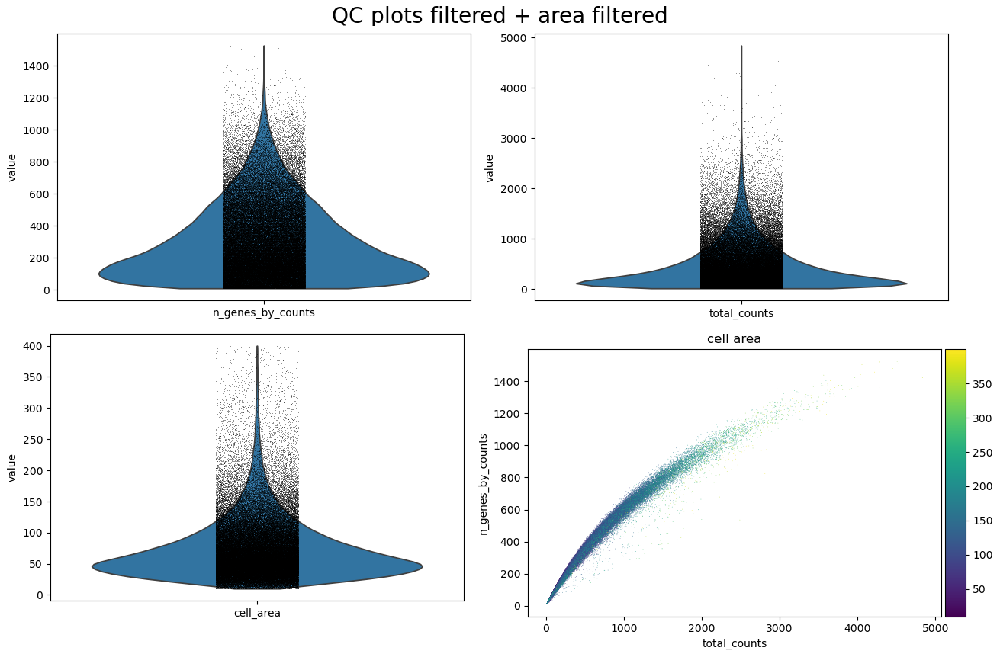

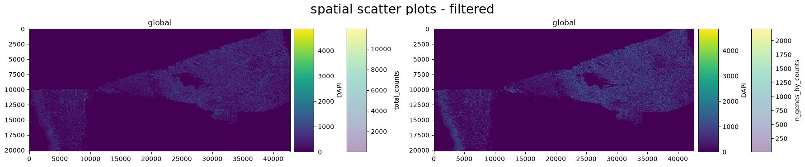

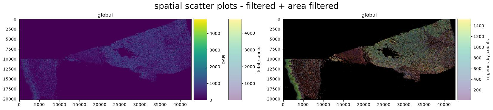

> <comment-title>Would a stricter transcript threshold be better?</comment-title>
>
> A minimum of 10 transcripts per cell follows published Xenium practice () and retains 96.6 per cent of cells here, but it is a permissive choice. Later in this tutorial three Leiden groups appear with a median of about 20 transcripts per cell, 4,933 cells in total, which pass this filter while carrying almost no usable expression information.
>
> Raising the threshold to around 50 transcripts would remove most of them and simplify the clustering. It would also discard cells from a documented necrotic region, which is a real feature of this sample. Neither choice is wrong. What matters is that the threshold is stated, and that groups made of low-content cells are identified as such rather than annotated as cell types. We keep the permissive threshold here precisely so that those groups appear and can be recognised.
>
{: .comment}

# Normalisation and feature selection

Counts per cell vary for reasons that include cell size and segmentation, so expression is put on a common scale before cells are compared. The target of 10,000 counts per cell is not arbitrary: CellTypist expects input normalised to a total of 10,000 and log1p-transformed, and CellTypist runs later in this analysis ().

> <hands-on-title>Normalise and log-transform</hands-on-title>
>
> 1.  with the following parameters:
>    -  *"Annotated data matrix"*: `Filtered AnnData table`
>    - *"Method used for normalization"*: `Normalize counts per cell, using 'pp.normalize_total'`
>        - *"Target sum"*: `10000.0`
>
> 2.  with the following parameters:
>    -  *"Annotated data matrix"*: output of **Scanpy normalize** 
>    - *"Method used for inspecting"*: `Logarithmize the data matrix, using 'pp.log1p'`
>
> 3. Rename the generated file `Log-normalised AnnData`
>
{: .hands_on}

> <hands-on-title>Identify the highly variable genes</hands-on-title>
>
> 1.  with the following parameters:
>    -  *"Annotated data matrix"*: `Log-normalised AnnData`
>    - *"Method used for filtering"*: `Annotate (and filter) highly variable genes, using 'pp.highly_variable_genes'`
>        - *"Choose the flavor for identifying highly variable genes"*: `Cell Ranger`
>            - *"Number of highly-variable genes to keep"*: `2000`
>        - *"Number of bins for binning the mean gene expression"*: `20`
>        - *"Inplace subset to highly-variable genes"*: `No`
>
> 2. Rename the generated file `AnnData with HVGs`
>
> 3.  with the following parameters:
>    -  *"Annotated data matrix"*: `AnnData with HVGs`
>    - *"Method used for plotting"*: `Preprocessing: Plot dispersions versus means for genes, using 'pl.highly_variable_genes'`
>
{: .hands_on}

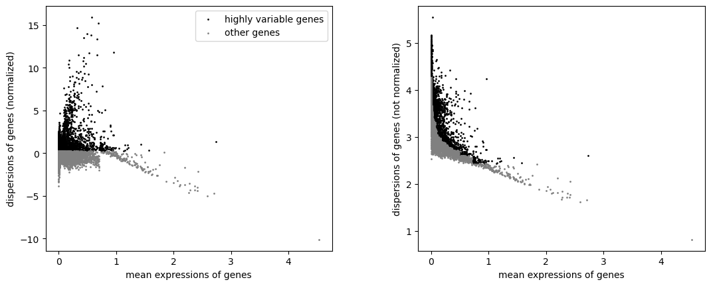

> <question-title>Interpret the feature selection</question-title>
>
> 1. *"Inplace subset to highly-variable genes"* is `No`. What stays in the object, and what does {PCA} then use?
> 2. Why does selecting 2,000 of 5,006 genes matter less here than selecting 2,000 of 30,000 would on a whole-transcriptome dataset?
>
> > <solution-title></solution-title>
> >
> > 1. All 5,006 genes stay, and the 2,000 selected ones are flagged in a `highly_variable` column. Scanpy's {PCA} uses that flag by default, so the embedding is built from the 2,000 selected genes while the other 3,006 remain available for marker ranking, plotting and reference transfer. In the reference run the {PCA} loadings are non-zero for exactly the 2,000 flagged genes, which confirms the mask was applied.
> > 2. Because the panel is already a curated selection: every one of the 5,006 genes was chosen to help distinguish cell types and pathways (). The 3,006 genes left out are not the uninformative background that feature selection usually removes. On a targeted panel, feature selection mainly down-weights genes that are uniform across this particular section, and less information is lost than the ratio suggests.
> >
> {: .solution}
>
{: .question}

# Dimensionality reduction and clustering

{PCA} compresses correlated expression patterns into orthogonal components. A nearest-neighbour graph then links cells with similar coordinates, and {UMAP} gives a two-dimensional view of that graph. {UMAP} shows expression similarity; it is not a map of the tissue.

> <hands-on-title>Scale the data and run the PCA</hands-on-title>
>
> 1.  with the following parameters:
>    -  *"Annotated data matrix"*: `AnnData with HVGs`
>    - *"Method used for inspecting"*: `Scale data to unit variance and zero mean, using 'pp.scale'`
>        - *"Zero center"*: `Yes`
>        - *"Maximum value"*: `10.0`
>
> 2.  with the following parameters:
>    -  *"Annotated data matrix"*: output of **Scanpy Inspect and manipulate** 
>    - *"Method used"*: `Computes PCA (principal component analysis) coordinates, loadings and variance decomposition, using 'pp.pca'`
>        - *"Number of principal components to compute"*: `50`
>        - *"Random seed"*: `0`
>
> 3.  with the following parameters:
>    -  *"Annotated data matrix"*: output of **Scanpy cluster, embed** 
>    - *"Method used for plotting"*: `PCA: Scatter plot in PCA coordinates, using 'pl.pca'`
>        - *"Keys for annotations of observations/cells or variables/genes"*: `log1p_total_counts,log1p_n_genes_by_counts,total_counts,cell_area`
>
{: .hands_on}

> <hands-on-title>Compute the neighbourhood graph and the UMAP</hands-on-title>
>
> 1.  with the following parameters:
>    -  *"Annotated data matrix"*: the {PCA} output
>    - *"Method used for inspecting"*: `Compute a neighborhood graph of observations, using 'pp.neighbors'`
>        - *"The size of local neighborhood used for manifold approximation"*: `15`
>        - *"Distance metric"*: `euclidean`
>        - *"Random seed"*: `0`
>
> 2.  with the following parameters:
>    -  *"Annotated data matrix"*: output of **Scanpy Inspect and manipulate** 
>    - *"Method used"*: `Embed the neighborhood graph using UMAP, using 'tl.umap'`
>        - *"Minimum distance"*: `0.5`
>        - *"Spread"*: `1.0`
>
> 3. Rename the generated file `AnnData with UMAP`
>
> 4.  with the following parameters:
>    -  *"Annotated data matrix"*: `AnnData with UMAP`
>    - *"Method used for plotting"*: `Embeddings: Scatter plot in UMAP basis, using 'pl.umap'`
>        - *"Keys for annotations of observations/cells or variables/genes"*: `log1p_total_counts,log1p_n_genes_by_counts,total_counts,cell_area`
>
{: .hands_on}

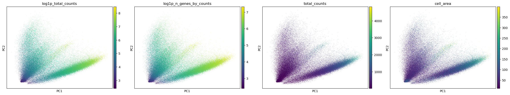

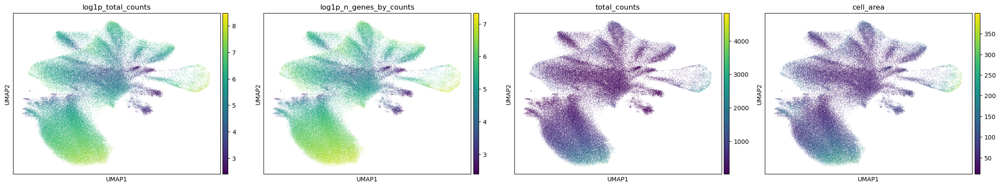

> <question-title>Should total counts be regressed out?</question-title>
>
> These panels show that transcript content is structured in the embedding rather than scattered at random. Scanpy offers `pp.regress_out` to remove a covariate before {PCA}, and this analysis does not use it.
>
> 1. What is the argument for regressing out `total_counts` and `cell_area`?
> 2. What is the argument against it in this dataset?
> 3. What should be done instead?
>
> > <solution-title></solution-title>
> >
> > 1. If transcript content drives the embedding, clusters may end up separating cells by how much signal they carry rather than by what they express, which would be a technical artefact.
> > 2. In a single-cell assay, transcript content is partly biological. Cell size and total RNA content genuinely differ between cell types, and in this section they do so systematically: the keratinocyte group has a median area of 131 µm² and 708 counts, while the T-cell group has 41 µm² and 120 counts. Regressing these covariates out would remove real differences between populations along with the technical component, and Scanpy itself warns that `regress_out` can overcorrect.
> > 3. Leave the covariates in, then check every resulting group for marker evidence that is independent of its depth, and ask whether any group is defined only by low content. That is what the rest of this tutorial does, and it finds three groups explained by low transcript content rather than by a distinct expression programme. Regression would have hidden them instead of exposing them.
> >
> {: .solution}
>
{: .question}

## Clustering at three resolutions

Leiden partitions the expression-neighbour graph, and the resolution controls how finely (). Testing several resolutions shows which structures are stable and which appear only when the partition is pushed. We use the three values from `Resolution.txt`, which are the resolutions the STHELAR resource used for Xenium sections (), and store each result under its own key.

> <hands-on-title>Cluster the neighbourhood graph</hands-on-title>
>
> 1.  with the following parameters:
>    -  *"Annotated data matrix"*: `AnnData with UMAP`
>    - *"Method used"*: `Cluster cells into subgroups, using 'tl.leiden'`
>        - *"Coarseness of the clustering"*: `0.2`
>        - *"Key under which to add the cluster labels"*: `leiden_res_0.2`
>        - *"Use weights from knn graph"*: `Yes`
>        - *"How many iterations of the Leiden clustering algorithm to perform"*: `2`
>        - *"Random seed"*: `0`
>
> 2.  with the following parameters:
>    -  *"Annotated data matrix"*: output of **Scanpy cluster, embed** 
>    - *"Method used"*: `Cluster cells into subgroups, using 'tl.leiden'`
>        - *"Coarseness of the clustering"*: `0.4`
>        - *"Key under which to add the cluster labels"*: `leiden_res_0.4`
>        - *"Use weights from knn graph"*: `Yes`
>        - *"How many iterations of the Leiden clustering algorithm to perform"*: `2`
>        - *"Random seed"*: `0`
>
> 3.  with the following parameters:
>    -  *"Annotated data matrix"*: output of **Scanpy cluster, embed** 
>    - *"Method used"*: `Cluster cells into subgroups, using 'tl.leiden'`
>        - *"Coarseness of the clustering"*: `0.6`
>        - *"Key under which to add the cluster labels"*: `leiden_res_0.6`
>        - *"Use weights from knn graph"*: `Yes`
>        - *"How many iterations of the Leiden clustering algorithm to perform"*: `2`
>        - *"Random seed"*: `0`
>
> 4. Rename the generated file `AnnData with Leiden comparison`
>
> 5.  with the following parameters:
>    -  *"Annotated data matrix"*: `AnnData with Leiden comparison`
>    - *"Method used for plotting"*: `Embeddings: Scatter plot in UMAP basis, using 'pl.umap'`
>        - *"Keys for annotations of observations/cells or variables/genes"*: `leiden_res_0.2,leiden_res_0.4,leiden_res_0.6`
>
{: .hands_on}

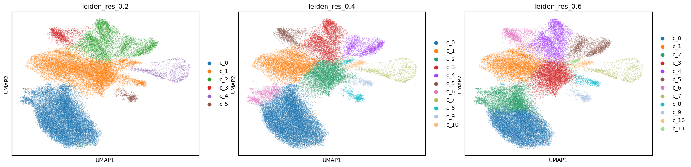

| Resolution | Groups |
| --- | ---: |
| 0.2 | 6 |
| 0.4 | 11 |
| 0.6 | 12 |

We continue with `leiden_res_0.4`. It is the intermediate partition, and its 11 groups separate the main populations without splitting them into fragments, which the marker genes in the next section will show. The group sizes are:

| Group | Cells | Group | Cells |
| --- | ---: | --- | ---: |
| `c_0` | 44,851 | `c_6` | 3,546 |
| `c_1` | 16,690 | `c_7` | 2,828 |
| `c_2` | 15,780 | `c_8` | 2,247 |
| `c_3` | 11,281 | `c_9` | 1,426 |
| `c_4` | 5,245 | `c_10` | 1,260 |
| `c_5` | 3,595 | | |

> <question-title>Compare the resolutions</question-title>
>
> 1. What would you check before trusting the extra groups that appear at 0.4 but not at 0.2?
> 2. Does choosing this resolution establish that the section contains 11 cell populations?
>
> > <solution-title></solution-title>
> >
> > 1. Whether each new group has its own significant marker genes, whether it occupies a coherent position in the tissue, and whether it differs from its parent group in expression programme rather than only in transcript content. A group that splits off with no significant markers and a much lower count depth is a depth artefact.
> > 2. No. Three of the 11 groups turn out to be low-content cells and two more share a melanocytic programme, so the number of biologically distinct populations this analysis supports is smaller than 11. The partition is a starting point for interpretation, not a result.
> >
> {: .solution}
>
{: .question}

# Marker genes

Ranked genes show which genes separate each group from all the remaining cells. We use the Wilcoxon rank-sum test with Benjamini-Hochberg correction, the combination used to refine annotations in the STHELAR Xenium resource ().

> <hands-on-title>Rank the marker genes</hands-on-title>
>
> 1.  with the following parameters:
>    -  *"Annotated data matrix"*: `AnnData with Leiden comparison`
>    - *"Method used for inspecting"*: `Rank genes for characterizing groups, using 'tl.rank_genes_groups'`
>        - *"The key of the observations grouping to consider"*: `leiden_res_0.4`
>        - *"Comparison"*: `Compare each group to the union of the rest of the group`
>        - *"Method"*: `Wilcoxon-Rank-Sum`
>            - *"P-value correction method"*: `Benjamini-Hochberg`
>        - *"Get ranked genes as a Tabular file?"*: `Yes`
>
> 2. Rename the tabular output `ranked_genes table` and the AnnData output `AnnData with markers`
>
> 3.  with the following parameters:
>    -  *"Annotated data matrix"*: `AnnData with markers`
>    - *"Method used for plotting"*: `Marker genes: Plot ranking of genes using dotplot plot, using 'pl.rank_genes_groups'`
>        - *"Number of genes to show"*: `20`
>        - *"Font size"*: `8`
>
{: .hands_on}

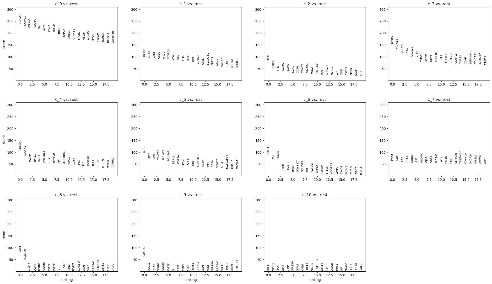

> <warning-title>Discard ADGRG1 before interpreting these results</warning-title>
>
> *ADGRG1* is the second-highest ranked gene for group `c_0`, and it must not be reported as a marker. 10x Genomics states that *ADGRG1*, together with *NMBR*, *OSMR*, *OSTF1* and *RGS8*, was removed from the final Xenium Prime 5K panel because of subpar performance from non-specific binding, and that this dataset was generated with the earlier development panel that still contained them ().
>
> A high rank for a probe with known non-specific binding is evidence about the probe, not about the biology. Check strong markers against the panel documentation for the exact panel version used before building an interpretation on them.
>
{: .warning}

## Annotating the groups

Reading the ranked genes together with published marker definitions gives the descriptions below. Every group is also checked against its own {QC} profile, because a group defined only by low transcript content is not a cell population.

| Group | Cells | Median counts | Median area (µm²) | Ranked genes used | Description |
| --- | ---: | ---: | ---: | --- | --- |
| `c_0` | 44,851 | 693 | 82 | *MLANA*, *S100A1*, *PRAME*, *TFAP2A*, *EDNRB*, *ERBB3*, *MELTF*, *L1CAM*, *BACE2* | Melanoma cells |
| `c_1` | 16,690 | 203 | 51 | *CD14*, *CD68*, *CD163*, *MRC1*, *MSR1*, *ITGB2*, *CYBB*, *SIGLEC1*, *STAB1* | Myeloid cells and macrophages |
| `c_2` | 15,780 | 120 | 41 | *CD3E*, *CD8A*, *CD2*, *GZMA*, *CD3G*, *LCK*, *IL2RG*, *CXCL9* | T lymphocytes, cytotoxic-skewed |
| `c_3` | 11,281 | 279 | 55 | *POSTN*, *COL5A1*, *COL5A2*, *COL11A1*, *CTHRC1*, *COMP*, *THBS2*, *CXCL12*, *MMP14* | Fibroblasts with a myofibroblastic {CAF}-like programme |
| `c_4` | 5,245 | 243 | 56 | *COL4A1*, *COL4A2*, *PECAM1*, *CD34*, *PLVAP*, *ENG*, *PDGFRB*, *MCAM* | Vasculature: endothelium with pericytes |
| `c_5` | 3,595 | 220 | 55 | *MZB1*, *XBP1*, *POU2AF1*, *DERL3*, *CD79A*, *IRF4*, *CD38*, *SLAMF7* | Plasma cells and B lineage |
| `c_6` | 3,546 | 139 | 82 | *S100A1*, *VGF*, *HOXB7* | Second melanocytic state; low complexity, interpret with caution |
| `c_7` | 2,828 | 708 | 131 | *DSG1*, *DSG3*, *LAD1*, *DMKN*, *GJB6*, *JUP*, *GJA1*, *CDKN1A* | Epidermal keratinocytes |
| `c_8` | 2,247 | 22 | 59 | *SOST*, *SOX2-OT* only | Low-content objects, not a cell type |
| `c_9` | 1,426 | 20 | 49 | *SOX2-OT* only | Low-content objects, not a cell type |
| `c_10` | 1,260 | 20 | 27 | none significant | Low-content objects, not a cell type |

The evidence behind each description:

- **Melanoma cells (`c_0`).** *MLANA* is one of the canonical melanocyte markers used to define that population in the healthy human skin atlas, alongside *PMEL*, *TYR*, *TYRP1* and *DCT* (). *PRAME* separates malignant from benign melanocytic lesions in diagnostic practice, with reported sensitivity around 90 per cent and specificity around 96 per cent for melanoma versus nevi (); nodal nevi are uniformly negative while metastatic melanoma is positive (). A melanocytic lineage programme together with *PRAME* is consistent with the diagnosis 10x Genomics reports for this block.
- **Myeloid cells (`c_1`).** *CD68* and *CD163* mark macrophage populations whose density increases with Breslow thickness and stage in cutaneous melanoma (). Co-expression of *CD163*, *MRC1* and *MSR1* corresponds to the immunosuppressive, scavenger-receptor-high {TAM} phenotype described in melanoma ().
- **T lymphocytes (`c_2`).** *CD3E*, *CD3G* and *CD8A* with *GZMA* indicate T cells with a cytotoxic bias. The same markers resolve T cells from macrophages in single-cell spatial imaging of primary melanoma (). *CXCL9* here is consistent with an interferon-associated chemokine programme.
- **Fibroblasts (`c_3`).** *POSTN* defines a myofibroblastic {CAF} subpopulation associated with matrix remodelling and immune suppression in single-cell and spatial tumour data (). *COL11A1*, *CTHRC1* and *COMP* extend that signature.
- **Vasculature (`c_4`).** *PECAM1* and *CD34* are endothelial; *PDGFRB* and *MCAM* are pericyte-associated. The healthy skin reference resolves both vascular endothelial and pericyte states in dermis (). *COL4A1* and *COL4A2* encode basement-membrane collagen IV, expected around vessels.
- **Plasma cells (`c_5`).** *MZB1*, *DERL3*, *XBP1* and *POU2AF1* describe the secretory programme of plasma cells, with *CD79A* marking B lineage and *CD38* and *SLAMF7* plasma-cell surface identity.
- **Keratinocytes (`c_7`).** *DSG1* is a differentiation-dependent desmosomal cadherin concentrated in suprabasal epidermis, while *DSG3* is prominent basally (). A targeted spatial atlas of human skin defines suprabasal keratinocytes by *DSC1*, *DSG1*, *KRT2* and *GATA3*, and basal keratinocytes by *POSTN*, *COL17A1* and *DST* (). *DMKN* and *GJB6* are further epidermal genes.

> <question-title>The three low-content groups</question-title>
>
> Groups `c_8`, `c_9` and `c_10` hold 4,933 cells between them. Their median transcript counts are 22, 20 and 20, and `pct_counts_in_top_50_genes` is 100 for all three. `c_10` has no gene with an adjusted p-value below 0.05.
>
> 1. Why is `pct_counts_in_top_50_genes` exactly 100 here, and does it indicate a dominant expression programme?
> 2. *SOX2-OT* is the only consistently significant gene across these groups. Is it a marker?
> 3. How would you test whether these groups correspond to the necrotic region 10x Genomics describes?
>
> > <solution-title></solution-title>
> >
> > 1. Because these cells detect roughly 20 distinct genes, which is fewer than 50, so the top 50 genes necessarily hold all of a cell's signal. The metric is saturated by arithmetic rather than by biology, which is a useful reminder that a {QC} metric can be uninformative outside the range it was designed for.
> > 2. Not in any useful sense. With about 20 counts per cell a differential test compares near-empty profiles, and a gene can reach significance simply by being detected slightly more often than in cells with hundreds of counts. Ranked genes from cells with almost no signal describe the detection floor, not the tissue.
> > 3. Map the groups onto the tissue with **SpatialData Plot**, coloured by `leiden_res_0.4`, and compare their positions with the morphology image and with the region 10x describes. The neighbourhood enrichment in the next section already supports the idea: `c_8` and `c_9` sit next to each other far more often than chance, with z-scores of about 196 and 198, so these low-content cells are spatially clustered rather than scattered. Scattered would point to a purely technical cause; a coherent region matching the necrotic edge points to degraded tissue. Confirming it needs the histology, so the defensible statement is that these are low-content objects consistent with the documented necrotic region.
> >
> {: .solution}
>
{: .question}

> <question-title>Two melanocytic groups</question-title>
>
> Group `c_6` ranks *S100A1* first, shares *MLANA*, *PRAME*, *ATP1A1* and *L1CAM* with `c_0` at lower scores, and adds *VGF* and *HOXB7*. Its median transcript count is 139 against 693 for `c_0`, and `pct_counts_in_top_50_genes` is 62 against 32.
>
> Is `c_6` a distinct melanoma cell state, or the same population measured less well?
>
> > <solution-title></solution-title>
> >
> > This analysis does not separate the two possibilities. The shared melanocytic markers argue that `c_6` is melanocytic; the five-fold lower transcript content and the higher concentration of counts in the top 50 genes argue that much of what distinguishes it from `c_0` is measurement depth. *VGF* is genuinely enriched and spatially structured, which counts in favour of a real state.
> >
> > What would settle it: checking whether `c_6` occupies a distinct region of the tissue, testing whether its markers survive a comparison against `c_0` alone rather than against all other cells, and repeating the analysis on another section. Reporting it as a candidate second melanocytic state with the depth caveat attached is the defensible position.
> >
> {: .solution}
>
{: .question}

# Spatial statistics with Squidpy

Squidpy builds its own graph from the cell coordinates, independent of the expression-neighbour graph used for clustering (). Everything in this section is calculated on that spatial graph.

> <hands-on-title>Build the spatial-neighbour graph</hands-on-title>
>
> 1.  with the following parameters:
>    -  *"spatial object (in SpatialData or AnnData format)"*: `AnnData with markers`
>    - *"Operation"*: `Create a graph from spatial coordinates (gr.spatial_neighbors)`
>        - *"Spatial key"*: `spatial`
>        - *"Number of neighbors"*: `6`
>        - *"Key added"*: `spatial`
>
> 2. Rename the generated file `AnnData with spatial neighbours`
>
{: .hands_on}

> <comment-title>Six generic neighbours, not a grid</comment-title>
>
> Squidpy can build the graph from a regular grid, which is right for Visium because capture spots sit on a fixed hexagonal array. Xenium cells are at arbitrary positions, so the graph is built generically: each cell is joined to its six nearest neighbours by Euclidean distance.
>
> Six is a reasonable default for a densely packed section, but it is a parameter with consequences. A larger value smooths the adjacency statistics; a smaller one makes them noisier. Where cell density varies a lot across a section, a radius-based graph is the better option.
>
{: .comment}

> <hands-on-title>Calculate the group-level spatial statistics</hands-on-title>
>
> 1.  with the following parameters:
>    -  *"spatial object (in SpatialData or AnnData format)"*: `AnnData with spatial neighbours`
>    - *"Operation"*: `Compute centrality scores per cluster or cell type (gr.centrality_scores)`
>        - *"Key in adata.obs where clustering is stored"*: `leiden_res_0.4`
>        - *"Connectivity key"*: `spatial_connectivities`
>
> 2.  with the following parameters:
>    -  *"spatial object (in SpatialData or AnnData format)"*: output of **Squidpy** 
>    - *"Operation"*: `Plot centrality scores (pl.centrality_scores)`
>        - *"Key in adata.obs where clustering is stored"*: `leiden_res_0.4`
>
> 3.  with the following parameters:
>    -  *"spatial object (in SpatialData or AnnData format)"*: the centrality output from step 1
>    - *"Operation"*: `Compute neighborhood enrichment by permutation test (gr.nhood_enrichment)`
>        - *"Key in adata.obs where clustering is stored"*: `leiden_res_0.4`
>        - *"Connectivity key"*: `spatial_connectivities`
>        - *"Number of permutations"*: `1000`
>
> 4.  with the following parameters:
>    -  *"spatial object (in SpatialData or AnnData format)"*: output of **Squidpy** 
>    - *"Operation"*: `Plot neighborhood enrichment (pl.nhood_enrichment)`
>        - *"Key in adata.obs where clustering is stored"*: `leiden_res_0.4`
>        - *"Mode"*: `zscore`
>
> 5.  with the following parameters:
>    -  *"spatial object (in SpatialData or AnnData format)"*: the neighbourhood-enrichment output from step 3
>    - *"Operation"*: `Calculate Global Autocorrelation Statistic (Moran's I or Geary's C) (gr.spatial_autocorr)`
>        - *"Connectivity key"*: `spatial_connectivities`
>        - *"Mode"*: `moran`
>        - *"Number of permutations"*: `1000`
>
> 6. Rename the generated file `AnnData with Squidpy results`
>
{: .hands_on}

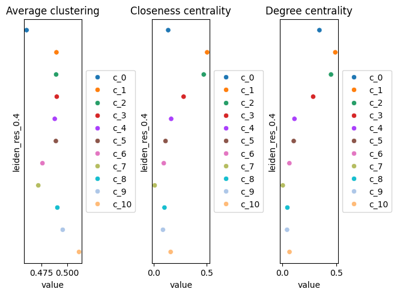

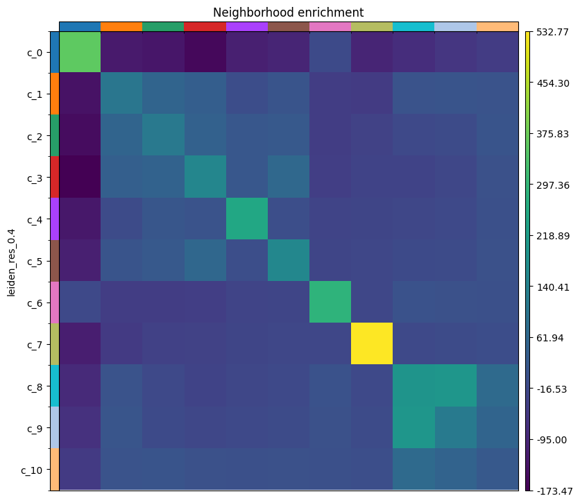

Selected values from the reference run:

| Group | Degree centrality | Closeness centrality | Self-enrichment z-score |
| --- | ---: | ---: | ---: |
| `c_0` melanoma | 0.346 | 0.137 | 359 |
| `c_1` myeloid | 0.492 | 0.504 | 104 |
| `c_2` T cells | 0.452 | 0.472 | 113 |
| `c_3` fibroblasts | 0.287 | 0.282 | 150 |
| `c_4` vasculature | 0.115 | 0.165 | 250 |
| `c_7` keratinocytes | 0.007 | 0.009 | 533 |

> <question-title>Interpret the spatial statistics</question-title>
>
> 1. The keratinocyte group `c_7` has the highest self-enrichment (533) and by far the lowest degree centrality (0.007). What arrangement produces that combination, and does it make anatomical sense?
> 2. The myeloid group `c_1` has the highest degree and closeness centrality. What does that describe, and what does it not establish?
> 3. The melanoma group `c_0` has negative z-scores against every other group, from −16 for `c_6` to −174 for `c_3`. What does that mean?
>
> > <solution-title></solution-title>
> >
> > 1. A large contiguous block of one cell type that touches few others. Keratinocytes form the epidermis, a continuous sheet at the tissue surface, so nearly all of a keratinocyte's six nearest neighbours are other keratinocytes and only cells at the dermal-epidermal junction contact anything else. Skin anatomy predicts exactly this, which makes it a good check that both the spatial graph and the annotation are behaving.
> > 2. High degree centrality means members of the group have a large share of their spatial-graph connections to cells outside it, so they are interspersed among other populations rather than segregated. For myeloid cells in a tumour that is consistent with infiltration. It does not establish that they interact with the cells they touch, nor that the infiltration has any functional consequence.
> > 3. That cells from other groups are found next to melanoma cells less often than expected once labels are permuted. `c_0` is 41 per cent of all cells and strongly self-enriched, so it forms large tumour masses whose interfaces with other populations are small relative to their size. The negative values describe that geometry. They say nothing about whether the contacts that do exist matter biologically.
> >
> {: .solution}
>
{: .question}

Moran's I measures whether a gene's expression is spatially structured rather than randomly distributed (). The result is stored in the object and can be read with **Inspect AnnData**. The most strongly autocorrelated genes in the reference run are:

| Gene | Moran's I | Interpretation |
| --- | ---: | --- |
| *DSG1* | 0.87 | Epidermal differentiation; the epidermis is one contiguous band |
| *ARG1* | 0.83 | Confined to a specific region |
| *CDSN* | 0.79 | Cornified envelope |
| *S100A1* | 0.74 | Melanocytic; tumour masses |
| *A2ML1* | 0.72 | Epidermal |
| *DSG3* | 0.71 | Basal epidermis |
| *TGM1* | 0.69 | Cornification |
| *COL17A1* | 0.60 | Basal keratinocytes at the dermal-epidermal junction |
| *MLANA* | 0.56 | Melanocytic |
| *CXCL9* | 0.40 | Chemokine, patchily distributed |
| *COL4A1* | 0.35 | Basement membrane around vessels |
| *POSTN* | 0.34 | Fibroblast matrix programme |

> <question-title>Interpret Moran's I</question-title>
>
> Epidermal genes fill the top of this list, ahead of the melanoma markers, even though melanoma cells outnumber keratinocytes roughly sixteen to one.
>
> Why do the epidermal genes score higher?
>
> > <solution-title></solution-title>
> >
> > Moran's I rewards spatial coherence, not abundance. The epidermis is a single narrow continuous band, so an epidermal gene is essentially on or off depending on which side of a sharp boundary a cell sits, which is close to the strongest spatial pattern possible. Melanoma cells are abundant but spread across large regions with other populations mixed in, so their markers switch on and off more gradually. A high Moran's I identifies sharply organised expression, which is a different question from which genes are most highly expressed or which populations are largest.
> >
> {: .solution}
>
{: .question}

# Cell type annotation with CellTypist

CellTypist assigns each cell the best-matching label from a reference built on annotated single-cell data, and can then refine the assignment by majority voting within over-clustered neighbourhoods (). The model used here holds labels from healthy adult human skin, from the atlas that defines keratinocyte, fibroblast, vascular, pericyte, Schwann, melanocyte and immune states in skin ().

> <hands-on-title>Annotate the cells</hands-on-title>
>
> 1.  with the following parameters:
>    -  *"Input AnnData file"*: `AnnData with Squidpy results`
>    - *"Model source"*: `Use a cached model`
>        - *"Choose CellTypist model"*: `cell types from human healthy adult skin (v1)`
>    - *"Mode"*: `best match`
>    - *"Probability threshold"*: `0.5`
>    - *"Refine the predicted labels by running the majority voting classifier after over-clustering"*: `Yes`
>    - *"Generate a dotplot of the predicted cell types"*: `Yes`
>        - *"Reference column in AnnData.obs for dotplot"*: `leiden_res_0.4`
>        - *"Prediction to plot"*: `majority_voting`
>
> 2. Rename the AnnData output `CellTypist-annotated AnnData`
>
{: .hands_on}

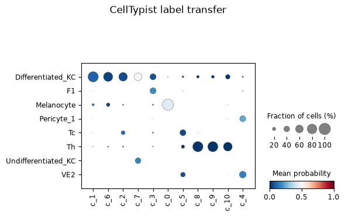

Before majority voting, CellTypist assigns 34 different labels across the section. Melanocyte is the most frequent at 38,292 cells, then Differentiated_KC at 18,825, Th at 8,458 and Tc at 5,133; Mono_mac, Macro_1, Macro_2, Inf_mac, LC, migLC, moDC, DC1, DC2, MigDC, Mast_cell, Plasma, Schwann_1 and Schwann_2 all appear. After majority voting, 8 labels remain.

| Leiden group | Marker-based description | Dominant majority-voting label | Share | Mean confidence |
| --- | --- | --- | ---: | ---: |
| `c_0` | Melanoma cells | Melanocyte | 98.1% | 0.45 |
| `c_1` | Myeloid, macrophages | Differentiated_KC | 86.5% | 0.16 |
| `c_2` | T lymphocytes | Differentiated_KC | 68.1% | 0.14 |
| `c_3` | Fibroblasts | F1 / Differentiated_KC | 43.8% / 43.4% | 0.24 |
| `c_4` | Vasculature | VE2 / Pericyte_1 | 49.4% / 42.9% | 0.28 |
| `c_5` | Plasma cells | Tc / VE2 | 42.4% / 29.9% | 0.15 |
| `c_6` | Second melanocytic state | Differentiated_KC / Melanocyte | 74.8% / 21.1% | 0.07 |
| `c_7` | Keratinocytes | Differentiated_KC / Undifferentiated_KC | 60.5% / 39.5% | 0.42 |
| `c_8` | Low-content objects | Th | 85.2% | 0.02 |
| `c_9` | Low-content objects | Th | 84.4% | 0.02 |
| `c_10` | Low-content objects | Th | 69.8% | 0.02 |

Four assignments agree with the markers: melanocytic for `c_0`, fibroblast for `c_3`, vascular and pericyte for `c_4`, and keratinocyte for `c_7`. Four contradict them.

> <question-title>Are these eight labels the cell types in this tissue?</question-title>
>
> 1. Group `c_1` expresses *CD14*, *CD68*, *CD163*, *MRC1* and *MSR1*, and CellTypist calls 86.5 per cent of it Differentiated_KC. Which result should we believe, and why?
> 2. CellTypist gives only 58 cells in the whole section the Plasma label, yet group `c_5` has 3,595 cells expressing *MZB1*, *DERL3*, *POU2AF1* and *CD79A*. What does that tell us about the reference?
> 3. Groups `c_8`, `c_9` and `c_10` are labelled Th with about 85 per cent agreement. Why is that not evidence for T helper cells?
> 4. Is the list of eight majority-voting labels a complete inventory of the cell types here?
>
> > <solution-title></solution-title>
> >
> > 1. The markers. *CD14*, *CD68*, *CD163*, *MRC1* and *MSR1* form a coherent macrophage programme with published support in melanoma (), and the mean prediction confidence for this group is 0.16, which is low. A weakly supported reference label that contradicts a coherent marker panel is the weaker evidence. The STHELAR resource takes the same view: reference-based predictions are treated as supportive, and final identities come from combining them with marker genes and literature context ().
> > 2. That a reference cannot return what it never contained in quantity. This model is built from healthy adult skin, which holds few plasma cells, so a tumour with a substantial plasma-cell infiltrate has no good match available and those cells are pushed onto whichever label is nearest, here mostly Tc and VE2. Reference transfer can only ever return labels that exist in the reference.
> > 3. Because the mean confidence is 0.02. These cells carry about 20 transcripts each, so the classifier has almost nothing to work with, and it returns a label anyway. High agreement among near-random assignments is not evidence. This is exactly why the confidence scores have to be read alongside the label fractions: a large dot in a low-probability colour is a warning, not a result.
> > 4. No. Before majority voting the classifier distinguishes 34 labels, including several macrophage and dendritic-cell states, mast cells, plasma cells and Schwann cells. Majority voting collapses them to 8 by taking the dominant label in each over-clustered neighbourhood, which suppresses populations that are locally in the minority. The markers independently support at least seven distinct populations. Both the 8 labels and the 11 Leiden groups are summaries of a more heterogeneous tissue.
> >
> {: .solution}
>
{: .question}

> <comment-title>Choosing a reference model</comment-title>
>
> CellTypist recommends picking the model that matches the biological context of the query data (). Healthy adult skin is the closest available match here, and it is a clear improvement on a mismatched tissue: a breast model run on this section returns breast luminal secretory labels that have no counterpart in skin at all.
>
> It is still a healthy-tissue reference applied to a tumour. Treat the labels as preliminary, and give the marker genes precedence when the two disagree. A melanoma-specific reference, or a matched single-cell dataset from the same tissue, would be the better option where one exists.
>
{: .comment}

# Ligand-receptor rankings with LIANA

LIANA combines several scoring methods and curated {LR} resources into a consensus ranking (, ). The source and target categories here are Leiden groups.

> <hands-on-title>Rank ligand-receptor pairs</hands-on-title>
>
> 1.  with the following parameters:
>    -  *"Annotated data matrix"*: `CellTypist-annotated AnnData`
>    - *"Method for ligand-receptor inference"*: `Aggregate ligand-receptor scores from multiple methods (rank_aggregate)`
>        - *"Group By"*: `leiden_res_0.4`
>        - *"Resource source"*: `Use a built-in resource`
>            - *"Resource name"*: `consensus`
>        - *"Expression proportion"*: `0.1`
>        - *"Minimum number of cells"*: `5`
>        - *"Use raw counts"*: `No`
>        - *"Key added"*: `liana_res`
>
> 2. Rename the generated file `Final Anndata`
>
{: .hands_on}

The reference run returns 2,456 ranked source-to-target pairs. The strongest by magnitude are:

| Source | Target | Ligand | Receptor | Magnitude rank |
| --- | --- | --- | --- | ---: |
| `c_4` vasculature | `c_0` melanoma | *COL4A1* | *CD44* | 1.0 × 10⁻⁶ |
| `c_0` melanoma | `c_0` melanoma | *TIMP2* | *CD44* | 3.7 × 10⁻⁵ |
| `c_4` vasculature | `c_7` keratinocytes | *COL4A1* | *CD44* | 3.7 × 10⁻⁵ |
| `c_0` melanoma | `c_0` melanoma | *PKM* | *CD44* | 5.4 × 10⁻⁵ |
| `c_4` vasculature | `c_0` melanoma | *COL4A2* | *CD44* | 9.5 × 10⁻⁵ |
| `c_1` myeloid | `c_3` fibroblasts | *ITGB2* | *THY1* | 1.9 × 10⁻³ |

The top pair has real support in melanoma biology. CD44 on melanoma cells binds type IV collagen and mediates migration on collagen IV and invasion through reconstituted basement membrane (), and the binding region within the collagen IV α1 chain has been mapped ().

> <question-title>Cross-check the top LIANA result</question-title>
>
> The neighbourhood-enrichment z-score between `c_4` and `c_0` is −110 in one direction and −128 in the other.
>
> 1. What does that mean for the *COL4A1*-*CD44* ranking?
> 2. *CD44* is the receptor in five of the six top pairs. What does that suggest about the ranking?
> 3. What combination of evidence would justify following up a LIANA hit?
>
> > <solution-title></solution-title>
> >
> > 1. The two groups sit next to each other **less** often than chance, so the highest-ranked interaction in the table joins populations that are spatially depleted for contact. LIANA ranks from expression alone and has no access to position, so a top rank implies nothing about proximity. The pair might still matter at the interfaces that do exist, or through diffusible rather than contact-dependent signalling, but the ranking by itself is not evidence of an interaction in this tissue. This is the most useful cross-check a spatial dataset offers, and it costs nothing once the Squidpy result is in hand.
> > 2. That the ranking is influenced by how broadly a gene is expressed. *CD44* is expressed across many cell types, and *PKM* and *TIMP2* are similarly broad, so pairs involving them score highly for many source-target combinations, including melanoma to melanoma. *CD44* is also reported not to be a primary adhesion receptor for collagen, which is a further reason for caution about mechanism.
> > 3. Expression of both partners above a stated proportion in the relevant groups; spatial adjacency of those groups, or a plausible diffusible mechanism if they are not adjacent; markers supporting the identity of both groups; independent literature for the pair in the same disease context; and reproduction in another section. The *COL4A1*-*CD44* pair meets the expression and literature criteria and fails the adjacency one, so it is a hypothesis rather than a finding.
> >
> {: .solution}
>
{: .question}

# Return the processed table to SpatialData

Everything computed so far lives in an AnnData object. Writing it back into the spatial object keeps the annotations together with the image and the segmentation, so the result can be plotted or opened in a viewer such as napari ().

> <hands-on-title>Create the final processed object</hands-on-title>
>
> 1.  with the following parameters:
>    -  *"SpatialData object"*: `melanoma.spatialdata.zip`
>    - *"Operation"*: `Import anndata table to a SpatialData object`
>        -  *"annotated data object to add"*: `Final Anndata`
>        - *"Table name"*: `table_processed`
>
> 2. Rename the generated file `spatialdata_output_processed`
>
> 3.  with the following parameters:
>    -  *"SpatialData object"*: `spatialdata_output_processed`
>    - In *"Render Images"*:
>        - *"Image element name"*: `morphology_focus`
>        - *"Channel"*: `DAPI`
>    - In *"Render Labels"*:
>        - *"Labels element name"*: `cell_labels`
>        - *"Color column"*: `leiden_res_0.4`
>        - *"Table name"*: `table_processed`
>    - In *"Plot Display Parameters"*:
>        - *"Coordinate system(s)"*: `global`
>
{: .hands_on}

This last plot is where the analysis becomes checkable against the tissue. The keratinocyte group should trace a continuous band at the tissue surface, the melanoma group should fill the dermal mass, and the three low-content groups should be inspected to see whether they sit on the necrotic edge that 10x Genomics describes.

# Conclusion

We built a SpatialData object from a Xenium output bundle and analysed the 112,551 segmented cells and 5,006 targeted genes it contains. Filtering on transcript content and on segmented cell area retained 108,749 cells, or 96.6 per cent. Expression was normalised to 10,000 counts per cell and log-transformed, 2,000 highly variable genes were flagged, and the scaled matrix fed {PCA}, a 15-neighbour expression graph and {UMAP}. Leiden clustering at resolutions 0.2, 0.4 and 0.6 gave 6, 11 and 12 groups, and we carried the 11 groups at 0.4 forward.

Ranked genes supported descriptions for eight of those groups: melanoma cells, myeloid cells and macrophages, T lymphocytes, fibroblasts with a myofibroblastic programme, vasculature, plasma cells, keratinocytes, and a second lower-complexity melanocytic group. Three groups were identified as low-content objects rather than cell populations.

Just as important are the results that came with limits attached. *ADGRG1* ranked second for the melanoma group and was discarded because 10x Genomics documents non-specific binding for that probe in the panel version used. CellTypist agreed with the markers for four groups and contradicted them for four, because its reference is healthy adult skin rather than melanoma. Squidpy described the geometry of the section, including a keratinocyte layer that is almost entirely self-adjacent, and the top-ranked LIANA pair joined two groups that are spatially depleted for adjacency. In every one of those cases the marker genes and the spatial evidence, taken together, were what decided the interpretation.

Finally the processed table went back into the spatial object as `table_processed`, next to the morphology image and the segmentation labels, so that every annotation can be checked against the tissue it came from.
