Cutaneous melanoma arises from melanocytes and grows inside skin that already contains keratinocytes, fibroblasts, blood vessels, and both resident and recruited immune cells. Where those populations sit relative to the tumour carries information that a dissociated measurement throws away: immune cells at a tumour margin behave differently from immune cells excluded from it, and the spatial arrangement of myeloid and lymphoid populations in primary melanoma changes as a lesion progresses (). Spatial transcriptomics (ST) records gene expression together with the position of each measurement, so expression can be compared with the tissue image and with neighbouring cells, which is what makes a {TME} accessible to analysis.

This tutorial uses the 10x Genomics **FFPE Human Skin Primary Dermal Melanoma** dataset, generated with the Xenium Prime 5K Human Pan Tissue and Pathways Panel (). 10x Genomics describes the sample as a primary dermal melanoma from the right lower extremity, with abundant tumour cells in the dermis, necrosis along the outer edge of the dermis, and pyknotic nuclei indicating cell death. The published run metrics are 112,551 cells detected and a median of 306 transcripts per cell. The panel used for this preview dataset was a development version targeting 5,006 genes, and the data are licensed CC BY 4.0.

Xenium images individual transcripts and assigns them to segmented cells, so each row of the expression table is intended to be a single cell. That makes cell-level annotation meaningful, and it also means the analysis has to account for segmentation error: a boundary can enclose two neighbouring cells as one object, or cut one cell in two. The morphological measurements Xenium reports for every cell, such as `cell_area` and `nucleus_area`, are therefore {QC} metrics in their own right, alongside transcript counts.

**This tutorial works on a region of interest cut out of that section, not the whole slide.** The full
section holds 112,551 cells, which takes hours to process and more memory than a typical training session
should need. We therefore start from a 1,350 × 900 µm window cut out of the tumour, holding 10,810
cells, roughly a tenth of the data. The window is provided ready to use, and an optional section
records how it was built from the raw Xenium output bundle and how the boundaries were chosen, so that
the same preparation can be applied to another section.

Everything from here on is the biology of one window. It is a real melanoma microenvironment and the
populations recovered from it are genuine, but they are not the full inventory of the section: the
epidermis, the mast cells and one fibroblast state sit at the far end of the tissue and do not appear
here at all. Where that matters, the text says so.

The analysis itself is the same whatever the field of view: {QC} before and after filtering,
normalisation and feature selection, {PCA} and {UMAP}, three Leiden resolutions, ranked genes, Squidpy
spatial statistics, reference-based annotation, and finally the processed table written back into the
spatial object.



> <agenda-title></agenda-title>
>
> In this tutorial, we will cover:
>
> 1. TOC
> {:toc}
>
{: .agenda}

# Analysis strategy


| Analysis stage | Purpose | Main output |
| --- | --- | --- |
| SpatialData input | A cropped Xenium object holding the morphology image, segmentation labels, transcripts and the expression table, all in one coordinate system | SpatialData object  |
| Scanpy {QC} | Examine transcript content and segmented cell size, filter cells and genes, map the metrics onto the tissue | {QC} panels before and after filtering |
| Scanpy preprocessing | Normalise, log-transform and select highly variable genes | Log-normalised object with {HVG} annotation |
| Scanpy clustering | Calculate {PCA}, build the expression-neighbour graph, generate {UMAP}, compare three Leiden resolutions | Embeddings and three sets of Leiden labels |
| Ranked genes | Rank genes for every group in the selected partition | Ranked-gene table and per-group plot |
| Squidpy | Build the spatial-neighbour graph, calculate adjacency statistics and spatial autocorrelation | Centrality scores, neighbourhood enrichment, Moran's I |
| CellTypist | Compare each cell with a healthy adult skin reference and refine by majority voting | Predicted labels, majority-voting labels, confidence scores |
| LIANA | Rank candidate {LR} pairs between Leiden groups | Ranked source-to-target {LR} table |
| SpatialData output | Write the processed table back into the SpatialData object | SpatialData object containing `table_processed` |

> <question-title></question-title>
>
> 1. What is the difference between the expression-neighbour graph and the spatial-neighbour graph?
> 2. Name one {QC} problem that arises specifically because Xenium segments cells.
>
> > <solution-title></solution-title>
> >
> > 1. The expression graph connects cells with similar {PCA} profiles, wherever they sit in the section. The spatial graph connects cells that are physically near one another, whatever they express.
> > 2. Cell segmentation error. A boundary drawn around two adjacent cells produces one object carrying the transcripts of both, and a boundary drawn through one cell splits it in two. Neither failure is visible from the expression values alone, which is why the morphology columns, `cell_area`, `nucleus_area` and `nucleus_count`, are part of quality control here.
> >
> {: .solution}
>
{: .question}

# Get the data

The tutorial starts from `melanoma_roi.spatialdata.zip`, a SpatialData Object  holding the window and
everything that goes with it: the morphology image, the cell and nucleus segmentation masks, the
decoded transcripts, and an expression table with one row per segmented cell. SpatialData was designed
to keep exactly this kind of multi-modal output together in one object, with every element aligned to a
shared coordinate system ().

> <hands-on-title>Data upload</hands-on-title>
>
> 1. Create a new Galaxy history and name it `Xenium primary dermal melanoma`.
>
>    
>
>    
>
> 2. Import the prepared SpatialData object from [Zenodo]({{ page.zenodo_link }}):
>
>    ```
>    {{ page.zenodo_link }}/files/melanoma_roi.spatialdata.zip
>    ```
>
>    
>
> 3. Confirm that Galaxy assigns the datatype `spatialdata.zip`.
>
>    
>
{: .hands_on}

> 

## The window we are working in

The full section is a diagonal band of tissue about 9,000 × 4,300 µm, with normal skin at one end and
the melanoma at the other. The spatial object above holds a 1,350 × 900 µm box cut out of the tumour, at
x 7350–8700 µm and y 1500–2400 µm, containing 10,810 of the 112,551 segmented cells.

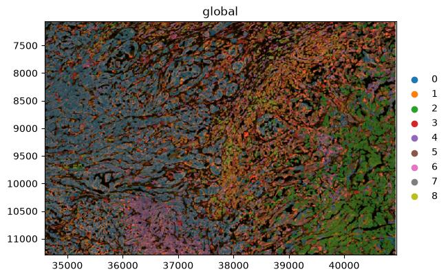

Two things follow from that choice, and both matter for how the results should be read.

The window contains an interface rather than uniform tumour, which is what makes the spatial statistics
later worth reading: there is something for adjacency to detect. And it cannot contain everything.
Keratinocytes, mast cells and an inflammatory fibroblast population live in the epidermal lobe at the
opposite end of the tissue, several millimetres away, so they are absent from every result that
follows. Their absence is a property of the window, not a finding about the tumour.

> <details-title>Elements in the object</details-title>
>
> | Element type | Name | Contents |
> | --- | --- | --- |
> | Images | `morphology_focus` | The multi-channel morphology image |
> | Labels | `cell_labels` | Segmentation mask, one integer label per cell |
> | Labels | `nucleus_labels` | Segmentation mask for nuclei |
> | Points | `transcripts` | Decoded transcripts with coordinates |
> | Shapes | `cell_boundaries`, `nucleus_boundaries` | Boundary polygons |
> | Tables | `table` | AnnData object with one observation per segmented cell |
> | Coordinate system | `global` | The shared coordinate system for all elements |
>
> The expression table annotates the **labels** element, not a shapes element. That is why the plots in
> this tutorial use **Render Labels** and leave the shapes inputs empty: a colour column from the table
> can only be drawn onto the element the table is linked to.
>
{: .details}

> <details-title>Optional: build the SpatialData object yourself from the Xenium output bundle</details-title>
>
> Everything below is optional. The analysis starts from the SpatialData object you have just imported, and this
> box records how it was made, for anyone who wants to apply the same preparation to another Xenium
> section.
>
> **The files needed from the Xenium output bundle**
>
> | File | Format | Contents |
> | --- | --- | --- |
> | `cell_feature_matrix.h5` | HDF5 | Counts per gene per segmented cell |
> | `cells.parquet` | Parquet | Per-cell metadata, including centroids, `cell_area` and `nucleus_area` |
> | `cells.zarr.zip` | Zarr archive | Segmentation masks for cells and nuclei |
> | `experiment.xenium` | JSON | Run specifications, including pixel size and channel names |
> | `morphology_focus_0000.ome.tif` to `0003.ome.tif` | OME-TIFF | The multi-channel morphology image |
> | `cell_boundaries.parquet` | Parquet | Cell boundary polygons |
> | `nucleus_boundaries.parquet` | Parquet | Nucleus boundary polygons |
> | `transcripts.parquet` | Parquet | Every decoded transcript with its coordinates |
>
> The same Zenodo record holds these files, and the complete uncropped section is there too as
> `melanoma.spatialdata.zip` if you would rather skip straight to the crop.
>
> 1. Import the bundle files from [Zenodo]({{ page.zenodo_link }}):
>
> ```
> {{ page.zenodo_link }}/files/cell_feature_matrix.h5
> {{ page.zenodo_link }}/files/cells.parquet
> {{ page.zenodo_link }}/files/cells.zarr.zip
> {{ page.zenodo_link }}/files/experiment.xenium
> {{ page.zenodo_link }}/files/morphology_focus_0000.ome.tif
> {{ page.zenodo_link }}/files/morphology_focus_0001.ome.tif
> {{ page.zenodo_link }}/files/morphology_focus_0002.ome.tif
> {{ page.zenodo_link }}/files/morphology_focus_0003.ome.tif
> {{ page.zenodo_link }}/files/cell_boundaries.parquet
> {{ page.zenodo_link }}/files/nucleus_boundaries.parquet
> {{ page.zenodo_link }}/files/transcripts.parquet
> ```
>
>
> 2.  with the following parameters:
> - *"Spatial Technology"*: `10x Genomics Xenium`
>     -  *"Cell feature matrix"*: `cell_feature_matrix.h5`
>     -  *"Cells metadata"*: `cells.parquet`
>     -  *"Cells zarr archive"*: `cells.zarr.zip`
>     -  *"Experiment xenium file containing specifications"*: `experiment.xenium`
>     -  *"Morphology focus images"*: the four `morphology_focus_000*.ome.tif` files
>     -  *"Polygons of cell boundaries"*: `cell_boundaries.parquet`
>     -  *"Polygons of nucleus boundaries"*: `nucleus_boundaries.parquet`
>     -  *"Transcripts"*: `transcripts.parquet`
>     - *"Represent cells as circles?"*: `No`
>     - *"Load cells labels?"*: `Yes`
>     - *"Load nucleus labels?"*: `Yes`
>     - *"Load morphology MIP?"*: `Yes`
>     - *"Load morphology focus?"*: `Yes`
>     - *"Load cells annotation from AnnData?"*: `Yes`
>     - *"Load gene expression only?"*: `Yes`
>     - *"Add H&E image?"*: `No`
>     - *"Add IF image?"*: `No`
>
> Rename the generated file `melanoma.spatialdata.zip`. This is the complete section, 112,551 cells.
>
>
> 3.  with the following parameters:
> -  *"SpatialData object"*: `melanoma.spatialdata.zip`
> - *"Operation"*: `Query a SpatialData object or SpatialElement within a bounding box. (sd.bounding_box_query)`
>     - *"Axes"*: `x,y`
>     - *"Minimum coordinates"*: `34588,7059`
>     - *"Maximum coordinates"*: `40941,11294`
>     - *"Target coordinate system"*: `global`
>     - *"Filter table?"*: `Yes`
>
> Rename the generated file `melanoma_roi.spatialdata.zip`. Cropping this way keeps the image, the
> segmentation masks, the transcripts and the table in step with one another, so every later plot stays
> correct without further adjustment.
>
> **Watch the units.** The cell coordinates in the observation table, `x_centroid` and `y_centroid`, are
> in **micrometres**, but the `global` coordinate system is in **pixels**. The Xenium pixel size is
> 0.2125 µm, so the two differ by a factor of 4.71. The window is x 7350–8700 µm and y 1500–2400 µm;
> dividing by 0.2125 gives the 34588–40941 and 7059–11294 above. Pass micrometres by mistake and the box
> lands on blank slide, no cell survives the query, and the job fails with
> `IndexError: list index out of range` from inside the table filter. That message means the filtered
> table no longer annotates any spatial element, because nothing was selected.
>
> **How the window was chosen.** Regions can be drawn by hand in [Xenium Explorer](https://www.10xgenomics.com/support/software/xenium-explorer/latest/tutorials/xe-selecting-multiple-regions-of-interest),
> which exports the outline as a polygon of vertices in micrometres, and **SpatialData Operations**
> accepts a polygon through `polygon_query` as well as a rectangle through `bounding_box_query`.
>
{: .details}

> <comment-title>Selecting your own region of interest</comment-title>
>
> The window used here is provided ready to use, so choosing a region is not part of this tutorial. If
> you want to cut your own region out of a Xenium section, these are the documented routes.
>
> - **Draw the region on the image.** Xenium Explorer can hold several selections on one section and
>   export each of them, described in
>   [Selecting multiple regions of interest](https://www.10xgenomics.com/support/software/xenium-explorer/latest/tutorials/xe-selecting-multiple-regions-of-interest).
>   A region can also be drawn interactively on a SpatialData object with `napari`, following the
>   SpatialData tutorial on
>   [annotating regions of interest](https://spatialdata.scverse.org/en/latest/tutorials/notebooks/notebooks/examples/napari_rois.html).
> - **Turn the outline into a query.** `bounding_box_query` takes `axes`, `min_coordinate`,
>   `max_coordinate` and a `target_coordinate_system`, and `polygon_query` takes a polygon or
>   multipolygon and a `target_coordinate_system`; both filter the annotating table by default. The
>   signatures are in the [SpatialData API reference](https://spatialdata.scverse.org/en/latest/api/operations.html),
>   and the [spatial query tutorial](https://spatialdata.scverse.org/en/latest/tutorials/notebooks/notebooks/examples/spatial_query.html)
>   works through both on a real dataset.
> - **Check the units first.** The coordinates are read in the units of the target coordinate system,
>   which is the trap described above. The SpatialData tutorial on
>   [transformations and coordinate systems](https://spatialdata.scverse.org/en/latest/tutorials/notebooks/notebooks/examples/transformations.html)
>   explains how a coordinate system relates to the stored data.
>
{: .comment}

> <question-title>Understand the preparation</question-title>
>
> 1. *"Represent cells as circles?"* is set to `No`. What would `Yes` do, and why is it the wrong choice here?
> 2. *"Load gene expression only?"* is set to `Yes`. What is excluded, and is that information lost?
> 3. Why does the tool ask for the morphology images as four separate files rather than one?
>
> > <solution-title></solution-title>
> >
> > 1. It would replace each measured cell outline with a circle whose centre and radius are derived from the segmentation label. That is a useful simplification for fast plotting of very large sections, but it discards the real cell shape. Since this tutorial filters on `cell_area` and plots the segmentation directly, we keep the measured labels.
> > 2. The panel includes negative controls: control probes, genomic controls, control codewords and unassigned codewords. With this switch set to `Yes`, only the 5,006 gene-expression features enter the expression matrix. The control counts are not lost, because they are also summarised per cell in `cells.parquet` and end up as columns in the observation table, where we can inspect them.
> > 3. Because the morphology image is multi-channel and the Xenium Analyzer writes one OME-TIFF per channel. This run used the multimodal cell segmentation staining kit, so there is a nuclear channel plus stains marking cell interiors and cell boundaries. The tool stacks them into a single image element, and `segmentation_method` in the observation table records which stain produced each cell's boundary.
> >
> {: .solution}
>
{: .question}


# Extract the expression table

The Scanpy tools work on AnnData, so the first analysis step pulls the `table` element out of the SpatialData object. The object itself stays in the history, because we need it again for every spatial plot.

> <hands-on-title>Export and inspect the AnnData table</hands-on-title>
>
> 1.  with the following parameters:
>    -  *"SpatialData object"*: `melanoma_roi.spatialdata.zip`
>    - *"Operation"*: `Export the table of a SpatialData object to anndata`
>        - *"Table name"*: `table`
>
> 2. Rename the generated file `initial Anndata table`
>
> 3.  with the following parameters:
>    -  *"Annotated data matrix"*: `initial Anndata table`
>    - *"What to inspect?"*: `General information about the object`
>
>    > <question-title></question-title>
>    >
>    > ```
>    > AnnData object with n_obs × n_vars = 10810 × 5006
>    > ```
>    >
>    > What do the two numbers refer to, and how do they relate to the published metrics for this dataset?
>    >
>    > > <solution-title></solution-title>
>    > >
>    > > `n_obs` is the number of segmented cells and `n_vars` the number of measured genes. The gene count matches the published panel size exactly: the development panel targets 5,006 genes (), and cropping a region removes cells, never genes. The cell count does not match the published 112,551, and should not: that figure is for the whole section, and we are working inside a window holding 10,810 of them, or 9.6%.
>    > >
>    > > Checking both numbers before going further is a cheap way to catch a crop that silently selected the wrong area, which is easy to do when the coordinate units are ambiguous.
>    > >
>    > {: .solution}
>    >
>    {: .question}
>
> 4.  with the following parameters:
>    -  *"Annotated data matrix"*: `initial Anndata table`
>    - *"What to inspect?"*: `Key-indexed observations annotation (obs)`
>
{: .hands_on}

The observation table already carries per-cell measurements made on the instrument, before Scanpy has calculated anything.

| Observation field | Meaning |
| --- | --- |
| `transcript_counts` | Transcripts assigned to the cell from the gene panel |
| `control_probe_counts`, `genomic_control_counts`, `control_codeword_counts` | Negative-control measurements used to estimate background |
| `unassigned_codeword_counts`, `deprecated_codeword_counts` | Decoded signal not attributed to a panel gene |
| `cell_area`, `nucleus_area` | Segmented areas in µm² |
| `nucleus_count` | Number of nuclei inside the cell boundary |
| `segmentation_method` | Which stain produced the boundary for this cell |
| `z_level`, `region`, `cell_id` | Imaging plane, annotated element, and cell identifier |

> <question-title>Read the observation table</question-title>
>
> Across the whole section `segmentation_method` takes three values: interior stain (18S) for 82,690 cells, boundary stain for 23,050 cells, and nucleus expansion of 5.0 µm for 3,009 cells. `nucleus_count` is 1 for 108,030 cells, 0 for 2,756 cells, and 2 or more for 1,764 cells. Inspect the same columns in your cropped object and you will see the same three categories in similar proportions.
>
> 1. What does a `nucleus_count` of 2 suggest about that object?
> 2. What does a `nucleus_count` of 0 suggest?
> 3. Why is it useful to know that 3,009 cells were segmented by nucleus expansion rather than from a stained boundary?
>
> > <solution-title></solution-title>
> >
> > 1. Two nuclei inside one boundary is the signature of a segmentation merge: two neighbouring cells have probably been enclosed as a single object, so its transcript profile is a mixture. Genuinely multinucleated cells do exist, so this is a flag rather than a verdict.
> > 2. No nucleus was detected inside the boundary. The object may be a fragment of a cell whose nucleus sits in a different imaging plane, or a boundary drawn around cytoplasm alone.
> > 3. Nucleus expansion is the fallback used when the membrane stains do not give a usable boundary, so the boundary becomes a fixed geometric approximation instead of a measured one. Those cells are more likely to pick up transcripts from their neighbours, and it is worth knowing how many there are before annotating small clusters.
> >
> {: .solution}
>
{: .question}

# Quality control before filtering

Several variables need to be checked to assess the quality of the data and to determine reasonable values for filtering. `total_counts` measures how much signal a cell carries and `n_genes_by_counts` how many different genes it detects. The `pct_counts_in_top_N_genes` metrics report the share of a cell's counts held by its most abundant genes. On top of these, Xenium gives us `cell_area`, which is measured from the image and is independent of the transcripts.

> <hands-on-title>Compute QC metrics</hands-on-title>
>
> 1.  with the following parameters:
>    -  *"Annotated data matrix"*: `initial Anndata table`
>    - *"Method used for inspecting"*: `Calculate quality control metrics, using 'pp.calculate_qc_metrics'`
>        - *"Proportions of top genes to cover"*: `50,100,200,300`
>
> 2. Rename the generated file `QC metrics before filtering`
>
{: .hands_on}

> <hands-on-title>Visualise QC metrics</hands-on-title>
>
> 1.  with the following parameters:
>    -  *"Annotated data matrix"*: `QC metrics before filtering`
>    - *"Method used for plotting"*: `Generic: Violin plot, using 'pl.violin'`
>        - *"Keys for accessing variables"*: `Subset of variables in 'adata.var_names' or fields of '.obs'`
>            - *"Keys for accessing variables"*: `n_genes_by_counts, total_counts, cell_area`
>        - In *“Violin plot attributes”*:
>            - *“Display keys in multiple panels”*: `Yes`
>
>
> 2.  with the following parameters:
>    -  *"Annotated data matrix"*: `QC metrics before filtering`
>    - *"Method used for plotting"*: `Generic: Scatter plot along observations or variables axes, using 'pl.scatter'`
>        - *"x coordinate"*: `total_counts`
>        - *"y coordinate"*: `n_genes_by_counts`
>        - *"Color by"*: `cell_area`
>
{: .hands_on}

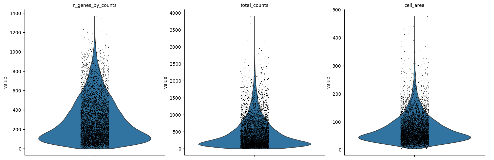

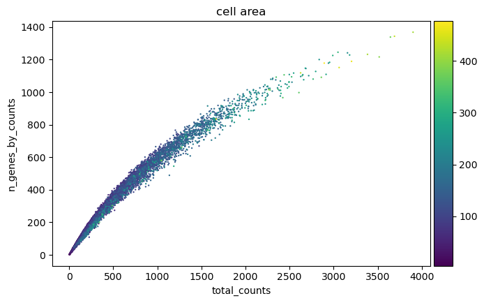

Plotting the same metrics on the tissue is the check that separates a technical failure from a real tissue compartment. To do that, the annotated table has to go back into the SpatialData object.

> <hands-on-title>Map the QC metrics onto the morphology image</hands-on-title>
>
> 1.  with the following parameters:
>    -  *"SpatialData object"*: `melanoma_roi.spatialdata.zip`
>    - *"Operation"*: `Import anndata table to a SpatialData object`
>        -  *"annotated data object to add"*: `QC metrics before filtering`
>        - *"Table name"*: `table_processed`
>
>  Rename the generated file `SpatialData with QC metrics`
>
> 2.  with the following parameters:
>    -  *"SpatialData object"*: `SpatialData with QC metrics`
>    - In *"Render Images"*:
>        - *"Image element name"*: `morphology_focus`
>    - In *"Render Labels"*:
>        - *"Labels element name"*: `cell_labels`
>        - *"Color column"*: `total_counts`
>        - *"Table name"*: `table_processed`
>    - In *"Plot Display Parameters"*:
>        - *"Coordinate system(s)"*: `global`
>
> 3.  with the following parameters:
>    -  *"SpatialData object"*: `SpatialData with QC metrics`
>    - In *"Render Images"*:
>        - *"Image element name"*: `morphology_focus`
>    - In *"Render Labels"*:
>        - *"Labels element name"*: `cell_labels`
>        - *"Color column"*: `n_genes_by_counts`
>        - *"Table name"*: `table_processed`
>    - In *"Plot Display Parameters"*:
>        - *"Coordinate system(s)"*: `global`
>
{: .hands_on}

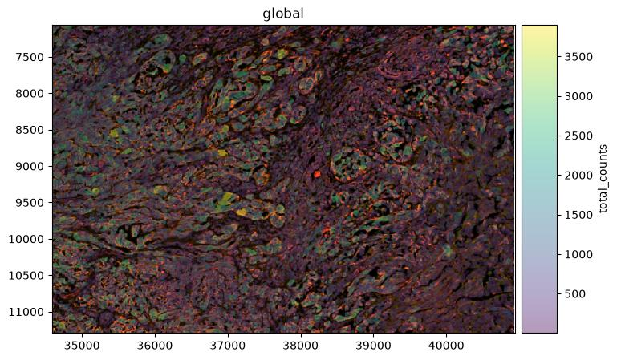

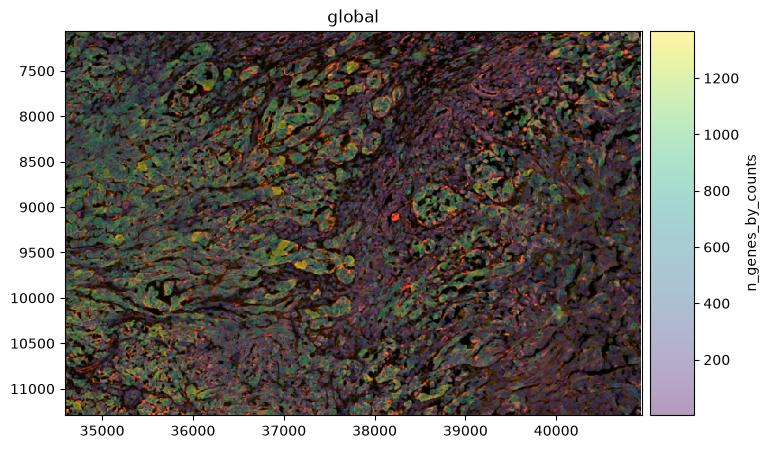

> <question-title>Interpret the QC output</question-title>
>
> The violin plots show the shape of each distribution but not the numbers behind it. To read the numbers off the object rather than off the picture, run  on `QC metrics before filtering` with *"What to inspect?"*: `Key-indexed observations annotation (obs)`, then open the resulting table with  to get medians and counts for any column. For this window before filtering that gives a median of 316 total counts and 236 detected genes per cell, and a median `cell_area` of 61.5 µm² with the first percentile at 11.9 µm² and the maximum at 476.9 µm².
>
> The two figures used in the next question come from the same table. Counting rows where `cell_area` is below 10 gives 60 objects, whose median `total_counts` is 21; counting rows above 400 gives 8 objects, whose median `total_counts` is 3,132. The area filter applied later removes 47 of those 60 rather than all of them, because the gene filter has already taken the other 13. In Galaxy you can get both with  on the `obs` table (`c8<10`, then `c8>400`, adjusting the column number to wherever `cell_area` sits in your export) followed by **Datamash**. It is worth doing this once by hand, because every threshold in the next section is chosen from these numbers rather than from a rule of thumb.
>
> 1. The scatter plot shows a tight curved relationship between total counts and detected genes rather than a straight line. Why is that curve expected?
> 2. 60 objects have an area below 10 µm², with a median of 21 transcripts. 8 objects have an area above 400 µm², with a median of 3,132 transcripts against 316 across all cells. What two different problems do these tails suggest?
> 3. Why is the spatial map necessary before deciding to remove low-count cells?
>
> > <solution-title></solution-title>
> >
> > 1. Each additional transcript is more and more likely to be a repeat of a gene the cell has already detected, so the count of distinct genes saturates as total counts rise. On a 5,006-gene panel that ceiling arrives sooner than in a whole-transcriptome assay, which bends the curve visibly.
> > 2. The small, low-count tail looks like fragments: boundaries around part of a cell, or debris. The large, high-count tail looks like the opposite failure, boundaries enclosing more than one cell, which is why those objects carry roughly nine times the median transcript content. Both are candidate segmentation errors, and they need thresholds at opposite ends of the distribution.
> > 3. Because low counts can mark real biology rather than a technical failure. This sample is documented as containing necrosis along the outer dermal edge (), and dying tissue genuinely yields little RNA. The map shows whether low-count cells are scattered, which points to a technical cause, or concentrated in one region, which points to a tissue explanation that should be reported rather than quietly discarded.
> >
> {: .solution}
>
{: .question}

# Filtering

We filter in two stages: first on transcript content, then on segmented cell area. The transcript thresholds to filtere cells with fewer than 10 transcripts before clustering. The area window is set to 10 and 400.

Each step below is a separate job that takes the output of the previous job, and inspecting the object after each one is what makes the effect of every threshold visible.

> <hands-on-title>Filter on transcript content</hands-on-title>
>
> 1.  with the following parameters:
>    -  *"Annotated data matrix"*: `QC metrics before filtering`
>    - *"Method used for filtering"*: `Filter cell outliers based on counts and numbers of genes expressed, using 'pp.filter_cells'`
>        - *"Filter"*: `Minimum number of genes expressed`
>            - *"Minimum number of genes expressed required for a cell to pass filtering"*: `10`
>
> 2.  with the following parameters:
>    -  *"Annotated data matrix"*: output of **Scanpy filter** 
>    - *"What to inspect?"*: `General information about the object`
>
>    > <question-title></question-title>
>    >
>    > ```
>    > AnnData object with n_obs × n_vars = 10777 × 5006
>    > ```
>    >
>    > How many cells have been removed because they express fewer than 10 genes?
>    >
>    > > <solution-title></solution-title>
>    > >
>    > > 10,810 − 10,777 = 33 cells, only 0.3 per cent. That is far gentler than the same filter applied to the whole section, which removes 3,121 of 112,551, or 2.8 per cent. The reason is where the window sits: nearly all of the very low-content objects in this sample lie outside the tumour, in the necrotic zone and along the tissue edges, and the window contains neither.
>    > >
>    > {: .solution}
>    >
>    {: .question}
>
> 3.  with the following parameters:
>    -  *"Annotated data matrix"*: output of **Scanpy filter** 
>    - *"Method used for filtering"*: `Filter cell outliers based on counts and numbers of genes expressed, using 'pp.filter_cells'`
>        - *"Filter"*: `Minimum number of counts`
>            - *"Minimum number of counts required for a cell to pass filtering"*: `10`
>
> 4.  with the following parameters:
>    -  *"Annotated data matrix"*: output of **Scanpy filter** 
>    - *"What to inspect?"*: `General information about the object`
>
>    > <question-title></question-title>
>    >
>    > ```
>    > AnnData object with n_obs × n_vars = 10777 × 5006
>    > ```
>    >
>    > No cell has been removed by the minimum-counts filter. Why not?
>    >
>    > > <solution-title></solution-title>
>    > >
>    > > The two thresholds are nested for this data. A cell that detects at least 10 distinct genes must carry at least 10 transcripts, because every detected gene contributes at least one count, so every cell that survived the previous filter already satisfies this one. It is still worth running: the order of the two filters is not fixed, and the tally documents that the threshold was applied.
>    > >
>    > {: .solution}
>    >
>    {: .question}
>
> 5.  with the following parameters:
>    -  *"Annotated data matrix"*: output of **Scanpy filter** 
>    - *"Method used for filtering"*: `Filter genes based on number of cells or counts, using 'pp.filter_genes'`
>        - *"Filter"*: `Minimum number of cells expressed`
>            - *"Minimum number of cells expressed required for a gene to pass filtering"*: `3`
>
> 6.  with the following parameters:
>    -  *"Annotated data matrix"*: output of **Scanpy filter** 
>    - *"Method used for filtering"*: `Filter genes based on number of cells or counts, using 'pp.filter_genes'`
>        - *"Filter"*: `Minimum number of counts`
>            - *"Minimum number of counts required for a gene to pass filtering"*: `3`
>
> 7.  with the following parameters:
>    -  *"Annotated data matrix"*: output of **Scanpy filter** 
>    - *"What to inspect?"*: `General information about the object`
>
>    > <question-title></question-title>
>    >
>    > ```
>    > AnnData object with n_obs × n_vars = 10777 × 4761
>    > ```
>    >
>    > 245 genes have been removed. Run the same two filters on the whole section and none are. What changed?
>    >
>    > > <solution-title></solution-title>
>    > >
>    > > The size of the window, not the biology of the panel. Every one of the 5,006 probes was designed to detect a gene expressed somewhere in human tissue (), and across 112,551 cells each of them registers in more than three. Inside a 1,350 × 900 µm window holding 10,810 cells, 245 of them do not.
> > >
> > > Most of those genes mark populations the window does not contain. Keratinocytes, mast cells and the inflammatory fibroblast state all live at the far end of the section, so their markers have nothing to be detected in here. This is the first concrete cost of cropping, and it is worth noticing at this point rather than being surprised later when a gene you expected to plot is missing from the object.
> > >
> > > It also flips the usual advice. On a whole-transcriptome assay, gene filters remove genes that are not expressed in the tissue at all. Here they are removing genes that are perfectly real but absent from the field of view.
>    > >
>    > {: .solution}
>    >
>    {: .question}
>
>
>  Rename the generated file `AnnData after transcript filtering`
>
{: .hands_on}

> <comment-title>Why no max_counts/max_genes upper filter here</comment-title>
>
> `pp.filter_cells` filters outliers on both ends of the count distribution, not only the low end
> (). The high end is normally used to catch multiplets: 10x's QC guidance
> for droplet platforms flags an unusually high feature count as a multiplet signal and suggests a cutoff
> of two to five MADs above the median (), and Scrublet is built to detect the
> same thing by simulating merged cells from the data (). Both are standard
> for droplet-based data, where there is no other way to catch a multiplet.
>
> For Xenium the same failure mode, two cells merged by a segmentation error, is what the `cell_area`
> filter above already removes, directly from the segmentation rather than from counts
> ().
>
{: .comment}

Now the morphology filter. `cell_area` is reported in µm², and the window is 10 to 400 µm²: just below the first percentile of this window at the bottom, which is 11.9 µm², and well above the 99.5th percentile at the top, which is 284.8 µm².

> <hands-on-title>Filter on segmented cell area</hands-on-title>
>
> 1.  with the following parameters:
>    -  *"Annotated data matrix"*: `AnnData after transcript filtering`
>    - *"Method used for filtering"*: `Filter on any column of observations or variables`
>        - *"What to filter?"*: `Observations (obs)`
>        - *"Type of filtering?"*: `By key (column) values`
>            - *"Key to filter"*: `cell_area`
>            - *"Type of value to filter"*: `Number`
>                - *"Filter"*: `greater than`
>                - *"Value"*: `10`
>
> 2.  with the following parameters:
>    -  *"Annotated data matrix"*: output of **Scanpy filter** 
>    - *"What to inspect?"*: `General information about the object`
>
>    > <question-title></question-title>
>    >
>    > ```
>    > AnnData object with n_obs × n_vars = 10730 × 4761
>    > ```
>    >
>    > 47 objects have been removed for being smaller than 10 µm². Across the whole section the same filter removes 478. Why is the window so much cleaner?
>    >
>    > > <solution-title></solution-title>
>    > >
>    > > For the same reason the transcript filters barely bit: tiny segmentation fragments are concentrated at tissue edges and in the degraded necrotic zone, and this window contains dense, well-preserved tumour. A quality control threshold tuned on one region should not be assumed to transfer to another part of the same slide.
>    > >
>    > > Some fragments were also already gone. Very small objects carry very few transcripts, so the minimum-genes filter removes some of them before the area filter ever runs; the two criteria are not independent.
>    > >
>    > {: .solution}
>    >
>    {: .question}
>
> 3.  with the following parameters:
>    -  *"Annotated data matrix"*: output of **Scanpy filter** 
>    - *"Method used for filtering"*: `Filter on any column of observations or variables`
>        - *"What to filter?"*: `Observations (obs)`
>        - *"Type of filtering?"*: `By key (column) values`
>            - *"Key to filter"*: `cell_area`
>            - *"Type of value to filter"*: `Number`
>                - *"Filter"*: `less than`
>                - *"Value"*: `400`
>
> 4.  with the following parameters:
>    -  *"Annotated data matrix"*: output of **Scanpy filter** 
>    - *"What to inspect?"*: `General information about the object`
>
>    > <question-title></question-title>
>    >
>    > ```
>    > AnnData object with n_obs × n_vars = 10722 × 4761
>    > ```
>    >
>    > 8 large objects have been removed. Was applying this filter still worth it?
>    >
>    > > <solution-title></solution-title>
>    > >
>    > > Yes, for two reasons. The first is that a filter which removes almost nothing is still evidence: it tells you the segmentation in this window is good, which is information you did not have before running it. A step that produces a null result is not a wasted step.
>    > >
>    > > The second is that this filter is doing a job nothing else is doing. The count-based upper limits were deliberately switched off, so the area threshold is the only thing standing between the analysis and segmentation merges, objects where one boundary has enclosed two cells and carries the transcripts of both. Across the whole section it removes 203 such objects with a median of 2,694 transcripts each. Here there are only 8, but they would have been just as misleading.
>    > >
>    > > The practical consequence is that the area threshold has to be reported as affecting count distributions too. Anyone reading only the count thresholds would wrongly conclude that no upper limit was applied at all.
>    > >
>    > {: .solution}
>    >
>    {: .question}
>
> 5.  with the following parameters:
>    -  *"Annotated data matrix"*: output of **Scanpy filter** 
>    - *"Method used for inspecting"*: `Calculate quality control metrics, using 'pp.calculate_qc_metrics'`
>        - *"Proportions of top genes to cover"*: `50,100,200,300`
>
> 6. Rename the generated file `Filtered AnnData table`
>
{: .hands_on}

Filtering retained 10,722 of 10,810 cells, which is 99.2 per cent, and removed 245 of the 5,006 genes.

| Stage | Cells | Genes |
| --- | ---: | ---: |
| exported table | 10,810 | 5,006 |
| after the transcript filters | 10,777 | 4,761 |
| cells, minimum area | 10,730 | 4,761 |
| cells, maximum area | 10,722 | 4,761 |

Repeating the {QC} plots on the filtered object, and mapping them back onto the tissue, shows what changed.

> <hands-on-title>Visualise QC after filtering</hands-on-title>
>
> 1. Repeat the two  jobs from the *Visualise QC metrics* box, using `Filtered AnnData table` as the *"Annotated data matrix"* each time
>
>  Re-run the tool
>
> 2.  with the following parameters:
>    -  *"SpatialData object"*: `melanoma_roi.spatialdata.zip`
>    - *"Operation"*: `Import anndata table to a SpatialData object`
>        -  *"annotated data object to add"*: `Filtered AnnData table`
>        - *"Table name"*: `table_processed`
>
>    Rename the generated file `SpatialData with Filtered metrics`
>
> 3. Repeat the two  jobs from the *Map the QC metrics* box, using the output of step 2 as the *"SpatialData object"*
>
{: .hands_on}


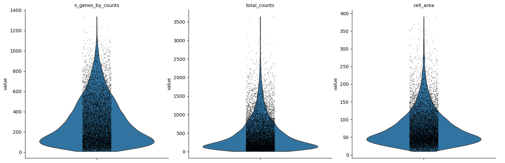

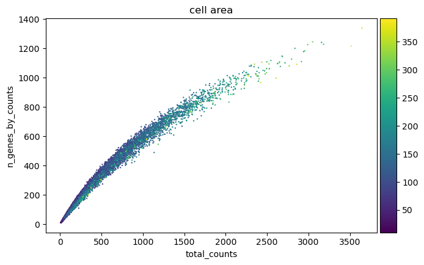

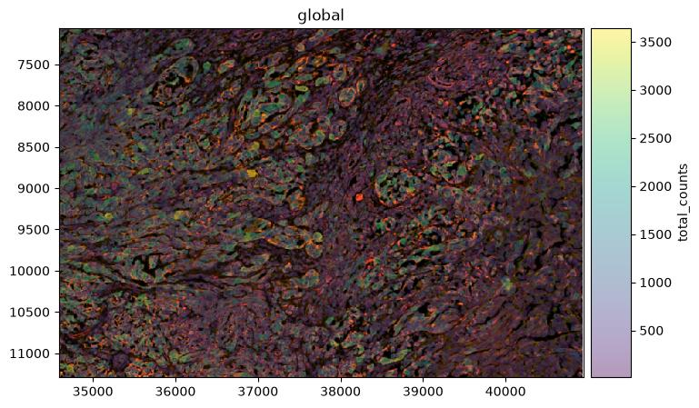

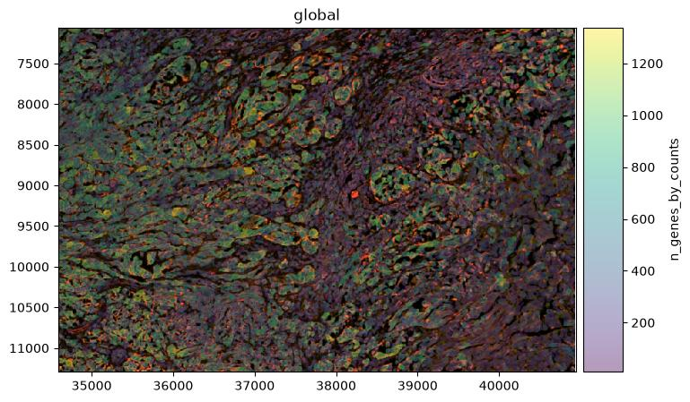

> <comment-title>Would a stricter transcript threshold be better?</comment-title>
>
> A minimum of 10 transcripts per cell and retains 99.7 per cent of cells here, but it is a permissive choice. Later in this tutorial two Leiden groups appear with medians of 105 and 174 transcripts per cell, 3,741 cells in total, which pass this filter while carrying little expression information.
>
> Raising the threshold to around 50 transcripts would remove 623 cells, 419 of them from the lymphocyte group, and simplify the clustering.
>
{: .comment}

# Preserving counts, normalisation and feature selection

Counts per cell vary for reasons that include cell size and segmentation, so expression is put on a common scale before cells are compared. The target of 10,000 counts per cell is not arbitrary: CellTypist expects input normalised to a total of 10,000 and log1p-transformed, and CellTypist runs later in this analysis ().

> <details-title>Optional: Skip the filtration process</details-title>
>
> The same Zenodo record contains the filtered object, so the training can continue from here.
>
> 1. Import these files from [Zenodo]({{ page.zenodo_link }}):
>
>    ```
>    {{ page.zenodo_link }}/files/Filtered_AnnData_table.h5ad
>    {{ page.zenodo_link }}/files/melanoma_roi.spatialdata.zip
>    ```
>
{: .details}


> <comment-title>Preserving the counts before normalisation</comment-title>
>
> The unmodified count matrix is copied to `layers['counts']` before normalisation to preserving the measured counts for later methods or reprocessing while the working matrix is transformed.
>
{: .comment}

> <hands-on-title>Preserve the counts, normalise and log-transform</hands-on-title>
>
> 1. Run  with:
>    -  *"Annotated data matrix"*: `Filtered AnnData table`
>    - *"Function to manipulate the object"*: `Copy layers from a different anndata object`
>    -  *"Source anndata object"*: `Filtered AnnData table`
>    - In *"Layers to copy"*:
>        - *"Layer to be copied from the source anndata"*: `X`
>        - *"Target layer name"*: `counts`
>
>    Rename the output `Filtered AnnData with counts layer`.
>
> 2.  with the following parameters:
>    -  *"Annotated data matrix"*: `Filtered AnnData with counts layer`
>    - *"Method used for normalization"*: `Normalize counts per cell, using 'pp.normalize_total'`
>        - *"Target sum"*: `10000.0`
>
> 3.  with the following parameters:
>    -  *"Annotated data matrix"*: output of **Scanpy normalize** 
>    - *"Method used for inspecting"*: `Logarithmize the data matrix, using 'pp.log1p'`
>
> 4. Rename the generated file `Log-normalised AnnData`
>
{: .hands_on}

> <hands-on-title>Identify the highly variable genes</hands-on-title>
>
> 1.  with the following parameters:
>    -  *"Annotated data matrix"*: `Log-normalised AnnData`
>    - *"Method used for filtering"*: `Annotate (and filter) highly variable genes, using 'pp.highly_variable_genes'`
>        - *"Choose the flavor for identifying highly variable genes"*: `Cell Ranger`
>            - *"Number of highly-variable genes to keep"*: `2000`
>        - *"Number of bins for binning the mean gene expression"*: `20`
>        - *"Inplace subset to highly-variable genes"*: `No`
>
> 2. Rename the generated file `AnnData with HVGs`
>
> 3.  with the following parameters:
>    -  *"Annotated data matrix"*: `AnnData with HVGs`
>    - *"Method used for plotting"*: `Preprocessing: Plot dispersions versus means for genes, using 'pl.highly_variable_genes'`
>
{: .hands_on}

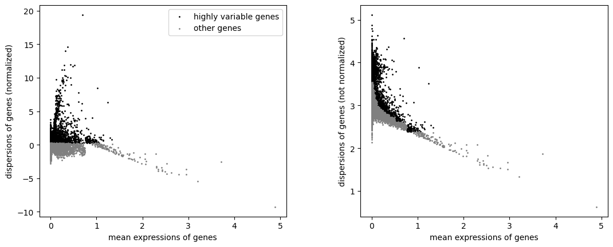

> <question-title>Interpret the feature selection</question-title>
>
> 1. *"Inplace subset to highly-variable genes"* is `No`. What stays in the object, and what does {PCA} then use?
> 2. Why does selecting 2,000 of 5,006 genes matter less here than selecting 2,000 of 30,000 would on a whole-transcriptome dataset?
>
> > <solution-title></solution-title>
> >
> > 1. All 5,006 genes stay, and the 2,000 selected ones are flagged in a `highly_variable` column. Scanpy's {PCA} uses that flag by default, so the embedding is built from the 2,000 selected genes while the other 3,006 remain available for marker ranking, plotting and reference transfer. In the reference run the {PCA} loadings are non-zero for exactly the 2,000 flagged genes, which confirms the mask was applied.
> > 2. Because the panel is already a curated selection: every one of the 5,006 genes was chosen to help distinguish cell types and pathways (). The 3,006 genes left out are not the uninformative background that feature selection usually removes. On a targeted panel, feature selection mainly down-weights genes that are uniform across this particular section, and less information is lost than the ratio suggests.
> >
> {: .solution}
>
{: .question}

# Dimensionality reduction and clustering

{PCA} compresses correlated expression patterns into orthogonal components. The neighbourhood graph
built from those components connects cells with similar expression, not cells that sit near each other
in the section; Scanpy builds this **expression-neighbour graph** from {PCA} coordinates
(), Leiden clustering partitions it (), and {UMAP}
gives a two-dimensional view of it. {UMAP} shows expression similarity; it is not a map of the tissue.
Squidpy builds a second, spatial-neighbour graph later in this tutorial, connecting cells that are
physically close in the section rather than similar in expression.

> <hands-on-title>Run the PCA</hands-on-title>
>
> 1.  with the following parameters:
>    -  *"Annotated data matrix"*: `AnnData with HVGs`
>    - *"Method used"*: `Computes PCA (principal component analysis) coordinates, loadings and variance decomposition, using 'pp.pca'`
>        - *"Number of principal components to compute"*: `50`
>        - *"Change to use different initial states for the optimization"*: `0`
>
> 2.  with the following parameters:
>    -  *"Annotated data matrix"*: output of **Scanpy cluster, embed** 
>    - *"Method used for plotting"*: `PCA: Scatter plot in PCA coordinates, using 'pl.pca'`
>        - *"Keys for annotations of observations/cells or variables/genes"*: `log1p_total_counts,log1p_n_genes_by_counts,total_counts,cell_area`
>
{: .hands_on}

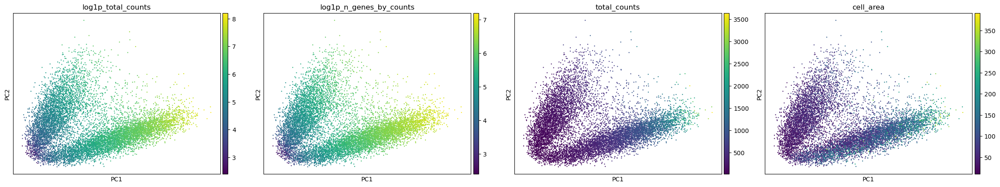

> <comment-title>Why the matrix is not scaled</comment-title>
>
> `pp.scale` is not run here. CellTypist requires a matrix normalised to 10,000 counts per cell and
> log1p-transformed (), and z-scored values are neither; they also break the
> expression proportions LIANA calculates from the same matrix. Scanpy's {PCA} centres the data itself
> and reads the `highly_variable` flag set in the previous step, so nothing is lost from the embedding
> by leaving the scaling out.
>
{: .comment}

> <hands-on-title>Compute the neighbourhood graph and the UMAP</hands-on-title>
>
> 1.  with the following parameters:
>    -  *"Annotated data matrix"*: the {PCA} output
>    - *"Method used for inspecting"*: `Compute a neighborhood graph of observations, using 'pp.neighbors'`
>        - *"The size of local neighborhood used for manifold approximation"*: `15`
>        - *"Distance metric"*: `euclidean`
>        - *"Numpy random seed"*: `0`
>
> 2.  with the following parameters:
>    -  *"Annotated data matrix"*: output of **Scanpy Inspect and manipulate** 
>    - *"Method used"*: `Embed the neighborhood graph using UMAP, using 'tl.umap'`
>        - *"Minimum distance"*: `0.5`
>        - *"Spread"*: `1.0`
>
> 3. Rename the generated file `AnnData with UMAP`
>
> 4.  with the following parameters:
>    -  *"Annotated data matrix"*: `AnnData with UMAP`
>    - *"Method used for plotting"*: `Embeddings: Scatter plot in UMAP basis, using 'pl.umap'`
>        - *"Keys for annotations of observations/cells or variables/genes"*: `log1p_total_counts,log1p_n_genes_by_counts,total_counts,cell_area`
>
{: .hands_on}

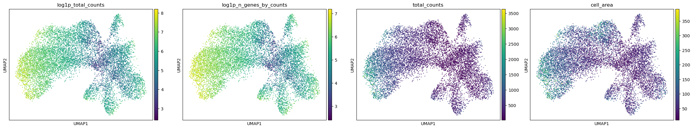

> <question-title>Should total counts be regressed out?</question-title>
>
> These panels show that transcript content is structured in the embedding rather than scattered at random. Scanpy offers `pp.regress_out` to remove a covariate before {PCA}, and this analysis does not use it.
>
> 1. What is the argument for regressing out `total_counts` and `cell_area`?
> 2. What is the argument against it in this dataset?
> 3. What should be done instead?
>
> > <solution-title></solution-title>
> >
> > 1. If transcript content drives the embedding, clusters may end up separating cells by how much signal they carry rather than by what they express, which would be a technical artefact.
> > 2. In a single-cell assay, transcript content is partly biological. Cell size and total RNA content genuinely differ between cell types, and in this window they do so systematically: the high-content melanocytic group has a median area of 122 µm² and 855 counts, while the T and NK group has 38 µm² and 105 counts. Regressing these covariates out would remove real differences between populations along with the technical component, and Scanpy itself warns that `regress_out` can overcorrect.
> > 3. Leave the covariates in, then check every resulting group for marker evidence that is independent of its depth, and ask whether any group is defined only by low content. That is what the rest of this tutorial does, and it finds one group, `2`, whose distinctness rests as much on low transcript content as on a distinct expression programme. Regression would have hidden that instead of exposing it.
> >
> {: .solution}
>
{: .question}

## Clustering at three resolutions

Leiden partitions the expression-neighbour graph, and the resolution controls how finely (). Testing several resolutions shows which structures are stable and which appear only when the partition is pushed. We use the three values `0.2`, `0.4` and `0.6` and store each result under its own key.

> <hands-on-title>Cluster the neighbourhood graph</hands-on-title>
>
> 1.  with the following parameters:
>    -  *"Annotated data matrix"*: `AnnData with UMAP`
>    - *"Method used"*: `Cluster cells into subgroups, using 'tl.leiden'`
>        - *"Coarseness of the clustering"*: `0.2`
>        - *"Key under which to add the cluster labels"*: `leiden_res_0.2`
>        - *"Use weights from knn graph"*: `Yes`
>        - *"How many iterations of the Leiden clustering algorithm to perform"*: `2`
>        - *"Random state"*: `0`
>
> 2.  with the following parameters:
>    -  *"Annotated data matrix"*: output of **Scanpy cluster, embed** 
>    - *"Method used"*: `Cluster cells into subgroups, using 'tl.leiden'`
>        - *"Coarseness of the clustering"*: `0.4`
>        - *"Key under which to add the cluster labels"*: `leiden_res_0.4`
>        - *"Use weights from knn graph"*: `Yes`
>        - *"How many iterations of the Leiden clustering algorithm to perform"*: `2`
>        - *"Random state"*: `0`
>
> 3.  with the following parameters:
>    -  *"Annotated data matrix"*: output of **Scanpy cluster, embed** 
>    - *"Method used"*: `Cluster cells into subgroups, using 'tl.leiden'`
>        - *"Coarseness of the clustering"*: `0.6`
>        - *"Key under which to add the cluster labels"*: `leiden_res_0.6`
>        - *"Use weights from knn graph"*: `Yes`
>        - *"How many iterations of the Leiden clustering algorithm to perform"*: `2`
>        - *"Random state"*: `0`
>
> 4. Rename the generated file `AnnData with Leiden comparison`
>
> 5.  with the following parameters:
>    -  *"Annotated data matrix"*: `AnnData with Leiden comparison`
>    - *"Method used for plotting"*: `Embeddings: Scatter plot in UMAP basis, using 'pl.umap'`
>        - *"Keys for annotations of observations/cells or variables/genes"*: `leiden_res_0.2,leiden_res_0.4,leiden_res_0.6`
>
{: .hands_on}

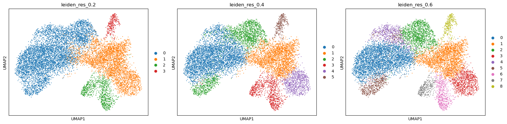

| Resolution | Groups |
| --- | ---: |
| 0.2 | 4 |
| 0.4 | 6 |
| 0.6 | 9 |

We continue with `leiden_res_0.6`, and the reason is worth setting out, because choosing a resolution is
the step in this analysis with the least guidance and the most consequence.

Leiden partitions are close to hierarchical in practice, so the most informative comparison is not the
group count but what each additional split is made of. That comparison uses each partition's own marker
genes, not cluster membership alone, and the marker-ranking procedure for the resolution finally chosen
is set out in the next section. At 0.2 one group carries *CD3E*, *CD4*, *CD8A* and *IL2RG* together with
*CYBB*, *MRC1*, *CD14* and *CTSC*: T cells and macrophages in the same group. Those are separate
haematopoietic lineages, so 0.2 is too coarse whatever else it gets right.

At 0.4 the immune compartment separates correctly, but one group of 913 cells ranks *POSTN*, *COL5A1*,
*COL5A2* and *SULF1* alongside *COL4A1*, *COL4A2* and *PDGFRB*. Collagen V is an interstitial fibrillar
collagen produced by fibroblasts; collagen IV is a basement-membrane collagen deposited around vessels.
At 0.6 those 913 cells divide 586 / 315, with *COL11A1*, *CTHRC1* and *CTSK* on one side and *PECAM1*,
*CD34* and *KDR* on the other. Those marker sets do not overlap, which is the signature of two lineages
rather than two states of one.

Going to 0.6 also separates 631 cells from the melanoma group whose ranked genes are *LDHA*, *SLC2A3*,
*ALDOA*, *PKM*, *ENO2*, *BNIP3*, *EGLN1* and *ADM*: four glycolytic enzymes, a glucose transporter and
three hypoxia-associated genes, which is a coherent programme rather than a scatter of unrelated genes.

The group sizes at 0.6 are:

| Group | Cells | Group | Cells |
| --- | ---: | --- | ---: |
| `0` | 3,629 | `5` | 626 |
| `1` | 2,337 | `6` | 596 |
| `2` | 1,404 | `7` | 317 |
| `3` | 885 | `8` | 297 |
| `4` | 631 | | |

> <question-title>Compare the resolutions</question-title>
>
> 1. What evidence separates a split worth keeping from a split that is only noise?
> 2. Does choosing 0.6 establish that the window contains nine cell populations?
> 3. Two of the nine groups, `2` and `5`, are both melanocytic and share *VGF*, *S100A1*, *MME* and *PAEP*. Is that an over-split?
>
> > <solution-title></solution-title>
> >
> > 1. Three things, and they are independent of one another. Whether the new group has significant marker genes of its own rather than a weaker version of its parent's; whether those markers belong to a recognised programme rather than being an unrelated list; and whether the group differs from its parent in expression rather than only in transcript content. The fibroblast and endothelial split passes all three. A group that appears with no significant markers and a much lower median count than its parent is a depth artefact, not a population.
> > 2. No. A partition is a hypothesis about structure, and the marker genes, the position in the tissue and the quality control profile are what turn a group into a claim about biology. Here two groups are melanocytic states rather than separate populations, so the number of distinct populations the evidence supports is smaller than nine.
> > 3. The data argue against a simple over-split, and this is a good case for checking the quality control profile before deciding. Group `5` has a median of 855 transcripts and 506 detected genes over a median area of 122 µm², the highest content of any group in the window; group `2` has 174 transcripts and 128 genes over 78 µm². They also differ in programme, not only in depth: group `5` adds *GSTO1*, *CD109*, *MELTF*, *SOAT1* and *SPOCK1*, and CellTypist assigns it the `Melanocyte` label for 100 per cent of its cells at the second-highest mean confidence in the dataset. A more cautious reading is that group `2` is the one to question, since low content and a high proportion of counts in its top 50 genes are exactly what a shallow measurement looks like.
> >
> {: .solution}
>
{: .question}

> <comment-title>A Leiden group is a label, not a cell type</comment-title>
>
> A **Leiden group** is simply the set of cells given the same Leiden label. It becomes a candidate cell population only when its ranked genes, its position in the tissue and its {QC} profile all point the same way.
>
{: .comment}


# Marker genes

Ranked genes show which genes separate each group from all the remaining cells. We use the Wilcoxon rank-sum test with Benjamini-Hochberg correction.

> <hands-on-title>Rank the marker genes</hands-on-title>
>
> 1.  with the following parameters:
>    -  *"Annotated data matrix"*: `AnnData with Leiden comparison`
>    - *"Method used for inspecting"*: `Rank genes for characterizing groups, using 'tl.rank_genes_groups'`
>    - *"Get ranked genes as a Tabular file?"*: `Yes`
>        - *"The key of the observations grouping to consider"*: `leiden_res_0.6`
>        - *"Comparison"*: `Compare each group to the union of the rest of the group`
>        - *"Method"*: `Wilcoxon-Rank-Sum`
>            - *"P-value correction method"*: `Benjamini-Hochberg`
>
> 2. Rename the tabular output `ranked_genes table` and the AnnData output `AnnData with markers`
>
> 3.  with the following parameters:
>    -  *"Annotated data matrix"*: `AnnData with markers`
>    - *"Method used for plotting"*: `Marker genes: Plot ranking of genes using dotplot plot, using 'pl.rank_genes_groups'`
>        - *"Number of genes to show"*: `20`
>        - *"Font size"*: `8`
>
{: .hands_on}


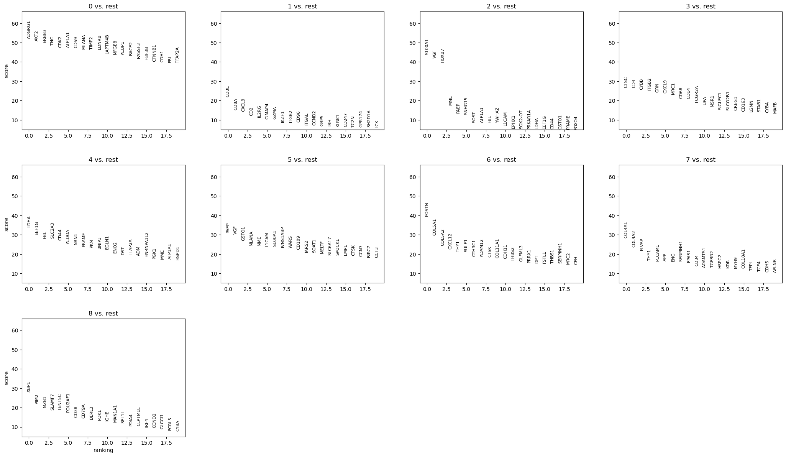

> <warning-title>Discard ADGRG1 before interpreting these results</warning-title>
>
> *ADGRG1* is the top-ranked gene for group `0`, and it must not be reported as a marker. 10x Genomics states that *ADGRG1*, together with *NMBR*, *OSMR*, *OSTF1* and *RGS8*, was removed from the final Xenium Prime 5K panel because of subpar performance from non-specific binding, and that this dataset was generated with the earlier development panel that still contained them ().
>
> A high rank for a probe with known non-specific binding is evidence about the probe, not about the biology. Check strong markers against the panel documentation for the exact panel version used before building an interpretation on them.
>
{: .warning}

## Annotating the groups

Reading the ranked genes together with published marker definitions gives the descriptions below. Every group is also checked against its own {QC} profile, because a group defined only by low transcript content is not a cell population.

| Group | Cells | Median counts | Median area (µm²) | Ranked genes used | Description |
| --- | ---: | ---: | ---: | --- | --- |
| `0` | 3,629 | 685 | 83 | *AKT2*, *ERBB3*, *TNC*, *CDK2*, *ATP1A1*, *CD59*, *MLANA*, *TIMP2*, *EDNRB*, *MFGE8*, *BACE2* | Melanoma, differentiated melanocytic state |
| `1` | 2,337 | 105 | 38 | *CD3E*, *CD8A*, *CXCL9*, *CD2*, *IL2RG*, *GIMAP4*, *GZMA*, *IKZF1*, *CD96*, *ITGAL*, *GBP5*, *KLRK1*, *CD247* | T and NK lymphocytes |
| `2` | 1,404 | 174 | 78 | *S100A1*, *VGF*, *HOXB7*, *MME*, *PAEP*, *SOST*, *L1CAM* | Melanocytic, *VGF*-positive; low complexity |
| `3` | 885 | 218 | 49 | *CTSC*, *CD4*, *CYBB*, *ITGB2*, *GRN*, *CXCL9*, *MRC1*, *CD68*, *CD14*, *FCGR2A*, *MSR1*, *SIGLEC1*, *CD163* | Myeloid cells and macrophages |
| `4` | 631 | 493 | 74 | *LDHA*, *SLC2A3*, *CD44*, *ALDOA*, *PRAME*, *PKM*, *BNIP3*, *EGLN1*, *ENO2*, *ADM*, *TFAP2A* | Melanoma, glycolytic and hypoxia-associated state |
| `5` | 626 | 855 | 122 | *PAEP*, *VGF*, *GSTO1*, *MLANA*, *MME*, *L1CAM*, *S100A1*, *CD109*, *MELTF*, *SOAT1*, *SPOCK1* | Melanoma, high-content melanocytic state |
| `6` | 596 | 255 | 49 | *POSTN*, *COL5A1*, *COL5A2*, *CXCL12*, *THY1*, *SULF1*, *CTHRC1*, *ADAM12*, *CTSK*, *COL11A1*, *CDH11*, *THBS2*, *PRRX1* | Fibroblasts, myofibroblastic |
| `7` | 317 | 264 | 57 | *COL4A1*, *COL4A2*, *PLVAP*, *PECAM1*, *ENG*, *EPAS1*, *CD34*, *KDR*, *HSPG2*, *COL18A1* | Endothelium |
| `8` | 297 | 206 | 50 | *XBP1*, *PIM2*, *MZB1*, *SLAMF7*, *TENT5C*, *POU2AF1*, *CD38*, *CD79A*, *DERL3*, *IRF4* | Plasma cells |

Every group has significant markers throughout its top sixteen genes, which is not something the coarser
partitions achieved.

The evidence behind each description:

- **Melanocytic groups (`0`, `2`, `4`, `5`).** All four carry a melanocytic lineage programme. *MLANA*
  is among the canonical melanocyte markers used to define that population in the healthy adult human
  skin atlas, alongside *PMEL*, *TYR*, *TYRP1* and *DCT* (), and *PRAME*
  distinguishes malignant from benign melanocytic lesions in diagnostic practice, with reported
  sensitivity around 90 per cent and specificity around 96 per cent for melanoma against nevi
  (); nodal nevi are uniformly negative while metastatic melanoma is
  positive (). Together these four groups are 59 per cent of the window,
  which is consistent with the abundant dermal tumour 10x Genomics reports for this block
  ().
- **What separates the melanoma groups.** Group `0` ranks differentiation and adhesion genes, *ERBB3*,
  *EDNRB*, *TNC* and *MFGE8*. Group `4` ranks *LDHA*, *ALDOA*, *PKM* and *ENO2*, four enzymes of
  glycolysis, together with *SLC2A3*, which encodes the glucose transporter GLUT3, and three genes
  associated with the hypoxia response: *BNIP3*, *ADM*, and *EGLN1*, which encodes the prolyl
  hydroxylase that controls HIF stability. Reading that as a hypoxic, glycolytic tumour state is an
  interpretation rather than a measurement, since the panel carries no direct hypoxia reporter, but it
  is supported by two independent observations: melanoma cells are known to adopt a dedifferentiated
  phenotype under stresses including hypoxia (), and *BNIP3* is
  among the more spatially structured genes in this window, with a Moran's I of 0.26. Group `5` is the
  highest-content group in the window, with a median of 855 transcripts and 506 detected genes over a
  median area of 122 µm², and it adds *CD109* and *MELTF*.
- **T and NK lymphocytes (`1`).** *CD3E*, *CD2* and *CD247* are T-cell receptor complex components,
  *CD8A* indicates a cytotoxic bias, and *KLRK1*, which encodes NKG2D, means the group is better
  described as a mixed cytotoxic lymphocyte compartment than as T cells alone at this resolution. The
  same markers resolve T cells from macrophages in single-cell spatial imaging of primary melanoma
  (). *CXCL9*, *GBP5* and *GIMAP4* add an interferon-associated
  component.
- **Myeloid cells (`3`).** *CD68* and *CD163* mark macrophage populations whose density rises with
  Breslow thickness and stage in cutaneous melanoma (), and the
  combination of *CD163*, *MRC1* and *MSR1* corresponds to the scavenger-receptor-high, immunosuppressive
  phenotype described in melanoma (). *CXCL9* appears in both this
  group and the lymphocyte group.
- **Fibroblasts (`6`).** *POSTN* defines a myofibroblastic {CAF} subpopulation associated with matrix
  remodelling and immune suppression in single-cell and spatial tumour data
  (), and *COL11A1*, *CTHRC1*, *SULF1*, *ADAM12* and *CTSK* extend that
  signature. *CXCL12* is the chemokine most often linked to fibroblast-driven immune exclusion, and
  *PRRX1* is a fibroblast transcription factor.
- **Endothelium (`7`).** *PECAM1*, *CD34* and *KDR* are endothelial, and the healthy skin reference
  resolves vascular endothelial states in dermis (). *COL4A1*, *COL4A2*,
  *HSPG2* and *COL18A1* encode basement-membrane components, which is what surrounds a vessel.
  *PLVAP* is a plasmalemma vesicle protein of the endothelial fenestral diaphragm.
- **Plasma cells (`8`).** *MZB1*, *DERL3*, *XBP1* and *POU2AF1* describe the secretory programme of
  plasma cells, with *CD79A* marking B lineage and *CD38* and *SLAMF7* plasma-cell surface identity.

> <comment-title>What this window does not contain</comment-title>
>
> Populations that the whole section supports are absent here, and their absence is a property of the
> field of view rather than a result. Keratinocytes, mast cells and an inflammatory fibroblast state all
> sit in the epidermal lobe several millimetres away, and their marker genes are among the 245 removed
> by the gene filter earlier in this tutorial.
>
> A cropped region tells you about the cells inside it and nothing about the cells outside it. Report
> the window alongside the findings.
>
{: .comment}

# Spatial statistics with Squidpy

Squidpy builds its own graph from the cell coordinates, independent of the expression-neighbour graph used for clustering (). Everything in this section is calculated on that spatial graph.

> <hands-on-title>Build the spatial-neighbour graph</hands-on-title>
>
> 1.  with the following parameters:
>    -  *"spatial object (in SpatialData or AnnData format)"*: `AnnData with markers`
>    - *"Operation"*: `Create a graph from spatial coordinates (gr.spatial_neighbors)`
>        - *"Spatial key"*: `spatial`
>        - *"Number of neighbors"*: `6`
>        - *"Key added"*: `spatial`
>
> 2. Rename the generated file `AnnData with spatial neighbours`
>
{: .hands_on}

> <comment-title>Six generic neighbours, not a grid</comment-title>
>
> Squidpy can build the graph from a regular grid, which suits array-based assays whose measurements sit on a fixed lattice. Xenium cells are at arbitrary positions, so the graph is built generically: each cell is joined to its six nearest neighbours by Euclidean distance.
>
> Six is a reasonable default for a densely packed section, but it is a parameter with consequences. A larger value smooths the adjacency statistics; a smaller one makes them noisier. Where cell density varies a lot across a section, a radius-based graph is the better option.
>
{: .comment}

> <hands-on-title>Calculate the group-level spatial statistics</hands-on-title>
>
> 1.  with the following parameters:
>    -  *"spatial object (in SpatialData or AnnData format)"*: `AnnData with spatial neighbours`
>    - *"Operation"*: `Compute centrality scores per cluster or cell type (gr.centrality_scores)`
>        - *"Key in adata.obs where clustering is stored"*: `leiden_res_0.6`
>        - *"Connectivity key"*: `spatial_connectivities`
>
> 2.  with the following parameters:
>    -  *"spatial object (in SpatialData or AnnData format)"*: output of **Squidpy** 
>    - *"Operation"*: `Plot centrality scores (pl.centrality_scores)`
>        - *"Key in adata.obs where clustering is stored"*: `leiden_res_0.6`
>
> 3.  with the following parameters:
>    -  *"spatial object (in SpatialData or AnnData format)"*: the centrality output from step 1
>    - *"Operation"*: `Compute neighborhood enrichment by permutation test (gr.nhood_enrichment)`
>        - *"Key in adata.obs where clustering is stored"*: `leiden_res_0.6`
>        - *"Connectivity key"*: `spatial_connectivities`
>        - *"Number of permutations"*: `1000`
>
> 4.  with the following parameters:
>    -  *"spatial object (in SpatialData or AnnData format)"*: output of **Squidpy** 
>    - *"Operation"*: `Plot neighborhood enrichment (pl.nhood_enrichment)`
>        - *"Key in adata.obs where clustering is stored"*: `leiden_res_0.6`
>        - *"Mode"*: `zscore`
>
> 5.  with the following parameters:
>    -  *"spatial object (in SpatialData or AnnData format)"*: the neighbourhood-enrichment output from step 3
>    - *"Operation"*: `Calculate Global Autocorrelation Statistic (Moran’s I or Geary's C) (gr.spatial_autocorr)`
>        - *"Connectivity key"*: `spatial_connectivities`
>        - *"Mode"*: `Moran's I`
>        - *"Number of permutations"*: `1000`
>
> 6. Rename the generated file `AnnData with Squidpy results`
>
{: .hands_on}

## Spatial centrality measures
Three measures are used to describe the position of cells in the spatial-neighbour graph:
- **Degree centrality** measures the number of spatial neighbours a cell has. Higher values indicate cells with more direct neighbours.
- **Closeness centrality** measures how close a cell is to other cells in the network. Higher values indicate a more central position.
- **Average clustering** measures how strongly a cell's neighbours are connected to each other. Higher values indicate a more tightly connected local neighbourhood.

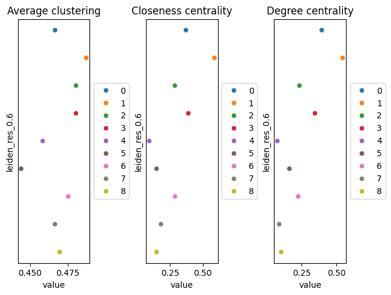

## Neighbourhood enrichment

Neighbourhood enrichment tests whether pairs of Leiden groups occur next to each other more or less often than expected by chance. Squidpy compares the observed neighbourhoods with those obtained after randomly permuting the group labels.
The resulting **z-score** indicates the direction and strength of enrichment. Positive values indicate that two groups are neighbours more often than expected, while negative values indicate fewer neighbouring pairs than expected.

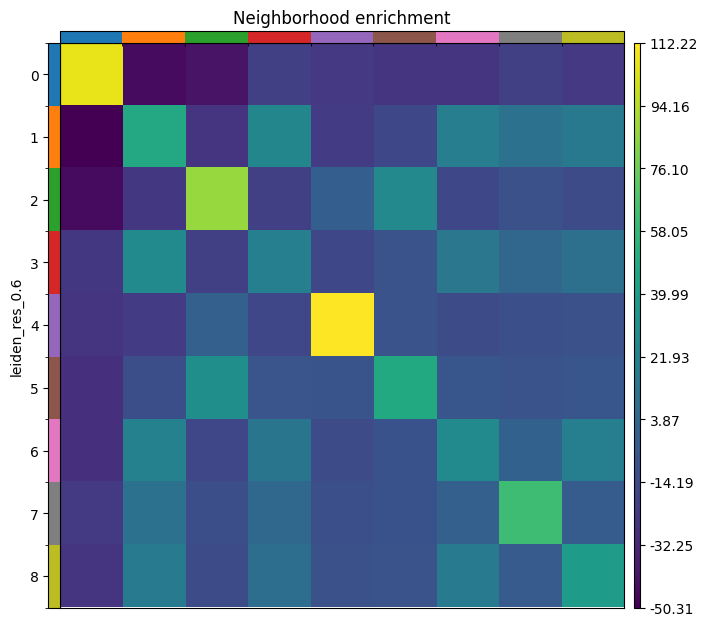

Values from this run:

| Group | Degree centrality | Closeness centrality | Self-enrichment z-score |
| --- | ---: | ---: | ---: |
| `0` melanoma, differentiated | 0.395 | 0.371 | 107 |
| `1` T and NK cells | 0.544 | 0.588 | 48 |
| `2` melanocytic, *VGF*+ | 0.235 | 0.286 | 87 |
| `3` myeloid | 0.346 | 0.389 | 20 |
| `4` melanoma, glycolytic | 0.076 | 0.091 | 112 |
| `5` melanoma, high-content | 0.162 | 0.147 | 48 |
| `6` fibroblasts | 0.225 | 0.288 | 27 |
| `7` endothelium | 0.089 | 0.180 | 62 |
| `8` plasma cells | 0.104 | 0.147 | 39 |

> <question-title>Interpret the spatial statistics</question-title>
>
> 1. Every group is enriched next to itself, from z of 20 for the myeloid group to 112 for the glycolytic melanoma group. Is that a result?
> 2. The glycolytic melanoma group `4` has the highest self-enrichment (112) and the lowest degree centrality (0.076). What arrangement produces that, and how does it bear on whether the group is real?
> 3. The lymphocyte group `1` has the highest degree and closeness centrality, and is positive against myeloid cells (z 25 and 28), fibroblasts (19 and 21) and plasma cells (15 and 16) while being negative against every melanocytic group. What does that describe, and what does it not establish?
>
> > <solution-title></solution-title>
> >
> > 1. Not by itself. Cells of a type sit together in tissue, so a positive diagonal is what a working analysis looks like; a flat diagonal would suggest a problem with the clustering or the coordinates. It is worth reading first precisely because it is the cheapest check available on a spatial graph, and it is the off-diagonal that carries the information.
> > 2. A compact territory that touches few other groups. Low degree centrality means most of a cell's six nearest neighbours belong to its own group, and high self-enrichment means that is more than chance would give. For group `4` this matters for interpretation: a group that were merely the low-quality tail of the main melanoma group would be scattered through it, not gathered into its own patch. Combined with a coherent glycolytic programme and *BNIP3* being spatially structured, the spatial evidence supports treating it as a state rather than an artefact.
> > 3. It describes an immune and stromal compartment that sits together and apart from the tumour. In melanoma this pattern is usually read as immune exclusion, and the fibroblast group here expresses *CXCL12*, the chemokine most associated with fibroblast-driven exclusion, which makes the reading tempting. It does not establish it. Adjacency is not interaction, and exclusion is a claim about a tumour boundary, which would need a field of view containing that boundary rather than a window inside the tumour.
> >
> {: .solution}
>
{: .question}

## Spatially Variable Genes

Moran's I measures whether a gene's expression is spatially structured rather than randomly distributed (). The result is stored in the object and can be read with **Inspect AnnData**. Genes from the top of that ranking in the reference run:

| Gene | Moran's I | Interpretation |
| --- | ---: | --- |
| *VGF* | 0.49 | Marks the *VGF*-positive melanocytic groups, which hold their own territory |
| *CXCL9* | 0.43 | Interferon-induced chemokine, concentrated in the immune compartment |
| *CXCL10* | 0.33 | The same programme as *CXCL9* |
| *PAEP* | 0.30 | Co-expressed with *VGF* in groups `2` and `5` |
| *PLVAP* | 0.28 | Endothelial, so it follows the vessels |
| *DLL3* | 0.27 | Notch ligand, patchily distributed |
| *POSTN* | 0.27 | Fibroblast matrix programme |
| *BNIP3* | 0.26 | Hypoxia-associated, consistent with the glycolytic tumour state |
| *SELE* | 0.25 | Endothelial activation |
| *COL4A1* | 0.24 | Basement membrane around vessels |
| *CCL22* | 0.23 | Chemokine of the myeloid compartment |

### Visual confirmation on the tissue.

A high Moran's I value indicates a gene is more spatially structured than random, but the statistic alone does not show how that pattern manifests. Plotting a high-scoring gene on the tissue image is therefore an essential check. A gene that is truly spatially informative should show a coherent, non-random pattern when visualised. Visualisation also helps distinguish a genuine biological gradient from a statistical artefact that can arise from outliers, uneven cell density, or inflated p-values

To do this, we import the AnnData table containing the Squidpy results back into the SpatialData object, then use SpatialData Plot to colour cells by expression of the gene of interest. The steps below demonstrate this for VGF, the highest-scoring gene in this window.

> <hands-on-title>Visualize High-Scoring Genes</hands-on-title>
>
> 1.  with the following parameters:
>    -  *"SpatialData object"*: `melanoma_roi.spatialdata.zip`
>    - *"Operation"*: `Import anndata table to a SpatialData object`
>        -  *"annotated data object to add"*: `AnnData with Squidpy results`
>        - *"Table name"*: `table_processed`
>
>  Rename the generated file `SpatialData with Squidpy results`
>
> 2.  with the following parameters:
>    -  *"SpatialData object"*: `SpatialData with Squidpy results`
>    - In *"Render Images"*:
>        - *"Image element name"*: `morphology_focus`
>    - In *"Render Labels"*:
>        - *"Labels element name"*: `cell_labels`
>        - *"Color column"*: `VGF`
>        - *"Table name"*: `table_processed`
>    - In *"Plot Display Parameters"*:
>        - *"Coordinate system(s)"*: `global`
>
{: .hands_on}

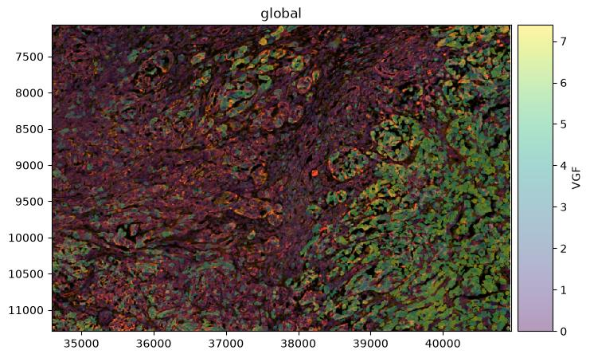

> <question-title>Interpret Moran's I</question-title>
>
> 1. The highest value here is 0.49, whereas the same statistic on the whole section reaches 0.87. Why are all the values lower?
> 2. *CXCL9* and *CXCL10* score 0.43 and 0.33, higher than any melanoma marker, although the immune groups are much smaller than the tumour groups. What does that tell you?
>
> > <solution-title></solution-title>
> >
> > 1. Because the statistic depends on the field of view. Moran's I measures how much a gene's expression varies smoothly across the whole area analysed, and the biggest, cleanest spatial contrast in this sample is between the epidermis and everything else, several millimetres away from here. Inside a 1,350 × 900 µm window that contrast is gone, and what remains are gentler gradients within a single tumour region. The values are not worse measurements, they are measurements of a smaller and more homogeneous piece of tissue. It follows that Moran's I values cannot be compared between analyses unless the fields of view are comparable.
> > 2. That the statistic rewards spatial organisation rather than abundance. The immune compartment is small but sharply localised, occupying a defined band, so its chemokines switch on and off across a clear boundary. Melanoma cells fill most of the window, so their markers are high nearly everywhere and vary little from place to place, which is exactly the situation Moran's I scores low. A gene can be the most abundant in a dataset and still be spatially uninformative.
> >
> {: .solution}
>
{: .question}

# Cell type annotation with CellTypist

CellTypist assigns each cell the label that best matches its gene expression profile based on a reference model trained on annotated single-cell data, and can then further refine the assignment by majority voting among cells within over-clustered neighbourhoods (). The model used here is based on healthy adult human skin and includes keratinocyte, fibroblast, vascular, pericyte, Schwann cell, melanocyte, and immune cell states ().

> <hands-on-title>Annotate the cells</hands-on-title>
>
> 1.  with the following parameters:
>    -  *"Input AnnData file"*: `AnnData with Squidpy results`
>    - *"Model source"*: `Use a cached model`
>        - *"Choose CellTypist model"*: `cell types from human healthy adult skin (v1)`
>    - *"Annotation mode"*: `Choose the cell type with the largest score/probability as the final prediction`
>    - *"Probability threshold"*: `0.5`
>    - *"Refine the predicted labels by running the majority voting classifier after over-clustering"*: `Yes`
>    - *"Generate a dotplot of the predicted cell types"*: `Yes`
>        - *"Reference column in AnnData.obs for dotplot"*: `leiden_res_0.6`
>        - *"Prediction to plot"*: `majority_voting`
>
> 2. Rename the AnnData output `CellTypist-annotated AnnData`
>
{: .hands_on}

Before majority voting, CellTypist assigns 34 different labels across the window: Melanocyte to 4,513
cells, Differentiated_KC to 1,717, Th to 677, Tc to 566, VE2 to 487, Undifferentiated_KC to 355,
Mono_mac to 339 and F1 to 284, among others. Majority voting then collapses those 34 to five.

| Leiden group | Markers say | Dominant majority-voting label | Share | Mean confidence |
| --- | --- | --- | ---: | ---: |
| `0` | Melanoma, differentiated | Melanocyte | 99.4% | 0.479 |
| `1` | T and NK cells | Differentiated_KC | 69.7% | 0.113 |
| `2` | Melanocytic, *VGF*+ | Differentiated_KC / Melanocyte | 54.4% / 45.4% | 0.093 |
| `3` | Myeloid | Differentiated_KC | 94.5% | 0.170 |
| `4` | Melanoma, glycolytic | Melanocyte | 99.0% | 0.272 |
| `5` | Melanoma, high-content | Melanocyte | 100% | 0.385 |
| `6` | Fibroblasts | Differentiated_KC | 93.6% | 0.205 |
| `7` | Endothelium | VE2 | 55.2% | 0.296 |
| `8` | Plasma cells | Tc | 96.0% | 0.151 |

Four groups agree with the markers: the three melanocytic groups are labelled Melanocyte, and the
endothelial group is labelled VE2, a vascular endothelial state of the reference. Four contradict them
and one is split. The four that agree are also the four with the highest mean confidence, which is the
most useful pattern in the table. The dot plot produced by the same job shows both quantities at once.

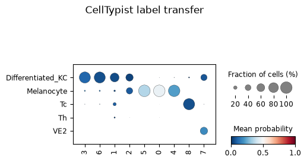

> <question-title>Is a reference-transfer label a cell type?</question-title>
>
> Group `8` expresses *MZB1*, *DERL3*, *POU2AF1*, *CD79A* and *CD38*, and is labelled `Tc` for 96 per cent
> of its cells at a mean confidence of 0.151. Group `6` expresses *POSTN*, *COL11A1* and *CTHRC1*, and is
> labelled `Differentiated_KC` for 93.6 per cent of its cells. There is not a keratinocyte anywhere in
> this window.
>
> 1. Which result should be believed for groups `6` and `8`, and why?
> 2. A label can be assigned to 96 per cent of a group and still be wrong. What is the difference between
>    agreement and confidence, and which one is the warning?
> 3. Why does `Differentiated_KC` appear at all, given that the window contains no epidermis?
>
> > <solution-title></solution-title>
> >
> > 1. The markers, in both cases. *MZB1*, *DERL3* and *POU2AF1* form the secretory programme of plasma
> >    cells, and *POSTN* with *COL11A1* and *CTHRC1* is a fibroblast matrix programme. Both are coherent
> >    sets whose members belong together; the reference labels are not supported by anything except the
> >    classifier.
> > 2. Agreement measures how consistently the classifier assigns the same label within a group;
> >    confidence measures how well the cells actually match that label. Majority voting drives agreement
> >    up by construction, because it replaces each cell's own prediction with the dominant label of its
> >    neighbourhood. Confidence is the quantity that carries the warning, and 0.151 for group `8` is a
> >    clear one. High agreement at low confidence is the signature of a group being forced onto the
> >    nearest available label.
> > 3. Because reference transfer can only return labels that exist in the reference, and it always
> >    returns something. The model is built from healthy adult skin, where keratinocytes are the most
> >    abundant cell type, so cells with no good match land there. The absence of epidermis in the window
> >    does not stop the label being used; it only makes it obviously wrong, which is a helpful accident
> >    for a tutorial.
> >
> {: .solution}
>
{: .question}

> <comment-title>Choosing a reference model</comment-title>
>
> CellTypist recommends picking the model that matches the biological context of the query data
> (). Healthy adult skin is the closest available match here, and a clear
> improvement on a mismatched tissue: a breast model run on this section returns breast luminal
> secretory labels with no counterpart in skin at all.
>
> It is still a healthy-tissue reference applied to a tumour, and this window is almost entirely tumour
> and immune infiltrate, the two things such a reference represents worst. Treat the labels as
> preliminary and give the marker genes precedence. A melanoma-specific reference would be the better
> option where one exists.
>
{: .comment}

> <comment-title>A second reference: what changes with an immune-only model</comment-title>
>
> Running the same job again with the CellTypist model built from immune populations across 20 tissues
> and 18 studies () changes which groups the classifier gets right, not
> how confident it is overall. The two references disagree in opposite directions.
>
> Group `1` (T and NK), `6` (fibroblasts), `7` (endothelium) and `8` (plasma cells) go from wrong or
> weakly-supported skin-model labels to correct immune-model labels at markedly higher confidence:
> `Differentiated_KC` at 0.09 becomes `T cells` at 0.61 for group `1`, `Differentiated_KC` at 0.20 becomes
> `Fibroblasts` at 0.78 for group `6`, and `Tc` at 0.15 becomes `Plasma cells` at 0.52 for group `8`.
> That is the expected result: an immune-focused reference should out-perform a skin reference on immune
> and stromal populations.
>
> The trade runs the other way for the four melanocytic groups. The skin reference has a `Melanocyte`
> label and uses it correctly for groups `0`, `4` and `5`; the immune reference has no melanocyte category
> at all, so those cells are forced onto `T cells` or `ILC` instead, the nearest labels available. Neither
> model is more accurate in general. Each is only as good as its reference contains the population being
> classified, which is the same lesson as the `Differentiated_KC` result above, from the opposite side.
>
> Group `3`, the myeloid and macrophage group, is wrong in both references, and this one is not fully
> explained. The immune model does carry `Macrophages` and `Monocytes` categories, and 12.9 per cent of
> the group's cells are called `Macrophages` before majority voting, but voting collapses that to 91.2 per
> cent `T cells`. Why a model built to recognise macrophages still misses this group is left open here.
>
{: .comment}

# Ligand-receptor rankings with LIANA

LIANA runs several published ligand-receptor methods over a curated resource and combines their results
into a consensus ranking, which avoids committing to any single method's assumptions
(, ). The source and target categories here
are the Leiden groups.

> <hands-on-title>Rank ligand-receptor pairs</hands-on-title>
>
> 1.  with the following parameters:
>    -  *"Annotated data matrix"*: `CellTypist-annotated AnnData`
>    - *"Method for ligand-receptor inference"*: `Aggregate ligand-receptor scores from multiple methods (rank_aggregate)`
>        - *"Group By"*: `leiden_res_0.6`
>        - *"Resource source"*: `Download from LIANA API`
>            - *"Resource name"*: `consensus`
>        - *"Expression proportion"*: `0.1`
>        - *"Minimum number of cells"*: `5`
>        - *"Use raw counts"*: `No`
>        - *"Results key in adata.uns"*: `liana_res`
>
> 2. Rename the generated file `Final Liana Anndata`
>
{: .hands_on}

The result is 2,829 ranked source-to-target pairs, stored in `uns['liana_res']`. Read it with
.
Two columns order the table: `magnitude_rank`, which reflects how strongly both partners are expressed,
and `specificity_rank`, which reflects how restricted the pair is to that particular source and target.
The strongest pairs by magnitude are:

| Source | Target | Ligand | Receptor | Magnitude rank | Specificity rank |
| --- | --- | --- | --- | ---: | ---: |
| `7` endothelium | `4` melanoma, glycolytic | *COL4A1* | *CD44* | 1.0 × 10⁻⁶ | 2.4 × 10⁻⁴ |
| `4` melanoma, glycolytic | `4` melanoma, glycolytic | *PKM* | *CD44* | 1.0 × 10⁻⁵ | 0.125 |
| `7` endothelium | `0` melanoma, differentiated | *COL4A1* | *CD44* | 1.0 × 10⁻⁵ | 6.8 × 10⁻³ |
| `7` endothelium | `5` melanoma, high-content | *COL4A1* | *CD44* | 1.8 × 10⁻⁵ | 9.2 × 10⁻³ |
| `5` melanoma, high-content | `4` melanoma, glycolytic | *PKM* | *CD44* | 2.8 × 10⁻⁵ | 0.195 |
| `7` endothelium | `4` melanoma, glycolytic | *COL4A2* | *CD44* | 4.0 × 10⁻⁵ | 1.3 × 10⁻³ |

The top pair is not biologically implausible. CD44 on melanoma cells binds type IV collagen and mediates
migration on collagen IV and invasion through reconstituted basement membrane
(), and the binding region within the collagen IV α1 chain has been
mapped (). Collagen IV is what endothelial basement membrane is made of,
and group `7` ranks *COL4A1* and *COL4A2* first and second.

Before treating that as a finding, three checks are worth making, and this table fails two of them.

> <question-title>Read the ranking critically</question-title>
>
> 1. *CD44* is the receptor in every one of the six top pairs. Look back at the marker table: where does *CD44* appear? What does that imply about the ranking?
> 2. The neighbourhood-enrichment z-score between groups `7` and `4` is −11 in both directions. What does that mean for the top-ranked pair?
> 3. The `PKM`–`CD44` pair from group `4` to itself has a magnitude rank of 1.0 × 10⁻⁵ but a specificity rank of 0.125. How should those two numbers be read together?
>
> > <solution-title></solution-title>
> >
> > 1. *CD44* is the fifth-ranked marker gene of group `4`. A receptor that is itself a marker of one group will pair highly with whatever ligands its neighbours express, so much of this table is a restatement of that one fact rather than six independent findings. Checking whether a partner in a top pair is a cluster marker is a quick way to see whether a ranking is reporting a specific interaction or an abundant gene.
> > 2. That the two groups sit next to each other less often than chance. LIANA scores expression alone and has no access to position, so a high magnitude rank implies nothing about proximity. The pair could still matter at whatever interface does exist, or through a diffusible mechanism, but collagen IV signalling through CD44 is contact-dependent, so a depleted adjacency undercuts this particular reading. Group `4` is also the most spatially self-contained group in the window, with a self-enrichment of 112, which is consistent with it having few contacts with anything else.
> > 3. They answer different questions. Magnitude asks how strongly both partners are expressed, and 1.0 × 10⁻⁵ is high. Specificity asks whether the pair is restricted to this source and target, and 0.125 is unremarkable: *PKM* and *CD44* are broadly expressed, so the same pair scores well for many combinations. A pair worth following up should rank well on both, as *COL4A1*–*CD44* from `7` to `4` does on magnitude and specificity, whereas the *PKM* pairs do not.
> >
> {: .solution}
>
{: .question}

> <comment-title>What would make a ligand-receptor hit worth following up</comment-title>
>
> Expression of both partners above a stated proportion in the relevant groups; a good rank on
> specificity as well as magnitude; spatial adjacency of the two groups, or a plausible diffusible
> mechanism if they are not adjacent; markers that independently support the identity of both groups;
> literature for the pair in the same disease context; and reproduction in another section.
>
> The *COL4A1*–*CD44* pair meets the expression, specificity and literature criteria and fails the
> adjacency one. That makes it a hypothesis to test on a field of view containing the tumour-vessel
> interface, not a result to report from this window.
>
{: .comment}

# Return the processed table to SpatialData

Everything computed so far lives in an AnnData object. Writing it back into the spatialData object keeps the annotations together with the image and the segmentation, so the result can be plotted or opened in a viewer such as napari ().

> <hands-on-title>Create the final processed object</hands-on-title>
>
> 1.  with the following parameters:
>    -  *"SpatialData object"*: `melanoma_roi.spatialdata.zip`
>    - *"Operation"*: `Import anndata table to a SpatialData object`
>        -  *"annotated data object to add"*: `Final Liana Anndata`
>        - *"Table name"*: `table_processed`
>
>  Rename the generated file `SpatialData with Final metrics`
>
> 2.  with the following parameters:
>    -  *"SpatialData object"*: `SpatialData with Final metrics`
>    - In *"Render Images"*:
>        - *"Image element name"*: `morphology_focus`
>    - In *"Render Labels"*:
>        - *"Labels element name"*: `cell_labels`
>        - *"Color column"*: `leiden_res_0.6`
>        - *"Table name"*: `table_processed`
>    - In *"Plot Display Parameters"*:
>        - *"Coordinate system(s)"*: `global`
>
{: .hands_on}

The spatial plot provides a way to check the analysis results against the tissue and see whether the identified groups correspond to coherent regions in the tissue. Group `0` should fill most of the window, group `4` should sit in its own compact region rather than scattered through it, and the immune and stromal groups should trace the band between the two melanocytic compartments.


# Conclusion

We built a SpatialData object from a Xenium output bundle, cut a 1,350 × 900 µm window out of the tumour, and analysed the 10,810 segmented cells inside it. Filtering on transcript content and on segmented cell area retained 10,722 cells, or 99.2 per cent, and removed 245 of the 5,006 genes because they are not detected anywhere in this window. Expression was normalised to 10,000 counts per cell and log-transformed, 2,000 highly variable genes were flagged, and the log-normalised matrix fed {PCA}, a 15-neighbour expression graph and {UMAP}. Leiden clustering at resolutions 0.2, 0.4 and 0.6 gave 4, 6 and 9 groups, and we carried the nine groups at 0.6 forward.

Ranked genes supported descriptions for all nine Leiden groups at resolution 0.6: three melanoma states separated by metabolism and content rather than lineage, a fourth *VGF*-positive melanocytic group whose distinctness is partly a matter of measurement depth, cytotoxic lymphocytes carrying an interferon signature, myeloid cells and macrophages, matrix-remodelling fibroblasts, endothelium, and plasma cells.

Just as important are the results that came with limits attached. *ADGRG1* ranked first for the differentiated melanoma group and was discarded, because 10x Genomics documents non-specific binding for that probe in the panel version used. The gene-level filter removed 245 genes, most of them markers of populations that live outside the window. Squidpy described an immune and stromal compartment sitting together and apart from the tumour, which is suggestive of immune exclusion but does not establish it. Moran's I values were uniformly lower than on the full section, not because the measurements are worse but because the field of view is smaller.

Above all, every one of those results is a statement about one 1.22 mm² window. The populations found in it are real, the populations missing from it are missing because of where the window was placed, and any figure quoted from this analysis should carry the window with it.

Finally the processed table went back into the spatial object as `table_processed`, next to the morphology image and the segmentation labels, so that every annotation can be checked against the tissue it came from.
