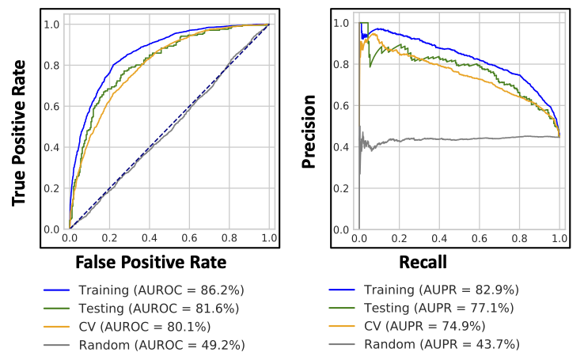
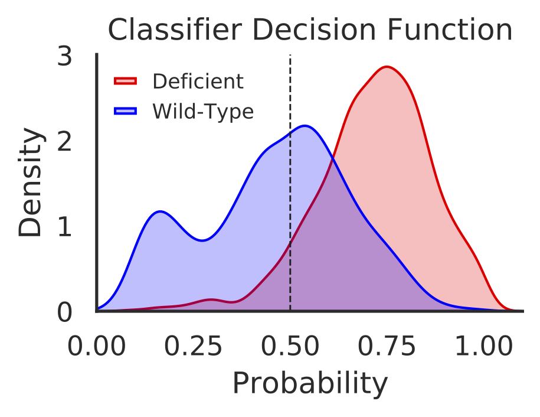

# Introduction
{:.no_toc}

<!-- This is a comment. -->

Signaling pathways are most commonly altered across different tumor types. Many tumors possess at least one driver alteration and nearly half of such alterations are potentially targeted by currently available drugs. A recent study in TCGA tumors has identified patterns of somatic variations and mechanisms in 10 canonical pathways (Sanchez-Vega et al. 2018). One-third of these tumors possess multiple alterations and have potentially complex phenotypes. Identifying a transcriptomic signature in these tumors would enable personalized therapeutic design strategies. A plethora of evidence suggests complex diseases, like cancer, can be the result of multiple genetic aberrations in biological networks or pathways rather than variation in a single gene. Often starter mutations occur in a key component network that ultimately leads to multigene dysregulation causing hallmark cancer phenotypes (Hanahan and Weinberg 2000). Many of these phenotypes are the result of disrupted transcriptional programs that affect the clinical progression and therapeutic responsiveness. Recent progress in exploring these transcriptomic changes in cancer pathogenesis provided useful clues in precision medicine (Bradner et al. 2017).

The RTK/RAS/PI3K molecular genetic axis controls critical cellular functions and is commonly altered in various cancers (Fruman and Rommel 2014). Perturbations across this axis can lead to deficiencies in cell-cycle, survival, metabolism, motility and genome stability, triggering hallmark phenotypes of cancer. The constitutive activation and presence of phosphatidylinositol-3,4,5-trisphosphate (PIP3) trigger membrane-bound onco-signalosomes. This presents significant challenges for treatment, as PI3K cascade can be activated in several ways (Zhao and Roberts 2006).

In this tutorial we plan to measure aberrant PI3K pathway activity in TCGA dataset using RNASeq information and mutational and copy number information of following frequently altered genes. We named this tutorial as Pancancer Aberrant Pathway Activity Analysis (PAPAA)


Cancer driver genes comprising both oncogenes (OG) and Tumor suppressor genes (TSG) share common phenotypical outcome. However, they often have divergent molecular mechanisms  that drive the outcome. We are interested in capturing mutational specific differential transcriptional outcome among OG and TSG. In Fig-1 Genes in red are oncogenes (have activating or copy gain) and blue are tumor suppressor genes (have inactivating or copy loss).

> ### Agenda
>
> In this tutorial, we will cover:
>
> 1. TOC
> {:toc}
>
{: .agenda}

# **Pancancer aberrant pathway activity analysis (PAPAA)** 

Machine Learning use learning features from datasets and generate predictive models. Extracting transcriptional patterns and learning insights from this abundance of data is a developing research area. Transcriptional profiling was used to identify differentially expressed genes and pathways associated with drug resistance in breast cancer (Men et al. 2018). Such perturbations in oncogenic pathways can be useful in predicting sensitivity to therapeutic agents (Bild et al. 2006). Machine learning-based modeling provides a systematic manner to leverage these multi-omic data to predict phenotype or stratify tumors based on gene expression and pathway variations. We extended a previously developed elastic net penalized logistic regression classification modeling approach to derive transcription signature or pathway alterations to measure aberrant PI3K activity in the pan-cancer data(Way et al. 2018). This method integrates bulk RNA Sequencing (RNA-Seq), copy number and mutation data from [PanCanAtlas](https://gdc.cancer.gov/about-data/publications/pancanatlas). 

TCGA Pancancer has uniformly processed Multi-omics data including RNASeq, copy number and mutational data. It covers 33 different cancer types and having information from over 10000 samples. We used publicly available RNASeq, mutation and CNV data sets from TCGA. Description and processing details of these data sets are listed at this site: [Pancancer aberrant pathway activity analysis](https://github.com/nvk747/papaa.git)

***Machine learning methodology***
Logistic regression is a kind of machine learning approach where statistical analysis that is used to predict the outcome of a dependent variable based on prior observations. Changes in gene expression are directly connected to alterations/mutations in genes. we used above approach to predict mutational status given the gene expression. Optimizing to the above prediction of mutational status with gene expression variable, we used elastic net penalty with gradient descent algorithm is used to find the optimal cost function by going over a number of iterations. The objective of the classifier is to determine the probability a given sample (i) has a aberrant gene event given the sample’s RNAseq measurements (Xi). In order to achieve the objective, the classifier learns a vector of coefficients or gene-specific weights (w) that optimize the following penalized logistic function.

 from expression data X(i) for each sample. Mutaional status can be estimated by Multiplying Xi with gene specific weights (W). The negativeloglikelihood (L) is used for calculating minimum weights for each sample")

Where alpha and l are regularization and elastic net mixing hyperparameters that are only active during training. Each model was tested at multiple alpha and l values and 5 fold cross validation was performed.  

***Sample Processing step:***

**x-matrix**
> Gene-expression data comprises of expression levels for ~20000 genes in ~10000 samples. Top 8000 highly variable genes between the samples were measured by median absolute deviation (MAD) and considered for analysis. 

**y-matrix**
> copy number and mutational data in the binary format for all samples. This set is sorted to given pathway target genes and cancer types. 

We then randomly held out 10% of the samples to create a test set and rest 90% for training.  Testing set is used as the validation to evaluate the performance of any machine learning algorithm and the remaining parts are used for learning/training. The training set is balanced for different cancer-types and PI3K status. 

Predicting probabilities of an observation belonging to each class in a classification problem is more flexible rather than predicting classes directly. This method has an added advantage to trade-off errors made by the model as it depends on interpretation of probabilities using different thresholds. Two diagnostic tools that help in the interpretation of probabilistic forecast for binary (two-class) classification predictive modeling problems are ROC Curves and Precision-Recall curves. Each model generated is evaluated and performance metrics is measured using AUROC and AUPR.

As elastic net penalty with stochastic decent gradient approach induces sparsity in the number of features used in classification, and the best/top features (genes) are likely to represent transcriptional signature of given disease or aberrant activity of the mutated genes in a pathway. 

Each feature (gene) is given a rank and score(negative or positive) depending on its contribution to classification. The positive scored genes are likely to be upregulated in activated pathway samples and negatively scored genes are likely to be downstream targets of altered pathways. 

In this tutorial, we made series of steps to generate classification models and used those models for predicting pharmacological response or identifying potential biomarkers that are helpful in for treatment of various cancers. Generate model using from ERBB2,KRAS,PIK3CA,AKT11 oncogenes from ERK/RAS/PI3K signaling axis pathway. 
have fun!

# **Get data for analysis from classifier to pharmocological correlations**

> ###  Hands-on: Data upload
>
> 1. Create a new history for this tutorial
> 2. Import the files from [PAPAA-Zenodo](https://zenodo.org/record/4306639#.X9FJF-lKgZE) or from
>    the shared data library (`GTN - Material` -> `{{ page.topic_name }}`
>     -> `{{ page.title }}`):
>
>    ```
>    https://zenodo.org/api/files/9c1a32d0-dba1-4481-ad9f-1aac03c83e61/CCLE_DepMap_18Q1_maf_20180207.txt.gz
>    https://zenodo.org/api/files/9c1a32d0-dba1-4481-ad9f-1aac03c83e61/CCLE_MUT_CNA_AMP_DEL_binary_Revealer.tsv.gz
>    https://zenodo.org/api/files/9c1a32d0-dba1-4481-ad9f-1aac03c83e61/ccle_rnaseq_genes_rpkm_20180929_mod.tsv.gz
>    https://zenodo.org/api/files/9c1a32d0-dba1-4481-ad9f-1aac03c83e61/compounds_of_interest.txt
>    https://zenodo.org/api/files/9c1a32d0-dba1-4481-ad9f-1aac03c83e61/copy_number_gain_status.tsv.gz
>    https://zenodo.org/api/files/9c1a32d0-dba1-4481-ad9f-1aac03c83e61/copy_number_loss_status.tsv.gz
>    https://zenodo.org/api/files/9c1a32d0-dba1-4481-ad9f-1aac03c83e61/cosmic_cancer_classification.tsv
>    https://zenodo.org/api/files/9c1a32d0-dba1-4481-ad9f-1aac03c83e61/gdsc1_ccle_pharm_fitted_dose_data.txt.gz
>    https://zenodo.org/api/files/9c1a32d0-dba1-4481-ad9f-1aac03c83e61/gdsc2_ccle_pharm_fitted_dose_data.txt.gz
>    https://zenodo.org/api/files/9c1a32d0-dba1-4481-ad9f-1aac03c83e61/GDSC_CCLE_common_mut_cnv_binary.tsv.gz
>    https://zenodo.org/api/files/9c1a32d0-dba1-4481-ad9f-1aac03c83e61/GDSC_EXP_CCLE_converted_name.tsv.gz
>    https://zenodo.org/api/files/9c1a32d0-dba1-4481-ad9f-1aac03c83e61/GSE69822_pi3k_sign.txt
>    https://zenodo.org/api/files/9c1a32d0-dba1-4481-ad9f-1aac03c83e61/GSE69822_pi3k_trans.csv
>    https://zenodo.org/api/files/9c1a32d0-dba1-4481-ad9f-1aac03c83e61/GSE94937_kras_sign.txt
>    https://zenodo.org/api/files/9c1a32d0-dba1-4481-ad9f-1aac03c83e61/GSE94937_rpkm_kras.csv
>    https://zenodo.org/api/files/9c1a32d0-dba1-4481-ad9f-1aac03c83e61/mc3.v0.2.8.PUBLIC.maf.gz
>    https://zenodo.org/api/files/9c1a32d0-dba1-4481-ad9f-1aac03c83e61/mutation_burden_freeze.tsv
>    https://zenodo.org/api/files/9c1a32d0-dba1-4481-ad9f-1aac03c83e61/pancan_GISTIC_threshold.tsv.gz
>    https://zenodo.org/api/files/9c1a32d0-dba1-4481-ad9f-1aac03c83e61/pancan_mutation_freeze.tsv.gz
>    https://zenodo.org/api/files/9c1a32d0-dba1-4481-ad9f-1aac03c83e61/pancan_rnaseq_freeze.tsv.gz
>    https://zenodo.org/api/files/9c1a32d0-dba1-4481-ad9f-1aac03c83e61/path_cell_cycle_genes.txt
>    https://zenodo.org/api/files/9c1a32d0-dba1-4481-ad9f-1aac03c83e61/path_myc_genes.txt
>    https://zenodo.org/api/files/9c1a32d0-dba1-4481-ad9f-1aac03c83e61/path_ras_genes.txt
>    https://zenodo.org/api/files/9c1a32d0-dba1-4481-ad9f-1aac03c83e61/path_rtk_ras_pi3k_genes.txt
>    https://zenodo.org/api/files/9c1a32d0-dba1-4481-ad9f-1aac03c83e61/path_wnt_genes.txt
>    https://zenodo.org/api/files/9c1a32d0-dba1-4481-ad9f-1aac03c83e61/sample_freeze.tsv
>    https://zenodo.org/api/files/9c1a32d0-dba1-4481-ad9f-1aac03c83e61/sampleset_freeze_version4_modify.csv
>    https://zenodo.org/api/files/9c1a32d0-dba1-4481-ad9f-1aac03c83e61/seg_based_scores.tsv
>    https://zenodo.org/api/files/9c1a32d0-dba1-4481-ad9f-1aac03c83e61/tcga_dictionary.tsv
>    https://zenodo.org/api/files/9c1a32d0-dba1-4481-ad9f-1aac03c83e61/vogelstein_cancergenes.tsv
>    ```
{: .hands_on}

## **PAPAA: PanCancer classifier**
This first step is designed to generate model with ERBB2,KRAS,PIK3CA,AKT11 genes belonging to a ERK/RAS/PI3K signaling axis pathway(path_genes) and BLCA,BRCA,CESC,COAD,ESCA,LUAD,LUSC,OV,PRAD,READ,STAD,UCEC,UCS cancer types/diseases(ref: tcga_dictionary.tsv) from The Cancer Genome Atlas (TCGA). Additionally the generated model was used to evaluate alternative genes (PTEN,PIK3R1,STK11) and alternative diseases (BRCA,COAD,ESCA,HNSC,LGG,LUAD,LUSC,PRAD,READ,GBM,UCEC,UCS) performance. This steps takes feature information (pancan_rnaseq_freeze.tsv.gz), mutational information(pancan_mutation_freeze.tsv.gz),load of mutations in each samples(mutation_burden_freeze.tsv.gz), threshold passed sample information(sample_freeze.tsv) and copy number information(copy_number_loss_status.tsv.gz & copy_number_gain_status.tsv.gz).
 


> ###  Hands-on: Generating model from ERBB2,PIK3CA,KRAS,AKT1 genes with specific disease types
>
> 1.  with the following parameters:
>    -  *"Filename of features to use in model"*: `output` (Input dataset)
>    -  *"Filename mutations"*: `output` (Input dataset)
>    -  *"Filename of mutation burden"*: `output` (Input dataset)
>    -  *"Filename of sample"*: `output` (Input dataset)
>    - *"Comma separated string of HUGO gene symbols"*: `ERBB2,PIK3CA,KRAS,AKT1`
>    - *"Comma sep string of TCGA disease acronyms. If no arguments are passed, filtering will default to options given in --filter_count and --filter_prop."*: `BLCA,BRCA,CESC,COAD,ESCA,LUAD,LUSC,OV,PRAD,READ,STAD,UCEC,UCS`
>    - *"option to set seed"*: `1234`
>    - *"Number of cross validation folds to perform"*: `5`
>    - *"Decision to drop input genes from X matrix"*: `Yes`
>    - *"Supplement Y matrix with copy number events"*: `Yes`
>    - *"Min number of mutations in diseases to include"*: `15`
>    - *"Min proportion of positives to include disease"*: `0.05`
>    - *"Number of MAD genes to include in classifier"*: `8000`
>    - *"the alphas for parameter sweep"*: `0.1,0.13,0.15,0.18,0.2,0.3,0.4,0.6,0.7`
>    - *"the l1 ratios for parameter sweep"*: `0.1,0.125,0.15,0.2,0.25,0.3,0.35`
>    - *"alternative genes to test performance"*: `PTEN,PIK3R1,STK11`
>    - *"The alternative diseases to test performance"*: `BRCA,COAD,ESCA,HNSC,LGG,LUAD,LUSC,PRAD,READ,GBM,UCEC,UCS`
>    - *"Min number of mutations in disease to include in alternate"*: `15`
>    - *"Min proportion of positives to include disease in alternate"*: `0.05`
>    - *"Remove hypermutated samples"*: `Yes`
>    - *"Keep intermediate ROC values for plotting"*: `Yes`
>    - *"Shuffle the input gene exprs matrix alongside"*: `Yes`
>    - *"Shuffle the gene exprs matrix before training"*: `No`
>    - *"Remove mutation data from y matrix"*: `No`
>    - *"Decision to drop gene expression values from X"*: `No`
>    - *"Decision to drop covariate information from X"*: `No`
{: .hands_on}

>    *Check parameter descriptions*

> ###  Pancancer Aberrant Pathway Activity Analysis `pancancer_classifier.py` inputs
>    - \--genes 	comma separated string of HUGO symbols for target genes or targenes_list.csv file
>    - \--diseases 	comma separated string of disease types/TCGA acronyms for classifier
>    - \--folds 	number of cross validation folds
>    - \--drop 	drop the input genes from the X matrix
>    - \--seed 	value specifies the initial value of the random number seed
>    - \--copy_number 	optional flag to supplement copy number to define Y
>    - \--filter_count 	int of low count of mutation to include disease
>    - \--filter_prop 	float of low proportion of mutated samples per disease
>    - \--num_features 	int of number of genes to include in classifier
>    - \--alphas 	comma separated string of alphas to test in pipeline
>    - \--l1_ratios 	comma separated string of l1 parameters to test
>    - \--alt_genes 	comma separated string of alternative genes to test
>    - \--alt_diseases 	comma separated string of alternative diseases to test
>    - \--alt_filter_count 	int of low count of mutations to include alt_diseases
>    - \--alt_filter_prop 	float of low proportion of mutated samples alt_disease
>    - \--alt_folder 	string of where to save the classifier figures
>    - \--remove_hyper 	store_true: remove hypermutated samples
>    - \--keep_intermediate 	store_true: keep intermediate roc curve items
>    - \--x_matrix 	string of which feature matrix to use
>    - \--classifier_folder 	String of the location of classifier data
{: .details}

> ###  Outputs
>    - Several outputs are generated from this step: A combined disease model (pan-model) and individual disease models are generated. Logistic regression with elastic net penalization outputs sparse classifiers with 150-250 genes whose scores or weights are important for classification tasks. This tool computes predictions, accuracy measurements and measures AUROC and AUPR curves for the combined disease model (pan-model). Additionally, the output also includes above performance and prediction metrics when the pan-model applied to alternative genes and cancer types. An overall model statistics are provided in the form of classifier summary. Additionally a tabular output that includes each gene mutation and copy number counts per each targene and proportions in various diseases is listed. 
>    - Log file for script run and additional information
>    - alt_gene_alt_disease_summary.tsv
>    - alt_summary_counts.csv
>    - classifier_coefficients.tsv
>    - classifier_summary.txt
>    - pancan_roc_results.tsv
>    - summary_counts.csv
>    - cv_heatmap.pdf
>    - Disease classifier figures: list of 2 files [disease_pr and disease_auroc]
>    - all_disease_pr.pdf
>    - all_disease_roc.pdf
>    - alt_gene_alt_disease_aupr_bar.pdf
>    - alt_gene_alt_disease_auroc_bar.pdf
>    - disease_aupr.pdf
>    - disease_auroc.pdf
{: .comment}

## **PanCancer within disease analysis**
This step is designed to generate individual pan-within models for each individual disease. It takes the same inputs as first step and generates similar output for each of them.

> ###  Hands-on: Generating models for individual diseases listed for ERBB2,PIK3CA,KRAS,AKT1
>
> 1.  with the following parameters:
>    -  *"Filename of features to use in model"*: `output` (Input dataset)
>    -  *"Filename mutations"*: `output` (Input dataset)
>    -  *"Filename of mutation burden"*: `output` (Input dataset)
>    -  *"Filename of sample"*: `output` (Input dataset)
>    - *"Comma separated string of HUGO gene symbols"*: `ERBB2,PIK3CA,KRAS,AKT1`
>    - *"Comma sep string of TCGA disease acronyms. If no arguments are passed, filtering will default to options given in --filter_count and --filter_prop."*: `BLCA,BRCA,CESC,COAD,ESCA,LUAD,LUSC,OV,PRAD,READ,STAD,UCEC,UCS`
>    -  *"File with Copy number loss"*: `output` (Input dataset)
>    -  *"File with Copy number gain"*: `output` (Input dataset)
>    -  *"File with cancer gene classification table"*: `output` (Input dataset)
>    - *"the alphas for parameter sweep"*: `0.1,0.13,0.15,0.18,0.2,0.3,0.4,0.6,0.7`
>    - *"the l1 ratios for parameter sweep"*: `0.1,0.125,0.15,0.2,0.25,0.3,0.35`
>    - *"Remove hypermutated samples"*: `Yes`
>    - *"option to set seed"*: `1234`
>    - *"Number of MAD genes to include in classifier"*: `8000`
{: .hands_on}

>    *Check parameter descriptions*

> ###  Pancancer Aberrant Pathway Activity Analysis `within_disease_analysis.py` inputs
>    - \--genes 	Comma separated string of HUGO symbols for target genes or targenes_list.csv file
>    - \--diseases 	Comma separated diseases list in a file
>    - \--alphas 	The alphas for parameter sweep
>    - \--l1_ratios 	The l1 ratios for parameter sweep
>    - \--remove_hyper 	Remove hypermutated samples
>    - \--alt_folder 	String of location to classification folder extending to individual diseases
>    - \--x_matrix 	Filename of features to use in model
>    - \--filename_mut 	Filename of sample/gene mutations to use in model
>    - \--filename_mut_burden 	Filename of sample mutation burden to use in model
>    - \--filename_sample 	Filename of patient/samples to use in model
>    - \--filename_copy_loss 	Filename of copy number loss
>    - \--filename_copy_gain 	Filename of copy number gain
>    - \--filename_cancer_gene_classification 	Filename of cancer gene classification table
{: .details}

> ###  Outputs
>    - This tool creates individual classifiers from each of the diseases specified to generate the full or pan model. Each of the classifiers has a similar output as specified for the pan-cancer classifier. The within models are trained using the same combination of targenes but considering only one disease for training and testing.
>    - Log file for script run and additional information
>    - list of classifier_summary.txt for each disease
>    - list of classifier_coefficients.tsv for each disease
>    - list of pancan_roc_results.tsv for each disease
>    - list of summary_counts.csv for each disease
>    - Within disease figures:  List of 5 files [all_disease_pr, all_disease_roc, cv_heatmap, disease_pr, disease_roc] for individual diseases
>    - Disease classifier figures: list of 2 files [disease_pr disease_roc] for each disease
{: .comment}

## **PanCancer compare within models**
we next do a performance comparison between the ERBB2,PIK3CA,KRAS,AKT1 pan model and individual models.


> ###  Hands-on: compare the ERBB2_PIK3CA_KRAS_AKT1 pan model with individual disease models
>
> 1.  with the following parameters:
>    -  *"pancancer classifier summary"*: `classifier_summary` (output of **PAPAA: PanCancer classifier** )
>    -  *"pancancer classifier coefficients"*: `classifier_coefficients` (output of **PAPAA: PanCancer classifier** )
>    -  *"pan_within classifier summary"*: `classifier_summary` (output of **PAPAA: PanCancer within disease analysis** )
>    -  *"pan_within classifier coefficients"*: `classifier_coefficients` (output of **PAPAA: PanCancer within disease analysis** )
>    - *"Would you want to compare given model with alt gene model?"*: `do not do alt gene`
{: .hands_on}

>   *Check parameter descriptions*

> ###  Pancancer Aberrant Pathway Activity Analysis `compare_within_models.R` inputs
>    - \--pancan_model 	location of pan and pan-within-disease models classifier_summary.txt/s and classfier_coefficients.tsv/s  
>    - \--alt_model 	location of alt and alt-within-disease models classifier_summary.txt/s and classfier_coefficients.tsv/s
{: .details}

> ###  Outputs
>    - Comparison plots for Pan and Pan_within models ("auroc_comparison.pdf" and "aupr_comparison.pdf")
>    - Comparison plots for altgene, alt_within, Pan_alt models ("alt_gene_auroc_comparison.pdf" and "alt_gene_aupr_comparison.pdf")
{: .comment}

## **PanCancer apply weights**
In this step we would like to predict y status (mutational status) using x matrix (gene expression). Subset the x matrix to MAD genes, scaling the expression and add covariate information. A logit transformation will be applied to output probabilities and classifier decisions. 

> ###  Hands-on: Apply weights for ERBB2_PIK3CA_KRAS_AKT1 model
>
> 1.  with the following parameters:
>    -  *"Filename of features to use in model"*: `output` (Input dataset)
>    -  *"Filename mutations"*: `output` (Input dataset)
>    -  *"Filename of mutation burden"*: `output` (Input dataset)
>    -  *"Filename of sample"*: `output` (Input dataset)
>    - *"Supplement Y matrix with copy number events"*: `Yes`
>    -  *"pancancer classifier summary"*: `classifier_summary` (output of **PAPAA: PanCancer classifier** )
>    -  *"pancancer classifier coefficients"*: `classifier_coefficients` (output of **PAPAA: PanCancer classifier** )
{: .hands_on}

>    *Check parameter descriptions*

> ###  Pancancer Aberrant Pathway Activity Analysis `apply_weights.py` inputs
>    - \--classifier_summary 	String of the location of classifier_summary.txt file
>    - \--copy_number 	Supplement Y matrix with copy number events
>    - \--x_matrix 	Filename of features to use in model
>    - \--filename_mut 	Filename of sample/gene mutations to use in model
>    - \--filename_mut_burden 	Filename of sample mutation burden to use in model
>    - \--filename_sample 	Filename of patient/samples to use in model
>    - \--filename_copy_loss 	Filename of copy number loss
>    - \--filename_copy_gain 	Filename of copy number gain
>    - \--filename_cancer_gene_classification 	Filename of cancer gene classification table
{: .details}

> ###  Outputs
>    - Apply a logit transform on expression values (y = 1/(1+e^(-wX))) to output mutational probabilities. Generates "classifier_decisions.tsv" file which has scores/probabilities and other covariate information.  The scores/probabilities will be used for gene ranking and variant specifific classification. 
>    - Log file for script run and additional information	
{: .comment}


## **PanCancer visualize decisions**
In this step we generate visualization plots using classifier decision function for samples in each individual disease, total decisions for all samples in all diseases, and hypermutated samples in all diseases.


> ###  Hands-on: Visualize decisions for ERBB2_PIK3CA_KRAS_AKT1 model
>
> 1.  with the following parameters:
>    -  *"pancancer decisions"*: `classifier_decisions` (output of **PAPAA: PanCancer apply weights** )
{: .hands_on}

> *Check parameter descriptions*

> ###  Pancancer Aberrant Pathway Activity Analysis `visualize_decisions.py` inputs
>    - \--classifier_decisions 	String of the folder location of classifier_decisions.tsv
>    - \--custom  comma separated list of columns to plot
>    (optional: True)
{: .details}

> ###  Outputs
>    - Log file for script run and additional information
>    - Visualize decision function for all samples ("total_decisions.pdf")
>    - Plot disease type specific decision functions ("decision_plot_{}.pdf")
>    - Visualize decision function for hyper mutated tumors ("hyper_mutated.pdf")
{: .comment}

## **PanCancer map mutation class**
In this step we combined variant level information for each mutation combining with classifier predictions.

> ###  Hands-on: map mutation class for ERBB2_PIK3CA_KRAS_AKT1 model
>
> 1.  with the following parameters:
>    -  *"pancancer decisions"*: `classifier_decisions.tsv` (output of **PAPAA: PanCancer apply weights** )
>    -  *"string of the genes to extract or gene list file"*: `path_genes.txt` (Input dataset)
>    -  *"Filename of sample"*: `sample_freeze.tsv` (Input dataset)
>    - *"Supplement Y matrix with copy number events"*: `Yes`
>    -  *"File with Copy number loss"*: `copy_number_loss_status.tsv` (Input dataset)
>    -  *"File with Copy number gain"*: `copy_number_gain_status.tsv` (Input dataset)
>    -  *"Filename of raw mut MAF"*: `mc3.v0.2.8.PUBLIC.maf` (Input dataset)
{: .hands_on}

>    *Check parameter descriptions*

> ###  Pancancer Aberrant Pathway Activity Analysis `map_mutation_class.py` inputs
>    - \--classifer_decisions 	String of the location of folder containing classifier_decisions.tsv
>    - \--path_genes 	comma separated string of HUGO symbols for all genes in the pathway or Pathway genes list file
>    - \--filename_copy_loss 	Filename of copy number loss
>    - \--filename_copy_gain 	Filename of copy number gain
>    - \--filename_raw_mut 	Filename of raw mut MAF
{: .details}

> ###  Outputs
>    - Merge per sample classifier scores with mutation types present in each sample and generate "mutation_classification_scores.tsv" file
>    - Log file for script run and additional information
{: .comment}

## **PanCancer alternative genes pathwaymapper**
In this step we combine classifier weights,copy number information, recalculate metrics for positive samples, visualize distribution for AUROC and AUPR for all genes and metrics for each gene. 

> ###  Hands-on: alternative genes pathway mapper for ERBB2_PIK3CA_KRAS_AKT1 model
>
> 1.  with the following parameters:
>    -  *"pancancer decisions"*: `classifier_decisions.tsv` (output of **PAPAA: PanCancer apply weights** )
>    - *"Comma separated string of HUGO gene symbols"*: `ERBB2,PIK3CA,KRAS,AKT1`
>    -  *"string of the genes to extract or gene list file"*: `path_genes.txt` (Input dataset)
>    -  *"Filename mutations"*: `pancan_mutation_freeze.tsv ` (Input dataset)
>    -  *"Filename of sample"*: `sample_freeze.tsv` (Input dataset)
>    - *"Supplement Y matrix with copy number events"*: `Yes`
>    -  *"File with Copy number loss"*: `copy_number_loss_status.tsv` (Input dataset)
>    -  *"File with Copy number gain"*: `copy_number_gain_status.tsv` (Input dataset)
{: .hands_on}

>    *Check parameter descriptions*

> ###  Pancancer Aberrant Pathway Activity Analysis `targene_alternative_genes_pathwaymapper.py` inputs
>    - \--genes 	comma separated string of HUGO symbols for target genes or targenes_list.csv file
>    - \--path_genes comma separated string of HUGO symbols for all genes in the target pathway or path_genes.csv file
>    - \--classifier_decisions 	String of the location of classifier scores/alt_folder
>    - \--filename_mut 	Filename of sample/gene mutations to use in model
>    - \--filename_mut_burden 	Filename of sample mutation burden to use in model
>    - \--filename_sample 	Filename of patient/samples to use in model
>    - \--filename_copy_loss 	Filename of copy number loss
>    - \--filename_copy_gain 	Filename of copy number gain
{: .details}

> ###  Outputs
>    - Calculate and display pathway metrics ("pathway_metrics_pathwaymapper.txt")
>    - Visualize Distribution of AUROC and AUPRC for all genes and Get Metrics for All Genes ("all_gene_metric_ranks.tsv")
>    - Log file for script run and additional information
{: .comment}

## **PanCancer pathway count heatmaps**
This step generates combined heatmap from mutation and copy number information and summarizes mutation, copy and total counts per sample for all the genes in target pathway. 
 "Combined count heatmap(mutation and copynumber) for all genes in the target pathway with in each cancer type")

> ###  Hands-on: Heatmaps for ERBB2_PIK3CA_KRAS_AKT1 model
>
> 1.  with the following parameters:
>    -  *"pancancer decisions"*: `classifier_decisions.tsv` (output of **PAPAA: PanCancer apply weights** )
>    -  *"pancancer metrics pathwaymapper"*: `pathway_metrics_pathwaymapper.txt` (output of **PAPAA: PanCancer alternative genes pathwaymapper** )
>    -  *"pancancer gene metric ranks"*: `all_gene_metric_ranks.tsv` (output of **PAPAA: PanCancer alternative genes pathwaymapper** )
>    - *"Comma separated string of HUGO gene symbols"*: `ERBB2,PIK3CA,KRAS,AKT1`
>    -  *"String of the pathway genes to extract"*: `path_genes.txt` (Input dataset)
>    -  *"Filename of features to use in model"*: `pancan_rnaseq_freeze.tsv.gz` (Input dataset)
>    -  *"Filename mutations"*: `pancan_mutation_freeze.tsv` (Input dataset)
>    -  *"Filename of mutation burden"*: `mutation_burden_freeze.tsv` (Input dataset)
>    -  *"Filename of sample"*: `sample_freeze.tsv` (Input dataset)
>    -  *"File with Copy number loss"*: `copy_number_loss_status.tsv` (Input dataset)
>    -  *"File with Copy number gain"*: `copy_number_gain_status.tsv` (Input dataset)
>    -  *"File with cancer gene classification table"*: `cosmic_cancer_classification.tsv` (Input dataset)
{: .hands_on}

>    *Check parameter descriptions*

> ###  Pancancer Aberrant Pathway Activity Analysis `targene_pathway_count_heatmaps.py` inputs
>    - \--genes 	comma separated string of HUGO symbols for target genes or targenes_list.csv file
>    - \--path_genes 	comma separated string of HUGO symbols for all genes in the target pathway or path_genes.csv file
>    - \--classifier_decisions 	String of the location of classifier scores/alt_folder
>    - \--x_matrix 	Filename of features to use in model
>    - \--filename_mut 	Filename of sample/gene mutations to use in model
>    - \--filename_mut_burden Filename of sample mutation burden to use in model
>    - \--filename_sample 	Filename of patient/samples to use in model
>    - \--filename_copy_loss 	Filename of copy number loss
>    - \--filename_copy_gain 	Filename of copy number gain
>    - \--filename_cancer_gene_classification 	Filename of cancer gene classification table
{: .details}

> ###  Outputs
>    - Mutational count heatmap for all genes in the target pathway with in each cancer type (cancer_type_mutation_heatmap.pdf).
>    - Copy number count heatmap for all genes in the target pathway with in each cancer type (cancer_type_copy_number_heatmap.pdf).
>    - Combined count heatmap for all genes in the target pathway with in each cancer type (cancer_type_combined_total_heatmap.pdf).
>    - Calculates Mutations and copy number percentages of the genes in the and generates "pathway_mapper_percentages.txt" file.
>    - Summarizes mutation, copy, and total counts per sample by targene pathway and generates "path_events_per_sample.tsv" file

{: .comment}

## **PanCancer targene summary figures**
This step generates plots summarizing various analysis, including heatmaps for distribution of aberrant events across tumors, distribution of predictions at variant levels.

> ###  Hands-on: Summary figures for ERBB2_PIK3CA_KRAS_AKT1 model
>
> 1.  with the following parameters:
>    -  *"Classifier data"*: `classifier_summary.txt` (output of **PAPAA: PanCancer classifier** )
>    -  *"pancancer classifier coefficients"*: `classifier_coefficients.tsv` (output of **PAPAA: PanCancer classifier** )
>    - *"option to set seed"*: `123`
>    -  *"summary counts"*: `summary_counts.csv` (output of **PAPAA: PanCancer classifier** )
>    -  *"mutation classification scores"*: `mutation_classification_scores.tsv` (output of **PAPAA: PanCancer map mutation class** )
>    -  *"path events per sample"*: `path_events_per_sample.tsv` (output of **PAPAA: PanCancer pathway count heatmaps** )
>    -  *"pancancer gene metric ranks"*: `all_gene_metric_ranks.tsv` (output of **PAPAA: PanCancer alternative genes pathwaymapper** )
{: .hands_on}

>    *Check parameter descriptions*

> ###  Pancancer Aberrant Pathway Activity Analysis `targene_summary_figures.R` inputs
>    - \--classifier_summary 	String of the location of classifier data
>    - \--seed 	value specifies the initial value of the random number seed
{: .details}

> ###  Outputs
>    - Heatmap for mutation and gain proportions for the genes used in model across all the TCGA cancer types (all_targene_heatmap.pdf")
>    - Heatmap for total mutation and total gain proportions for the genes used in model across all the TCGA cancer types (targene_heatmap.pdf")
>    - Gene weights/Coefficients contributing to the model (targene_coef_plot.pdf)
>    - Plot distributions of predictions according to variant classification for OG and TSG ("variant_gain_fill_map.pdf" and "variant_loss_fill_map.pdf")
>    - Targene Summary Counts Distribution ("path_events_per_sample.tsv")
>    - Targene pathway events counts ("targene_pathway_events_counts.pdf")
>    - Performance Metrics Distribution across pathway members ("aupr_distribution.pdf" and "auroc_distribution.pdf")
>    - T-Test for AUPR between targene pathway genes and Other genes ("targene_pathway_variant_AUPR_ttest.txt")
>    - Log file for script run and additional information
>    - Extracting sample classifier scores for nucleotide level alterations in each sample and generate "nucleotide_mutation_scores.tsv" file
>    - Extracting sample classifier scores for amino-acid level alterations in each sample and generate "amino_acid_mutation_scores.tsv" file

{: .comment}

## **PanCancer targene cell line predictions**
In this step we use our classifier information and predict mutational status for various cell lines in CCLE and GDSC data sources.


> ###  Hands-on: Analysis of CCLE and GDSC cell-lines using ERBB2_PIK3CA_KRAS_AKT1 model
>
> 1.  with the following parameters:
>    -  *"Classifier data"*: `classifier_summary.txt` (output of **PAPAA: PanCancer classifier** )
>    -  *"pancancer classifier coefficients"*: `classifier_coefficients.tsv` (output of **PAPAA: PanCancer classifier** )
>    -  *"nucleotide mutation scores"*: `nucleotide_acid_mutation_scores.tsv` (output of **PAPAA: PanCancer targene summary figures** )
>    -  *"amino acid mutation scores"*: `amino_acid_mutation_scores.tsv` (output of **PAPAA: PanCancer targene summary figures** )
>    - *"Comma separated string of HUGO targene symbols"*: `ERBB2_MUT,PIK3CA_MUT,KRAS_MUT,AKT1_MUT`
>    -  *"string of the genes to extract or gene list file"*: `path_genes.txt` (Input dataset)
>    -  *"Filename ccle rnaseq data"*: `ccle_rnaseq_genes_rpkm_20180929_mod.tsv` (Input dataset)
>    -  *"Filename ccle mutational data"*: `CCLE_MUT_CNA_AMP_DEL_binary_Revealer.gct` (Input dataset)
>    -  *"Filename ccle variant data"*: `CCLE_DepMap_18Q1_maf_20180207.txt` (Input dataset)
>    -  *"Filename gdsc rnaseq data"*: `GDSC_EXP_CCLE_converted_name.tsv` (Input dataset)
>    -  *"Filename gdsc mutational data"*: `GDSC_CCLE_common_mut_cnv_binary.tsv` (Input dataset)
>    -  *"Filename for gdsc1 pharmacological data file"*: `gdsc1_ccle_pharm_fitted_dose_data.txt` (Input dataset)
>    -  *"Filename for gdsc2 pharmacological data file"*: `gdsc2_ccle_pharm_fitted_dose_data.txt` (Input dataset)
{: .hands_on}

>   *Check parameter descriptions*

> ###  Pancancer Aberrant Pathway Activity Analysis `targene_cell_line_predictions.py` inputs
>    - \--targenes        comma separated string of HUGO symbols for target genes or targenes_list.csv file
>    - \--path_genes      comma separated string of HUGO symbols for all genes in the target pathway or path_genes.csv file
>    - \--classifier      String of the location of classifier_summary file
>    - \--ccle_rnaseq     Filename of CCLE gene expression data file
>    - \--ccle_mut        Filename of CCLE cell lines/gene mutations data file
>    - \--ccle_maf        Filename of CCLE mutational variant level data file
>    - \--gdsc_rnaseq     Filename of GDSC gene expression data file
>    - \--gdsc_mut        Filename of GDSC cell lines/gene mutations data file
>    - \--gdsc1_phar      Filename of GDSC1 pharmacological response data
>    - \--gdsc2_phar      Filename of GDSC2 pharmacological response data
{: .details}

> ###  Outputs
>    - Generate predictions for CCLE data using targene classifier(ccle_histogram.png)
>    - Generate classifier scores for CCLE cell lines and combines CCLE mutational data and variant data with classifier scores (ccle_targene_classifier_scores.tsv).
>    - Performs t-test on classifier weights across targene mutant vs targene wild type cell-line groups(ccle_targene_WT_MUT_predictions.pdf)
>    - Add CCLE nucleotide scores at variant level and update nucleotide_mutation_scores.tsv (updated_Data_nucleotide_scores.csv)
>    - Add CCLE protein scores at variant level and update aminoacid_mutation_scores.tsv (updated_Data_aminoacid_scores.csv)
>    - Generate predictions for GDSC data using targene classifier(gdsc_scores_histogram.png)
>    - Generate classifier scores for GDSC cell lines and combines CCLE mutational data and variant data with classifier scores (gdsc_targene_classifier_scores.tsv).
>    - Performs t-test on classifier weights across targene mutant vs targene wild type cell-line groups(gdsc_targene_WT_MUT_predictions.pdf)
>    - Apply GDSC classifier scores to evaluate GDSC1 pharmacological data response (gdsc1_targene_pharmacology_predictions.tsv)
>    - Apply GDSC classifier scores to evaluate GDSC2 pharmacological data response (gdsc2_targene_pharmacology_predictions.tsv)
>    - Apply CCLE classifier scores to evaluate GDSC1 pharmacological data response (gdsc1_ccle_targene_pharmacology_predictions.tsv)
>    - Apply CCLE classifier scores to evaluate GDSC2 pharmacological data response (gdsc2_ccle_targene_pharmacology_predictions.tsv)

{: .comment}

## **PanCancer external sample status prediction**
In this step we use our classifier information and predict mutational status for PTENKO, PI3KCA mutant, WT when PI3K is inhibited using A66. 
 PI3K_OG classifiers applied to MCF10a cell lines dataset (GEO: GSE69822). The samples were either WT (blue circles) or having a PIK3CA-H1074R mutation (orange circles).")

> ###  Hands-on: external sample evaluation with ERBB2_PIK3CA_KRAS_AKT1 model
>
> 1.  with the following parameters:
>    -  *"Classifier data"*: `classifier_summary.txt` (output of **PAPAA: PanCancer classifier** )
>    -  *"pancancer classifier coefficients"*: `classifier_coefficients.tsv` (output of **PAPAA: PanCancer classifier** )
>    -  *"external sample gene expression data"*: `vlog_trans.csv` (Input dataset)
>    -  *"given mutational status"*: `sign.txt` (Input dataset)
{: .hands_on}

>    *Check parameter descriptions*

> ###  Pancancer Aberrant Pathway Activity Analysis `external_sample_pred_targene_classifier.py` inputs
>    - \--classifier_summary 	String of the location of classifier scores file
>    - \--expression_file 	File path for external sample expression data file (fpkm/rpkm/rlog/vlog/nlog values)
>    - \--status_sign Provide sign for tumor/mutant [1] or normal/WT [-1] along with sorted sample names
{: .details}

> ###  Outputs
>    - Model based classification scores distribution Plots for external normal and tumor samples ("targene_external_sample_predictions.pdf and targene_external_sample_predictions_1.pdf") 
>    - Log file for script run and additional information
{: .comment}

## **PanCancer targene pharmacology**
In this step we use the classifier derived cell line predictions and use them to evaluate pharmacological response of these cell lines. We plot log IC50 with classifier scores for each cell line and draw a correlation for drug response in absence or presence of targene mutations

 values of afatinib pharmacological response compared against PI3K_OG classifier scores of various cell lines. Cell lines with mutant (orange) or wild-type (blue) for ERBB2, KRAS, PIK3CA, AKT1 are indicated. The trend lines and p values are shown separately for wild-type or mutant cell lines. cell lines treated with Afatinib [EGFR inhibitor]")

> ###  Hands-on: GDSC1 and GDSC2 pharmacological analysis using ERBB2_PIK3CA_KRAS_AKT1 model
>    -  *"gdsc1 targene pharmacology predictions"*: `gdsc1_targene_pharmacology_predictions.tsv` (output of **PAPAA: PanCancer targene cell line predictions** )
>    -  *"gdsc2 targene pharmacology predictions"*: `gdsc2_targene_pharmacology_predictions.tsv` (output of **PAPAA: PanCancer targene cell line predictions** )
>    -  *"gdsc1 ccle targene pharmacology predictions"*: `gdsc1_ccle_targene_pharmacology_predictions.tsv` (output of **PAPAA: PanCancer targene cell line predictions** )
>    -  *"gdsc2 ccle targene pharmacology predictions"*: `gdsc2_ccle_targene_pharmacology_predictions.tsv` (output of **PAPAA: PanCancer targene cell line predictions** )
>    -  *"Filename list of compounds"*: `compounds_of_interest.txt` (Input dataset)
{: .hands_on}

>    *Check parameter descriptions*

> ###  Pancancer Aberrant Pathway Activity Analysis `targene_pharmacology.R` inputs
>    - \--classifier_results 	String of the location of classifier folder
>    - \--compound 	Filename of list of pharmacological compounds for evaluation
{: .details}

> ###  Outputs
>    - Scatter plots with visualizing drug response compared to GDSC targene classifier scores
>    for GDSC1 pharmacological dataset (GDSC1_targene_all_drug_response.pdf)
>    - Scatter plots with visualizing drug response compared to CCLE targene classifier scores
>    for GDSC1 pharmacological dataset (GDSC1_ccle_targene_all_drug_response.pdf)
>    - Scatter plots with visualizing drug response compared to GDSC targene classifier scores
>    for GDSC2 pharmacological dataset (GDSC2_targene_all_drug_response.pdf)
>    - Scatter plots with visualizing drug response compared to CCLE targene classifier scores
>    for GDSC2 pharmacological dataset (GDSC2_ccle_targene_all_drug_response.pdf)
{: .comment}


> ###  Tutorial Questions
>
> 1. Can you build a classifer for tumor suppressor gene combination in PI3K pathway?
> 2. how did the PI3K_LOSS model performed compared to PI3K_GAIN?
>
> > ###  Solution
> >
> > 1. Try building a model using (PTEN,PIK3R1,STK11 genes and BRCA,COAD,ESCA,HNSC,LGG,LUAD,LUSC,PRAD,READ,GBM,UCEC,UCS cancer-types)
> > 2. Check the AUROC and AUPR values. 
> >
> {: .solution}
>
{: .question}

# **Conclusions**
{:.no_toc}

Sum up the tutorial and the key takeaways here. We encourage adding an overview image of the
pipeline used.