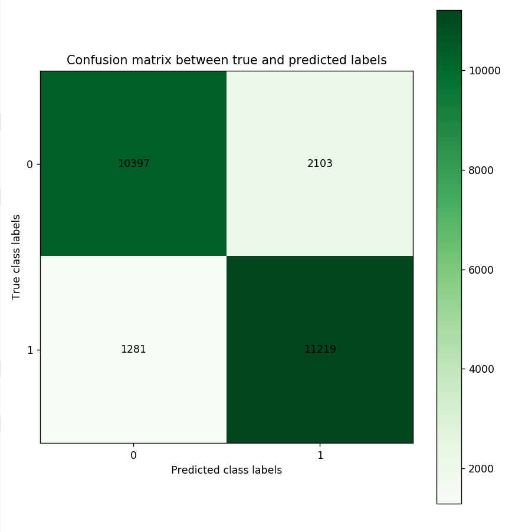

# Introduction
{:.no_toc}

<!-- This is a comment. -->

Artificial neural networks are a machine learning discipline that have been successfully applied to problems 
in pattern classification, clustering, regression, association, time series prediction, optimiztion, and control .
With the increasing popularity of social media in the past decade, image and video processing tasks have become very 
important. The previous neural network architectures (e.g. feedforward neural networks) could not scale up to handle 
image and video processing tasks. This gave way to the development of convolutional neural networks that are specifically 
tailroed to image and video processing tasks. In this tutorial, we explain what convolutional neural networks are, discuss 
their architecture, and solve an image classification problem using MNIST digit classification dataset using a CNN in Galaxy.

> ### Agenda
>
> In this tutorial, we will cover:
>
> 1. TOC
> {:toc}
>
{: .agenda}

# Limitations of feedforward neural networks (FNN) for image processing

In a fully connected FNN (Figure 1), all the nodes in a layer are connected to all the nodes in the next layer. Each connection has a weight 
$$ w_{i,j} $$ that needs to be learned by the learning algorithm. Lets say our input is a 64 pixel by 64 pixel graysacle image. Each grayscale 
pixel is represented by 1 value, usually between 0 to 255, where 0 represents black, 255 represents white, and the values in between represent 
various shades of gray. Since each grayscale pixel can be represnetd by 1 value, we say the *channel* size is 1. Such an image can be represented 
by 64 X 64 X 1 = 4,096 values (rows X columns X channels). Hence, the input layer of a FNN processing such an image has 4096 nodes. 

Lets assume the next layer has 500 nodes. Since all the nodes in subsequent layers are fully connected, we will have 4,096 X 500 = 2,048,000 weights 
between the input and the first hidden layer. For complex problems, we usually need multiple hidden layers in our FNN, as a simpler FNN may not be 
able to learn the model mapping the inputs to outputs in the training data. Having multiple hidden layers compounds the problem of having many weights 
in our FNN. Having many weights makes the learning process more difficult as the dimension of the search space is increased. It also makes the training 
more time and resource consuming and increases the likelihood of overfitting. This problem is further compunded for color images. Unlike grayscale 
images, each pixel in a color image is represented by 3 values, representing red, green, and blue colors (Called RGB color mode), where every color 
can be represented by various combination of these primary colors. Since each color pixel can be represented by 3 values, we say the **channel** size 
is 3. Such an image can be represented by 64 X 64 X 3 = 12,288 values (rows X columns X channels). The number of weights between the input layer and 
the first hidden layer with 500 nodes is now 12,288 X 500 = 6,144,000. It is clear that a FNN cannot scale to handle larger images 
() and that we need a more scalable architecture. 


Another problem with using FNN for image processing is that a 2 dimensional image is represented as a 1 dimensional vector in the input layer, 
hence, any spatial relationship in the data is ignored. CNN, on the other hand, maintains the spatial structure of the data, is better suited to 
finding spatial relationships in the image data.     

## Inspiration for convolutional neural networks  

In 1959 Hubel and Wiesel conducted an experiment to understand how the visual cortex of the brain processes visual information . 
They recorded the activity of the neurons in visual cortex of a cat while moving a bright line in front of the cat. They noticed that some cells fire 
when the bright line is shown at a particular angle and a particular location (They called these **simple** cells). Other neurons fired when the bright
line was shown regardless of the angle/location and seemed to detect movement (They called these **complex** cells). It seemed complex cells receive 
inputs multiple simple cells and have an hierarchical structure. Hubel and Wiesel won the Noble prize for their findings in 1981.

In 1980, inspired by hierarchical structure of complex and simple cells, Fukushima proposed Neocognitron (), a hierarchical neural 
network used for handwritten Japanese character recognition. Neocognitron was the first CNN, but had its own training algorithm. In 1989, LeCun et. al. 
() proposed a CNN that could be trained by backpropagation algorithm. CNN gained immense popularity when they outperformed other 
models at ILSVRC (ImageNet Large Scale Visual Recognition Challenge). ILSVRC is a competition in object classification and detection on hundreds of 
object categories and millions of images. The challenge has been run annually from 2010 to present, attracting participation from more than fifty 
institutions (). Notable CNN architectures that won ILSVRC are AlexNet in 2012 (), ZFNet in 2013 (
), GoogLeNet and VGG in 2014 (, ), and ResNet in 2015 ().

## Architecture of CNN

A typical CNN has the following 4 layers ()

1. Input layer
2. Convolution layer
3. Pooling layer
4. Fully connected layer

Please note that we will explain a 2 dimensional (2D) CNN here. But the same concepts apply to a 1 (or 3) dimensional CNN as well. 

### Input layer

The input layer is the input to the CNN. An example input, could be a 28 pixel by 28 pixel grayscale image. Unlike FNN, we do not 
"flatten" the input to a 1D vector, and the input is presented to the network in 2D as a 28 x 28 matrix. This makes capturing 
spatial relationships easier.  

### Convolution layer

The convolution layer is composed of multiple filters (also called kernels). Filters for a 2D image are also 2D. Suppose we have 
a 28 pixel by 28 pixel grayscale image. Each pixel is represented by a number between 0 and 255, where 0 represents the color black, 
255 represents the color white, and the values in between represent different shades of gray. Suppose we have a 3 by 3 filter (9 
values in total), and the values are randomly set to 0 or 1. Convolution is the process of placing the 3 by 3 filter on the top left 
corner of the image, multiplying filter values by the pixel values and adding the result, moving the filter to the right one pixel at 
a time and repeating this process. When we get to the top right corner of the image, we simply move the filter down one pixel and 
restart from the right. This process ends when we get to the bottom right side of the image.  

")

Covolution operator has the following parameters

1. Filter size
2. Padding
3. Stride
4. Dilation
5. Activation function

Filter size can be 5 by 5, 3 by 3, and so on. Larger filter sizes should be avoided as the learning algorithm needs to learn filter value (weights), 
and larger filters increase the number of weights to be learned (more compute capacity and more training time). Also, odd sized filters are preferred 
to even sized filters, due to the geometric property of all the input pixels being around the output pixel.  

If you look at Figure 2 you see that after applying a 3 by 3 filter to a 4 by 4 
image, we end up with a 2 by 2 image -- the size of the image has gone down. If we want to keep the resultant image size the same, we can use 
*padding*. We pad the input in every direction with 0's before applying the filter. If the padding is 1 by 1, then we add 1 zero in evey direction.
If its 2 by 2, then we add 2 zeros in every direction, and so on.   

")

As mentioned before, we start the convolution by placing the filter on the top left corner of the image, and after multiplying filter and image 
values (and adding them), we move the filter to the right and repeat the process. How many pixels we move to the right (or down) is the *stride*.
In figure 2 and 3, the stride of the filter is 1. We move the filter one pixel to the right (or down). But we could use a different stride. Figure 4 
shows an example of using stride of 2.

") 

When we apply a, say 3 by 3, filter to an image, our filter's output is affected by pixels in a 3 by 3 subset of the image. If we like to have a 
larger *receptive field* (portion of the image that affect our filter's output), we could use *dilation*. If we set the dilation to 2 (Figure 5),
instead of a contiguous 3 by 3 subset of the image, every other pixel of a 5 by 5 subset of the image affects the filter's output.

") 

The preferred activation function used in CNN is ReLU or one its variants like Leaky ReLU (). It introduces no-linearity by 
leaving pixels with positive values in convolution result as is, and replacing negative values with 0 (or a small number in case of Leaky ReLU).  

Given the input size, filter size, padding, stride and dilation you can calculate the output size of the convolution operation as below.  

$$ \frac{(\text{input size} - \text{(filter size + (filter size -1)*(dilation - 1)})) + (2*padding)}{stride} + 1 $$

### Pooling layer

The pooling layer performs down sampling to reduce the spatial dimensionality of the input. This decreases the number of parameters, which in turn 
reduces the learning time and computation, and the likelihood of overfitting. The most popular type of pooling is *max pooling*. Its usually a 2 by 2 
filter with a stride of 2 that returns the maximum value as it slides over the input data (similar to convolution filters).    

") 

As shown in Figure 6, a typical CNN usually has more than one convolution layer followed by a pooling layer. Convolution plus pooling layer is responsible  

### Fully connected layer

The last layer in a CNN is a fully connected layer. We connect all the nodes from the previous layer to this fully connected layer, which is responsible 
for classification of the image.

# Get data

> ###  Hands-on: Data upload
>
> 1. Create a new history for this tutorial
> 2. Import the files from [Zenodo](https://zenodo.org/record/2545213#.XEWTJ9-YVa0)
>
>    ```
>    https://zenodo.org/record/2545213/files/train_rows.csv
>    https://zenodo.org/record/2545213/files/test_rows_labels.csv
>    https://zenodo.org/record/2545213/files/test_rows.csv
>    ```
>
>    
>
> 3. Rename the datasets as `train_rows`, `test_rows_labels` and `test_rows` respectively.
>
>    
>
> 4. Check that the datatype of all the three datasets is `tabular`.
>
>    
>
{: .hands_on}

# Sentiment Classification of IMDB movie reviews with RNN

In the section, we define a RNN and train it using IMDB movie reviews training dataset. The goal is to learn a model such that given the 
words in a review we can predict whether the review was positive or negative. We then evaluate the trained RNN on the test dataset 
and plot the confusion matrix.

### **Create a deep learning model architecture**

> ###  Hands-on: Model config
>
> - 
>    - *"Select keras model type"*: `sequential`
>    - *"input_shape"*: `(500,)`
>    - In *"LAYER"*:
>        -  *"1: LAYER"*:
>            - *"Choose the type of layer"*: `Embedding -- Embedding`
>                - *"input_dim"*": `10000`
>                - *"output_dim"*": `32`
>        -  *"2: LAYER"*:
>            - *"Choose the type of layer"*: `Recurrent -- LSTM`
>                - *"units"*": `100`
>        -  *"3: LAYER"*:
>            - *"Choose the type of layer"*: `Core -- Dense`
>                - *"units"*: `1`
>                - *"Activation function"*: `sigmoid`
>    - Click *"Execute"* 
{: .hands_on}

Input is a movie review of size 500 (longer reviews were trimmed and shorter ones padded). Our neural network has 3 layers. The first layer is 
an embedding layer, that transforms each review words into a 32 dimensional vector (*output_dim*). We have 10000 unique words in our IMDB dataset 
(*input_dim*). The second layer is an *LSTM* layer, which is a type of RNN. Output of the LSTM layer has a size of *100*. The third layer is a 
*Dense* layer, which is a fully connected layer (all 100 output neurons in LSTM layer are connected to a single neuron in this layer). It has a 
*sigmoid* activation function, that generates an output between 0 and 1. Any output greater than 0.5 is considered a predicted positive review, 
and anything less than 0.5 a negative one. The model config can be downloaded as a JSON file.

### **Create a deep learning model**

> ###  Hands-on: Model builder (Optimizer, loss function, and fit parameters)
>
> - 
>    - *"Choose a building mode"*: `Build a training model`
>    - *"Select the dataset containing model configuration"*: Select the *Keras Model Config* from the previous step.
>    - *"Do classification or regression?"*: `KerasGClassifier`
>    - In *"Compile Parameters"*:
>        - *"Select a loss function"*: `binary_crossentropy` 
>        - *"Select an optimizer"*: `Adam - Adam optimizer `
>        - *"Select metrics"*: `acc/accuracy`
>    - In *"Fit Parameters"*:
>        - *"epochs"*: `2`
>        - *"batch_size"*: `128`
>    - Click *"Execute"*
{: .hands_on}

A loss function measures how different the predicted output is versus the expected output. For binary classification problems, we use 
*binary cross entropy* as loss function. Epochs is the number of times the whole training data is used to train the model. Setting *epochs* to 2 
means each training example in our dataset is used twice to train our model. If we update network weights/biases after all the training data is 
feed to the network, the training will be very slow (as we have 25000 training examples in our dataset). To speed up the training, we present 
only a subset of the training examples to the network, after which we update the weights/biases. *batch_size* decides the size of this subset. 
The model builder can be downloaded as a zip file.

### **Deep learning training and evaluation**

> ###  Hands-on: Training the model
>
> - 
>    - *"Select a scheme"*: `Train and Validate`
>    - *"Choose the dataset containing pipeline/estimator object"*: Select the *Keras Model Builder* from the previous step. 
>    - *"Select input type:"*: `tabular data`
>        - *"Training samples dataset"*: Select `X_train` dataset
>        - *"Choose how to select data by column:"*: `All columns`
>        - *"Dataset containing class labels or target values"*: Select `y_train` dataset
>        - *"Choose how to select data by column:"*: `All columns`
>    - Click *"Execute"*
>
>
{: .hands_on}

The training step generates 3 datasets. 1) accuracy of the trained model, 2) the trained model, downloadable as a zip file, and 3) the trained 
model weights, downloadable as an hdf5 file. These files are needed for prediction in the next step. 

### **Model Prediction**

> ###  Hands-on: Testing the model
>
> - 
>    - *"Choose the dataset containing pipeline/estimator object"* : Select the trained model from the previous step. 
>    - *"Choose the dataset containing weights for the estimator above"* : Select the trained model weights from the previous step. 
>    - *"Select invocation method"*: `predict`
>    - *"Select input data type for prediction"*: `tabular data`
>    - *"Training samples dataset"*: Select `X_test` dataset 
>    - *"Choose how to select data by column:"*: `All columns`
>    - Click *"Execute"*
>
{: .hands_on}

The prediction step generates 1 dataset. It's a file that has predictions (1 or 0 for positive or negative movie reviews) for every review in 
the test dataset.

### **Machine Learning Visualization Extension**

> ###  Hands-on: Creating the confusion matrix
>
> - 
>    - *"Select a plotting type"*: `Confusion matrix for classes`
>    - *"Select dataset containing the true labels"*": `y_test` 
>    - *"Choose how to select data by column:"*: `All columns`
>    - *"Select dataset containing the predicted labels"*": Select `Model Prediction` from the previous step 
>    - *"Does the dataset contain header:"*: `Yes`
>    - Click *"Execute"*
>
{: .hands_on}

**Confusion Matrix** is a table that describes the performance of a classification model. It lists the number of positive and negative examples 
that were correctly classified by the model, True positives (TP) and true negatives (TN), respectively. It also lists the number of examples that 
were classified as positive that were actually negative (False positive, FP, or Type I error), and the number of examples that were classified 
as negative that were actually positive (False negative, FN, or Type 2 error). Given the confusion matrix, we can calculate **precision** and 
**recall** . Precision is the fraction of predicted positives that are true positives (Precision = TP / (TP + FP)). Recall 
is the fraction of true positives that are predicted (Recall = TP / (TP + FN)). One way to describe the confusion matrix with just one value is 
to use the **F score**, which is the harmonic mean of precision and recall 

$$ Precision = \frac{\text{True positives}}{\text{True positives + False positives}} $$

$$ Recall = \frac{\text{True positives}}{\text{True positives + False negatives}} $$

$$ F score = \frac{2 * \text{Precision * Recall}}{\text{Precision + Recall}} $$



Figure 12 is the resultant confusion matrix for our sentiment analysis problem. The first row in the table represents the *true* 0 (or negative sentiment) 
class labels (we have 10,397 + 2,103 = 12,500 reviews with negative sentiment). The second row represents the *true* 1 (or positive sentiment) class labels 
(Again, we have 1,281 + 11,219 = 12,500 reviews with positive sentiment). The left column represents the *predicted* negative sentiment class labels (Our RNN 
predicted 10,397 + 1,281 = 11,678 reviews as having a negative sentiment). The right column represents the *predicted* positive class labels (Our RNN 
predicted 11,219 + 2,103 = 13,322 reviews as having a positive sentiment).Looking at the bottom right cell, we seethat our RNN has correctly predicted 11,219 
reviews as having a positive sentiment (True positives). Looking at the top right cell, we see that our RNN has incorrectly predicted 2,103 reviews as having 
a positive (False positives). Similarly, looking at the top left cell, we see that our RNN has correctly predicted 10,397 reviews as having negative sentiment
(True negative). Finally, looking at the bottom left cell, we see that our RNN has incorrectly predicted 1,281 reviews as negative (False negative). Given 
these numbers we can calculate Precision, Recall, and the F score as follows:  

$$ Precision = \frac{\text{True positives}}{\text{True positives + False positives}} = \frac{11,219}{11,219 + 2,102} = 0.84 $$

$$ Recall = \frac{\text{True positives}}{\text{True positives + False negatives}} = \frac{11,219}{11,219 + 1,281} = 0.89 $$

$$ F score = \frac{2 * \text{Precision * Recall}}{\text{Precision + Recall}} = \frac{2 * 0.84 * 0.89}{0.84 + 0.89} = 0.86 $$

# Conclusion
{:.no_toc}

In this tutorial, we briefly reviewed feedforward neural networks, explained how recurrent neural networks are different, and discussed various 
RNN input/output and architectures. We also discussed various text representation and preprocessing schemes and used Galaxy to solve a sentiment 
classification problem using RNN on IMDB movie reviews dataset. 
