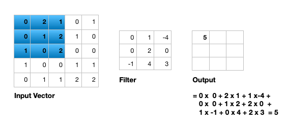

# Introduction


Artificial neural networks are a machine learning discipline that have been successfully applied to problems
in pattern classification, clustering, regression, association, time series prediction, optimiztion, and control .
With the increasing popularity of social media in the past decade, image and video processing tasks have become very
important. The previous neural network architectures (e.g. feedforward neural networks) could not scale up to handle
image and video processing tasks. This gave way to the development of convolutional neural networks that are specifically
tailored to image and video processing tasks. In this tutorial, we explain what convolutional neural networks are, discuss
their architecture, and solve an image classification problem using MNIST digit classification dataset using a CNN in Galaxy.

> <agenda-title></agenda-title>
>
> In this tutorial, we will cover:
>
> 1. TOC
> {:toc}
>
{: .agenda}

## Limitations of feedforward neural networks (FNN) for image processing

In a fully connected FNN (Figure 1), all the nodes in a layer are connected to all the nodes in the next layer. Each connection has a weight
$$ w_{i,j} $$ that needs to be learned by the learning algorithm. Lets say our input is a 64 pixel by 64 pixel grayscale image. Each grayscale
pixel is represented by 1 value, usually between 0 to 255, where 0 represents black, 255 represents white, and the values in between represent
various shades of gray. Since each grayscale pixel can be represented by 1 value, we say the *channel* size is 1. Such an image can be represented
by 64 X 64 X 1 = 4,096 values (rows X columns X channels). Hence, the input layer of a FNN processing such an image has 4096 nodes.

Lets assume the next layer has 500 nodes. Since all the nodes in subsequent layers are fully connected, we will have 4,096 X 500 = 2,048,000 weights
between the input and the first hidden layer. For complex problems, we usually need multiple hidden layers in our FNN, as a simpler FNN may not be
able to learn the model mapping the inputs to outputs in the training data. Having multiple hidden layers compounds the problem of having many weights
in our FNN. Having many weights makes the learning process more difficult as the dimension of the search space is increased. It also makes the training
more time and resource consuming and increases the likelihood of overfitting. This problem is further compunded for color images. Unlike grayscale
images, each pixel in a color image is represented by 3 values, representing red, green, and blue colors (Called RGB color mode), where every color
can be represented by various combination of these primary colors. Since each color pixel can be represented by 3 values, we say the **channel** size
is 3. Such an image can be represented by 64 X 64 X 3 = 12,288 values (rows X columns X channels). The number of weights between the input layer and
the first hidden layer with 500 nodes is now 12,288 X 500 = 6,144,000. It is clear that a FNN cannot scale to handle larger images
() and that we need a more scalable architecture.


Another problem with using FNN for image processing is that a 2 dimensional image is represented as a 1 dimensional vector in the input layer,
hence, any spatial relationship in the data is ignored. CNN, on the other hand, maintains the spatial structure of the data, and is better suited
for finding spatial relationships in the image data.

## Inspiration for convolutional neural networks

In 1959 Hubel and Wiesel conducted an experiment to understand how the visual cortex of the brain processes visual information ().
They recorded the activity of the neurons in the visual cortex of a cat while moving a bright line in front of the cat. They noticed that some cells fire
when the bright line is shown at a particular angle and a particular location (They called these **simple** cells). Other neurons fired when the bright
line was shown regardless of the angle/location and seemed to detect movement (They called these **complex** cells). It seemed complex cells receive
inputs from multiple simple cells and have an hierarchical structure. Hubel and Wiesel won the Noble prize for their findings in 1981.

In 1980, inspired by hierarchical structure of complex and simple cells, Fukushima proposed *Neocognitron* (), a hierarchical neural
network used for handwritten Japanese character recognition. Neocognitron was the first CNN, and had its own training algorithm. In 1989, LeCun et. al.
() proposed a CNN that could be trained by backpropagation algorithm. CNN gained immense popularity when they outperformed other
models at ILSVRC (ImageNet Large Scale Visual Recognition Challenge). ILSVRC is a competition in object classification and detection on hundreds of
object categories and millions of images. The challenge has been run annually from 2010 to present, attracting participation from more than fifty
institutions (). Notable CNN architectures that won ILSVRC are AlexNet in 2012 (), ZFNet in 2013 (
), GoogLeNet and VGG in 2014 (, ), and ResNet in 2015 ().

## Architecture of CNN

A typical CNN has the following 4 layers ()

1. Input layer
2. Convolution layer
3. Pooling layer
4. Fully connected layer

Please note that we will explain a 2 dimensional (2D) CNN here. But the same concepts apply to a 1 (or 3) dimensional CNN as well.

### Input layer

The input layer represents the input to the CNN. An example input, could be a 28 pixel by 28 pixel grayscale image. Unlike FNN, we do not
"flatten" the input to a 1D vector, and the input is presented to the network in 2D as a 28 x 28 matrix. This makes capturing
spatial relationships easier.

### Convolution layer

The convolution layer is composed of multiple filters (also called kernels). Filters for a 2D image are also 2D. Suppose we have
a 28 pixel by 28 pixel grayscale image. Each pixel is represented by a number between 0 and 255, where 0 represents the color black,
255 represents the color white, and the values in between represent different shades of gray. Suppose we have a 3 by 3 filter (9
values in total), and the values are randomly set to 0 or 1. Convolution is the process of placing the 3 by 3 filter on the top left
corner of the image, multiplying filter values by the pixel values and adding the results, moving the filter to the right one pixel at
a time and repeating this process. When we get to the top right corner of the image, we simply move the filter down one pixel and
restart from the left. This process ends when we get to the bottom right corner of the image.

")

Covolution operator has the following parameters:

1. Filter size
2. Padding
3. Stride
4. Dilation
5. Activation function

Filter size can be 5 by 5, 3 by 3, and so on. Larger filter sizes should be avoided as the learning algorithm needs to learn filter values (weights),
and larger filters increase the number of weights to be learned (more compute capacity, more training time, more chance of overfitting). Also, odd
sized filters are preferred to even sized filters, due to the nice geometric property of all the input pixels being around the output pixel.

If you look at Figure 2 you see that after applying a 3 by 3 filter to a 4 by 4 image, we end up with a 2 by 2 image -- the size of the image has gone
down. If we want to keep the resultant image size the same, we can use *padding*. We pad the input in every direction with 0's before applying the
filter. If the padding is 1 by 1, then we add 1 zero in evey direction. If its 2 by 2, then we add 2 zeros in every direction, and so on.

")

As mentioned before, we start the convolution by placing the filter on the top left corner of the image, and after multiplying filter and image
values (and adding them), we move the filter to the right and repeat the process. How many pixels we move to the right (or down) is the *stride*.
In figure 2 and 3, the stride of the filter is 1. We move the filter one pixel to the right (or down). But we could use a different stride. Figure 4
shows an example of using stride of 2.

")

When we apply a, say 3 by 3, filter to an image, our filter's output is affected by pixels in a 3 by 3 subset of the image. If we like to have a
larger *receptive field* (portion of the image that affect our filter's output), we could use *dilation*. If we set the dilation to 2 (Figure 5),
instead of a contiguous 3 by 3 subset of the image, every other pixel of a 5 by 5 subset of the image affects the filter's output.

")

After the filter scans the whole image, we apply an activation function to filter output to introduce non-linearlity. The preferred activation function
used in CNN is ReLU or one its variants like Leaky ReLU (). ReLU leaves pixels with positive values in filter output as is, and
replacing negative values with 0 (or a small number in case of Leaky ReLU). Figure 6 shows the results of applying ReLU activation function to a filter
output.


Given the input size, filter size, padding, stride and dilation you can calculate the output size of the convolution operation as below.

$$ \frac{(\text{input size} - \text{(filter size + (filter size -1)*(dilation - 1)})) + (2*padding)}{stride} + 1 $$



Figure 7 illustrates the calculations for a convolution operation, via a 3 by 3 filter on a single channel 5 by 5 input vector (5 x 5 x 1). Figure 8
illustrates the calculations when the input vector has 3 channels (5 x 5 x 3). To show this in 2 dimensions, we are displaying each channel in input
vector and filter separately. Figure 9 shows a sample multi-channel 2D convolution in 3 dimensions. 


As Figures 8 and 9 show the output of a multi-channel 2 dimensional filter is a single channel 2 dimensional image. Applying *multiple* filters to the
input image results in a multi-channel 2 dimensional image for the output. For example, if the input image is 28 by 28 by 3 (rows x columns x channels),
and we apply a 3 by 3 filter with 1 by 1 padding, we would get a 28 by 28 by 1 image. If we apply 15 filters to the input image, our output would be 28
by 28 by 15. Hence, the number of filters in a convolution layer allows us to increase or decrease the channel size.

")

### Pooling layer

The pooling layer performs down sampling to reduce the spatial dimensionality of the input. This decreases the number of parameters, which in turn
reduces the learning time and computation, and the likelihood of overfitting. The most popular type of pooling is *max pooling*. Its usually a 2 by 2
filter with a stride of 2 that returns the maximum value as it slides over the input data (similar to convolution filters).

### Fully connected layer

The last layer in a CNN is a fully connected layer. We connect all the nodes from the previous layer to this fully connected layer, which is responsible
for classification of the image.

")

As shown in Figure 10, a typical CNN usually has more than one convolution layer plus pooling layer. Each convolution plus pooling layer is responsible
for feature extraction at a different level of abstraction. For example, the filters in the first layer could detect horizental, vertical, and diagonal
edges. The filters in the next layer could detect shapes, and the filters in the last layer could detect collection of shapes. Filter values are randomly
initialized and are learned by the learning algorithm. This makes CNN very powerful as they not only do classification, but can also automatically do
feature extraction. This distinguishes CNN from other classification techniques (like Support Vector Machines), which cannot do feature extraction.

## MNIST dataset

The MNIST database of handwritten digits () is composed of a training set of 60,000 images and a test set of 10,000 images. The digits
have been size-normalized and centered in a fixed-size image (28 by 28 pixels). Images are grayscale, where each pixel is represented by a number between
0 and 255 (0 for black, 255 for white, and other values for different shades of gray). MNIST database is a standard image classification dataset and is used
to compare various Machine Learning techniques.

## Get data

> <hands-on-title>Data upload</hands-on-title>
>
> 1. Make sure you have an empty analysis history.
>
>    
>
> 2. **Rename your history** to make it easy to recognize
>
>    > <tip-title>Rename a history</tip-title>
>    >
>    > * Click on the title of the history (by default the title is `Unnamed history`)
>    >
>    >   
>    >
>    > * Type `Galaxy Introduction` as the name
>    > * Press <kbd>Enter</kbd>
>    >
>    {: .tip}
>
>
> 3. Import the files from [Zenodo]({{ page.zenodo_link }})
>
>    ```
>    {{ page.zenodo_link }}/files/X_train.tsv
>    {{ page.zenodo_link }}/files/y_train.tsv
>    {{ page.zenodo_link }}/files/X_test.tsv
>    {{ page.zenodo_link }}/files/y_test.tsv
>    ```
>
>    
>
> 4. Rename the datasets as `X_train`, `y_train`, `X_test`, and `y_test` respectively.
>
>    
>
> 5. Check that the datatype of all four datasets is `tabular`.
>
>    
>
{: .hands_on}

## Classification of MNIST dataset images with CNN

In this section, we define a CNN and train it using MNIST dataset training data. The goal is to learn a model such that given an image
of a digit we can predict whether the digit (0 to 9). We then evaluate the trained CNN on the test dataset and plot the confusion matrix.

In order to train the CNN, we must have the One-Hot Encoding (OHE) representation of the training
labels. This is needed to calculate the categorical cross entropy loss function. OHE encodes labels
as a **one-hot** numeric array, where only one element is 1 and the rest are 0's. For example, if
we had 3 fruits (apple, orange, banana) and their labels were 1, 2, and 3, the OHE
represntation of apple would be (1,0,0), the OHE representation of orange would be (0,1,0), and the
OHE representation of banana would be (0,0,1). For apple with label 1, the first element of array
is 1 (and the rest are 0's); For Orange with label 2, the second element of the array is 1 (and the
rest are 0's); And for Banana with label 3, the third element of the array is 1 (and the rest are 0's).
We have 10 digits in our dataset and we would just have an array of size 10, where only one
element is 1, corresponding to the digit, and the rest are 0's.

### **Create One-Hot Encoding (OHE) representation of training labels**

> <hands-on-title>One-Hot Encoding</hands-on-title>
>
> - 
>    - *"Input file"* : Select `y_train`
>    - *"Does the dataset contain header?"* : Select `No`
>    - *"Total number of classes"*: Select `10`
>    - Click *"Execute"*
>
{: .hands_on}

### **Create a deep learning model architecture**

> <hands-on-title>Model config</hands-on-title>
>
> - 
>    - *"Select keras model type"*: `sequential`
>    - *"input_shape"*: `(784,)`
>    - In *"LAYER"*:
>        -  *"1: LAYER"*:
>            - *"Choose the type of layer"*: `Core -- Reshape`
>                - *"target_shape"*: `(28,28,1)`
>        -  *"2: LAYER"*:
>            - *"Choose the type of layer"*: `Convolutional -- Conv2D`
>                - *"filters"*: `64`
>                - *"kernel_size"*: `3`
>                - *"Activation function"*: `relu`
>                - *"Type in key words arguments if different from the default"*: `padding='same'`
>        -  *"3: LAYER"*:
>            - *"Choose the type of layer"*: `Pooling -- MaxPooling2D`
>                - *"pool_size"*: `(2,2)`
>        -  *"4: LAYER"*:
>            - *"Choose the type of layer"*: `Convolutional -- Conv2D`
>                - *"filters"*: `32`
>                - *"kernel_size"*: `3`
>                - *"Activation function"*: `relu`
>        -  *"5: LAYER"*:
>            - *"Choose the type of layer"*: `Pooling -- MaxPooling2D`
>                - *"pool_size"*: `(2,2)`
>        -  *"6: LAYER"*:
>            - *"Choose the type of layer"*: `Core -- Flatten`
>        -  *"7: LAYER"*:
>            - *"Choose the type of layer"*: `Core -- Dense`
>                - *"units"*": `10`
>                - *"Activation function"*: `softmax`
>    - Click *"Execute"*
{: .hands_on}

Each image is passed in as a 784 dimensional vector (28 x 28 = 784). The reshape layer reshapes it into (28, 28, 1) dimensions -- 28 rows (image height), 28 columns (image width), and
1 channel. Channel is 1 since the image is grayscale and each pixel can be represented by one integer. Color images are represented by 3 integers (RGB
values) and have channel size 3. Our CNN then has 2 convolution + pooling layers. First convolution layer has 64 filters (output would be 64 dimensional),
and filter size is 3 x 3. Second convolutional layer has 32 filters (output would be 32 dimensional), and filter size is 3 x 3. Both pooling layers are
MaxPool layers with pool size of 2 by 2. Afterwards, we flatten the previous layers output (every row/colum/channel would be an individual node). Finally,
we add a fully connected layer with 10 nodes and use a softmax activation function to get the probability of each digit. Digit with the highest
probability is predicted by CNN. The model config can be downloaded as a JSON file.

### **Create a deep learning model**

> <hands-on-title>Model builder (Optimizer, loss function, and fit parameters)</hands-on-title>
>
> - 
>    - *"Choose a building mode"*: `Build a training model`
>    - *"Select the dataset containing model configuration"*: Select the *Keras Model Config* from the previous step.
>    - *"Do classification or regression?"*: `KerasGClassifier`
>    - In *"Compile Parameters"*:
>        - *"Select a loss function"*: `categorical_crossentropy`
>        - *"Select an optimizer"*: `Adam - Adam optimizer `
>        - *"Select metrics"*: `acc/accuracy`
>    - In *"Fit Parameters"*:
>        - *"epochs"*: `2`
>        - *"batch_size"*: `500`
>    - Click *"Execute"*
{: .hands_on}

A loss function measures how different the predicted output is versus the expected output. For multi-class classification problems, we use
*categorical cross entropy* as loss function. Epochs is the number of times the whole training data is used to train the model. Setting *epochs* to 2
means each training example in our dataset is used twice to train our model. If we update network weights/biases after all the training data is
feed to the network, the training will be very slow (as we have 60000 training examples in our dataset). To speed up the training, we present
only a subset of the training examples to the network, after which we update the weights/biases. *batch_size* decides the size of this subset.
The model builder can be downloaded as a zip file.

### **Deep learning training and evaluation**

> <hands-on-title>Training the model</hands-on-title>
>
> - 
>    - *"Select a scheme"*: `Train and Validate`
>    - *"Choose the dataset containing pipeline/estimator object"*: Select the *Keras Model Builder* from the previous step.
>    - *"Select input type:"*: `tabular data`
>        - *"Training samples dataset"*: Select `X_train` dataset
>        - *"Choose how to select data by column:"*: `All columns`
>        - *"Dataset containing class labels or target values"*: Select the OHE representation of `y_train` dataset
>        - *"Choose how to select data by column:"*: `All columns`
>    - Click *"Execute"*
>
>
{: .hands_on}

The training step generates 3 datasets. 1) accuracy of the trained model, 2) the trained model, downloadable as a zip file, and 3) the trained
model weights, downloadable as an hdf5 file. These files are needed for prediction in the next step.

### **Model Prediction**

> <hands-on-title>Testing the model</hands-on-title>
>
> - 
>    - *"Choose the dataset containing pipeline/estimator object"* : Select the trained model from the previous step.
>    - *"Choose the dataset containing weights for the estimator above"* : Select the trained model weights from the previous step.
>    - *"Select invocation method"*: `predict`
>    - *"Select input data type for prediction"*: `tabular data`
>    - *"Training samples dataset"*: Select `X_test` dataset
>    - *"Choose how to select data by column:"*: `All columns`
>    - Click *"Execute"*
>
{: .hands_on}

The prediction step generates 1 dataset. It's a file that has predictions (0 to 9 for the predicted digits) for every image in the test dataset.

### **Machine Learning Visualization Extension**

> <hands-on-title>Creating the confusion matrix</hands-on-title>
>
> - 
>    - *"Select a plotting type"*: `Confusion matrix for classes`
>    - *"Select dataset containing the true labels"*": `y_test`
>    - *"Choose how to select data by column:"*: `All columns`
>    - *"Select dataset containing the predicted labels"*": Select `Model Prediction` from the previous step
>    - *"Does the dataset contain header:"*: `Yes`
>    - Click *"Execute"*
>
{: .hands_on}

**Confusion Matrix** is a table that describes the performance of a classification model. It lists the number of examples that were correctly
classified by the model, True positives (TP) and true negatives (TN). It also lists the number of examples that were classified as positive that
were actually negative (False positive, FP, or Type I error), and the number of examples that were classified as negative that were actually
positive (False negative, FN, or Type 2 error). Given the confusion matrix, we can calculate **precision** and
**recall** . Precision is the fraction of predicted positives that are true positives (Precision = TP / (TP + FP)). Recall
is the fraction of true positives that are predicted (Recall = TP / (TP + FN)). One way to describe the confusion matrix with just one value is
to use the **F score**, which is the harmonic mean of precision and recall

$$ Precision = \frac{\text{True positives}}{\text{True positives + False positives}} $$

$$ Recall = \frac{\text{True positives}}{\text{True positives + False negatives}} $$

$$ F score = \frac{2 * \text{Precision * Recall}}{\text{Precision + Recall}} $$


Figure 11 is the resultant confusion matrix for our image problem. The first row in the table represents the *true* digit 0 class labels (we have
967 + 2 + 1 + 8 + 2 = 980 digit 0 images). The second row represents the *true* digit 1 class labels (Again, we have 1,132 + 1 + 2 = 1,135 digit 1
images). Similarly, you can count the true class labels for digits 2 to 9 by adding up the numbers in the coresponding row. The first column from the
left represents the *predicted* digit 0 class labels (Our CNN predicted 967 + 4 + 2 + 8 +7 + 2 = 990 images as being digit 0). The second column from
the left represents the *predicted* digit 1 class labels (Our CNN predicted 1,132 + 7 + 3 + 12 + 3 + 5 = 1,162 images as being digit 1). Similarly,
you can count the predicted class labels for digits 2 to 9 by adding up the numbers in the corresponding column.

For digit 0, looking at the top-left green cell, we see that our CNN has correctly predicted 967 images as digit 0 (True positives). Adding the numbers
in the left most column besides the True positives (4 + 2 + 8 + 7 + 2 = 23), we see that our CNN has incorrectly predicted 23 images as being digit 0
(False positives). Adding the numbers on the top row besides the True positives (2 + 1 + 8 + 2 = 13), we see that our CNN has incorrectly predicted
13 digits 0 images as not being digit 0 (False negatives). Given these numbers we can calculate Precision, Recall, and the F score for digit 0 as
follows:

$$ Precision = \frac{\text{True positives}}{\text{True positives + False positives}} = \frac{967}{967 + 23} = 0.97 $$

$$ Recall = \frac{\text{True positives}}{\text{True positives + False negatives}} = \frac{967}{967 + 13} = 0.98 $$

$$ F score = \frac{2 * \text{Precision * Recall}}{\text{Precision + Recall}} = \frac{2 * 0.97 * 0.98}{0.97 + 0.98} = 0.97 $$

You can calculate the Precision, Recall, and F score for other digits in a similar manner.

# Conclusion


In this tutorial, we explained the motivation for convolutional neural networks, explained their architecture, and discussed convolution
operator and its parameters. We then used Galaxy to solve an image classification problem using CNN on MNIST dataset.
