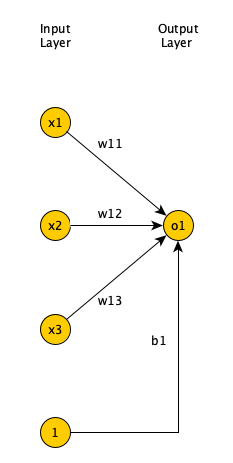
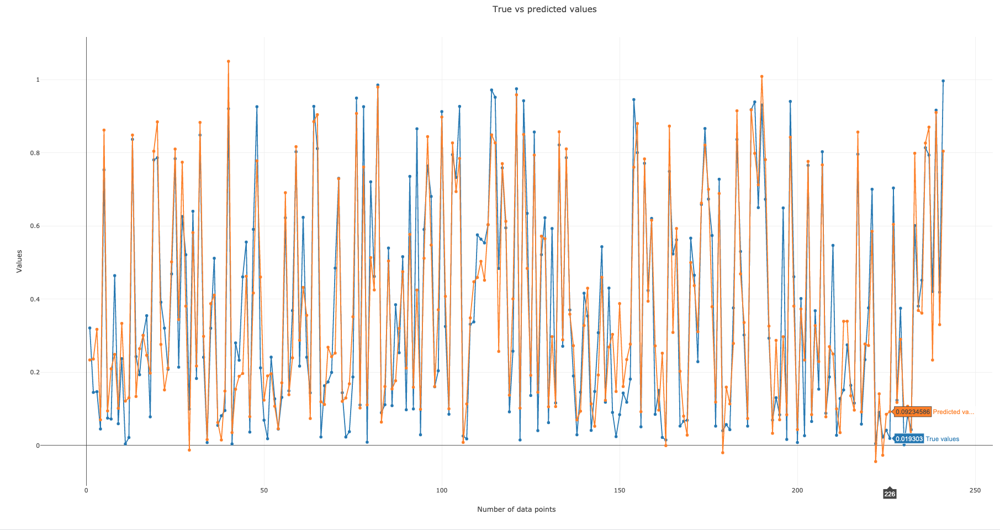
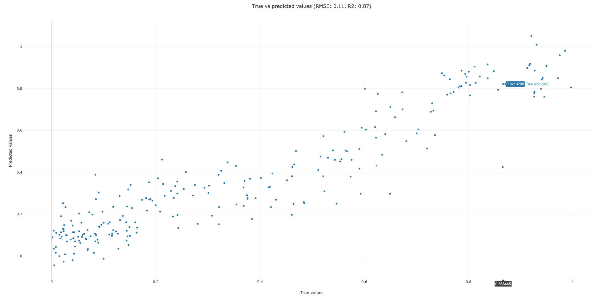
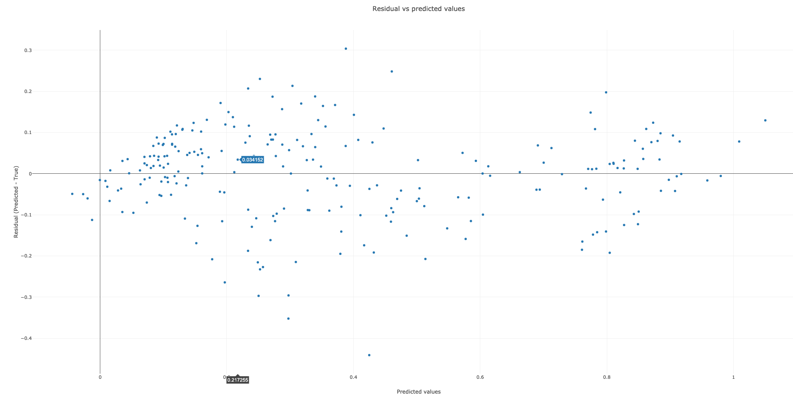

# Introduction


Artificial neural networks are a machine learning discipline roughly inspired by how neurons in a
human brain work. In the past decade, there has been a huge resurgence of neural networks thanks
to the vast availability of data and enormous increases in computing capacity (Successfully
training complex neural networks in some domains requires lots of data and compute capacity). There
are various types of neural networks (Feedforward, recurrent, etc.). In this tutorial, we discuss
feedforward neural networks (FNN), which have been successfully applied to pattern classification,
clustering, regression, association, optimization, control, and forecasting ().
We will discuss biological neurons that inspired artificial neural networks, review activation
functions, classification/regression problems solved by neural networks, and the backpropagation
learning algorithm. Finally, we construct a FNN to solve a regression problem using car purchase
price prediction dataset.

> <agenda-title></agenda-title>
>
> In this tutorial, we will cover:
>
> 1. TOC
> {:toc}
>
{: .agenda}

# Inspiration for artificial neural networks

A neuron is a special biological cell with information processing ability ().
Figure 1 shows a biological neuron. It has a cell body and two outreaching tree-like branches:
axon and dendrites. A neuron receives signals from other neurons through its dendrites, and
transmits signals generated by its cell body to other neurons via its axon. A synapse is a place
of contact between two neurons, an axon strand of one neuron and a dendrite strand of another
neuron. A synapse can either enhance or inhibit the signal that passes through it. Learning occurs
by changing the effectiveness of synapse. If the signals received exceeds a threshold, the neuron
*fires*, i.e., it transmits a signal to other neurons. If not, it will not fire.

")

Cerebral cortex, the outer most layer of the brain, is a sheet of neurons about 2 to 3 mm thick,
with a surface area of about 2,200 $$ cm^{2} $$. Cerebral cortex has about $$ 10^{11} $$ neurons.
Each neuron is connected to $$ 10^{3} to 10^{4} $$ neurons. Hence, a human brain has around
 $$ 10^{14} to 10^{15}$$ connections. Neurons communicate by a short train of signals, usually
milliseconds in duration. The frequency in which the signals are transmitted can be up to several
hundred Hertz, which is millions of times slower than an electronic circuit. However, complex tasks,
such as face recognition are made within a few hundred milliseconds. This implies that computation
involved cannot take more than 100 serial steps, i.e., brain runs parallel programs that are about
100 steps long for such complex perceptual tasks. The amount of information sent from one neuron to
another is also very small. This implies that critical information is not transmitted directly, but
is captured by the interconnections. What enables slow computing elements in the brain to perform
complex tasks so quickly is the distributed computation and representation nature of the brain ().

# Perceptron

Perceptron () is the oldest neural network still in use today. It’s a form of a
feedforward neural network, in which the connections between the nodes do not form a loop. It accepts
multiple inputs, each input is multiplied by a weight, and the products are added up. The weights
simulate the role of synapse in biological neurons (to enhance or inhibit a signal). A *bias* value
is then added to the result before it is passed to an *activation function*. An activation function
simulates the neuron firing or not. For example, in a *binary step* activation function, if the sum of
weighted inputs and bias is greater than zero, the neuron output is 1 (it fires). Else, the neuron
output is 0 (it does not fire). Bias allows us to shift the activation function.

$$ f(x) =
\left\{
	\begin{array}{ll}
		1  & \mbox{if } \boldsymbol{x} \cdot \boldsymbol{w} + b \geq 0 \\
		0  & \mbox{otherwise }
	\end{array}
\right.
$$

Figure 2 shows a Perceptron, a single layer FNN, where the input is 3 dimensional (input layer has
3 nodes), and output is 1 dimensional (output layer has 1 node).



In supervised learning, we are given a set of input-output pairs, called the *training
set*. Given the training set, the learning algorithm (iteratively) adjusts the model
parameters (weights and biases), so that the model can accurately map inputs to outputs.
The learning algorithm for Perceptron is very simple and reduces the weights (via a
small learning rate multiplier) if the predicted output is more than the expected output
and increases them otherwise ().

Minsky and Papert showed that a single layer FNN cannot solve problems in which the data is not
linearly separable, such as the XOR problem (). Adding one (or more) hidden
layers to FNN enables it to solve problems in which data is non-linearly separable. Per Universal
Approximation Theorem, a FNN with one hidden layer can represent any function (),
although in practice training such a model is very difficult (if not impossible), hence, we usually
add multiple hidden layers to solve complex problems.


The problem with multi-layer FNN was lack of a learning algorithm, as the Perceptron's learning
algorithm could not be extended to multi-layer FNN. This along with Minsky and Papert highlighting
the limitations of Perceptron resulted in sudden drop in interest in neural networks (referred to
as *AI winter*). In the 80's the backpropagation algorithm was proposed (),
which enabled learning in multi-layer FNN and resulted in a renewed interest in the field.

In a multi-layer neural network, we have an input layer, an output layer, and one or more hidden layers
(between input and output layers). The input layer has as many neurons as the dimension of the input
data. The number of neurons in the output layer depends on the type of the problem the neural network
is trying to solve (See Supervised learning section below). The more hidden layers that we have (and
the more neurons we have in each hidden layer), our neural network can estimate more complex functions.
However, this comes at the cost of increased training time (due to increased number of parameters) and
increased likelihood of *overfitting*. Overfitting happens when a model captures the details of the
training data, performs well on the training data, but is unable to perform well on data not used in
the training. The neural network, hence, cannot *generalize* to unseen data. There are regularization
techniques that can prevent that () but they are outside the scope of this tutorial.

# Activation functions

There are many activation functions besides the step function used in Perceptron (). Figure 4 shows
some of the more common activation functions.

")

Linear activation function is used in the output layer of a network when we have a regression problem. It does
not make sense to use it in all layers, as such multi-layer network can be reduced to a single layer network.
Also, networks with linear activation functions cannot model non-linear relationships between input and output.

Binary step activation function is used in Perceptron. It cannot be used in multi-layers networks as they use
back propagation learning algorithm, which changes network weights/biases based on the derivative
of the activation function, which is zero. Hence, there would no weights/biases updates in back propagation.

Sigmoid activation function can be used both at the output layer and hidden layers of a multilayer network. They
allow the network to model non-linear relationships between input and output. The problem with Sigmoid activation
function is that the derivative values away from the origin are very small and quickly approach zero. In a multi
layer network, in order to calculate weight updates in layers closer to the input layer, we use the chain rule
which requires multiplying multiple Sigmoid derivative values (formula given in Backpropagation learning algorithm
section below). Multiplying multiple small numbers results in a *very* small number, meaning that the weight updates
will be minimal and the learning algorithm will be very slow. This is known as the *vanishing gradient* problem. In
networks with many hidden layers (so called *deep networks*), we generally avoid Sigmoid and use ReLU activation
function.

Hyperbolic tangent (or tanh), similar to Sigmoid function, is a soft step function. But its range is between -1
and 1 (instead of 0 and 1). One benefit of tanh over Sigmoid is that its derivative values are larger, so it
suffers less from the vanishing gradient problem.

Finally, ReLU (Rectified Linear Unit) is an activation function popular is deep neural networks. Since it
does not suffer from vanishing gradient problem, it is preferred to Sigmoid or tanh. Sigmoid or tanh can
still be used in the output layer of deep networks.

# Supervised learning

In supervised learning a *training set* is defined as
$$ {(\boldsymbol{x^{(1)}}, \boldsymbol{y^{(1)}}), ((\boldsymbol{x^{(2)}}, \boldsymbol{y^{(2)}}), ..., ((\boldsymbol{x^{(m)}}, \boldsymbol{y^{(m)}})} $$
and each pair $$ (\boldsymbol{x^{(i)}}, \boldsymbol{y^{(i)}}) $$ is called a *training example*.
*m* is the number of training examples and $$ \boldsymbol{x^{(i)}} $$ is called *feature vector*
or *input vector*.  Each element of the vector is called a *feature*. Each $$ \boldsymbol{x^{(i)}} $$
corresponds to a label $$ \boldsymbol{y^{(i)}} $$. We assume there is an unknown function
$$ \boldsymbol{y} = f(\boldsymbol{x})$$ that maps the feature vectors to labels. The goal of
supervised learning is to use the training set to learn or estimate *f*. We call this estimated
function $$ \hat{f}(\boldsymbol{x}) $$. We want $$ \hat{f}(\boldsymbol{x}) $$ to be close to
$$ f(\boldsymbol{x})$$ not only for training set, but for training examples not in training
set ().

When the label is a numerical variable, we call the problem a *regression* problem, and when it's a categorical variable,
we call it a *classification* problem. In classification problems, the label can be represented by the set
$$ \boldsymbol{y^{i}} \in {1,2,...,c}$$, where each number is a class label and *c* is the number of classes.
If *c*=2, the class labels are mutually exclusive, we call it a *binary classification* problem. If *c* > 2, and
the labels are mutually exclusive, we call *multiclass classification* problem. If labels are *not* mutually exclusive,
we call it a *multilabel classification* problem ().

We use a method called *one-hot encoding* to convert binary and multiclass classification class label numbers into
binary values. We convert the scalar label *y* into a vector $$  \boldsymbol{y} $$ which has *c* elements. When y is
equal to k, the k-th element of $$ \boldsymbol{y} $$ is one and all other elements are zero. When labels are *not*
mutually exclusive, we use another method called *multi-hot encoding*. Suppose we are doing a multilabel image
classification, where an image can have a dog, panda, or cat in it. We represent the label by a vector of 3, and if
dog and cat are present in the image, first and third element of the vector are one and the second element is zero ().

")

Figure 5 shows examples of binary, multiclass, and multilabel classification problems and their associated one-hot
encoded or multi-hot encoded labels. The output layer of a neural network for binary classification usually has a
single neuron with Sigmoid activation function. If the neuron's output is greater than 0.5, we assume the output is 1,
and otherwise, we assume the output is 0. For multilabel classification problems, the output layer of the neural network
usually has as many neurons as the number of classes and the neurons use Sigmoid activation function. Again, we use a
threshold of 0.5 to determine whether the output of each neuron is 1 or 0. For multiclass classification problems, the
output layer usually has as many neurons as the number of classes. However, instead of Sigmoid,  we use a *Softmax*
activation function, which takes the input to all the neurons in the output layer, and creates a probability distribution,
so, the sum of outputs of all output layer neurons adds up to 1. The neuron with the highest probability denotes the predicted
label.

# Loss/Cost function

During training, for each training example in the training set $$ (\boldsymbol{x^{(i)}}, \boldsymbol{y^{(i)}}) $$, we
present the feature vector $$ \boldsymbol{x^{(i)}} $$ to the neural network, and compare the network's predicted output
$$ \boldsymbol{\hat{y}} $$ with the corresponding label $$ \boldsymbol{y^{(1)}} $$. We need to define a **loss function**
to objectively measure how much the network's predicted output is different than the expected output (the corresponding
label). We use the **cross entropy** loss function for classification problems, and *quadratic* loss function for
regression problems.

For multiclass classification problems, the cross entropy is calculated as below

$$ \mathcal{L}(\boldsymbol{\hat{y}^{(j)}}, \boldsymbol{y^{(j)}}) = - \sum_{i=1}^{c} \boldsymbol{y_{i}^{(j)}}ln(\boldsymbol{\hat{y}_{i}^{(j)}}) $$

You can find the cross entropy formula for binary and multilabel classifications in . They are just special
cases of multiclass cross entropy and are not give here for the sake of brevity.

The loss function is calculated for each training example in the training set. The average of the calculated loss functions
for all training examples in the training set is the **cost function**. For multiclass classification problems, the cost function
is calculated as below (again refer to  for binary classification and multilabel classification formulas).

$$ J(\boldsymbol{W}, \boldsymbol{b}) = - \frac{1}{m} \sum_{j=1}^{m} \sum_{i=1}^{c} \boldsymbol{y_{i}^{(j)}}ln(\boldsymbol{\hat{y}_{i}^{(j)}}) $$

For regression problems, the quadratic loss function is calculated as below:

$$ \mathcal{L}(\boldsymbol{\hat{y}^{(j)}}, \boldsymbol{y^{(j)}}) = \frac{1}{2} \| \boldsymbol{y^{(j)}} - \boldsymbol{\hat{y}^{(j)}} \| ^ 2$$

Similarly, the *quadratic* cost function (or *Mean Squared Error (MSE)*) is the average of the calculated loss functions
for all training examples in the training set.

$$ J(\boldsymbol{W}, \boldsymbol{b}) = \frac{1}{2m} \sum_{j=1}^{m} \| \boldsymbol{y^{(j)}} - \boldsymbol{\hat{y}^{(j)}} \| ^ 2 $$

# Backpropagation Learning algorithm

The **backpropagation** algorithm  is a gradient descent technique. Gradient descent aims to find
a local minimum of a function by iteratively moving in the opposite direction of the gradient (i.e., the slope) of the
function at the current point. The goal of a learning in neural networks is to minimize the cost function given the
training set. The cost function is a function of network weights and biases of all the neurons in all the layers.
Backpropagation iteratively computes the gradient of cost function relative to each weight and bias, then updates
the weights and biases in the opposite direction of the gradient, to find a local minimum.

In order to specify the formula for backpropagation, we need to define the error of the $$i^{th}$$ neuron in $$l^{th}$$
layer of a network for the $$j^{th}$$ training example as follows (where $$ z_{i}^{[l](j)} $$ is the weighted some of
input to the neuron, and $$ \mathcal{L} $$ is the loss function):

$$ \delta_{i}^{[l](j)} = \frac{\partial \mathcal{L}(\boldsymbol{\hat{y}^{(j)}}, \boldsymbol{y^{(j)}})}{\partial z_{i}^{[l](j)}}$$

Backpropagation formulas are expressed in terms of the error defined above. Full derivation of the formulas below is outside
the scope of this tutorial (Repeated use of chain rule is needed. Please refer to the excellent article by 
for details). Note that in formulas below L denotes the output layer, g the activation function, $$ \nabla $$ the gradient,
$$ W^{[l]^{T}} $$ layer l weights transposed, $$ b_{i}^{l} $$ bias of neuron i at layer l, $$ w_{ik}^{l} $$ weight to neuron
i at layer l from neuron k from layer l-1, and $$ a_{k}^{[l-1](j)} $$ activation of neuron k at layer l-1 for training example j.


$$ \boldsymbol{\delta}^{[L](j)} = \nabla_{\boldsymbol{\hat{y}^{(j)}}}\mathcal{L} \odot (g^{[L]})^{'} (\boldsymbol{z}^{[L](j)}) = \boldsymbol{\hat{y}^{(j)}} - \boldsymbol{y^{(j)}} $$

$$ \boldsymbol{\delta}^{[l](j)} = W^{[l+1]^{T}} \boldsymbol{\delta}^{[l+1](j)}  \odot (g^{[l]})^{'} (\boldsymbol{z}^{[l](j)}) $$

$$ \frac{\partial L}{\partial b_{i}^{[l]}} = \boldsymbol{\delta}_{i}^{[l](j)} $$

$$ \frac{\partial L}{\partial w_{ik}^{[l]}} = \boldsymbol{\delta}_{i}^{[l](j)} a_{k}^{[l-1](j)} $$

As you can see, we can calculate the error at the output layer for sample *j* using the first equation. Afterwards, we can calculate
the error in the layer right before the output layer for sample *j* using the second equation. The second equation is recursive,
meaning that we can calculate the error in any layer, given the error values for the next layer. This backward calculation of the
errors is the reason this algorithm is called *backpropagation*.

After the error values for all the layers are calculated for sample *j*, we use the third and fourth equations to calculate the gradient
of loss function relative to biases and weights for sample *j*. We can repeat these steps for all the samples, average the gradients of
the loss function relative to biases and weights and use the average value to update the biases and weights. This is called *batch
gradient descent*. If we have too many samples, such calculations will take a long time. An alternative is to update the biases/weights
based on the gradient of each sample. This is called *stochastic gradient descent*. While this is much faster than batch gradient descent,
the gradient calculated based on a single sample is not a good estimate of the gradient calculated in the batch version of the algorithm.
A middle ground solution is to calculate the gradient of a *batch*, and update the biases and weights based on the average of the gradients
in the batch. This is called *mini-batch gradient descent* and is preferred to the other two variations of the algorithm.

Also, note that in the second equation which is recursive, we have a term that is the derivative of the activation function for that
layer. The recursive nature of this equation means, calculating the error values in the layer prior to the output layer requires 1
multiplication by the derivative value; calculating the error values in two (or more) layers before the output layer requires 2 (or more)
multiplication by the derivative values. If these derivative values are small, as could be the case for the Sigmoid function, the product
of multiple small values will result in a *very* small value (e.g., 0.001). Since these error values decide the updates for biases and weights, this
means the update to biases and weights in layers closer to the input layer will be very small, slowing the learning algorithm to a halt.
This phenomenon is known as the *vanishing gradient* problem and is the reason Sigmoid function cannot be used in very deep networks (And
why ReLU is so popular in deep networks).

# Get Data

> <hands-on-title>Data upload</hands-on-title>
>
> 1. Create a new history for this tutorial
>
>    
>
> 2. Import the files from [Zenodo](https://zenodo.org/record/4660497) or from the shared data library
>
>    ```
>    https://zenodo.org/record/4660497/files/X_test.tsv
>    https://zenodo.org/record/4660497/files/X_train.tsv
>    https://zenodo.org/record/4660497/files/y_test.tsv
>    https://zenodo.org/record/4660497/files/y_train.tsv
>    ```
>
>    
>
>    
>
>
> 3. Rename the datasets as `X_test`, `X_train`, `y_test`, and `y_train` respectively.
>
>    
>
> 4. Check that the datatype of all the four datasets is `tabular`. If not, change the dataset's datatype to tabular.
>
>    
>
{: .hands_on}

# Solve a simple regression problem using car purchase price prediction dataset via FNN in Galaxy

In this section, we define a FNN () and train it using car purchase price prediction dataset (). Given 5 attributes
about an individual (age, gender, average miles driven per day, personal debt, and monthly income), and the money they spent on purchasing
a car, the goal is to learn a model such that given an individual's attributes, we can accurately predict how much money they are will spend
purchasing a car. We then evaluate the trained FNN on the test dataset and plot various graphs to assess the model's performance. Our training
dataset has 723 training examples, and our test dataset has 242 test examples. Input features have been scaled to be in 0 to 1 range.

### **Create a deep learning model architecture**

> <hands-on-title>Model config</hands-on-title>
>
> - 
>    - *"Select keras model type"*: `sequential`
>    - *"input_shape"*: `(5,)`
>    - In *"LAYER"*:
>        -  *"1: LAYER"*:
>            - *"Choose the type of layer"*: `Core -- Dense`
>                - *"units"*": `12`
>                - *"Activation function"*: `relu`
>        -  *"2: LAYER"*:
>            - *"Choose the type of layer"*: `Core -- Dense`
>                - *"units"*": `8`
>                - *"Activation function"*: `relu`
>        -  *"3: LAYER"*:
>            - *"Choose the type of layer"*: `Core -- Dense`
>                - *"units"*": `1`
>                - *"Activation function"*: `linear`
>    - Click *"Execute"*
{: .hands_on}

Input has 5 attributes: age, gender, average miles driven per day, personal debt, and monthly income. Our neural network has 3 layers. All
three layers are fully connected. The last layer has a single neuron with a linear activation function, used in regression problems. Prior
layers use ReLU activation function. The model config can be downloaded as a JSON file.

### **Create a deep learning model**

> <hands-on-title>Model builder (Optimizer, loss function, and fit parameters)</hands-on-title>
>
> - 
>    - *"Choose a building mode"*: `Build a training model`
>    - *"Select the dataset containing model configuration"*: Select the *Keras Model Config* from the previous step.
>    - *"Do classification or regression?"*: `KerasGRegressor`
>    - In *"Compile Parameters"*:
>        - *"Select a loss function"*: `mse / MSE / mean_squared_error`
>        - *"Select an optimizer"*: `Adam - Adam optimizer `
>        - *"Select metrics"*: `mse / MSE / mean_squared_error`
>    - In *"Fit Parameters"*:
>        - *"epochs"*: `150`
>        - *"batch_size"*: `50`
>    - Click *"Execute"*
{: .hands_on}

A loss function measures how different the predicted output is from the expected output. For regression problems, we use
*Mean Squared Error (MSE)* loss function, which averages the square of the difference between predicted and actual values for
the batch. Epochs is the number of times the whole training data is used to train the model. If we update network weights/biases
after all the training data is fed to the network, the training will be slow (as we have 723 training examples in our dataset).
To speed up the training, we present only a subset of the training examples to the network, after which we update the weights/biases.
batch_size decides the size of this subset (which we set to 50). The model builder can be downloaded as a zip file.

### **Deep learning training and evaluation**

> <hands-on-title>Training the model</hands-on-title>
>
> - 
>    - *"Select a scheme"*: `Train and Validate`
>    - *"Choose the dataset containing pipeline/estimator object"*: Select the *Keras Model Builder* from the previous step.
>    - *"Select input type:"*: `tabular data`
>        - *"Training samples dataset"*: Select `X_train` dataset
>        - *"Choose how to select data by column:"*: `All columns`
>        - *"Does the dataset contain header:"*: `Yes`
>        - *"Dataset containing class labels or target values"*: Select `y_train` dataset
>        - *"Choose how to select data by column:"*: `All columns`
>        - *"Does the dataset contain header:"*: `Yes`
>    - Click *"Execute"*
>
>
{: .hands_on}

The training step generates 3 datasets. 1) accuracy of the trained model, 2) the trained model, downloadable as a zip file, and 3) the trained
model weights, downloadable as an hdf5 file. These files are needed for prediction in the next step.

### **Model Prediction**

> <hands-on-title>Testing the model</hands-on-title>
>
> - 
>    - *"Choose the dataset containing pipeline/estimator object"* : Select the trained model from the previous step.
>    - *"Choose the dataset containing weights for the estimator above"* : Select the trained model weights from the previous step.
>    - *"Select invocation method"*: `predict`
>    - *"Select input data type for prediction"*: `tabular data`
>    - *"Training samples dataset"*: Select `X_test` dataset
>    - *"Choose how to select data by column:"*: `All columns`
>    - *"Does the dataset contain header:"*: `Yes`
>    - Click *"Execute"*
>
{: .hands_on}

The prediction step generates 1 dataset. It's a file that has the predicted car purchase price for every row in the test dataset.

### **Plot actual vs predicted curves and residual plots**

> <hands-on-title>Check and visualize the predictions</hands-on-title>
>
> - 
>    - *"Select input data file"*: `y_test`
>    - *"Select predicted data file"*": Select `Model Prediction` from the previous step
>    - Click *"Execute"*
>
{: .hands_on}

This step generates 3 graphs. The first graph (Figure 6) plots true vs predicted values. The closer the points are to each other,
the better our model's performance at predicting. The second graph (Figure 7) is a scatter plot of true vs predicted values. If
our model predicts all values correctly, we would get a diagonal line (going from bottom left to upper right). The more the
predicted vs true points are off this diagonal line, the worse our model's performance at predicting. The R2 (coefficient of
determination) score for our model is 0.87 (out of the best possible score of 1.0). The RMSE (root mean squared error) is 0.11.
The best value for RMSE is obviously 0 for perfect prediction. The third graph (Figure 8) plots residual (predicted - true) vs
predicted values. The better our model's predictions, the closer the points to y=0 line.







# Conclusion


In this tutorial, we discussed the inspiration behind the neural networks, and explained Perceptron, one of the earliest neural
networks still in use today. We then discussed different activation functions, what supervised learning is, what are loss/cost functions,
and how backpropagation minimizes the cost function. Finally, we implemented a FNN in Galaxy to solve a regression problem on car purchase price prediction data.
