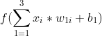
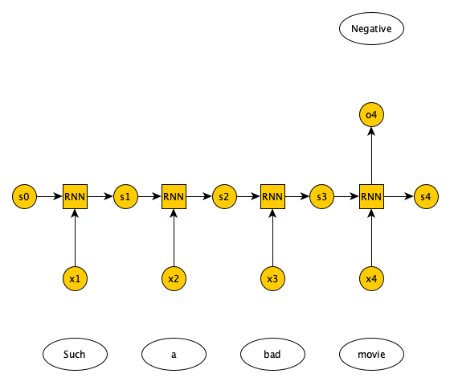

# Introduction


<!-- This is a comment. -->

Artificial neural networks are a machine learning discipline roughly inspired by how neurons in a
human brain work. In the past decade, there has been a huge resurgence of neural networks thanks
to the vast availability of data and enormous increases in computing capacity (Successfully
training complex neural networks in some domains requires lots of data and compute capacity). There
are various types of neural networks (Feedforward, recurrent, etc). In this tutorial, we discuss
recurrent neural networks, which model sequential data, and have been successfully applied to language
generation, machine translation, speech recognition, image description, and text summarization
(, , ,
, ). We then explain how RNN differ from feedforward networks,
describe various RNN architectures and solve a sentiment analysis problem using RNN in Galaxy.

> <agenda-title></agenda-title>
>
> In this tutorial, we will cover:
>
> 1. TOC
> {:toc}
>
{: .agenda}

# Review of feedforward neural networks (FNN)

In feedforward neural networks (FNN) a single training example is presented to the network,
after which the the network generates an output. For example, a lung X-ray image is passed
to a FNN, and the network predicts tumor or no tumor. By contrast, in RNN a training example
is a sequence, which is presented to the network one at a time. For example, a sequence of
English words is passed to a RNN, one at a time, and the network generates a sequence of
Persian words, one at a time. RNN handle sequential data, whether its temporal or ordinal.

## Single layer FNN


Figure 1 shows a single layer FNN, where the input is 3 dimensional. Each input field is multiplied by a
weight. Afterwards, the results are summed up, along with a bias, and passed to an activation function.



The activation function can have many forms (sigmoid, tanh, ReLU, linear, step function, sign function, etc.).
Output layer neurons usually have sigmoid or tanh functions. For more information on the listed activation
functions, please refer to .


## Multi-layer FNN

Minsky and Papert showed that a single layer FNN cannot solve problems in which the data is not linearly separable,
such as the XOR problem (). Adding one (or more) hidden layers to FNN enables it to solve problems
in which data is non-linearly separable. Per Universal Approximation Theorem, a FNN with one hidden layer can represent
any function (), although in practice training such a model is very difficult (if not impossible),
hence, we usually add multiple hidden layers to solve complex problems.


## Learning algorithm

In supervised learning, we are given a set of input-output pairs, called the *training set*. Given the training set, the learning algorithm
(iteratively) adjusts the model parameters, so that the model can accurately map inputs to outputs. We usually have another set of input-output
pairs, called the *test set*, which is not used by the learning algorithm. When the learning algorithm completes, we assess the learned model by
providing the test set inputs to the model and comparing the model outputs to test set outputs. We need to define a **loss function** to objectively
measure how much the model output is off of the expected output. For classification problems we use the **cross entropy** loss function.


The loss function is calculated for each input-output pair in the training set. The average of the calculated loss functions for all training
set input-output pairs is called the **Cost function**. The goal of the learning algorithm is to minimize the cost function. The cost function
is a function of network weights and biases of all neurons in all layers. The **backpropagation** learning algorithm 
iteratively computes the gradient of cost function relative to each weight and bias, then updates the weights and biases in the opposite
direction of the gradient, to find the local minimum.


# Recurrent neural networks

Unlike FNN, in RNN the output of the network at time t is used as network input at time t+1. RNN handle sequential data (e.g. temporal or ordinal).

## Possible RNN inputs/outputs

There are 4 possible input/output combinations for RNN and each have a specific application. One-to-one is basically a FNN. One-to-many,
where we have one input and a variable number of outputs. One example application is image captioning, where a single image is provided
as input and a variable number of words (which caption the image) is returned as output (See Figure 7).


Many-to-one RNN, on the other hand, have a variable number of inputs and a single output. One example application is document sentiment
classification, where a variable number of words in a document are presented as input, and a single output predicts whether the document
has a positive or negative sentiment regarding a topic (See Figure 8).



There are two types of many-to-many RNN. One in which the number of inputs and outputs match, e.g., in labeling the video frames the number
of frames matches the number of labels, and the other in which the number of inputs and outputs do not match, e.g., in language translation
we pass in n words in English and get m words in Italian (See Figure 9).


## RNN architectures

Mainly, there are three types of RNN: 1) Vanilla RNN, 2) LSTM (), and 3) GRU ().
A Vanilla RNN, simply combines the state information from the previous timestamp with the input from the current timestamp to generate the
state information and output for current timestamp. The problem with Vanilla RNN is that training deep RNN networks is impossible due to the
**vanishing gradient** problem. Basically, weights/biases are updated according to the gradient of the loss functions relative to 
the weights/biases. The gradients are calculated recursively from the output layer towards the input layer (Hence, the name *backpropagation*).
The gradient of the input layer is the product of the gradient of the subsequent layers. If those gradients are small, the gradient of the input
layer (which is the product of multiple small values) will very small, resulting in very small updates to weights/biases of the initial layers
of the RNN, effectively halting the learning process.

LSTM and GRU are two RNN architectures that address vanishing gradient problem. Full description of LSTM/GRU is beyond the scope of this
tutorial (Please refer to  and ), but in a nutshell both LSTM and GRU use **gates** such that the weights/biases updates in previous
layers are calculated via a series of additions (not multiplications). Hence, these architectures can learn even when the RNN has hundreds or
thousands of layers.

# Text representation schemes

In this tutorial we perform sentiment analysis on IMDB (https://www.imdb.com/) movie reviews dataset (). We train our RNN on
the training dataset, which is made up of 25000 movie reviews, some positive and some negative. We then test our RNN on the test set, which is
also made up of 25000 movie reviews, again some positive and some negative. The training and test sets have no overlap. Since we are dealing with
text data, it's a good idea to review various mechanisms for representing text data. Before that, we are going to briefly discuss how to preprocess
text documents.

## Text preprocessing

The first step is to tokenize a document, i.e., break it down into words. Next, we remove the punctuation marks, URLs, and stop words -- words like
'a', 'of', 'the', etc. that happen frequently in all documents and do not have much value in discriminating between documents. Next, we normalize
the text, e.g., replace 'brb' with 'Be right back', etc. Then, We then run the spell checker to fix typos and also make all words lowercase. Next, we perform stemming or lemmatization. Basically, if we have words like 'organizer', 'organize', 'organized', and 'organization' we want to reduce all of them to a single word. Stemming cuts the end of these words to come up with a single root (e.g., 'organiz'). The root may not be an actual word.
Lemmatization is smarter in that it reduces the word variants to a root that is actually a word (e.g., 'organize'). All of these steps help reduce
the number of features in feature vector of a document and should make the training of our model faster/easier.

For this introductory tutorial, we do minimal text preprocessing. We ignore the top 50 words in IMDB reviews (mostly stop words) and include
the next 10,000 words in our dataset. Reviews are limited to 500 words. They are trimmed if they are longer and padded if they are shorter.

## Bag of words and TF-IDF

If you don't care about the order of the words in a document, you can use bag of words (BoW) or term frequency inverse document frequency (TF-IDF).
In these models we have a 2 dimensional array. The rows represent the documents (in our example, the movie reviews) and the columns
represent the words in our vocabulary (all the unique words in all the documents). If a word is not present in a document, we have a zero
at the corresponding row and column as the entry. If a word is present in the document, we have a one as the entry -- Alternatively, we could use
the word count or frequency.

 representation")

Suppose we have the following 2 documents: 1) Magic passed the basketball to Kareem, and 2) Lebron stole the basketball from Curry. The BoW
representation of these documents is given in Figure 10.

BoW's advantage is its simplicity, yet it does not take into account the rarity of a word across documents, which unlike common words are
important for document classification.

In TF-IDF, similar to BoW we have an entry for each document-word pair. In TD-IDF, the entry is the product of 1) Term frequency, the
frequency of a word in a document, and 2) Inverse document frequency, the inverse of the number of documents that have the word divided
by the total number of documents (we usually use logarithm of the IDF).

TF-IDF takes into account the rarity of a word across documents, but like BoW does not capture word order or word meaning in documents. BoW
and TF-IDF are suitable representations for when word order is not important. They are used in document classification problems like spam detection.

## One hot encoding (OHE)

OHE is a technique to convert categorical variables such as words into a vector. Suppose our vocabulary has 3 words: orange, apple, banana.
Each word for this vocabulary is represented by a vector of size 3. Orange is represented by a vector whose first element is 1 and other
elements are 0; Apple is represented by a vector whose second element is 1 and other elements are 0; And banana is represented by a
vector whose third element is 1 and other elements are 0. As you can see only one element in the vector is 1 and the rest are 0's. The same
concept applies if the size of the vocabulary is N.

 representation")

The problem with OHE is that for very large vocabulary sizes (say, 100,000 words) it requires tremendous amount of storage. Also, it has no
concept of word similarity.

## Word2Vec

In Word2Vec, each word is represented as an n dimensional vector (n being much smaller than vocabulary size), such that the words that have
similar meanings are closer to each other in the vector space, and words that don't have a similar meaning are farther apart. Words are
considered to have a similar meaning if they co-occur often in documents. There are 2 Word2Vec architectures, one that predicts the probability
of a word given the surrounding words (Continuous BOW), and one that given a word predicts the probability of the surrounding words (Continuous
skip-gram).

In this tutorial, we find an n dimensional representation of the IMDB movie review words, not based on word meanings, but based on how they
improve the sentiment classification task. The n dimensional representation is learned by the learning algorithm, simply by reducing the
cost function via backpropagation.

# Get Data

> <hands-on-title>Data upload</hands-on-title>
>
> 1. Create a new history for this tutorial
>
>    
>
> 2. Import the files from [Zenodo](https://zenodo.org/record/4477881) or from the shared data library
>
>    ```
>    https://zenodo.org/record/4477881/files/X_test.tsv
>    https://zenodo.org/record/4477881/files/X_train.tsv
>    https://zenodo.org/record/4477881/files/y_test.tsv
>    https://zenodo.org/record/4477881/files/y_train.tsv
>    ```
>
>    
>
>    
>
>
> 3. Rename the datasets as `X_test`, `X_train`, `y_test`, and `y_train` respectively.
>
>    
>
> 4. Check that the datatype of all the four datasets is `tabular`. If not, change the dataset's datatype to tabular.
>
>    
>
{: .hands_on}

# Sentiment Classification of IMDB movie reviews with RNN

In the section, we define a RNN and train it using IMDB movie reviews training dataset. The goal is to learn a model such that given the
words in a review we can predict whether the review was positive or negative. We then evaluate the trained RNN on the test dataset
and plot the confusion matrix.

### **Create a deep learning model architecture**

> <hands-on-title>Model config</hands-on-title>
>
> - 
>    - *"Select keras model type"*: `sequential`
>    - *"input_shape"*: `(500,)`
>    - In *"LAYER"*:
>        -  *"1: LAYER"*:
>            - *"Choose the type of layer"*: `Embedding -- Embedding`
>                - *"input_dim"*": `10000`
>                - *"output_dim"*": `32`
>        -  *"2: LAYER"*:
>            - *"Choose the type of layer"*: `Recurrent -- LSTM`
>                - *"units"*": `100`
>        -  *"3: LAYER"*:
>            - *"Choose the type of layer"*: `Core -- Dense`
>                - *"units"*: `1`
>                - *"Activation function"*: `sigmoid`
>    - Click *"Execute"*
{: .hands_on}

Input is a movie review of size 500 (longer reviews were trimmed and shorter ones padded). Our neural network has 3 layers. The first layer is
an embedding layer, that transforms each review words into a 32 dimensional vector (*output_dim*). We have 10000 unique words in our IMDB dataset
(*input_dim*). The second layer is an *LSTM* layer, which is a type of RNN. Output of the LSTM layer has a size of *100*. The third layer is a
*Dense* layer, which is a fully connected layer (all 100 output neurons in LSTM layer are connected to a single neuron in this layer). It has a
*sigmoid* activation function, that generates an output between 0 and 1. Any output greater than 0.5 is considered a predicted positive review,
and anything less than 0.5 a negative one. The model config can be downloaded as a JSON file.

### **Create a deep learning model**

> <hands-on-title>Model builder (Optimizer, loss function, and fit parameters)</hands-on-title>
>
> - 
>    - *"Choose a building mode"*: `Build a training model`
>    - *"Select the dataset containing model configuration"*: Select the *Keras Model Config* from the previous step.
>    - *"Do classification or regression?"*: `KerasGClassifier`
>    - In *"Compile Parameters"*:
>        - *"Select a loss function"*: `binary_crossentropy`
>        - *"Select an optimizer"*: `Adam - Adam optimizer `
>        - *"Select metrics"*: `acc/accuracy`
>    - In *"Fit Parameters"*:
>        - *"epochs"*: `2`
>        - *"batch_size"*: `128`
>    - Click *"Execute"*
{: .hands_on}

A loss function measures how different the predicted output is versus the expected output. For binary classification problems, we use
*binary cross entropy* as loss function. Epochs is the number of times the whole training data is used to train the model. Setting *epochs* to 2
means each training example in our dataset is used twice to train our model. If we update network weights/biases after all the training data is
feed to the network, the training will be very slow (as we have 25000 training examples in our dataset). To speed up the training, we present
only a subset of the training examples to the network, after which we update the weights/biases. *batch_size* decides the size of this subset.
The model builder can be downloaded as a zip file.

### **Deep learning training and evaluation**

> <hands-on-title>Training the model</hands-on-title>
>
> - 
>    - *"Select a scheme"*: `Train and Validate`
>    - *"Choose the dataset containing pipeline/estimator object"*: Select the *Keras Model Builder* from the previous step.
>    - *"Select input type:"*: `tabular data`
>        - *"Training samples dataset"*: Select `X_train` dataset
>        - *"Choose how to select data by column:"*: `All columns`
>        - *"Dataset containing class labels or target values"*: Select `y_train` dataset
>        - *"Choose how to select data by column:"*: `All columns`
>    - Click *"Execute"*
>
>
{: .hands_on}

The training step generates 3 datasets. 1) accuracy of the trained model, 2) the trained model, downloadable as a zip file, and 3) the trained
model weights, downloadable as an hdf5 file. These files are needed for prediction in the next step.

### **Model Prediction**

> <hands-on-title>Testing the model</hands-on-title>
>
> - 
>    - *"Choose the dataset containing pipeline/estimator object"* : Select the trained model from the previous step.
>    - *"Choose the dataset containing weights for the estimator above"* : Select the trained model weights from the previous step.
>    - *"Select invocation method"*: `predict`
>    - *"Select input data type for prediction"*: `tabular data`
>    - *"Training samples dataset"*: Select `X_test` dataset
>    - *"Choose how to select data by column:"*: `All columns`
>    - Click *"Execute"*
>
{: .hands_on}

The prediction step generates 1 dataset. It's a file that has predictions (1 or 0 for positive or negative movie reviews) for every review in
the test dataset.

### **Machine Learning Visualization Extension**

> <hands-on-title>Creating the confusion matrix</hands-on-title>
>
> - 
>    - *"Select a plotting type"*: `Confusion matrix for classes`
>    - *"Select dataset containing the true labels"*": `y_test`
>    - *"Choose how to select data by column:"*: `All columns`
>    - *"Select dataset containing the predicted labels"*": Select `Model Prediction` from the previous step
>    - *"Does the dataset contain header:"*: `Yes`
>    - Click *"Execute"*
>
{: .hands_on}

**Confusion Matrix** is a table that describes the performance of a classification model. It lists the number of positive and negative examples
that were correctly classified by the model, True positives (TP) and true negatives (TN), respectively. It also lists the number of examples that
were classified as positive that were actually negative (False positive, FP, or Type I error), and the number of examples that were classified
as negative that were actually positive (False negative, FN, or Type 2 error). Given the confusion matrix, we can calculate **precision** and
**recall** . Precision is the fraction of predicted positives that are true positives (Precision = TP / (TP + FP)). Recall
is the fraction of true positives that are predicted (Recall = TP / (TP + FN)). One way to describe the confusion matrix with just one value is
to use the **F score**, which is the harmonic mean of precision and recall

$$ Precision = \frac{\text{True positives}}{\text{True positives + False positives}} $$

$$ Recall = \frac{\text{True positives}}{\text{True positives + False negatives}} $$

$$ F score = \frac{2 * \text{Precision * Recall}}{\text{Precision + Recall}} $$


Figure 12 is the resultant confusion matrix for our sentiment analysis problem. The first row in the table represents the *true* 0 (or negative sentiment)
class labels (we have 10,397 + 2,103 = 12,500 reviews with negative sentiment). The second row represents the *true* 1 (or positive sentiment) class labels
(Again, we have 1,281 + 11,219 = 12,500 reviews with positive sentiment). The left column represents the *predicted* negative sentiment class labels (Our RNN
predicted 10,397 + 1,281 = 11,678 reviews as having a negative sentiment). The right column represents the *predicted* positive class labels (Our RNN
predicted 11,219 + 2,103 = 13,322 reviews as having a positive sentiment).Looking at the bottom right cell, we see that our RNN has correctly predicted 11,219
reviews as having a positive sentiment (True positives). Looking at the top right cell, we see that our RNN has incorrectly predicted 2,103 reviews as having
a positive (False positives). Similarly, looking at the top left cell, we see that our RNN has correctly predicted 10,397 reviews as having negative sentiment
(True negative). Finally, looking at the bottom left cell, we see that our RNN has incorrectly predicted 1,281 reviews as negative (False negative). Given
these numbers we can calculate Precision, Recall, and the F score as follows:

$$ Precision = \frac{\text{True positives}}{\text{True positives + False positives}} = \frac{11,219}{11,219 + 2,102} = 0.84 $$

$$ Recall = \frac{\text{True positives}}{\text{True positives + False negatives}} = \frac{11,219}{11,219 + 1,281} = 0.89 $$

$$ F score = \frac{2 * \text{Precision * Recall}}{\text{Precision + Recall}} = \frac{2 * 0.84 * 0.89}{0.84 + 0.89} = 0.86 $$

# Conclusion


In this tutorial, we briefly reviewed feedforward neural networks, explained how recurrent neural networks are different, and discussed various
RNN input/output and architectures. We also discussed various text representation and preprocessing schemes and used Galaxy to solve a sentiment
classification problem using RNN on IMDB movie reviews dataset.
