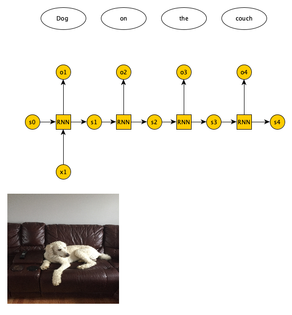
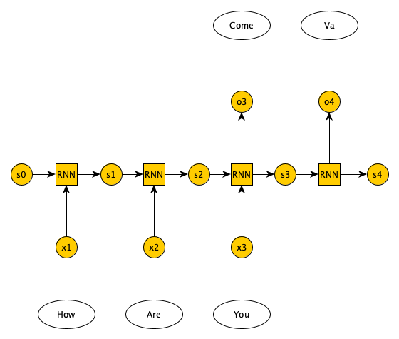

# Introduction
{:.no_toc}

<!-- This is a comment. -->

Artificial neural networks are a machine learning discipline roughly inspired by how neurons in a 
human brain work. In the past decade, there has been a huge resurgence of neural networks thanks 
to the vast availability of training data and enormous increases in computing capacity (Successfully 
training complex neural networks in some domains requires lots of data and compute capacity). There 
are various types of neural networks (Feedforward, recurrent, etc). In this tutorial, we discuss 
the recurrent neural networks and explain how they differ from feedforward variants. We also describe 
various RNN architectures and solve a sentiment analysis problem using RNN in Galaxy.       

> ### Agenda
>
> In this tutorial, we will cover:
>
> 1. TOC
> {:toc}
>
{: .agenda}

# Review of feedforward neural networks (FNN)

In feedforward neural networks (FNN) all the fields of a training example are presented
to the network at once, after which the the network generates an output. For example, a
lung X-ray image is passed to a FNN, and the network predicts tumor or no tumor. By contrast,
in RNNs the training example fields are presented to the network one at a time. For example,
a sequence of English words is passed to an RNN, one at a time, and the network generates a
sequence of Persian words, one at a time. RNNs handle sequential data, whether its temporal or ordinal.

## Single layer FNN


Figure 1 shows a single layer FNN, where the input is 3 dimensional. Each input field is multiplied by a
weight. Afterwards, the results are summed up, along with a bias, and passed to an activation function.


The activation function can have many forms (sigmoid, tanh, ReLU, linear, step function, sign function, etc.).
Output layer neurons usually have sigmoid or tanh functions.


## Multi-layer FFN

Minsky and Papert showed that a single layer FNN cannot solve problems in which the data is not linearly separable, 
such as the XOR problem (). Adding one (or more) hidden layers to FNN enables it solve problems 
in which data is non-linearly separable. Per Universal Approximation Theorem, a FNN with one hidden layer can represent 
any function (), although in practice training such a model is very difficult (if not impossible), 
hence, we usually add multiple hidden layers to solve complex problems.


## Learning algorithm 

The learning algorithm incrementally tweaks the network weights, so that the network error on the training 
set is minimized. Training set is composed of many training examples. Each training set is fed to the network 
and the network output is compared to the expected output. We need to define a **loss function** to objectively 
measure how much the predicted output is off of the expected output. For classification problems we use the 
**cross entropy** loss function.     


Loss function is calculated for each training example. The average of the calculated loss functions over all training 
examples in the training set is the **Cost function**. The goal of the learning algorithm is to minimize the cost 
function. The cost function is a function of network weightsand biases of all neurons in all layers. The **backpropagation** 
learning algorithm iteratively computes the gradient of cost function relative to each weight and bias, then updates the weights 
and biases in the opposite direction of the gradient, to find the local minimum.


  
# Recurrent neural networks

Unlike FNN, in RNN the output of the network at time t is used as network input at time t+1. RNN handle sequential data (e.g. temporal or ordinal). 

## Possible RNN inputs/outputs

There are 4 possible input/output combinations for RNN and each have a specific application. One-to-one is basically a FNN. One-to-many, 
where we have one input and a variable number of output. One example application is image captioning, where a single image is provided 
as input and a variable number of words (which caption the image) is returned as output (See Figure 7).   



Many-to-one RNN, on the other hand, have a variable number of inputs and a single output. One example application is document sentiment 
classification, where a variable number of words in a document are presented as input, and a single output predicts whether the document
has a positive or negative sentiment regarding a topic (See Figure 8).


There are two types of many-to-many RNN. One in which the number of inputs and outputs match, e.g., in labeling the video frames the number 
of frames matches the number of labels, and the other in which the number of inputs and outputs do not match, e.g., in language translation 
we pass in n words in English and get m words in Italian (See Figure 9).



## RNN architectures

Mainly, there are three types of RNN: 1) Vanilla RNN, 2) LSTM (), and 3) GRU (). 
A Vanilla RNN, simply combines the state information from the previous timestamp with the input from the current timestamp to generate the 
state information for current timestamp. The problem with Vanilla RNN is that training deep RNN networks is impossible due to the 
**vanishing gradient** problem. Basically, starting from the output layer, in order to determine weights/biases updates, we need to calculate 
the derivative of the loss function relative to the layers input, which is usually a small number. This is not a problem for the output layer, 
but for the previous layers, this process must be repeated recursively, resulting in very small updates in weights/biases of the initial layers 
of the RNN, lting the learning process.

LSTM and GRU are two RNN architectures that address vanishing gradient problem. Full description of LSTM/GRU is beyond the scope of this 
tutorial (Please refer to ref1 and ref2), but in a nutshell both LSTM and GRU used **gates** such that the weights/biases updates in previous 
layers are calculated via a series of additions (not multiplications). Hence, these architectures can learn even when the RNN has hundreds or 
thousands of layers. 

# Text representation schemes

In this tutorial we perform sentiment analysis on IMDB movie reviews dataset (). We train our RNN on the training dataset, 
which is made up of 25000 movie reviews, some positive and some negative. We then test our RNN on the test set, which is also made up of 25000 
movie reviews, again some positive and some negative. The training and test sets have no overlap. Since we are dealing with text data, its a 
good idea to review various mechanisms for representing text data. Before that, we are going to briefly discuss how to preprocess text documents. 

## Text preprocessing

The first step is to tokenize a document, i.e., break it down into words. Next, we remove punctuations, URLs, and stop words -- words like 'a', 'of', 
'the', etc. that happen frequently in all documents and do not have much value in discriminating between documents. Next, we normalize the text, 
e.g., replace 'brb' with 'Be right back', etc. Then, We then run the spell checker to fix typos and also make all words lowercase. Next, we do 
stemming or lemmatization. Basically, if we have words like 'organizer', 'organize', 'organized', and 'organization' we want to reduce all of them 
to a single word. Stemming cuts the end of these words to come up with a single root (e.g., 'organiz'). The root may not be an actual word. 
Lemmatization is smarter in that it reduces the word variants to a root that is actually a word (e.g., 'organize'). All of these steps help reduce 
the number of features in feature vector of a document and should make the training of our model faster/easier.

For this introductory tutorial, we do minimal text preprocessing. We ignore the top 50 words in IMDB reviews (mostly stop words) and include 
the next 10,000 words in our dataset. Reviews are limited to 500 words. They are trimmed if they are longer and padded if they are shorter.
 
## Bag of words and TF-IDF

If you don't care about the order of the words in a document, you can use bag of words (BoW) or text frequency inverse document frequency (TF-IDF).
In these models we have a 2 dimensional array. The rows represent the documents (in our example, the movie reviews) and the columns
represent the words in our voabulary (all the unique words in all the documents). If a word is not present in a document, we have a zero 
at the corresponding row and column as the entry. If a word is present in the document, we have a one as the entry -- Alternatively, we could use 
the word count or frequency.

 representation")

Suppose we have the following 2 documents: 1) Magic passed the basketball to Kareem, and 2) Lebron stole the basketball from Curry. The BoW 
representation of these documents is given in Figure 10. 

BoW's advantage is its simplicity, yet it does not take into account the rarity of a word across documents, which unlike common words are
important for document classification. 

In TF-IDF, similar to BoW we have an entry for each document-word pair. In TD-IDF, the entry is the product of 1) Text frequency, the 
frequency of a word in a document, and 2) Inverse document frequency, the inverse of the number of documents that have the word divided 
by the total number of documents (we usually use logarithm of the IDF).

TF-IDF takes into account the rarity of a word across documents, but like BoW does not capture word order or word meaning in documents. BoW 
and TF-IDF are suitable representations for when word order is not important. They are used in document classification problems like spam detection.

## One hot encoding (OHE)

OHE is a technique to convert categorical variables such as words into a vector. Suppose our vocabulary has 3 words: orange, apple, banana. 
Each word for this vocabulary is represented by a vector of size 3. Orange is represented by a vector whose first element is 1 and other 
elements are 0; Apple is represented by a vector whose second element is 1 and other elements are 0; And banana is represented by a 
vector whose third element is 1 and other elements are 0. As you can see only one element in the vector is 1 and the rest are 0's. The same 
concept applies if the size of the vocabulary is N.    

 representation")

The problem with OHE is that for very large vocabulary sizes (say, 100,000 words) it requires tremendous amount of storage. Also, it has no 
concept of word similarity.   

## Word2Vec

In Word2Vec, each word is represented as an n dimensional vector (n being much smaller than vocabulary size), such that the words that have 
similar meanings are closer to each other in the vector space, and words that don't have a similar meaning are farther apart. Words are 
considered to have a similar meaning if they co-occur often in documents. There are 2 Word2Vec architectures, one that predicts the probability 
of a word given the surrounding words (Continous BOW), and one that given a word predicts the probability of the surrounding words (Continous skip-gram).

In this tutorial, we find an n dimensional representation of the IMDB movie review words, not based on word meanings, but based on how they
improve the sentiment classification task. The n dimensional representation is learned by the learning algorithm, simply by reducing the 
cost function via backpropagation. 

# Get data

> ###  Hands-on: Data upload
>
> 1. Create a new history for this tutorial
> 2. Import the files from [Zenodo](https://zenodo.org/record/4477881#.YBrEQ3dKgvo) or from the shared data library
>
>    ```
>    https://zenodo.org/record/4477881/files/X_test.tsv
>    https://zenodo.org/record/4477881/files/X_train.tsv
>    https://zenodo.org/record/4477881/files/y_test.tsv
>    https://zenodo.org/record/4477881/files/y_train.tsv
>    ```
>    
>    
>
> 3. Rename the datasets as `X_test`, `X_train`, `y_test`, and `y_train` repectively
>
>    
>
> 4. Check that the datatype of `X_test` and `X_train` is `tabular` and `y_test` and `y_train` is `txt`
>
>    
>
{: .hands_on}

# Title of the section usually corresponding to a big step in the analysis

It comes first a description of the step: some background and some theory.
Some image can be added there to support the theory explanation:

The idea is to keep the theory description before quite simple to focus more on the practical part.

***TODO***: *Consider adding a detail box to expand the theory*

> ###  More details about the theory
>
> But to describe more details, it is possible to use the detail boxes which are expandable
>
{: .details}

A big step can have several subsections or sub steps:


## Sub-step with **Create deep learning model**

> ###  Hands-on: Task description
>
> 1. **Create deep learning model**  with the following parameters:
>    - *"Choose a building mode"*: `Build a training model`
>        - In *"Compile Parameters"*:
>            - *"Select an optimizer"*: `Adam - Adam optimizer `
>            - *"Select metrics"*: ``
>        - In *"Fit Parameters"*:
>            - *"epochs"*: `2`
>            - *"batch_size"*: `128`
>            - In *"callback"*:
>                -  *"Insert callback"*
>                    - *"Choose a callback"*: `None`
>
>    ***TODO***: *Check parameter descriptions*
>
>    ***TODO***: *Consider adding a comment or tip box*
>
>    > ###  Comment
>    >
>    > A comment about the tool or something else. This box can also be in the main text
>    {: .comment}
>
{: .hands_on}

***TODO***: *Consider adding a question to test the learners understanding of the previous exercise*

> ###  Questions
>
> 1. Question1?
> 2. Question2?
>
> > ###  Solution
> >
> > 1. Answer for question1
> > 2. Answer for question2
> >
> {: .solution}
>
{: .question}

## Sub-step with **Deep learning training and evaluation**

> ###  Hands-on: Task description
>
> 1. **Deep learning training and evaluation**  with the following parameters:
>    - *"Select a scheme"*: `Train and Validate`
>        - In *"Validation holdout"*:
>            - *"Select the splitting method"*: `ShuffleSplit`
>        - In *"Metrics for evaluation"*:
>            - *"Select the primary metric (scoring):"*: `default with estimator`
>    - *"Select input type:"*: `tabular data`
>        - *"Choose how to select data by column:"*: `All columns`
>        - *"Choose how to select data by column:"*: `All columns`
>    - *"Save the fitted model"*: ``
>
>    ***TODO***: *Check parameter descriptions*
>
>    ***TODO***: *Consider adding a comment or tip box*
>
>    > ###  Comment
>    >
>    > A comment about the tool or something else. This box can also be in the main text
>    {: .comment}
>
{: .hands_on}

***TODO***: *Consider adding a question to test the learners understanding of the previous exercise*

> ###  Questions
>
> 1. Question1?
> 2. Question2?
>
> > ###  Solution
> >
> > 1. Answer for question1
> > 2. Answer for question2
> >
> {: .solution}
>
{: .question}

## Sub-step with **Model Prediction**

> ###  Hands-on: Task description
>
> 1. **Model Prediction**  with the following parameters:
>    - *"Select input data type for prediction"*: `tabular data`
>        - *"Choose how to select data by column:"*: `All columns`
>
>    ***TODO***: *Check parameter descriptions*
>
>    ***TODO***: *Consider adding a comment or tip box*
>
>    > ###  Comment
>    >
>    > A comment about the tool or something else. This box can also be in the main text
>    {: .comment}
>
{: .hands_on}

***TODO***: *Consider adding a question to test the learners understanding of the previous exercise*

> ###  Questions
>
> 1. Question1?
> 2. Question2?
>
> > ###  Solution
> >
> > 1. Answer for question1
> > 2. Answer for question2
> >
> {: .solution}
>
{: .question}

## Sub-step with **Machine Learning Visualization Extension**

> ###  Hands-on: Task description
>
> 1. **Machine Learning Visualization Extension**  with the following parameters:
>    - *"Select a plotting type"*: `Confusion matrix for classes`
>        - *"Choose how to select data by column:"*: `All columns`
>        - *"Does the dataset contain header:"*: `Yes`
>
>    ***TODO***: *Check parameter descriptions*
>
>    ***TODO***: *Consider adding a comment or tip box*
>
>    > ###  Comment
>    >
>    > A comment about the tool or something else. This box can also be in the main text
>    {: .comment}
>
{: .hands_on}

***TODO***: *Consider adding a question to test the learners understanding of the previous exercise*

> ###  Questions
>
> 1. Question1?
> 2. Question2?
>
> > ###  Solution
> >
> > 1. Answer for question1
> > 2. Answer for question2
> >
> {: .solution}
>
{: .question}


## Re-arrange

To create the template, each step of the workflow had its own subsection.

***TODO***: *Re-arrange the generated subsections into sections or other subsections.
Consider merging some hands-on boxes to have a meaningful flow of the analyses*

# Conclusion
{:.no_toc}

Sum up the tutorial and the key takeaways here. We encourage adding an overview image of the
pipeline used.
