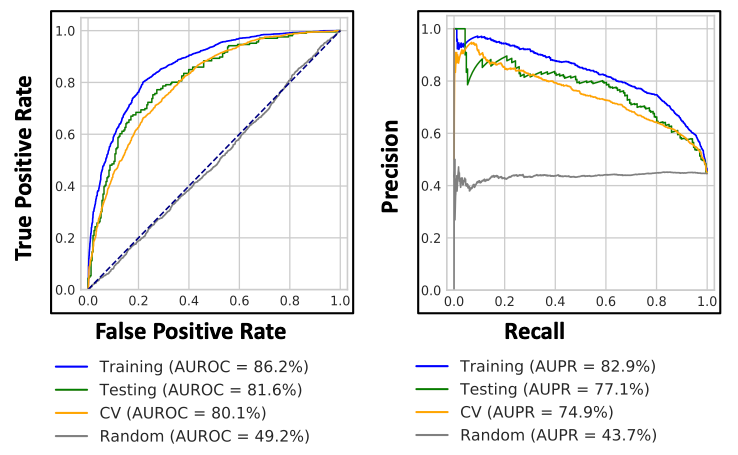
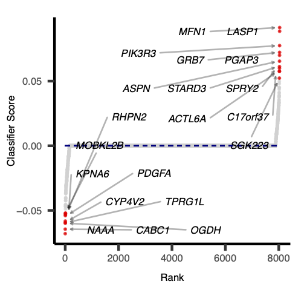
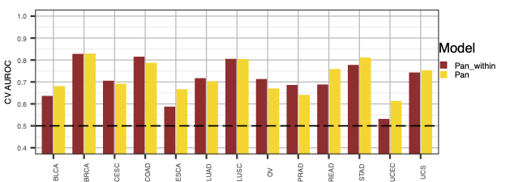
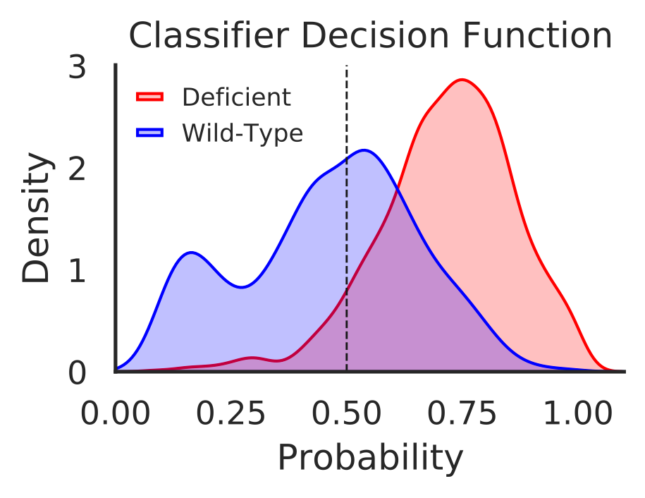
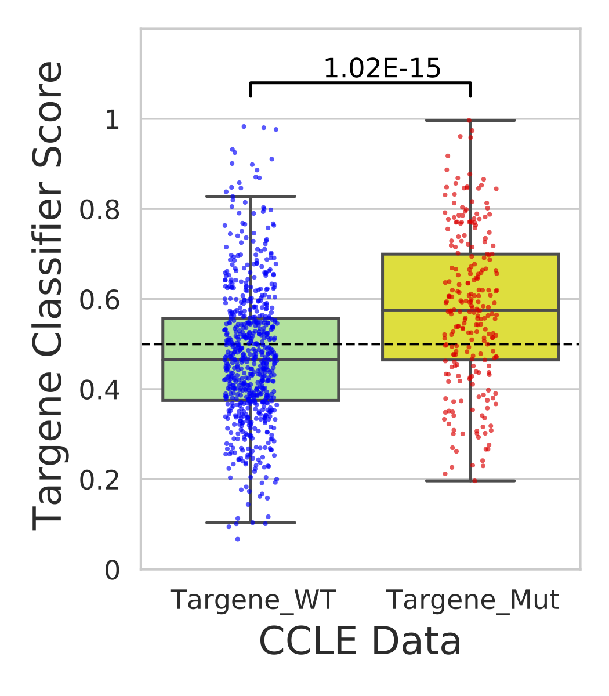
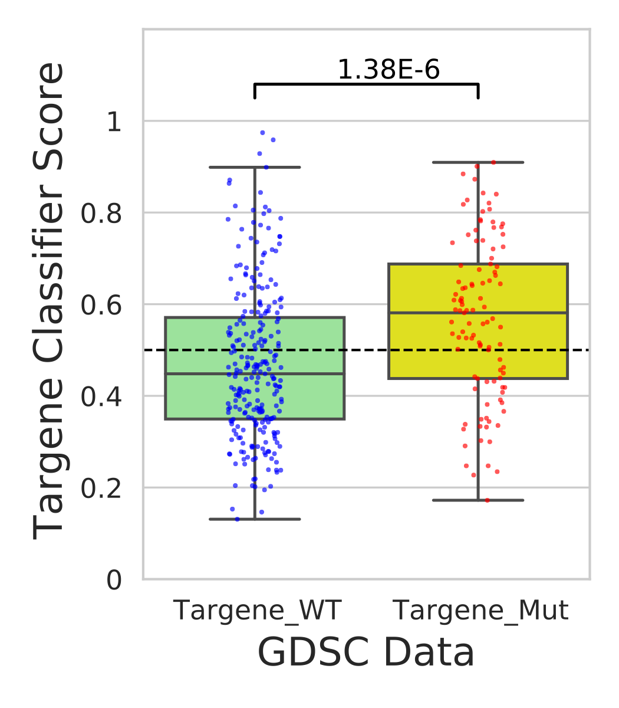

# Introduction


Signaling pathways are among the most commonly altered across different tumor types. Many tumors possess at least one driver alteration and nearly half of such alterations are potentially targeted by currently available drugs. A recent study in TCGA tumors has identified patterns of somatic variations and mechanisms in 10 canonical pathways
(). One-third of these tumors possess multiple alterations and have potentially complex phenotypes. Identifying a transcriptomic signature in these tumors would enable personalized therapeutic design strategies. A plethora of evidence suggests complex diseases, like cancer, can be the result of multiple genetic aberrations in biological networks or pathways rather than variation in a single gene. Often starter mutations occur in a key component network that ultimately leads to multi-gene dysregulation causing hallmark cancer phenotypes (). Many of these phenotypes are the result of disrupted transcriptional programs that affect the clinical progression and therapeutic responsiveness. Recent progress in exploring these transcriptomic changes in cancer pathogenesis provided useful clues in precision medicine ().

The RTK/RAS/PI3K molecular genetic axis controls critical cellular functions and is commonly altered in various cancers (). Perturbations across this axis can lead to deficiencies in cell-cycle, survival, metabolism, motility and genome stability, triggering hallmark phenotypes of cancer. The constitutive activation and presence of phosphatidylinositol-3,4,5-trisphosphate (PIP3) trigger membrane-bound onco-signalosomes. This presents significant challenges for treatment, as PI3K cascade can be activated in several ways ().

Cancer driver genes comprising both oncogenes (OG) and Tumor suppressor genes (TSG) share common phenotypical outcome. However, they often have divergent molecular mechanisms  that drive the outcome. We are interested in capturing mutational specific differential transcriptional outcome among OG and TSG. In Figure 1, genes in red are oncogenes (have activating or copy gain) and genes in blue are tumor suppressor genes (have inactivating or copy loss).

In this tutorial we plan to measure aberrant PI3K pathway activity in TCGA dataset using RNA-Seq information and mutational and copy number information of following frequently altered genes. We named this tutorial as PanCancer Aberrant Pathway Activity Analysis (PAPAA).

, blue text indicates Tumor suppressors genes (TSG).")

> <agenda-title></agenda-title>
>
> Let's learn how to install this tutorial using Docker with galaxy, and how to download the datasets from Zenodo :
>
> 1. TOC
> {:toc}
>
{: .agenda}

# **Pre-installed tutorial tools, datasets and workflows from the docker image**
> An efficient way to install and run the tutorial using papaa tools is available on docker based galaxy instance that has pre-installed papaa tool-suite as **papaa** under tools section. Additionally this local galaxy instance comes with datasets and workflow for generating PI3K_OG classifier. Instructions to run the docker image is below.

> <hands-on-title>Tutorial for galaxy docker container installation and running the workflow:</hands-on-title>
> 1. Pulling the docker image from docker hub: Open a terminal and type the following command:
>       ```docker pull nvk747/galaxy_papaa:0.1.9```
> 2. For running the docker container use the following command :
>       ```docker run -p 8888:80 --detach nvk747/galaxy_papaa:0.1.9```
> 3. Open the following [*http://localhost:8888*](http://localhost:8888) in your web browser.
> 4. Use *'admin'* as username and *'password'* as password to login as **admin** into the docker galaxy instance.
> 5. The Workflow **'papaa@0.1.9_PI3K_OG_model_tutorial'** from workflow section to run PI3K_OG tutorial is pre-installed.
> 6. Instructions to get datasets from shared library is given in Hands-on: Data upload.
{: .hands_on}

# Get data for analysis from classifier to pharmacological correlations

> <hands-on-title>Data upload</hands-on-title>
>
> 1. Create a new history for this tutorial
> 2. Import the files from [PAPAA-Zenodo](https://zenodo.org/record/4306639#.X9FJF-lKgZE) or from the docker galaxy `Shared Data -> Data Libraries -> (GTN - Material -> {{ page.topic_name }} -> {{ page.title }} )`
>
>    ```
>    https://zenodo.org/api/files/9c1a32d0-dba1-4481-ad9f-1aac03c83e61/CCLE_DepMap_18Q1_maf_20180207.txt.gz
>    https://zenodo.org/api/files/9c1a32d0-dba1-4481-ad9f-1aac03c83e61/CCLE_MUT_CNA_AMP_DEL_binary_Revealer.tsv.gz
>    https://zenodo.org/api/files/9c1a32d0-dba1-4481-ad9f-1aac03c83e61/ccle_rnaseq_genes_rpkm_20180929_mod.tsv.gz
>    https://zenodo.org/api/files/9c1a32d0-dba1-4481-ad9f-1aac03c83e61/compounds_of_interest.txt
>    https://zenodo.org/api/files/9c1a32d0-dba1-4481-ad9f-1aac03c83e61/copy_number_gain_status.tsv.gz
>    https://zenodo.org/api/files/9c1a32d0-dba1-4481-ad9f-1aac03c83e61/copy_number_loss_status.tsv.gz
>    https://zenodo.org/api/files/9c1a32d0-dba1-4481-ad9f-1aac03c83e61/cosmic_cancer_classification.tsv
>    https://zenodo.org/api/files/9c1a32d0-dba1-4481-ad9f-1aac03c83e61/gdsc1_ccle_pharm_fitted_dose_data.txt.gz
>    https://zenodo.org/api/files/9c1a32d0-dba1-4481-ad9f-1aac03c83e61/gdsc2_ccle_pharm_fitted_dose_data.txt.gz
>    https://zenodo.org/api/files/9c1a32d0-dba1-4481-ad9f-1aac03c83e61/GDSC_CCLE_common_mut_cnv_binary.tsv.gz
>    https://zenodo.org/api/files/9c1a32d0-dba1-4481-ad9f-1aac03c83e61/GDSC_EXP_CCLE_converted_name.tsv.gz
>    https://zenodo.org/api/files/9c1a32d0-dba1-4481-ad9f-1aac03c83e61/GSE69822_pi3k_sign.txt
>    https://zenodo.org/api/files/9c1a32d0-dba1-4481-ad9f-1aac03c83e61/GSE69822_pi3k_trans.csv
>    https://zenodo.org/api/files/9c1a32d0-dba1-4481-ad9f-1aac03c83e61/path_rtk_ras_pi3k_genes.txt
>    https://zenodo.org/api/files/9c1a32d0-dba1-4481-ad9f-1aac03c83e61/mc3.v0.2.8.PUBLIC.maf.gz
>    https://zenodo.org/api/files/9c1a32d0-dba1-4481-ad9f-1aac03c83e61/mutation_burden_freeze.tsv
>    https://zenodo.org/api/files/9c1a32d0-dba1-4481-ad9f-1aac03c83e61/pancan_mutation_freeze.tsv.gz
>    https://zenodo.org/api/files/9c1a32d0-dba1-4481-ad9f-1aac03c83e61/pancan_rnaseq_freeze.tsv.gz
>    https://zenodo.org/api/files/9c1a32d0-dba1-4481-ad9f-1aac03c83e61/sample_freeze.tsv
>    https://zenodo.org/api/files/9c1a32d0-dba1-4481-ad9f-1aac03c83e61/tcga_dictionary.tsv
>    ```
{: .hands_on}

> <hands-on-title>Some additional files that you can use for alternative analysis</hands-on-title>
> 1. These files are provided to optionally enable you to perform an additional analysis, using the same methodology
>    described here, but are not required for the main tutorial.
> 2. Import the files from [PAPAA-Zenodo](https://zenodo.org/record/4306639#.X9FJF-lKgZE) or from the docker galaxy `Shared Data -> Data Libraries -> (GTN - Material -> {{ page.topic_name }} -> {{ page.title }} )`
>
>    ```
>    https://zenodo.org/api/files/9c1a32d0-dba1-4481-ad9f-1aac03c83e61/GSE94937_kras_sign.txt
>    https://zenodo.org/api/files/9c1a32d0-dba1-4481-ad9f-1aac03c83e61/GSE94937_rpkm_kras.csv
>    https://zenodo.org/api/files/9c1a32d0-dba1-4481-ad9f-1aac03c83e61/path_cell_cycle_genes.txt
>    https://zenodo.org/api/files/9c1a32d0-dba1-4481-ad9f-1aac03c83e61/path_myc_genes.txt
>    https://zenodo.org/api/files/9c1a32d0-dba1-4481-ad9f-1aac03c83e61/path_ras_genes.txt
>    https://zenodo.org/api/files/9c1a32d0-dba1-4481-ad9f-1aac03c83e61/path_wnt_genes.txt
>    ```
{: .hands_on}

> <comment-title>Note:</comment-title>
> Some of the imported files may still contain a **.gz** extension but only uncompressed files are used in our analysis. So kindly ignore the extension!!
{: .comment}

> <details-title>Datasets descriptions</details-title>
>
-    **pancan_rnaseq_freeze.tsv:** Publicly available gene expression data for the TCGA Pan-cancer dataset. This file has gene-expression data for ~20,000 genes (columns) in ~10,000 samples (rows).
-    **pancan_mutation_freeze.tsv:** Publicly available Mutational information for TCGA Pan-cancer dataset. This file has mutational data for all genes (columns) as binary valued (0/1) in all samples (rows).
-    **mutation_burden_freeze.tsv:** Publicly available Mutational information for TCGA Pan-cancer dataset. This file has mutational burden information for all samples(rows).
-    **sample_freeze.tsv:** The file lists the frozen samples as determined by TCGA PanCancer Atlas consortium along with raw RNA-Seq and mutation data. These were previously determined and included for all downstream analysis All other datasets were processed and subset according to the frozen samples.
-    **cosmic_cancer_classification.tsv:** Compendium of OG and TSG used for the analysis. This file has list of cancer genes(rows) from [cosmic database](https://cancer.sanger.ac.uk/cosmic) classified as Oncogene or tumor suppressor (columns).
-    **CCLE_DepMap_18Q1_maf_20180207.txt:** Publicly available Mutational data for CCLE cell lines from Broad Institute Cancer Cell Line Encyclopedia [CCLE](https://portals.broadinstitute.org/ccle)/[DepMap Portal](https://depmap.org/portal/). Variant classification along with nucleotide and protein level changes are provided in the columns for genes(rows).
-    **ccle_rnaseq_genes_rpkm_20180929_mod.tsv:** Publicly available Expression data for 1,019 cell lines (RPKM) from Broad Institute Cancer Cell Line Encyclopedia (CCLE) / DepMap Portal. This file has gene-expression data for genes(rows) in various cell lines (columns).
-    **CCLE_MUT_CNA_AMP_DEL_binary_Revealer.tsv:** Publicly available merged Mutational and copy number alterations that include gene amplifications and deletions for the CCLE cell lines. This file has mutational/copy number variation data for all cancer genes (rows) as binary valued (0/1) in all CCLE cell lines (columns).
-    **GDSC_cell_lines_EXP_CCLE_names.tsv:** Publicly available RMA normalized expression data for Genomics of Drug Sensitivity in Cancer [GDSC](https://www.cancerrxgene.org/) cell-lines. This data was subset to 382 cell lines that are common among CCLE and GDSC. This file has gene-expression data for genes(rows) in various cell lines (columns).
-    **GDSC_CCLE_common_mut_cnv_binary.tsv:** A subset of merged Mutational and copy number alterations that include gene amplifications and deletions for common cell lines between GDSC and CCLE.
-    **gdsc1_ccle_pharm_fitted_dose_data.txt:** Pharmacological data for GDSC-1 cell lines. This data was subset to 379 cell lines that are common among CCLE and GDSC. This file has pharmacological data like IC50, Z-scores, drug information, concentrations used, AUC(columns) of 304 tested compounds in various cell-lines(rows).
-    **gdsc2_ccle_pharm_fitted_dose_data.txt:** Pharmacological data for GDSC-2 cell lines. This data was subset to 347 cell lines that are common among CCLE and GDSC. This file has pharmacological data like IC50, Z-scores, drug information, concentrations used, AUC(columns) of 170 tested compounds in various cell-lines(rows).
-    **compounds_of_interest.txt:** This file contains the compounds of interest for generation of pharmacological correlations with classifier scores. List of inhibitor compounds against EGFR-signaling, ERK-MAPK-signaling, Other-kinases, PI3K/MTOR-signaling, and RTK-signaling pathways.
-    **tcga_dictonary.tsv:** List of cancer types used in the analysis.
-    **GSE69822_pi3k_sign.txt:** File with values assigned for tumor [1] or normal [-1] for external data samples deposited in Gene Expression Omnibus database accession:[GSE69822](https://www.ncbi.nlm.nih.gov/geo/query/acc.cgi?acc=GSE69822).
-    **GSE69822_pi3k_trans.csv:** Variant stabilized transformed values for the RNA expression levels in the external samples from [GSE69822](https://www.ncbi.nlm.nih.gov/geo/query/acc.cgi?acc=GSE69822).
-    **path_rtk_ras_pi3k_genes.txt:** List of genes belong to RTK,RAS,PI3K used in our study.
-    **path_myc_genes.txt:** List of genes belong to Myc signaling pathway [Sanchez Vega et.al 2018](https://www.cell.com/action/showPdf?pii=S0092-8674%2818%2930359-3).
-    **path_ras_genes.txt:** List of genes belong to Ras signaling Pathway [Sanchez Vega et.al 2018](https://www.cell.com/action/showPdf?pii=S0092-8674%2818%2930359-3).
-    **path_cell_cycle_genes.txt:** List of genes belong to cell cycle pathway [Sanchez Vega et.al 2018](https://www.cell.com/action/showPdf?pii=S0092-8674%2818%2930359-3).
-    **path_wnt_genes.txt:** List of genes belong to wnt signaling pathway [Sanchez Vega et.al 2018](https://www.cell.com/action/showPdf?pii=S0092-8674%2818%2930359-3).
-    **GSE94937_rpkm_kras.csv:** RNA expression levels in the external samples from [GSE94937](https://www.ncbi.nlm.nih.gov/geo/query/acc.cgi?acc=GSE94937).
-    **GSE94937_kras_sign.txt:** File with values assigned for tumor [1] or normal [-1] for external data samples deposited in Gene Expression Omnibus database accession: [GSE94937](https://www.ncbi.nlm.nih.gov/geo/query/acc.cgi?acc=GSE94937).
{:.details}

# PanCancer aberrant pathway activity analysis (PAPAA)

[Machine Learning](https://en.wikipedia.org/wiki/Machine_learning) algorithms  learn from various features in datasets and generate predictive models. Extracting transcriptional patterns and learning insights of tumor physiology from gene expression data is a developing research area. Transcriptional profiling was used to identify differentially expressed genes and pathways associated with drug resistance in breast cancer (). Hyperactive oncogenic pathway  signatures can be useful in predicting sensitivity to therapeutic agents (). Machine learning-based modeling provides a systematic manner to leverage these multi-omic data to predict phenotype or stratify tumors based on gene expression and pathway variations. We extended a previously developed elastic net penalized logistic regression classification modeling approach to derive transcription signature or pathway alterations to measure aberrant PI3K activity in the PanCancer data (). This method integrates bulk RNA Sequencing (RNA-Seq), copy number and mutation data from [PanCanAtlas](https://gdc.cancer.gov/about-data/publications/pancanatlas).

TCGA Pancancer has uniformly processed multi-omic data including RNA-Seq, copy number and mutational data. It covers 33 different cancer types and having information from over 10000 samples. We used publicly available RNA-Seq, mutation and CNV data sets from TCGA. Description and processing details of these data sets are listed at this site: [PanCancer aberrant pathway activity analysis](https://github.com/nvk747/papaa.git).

***Machine learning methodology***
Logistic regression is a kind of machine learning approach where statistical analysis is used to predict the outcome of a dependent variable based on observed changes in other variables. e.g. Changes in gene expression are directly connected to alterations/mutations in genes. We used above approach to predict mutational status given the gene expression. Optimizing to the above prediction of mutational status with gene expression variable, we used elastic net penalty with gradient descent algorithm is used to find the optimal cost function by going over a number of iterations. The objective of the classifier is to determine the probability a given sample (*i*) has a aberrant gene event given the sample’s RNA-Seq measurements (*Xi*). In order to achieve the objective, the classifier learns a vector of coefficients or gene-specific weights (*w*) that optimize the following penalized logistic function.

 from expression data X(i) for each sample. Mutational status can be estimated by Multiplying Xi with gene specific weights (W). The negative log likelihood (L) is used for calculating minimum weights for each sample")

Where *alpha* and *l* are regularization and elastic net mixing hyperparameters respectively. Their optimal values are found during 5 fold cross validation by using scikit-learn [girdsearchCV](https://scikit-learn.org/0.17/modules/generated/sklearn.grid_search.GridSearchCV.html) approach.

***Sample Processing step:***

- **x-matrix:**
  > Gene-expression data comprises of expression levels for ~20,000 genes/sample and ~10,000 samples. Top 8,000 highly variable genes per sample with in each disease were measured by median absolute deviation (MAD) and considered for analysis.

- **y-matrix:**
  > Copy number and mutational data as binary valued (0/1) datasets for all samples. This matrix is subset to given pathway target genes and cancer types.

We then randomly held out 10% of the samples to create a test set and rest 90% for training.  The testing set is used as the validation to evaluate the performance of any machine learning algorithm and the remaining parts are used for learning/training. The training set is balanced for different cancer-types and PI3K status.

Predicting probabilities of an observation belonging to each class in a classification problem is more flexible rather than predicting classes directly. This method has an added advantage to trade-off errors made by the model as it depends on interpretation of probabilities using different thresholds. Two diagnostic tools that help in the interpretation of probabilistic forecast for binary (two-class) classification predictive modeling problems are Receiver Operating Characteristic (ROC) Curves and Precision-Recall curves. Each model generated is evaluated and performance metrics are measured using Area Under the Receiver Operating Characteristic (AUROC) and Area Under the Precision-Recall (AUPR).

As elastic net penalty with stochastic decent gradient approach induces sparsity in the number of features used in classification, and the best/top features (genes) are likely to represent transcriptional signature of given disease or aberrant activity of the mutated genes in a pathway.

Each feature (gene) is given a rank and score (negative or positive) depending on its contribution to classification. The positive scored genes are likely to be up-regulated in activated pathway samples and negatively scored genes are likely to be downstream targets of altered pathways.

In this tutorial, we made series of steps to generate classification models and used those models for predicting pharmacological response or identifying potential biomarkers that may be helpful for treatment of various cancers. Here, we generate models using [ERBB2](https://www.genecards.org/cgi-bin/carddisp.pl?gene=ERBB2), [KRAS](https://www.genecards.org/cgi-bin/carddisp.pl?gene=KRAS), [PIK3CA](https://www.genecards.org/cgi-bin/carddisp.pl?gene=PIK3CA), and [AKT1](https://www.genecards.org/cgi-bin/carddisp.pl?gene=AKT1) oncogenes from the ERK/RAS/PI3K signaling axis pathway.  **Have fun!**

## PAPAA: PanCancer classifier
This first step is designed to generate model with ERK/RAS/PI3K signaling axis pathway genes (path_genes): ERBB2, KRAS, PIK3CA ,AKT11 genes and various the Cancer Genome Atlas (TCGA) cancer types/diseases: BLCA, BRCA, CESC, COAD, ESCA, LUAD, LUSC, OV, PRAD, READ, STAD, UCEC, and UCS (ref: tcga_dictionary.tsv). This step takes gene expression information (pancan_rnaseq_freeze.tsv), mutational information (pancan_mutation_freeze.tsv), load of mutations in each samples (mutation_burden_freeze.tsv), threshold passed sample information (sample_freeze.tsv) and copy number information (copy_number_loss_status.tsv & copy_number_gain_status.tsv) and generates PI3K_OG model. AUROC and AUPR metrics are calculated for training,test,CV and random shuffled sets. As an additional option, the generated model was used to evaluate alternative genes (PTEN, PIK3R1, and STK11) and alternative diseases (BRCA, COAD, ESCA, HNSC, LGG, LUAD, LUSC, PRAD, READ, GBM, UCEC, and UCS) performance.




> <hands-on-title>Generating model from ERBB2,PIK3CA,KRAS,AKT1 genes with specific disease types</hands-on-title>
>
> 1.  with the following parameters:
>    -  *"Filename of features to use in model"*: `pancan_rnaseq_freeze.tsv` (Input dataset).
>    -  *"Filename mutations"*: `pancan_mutation_freeze.tsv` (Input dataset).
>    -  *"Filename of mutation burden"*: `mutation_burden_freeze.tsv` (Input dataset).
>    -  *"Filename of sample"*: `sample_freeze.tsv` (Input dataset) Input TCGA processed sample information data. See dataset descriptions for details.
>    -  *"Comma separated string of HUGO gene symbols"*: `ERBB2,PIK3CA,KRAS,AKT1` 
>    -  *"Comma sep string of TCGA disease acronyms. If no arguments are passed, filtering will default to options given in --filter_count and --filter_prop."*: `BLCA,BRCA,CESC,COAD,ESCA,LUAD,LUSC,OV,PRAD,READ,STAD,UCEC,UCS`
>    -  *"Supplement Y matrix with copy number events"*: `Yes` 
>    -  *"File with Copy number loss"*: `copy_number_loss_status.tsv` (Input dataset) 
>    -  *"File with Copy number gain"*: `copy_number_gain_status.tsv` (Input dataset) 
>    -  *"File with cancer gene classification table"*: `cosmic_cancer_classification.tsv` (Input dataset) 
>    -  *"alternative genes to test performance"*: `PTEN,PIK3R1,STK11` 
>    -  *"The alternative diseases to test performance"*: `BRCA,COAD,ESCA,HNSC,LGG,LUAD,LUSC,PRAD,READ,GBM,UCEC,UCS`
>    - *"Decision to drop input genes from X matrix"*: `Yes`
>    - *"Remove hypermutated samples"*: `Yes`
>    - *"Keep intermediate ROC values for plotting"*: `Yes`
>    - *"Shuffle the input gene exprs matrix alongside"*: `Yes` 
{: .hands_on}

> <details-title>PanCancer Aberrant Pathway Activity Analysis `pancancer_classifier.py` inputs</details-title>
>    - \--genes: Comma separated string of HUGO symbols for target genes or targenes_list.csv file
>    - \--diseases: Comma separated string of disease types/TCGA acronyms for classifier
>    - \--folds: Number of cross validation folds
>    - \--drop: Drop the input genes from the X matrix
>    - \--seed: Value specifies the initial value of the random number seed
>    - \--copy_number: Optional flag to supplement copy number to define Y
>    - \--filter_count: Integer number for minimum count of mutations to include per disease
>    - \--filter_prop: Floating value for minimum proportion of mutated samples per disease
>    - \--num_features: Integer number for genes to include in classifier
>    - \--alphas: Comma separated string of alphas to test in pipeline
>    - \--l1_ratios: Comma separated string of l1 parameters to test
>    - \--alt_genes: Comma separated string of alternative genes to test
>    - \--alt_diseases: Comma separated string of alternative diseases to test
>    - \--alt_filter_count: Integer number for minimum count of mutations to include per alt_diseases
>    - \--alt_filter_prop: Floating value for minimum proportion of mutated samples alt_disease
>    - \--alt_folder: String for location to save the classifier figures
>    - \--remove_hyper: Store_true: remove hypermutated samples
>    - \--keep_intermediate: Store_true: keep intermediate roc curve items
>    - \--x_matrix: File name of features gene expression matrix to use
>    - \--classifier_folder: String of the location to store classifier data
{: .details}

> <comment-title>Outputs</comment-title>
>    - Log file for script run and additional information
>    - A combined disease model (Pan-model) and individual disease models are generated.
>    - An overall model statistics are provided in the form of classifier summary: classifier_summary.txt
>    - Logistic regression with elastic net penalization outputs sparse classifiers with 150-250 genes whose scores or weights are important for classification tasks: classifier_coefficients.tsv . *Lets examine this file for the top scored genes. These genes are potential predictive biomarkers and can be helpful for precision medicine approaches*.
>    - A tabular output that includes each gene mutation and copy number counts per each targene and proportions in various diseases is listed: *summary_counts.csv*
>    - Heatmap for all the AUROC values at different alphas and L1 rations: cv_heatmap.pdf
>    - Disease classifier figures: list of 2 files [disease_pr and disease_auroc]
>    - This tool computes predictions, accuracy measurements and measures AUROC and AUPR curves for the combined disease model (Pan-model): *all_disease_pr.pdf ; pancan_roc_results.tsv ; all_disease_roc.pdf ; disease_aupr.pdf ; disease_auroc.pdf*
>    - Additionally, the output also includes above performance and prediction metrics when the pan-model applied to alternative genes and cancer types: *alt_gene_alt_disease_summary.tsv ; alt_summary_counts.csv ; alt_gene_alt_disease_aupr_bar.pdf ; alt_gene_alt_disease_auroc_bar.pdf* Examine these files to analyze our PI3K_OG model on other alternate diseases.
{: .comment}

## PanCancer within disease analysis
This step is designed to generate individual pan-within models for each individual disease. It takes the same inputs as first step and generates similar output for each individual disease.

> <hands-on-title>Generating models for individual diseases listed for ERBB2,PIK3CA,KRAS,AKT1</hands-on-title>
>
> 1.  with the following parameters:
>    -  *"Filename of features to use in model"*: `pancan_rnaseq_freeze.tsv` (Input dataset)
>    -  *"Filename mutations"*: `pancan_mutation_freeze.tsv` (Input dataset)
>    -  *"Filename of mutation burden"*: `mutation_burden_freeze.tsv` (Input dataset)
>    -  *"Filename of sample"*: `sample_freeze.tsv` (Input dataset)
>    - *"Comma separated string of HUGO gene symbols"*: `ERBB2,PIK3CA,KRAS,AKT1`
>    - *"Comma sep string of TCGA disease acronyms. If no arguments are passed, filtering will default to options given in --filter_count and --filter_prop."*: `BLCA,BRCA,CESC,COAD,ESCA,LUAD,LUSC,OV,PRAD,READ,STAD,UCEC,UCS`
>    -  *"File with Copy number loss"*: `copy_number_loss_status.tsv` (Input dataset)
>    -  *"File with Copy number gain"*: `copy_number_gain_status.tsv` (Input dataset)
>    -  *"File with cancer gene classification table"*: `cosmic_cancer_classification.tsv` (Input dataset)
>    - *"Remove hypermutated samples"*: `Yes`
{: .hands_on}

> <details-title>PanCancer Aberrant Pathway Activity Analysis `within_disease_analysis.py` inputs</details-title>
>    - \--genes: Comma separated string of HUGO symbols for target genes or targenes_list.csv file
>    - \--diseases: Comma separated string of disease types/TCGA acronyms for classifier
>    - \--alphas: Comma separated string of alphas to test in pipeline
>    - \--l1_ratios: Comma separated string of l1 parameters to test
>    - \--remove_hyper: Remove hypermutated samples
>    - \--alt_folder: String of location to classification folder extending to individual diseases
>    - \--x_matrix: File name of features gene expression matrix to use in the model
>    - \--filename_mut: Filename of sample/gene mutations to use in model
>    - \--filename_mut_burden: Filename of sample mutation burden to use in model
>    - \--filename_sample: Filename of patient/samples to use in model
>    - \--filename_copy_loss: Filename of copy number loss
>    - \--filename_copy_gain: Filename of copy number gain
>    - \--filename_cancer_gene_classification: Filename of cancer gene classification table
{: .details}

> <comment-title>Outputs</comment-title>
> This tool creates individual classifiers from each of the diseases specified to generate the full or pan model. Each of the classifiers has a similar output as specified for the pan-cancer classifier. The within models are trained using the same combination of targenes but considering only one disease for training and testing.
>    - Log file for script run and additional information
>    - list of classifier_summary.txt for each disease
>    - list of classifier_coefficients.tsv for each disease
>    - list of pancan_roc_results.tsv for each disease
>    - list of summary_counts.csv for each disease
>    - Within disease figures:  List of 5 files [all_disease_pr, all_disease_roc, cv_heatmap, disease_pr, disease_roc] for individual diseases
>    - Disease classifier figures: list of 2 files [disease_pr disease_roc] for each disease
{: .comment}

## PanCancer compare within models
we next do a performance comparison between the ERBB2,PIK3CA,KRAS,AKT1 pan model and individual models.


> <hands-on-title>compare the ERBB2_PIK3CA_KRAS_AKT1 pan model with individual disease models</hands-on-title>
>
> 1.  with the following parameters:
>    -  *"pancancer classifier summary"*: `classifier_summary.txt` (output of **PAPAA: PanCancer classifier** )
>    -  *"pancancer classifier coefficients"*: `classifier_coefficients.tsv` (output of **PAPAA: Pancancer classifier** )
>    -  *"pan_within classifier summary"*: `classifier_summary` (output of **PAPAA: PanCancer within disease analysis** )(Note: Select all pan-within classifier summaries as dataset collection instead of multiple datasets)
>    -  *"pan_within classifier coefficients"*: `classifier_coefficients` (output of **PAPAA: Pancancer within disease analysis** ) (Note: Select all pan-within classifier coefficients as dataset collection instead of multiple datasets)
>    - *"Would you want to compare given model with alt gene model?"*: `do not do alt gene`
{: .hands_on}

> <details-title>PanCancer Aberrant Pathway Activity Analysis `compare_within_models.R` inputs</details-title>
>    - \--pancan_model: location of pan and pan-within-disease models classifier_summary.txt/s and classifier_coefficients.tsv/s dataset collections.
>    - \--alt_model: location of alt and alt-within-disease models classifier_summary.txt/s and classifier_coefficients.tsv/s dataset collections.
{: .details}

> <comment-title>Outputs</comment-title>
>    - Comparison plots for Pan and Pan_within models ("auroc_comparison.pdf" and "aupr_comparison.pdf")
>    - Comparison plots for altgene, alt_within, Pan_alt models ("alt_gene_auroc_comparison.pdf" and "alt_gene_aupr_comparison.pdf")
{: .comment}

## PanCancer apply weights
In this step we would like to predict 'y' status (mutational status) using 'x' matrix (gene expression). We subset the x matrix to top variable genes (determined by Median Absolute Deviation), scaling the expression and adding covariate information. A logit transformation will be applied to output probabilities and classifier decisions.

> <hands-on-title>Apply weights for ERBB2_PIK3CA_KRAS_AKT1 model</hands-on-title>
>
> 1.  with the following parameters:
>    -  *"Filename of features to use in model"*: `pancan_rnaseq_freeze.tsv` (Input dataset)
>    -  *"Filename mutations"*: `pancan_mutation_freeze.tsv` (Input dataset)
>    -  *"Filename of mutation burden"*: `mutation_burden_freeze.tsv` (Input dataset)
>    -  *"Filename of sample"*: `sample_freeze.tsv` (Input dataset)
>    - *"Supplement Y matrix with copy number events"*: `Yes`
>    -  *"File with Copy number loss"*: `copy_number_loss_status.tsv` (Input dataset)
>    -  *"File with Copy number gain"*: `copy_number_gain_status.tsv` (Input dataset)
>    -  *"File with cancer gene classification table"*: `cosmic_cancer_classification.tsv` (Input dataset)
>    -  *"pancancer classifier summary"*: `classifier_summary` (output of **PAPAA: PanCancer classifier** )
>    -  *"pancancer classifier coefficients"*: `classifier_coefficients` (output of **PAPAA: PanCancer classifier** )
{: .hands_on}

> <details-title>PanCancer Aberrant Pathway Activity Analysis `apply_weights.py` inputs</details-title>
>    - \--classifier_summary: String of the location of classifier_summary.txt file
>    - \--copy_number: Supplement Y matrix with copy number events
>    - \--x_matrix: Filename of gene expression features to use in model
>    - \--filename_mut: Filename of sample/gene mutations to use in model
>    - \--filename_mut_burden: Filename of sample mutation burden to use in model
>    - \--filename_sample: Filename of patient/samples to use in model
>    - \--filename_copy_loss: Filename of copy number loss
>    - \--filename_copy_gain: Filename of copy number gain
>    - \--filename_cancer_gene_classification: Filename of cancer gene classification table
{: .details}

> <comment-title>Outputs</comment-title>
>    - Apply a logit transform on expression values (y = 1/(1+e^(-wX))) to output mutational probabilities. Generates "classifier_decisions.tsv" file which has scores/probabilities and other covariate information.  The scores/probabilities will be used for gene ranking and variant specific classification.
>    - Log file for script run and additional information
{: .comment}

## PanCancer visualize decisions
In this step we generate visualization plots using classifier decision function for samples in each individual disease, total decisions for all samples in all diseases, and hypermutated samples in all diseases.


> <hands-on-title>Visualize decisions for ERBB2_PIK3CA_KRAS_AKT1 model</hands-on-title>
>
> 1.  with the following parameters:
>    -  *"pancancer decisions"*: `classifier_decisions` (output of **PAPAA: PanCancer apply weights** )
{: .hands_on}

> <details-title>PanCancer Aberrant Pathway Activity Analysis `visualize_decisions.py` inputs</details-title>
>    - \--classifier_decisions: String of the folder location of classifier_decisions.tsv
>    - \--custom: Comma separated list of columns to plot
>    (optional: True)
{: .details}

> <comment-title>Outputs</comment-title>
>    - Log file for script run and additional information
>    - Visualize decision function for all samples ("total_decisions.pdf")
>    - Plot disease type specific decision functions ("decision_plot_{}.pdf")
>    - Visualize decision function for hyper mutated tumors ("hyper_mutated.pdf")
{: .comment}

## PanCancer map mutation class
In this step we combined variant level information for each mutation combining with classifier predictions.

> <hands-on-title>map mutation class for ERBB2_PIK3CA_KRAS_AKT1 model</hands-on-title>
>
> 1.  with the following parameters:
>    -  *"pancancer decisions"*: `classifier_decisions.tsv` (output of **PAPAA: PanCancer apply weights** )
>    -  *"string of the genes to extract or gene list file"*: `path_rtk_ras_pi3k_genes.txt` (Input dataset)
>    - *"Supplement Y matrix with copy number events"*: `Yes`
>    -  *"File with Copy number loss"*: `copy_number_loss_status.tsv` (Input dataset)
>    -  *"File with Copy number gain"*: `copy_number_gain_status.tsv` (Input dataset)
>    -  *"Filename of raw mut MAF"*: `mc3.v0.2.8.PUBLIC.maf` (Input dataset)
{: .hands_on}

> <details-title>PanCancer Aberrant Pathway Activity Analysis `map_mutation_class.py` inputs</details-title>
>    - \--classifier_decisions: String of the location of folder containing classifier_decisions.tsv
>    - \--path_genes: Comma separated string of HUGO symbols for all genes in the pathway or Pathway genes list file
>    - \--filename_copy_loss: Filename of copy number loss
>    - \--filename_copy_gain: Filename of copy number gain
>    - \--filename_raw_mut: Filename of raw mut MAF
{: .details}

> <comment-title>Outputs</comment-title>
>    - Merge per sample classifier scores with mutation types present in each sample and generate "mutation_classification_scores.tsv" file
>    - Log file for script run and additional information
{: .comment}

## PanCancer alternative genes pathwaymapper
In this step we combine classifier weights, copy number information, recalculate metrics for positive samples, visualize distribution for AUROC and AUPR for all genes and metrics for each gene.

> <hands-on-title>alternative genes pathway mapper for ERBB2_PIK3CA_KRAS_AKT1 model</hands-on-title>
>
> 1.  with the following parameters:
>    -  *"pancancer decisions"*: `classifier_decisions.tsv` (output of **PAPAA: PanCancer apply weights** )
>    - *"Comma separated string of HUGO gene symbols"*: `ERBB2,PIK3CA,KRAS,AKT1`
>    -  *"string of the genes to extract or gene list file"*: `path_rtk_ras_pi3k_genes.txt` (Input dataset)
>    -  *"Filename mutations"*: `pancan_mutation_freeze.tsv ` (Input dataset)
>    -  *"Filename of sample"*: `sample_freeze.tsv` (Input dataset)
>    - *"Supplement Y matrix with copy number events"*: `Yes`
>    -  *"File with Copy number loss"*: `copy_number_loss_status.tsv` (Input dataset)
>    -  *"File with Copy number gain"*: `copy_number_gain_status.tsv` (Input dataset)
{: .hands_on}

> <details-title>PanCancer Aberrant Pathway Activity Analysis `targene_alternative_genes_pathwaymapper.py` inputs</details-title>
>    - \--genes: Comma separated string of HUGO symbols for target genes or targenes_list.csv file
>    - \--path_genes: Comma separated string of HUGO symbols for all genes in the target pathway or path_genes.csv file
>    - \--classifier_decisions: String of the location of classifier scores/alt_folder
>    - \--filename_mut: Filename of sample/gene mutations to use in model
>    - \--filename_mut_burden: Filename of sample mutation burden to use in model
>    - \--filename_sample: Filename of patient/samples to use in model
>    - \--filename_copy_loss: Filename of copy number loss
>    - \--filename_copy_gain: Filename of copy number gain
{: .details}

> <comment-title>Outputs</comment-title>
>    - Calculate and display pathway metrics ("pathway_metrics_pathwaymapper.txt")
>    - Visualize Distribution of AUROC and AUPRC for all genes and Get Metrics for All Genes ("all_gene_metric_ranks.tsv")
>    - Log file for script run and additional information
{: .comment}

## PanCancer pathway count heatmaps
This step generates combined heatmap from mutation and copy number information and summarizes mutation, copy and total counts per sample for all the genes in target pathway.
 for all genes in the target pathway with in each cancer type")

> <hands-on-title>Heatmaps for ERBB2_PIK3CA_KRAS_AKT1 model</hands-on-title>
>
> 1.  with the following parameters:
>    -  *"pancancer decisions"*: `classifier_decisions.tsv` (output of **PAPAA: PanCancer apply weights** )
>    -  *"pancancer metrics pathwaymapper"*: `pathway_metrics_pathwaymapper.txt` (output of **PAPAA: PanCancer alternative genes pathwaymapper** )
>    -  *"pancancer gene metric ranks"*: `all_gene_metric_ranks.tsv` (output of **PAPAA: PanCancer alternative genes pathwaymapper** )
>    - *"Comma separated string of HUGO gene symbols"*: `ERBB2,PIK3CA,KRAS,AKT1`
>    -  *"String of the pathway genes to extract"*: `path_rtk_ras_pi3k_genes.txt` (Input dataset)
>    -  *"Filename of features to use in model"*: `pancan_rnaseq_freeze.tsv.gz` (Input dataset)
>    -  *"Filename mutations"*: `pancan_mutation_freeze.tsv` (Input dataset)
>    -  *"Filename of mutation burden"*: `mutation_burden_freeze.tsv` (Input dataset)
>    -  *"Filename of sample"*: `sample_freeze.tsv` (Input dataset)
>    -  *"File with Copy number loss"*: `copy_number_loss_status.tsv` (Input dataset)
>    -  *"File with Copy number gain"*: `copy_number_gain_status.tsv` (Input dataset)
>    -  *"File with cancer gene classification table"*: `cosmic_cancer_classification.tsv` (Input dataset)
{: .hands_on}

> <details-title>PanCancer Aberrant Pathway Activity Analysis `targene_pathway_count_heatmaps.py` inputs</details-title>
>    - \--genes: Comma separated string of HUGO symbols for target genes or targenes_list.csv file
>    - \--path_genes: Comma separated string of HUGO symbols for all genes in the target pathway or path_genes.csv file
>    - \--classifier_decisions: String of the location of classifier scores/alt_folder
>    - \--x_matrix: Filename of features to use in model
>    - \--filename_mut: Filename of sample/gene mutations to use in model
>    - \--filename_mut_burden: Filename of sample mutation burden to use in model
>    - \--filename_sample: Filename of patient/samples to use in model
>    - \--filename_copy_loss: Filename of copy number loss
>    - \--filename_copy_gain: Filename of copy number gain
>    - \--filename_cancer_gene_classification: Filename of cancer gene classification table
{: .details}

> <comment-title>Outputs</comment-title>
>    - Mutational count heatmap for all genes in the target pathway with in each cancer type (cancer_type_mutation_heatmap.pdf).
>    - Copy number count heatmap for all genes in the target pathway with in each cancer type (cancer_type_copy_number_heatmap.pdf).
>    - Combined count heatmap for all genes in the target pathway with in each cancer type (cancer_type_combined_total_heatmap.pdf).
>    - Calculates Mutations and copy number percentages of the genes in the and generates "pathway_mapper_percentages.txt" file.
>    - Summarizes mutation, copy, and total counts per sample by targene pathway and generates "path_events_per_sample.tsv" file
{: .comment}

## PanCancer targene summary figures
This step generates plots summarizing various analysis, including heatmaps for distribution of aberrant events across tumors, distribution of predictions at variant levels.

> <hands-on-title>Summary figures for ERBB2_PIK3CA_KRAS_AKT1 model</hands-on-title>
>
> 1.  with the following parameters:
>    -  *"Classifier data"*: `classifier_summary.txt` (output of **PAPAA: PanCancer classifier** )
>    -  *"pancancer classifier coefficients"*: `classifier_coefficients.tsv` (output of **PAPAA: PanCancer classifier** )
>    - *"option to set seed"*: `123`
>    -  *"summary counts"*: `summary_counts.csv` (output of **PAPAA: PanCancer classifier** )
>    -  *"mutation classification scores"*: `mutation_classification_scores.tsv` (output of **PAPAA: PanCancer map mutation class** )
>    -  *"path events per sample"*: `path_events_per_sample.tsv` (output of **PAPAA: PanCancer pathway count heatmaps** )
>    -  *"pancancer gene metric ranks"*: `all_gene_metric_ranks.tsv` (output of **PAPAA: PanCancer alternative genes pathwaymapper** )
{: .hands_on}

> <details-title>PanCancer Aberrant Pathway Activity Analysis `targene_summary_figures.R` inputs</details-title>
>    - \--classifier_summary: String of the location of classifier data
>    - \--seed: Value specifies the initial value of the random number seed
{: .details}

> <comment-title>Outputs</comment-title>
>    - Heatmap for mutation and gain proportions for the genes used in model across all the TCGA cancer types (all_targene_heatmap.pdf")
>    - Heatmap for total mutation and total gain proportions for the genes used in model across all the TCGA cancer types (targene_heatmap.pdf")
>    - Gene weights/Coefficients contributing to the model (targene_coef_plot.pdf)
>    - Plot distributions of predictions according to variant classification for OG and TSG ("variant_gain_fill_map.pdf" and "variant_loss_fill_map.pdf")
>    - Targene Summary Counts Distribution ("path_events_per_sample.tsv")
>    - Targene pathway events counts ("targene_pathway_events_counts.pdf")
>    - Performance Metrics Distribution across pathway members ("aupr_distribution.pdf" and "auroc_distribution.pdf")
>    - T-Test for AUPR between targene pathway genes and Other genes ("targene_pathway_variant_AUPR_ttest.txt")
>    - Log file for script run and additional information
>    - Extracting sample classifier scores for nucleotide level alterations in each sample and generate "nucleotide_mutation_scores.tsv" file
>    - Extracting sample classifier scores for amino-acid level alterations in each sample and generate "amino_acid_mutation_scores.tsv" file
{: .comment}

## PanCancer targene cell line predictions
In this step we use our classifier information and predict mutational status for various cell lines in CCLE and GDSC data sources.



> <hands-on-title>Analysis of CCLE and GDSC cell-lines using ERBB2_PIK3CA_KRAS_AKT1 model</hands-on-title>
>
> 1.  with the following parameters:
>    -  *"Classifier data"*: `classifier_summary.txt` (output of **PAPAA: PanCancer classifier** )
>    -  *"pancancer classifier coefficients"*: `classifier_coefficients.tsv` (output of **PAPAA: PanCancer classifier** )
>    -  *"nucleotide mutation scores"*: `nucleotide_acid_mutation_scores.tsv` (output of **PAPAA: PanCancer targene summary figures** )
>    -  *"amino acid mutation scores"*: `amino_acid_mutation_scores.tsv` (output of **PAPAA: PanCancer targene summary figures** )
>    - *"Comma separated string of HUGO targene symbols"*: `ERBB2_MUT,PIK3CA_MUT,KRAS_MUT,AKT1_MUT`
>    -  *"string of the genes to extract or gene list file"*: `path_rtk_ras_pi3k_genes.txt` (Input dataset)
>    -  *"Filename ccle rnaseq data"*: `ccle_rnaseq_genes_rpkm_20180929_mod.tsv` (Input dataset)
>    -  *"Filename ccle mutational data"*: `CCLE_MUT_CNA_AMP_DEL_binary_Revealer.gct` (Input dataset)
>    -  *"Filename ccle variant data"*: `CCLE_DepMap_18Q1_maf_20180207.txt` (Input dataset)
>    -  *"Filename gdsc rnaseq data"*: `GDSC_EXP_CCLE_converted_name.tsv` (Input dataset)
>    -  *"Filename gdsc mutational data"*: `GDSC_CCLE_common_mut_cnv_binary.tsv` (Input dataset)
>    -  *"Filename for gdsc1 pharmacological data file"*: `gdsc1_ccle_pharm_fitted_dose_data.txt` (Input dataset)
>    -  *"Filename for gdsc2 pharmacological data file"*: `gdsc2_ccle_pharm_fitted_dose_data.txt` (Input dataset)
{: .hands_on}

> <details-title>PanCancer Aberrant Pathway Activity Analysis `targene_cell_line_predictions.py` inputs</details-title>
>    - \--targenes: Comma separated string of HUGO symbols for target genes or targenes_list.csv file
>    - \--path_genes: Comma separated string of HUGO symbols for all genes in the target pathway or path_genes.csv file
>    - \--classifier_summary: String of the location of classifier_summary file
>    - \--ccle_rnaseq: Filename of CCLE gene expression data file
>    - \--ccle_mut: Filename of CCLE cell lines/gene mutations data file
>    - \--ccle_maf: Filename of CCLE mutational variant level data file
>    - \--gdsc_rnaseq: Filename of GDSC gene expression data file
>    - \--gdsc_mut: Filename of GDSC cell lines/gene mutations data file
>    - \--gdsc1_phar: Filename of GDSC1 pharmacological response data
>    - \--gdsc2_phar: Filename of GDSC2 pharmacological response data
{: .details}

> <comment-title>Outputs</comment-title>
>    - Generate predictions for CCLE data using targene classifier(ccle_histogram.png)
>    - Generate classifier scores for CCLE cell lines and combines CCLE mutational data and variant data with classifier scores (ccle_targene_classifier_scores.tsv).
>    - Performs t-test on classifier weights across targene mutant vs targene wild type cell-line groups(ccle_targene_WT_MUT_predictions.pdf)
>    - Add CCLE nucleotide scores at variant level and update nucleotide_mutation_scores.tsv (updated_Data_nucleotide_scores.csv)
>    - Add CCLE protein scores at variant level and update aminoacid_mutation_scores.tsv (updated_Data_aminoacid_scores.csv)
>    - Generate predictions for GDSC data using targene classifier(gdsc_scores_histogram.png)
>    - Generate classifier scores for GDSC cell lines and combines CCLE mutational data and variant data with classifier scores (gdsc_targene_classifier_scores.tsv).
>    - Performs t-test on classifier weights across targene mutant vs targene wild type cell-line groups(gdsc_targene_WT_MUT_predictions.pdf)
>    - Apply GDSC classifier scores to evaluate GDSC1 pharmacological data response (gdsc1_targene_pharmacology_predictions.tsv)
>    - Apply GDSC classifier scores to evaluate GDSC2 pharmacological data response (gdsc2_targene_pharmacology_predictions.tsv)
>    - Apply CCLE classifier scores to evaluate GDSC1 pharmacological data response (gdsc1_ccle_targene_pharmacology_predictions.tsv)
>    - Apply CCLE classifier scores to evaluate GDSC2 pharmacological data response (gdsc2_ccle_targene_pharmacology_predictions.tsv)
{: .comment}

## PanCancer external sample status prediction
In this step we use our classifier information and predict mutational status from external gene expression data. Gene expression data from [GSE69822](https://www.ncbi.nlm.nih.gov/geo/query/acc.cgi?acc=GSE69822), where MCF10a cell lines are either having PI3KCA/PTENKO mutation or WT/WT+A66 treated samples. Note WT+A66 is wild-type MCF10a cell line treated with A66 a potent PI3K inhibitor. A distribution plot is generated to see how many samples match to prediction. Samples with scores below 0.5 are considered WT and above 0.5 are considered mutant.
. The samples were either WT/WT+A66 (blue circles) or having a PIK3CA-H1074R/PTENKO mutation (orange circles).")

> <hands-on-title>external sample evaluation with ERBB2_PIK3CA_KRAS_AKT1 model</hands-on-title>
>
> 1.  with the following parameters:
>    -  *"Classifier data"*: `classifier_summary.txt` (output of **PAPAA: PanCancer classifier** )
>    -  *"pancancer classifier coefficients"*: `classifier_coefficients.tsv` (output of **PAPAA: PanCancer classifier** )
>    -  *"external sample gene expression data"*: `GSE69822_pi3k_trans.csv` (Input dataset)
>    -  *"given mutational status"*: `GSE69822_pi3k_sign.txt` (Input dataset)
{: .hands_on}

> <details-title>PanCancer Aberrant Pathway Activity Analysis `external_sample_pred_targene_classifier.py` inputs</details-title>
>    - \--classifier_summary: String of the location of classifier scores file
>    - \--expression_file: File path for external sample expression data file (fpkm/rpkm/rlog/vlog/nlog values)
>    - \--status_sign: Provide sign for tumor/mutant [1] or normal/WT [-1] along with sorted sample names
{: .details}

> <comment-title>Outputs</comment-title>
>    - Model based classification scores distribution Plots for external normal and tumor samples ("targene_external_sample_predictions.pdf and targene_external_sample_predictions_1.pdf")
>    - Log file for script run and additional information
{: .comment}


## PanCancer targene pharmacology
In this step we use the classifier derived cell line predictions and use them to evaluate pharmacological response of these cell lines. We plot log IC50 with classifier scores for each cell line and draw a correlation for drug response in absence or presence of targene mutations.

 values of Afatinib pharmacological response compared against PI3K_OG classifier scores of various cell lines. Cell lines with mutant (orange) or wild-type (blue) for ERBB2, KRAS, PIK3CA, AKT1 are indicated. The trend lines and p values are shown separately for wild-type or mutant cell lines. Cell lines treated with Afatinib, a known EGFR inhibitor.")

> <hands-on-title>GDSC1 and GDSC2 pharmacological analysis using ERBB2_PIK3CA_KRAS_AKT1 model</hands-on-title>
>    -  *"gdsc1 targene pharmacology predictions"*: `gdsc1_targene_pharmacology_predictions.tsv` (output of **PAPAA: PanCancer targene cell line predictions** )
>    -  *"gdsc2 targene pharmacology predictions"*: `gdsc2_targene_pharmacology_predictions.tsv` (output of **PAPAA: PanCancer targene cell line predictions** )
>    -  *"gdsc1 ccle targene pharmacology predictions"*: `gdsc1_ccle_targene_pharmacology_predictions.tsv` (output of **PAPAA: PanCancer targene cell line predictions** )
>    -  *"gdsc2 ccle targene pharmacology predictions"*: `gdsc2_ccle_targene_pharmacology_predictions.tsv` (output of **PAPAA: PanCancer targene cell line predictions** )
>    -  *"Filename list of compounds"*: `compounds_of_interest.txt` (Input dataset)
{: .hands_on}

> <details-title>PanCancer Aberrant Pathway Activity Analysis `targene_pharmacology.R` inputs</details-title>
>    - \--classifier_results: String of the location of classifier folder
>    - \--compound: Filename of list of pharmacological compounds for evaluation
{: .details}

> <comment-title>Outputs</comment-title>
>    - Scatter plots with visualizing drug response compared to GDSC targene classifier scores
>    for GDSC1 pharmacological dataset (GDSC1_targene_all_drug_response.pdf)
>    - Scatter plots with visualizing drug response compared to CCLE targene classifier scores
>    for GDSC1 pharmacological dataset (GDSC1_ccle_targene_all_drug_response.pdf)
>    - Scatter plots with visualizing drug response compared to GDSC targene classifier scores
>    for GDSC2 pharmacological dataset (GDSC2_targene_all_drug_response.pdf)
>    - Scatter plots with visualizing drug response compared to CCLE targene classifier scores
>    for GDSC2 pharmacological dataset (GDSC2_ccle_targene_all_drug_response.pdf)
{: .comment}

> <question-title>Tutorial Questions</question-title>
>
> 1. Can you build a classifier for tumor suppressor genes (TSG) combination in PI3K pathway?
> 2. How did the PI3K_TSG model performed compared to PI3K_OG?
>
> > <solution-title></solution-title>
> >
> > 1. Try building PI3K_TSG model using ([PTEN](https://www.genecards.org/cgi-bin/carddisp.pl?gene=PTEN),[PIK3R1](https://www.genecards.org/cgi-bin/carddisp.pl?gene=PIK3R1),[STK11](https://www.genecards.org/cgi-bin/carddisp.pl?gene=STK11) genes and BRCA,COAD,ESCA,HNSC,LGG,LUAD,LUSC,PRAD,READ,GBM, UCEC,UCS cancer-types). The PI3K_TSG model should show a very different transcriptomic signature compared to PI3K_OG model. We should see unique predictive biomarkers associated with tumors with TSG mutations. e.g. GYS1,CABC1,GLUD1,GRB7. This suggests that tumors with TSG mutations have different molecular paths although they have similar phenotypes compared to tumors with OG mutations.
> > 2. Check the AUROC and AUPR values. The PI3K_TSG model should show AUROC >82% and AUPR >68% accuracy during cross validations.
> >
> {: .solution}
>
{: .question}

# Conclusions


- In our tutorial, we used machine learning based PI3K oncogene classifier in galaxy to distinguish tumor samples using PI3K activity. The classifier shows high accuracy ~80-86% in detecting aberrant PI3K activity in TCGA samples.
- The model output include top weighted genes that represent transcriptional signature of the tumors with selected gene mutations.  The pan model (all disease gene model) when compared to individual disease models have equal or higher performance for most of individual diseases.
- We also learned how to work with multi-omic datasets, and perform 5 fold cross-validation to output probability scores for each samples belonging to each disease/cancer type.
- Further, we can apply the trained models to make predictions on a external expression dataset provided and predict their mutational status.
- In addition we used our models to evaluated cell-lines pharmacological response against various compounds. This information will be helpful to improve personalized medicine approaches to various individuals.

 using TCGA multi-omic data. ")
