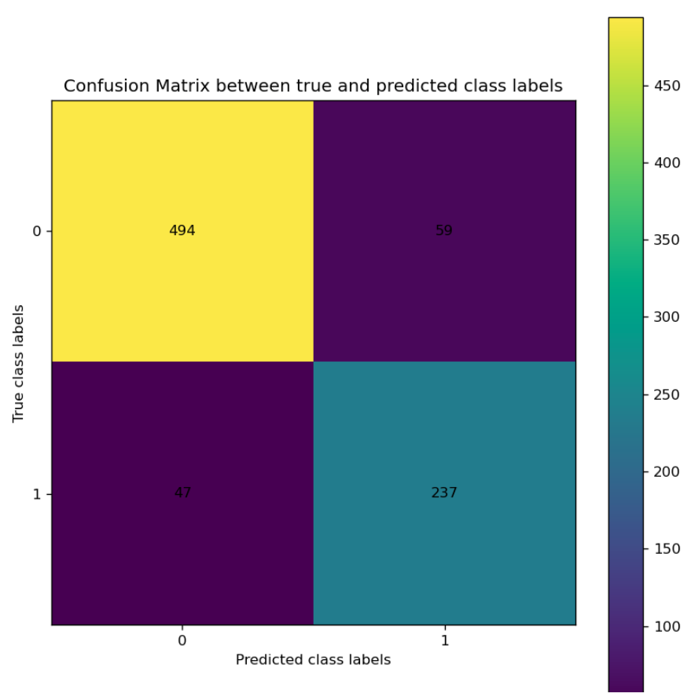

# Introduction


In this tutorial you will learn how to apply Galaxy tools to solve [classification](https://en.wikipedia.org/wiki/Statistical_classification) problems. First, we will introduce classification briefly, and then examine logistic regression, which is an example of a linear classifier. Next, we will discuss the nearest neighbor classifier, which is a simple but nonlinear classifier. Then advanced classifiers, such as support vector machines, random forest and ensemble classifiers will be introduced and applied. Furthermore, we will show how to visualize the results in each step.

Finally, we will discuss how to train the classifiers by finding the values of their parameters that minimize a cost function. We will work through a real problem in the field of cheminformatics to learn how the classifiers and learning algorithms work.

Classification is a [supervised learning](https://en.wikipedia.org/wiki/Supervised_learning) method in machine learning and the algorithm which is used for this learning task is called a classifier. In this tutorial we will build a classifier which can predict whether a chemical substance is biodegradable or not. Substances which degrade quickly are preferable to those which degrade slowly, as they do not accumulate and pose a risk to the environment. Therefore, it is useful to be able to predict easily in advance whether a substance is biodegradable prior to production and usage in consumer products.

> <agenda-title></agenda-title>
>
> In this tutorial, we will cover:
>
> 1. TOC
> {:toc}
>
{: .agenda}


# Classification

Classification is the process of assigning every object from a collection to exactly one class from a known set of classes by learning a "decision boundary" in a dataset. This dataset is called a training dataset and contains multiple samples, together with a desired class for each sample. The training dataset contains "features" as columns and a mapping between these features and the class label is learned for each sample.

The performance of mapping is evaluated using a test dataset, which is separate from the training dataset. The test dataset contains only the feature columns, but not the class column. The class column is predicted using the mapping learned on the training dataset. An example of a classification task is assigning a patient (the object) to a group of healthy or ill (the classes) people on the basis of his or her medical record. In this tutorial, we will use a classifier to train a model using a training dataset, predict the targets for test dataset and visualize the results using plots.


In figure [1](#figure-1), the line is a boundary which separates a class from another class (for example from tumor to no tumor). The task of a classifier is to learn this boundary, which can be used to classify or categorize an unseen/new sample. The line is the decision boundary; there are different ways to learn it, which correspond to different classification algorithms. If the dataset is linearly separable, linear classifiers can produce good classification results. However, when the dataset is complex and requires non-linear decision boundaries, more powerful classifiers like `support vector machine` or `ensemble` based classifiers may prove to be beneficial.

The data classification process includes two steps:
1. Building the classifier or model: This step is the learning step, in which the classification algorithms build the classifier. The classifier is built from the training set made up of database samples and their associated class labels. Each sample that constitutes the training set is referred to as a class.

2. Applying the classifier to a classification task: In this step, the classifier is used for classification. Here the test data is used to estimate the accuracy of classification rules. The classification rules can be applied to the new data samples if the accuracy is considered acceptable.


# Quantitative structure - activity relationship biodegradation

The classification problem we will study in this tutorial is related to biodegradation. Chemical substances which decay slowly will accumulate over time, which poses a threat to the environment. Therefore, it is useful to be able to predict in advance whether a substance will break down quickly or not.

Quantitative structure-activity relationship (QSAR) and quantitative structure-property relationship (QSPR) models attempt to predict the activity or property of chemicals based on their chemical structure. To achieve this, a database of compounds is collected for which the property of interest is known. For each compound, molecular descriptors are collected which describe the structure (for example: molecular weight, number of nitrogen atoms, number of carbon-carbon double bonds). Using these descriptors, a model is constructed which is capable of predicting the property of interest for a new, unknown molecule. In this tutorial we will use a database assembled from experimental data of the Japanese Ministry of International Trade and Industry to create a classification model for biodegradation. We then will be able to use this model to classify new molecules into one of two classes: biodegradable or non-biodegradable.

As a benchmark, we will use the [dataset](https://pubs.acs.org/doi/10.1021/ci4000213) assembled by Mansouri et al. using data from the National Institute of Technology and Evaluation of Japan. This database contains 1055 molecules, together with precalculated molecular descriptors.

In this tutorial, we will apply a couple of [scikit-learn](https://scikit-learn.org/stable/) machine learning tools to the dataset provided by Mansouri et al. to predict whether a molecule is biodegradable or not.
In the following part, we will perform classification on the biodegradability dataset using a linear classifier and then will create some plots to analyze the results.

## Get train and test datasets

We have two datasets available; the training dataset contains 837 molecules, while the test dataset contains 218 molecules.

Let's begin by uploading the necessary datasets.

> <hands-on-title>Data upload</hands-on-title>
>
> 1. Create a new history for this tutorial
> 2. Import the files from [Zenodo](https://zenodo.org/record/3738729#.Xs1EeHUzY5k)
>
>    ```
>    https://zenodo.org/record/3738729/files/train_rows.csv
>    https://zenodo.org/record/3738729/files/test_rows_labels.csv
>    https://zenodo.org/record/3738729/files/test_rows.csv
>    ```
>
>    
>
> 3. Rename the datasets as `train_rows`, `test_rows_labels` and `test_rows` respectively.
>
>    
>
{: .hands_on}

The `train_rows` contains a column `Class` which is the class label or target. We will evaluate our model on `test_rows` and compare the predicted class with the true class value in `test_rows_labels`
{: .comment}

> <details-title>Preparing the data for classification</details-title>
>
> Preparing the data involves these following major tasks:
> 1. Data cleaning: involves removing noise and treatment of missing values. The noise is removed by applying noise filtering techniques and the problem of missing values is solved by replacing a missing value with different techniques, for example substitution, mean imputation and regression imputation.
> 2. Relevance analysis: the database may also have attributes which are irrelevant for classification. Correlation analysis is used to know whether any two given attributes are related - e.g. one of the features and the target variable.
> 3. Normalization: the data is transformed using normalization. Normalization involves scaling all values for q given attribute in order to make them fall within a small specified range. Normalization is used when in the learning step, neural networks or the methods involving measurements are used.
>
{: .details}

# Learn the logistic regression classifier

As the first step, to learn the mapping between several features and the classes, we will apply the linear classifier. It learns features from the training dataset and maps all the rows to their respective class. The process of mapping gives a trained model. [Logistic regression](https://en.wikipedia.org/wiki/Logistic_regression) is named for the function used at the core of the method, the logistic function, and it is an instance of supervised classification in which we know the correct label of the class for each sample and the algorithm estimate of the true class. We want to learn parameters (weight and bias for the line) that make the estimated class for each training observation as close as possible to the true class label. This requires two components; the first is a metric for how close the current class label is to the true label. Rather than measure similarity, we usually talk about the opposite of this, the distance between the classifier output and the desired output, and we call this distance, the loss function or the cost function.

The second thing we need is an optimization algorithm for iteratively updating the weights so as to minimize this loss function. The standard algorithm for this is gradient descent. So, the dataset is divided into two parts - training and test sets. The training set is used to train a classifier and the test set is used to evaluate the performance of the trained model.

> <hands-on-title>Train logistic regression classifier</hands-on-title>
>
> 1. **Generalized linear models**  with the following parameters to train the regressor:
>    - *"Select a Classification Task"*: `Train a model`
>       - *"Select a linear method"*: `Logistic Regression`
>          - *"Select input type"*: `tabular data`
>             -  *"Training samples dataset"*: `train_rows`
>             -  *"Does the dataset contain header"*: `Yes`
>             -  *"Choose how to select data by column"*: `All columns EXCLUDING some by column header name(s)`
>                -  *"Type header name(s)"*: `Class`
>             -  *"Dataset containing class labels"*: `train_rows`
>             -  *"Does the dataset contain header"*: `Yes`
>             -  *"Choose how to select data by column"*: `Select columns by column header name(s)`
>                -  *"Select target column(s)"*: `Class`
> 2. Rename the generated file to `LogisticRegression_model`
{: .hands_on}

> <question-title></question-title>
>
> What is learned by the logistic regression model?
>
> > <solution-title></solution-title>
> >
> > In the logistic regressoion model, the coefficients of the logistic regression algorithm have be estimated from our training data. This is done using [maximum-likelihood estimation](https://en.wikipedia.org/wiki/Maximum_likelihood_estimation).
> > 
> {: .solution}
>
{: .question}

## Predict class using test dataset

After learning on the training dataset, we should evaluate the performance on the test dataset to know whether the learning algorithm learned a good classifier from the training dataset or not. This classifier is used to predict a new sample and a similar accuracy is expected.

Now, we will predict the class in the test dataset using this classifier in order to see if it has learned important features which can be generalized on a new dataset. The test dataset (`test_rows`) contains the same number of features but does not contain the `Class` column. This is predicted using the trained classifier.


> <hands-on-title>Predict class using the logistic regression classifier</hands-on-title>
>
> 1. **Generalized linear models**  with the following parameters to predict targets of test dataset using the trained model:
>    - *"Select a Classification Task"*: `Load a model and predict`
>       -  *"Models"*: `LogisticRegression_model`
>       -  *"Data (tabular)"*: `test_rows`
>       -  *"Does the dataset contain header"*: `Yes`
>       -  *"Select the type of prediction"*: `Predict class labels`
> 2. Rename the generated file to `LogisticRegression_result`
{: .hands_on}

## Visualize the logistic regression classification results

We will evaluate the classification by comparing the predicted with the expected classes. In the previous step, we classified the test dataset (`LogisticRegression_result`). We have one more dataset (`test_rows_labels`) which contains the true class label of the test set. Using the true and predicted class labels in the test set, we will verify the performance by analyzing the plots. As you can see, `LogisticRegression_result` has no header, so first we should remove the header from `test_rows_labels` to compare. 

> <hands-on-title>Remove the header</hands-on-title>
>
> 1. **Remove beginning**  with the following parameters:
>       -  *"Remove first"*: `1`
>       -  *"from"*: `test_rows_labels`
> 2. Rename the generated file to `test_rows_labels_noheader`
{: .hands_on}


Now we visualize and analyze the classification using the "Plot confusion matrix, precision, recall and ROC and AUC curves" tool.

> <hands-on-title>Check and visualize the classification</hands-on-title>
> 1. **Plot confusion matrix, precision, recall and ROC and AUC curves**  with the following parameters to visualize the classification:
>    -  *"Select input data file"*: `test_rows_labels_noheader`
>    -  *"Select predicted data file"*: `LogisticRegression_result`
>    -  *"Select trained model"*: `LogisticRegression_model`
{: .hands_on}

The visualization tool creates the following plots:

1. [Confusion matrix](https://en.wikipedia.org/wiki/Confusion_matrix): The confusion matrix summarizes the classification performance of a classifier with respect to the test data. It is a two-dimensional matrix; the horizontal axis (x-axis) shows the predicted labels and the vertical axis (y-axis) shows the true labels. Each rectangular box shows a count of samples falling into the four output combinations (true class, predicted class) - (1, 0), (1, 1), (0, 1) and (0, 0). In Figure 2, the confusion matrix of the predictions is a colour-coded heatmap. For a good prediction, the diagonal running from top-left to bottom-right should contain a smaller number of samples, because it shows the counts of incorrectly predicted samples. Hovering over each box in Galaxy shows the true and predicted class labels and the count of samples.

    

2. [Precision, recall and F1 score](https://en.wikipedia.org/wiki/Precision_and_recall): Precision, recall and F1 score. These scores determine the robustness of classification. It is important to analyze the plot for any classification task to verify the accuracy across different classes which provides more information about the balanced or imbalanced accuracy across multiple classes present in the dataset.

    

3. [Receiver operator characteristics (ROC) and area under ROC (AUC)](https://towardsdatascience.com/understanding-auc-roc-curve-68b2303cc9c5): Receiver operator characteristics (ROC) and area under ROC (AUC). The ROC curve is shown in blue. For a good prediction, it should be more towards the top-left of this plot, which results in a high AUC value. For a bad prediction, it is close to the orange line (y = x), resulting in a low AUC value (closer to 0.5). An AUC value of exactly 0.5 means the prediction is doing no better than a random number generator at predicting the classes.

     and area under ROC (AUC) for the logistic regression classifier.")

These plots are important to visualize the quality of the classifier and the true and predicted classes.


> <question-title></question-title>
>
> Inspect the plots. What can you say about the classification?
>
> > <solution-title></solution-title>
> >
> > Figures 2,3 and 4 show that the classification is acceptable, but as you will see in the next steps, the results can be improved. 
> >
> {: .solution}
{: .question}

# K-Nearest Neighbor (KNN)

At the second step, we will use k-nearest neighbor classifier. In the [k-nearest neighbor](https://en.wikipedia.org/wiki/K-nearest_neighbors_algorithm) classifier, a sample is classified by a majority vote of its neighbors.  The sample is assigned to the class which is most common among its k nearest neighbors.  k is a positive integer and typically it is small. For example, if k = 1, then the sample is simply assigned to the class of that single nearest neighbor. Surprisingly, when the number of data points is large, this classifier is not that bad. Choosing the best value of k is very important. If k is too small, the classifier will be sensitive to noise points and if k is too large, the neighborhood may include points from other classes and causes errors. To select the k that is right for your data, we recommend running the KNN algorithm several times with different values of k and choosing the k that reduces the number of errors the most.

> <question-title></question-title>
>
> What are advantages and disadvantages about this model?
>
> > <solution-title></solution-title>
> > Advantages:
> > - It is a very simple algorithm to understand and interpret.
> >
> > - It is very useful for nonlinear data because there is no assumption of linearity in this algorithm.
> >
> > - It is a versatile algorithm, as we can use it for classification as well as regression.
> >
> > - It has relatively high accuracy, but there are much better supervised learning models than KNN.
> >
> > - It works very well in low dimensions for complex decision surfaces.
> >
> > Disadvantages:
> >
> > - Classification is slow, because it stores all the training data.
> >
> > - High memory storage required as compared to other supervised learning algorithms.
> >
> > - Prediction is slow in case of big training samples.
> >
> > - It is very sensitive to the scale of data as well as irrelevant features.
> >
> > - It suffers a lot from the curse of dimensionality.
> >
> {: .solution}
{: .question}

> <hands-on-title>Train k-nearest neighbor classifier</hands-on-title>
>
> 1. **Nearest Neighbors Classification**  with the following parameters to train the regressor:
>    - *"Select a Classification Task"*: `Train a model`
>       - *"Classifier type"*: `Nearest Neighbors`
>          - *"Select input type"*: `tabular data`
>             -  *"Training samples dataset"*: `train_rows`
>             -  *"Does the dataset contain header"*: `Yes`
>             -  *"Choose how to select data by column"*: `All columns EXCLUDING some by column header name(s)`
>                -  *"Type header name(s)"*: `Class`
>             -  *"Dataset containing class labels"*: `train_rows`
>             -  *"Does the dataset contain header"*: `Yes`
>             -  *"Choose how to select data by column"*: `Select columns by column header name(s)`
>                -  *"Select target column(s)"*: `Class`
>             -  *"Neighbor selection method"*: `k-nearest neighbors`
> 2. Rename the generated file to `NearestNeighbors_model`
{: .hands_on}

> <question-title></question-title>
>
> What is the value of k (number of neighbors) for the model?
>
> > <solution-title></solution-title>
> > As you can see in the Advanced Options, the default value for the number of neighbors is 5, and we used the default value. You can set this parameter based on your problem and data. 
> >
> {: .solution}
{: .question}

Now, we should evaluate the performance on the test dataset to find out whether the KNN classifier is a good model from the training dataset or not. 

> <hands-on-title>Predict class using the k-nearest neighbor classifier</hands-on-title>
>
> 1. **Nearest Neighbors Classification**  with the following parameters to predict targets of test dataset using the trained model:
>    - *"Select a Classification Task"*: `Load a model and predict`
>       -  *"Models"*: `NearestNeighbors_model`
>       -  *"Data (tabular)"*: `test_rows`
>       -  *"Does the dataset contain header"*: `Yes`
>       -  *"Select the type of prediction"*: `Predict class labels`
> 2. Rename the generated file to `NearestNeighbors_result`
{: .hands_on}


Now we visualize and analyze the classification. As you can see, `NearestNeighbors_result` has a header, so use `test_rows_labels` to compare. 

> <hands-on-title>Check and visualize the classification</hands-on-title>
> 1. **Plot confusion matrix, precision, recall and ROC and AUC curves**  with the following parameters to visualize the classification:
>    -  *"Select input data file"*: `test_rows_labels`
>    -  *"Select predicted data file"*: `NearestNeighbors_result`
>    -  *"Select trained model"*: `NearestNeighbors_model`
{: .hands_on}

The visualization tool creates diagrams for the Confusion matrix, Precision, recall and F1 score, Receiver operator characteristics (ROC) and area under ROC (AUC) as follows:




 and area under ROC (AUC) for the k-nearest neighbor classifier.")


# Support Vector Machines (SVM)

[Support Vector Machines](https://en.wikipedia.org/wiki/Support-vector_machine) (SVMs) have been extensively researched in the machine learning community for the last decade and actively applied to applications in various domains such as bioinformatics. SVM is a generalization of a classifier called maximal margin classifier and is introduced as a binary classifier intended to separate two classes when obtaining the optimal hyperplane and decision boundary. SVMs are based on the assumption that the input data can be linearly separable in a geometric space. The maximal margin classifier is simple, but it cannot be applied to the majority of datasets, since the classes must be separated by a linear boundary and this is often not the case when working with real world data. That is why the support vector classifier was introduced as an extension of the maximal margin classifier, which can be applied in a broader range of cases.

To solve this problem, SVM uses kernel functions to map the input to a high dimension feature space, i.e hyperplane, where a linear decision boundary is constructed in such a manner that the boundary maximises the margin between two classes. The kernel approach is simply an efficient computational approach for accommodating a non-linear boundary between classes.

Without going into technical details, a kernel is a function that quantifies the similarity of two observations. Two special properties of SVMs are that SVMs achieve (1) high generalization by maximizing the margin and (2) support an efficient learning of nonlinear functions by
kernel trick. In the next step, we will build a SVM classifier with our data. 

> <hands-on-title>Train a SVM classifier</hands-on-title>
>
> 1. **Support vector machines (SVMs)**  with the following parameters to train the regressor:
>    - *"Select a Classification Task"*: `Train a model`
>       - *"Select a linear method"*: `Linear Support Vector Classification`
>          - *"Select input type"*: `tabular data`
>             -  *"Training samples dataset"*: `train_rows`
>             -  *"Does the dataset contain header"*: `Yes`
>             -  *"Choose how to select data by column"*: `All columns EXCLUDING some by column header name(s)`
>                -  *"Type header name(s)"*: `Class`
>             -  *"Dataset containing class labels"*: `train_rows`
>             -  *"Does the dataset contain header"*: `Yes`
>             -  *"Choose how to select data by column"*: `Select columns by column header name(s)`
>                -  *"Select target column(s)"*: `Class`
> 2. Rename the generated file to `SVM_model`
{: .hands_on}

> <question-title></question-title>
>
> What is learned by the support vector machines?
>
> > <solution-title></solution-title>
> >
> > The coefficients of the line with the maximal margin in the kernel space is learned in the training phase.
> > 
> {: .solution}
>
{: .question}


Now we will evaluate the performance of the SVM classifier:

> <hands-on-title>Predict class SVM classifier</hands-on-title>
>
> 1. **Support vector machines (SVMs)**  with the following parameters to predict targets of test dataset using the trained model:
>    - *"Select a Classification Task"*: `Load a model and predict`
>       -  *"Models"*: `SVM_model`
>       -  *"Data (tabular)"*: `test_rows`
>       -  *"Does the dataset contain header"*: `Yes`
>       -  *"Select the type of prediction"*: `Predict class labels`
> 2. Rename the generated file to `SVM_result`
{: .hands_on}


Now let's visualize the results:

> <hands-on-title>Check and visualize the classification</hands-on-title>
> 1. **Plot confusion matrix, precision, recall and ROC and AUC curves**  with the following parameters to visualize the classification:
>    -  *"Select input data file"*: `test_rows_labels`
>    -  *"Select predicted data file"*: `SVM_result`
>    -  *"Select trained model"*: `SVM_model`
{: .hands_on}

The visualization tool creates the following ROC plot:

 and area under ROC (AUC) for the SVM classifier.")


# Random Forest

[Random forest](https://en.wikipedia.org/wiki/Random_forest) is an ensemble of decision trees, and usually trained with the “bagging” method. The [Ensemble](https://scikit-learn.org/stable/modules/ensemble.html#ensemble) method uses multiple learning models internally for better predictions and the general idea of the bagging method is that a combination of learning models increases the overall result. It uses multiple decision tree regressors internally and predicts by taking the collective performances of the predictions by multiple decision trees. It has a good predictive power and is robust to outliers. It creates an ensemble of weak learners (decision trees) and iteratively minimizes error.

One big advantage of random forest is that it can be used for both classification and regression problems. The main idea behind the random forest is adding additional randomness to the model, while growing the trees and instead of searching for the most important feature while splitting a node, it searches for the best feature among a random subset of features. This results in a better model because of wide diversity. Generally, the more trees in the forest, the more robust the model. Therefore, when using the random forest classifier, a larger number of trees in the forest gives higher accuracy results. Similarly there are two stages in the random forest algorithm: one is random forest creation, the other is to make a prediction from the random forest classifier created in the first stage.

> <hands-on-title>Train random forest</hands-on-title>
>
> 1. **Ensemble methods**  with the following parameters to train the regressor:
>    - *"Select a Classification Task"*: `Train a model`
>       - *"Select an ensemble method"*: `Random forest classifier`
>          - *"Select input type"*: `tabular data`
>             -  *"Training samples dataset"*: `train_rows`
>             -  *"Does the dataset contain header"*: `Yes`
>             -  *"Choose how to select data by column"*: `All columns EXCLUDING some by column header name(s)`
>                -  *"Type header name(s)"*: `Class`
>             -  *"Dataset containing class labels"*: `train_rows`
>             -  *"Does the dataset contain header"*: `Yes`
>             -  *"Choose how to select data by column"*: `Select columns by column header name(s)`
>                -  *"Select target column(s)"*: `Class`
> 2. Rename the generated file to `RandomForest_model`
{: .hands_on}

> <question-title></question-title>
>
> What are the advantages of random forest classifier compared with KNN and SVM?
>
> > <solution-title></solution-title>
> > 1. The overfitting problem will never arise when we use the random forest algorithm in any classification problem.
> > 2. The same random forest algorithm can be used for both classification and regression task.
> > 3. The random forest algorithm can be used for feature engineering, which means identifying the most important features out of the available features from the training dataset.
> {: .solution}
>
{: .question}


After learning on the training dataset, we should evaluate the performance on the test dataset.

> <hands-on-title>Predict targets using the random forest</hands-on-title>
>
> 1. **Ensemble methods**  with the following parameters to predict targets of test dataset using the trained model:
>    - *"Select a Classification Task"*: `Load a model and predict`
>       -  *"Models"*: `RandomForest_model`
>       -  *"Data (tabular)"*: `test_rows`
>       -  *"Does the dataset contain header"*: `Yes`
>       -  *"Select the type of prediction"*: `Predict class labels`
> 2. Rename the generated file to `RandomForest_result`
{: .hands_on}

The visualization tool creates the following ROC plot:

 and area under ROC (AUC) for the random forest classifier.")


> <question-title></question-title>
>
> Inspect the plots. What can you say about the classification?
>
> > <solution-title></solution-title>
> >
> > Figures show that we achieved an AUC score of `1.0`  for the test set using random forest. It means the prediction is very good, in fact it has no error at all. Unfortunately, this is not usually the case when dealing with chemical data.
> {: .solution}
{: .question}


# Create data processing pipeline

At the last step, we will create a bagging classifier by using  the **Pipeline builder** tool. Bagging or Bootstrap Aggregating is a widely used ensemble learning algorithm in machine learning. The bagging algorithm creates multiple models from randomly taken subsets of the training dataset and then aggregates learners to build overall stronger classifiers that combine the predictions to produce a final prediction. The **Pipeline builder** tool builds the classifier and returns a zipped file. This tool creates another file which is tabular and contains a list of all the different hyperparameters of the preprocessors and estimators. This tabular file will be used in the **Hyperparameter search** tool to populate the list of hyperparameters with their respective (default) values.

> <hands-on-title>Create pipeline</hands-on-title>
>
> 1. **Pipeline builder**  with the following parameters:
>    - In *"Final Estimator"*:
>        - *"Choose the module that contains target estimator"*: `sklearn.ensemble`
>            - *"Choose estimator class"*: `BaggingClassifier`
>    - In *"Output parameters for searchCV?"*: `Yes`
> 
>      We choose `Final Estimator` as we have only the estimator and no preprocessor and need the parameters of only the estimator.
>
{: .hands_on}


## Search for the best values of hyperparameters

After extracting the parameter names from the **Pipeline builder** file, we will use the **Hyperparameter search** tool to find the best values for each hyperparameter. These values will lead us to create the best model based on the search space chosen for each hyperparameter. We use only one parameter `n_estimators` of `BaggingClassifier` for this task. This parameter specifies the number of bagging stages the learning process has to go through. The default value of `n_estimators` for this regressor is `10`. However, we are not sure if this gives the best accuracy. Therefore, it is important to set this parameter to different values to find the optimal one. We choose a value which is less than `10` and a few which are more than `10`. The hyperparameter search will look for the optimal number of estimators and gives the best-trained model as one of the outputs. This model is used in the next step to classify the test dataset.

> <hands-on-title>Hyperparameter search</hands-on-title>
>
> 1. **Hyperparameter search**  with the following parameters:
>    - *"Select a model selection search scheme"*: `GridSearchCV - Exhaustive search over specified parameter values for an estimator `
>        -  *"Choose the dataset containing pipeline/estimator object"*: `zipped` file (output of **Pipeline builder** )
>        -  *"Is the estimator a deep learning model?"*: `NO` )
>        - In *"Search parameters Builder"*:
>             -  *"Choose the dataset containing parameter names"*: `tabular` file (output of **Estimator attributes** )
>             - In *"Parameter settings for search"*:
>                 -  *"1: Parameter settings for search"*
>                    - *"Choose a parameter name (with current value)"*: `n_estimators: 10`
>                    - *"Search list"*: `[5,10,20,50]`
>    - *"Select input type"*: `tabular data`
>        -  *"Training samples dataset"*: `train_rows` tabular file
>        - *"Does the dataset contain header"*: `Yes`
>        - *"Choose how to select data by column"*: `All columns BUT by column header name(s)`
>            - *"Type header name(s)"*: `Class`
>        -  *"Dataset containing class labels or target values"*: `train_rows` tabular file
>        - *"Does the dataset contain header"*: `Yes`
>        - *"Choose how to select data by column"*: `Select columns by column header name(s)`
>            - *"Type header name(s)"*: `Class`
>    - *"Whether to hold a portion of samples for test exclusively?"*: `Nope`
>    - *"Save best estimator?"*: `Fitted best estimator or Detailed cv_results_from nested CV`
>
{: .hands_on}

> <question-title></question-title>
>
> What is the optimal number of estimators for the given dataset?
>
> Hint: Please look at the `mean_test_score` column in the tabular result from the **Hyperparameter search** tool.
>
> > <solution-title></solution-title>
> >
> > 20 - even though the default value of the number of estimators for Bagging Classifier is `10`, `20` gives the best accuracy. That's why it is important to perform hyperparameter search to tune these parameters for any dataset. 
> >
> {: .solution}
>
{: .question}

Using the **Hyperparameter search** tool, we found the best model, based on the training data. Now, we will predict age in the test dataset using this model.

> <hands-on-title>Predict age</hands-on-title>
>
> 1. **Ensemble methods for classification and regression**  with the following parameters:
>    - *"Select a Classification Task"*: `Load a model and predict`
>        -  *"Models"*: `zipped` file (output of **Hyperparameter search** )
>        -  *"Data (tabular)"*: `test_rows` tabular file
>        - *"Does the dataset contain header"*: `Yes`
>
{: .hands_on}


Now we will verify the performance by creating and inspecting the plots:


 and predicted targets. The plot shows a random pattern of points.")


Figure 13 shows that we again achieved an AUC value of `1.00`, which shows that our model is highly effective at predicting whether or not a molecule is biodegradable.


# Conclusion
By following these steps, we learned how to build classifiers and visualize the classification results using Galaxy's machine learning and plotting tools. The features of the training dataset are mapped to the classes. This mapping is used to make predictions on an unseen (test) dataset. The quality of classifiers is visualized using a plotting tool.

There are multiple other classification algorithms, a few are simpler to use (with fewer parameters) and some are more powerful, which can be tried out on this dataset and on other datasets as well. Different datasets can also be analyzed using these classifiers. The classifiers have many parameters which can be altered while performing the analyses to see if they affect the classification accuracy. It may be beneficial to perform a hyperparameter search to tune these parameters for different datasets. In addition, we learned the relevance of machine algorithms for QSAR analyses and constructed a model which successfully predicted an important chemical property - the biodegradability of a substance.
