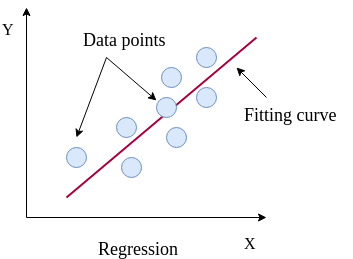
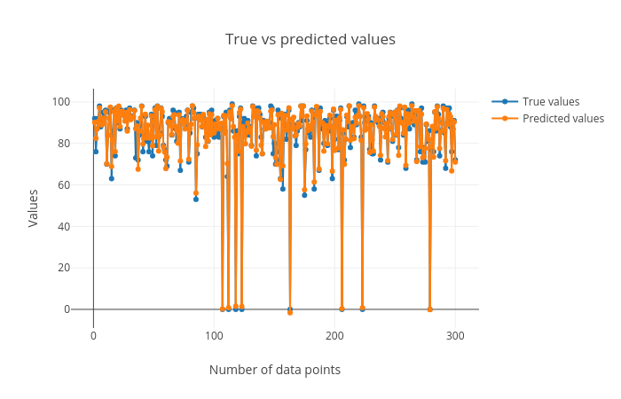

# Introduction


Machine learning is a subset of artificial intelligence (AI) that provides machines with the ability to automatically learn from data without being explicitly programmed. It is a combined field of computer science, mathematics and statistics to create a predictive model by learning patterns in a dataset. The dataset may have an output field which makes the learning process supervised. The [supervised learning](https://en.wikipedia.org/wiki/Supervised_learning) methods in machine learning have outputs (also called as targets or classes or categories) defined in the datasets in a column. These targets can either be  integers or real (continuous) numbers. When the targets are integers, the learning task is known as classification. Each row in the dataset is a sample and the classification is assigning a class label/target to each sample. The algorithm which is used for this learning task is called a classifier. When the targets are real numbers, the learning task is called regression and the algorithm which is used for this task is called a regressor. We will go through classification first and look at regression later in this tutorial.

> <question-title></question-title>
>
> What are features and outputs/targets in a dataset?
>
> > <solution-title></solution-title>
> >
> > Features and targets of a breast cancer dataset:
> >  or malignant (1) for each row of the dataset. Here, the targets are discrete which makes the learning task classification. In another task, if these targets contain continuous values, the learning task will become regression.")
> >
> {: .solution}
>
{: .question}


> <agenda-title></agenda-title>
>
> In this tutorial, we will deal with:
>
> 1. TOC
> {:toc}
>
{: .agenda}

# Classification

A [classification](https://en.wikipedia.org/wiki/Statistical_classification) task assigns a category/class to each sample by learning a decision boundary in a dataset. This dataset is called a training dataset and contains samples and desired class/category for each sample. The training dataset contains "features" as columns and a mapping between these features and the target is learned for each sample. The performance of mapping is evaluated using a test dataset (which is separate from training dataset). The test dataset contains only the feature columns and not the target column. The target column is predicted using the mapping learned on the training dataset. In this tutorial, we will use a classifier to train a model using a training dataset, predict the targets for test dataset and visualize the results using plots.

> <comment-title></comment-title>
> The terms like 'targets', 'classes', 'categories' or 'labels' have been used interchangeably for the classification part of this tutorial. They contain identical meaning. For regression, we will just use 'targets'.
{: .comment}

. The line creates a boundary between two sets of samples and is learned by a classifier. When a new sample comes for which we do not know whether it is a tumor or no tumor, we use this decision boundary to compute the actual class.")

In figure [2](#figure-2), the line is a boundary which separates a class from another class (for example from tumor to no tumor). The task of a classifier is to learn this boundary, which can be used to classify or categorize an unseen/new sample. The line is the decision boundary. There are different ways to learn this decision boundary. If the dataset is linearly separable, linear classifiers can produce good classification results. But, when the dataset is complex and requires non-linear decision boundaries, more powerful classifiers like `support vector machine` or  `tree` or `ensemble` based classifiers may prove to be beneficial. In the following part, we will perform classification on breast cancer dataset using a linear classifier and then will analyze the results with plots. Let's begin by uploading the necessary datasets.

## Data upload

The datasets to be used for classification contain 9 features. Each feature contains some unique information about breast cancer including the thickness of clump, cell-size, cell-shape and so on. More information about the dataset can be found here - [a](https://archive.ics.uci.edu/ml/datasets/breast+cancer+wisconsin+(original)) and [b](https://sites.google.com/a/googlesciencefair.com/science-fair-2012-project-64a91af142a459cfb486ed5cb05f803b2eb41354-1333130785-87/observations). In addition to these features, the training dataset contains one more column as the `target`. It has a binary value (0 or 1) for each row. `0` indicates no breast cancer (benign) and `1` (malignant) indicates breast cancer. The test dataset does not contain the `target` column (which should be predicted by a classifier). The third dataset contains all the samples from the test dataset, this time including the `target` column which is needed to compare between real and predicted targets.

> <hands-on-title>Data upload</hands-on-title>
>
> 1. Create a new history for this tutorial.
>
>    
>
> 2. Import the following datasets and choose the type of data as `tabular`.
>
>    ```
>    https://zenodo.org/record/3248907/files/breast-w_targets.tsv
>    https://zenodo.org/record/3248907/files/breast-w_test.tsv
>    https://zenodo.org/record/3248907/files/breast-w_train.tsv
>    ```
>
>    
>
> 3. Rename datasets to `breast-w_train`, `breast-w_test` and `breast-w_targets`.
>
>    
>
{: .hands_on}

## Learn using training dataset

The training dataset is used for learning the associations between features and the targets. The classifier learns general patterns in a dataset and saves a trained model. This model can be used for classifying a new sample. In this step, we will use `breast-w_train` as the training dataset and apply [SVM](https://scikit-learn.org/stable/modules/generated/sklearn.svm.LinearSVC.html#sklearn.svm.LinearSVC) (support vector machine) classifier. It will learn features from the dataset and maps them to the targets. This mapping is called a trained model. The training step produces a model file of type `zip`.

> <hands-on-title>Train the model</hands-on-title>
>
> 1. **Support vector machines (SVMs) for classification**  with the following parameters to train the classifier on training dataset:
>    - *"Select a Classification Task"*: `Train a model`
>       - *"Classifier type"*: `Linear Support Vector Classification`
>          - *"Select input type"*: `tabular data`
>             -  *"Training samples dataset"*: `breast-w_train`
>             - *"Does the dataset contain header"*: `Yes`
>             - *"Choose how to select data by column"*: `All columns EXCLUDING some by column header name(s)`
>                - *"Type header name(s)"*: `target`
>             -  *"Dataset containing class labels"*: `breast-w_train`
>             - *"Does the dataset contain header"*: `Yes`
>             - *"Choose how to select data by column"*: `Select columns by column header name(s)`
>                - *"Select target column(s)"*: `target`
> 2. Rename the generated file to `model`
{: .hands_on}

> <question-title></question-title>
>
> What is learned by the classifier?
>
> > <solution-title></solution-title>
> >
> > Two attributes **coef_** and **intercept_** are learned by the classifier using the training dataset. The **coef_** contains importance weight for each feature and **intercept_** is just a
> > constant scalar. However, for different classifiers, these attributes are different. The attributes shown here are specific to the **Linear support vector** classifier.
> > These attributes are stored in the trained model and can be accessed by reading this file.
> > 
> {: .solution}
>
{: .question}

## Predict categories of test dataset

After the training process is complete, we can see the trained model file (`zip` file) which contains information about patterns in the form of weights. The trained model is used to predict the classes of the test (`breast-w_test`) dataset. It assigns a class (either tumor or no tumor) to each row in the `breast-w_test` dataset.

> <hands-on-title>Predict classes using the trained model</hands-on-title>
>
> 1. **Support vector machines (SVMs) for classification**  with the following parameters to predict classes of test dataset using the trained model:
>    - *"Select a Classification Task"*: `Load a model and predict`
>       -  *"Models"*: `model` file (output of the previous step)
>       -  *"Data (tabular)"*: `breast-w_test` file
>       -  *"Does the dataset contain header"*: `Yes`
>       -  *"Select the type of prediction"*: `Predict class labels`
> 2. Rename the generated file to `predicted_labels`.
{: .hands_on}

## Visualise the predictions

We should evaluate the quality of predictions by comparing them against the true targets. To do this, we will use another dataset (`breast-w_targets`). This is the same as the test dataset (`breast-w_test`) but contains an extra `target` column containing the true classes of the test dataset. With the predicted and true classes, the learned model is evaluated to verify how correct the predictions are. To visualise these predictions, a plotting tool is used. It creates three plots - confusion matrix, precision, recall and F1 and ROC and AUC. We will mainly analyze the precision and recall plot.

> <hands-on-title>Check and visualize the predictions</hands-on-title>
> 1. **Plot confusion matrix, precision, recall and ROC and AUC curves**  with the following parameters to visualise the predictions:
>    -  *"Select input data file"*: `breast-w_targets`
>    -  *"Select predicted data file"*: `predicted_labels`
>    -  *"Select trained model"*: `model`
>
{: .hands_on}

We will analyze the following plots:

1. [Confusion matrix](https://en.wikipedia.org/wiki/Confusion_matrix):

     shows the predicted labels and the vertical axis (y-axis) shows the true labels. Each rectangular box shows a count of samples falling into the four output combinations (true class, predicted class) - (1, 0), (1, 1), (0, 1) and (0, 0). For a good prediction, the diagonal running from top-left to bottom-right should contain less number of samples (because it shows the counts of incorrectly predicted samples). Hovering over each box in Galaxy shows the true and predicted class labels and the count of samples.")

2. [Precision, recall and F1 score](https://en.wikipedia.org/wiki/Precision_and_recall):

     which means that all the samples belonging to these classes have been classified correctly. In the 'breast-w_test' dataset, all the samples with predicted class '0' (no tumor) have the true class as '0' (precision = 1.0) while not all samples with the predicted class as '1' have the true class as '1' (precision < 1.0) (see precision curve). The recall curve is the opposite of the precision curve. Not all the samples with the true class as '0' are predicted as class '0' (recall < 1.0) and all the samples with the true class as '1' are predicted as class '1' (recall = 1.0) (see recall curve). It is important to analyze the plot for any classification task to verify the accuracy across different classes which provides more information about the balanced or imbalanced accuracy across multiple classes present in the dataset.")

3. [Receiver operator characteristics (ROC) and area under ROC (AUC)](https://towardsdatascience.com/understanding-auc-roc-curve-68b2303cc9c5):

     and area under ROC (AUC). The ROC curve is shown in blue. For a good prediction, it should be more towards the top-left of this plot. For a bad prediction, it is close to the orange line (y = x).")

Using these plots, the robustness of classification can be visualized.


## Summary
By following these steps from data upload until plotting, we have learned how to do classification and visualise the predictions using Galaxy's machine learning and plotting tools. A similar analysis can be performed using a different dataset or by using a different classifier. This machine learning suite provides multiple classifiers from linear to complex ones suited for different classification tasks. For example for a binary class classification, `support vector machine` classifier may perform well. It is recommended to try out different classifiers on a dataset to find the best one.


# Regression

For classification, the targets are integers. However, when the targets in a dataset are real numbers, the machine learning task becomes [regression](https://en.wikipedia.org/wiki/Regression_analysis). Each sample in the dataset has a real-valued output or target. Figure [6](#figure-6) shows how a (regression) curve is fitted which explains most of the data points (blue balls). Here, the curve is a straight line (red). The regression task is to learn this curve which explains the underlying distribution of the data points. The target for a new sample will lie on the curve learned by the regression task. A regressor learns the mapping between the features of a dataset row and its target value. Inherently, it tries to fit a curve for the targets. This curve can be linear or non-linear. In this part of the tutorial, we will perform regression on [body density](https://rstudio-pubs-static.s3.amazonaws.com/65314_c0d1e5696cdd4e93a3784ea67f9e3d34.html) dataset.




## Data upload

The dataset contains information about human [body density](https://rstudio-pubs-static.s3.amazonaws.com/65314_c0d1e5696cdd4e93a3784ea67f9e3d34.html). It includes 14 features like underwater body density, age, weight, height, neck circumference and so on. The target is the percent body fat. The aim of the task is to learn a mapping between several body features and fat content inside the human body. Using this learning, the body fat percentage can be predicted using other features. To carry out this task, we will need training and test datasets. Again, we will also prepare another test dataset with targets included to evaluate the regression performance. `body_fat_train` dataset is used as the training dataset and `body_fat_test` as the test dataset. The dataset `body_fat_test_labels` contains the true targets for the test dataset (`body_fat_test`).

> <hands-on-title>Data upload</hands-on-title>
>
> 1. Create a new history for this tutorial.
> 2. Import the following datasets and choose the type of data as `tabular`.
>
>    ```
>    https://zenodo.org/record/3248907/files/body_fat_train.tsv
>    https://zenodo.org/record/3248907/files/body_fat_test_labels.tsv
>    https://zenodo.org/record/3248907/files/body_fat_test.tsv
>    ```
>
>    
>
> 3. Rename datasets to `body_fat_train`, `body_fat_test_labels` and `body_fat_test`.
>
>    
>
{: .hands_on}


## Learn from training dataset

To learn the mapping between several features and the targets, we will apply a regressor which is called
the [Gradient boosting regressor](http://scikit-learn.org/stable/modules/ensemble.html#regression). It is an ensemble-based regressor because its prediction is the collective performance of multiple weak learners (e.g. decision trees). It learns features from training dataset (`body_fat_train`) and maps all the rows to their respective targets (real numbers). The process of mapping gives a trained model.

> <hands-on-title>Train a model</hands-on-title>
>
> 1. **Ensemble methods for classification and regression**  with the following parameters to train the regressor:
>    - *"Select a Classification Task"*: `Train a model`
>       - *"Select an ensemble method"*: `Gradient Boosting Regressor`
>          - *"Select input type"*: `tabular data`
>             -  *"Training samples dataset"*: `body_fat_train`
>             -  *"Does the dataset contain header"*: `Yes`
>             -  *"Choose how to select data by column"*: `All columns EXCLUDING some by column header name(s)`
>                -  *"Type header name(s)"*: `target`
>             -  *"Dataset containing class labels"*: `body_fat_train`
>             -  *"Does the dataset contain header"*: `Yes`
>             -  *"Choose how to select data by column"*: `Select columns by column header name(s)`
>                -  *"Select target column(s)"*: `target`
> 2. Rename the generated file to `model`.
{: .hands_on}

> <question-title></question-title>
>
> What is learned by the regressor?
>
> > <solution-title></solution-title>
> >
> > Unlike the **Linear support vector** classifier (used for classification in the first part of the tutorial) which learned only two attributes,
> > the **Gradient boosting** regressor learns multiple attributes such as **feature_importances_** (weight for each feature/column),
> > **oob_improvement_** (which stores incremental improvements in learning), **estimators_** (collection of weak learners) and a few more.
> > These attributes are used to predict the target for a new sample and are stored in the trained model. They can be accessed by reading this file.
> > 
> {: .solution}
>
{: .question}

## Predict using test dataset

After learning on the training dataset, we should evaluate the performance on the test dataset to know whether the algorithm learned general patterns from the training dataset or not. These patterns are used to predict a new sample and a similar accuracy is expected. Similar to the classification task, the trained model is evaluated on `body_fat_test` which predicts a target value for each row. The predicted targets are compared to the expected targets to measure the robustness of learning.

> <hands-on-title>Predict targets using the model</hands-on-title>
>
> 1. **Ensemble methods for classification and regression**  with the following parameters to predict targets of test dataset using the trained model:
>    - *"Select a Classification Task"*: `Load a model and predict`
>       -  *"Models"*: `model`
>       -  *"Data (tabular)"*: `body_fat_test`
>       -  *"Does the dataset contain header"*: `Yes`
>       -  *"Select the type of prediction"*: `Predict class labels`
> 2. Rename the generated file to `predicted_data`.
{: .hands_on}

## Visualise the prediction

We will evaluate the predictions by comparing them to the expected targets.

> <hands-on-title>Check and visualize the predictions</hands-on-title>
> 1. **Plot actual vs predicted curves and residual plots**  with the following parameters to visualise the predictions:
>    -  *"Select input data file"*: `body_fat_test_labels`
>    -  *"Select predicted data file"*: `predicted_data`
{: .hands_on}

The visualization tool creates the following plots:

1. True vs predicted targets curves:

    


2. [Scatter plot](https://towardsdatascience.com/everything-you-need-to-know-about-scatter-plots-for-data-visualisation-924144c0bc5) for true vs. predicted targets:

     lie along the orange curve (y = x) which shows that the true and predicted values are close. The more points are aligned along the x = y line, the better the prediction. The R2 (coefficient of determination) score (0.98) is close to the best possible score of 1.0. The RMSE (root mean squared error) is also small (1.32) which also tells us that the predicted targets are close to the true targets.")

3. [Residual plot](http://docs.statwing.com/interpreting-residual-plots-to-improve-your-regression/) between residual (predicted - true) and predicted targets:

     and predicted targets. The plot shows a random pattern of points. For a good regression performance, this plot should exhibit a random pattern and the points should be symmetrically distributed along the y=0 line.")

These plots are important to visualize the quality of regression and the true and predicted targets - how close or far they are from each other. The closer they are, the better the prediction.

## Summary
By following these steps, we learned how to perform regression and visualise the predictions using Galaxy's machine learning and plotting tools. The features of the training dataset are mapped to the real-valued targets. This mapping is used to make predictions on an unseen (test) dataset. The quality of predictions is visualised using a plotting tool. There are multiple other regression algorithms, few are simpler to use (with fewer parameters) and some are powerful, which can be tried out on this dataset and on other datasets as well.

# Conclusion
We learned how to perform classification and regression using different datasets and machine learning tools in Galaxy. Moreover, we visualized the results using multiple plots to ascertain the robustness of machine learning tasks. There are many other classifiers and regressors in the machine learning suite which can be tried out on these datasets to find how they perform. Different datasets can also be analysed using these classifiers and regressors. The classifiers and regressors have lots of parameters which can be altered while performing the analyses to see if they affect the prediction accuracy. It may be beneficial to perform hyperparameter search to tune these parameters of classifiers and regressors for different datasets. Some data pre-processors can also be used to clean the datasets.
