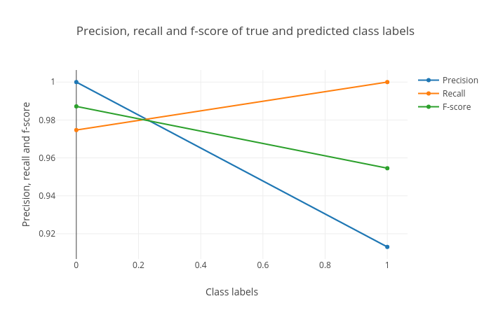

# Introduction
{:.no_toc}

Supervised learning methods in machine learning have targets/classes/categories defined in the datasets. These targets can either be discrete values or real-values (continuous). When the targets are discreet, the learning task is called as classification. When the targets are real-values, the task becomes regression. Classification is assigning a distinct category to each sample in the dataset. Regression assigns a real-valued output to a sample in the dataset. In the image below, the "green" line is a boundary which separates the blue balls from the red ones. The task of a classification method is to learn this boundary which can be used to differentiate between unseen blue and red balls. This green line is the decision boundary which determines the category of a new ball.

>    


The following image shows how a (regression) curve is fit which explains most of the data points. Here, the curve is a straight line. The regression task is to learn this curve which explains the underlying distribution.

>    


> ### Agenda
>
> In this tutorial, we will deal with:
>
> 1. TOC
> {:toc}
>
{: .agenda}


# Classification

[Classification](https://en.wikipedia.org/wiki/Statistical_classification) task assigns a category/class to a sample by learning a decision boundary using a dataset. This dataset is called a training dataset and contains a class/category for each sample. The algorithm which performs this task is called a classifier. The training dataset contains "features" as columns and a mapping between these features and the target is learned for each sample. The performance of mapping is evaluated using test dataset. The test dataset contains only the feature columns and not the target column. The target column is predicted using the mapping learned on the training dataset. In this tutorial, we will use a classifier to train a model using a training dataset, predict the targets for test dataset and visualize the results using plots.

## Data upload

The datasets required for this tutorial contain 9 features of breast cancer which include the thickness of clump, cell-size, cell-shape and so on ([more information](https://github.com/EpistasisLab/penn-ml-benchmarks/tree/master/datasets/classification/breast-w)). In addition to these features, the training dataset contains one more column as `target`. It has a binary value (0 or 1) for each row. `0` indicates no breast cancer and `1` indicates breast cancer. The test dataset does not contain the `target` column. The third dataset contains all the samples from test dataset but also the `target` column which would be needed to create a plot showing the comparison between actual and predicted targets. Using the dataset `breast-w_train.tsv`, a classifier is trained which learns features from the data and maps them to the targets. The test dataset `breast-w_test.tsv` is used do the predictions based on the model learned during training. Another dataset `breast-w_targets.tsv` is same as the test dataset with a target column which contains the true targets of the test data. With the predicted and true targets, the learned model is evaluated e.g. how good are the predictions. To visualise these predictions, a plotting tool is used.


> ###  Hands-on: Data upload
>
> 1. Create a new history for this tutorial
> 2. Import the following datasets and choose the type of data as `tabular`.
> 
>    ```
>    https://zenodo.org/record/1401230/files/breast-w_train.tsv
>    https://zenodo.org/record/1401230/files/breast-w_test.tsv
>    https://zenodo.org/record/1401230/files/breast-w_targets.tsv
>    ```
> 
>    
>
> 3. Rename datasets to `breast-w_train`, `breast-w_test` and `breast-w_targets`.
>
>    
>
{: .hands_on}

## Learn, predict and visualise the predictions
`SVM (Support vector machine)` classifier is trained using `breast-w_train` dataset. The last column of this dataset assigns a category for each row. The classifier learns a mapping between each row and its category. This mapping is called a trained model. It is used to predict the categories of unseen data (`breast-w_test`). The training step produces a model file of type `zip`. Rename this file to `model.zip` by using `edit` dataset property. The trained model is used to predict the categories of each row in `breast-w_test` dataset in the second step. Rename the predicted `tabular` file to `predicted_labels` by using its `edit` dataset property. The third step creates three output files (plots), one each for the confusion matrix, precision, recall and f1-score and roc curves. These files should be downloaded and unzipped to get the `html` file which contains the plot.

> ###  Comment
>
> To find the **SVM classifier** tool, please type the name **support vector machines** in the tool search box and select the tool - **Support vector machines (SVMs) for classification**.
{: .comment}

> ###  Hands-on: Learn, predict and visualise the predictions
> 
> 1. **Support vector machines (SVMs) classifier**  with the following parameters to train the classifier on training data:
>
>    -  *"Select a Classification Task"*: `Train a model`
>    -  *"Classifier type"*: `Linear Support Vector Classification`
>    -  *"Select input type"*: `tabular data`
>    -  *"Training samples dataset"*: `breast-w_train`
>    -  *"Does the dataset contain header"*: `Yes`
>    -  *"Choose how to select data by column"*: `All columns but by column header name(s)`
>    -  *"Type header name(s)"*: `target`
>    -  *"Dataset containing class labels"*: `breast-w_train`
>    -  *"Does the dataset contain header"*: `Yes`
>    -  *"Choose how to select data by column"*: `Select columns by column header name(s)`
>    -  *"Select target column(s)"*: `target`
>    - `Execute` the classifier to train
>
> 2. **Support vector machines (SVMs) classifier**  with the following parameters to predict classes of test data using the trained model:
> 
>    -  *"Select a Classification Task"*: `Load a model and predict`
>    -  *"Models"*: `model.zip`
>    -  *"Data (tabular)"*: `breast-w_test`
>    -  *"Does the dataset contain header"*: `Yes`
>    -  *"Select the type of prediction"*: `Predict class labels`
>    - `Execute` to predict categories
>
> 3. **Plot confusion matrix, precision, recall and ROC and AUC curves**  with the following parameters to visualise the predictions:
> 
>    -  *"Select input data file"*: `breast-w_targets`
>    -  *"Select predicted data file"*: `predicted_labels`
>    -  *"Select trained model"*: `model.zip`
>    - `Execute` to create visualizations
>
>    
>    
>     and area under ROC (AUC). The blue curve shows the ROC curve. When it is close to the orange curve (y = x), the classification results are not good. When it is more towards the top-left (like the blue curve shown in the plot), the classification performance is good.")
>
{: .hands_on}

The above hands-on section explains how to perform classification and visualise the predictions using Galaxy machine learning and plotting tools. The classes of unseen (test) data are predicted and evaluated against the true classes. The plots show how good the classification is. Figure 4 shows the percentage of correctly predicted samples per class (recall curve).


# Regression

[Regression](https://en.wikipedia.org/wiki/Regression_analysis) is also a supervised learning task where the target is a real number (continuous) instead of discreet like classification. The algorithms which are used for regression tasks are called regressors. A regressor learns the mapping between the features of a dataset row and its target value. Inherently, it tries to fit a curve for the targets. This curve can be linear (straight line curve) or non-linear.


## Data upload
The datasets required for this tutorial contain 21 features of [computer system activity](https://github.com/EpistasisLab/penn-ml-benchmarks/tree/master/datasets/regression/573_cpu_act) which include columns like fork, exec and so on ([more information](https://sci2s.ugr.es/keel/dataset/data/regression/compactiv-names.txt)). In addition to these features, the training dataset contains one more column as `target` which contains a real number for each row. All the values in the datasets are real numbers. The dataset `train_data.tabular` is used for training a regressor which maps the features to the targets. The test (unseen) dataset `test_data.tabular` is used to predict a target value for each row. The dataset `test_target.tabular` is used to evaluate the quality of predictions as it is also the test data along with the true targets. A plotting tool is used to demonstrate the difference between true and predicted targets.

> ###  Hands-on: Data upload
>
> 1. Create a new history for this tutorial
> 2. Import the following datasets and choose the type of data as `tabular`.
> 
>    ```
>    https://zenodo.org/record/1475816/files/train_data.tabular
>    https://zenodo.org/record/1475816/files/test_data.tabular
>    https://zenodo.org/record/1475816/files/test_target.tabular
>    ```
> 
>    
>
> 3. Rename datasets to `train_data`, `test_data` and `test_target`.
>
>    
>
{: .hands_on}


## Learn, predict and visualise the predictions
`Gradient boosting regressor` is used for regression. It is an ensemble based [regressor](http://scikit-learn.org/stable/modules/ensemble.html#regression) consisting of weak learners (e.g. decision trees). It learns features of a training dataset (`train_data`) and maps all feature rows to respective targets (the targets are real numbers). The process of mapping gives a trained model which is used to evaluate the quality of mapping. The trained model is evaluated on `test_data` which predicts a target value for each row. The second step produces a model file of type `zip`. Rename this file to `model.zip` by using its `edit` dataset property. The trained model is used to predict the categories of each row in `test_data` dataset. Rename the predicted file to `predicted_data` by using `edit` dataset property. The third step creates three output files (plots), one each for true vs predicted values, scatter plot for true and predicted values and a residual plot. These files should be downloaded and unzipped to see the `html` file which contains the plot.

> ###  Comment
>
> To find the **Gradient boosting** tool, please type the name **ensemble methods** in the tool search box and select the tool - **Ensemble methods for classification and regression**.
{: .comment}

> ###  Hands-on: Learn, predict and visualise the predictions
> 
> 1. **Gradient boosting regressor**  with the following parameters to train the regressor:
>    -  *"Select a Classification Task"*: `Train a model`
>    -  *"Select an ensemble method"*: `Gradient Boosting Regressor`
>    -  *"Select input type"*: `tabular data`
>    -  *"Training samples dataset"*: `train_data`
>    -  *"Does the dataset contain header"*: `Yes`
>    -  *"Choose how to select data by column"*: `All columns but by column header name(s)`
>    -  *"Type header name(s)"*: `target`
>    -  *"Dataset containing class labels"*: `train_data`
>    -  *"Does the dataset contain header"*: `Yes`
>    -  *"Choose how to select data by column"*: `Select columns by column header name(s)`
>    -  *"Select target column(s)"*: `target`
>    - `Execute` the classifier to train
>
> 2. **Gradient Boosting Regressor**  with the following parameters to predict targets of test data using the trained model:
> 
>    -  *"Select a Classification Task"*: `Load a model and predict`
>    -  *"Models"*: `model.zip`
>    -  *"Data (tabular)"*: `test_data`
>    -  *"Does the dataset contain header"*: `Yes`
>    -  *"Select the type of prediction"*: `Predict class labels`
>    - `Execute` to predict categories
>
> 3. **Plot actual vs predicted curves and residual plots**  with the following parameters to visualise the predictions:
> 
>    -  *"Select input data file"*: `test_target`
>    -  *"Select predicted data file"*: `predicted_data`
>    - `Execute` to create visualizations
>
>    
>     should be close to the orange curve (y = x) which shows that the true and predicted values are close.")
>     and predicted targets. For good regression performance, this plot should exhibit a random pattern.")
>
{: .hands_on}

The above hands-on section explains how to perform regression and visualise the predictions using Galaxy machine learning and plotting tools. The features of the training data are mapped the real-valued targets. This mapping is used to make predictions on the unseen (test) data. The quality of predictions is visualised using a plotting tool. Figure 7 shows the performance. More the number of points are aligned along the x = y line, better is the prediction.


