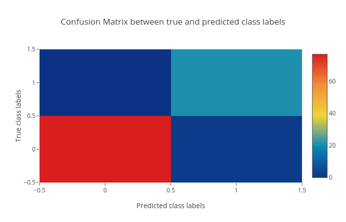
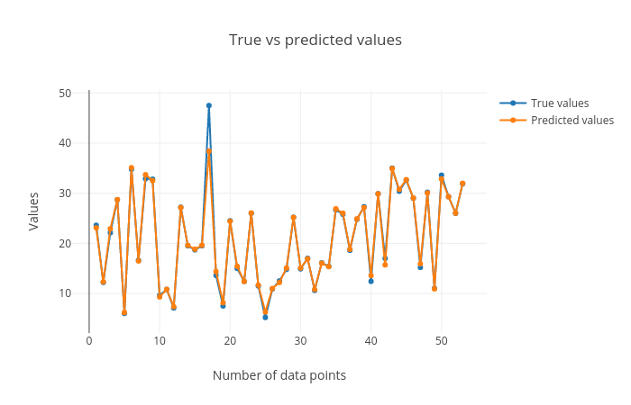

# Introduction
{:.no_toc}

[Supervised learning](https://en.wikipedia.org/wiki/Supervised_learning) methods in machine learning have targets/classes/categories defined in the datasets. These targets can either be discrete values (integers) or real-values (continuous). When the targets are discrete, the learning task is known as classification. These discrete values are called classes or categories. When the targets are real-values, the task becomes regression. Classification is assigning a category to each sample in the dataset. Regression assigns a real-valued output or target to each sample. In figure [1](#figure-1), the line is a boundary which separates blue balls from violet ones. The task of a classification method is to learn this boundary which can be used to differentiate between unseen balls. The line is the decision boundary which determines the category of a new ball.


Figure [2](#figure-2) shows how a (regression) curve is fit which explains most of the data points (blue balls). Here, the curve is a straight line (red). The regression task is to learn this curve which explains the underlying distribution of the data points.


> ### Agenda
>
> In this tutorial, we will deal with:
>
> 1. TOC
> {:toc}
>
{: .agenda}


# Classification

[Classification](https://en.wikipedia.org/wiki/Statistical_classification) task assigns a category/class to a sample by learning a decision boundary using a dataset. This dataset is called a training dataset and contains a class/category for each sample. The algorithm which performs this task is called a classifier. The training dataset contains "features" as columns and a mapping between these features and the target is learned for each sample. The performance of mapping is evaluated using test dataset. The test dataset contains only the feature columns and not the target column. The target column is predicted using the mapping learned on the training dataset. In this tutorial, we will use a classifier to train a model using a training dataset, predict the targets for test dataset and visualize the results using plots.

## Data upload

The datasets required for this tutorial contain 9 features of breast cancer which include the thickness of clump, cell-size, cell-shape and so on ([more information](https://github.com/EpistasisLab/penn-ml-benchmarks/tree/master/datasets/classification/breast-w)). In addition to these features, the training dataset contains one more column as `target`. It has a binary value (0 or 1) for each row. `0` indicates no breast cancer and `1` indicates breast cancer. The test dataset does not contain the `target` column. The third dataset contains all the samples from test dataset but also the `target` column which would be needed to create a plot showing the comparison between actual and predicted targets.

> ###  Hands-on: Data upload
>
> 1. Create a new history for this tutorial
> 2. Import the following datasets and choose the type of data as `tabular`
> 
>    ```
>    https://zenodo.org/api/files/efd372b1-4d11-4f43-bba6-66e75a0b4d15/breast-w_targets.tsv
>    https://zenodo.org/api/files/efd372b1-4d11-4f43-bba6-66e75a0b4d15/breast-w_test.tsv
>    https://zenodo.org/api/files/efd372b1-4d11-4f43-bba6-66e75a0b4d15/breast-w_train.tsv
>    ```
> 
>    
>
> 3. Rename datasets to `breast-w_train`, `breast-w_test` and `breast-w_targets`
>
>    
>
{: .hands_on}

## Learn using training data

Using the dataset `breast-w_train`, [SVM](https://scikit-learn.org/stable/modules/generated/sklearn.svm.LinearSVC.html#sklearn.svm.LinearSVC) (support vector machine) classifier is trained which learns features from the data and maps them to the targets. This mapping is called a trained model. The training step produces a model file of type `zip`. 

> ###  Hands-on: Train the model
> 
> 1. **Support vector machines (SVMs) for classification**  with the following parameters to train the classifier on training data:
>    - *"Select a Classification Task"*: `Train a model`
>       - *"Classifier type"*: `Linear Support Vector Classification`
>          - *"Select input type"*: `tabular data`
>             -  *"Training samples dataset"*: `breast-w_train`
>             - *"Does the dataset contain header"*: `Yes`
>             - *"Choose how to select data by column"*: `All columns but by column header name(s)`
>                - *"Type header name(s)"*: `target`
>             -  *"Dataset containing class labels"*: `breast-w_train`
>             - *"Does the dataset contain header"*: `Yes`
>             - *"Choose how to select data by column"*: `Select columns by column header name(s)`
>                - *"Select target column(s)"*: `target`
> 2. Rename the generated file to `model`
{: .hands_on}

## Predict using test data

The `model` learned in the previous step can now be used to predict the categories of unseen test (`breast-w_test`) data. This step assigns a category to each row in `breast-w_test` dataset.

> ###  Hands-on: Predict categories using the model
> 
> 2. **Support vector machines (SVMs) for classification**  with the following parameters to predict classes of test data using the trained model:
>    - *"Select a Classification Task"*: `Load a model and predict`
>       -  *"Models"*: `model` (output of the previous step)
>       -  *"Data (tabular)"*: `breast-w_test`
>       -  *"Does the dataset contain header"*: `Yes`
>       -  *"Select the type of prediction"*: `Predict class labels`
> 2. Rename the generated file to `predicted_labels`
{: .hands_on}

## Visualise the prediction

After the training and prediction tasks, we should check whether the predictions are correct.  We will use another dataset `breast-w_targets` for this verification. It is similar to the test dataset (`breast-w_test`) but contains an extra target column having the true targets of the test data. With the predicted and true targets, the learned model is evaluated to verify how good the predictions are. To visualise these predictions, a plotting tool is used.

> ###  Hands-on: Check and visualize the predictions
> 1. **Plot confusion matrix, precision, recall and ROC and AUC curves**  with the following parameters to visualise the predictions:
>    -  *"Select input data file"*: `breast-w_targets`
>    -  *"Select predicted data file"*: `predicted_labels`
>    -  *"Select trained model"*: `model`
>
{: .hands_on}

The tool creates the following three plots:

1. Confusion matrix of the correctly and incorrectly predicted samples:

    

    In figure [3](#figure-3), the diagonal from bottom-left to top-right shows the number of correctly predicted labels and the diagonal from top-left to bottom-right shows the number of incorrectly predicted samples.

2. Precision, recall and F1 score:

    

    These scores determine the robustness of classification. In figure [4](#figure-4), the recall curve shows the percentage of correctly predicted samples per class. All these curves converge because all the samples in `breast-w_test` file get correctly classified.

3. Receiver operator characteristics (ROC) and area under ROC (AUC):

     and area under ROC (AUC).")

    The blue curve in figure [5](#figure-5) shows the ROC curve. When it is close to the orange curve (y = x), the classification results are not good. When it is more towards the top-left (like the blue curve shown in the plot), the classification performance is good. 

By following these steps, we learn how to perform classification and visualise the predictions using Galaxy machine learning and plotting tools. The classes of unseen (test) data are predicted, evaluated against the true classes and visualized to show how good is the classification.


# Regression

[Regression](https://en.wikipedia.org/wiki/Regression_analysis) is also a supervised learning task where target is a real number (continuous) instead of discrete like in classification. The algorithms which are used for regression tasks are called regressors. A regressor learns the mapping between the features of a dataset row and its target value. Inherently, it tries to fit a curve for the targets. This curve can be linear (straight line curve) or non-linear.


## Data upload

The datasets required for this tutorial contain 21 features of [computer system activity](https://github.com/EpistasisLab/penn-ml-benchmarks/tree/master/datasets/regression/573_cpu_act) which include columns like fork, exec and so on ([more information](https://sci2s.ugr.es/keel/dataset/data/regression/compactiv-names.txt)). In addition to these features, the training dataset contains one more column as `target` which contains a real number for each row. All the values in the datasets are real numbers. The dataset `train_data.tabular` is used for training a regressor which maps the features to the targets. The test (unseen) dataset `test_data.tabular` is used to predict a target value for each row. The dataset `test_target.tabular` is used to evaluate the quality of predictions as it is also the test data along with the true targets. A plotting tool is used to demonstrate the difference between true and predicted targets.

> ###  Hands-on: Data upload
>
> 1. Create a new history for this tutorial
> 2. Import the following datasets and choose the type of data as `tabular`
> 
>    ```
>    https://zenodo.org/api/files/efd372b1-4d11-4f43-bba6-66e75a0b4d15/test_data.tabular
>    https://zenodo.org/api/files/efd372b1-4d11-4f43-bba6-66e75a0b4d15/test_target.tabular
>    https://zenodo.org/api/files/efd372b1-4d11-4f43-bba6-66e75a0b4d15/train_data.tabular
>    ```
> 
>    
>
> 3. Rename datasets to `train_data`, `test_data` and `test_target`
>
>    
>
{: .hands_on}


## Learn from training data

[Gradient boosting regressor](http://scikit-learn.org/stable/modules/ensemble.html#regression) is used for this task. It is an ensemble based regressor consisting of weak learners (e.g. decision trees). It learns features from training dataset (`train_data`) and maps all rows to respective targets which are real numbers. The process of mapping gives a trained model.

> ###  Hands-on: Train a model
> 
> 1. **Ensemble methods for classification and regression**  with the following parameters to train the regressor:
>    - *"Select a Classification Task"*: `Train a model`
>       - *"Select an ensemble method"*: `Gradient Boosting Regressor`
>          - *"Select input type"*: `tabular data`
>             -  *"Training samples dataset"*: `train_data`
>             -  *"Does the dataset contain header"*: `Yes`
>             -  *"Choose how to select data by column"*: `All columns BUT by column header name(s)`
>                -  *"Type header name(s)"*: `target`
>             -  *"Dataset containing class labels"*: `train_data`
>             -  *"Does the dataset contain header"*: `Yes`
>             -  *"Choose how to select data by column"*: `Select columns by column header name(s)`
>                -  *"Select target column(s)"*: `target`
> 2. Rename the generated file to `model`
{: .hands_on}

## Predict using test data

Similar to the classification task, the trained model is evaluated on `test_data` which predicts a target value for each row and the predicted targets are compared to the expected targets.

> ###  Hands-on: Predict categories using the model
> 
> 1. **Ensemble methods for classification and regression**  with the following parameters to predict targets of test data using the trained model:
>    - *"Select a Classification Task"*: `Load a model and predict`
>       -  *"Models"*: `model`
>       -  *"Data (tabular)"*: `test_data`
>       -  *"Does the dataset contain header"*: `Yes`
>       -  *"Select the type of prediction"*: `Predict class labels`
> 2. Rename the generated file to `predicted_data`
{: .hands_on}

## Visualise the prediction

We will evaluate the predictions by comparing them to the expected targets.

> ###  Hands-on: Check and visualize the predictions
> 1. **Plot actual vs predicted curves and residual plots**  with the following parameters to visualise the predictions:
>    -  *"Select input data file"*: `test_target`
>    -  *"Select predicted data file"*: `predicted_data`
{: .hands_on}

The last tool creates the following plots:

1. True vs predicted targets curves:

    

    In figure [6](#figure-6) the corresponding points in both these curves should be close to each other for a good regression performance.

2. Scatter plot for true vs. predicted targets:

    

    Figure [7](#figure-7) shows the performance of the regression task. The data points (blue) lie along the orange curve (y = x) which shows that the true and predicted values are close. More the number of points are aligned along the x = y line, better is the prediction. [R2](https://en.wikipedia.org/wiki/Coefficient_of_determination) score is close to the best possible score of `1.0`.

3. Residual plot between residual (predicted - true) and predicted targets:

     and predicted targets.")

    Figure [8](#figure-8) shows a random pattern of points. For a good regression performance, this plot should exhibit a random pattern.

By following these steps, we learn how to perform regression and visualise the predictions using Galaxy machine learning and plotting tools. The features of the training data are mapped to the real-valued targets. This mapping is used to make predictions on an unseen (test) dataset. The quality of predictions is visualised using a plotting tool.

# Conclusion
We learned how to perform classification and regression using different datasets and machine learning tools in Galaxy and visualized the output in multiple plots. There are many other classifiers and regressors in the Galaxy machine learning suite which can be tried out on these datasets to find how they perform. Different datasets can also be analysed using these classifiers and regressors.
