# Introduction


The goal of [unsupervised learning](https://en.wikipedia.org/wiki/Unsupervised_learning) is to discover hidden patterns in any unlabeled data. One of the approaches to unsupervised learning is [clustering](https://en.wikipedia.org/wiki/Cluster_analysis). In this tutorial, we will discuss clustering, its types and a few algorithms to find clusters in data. Clustering groups data points based on their similarities. Each group is called a cluster and contains data points with high similarity and low similarity with data points in other clusters. In short, data points of a cluster are more similar to each other than they are to the data points of other clusters. The goal of clustering is to divide a set of data points in such a way that similar items fall into the same cluster, whereas dissimilar data points fall in different clusters. Further in this tutorial, we will discuss ideas on how to choose different metrics of similarity  between data points and use them in different clustering algorithms.

Clustering is crucial in multiple research fields in BioInformatics such as analyzing unlabeled data which can be gene expressions profiles, biomedical images and so on. For example, clustering is often used in gene expression analysis to find groups of genes with similar expression patterns which may provide a useful understanding of gene functions and regulations, cellular processes and so on. For more details, please refer to [ref1](https://journals.plos.org/plosone/article?id=10.1371/journal.pone.0171429) and [ref2](https://www.ncbi.nlm.nih.gov/pmc/articles/PMC5135122/).

We represent an observation/sample/data point as an n-dimensional vector and many such data points constitute a dataset. To show an example, let us assume that a dataset, shown in Figure 1, contains many samples and each sample has two dimensions each:

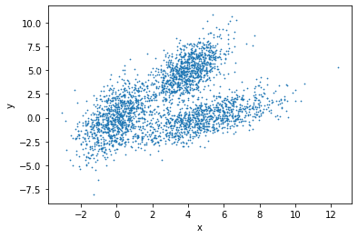

Clustering reveals the following three groups, indicated by different colors:

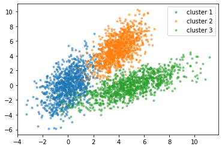


Clustering is divided into two subgroups based on the assignment of data points to clusters:

- Hard: Each data point is assigned to exactly one cluster. One example is [k-means](https://en.wikipedia.org/wiki/K-means_clustering) clustering.

- Soft: Each data point is assigned a probability or likelihood of being in a cluster. One example is [expectation-maximization](https://en.wikipedia.org/wiki/Expectation%E2%80%93maximization_algorithm) (EM) algorithm.

> <agenda-title></agenda-title>
>
> In this tutorial, we will cover:
>
> 1. TOC
> {:toc}
>
{: .agenda}


# Types of clustering algorithms

There are many algorithms available for data clustering which use different ways to establish similarity between data points. The clustering algorithms can be broadly divided into many categories such as connectivity model, centroid model, density model, distribution model, group model, graph-based model and so on. Some of these are discussed below:

 - Connectivity model: This model assigns higher similarity to data points which are closer in one or multi-dimensional space than those points which are farther away. There are two approaches - first, it categorises all data points into different clusters and then merges the data points in relation to the distances among them. Second, it categorises all data points into one single cluster and then partitions them into different clusters as the distance increases. This model is easy to understand but has problems in handling large datasets. One example is [hierarchical clustering](https://en.wikipedia.org/wiki/Hierarchical_clustering) and its variants.

 - Centroid model: It is an iterative clustering algorithm in which similarity is based on the proximity of a data point to the centroids of the clusters. [K-means](https://en.wikipedia.org/wiki/K-means_clustering) clustering is one example of this model. It needs a number of clusters before running and then divides data points into these many clusters iteratively. Therefore, to use k-means, users should acquire some prior knowledge about the dataset.

 - Density model: This model searches one or multi-dimensional space for dense regions (having a large number of data points in a small region). A popular example of a density model is [DBSCAN](https://en.wikipedia.org/wiki/DBSCAN).

In this tutorial, we will go through three clustering algorithms - hierarchical clustering, k-means, DBSCAN, and a comparison between these methods. Further, we will discuss their parameters and how to apply them to find clusters in the [iris flower dataset](https://en.wikipedia.org/wiki/Iris_flower_data_set) and a few other datasets.


# Clustering distance measures

Clustering groups similar data points and requires a metric or measure to compute a degree of similarity or dissimilarity of data points. Two main types of measures are distance and similarity. The smaller the distance between two objects, the more similar they are to each other. Moreover, the type of distance measure depends on the problem and one measure may not work with all kinds of problems.

Many clustering algorithms use distance measures to determine the similarity or dissimilarity between any pair of data points. A valid distance measure should be symmetric and obtains its minimum value (usually zero) in case of identical data points. By computing the distance or (dis)similarity between each pair of observations, a dissimilarity or distance matrix is obtained.

The choice of a distance measure is crucial in clustering. It defines how the similarity of two elements `(x, y)` is calculated as it influences the shape of the clusters. The classical distance measures are [euclidean](https://en.wikipedia.org/wiki/Euclidean_distance) and [manhattan](https://en.wikipedia.org/wiki/Taxicab_geometry) distances. For the most common clustering algorithms, the default distance measure is euclidean. If the euclidean distance is chosen, then observations having high magnitudes of their respective features will be clustered together. The same holds for the observations having low magnitudes of their respective features. In Figure 3, we group the cells using euclidean distance and their distance matrix.

 across three features (G1, G2, G3)")


> <question-title></question-title>
>
> 1. Why are there zeroes along the diagonal of the above example distance matrix?
> 1. Is there any symmetry in this matrix?
>
> > <solution-title></solution-title>
> >
> > 1. The distance between a point to itself is zero.
> > 1. The distance between point *a* to point *b* is the same as the distance between point *b* to point *a* using the Euclidean distance metric.
> >
> {: .solution }
>
{: .question }

Other dissimilarity measures exist such as correlation-based distances, which are widely used for gene expression data analyses. Correlation-based distance considers two objects to be similar if their features are highly correlated, even though the observed values may be far apart in terms of euclidean distance. The distance between the two objects is 0 when they are perfectly correlated. [Pearson’s correlation](https://en.wikipedia.org/wiki/Pearson_correlation_coefficient) is quite sensitive to outliers. This does not matter when clustering samples because the correlation is over thousands of genes. However, it is important to be aware of the possible impact of outliers. This can be mitigated by using [Spearman’s correlation](https://en.wikipedia.org/wiki/Spearman%27s_rank_correlation_coefficient) instead of Pearson’s correlation.

# Different clustering approaches

## Hierarchical clustering

Hierarchical clustering creates a hierarchy of clusters. It starts with all the data points assigned to clusters of their own. Then, the two nearest clusters are merged into the same cluster. In the end, the algorithm terminates when there is only one cluster left.

Following are the steps that are performed during hierarchical clustering:

1. In the beginning, every data point in the dataset is treated as a cluster which means that we have `N` clusters at the beginning of the algorithm for a dataset of size `N`.

2. The distance between all the points is calculated and two points closest to each other are merged together to form a new cluster.

3. Next, the point which is closest to the cluster formed in step 2, will be merged to the cluster.

4. Steps 2 and 3 are repeated until one large cluster is created.

5. Finally, this large cluster is divided into K small clusters with the help of dendrograms.

Let’s now see how dendrograms help in hierarchical clustering.

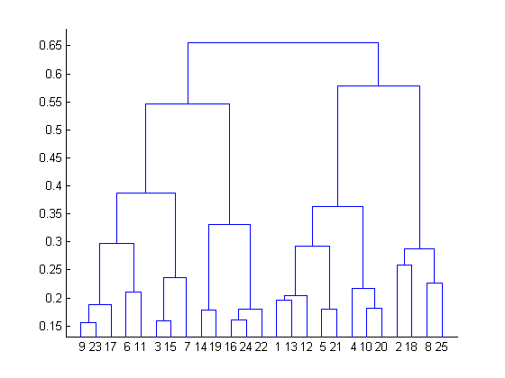

All data points are chosen at the bottom and each one is assigned to a separate cluster. Then, the two closest clusters are merged till just one cluster is left at the top. From the dendrogram thus formed, the distance between two clusters can be determined by computing the height at which two clusters are merged.

By looking at the dendrogram, the clusters can be observed showing different groups in the best way. The optimal number of clusters is the number of vertical lines in the dendrogram cut by a horizontal line that can transverse maximum distance vertically without intersecting a cluster.

In the above example, the best choice of the number of clusters will be 4 as the red horizontal line in the dendrogram below covers maximum vertical distance AB. For more details, please read [here](https://www.analyticsvidhya.com/blog/2016/11/an-introduction-to-clustering-and-different-methods-of-clustering/).
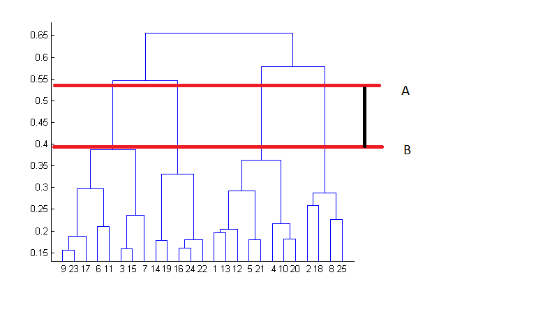


This algorithm explained above uses the bottom-up approach. It is also possible to follow the top-down approach starting with all data points assigned in the same cluster and recursively performing splits till each data point is assigned a separate cluster. The decision of merging two clusters is taken based on the proximity of these clusters.

> <comment-title>Background of the iris dataset</comment-title>
> The iris flower dataset or Fisher’s iris dataset is a multivariate dataset introduced by the British statistician and biologist Ronald Fisher in his 1936 paper ().
> Each row of the table represents an iris flower, including its species and dimensions of its botanical parts, sepal and petal, in centimeters.
> For more history of this dataset read here [Wikipedia](https://en.wikipedia.org/wiki/Iris_flower_data_set).
{: .comment}


At the first step, we should upload the iris dataset and two other datasets which will be used at the end of the tutorial.

> <hands-on-title>Data upload</hands-on-title>
>
> 1. **Import**  the file `iris.csv` from [Zenodo](https://zenodo.org/record/3813447/files/iris.csv) or from the data library
>
>    ```
>    https://zenodo.org/record/3813447/files/iris.csv
>    https://zenodo.org/record/3813447/files/circles.csv
>    https://zenodo.org/record/3813447/files/moon.csv
>    ```
>
>    
>    
>
>
> 2. **Rename**  the datasets to `iris`, `circles` and `moon` respectively.
>
>    
>
> 3. Check the **datatype**
>    - Click on the history item to expand it to get more information.
>    - The datatype of the iris dataset should be `csv`.
>    - **Change**  the datatype *if* it is different than `csv`.
>      - Option 1: Datatypes can be **autodetected**
>      - Option 2: Datatypes can be **manually set**
>
>    
>    
>
{: .hands_on}

Our objective is to categorise similar flowers in different groups (Figure 6). We know that we have **3** species of iris flowers (versicolor, virginica, setosa) with
**50** samples for each. These species look very much alike as shown in the figure below.


In our dataset, we have the following features measured for each flower: [petal](https://en.wikipedia.org/wiki/Petal) length, petal width, [sepal](https://en.wikipedia.org/wiki/Sepal) length, sepal width

Figure 7 shows the dendrogram of these data.

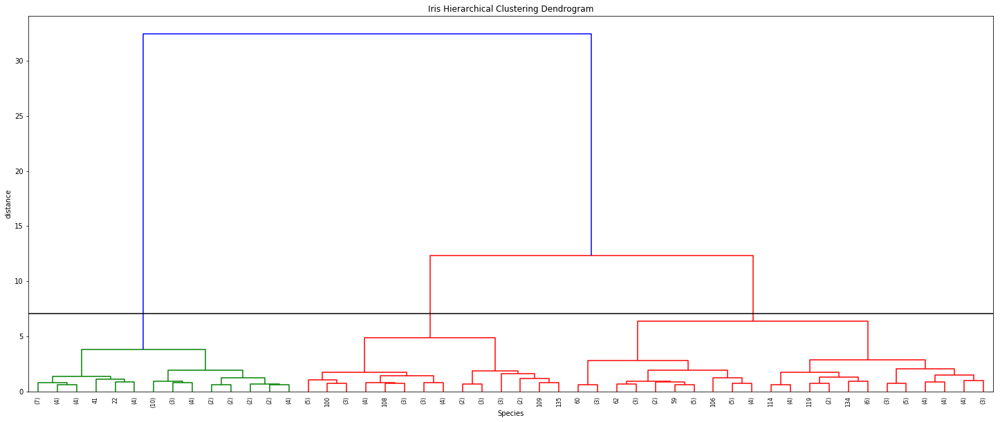


We will apply hierarchical clustering to the iris dataset to find clusters based on two features (of flowers) - sepal length and width.
**Hint**: Please find the `Numeric Clustering` tool in the `Statistics` tool section.

> <hands-on-title>Hierarchical clustering</hands-on-title>
>
> 1. **Numeric Clustering**  with the following clustering parameters:
>    - *"Select the format of input data"*: `Tabular Format (tabular,txt)`
>        -  *"Data file with numeric values"*: `iris`
>        -  *"Does the dataset contain header"*: `Yes`
>        -  *"Choose how to select data by column"*: `All columns EXCLUDING some by column header name(s)`
>            -  *"Type header name(s)"*: `Species`
>        -  *"Clustering Algorithm"*: `Hierarchical Agglomerative Clustering`
>        - In *"Advanced options"*
>            -  *"Number of clusters"*: `2`
>            -  *"Affinity"*: `Euclidean`
>            -  *"Linkage"*: `ward`
>
> 2. Rename the generated file to `Hierarchical clustering`
{: .hands_on}

If you view the result table, you can see the last column is the label for each cluster and as you see, all the setosa samples are grouped in one cluster and two other species (versicolor and virginica) are grouped in the second cluster. From Figure 6, it is obvious that versicolor and virginica are more similar to each other.

### Visualize hierarchical clustering

The resulting candidate clustering can be visualized using the `Scatterplot with ggplot2` tool. Each sample is color-coded based on its clustering for that sample.
Let's visualize the clustering results to see how groups have been built. **Hint**: Please find the `Scatterplot with ggplot2` tool in the `Graph/Display data` tool section.

> <hands-on-title>Visualize hierarchical clustering result</hands-on-title>
>
> 1. **Scatterplot with ggplot2**  with the following parameters:
>    -  *"Input tabular dataset"*: **Hierarchical clustering**
>    - *"Column to plot on x-axis"*: `1`
>    - *"Column to plot on y-axis"*: `2`
>    - *"Plot title"*: `Hierarchical clustering in iris data`
>    - *"Label for x axis"*: `Sepal length`
>    - *"Label for y axis"*: `Sepal width`
>    - In *"Advanced Options"*:
>        - *"Data point options"*: `User defined point options`
>            - *"relative size of points"*: `2.0`
>        - *"Plotting multiple groups"*: `Plot multiple groups of data on one plot`
>            - *"column differentiating the different groups"*: `6`
>            - *"Color schemes to differentiate your groups"*: `Set 2 - predefined color pallete`
>    - In *"Output options"*:
>        -  *"width of output"*: `7.0`
>        -  *"height of output"*: `5.0`
>        -  *"dpi of output"*: `175.0`
>
> 2. **View**  the resulting plot
> 3. Rename to `Hierarchical scatter plot`
{: .hands_on}

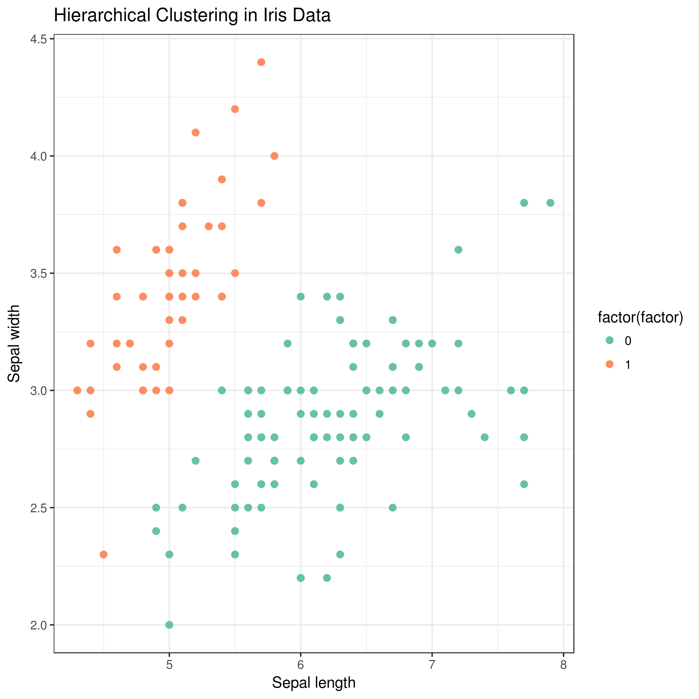


## K-means clustering

K-means clustering is the most commonly used unsupervised machine learning algorithm for partitioning a given dataset into a set of k clusters, where k represents the number of groups pre-specified by the user. In k-means clustering, each cluster is represented by its center or centroid which corresponds to the mean of points assigned to the cluster. The basic idea behind k-means clustering is to define clusters and their centroids such that the total intra-cluster variation is minimized.

K-means is popular because of its speed and scalability. Many variants of the k-means algorithm such as [Lloyd's algorithm](https://en.wikipedia.org/wiki/Lloyd%27s_algorithm), k-medians algorithms and so on are available. The standard algorithm defines the total within-cluster variation as the sum of squared Euclidean distances between items and the corresponding centroid. K is a hyperparameter of the algorithm and the k-means algorithm can be summarized as follows:

1. Specify the number of clusters (k) to be created (to be specified by users).

2. Select k data points randomly from the dataset as the initial cluster centers or means.

3. Assign each data point to their closest centroid, based on the euclidean distance between a data point and its centroid.

4. For each of the k clusters update cluster centroid by calculating the new mean values of all the data points in the cluster.

5. Iteratively minimize the total within the sum of squares: iterate steps 3 and 4 until the cluster assignments stop changing or the maximum number of iterations is reached.

The parameters that minimize the cost function are learned through an iterative process of assigning data points to clusters and then moving the clusters. A restriction for the k-means algorithm is that the dataset should be continuous.

> <hands-on-title>K-means clustering</hands-on-title>
>
> 1. **Numeric Clustering**  with the following clustering parameters:
>    - *"Select the format of input data"*: `Tabular Format (tabular,txt)`
>        -  *"Data file with numeric values"*: `iris`
>        -  *"Does the dataset contain header"*: `Yes`
>        -  *"Choose how to select data by column"*: `All columns EXCLUDING some by column header name(s)`
>            -  *"Type header name(s)"*: `Species`
>        -  *"Clustering Algorithm"*: `KMeans`
>        - In *"Advanced options"*
>            -  *"Number of clusters"*: `2`
> 2. Rename the generated file to `k-means clustering`
{: .hands_on}


### Visualize k-means clustering

> <hands-on-title>Visualize k-means clustering result</hands-on-title>
>
> 1. **Scatterplot with ggplot2**  with the following parameters:
>    -  *"Input tabular dataset"*: **k-means clustering**
>    - *"Column to plot on x-axis"*: `1`
>    - *"Column to plot on y-axis"*: `2`
>    - *"Plot title"*: `K-means clustering in iris data`
>    - *"Label for x axis"*: `Sepal length`
>    - *"Label for y axis"*: `Sepal width`
>    - In *"Advanced Options"*:
>        - *"Data point options"*: `User defined point options`
>            - *"relative size of points"*: `2.0`
>        - *"Plotting multiple groups"*: `Plot multiple groups of data on one plot`
>            - *"column differentiating the different groups"*: `6`
>            - *"Color schemes to differentiate your groups"*: `Set 2 - predefined color pallete`
>    - In *"Output options"*:
>        -  *"width of output"*: `7.0`
>        -  *"height of output"*: `5.0`
>        -  *"dpi of output"*: `175.0`
> 2. **View**  the resulting plot
> 3. Rename to `k-means scatter plot`
{: .hands_on}

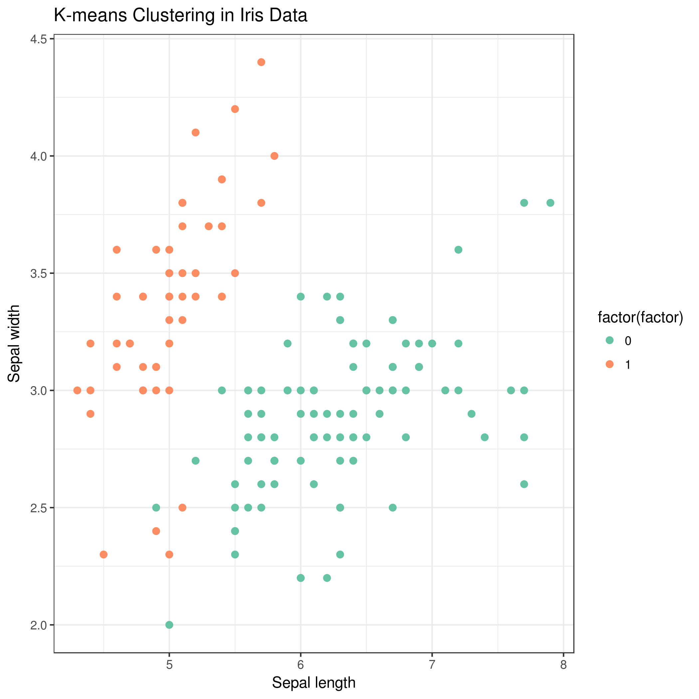


> <question-title></question-title>
>
> How to choose the right number of expected clusters (k)?
>
>
> > <solution-title></solution-title>
> >
> > Major difficulty found with k-means is the choice of the number of clusters. Different methods are proposed to solve this problem.
> > Here, we provide a simple solution. The idea is to compute k-means clustering using different values of clusters k. Next, the within sum of squares is drawn according to the number of clusters. The location of a bend (knee) in the plot is generally considered as an indicator of the appropriate number of clusters.
> > 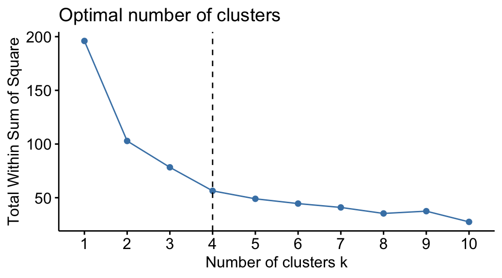
> > The plot above represents the variance within the clusters. It decreases as k increases, but it can be seen as a bend (or “elbow”) at k = 4. This bend indicates that
> > additional clusters beyond the fourth have little value.
> {: .solution}
{: .question}


> <question-title></question-title>
>
> What are the differences between k-means and hierarchical clustering techniques
>
> > <solution-title></solution-title>
> >
> > 1. Hierarchical clustering has difficulties in handling large data well but k-means clustering can. This is because the time complexity (of Lloyd's variant) of k-means is linear (O(nkdi), n = number of data points, k = number clusters, d = data point dimensions and i = number of iterations) while the time-complexity of the optimal hierarchical clustering is quadratic (O(n2)).
> >
> > 2. K-means works well when the clusters are spherical (like circle in 2D, sphere in 3D) in shape. But, when the clusters are of arbitrary geometrical shapes, the performance suffers.
> >
> > 3. K-means clustering requires prior knowledge of the number of clusters. It does not learn the number of clusters from data. But, for the hierarchical clustering it is not necessary.
> >
> {: .solution }
>
{: .question }


## DBSCAN clustering

DBSCAN (Density-based spatial clustering of applications with noise) is a popular clustering algorithm and finds clusters as regions of high density followed by regions of low density. Clusters found by DBSCAN can be of any shape, as opposed to k-means which works well if the clusters are spherical in shape. The central component of the DBSCAN algorithm are the core samples which are present in the areas of high density. A cluster is, therefore, a set of core samples close to one other (measured by some distance measure) and a set of non-core samples that are close to core samples (but are not core samples themselves). There are two important parameters in DBSCAN algorithm - `min_samples` is the number of samples in a neighborhood for a point to be considered as a core point and `eps` is the maximum distance (between two samples) for a sample to be considered as in the neighborhood of the other. Higher the value of `min_samples` or lower the value of eps indicate higher density necessary to form a cluster. DBSCAN does not require one to specify the number of clusters in the data a priori, as opposed to k-means.

> <hands-on-title>DBSCAN clustering</hands-on-title>
>
> 1. **Numeric Clustering**  with the following clustering parameters:
>    - *"Select the format of input data"*: `Tabular Format (tabular,txt)`
>        -  *"Data file with numeric values"*: `iris`
>        -  *"Does the dataset contain header"*: `Yes`
>        -  *"Choose how to select data by column"*: `All columns EXCLUDING some by column header name(s)`
>            -  *"Type header name(s)"*: `Species`
>        -  *"Clustering Algorithm"*: `DBSCAN`
> 2. Rename the generated file to `DBSCAN clustering`
{: .hands_on}


### Visualise DBSCAN clustering

> <hands-on-title>Visualize DBSCAN clustering result</hands-on-title>
>
> 1. **Scatterplot with ggplot2**  with the following parameters:
>    -  *"Input tabular dataset"*: **DBSCAN clustering**
>    - *"Column to plot on x-axis"*: `1`
>    - *"Column to plot on y-axis"*: `2`
>    - *"Plot title"*: `DBSCAN clustering in iris data`
>    - *"Label for x axis"*: `Sepal length`
>    - *"Label for y axis"*: `Sepal width`
>    - In *"Advanced Options"*:
>        - *"Data point options"*: `User defined point options`
>            - *"relative size of points"*: `2.0`
>        - *"Plotting multiple groups"*: `Plot multiple groups of data on one plot`
>            - *"column differentiating the different groups"*: `6`
>            - *"Color schemes to differentiate your groups"*: `Set 2 - predefined color pallete`
>    - In *"Output options"*:
>        -  *"width of output"*: `7.0`
>        -  *"height of output"*: `5.0`
>        -  *"dpi of output"*: `175.0`
> 2. **View**  the resulting plot:
> 3. Rename to `DBSCAN scatter plot`
{: .hands_on}


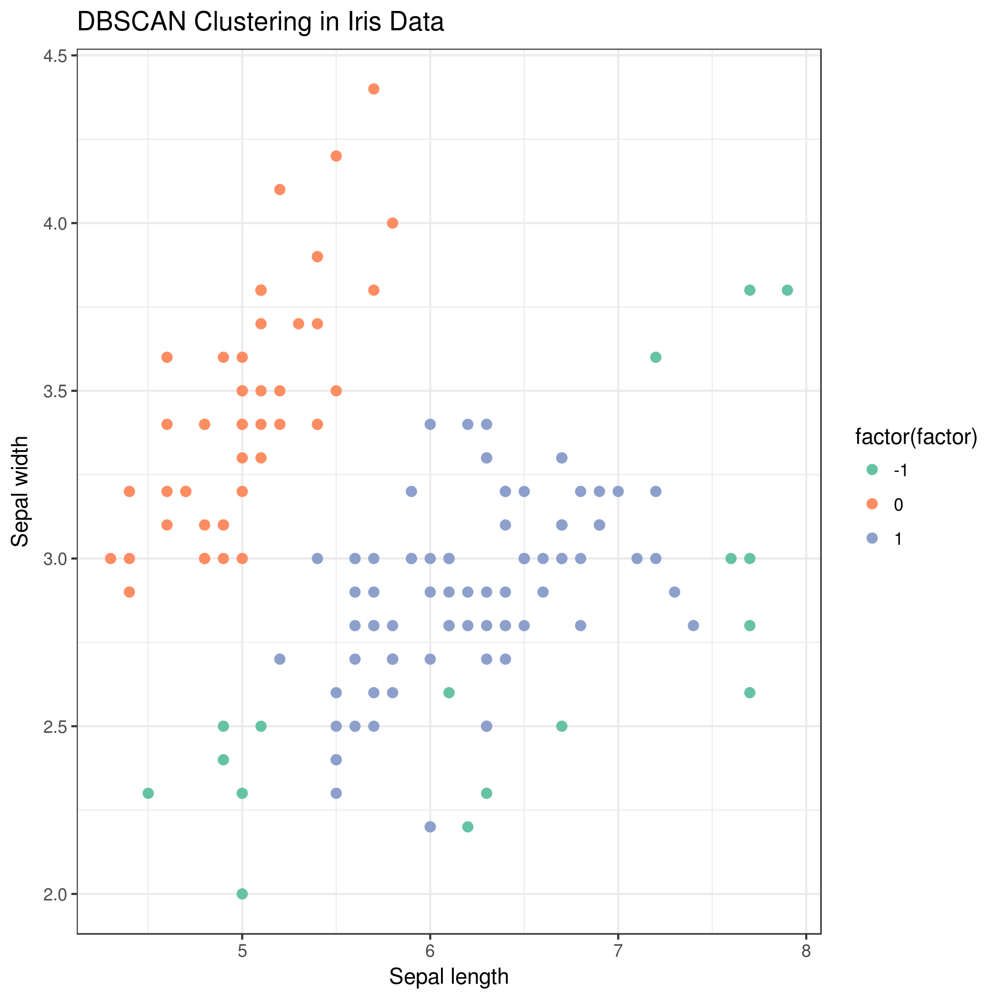


You will also notice that the green points (factor = -1) in the plot are not contained within any cluster. DBSCAN does not necessarily categorize every data point, and is therefore works very well with handling outliers in a dataset.

> <question-title></question-title>
>
> How can we evaluate the clustering results?
>
>
> > <solution-title></solution-title>
> >
> > Clustering is an unsupervised learning algorithm; there are no labels or ground truth to compare with the clusters. However, we can still evaluate the performance of the algorithm using intrinsic measures.
> > There is a performance measure for clustering evaluation which is called the [silhouette coefficient](https://en.wikipedia.org/wiki/Silhouette_(clustering)). It is a measure of the compactness and separation of the clusters.
> > It increases as the quality of the clusters increase; it is large for compact clusters that are far from each other and small for large, overlapping clusters. The silhouette coefficient is calculated per instance; for a set of instances, it is calculated as the mean of the individual sample score.
> {: .solution}
{: .question}

# Applying clustering algorithms on multiple datasets

We can apply the same steps on the other datasets such `moon` and `circles` datasets (already imported) which are generated using [scikit-learn](https://scikit-learn.org/stable/datasets/index.html#generated-datasets) methods.

## Visualise datasets

> <hands-on-title>Visualize scatter plot of data</hands-on-title>
>
> 1. **Scatterplot with ggplot2**  with the following parameters:
>
>    
>    -  *"Input tabular dataset"*: `circles` and `moon` as **multiple datasets**
>    - *"Column to plot on x-axis"*: `1`
>    - *"Column to plot on y-axis"*: `2`
>    - *"Plot title"*: `Scatter Plot`
>    - *"Label for x axis"*: `X`
>    - *"Label for y axis"*: `Y`
>    - In *"Output options"*:
>        -  *"width of output"*: `7.0`
>        -  *"height of output"*: `5.0`
>        -  *"dpi of output"*: `175.0`
> 2. **View**  the resulting plots
{: .hands_on}

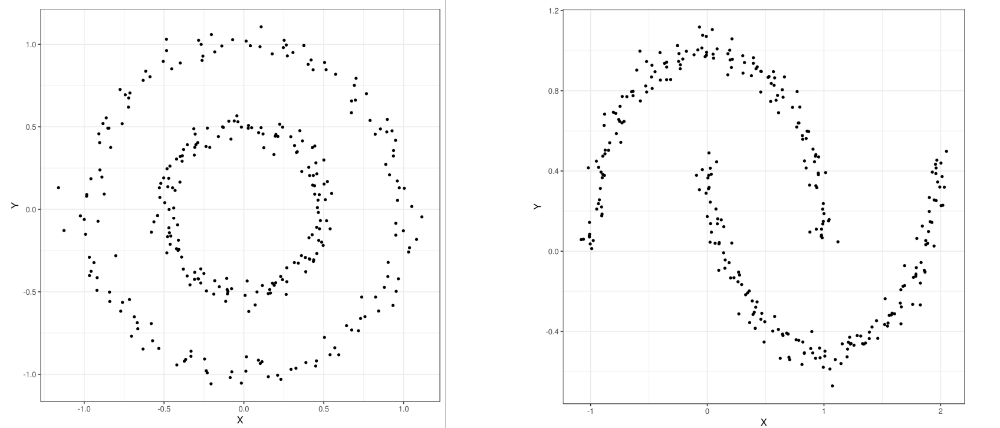


## Find clusters

Now you can find clusters in these datasets using the aforementioned algorithms.

> <hands-on-title>Hierarchical clustering of circles and moon datasets</hands-on-title>
>
> 1. **Numeric Clustering**  with the following clustering parameters:
>
>    
>    - *"Select the format of input data"*: `Tabular Format (tabular,txt)`
>        -  *"Data file with numeric values"*: `circles` and `moon` as **multiple datasets**
>        -  *"Does the dataset contain header"*: `Yes`
>        -  *"Choose how to select data by column"*: `All columns`
>        -  *"Clustering Algorithm"*: `Hierarchical Agglomerative Clustering`
>        - In *"Advanced option"*
>            -  *"Number of clusters"*: `2`
>            -  *"Affinity"*: `Euclidean`
>            -  *"Linkage"*: `ward`
> 2. Rename the generated files to `circles hierarchical clustering` and `moon hierarchical clustering` respectively
{: .hands_on}

## Visualise clusters

Then, you can visualize the clustering results using the following steps:

> <hands-on-title>Visualize hierarchical clustering result on circles and moon datasets.</hands-on-title>
>
> 1. **Scatterplot with ggplot2**  with the following parameters:
>
>    
>    -  *"Input tabular dataset"*: `circles hierarchical clustering` and `moon hierarchical clustering` as **multiple datasets**
>    - *"Column to plot on x-axis"*: `1`
>    - *"Column to plot on y-axis"*: `2`
>    - *"Plot title"*: `Hierarchical clustering`
>    - *"Label for x axis"*: `X`
>    - *"Label for y axis"*: `Y`
>    - In *"Advanced Options"*:
>        - *"Data point options"*: `User defined point options`
>            - *"relative size of points"*: `2.0`
>        - *"Plotting multiple groups"*: `Plot multiple groups of data on one plot`
>            - *"column differentiating the different groups"*: `3`
>            - *"Color schemes to differentiate your groups"*: `Set 2 - predefined color pallete`
>    - In *"Output options"*:
>        -  *"width of output"*: `7.0`
>        -  *"height of output"*: `5.0`
>        -  *"dpi of output"*: `175.0`
> 2. **View**  the resulting plots
> 3. Rename the generated files to `Circles scatter plot` and `Moon scatter plot` respectively
{: .hands_on}

You can apply the other two algorithms (k-means and DBSCAN) to moon and circles datasets in the same way as explained above. In the k-means algorithm, please use `k=2` and for the DBSCAN algorithm, the parameters should not be the default ones as used earlier. They should be set as follows: for the circles dataset (`maximum neighborhood distance=0.2` and `minimal core point density=5`) and for the moon dataset (`maximum neighborhood distance=0.3` and `minimal core point density=4`). You can see the scatter plots of the clustering results for all three clustering algorithms in Figure 13 and 14.

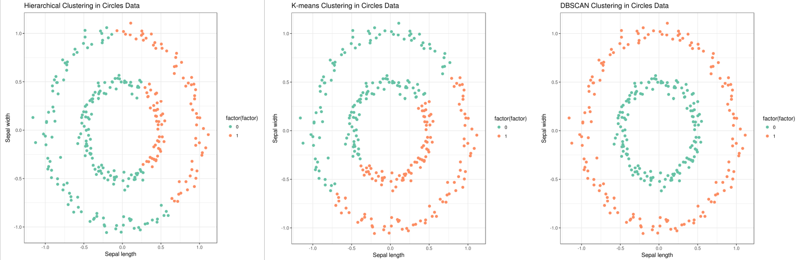

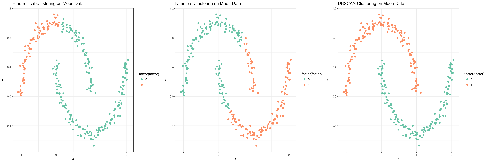


# Conclusion

In this tutorial, we discussed 3 clustering algorithms which are used to discover structures or patterns in unlabeled data. You learned about the hierarchical, k-means and DBSCAN algorithms. By following steps specified for each clustering tool, we learned how to perform clustering and visualize results using clustering and plotting tools, respectively in Galaxy. There are many other clustering approaches which can be tried out on these datasets to find how they perform and how they compare to the 3 clustering algorithms explained in this tutorial. Different datasets can also be analysed using these algorithms. The clustering algorithms have some parameters which can be altered while performing the analyses to see if they affect the clustering or not. While using clustering algorithms, we need to take care of some important aspects like treating outliers in data and making sure each cluster has sufficient population. Some data pre-processors can also be used to clean the datasets.
