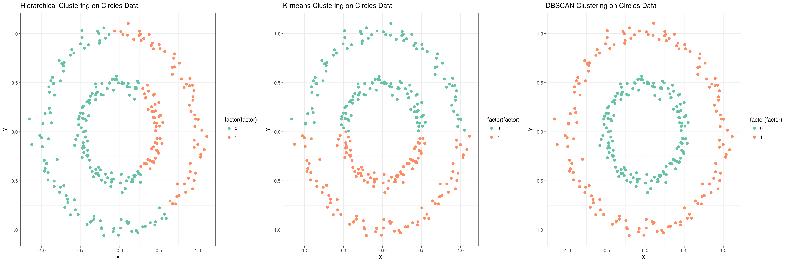

# Introduction
{:.no_toc}

The goal of unsupervised learning is to discover hidden structure or patterns in unlabeled training data. In this tutorial we will discuss an unsupervised learning task called clustering.   
Clustering is the grouping of specific objects based on their characteristics and their similarities. These groups are called clusters. A cluster consists of data object with high inter similarity and low intra similarity. It means members of the same cluster, are more similar to each other by a given metric than they are to the members of the other clusters. The goal of clustering is to subdivide a set of items in such a way that similar items fall into the same cluster, whereas dissimilar items fall in different clusters. This brings up two questions: first, how do we decide what is similar; and second, how do we use this to cluster the items? 
Clustering is central to many bioinformatics research. In particular, clustering helps at analyzing unstructured and high-dimensional data in the form of sequences, expressions, texts and images. For example clustering of gene expressions provides understanding gene functions, cellular processes, subtypes of cells and gene regulations.

For example, in biology, clustering is often one of the first steps in gene expression analysis and is used to find groups of genes with similar expression patterns.

We represent an observation as an n-dimensional vector. For example, assume that your training data consists of the samples plotted in the following Figure 1:

>    

Clustering reveal the following three groups, indicated by different colors:

>    


Broadly speaking, clustering can be divided into two subgroups :

- Hard Clustering: Each data point either belongs to a cluster completely or not.
	
- Soft Clustering: Instead of putting each data point into a separate cluster, a probability or likelihood of that data point to be in those clusters is assigned. 

The goal of clustering is to determine the internal grouping in a set of unlabeled data. But how to decide what constitutes a good clustering? It can be shown that there is no absolute best criterion which would be independent of the final aim of the clustering. Consequently, the users should apply an appropriate criterion based on the problem. 


> ### Agenda
>
> In this tutorial, we will cover:
>
> 1. TOC
> {:toc}
>
{: .agenda}


# Types of clustering algorithms

Since clustering is a subjective task, there are many algorithms for data clustering. Every method follows a different set of rules for defining similarity. There are many clustering algorithms known. But few of the algorithms are used popularly and we can categorized them as follows: 

 - Connectivity models: As the name suggests, these models are based on the notion that the data points closer in data space exhibit more similarity to each other than the data points lying farther away. These models can follow two approaches. In the first approach, they start with classifying all data points into separate clusters and then aggregating them as the distance decreases. In the second approach, all data points are classified as a single cluster and then partitioned as the distance increases. Also, the choice of distance function is subjective. These models are very easy to interpret but lacks scalability for handling big datasets. Examples of these models are hierarchical clustering algorithm and its variants.

 - Centroid models: These are iterative clustering algorithms in which the notion of similarity is derived by the closeness of a data point to the centroid of the clusters. K-means clustering algorithm is a popular algorithm that falls into this category. In these models, the number of clusters required at the end have to be mentioned beforehand, which makes it important to have prior knowledge of the dataset. These models run iteratively to find the local optima.

 - Density Models: These models search the data space for areas of varied density of data points in the data space. It isolates various different density regions and assign the data points within these regions in the same cluster. Popular example of density models is DBSCAN.

 - Distribution models: These clustering algorithms are based on the notion of how probable it is that all data points in the cluster belong to the same distribution, for example normal, Gaussian. These models often suffer from overfitting. A popular example of these models is expectation-maximization algorithm which uses multivariate normal distributions.


Now, in this tutorial, we will be taking you through three of the most popular clustering algorithms in detail, hierarchical clustering, k-means and DBSCAN and a comparison between these methods.

 In the following, We will discuss these clustering algorithm and their parameters and how to apply them to categorize iris data and some other data sets. 


# Clustering Distance Measures

Since clustering is the grouping of similar objects, some sort of measure that can determine whether two objects are similar or dissimilar is required. There are two main type of measures used to estimate this relation: distance measures and similarity measures. The notions of distance and similarity are related, since the smaller the distance between two objects, the more similar they are to each other. All measures refer to the feature values in some way, but they consider different properties of the feature vector. There is no optimal similarity measure, since the usage depends on the task.

Many clustering algorithms use distance measures to determine the similarity or dissimilarity between any pair of objects.  A valid distance measure should be symmetric and obtains its minimum value (usually zero) in case of identical vectors.
The clustering requires some methods for computing the distance or the (dis)similarity between each pair of observations. The result of this computation is known as a dissimilarity or distance matrix.

The choice of distance measures is a critical step in clustering. It defines how the similarity of two elements (x, y) is calculated and it will influence the shape of the
clusters. The classical distance measures are Euclidean and Manhattan distances and for most common clustering tools, the default distance measure is Euclidean. If Euclidean distance is chosen, then observations with high values of features will be clustered together. The same holds true for observations with low values of features. In Figure 3, we are trying to group the cells using Euclidean distance and this distance matrix.

 across three features (G1, G2, G3)")


 > ###  Questions
 >
 > 1. Why are there zeroes along the diagonal of the above example distance matrix?
 > 1. Is there any symmetry in this matrix?
 >
 > > ###  Solution
 > >
 > > 1. The distance between a point to itself is zero.
 > > 1. The distance between point *a* to point *b* is the same as the distance between point *b* to point *a* using the Euclidean distance metric.
 > >
 > {: .solution }
 >
 {: .question }

Other dissimilarity measures exist such as correlation-based distances, which are widely used for gene expression data analyses. Correlation-based distance considers two objects to be similar if their features are highly correlated, even though the observed values may be far apart in terms of Euclidean distance. The distance between two objects is 0 when they are perfectly correlated. Pearson’s correlation is quite sensitive to outliers. This does not matter
when clustering samples, because the correlation is over thousands of genes. During clustering genes, it is important to be aware of the possible impact of outliers. This
can be mitigated by using Spearman’s correlation instead of Pearson’s correlation.

# Hierarchical Clustering

Before seeing hierarchical clustering in action, let us first understand the theory behind the hierarchical clustering. Hierarchical clustering, as the name suggests is an algorithm that builds hierarchy of clusters. This algorithm starts with all the data points assigned to a cluster of their own. Then two nearest clusters are merged into the same cluster. In the end, this algorithm terminates when there is only a single cluster left.

Following are the steps that are performed during hierarchical clustering:

1. In the beginning, every data point in the dataset is treated as a cluster which means that we have N clusters at the beginning of the algorithm.

2. The distance between all the points is calculated and two points closest to each other are joined together to a form a cluster. 

3. Next, the point which is closest to the cluster formed in step 2, will be joined to the cluster.

4. Steps 2 and 3 are repeated until one big cluster is formed.

5. Finally, the big cluster is divided into K small clusters with the help of dendrograms. 

Let’s now see how dendrograms help in hierarchical clustering. 

>    

At the bottom, we start with data points, each assigned to separate clusters. Two closest clusters are then merged till we have just one cluster at the top. The height in the dendrogram at which two clusters are merged represents the distance between two clusters in the data space.

The decision of the number of clusters that can best depict different groups can be chosen by observing the dendrogram. The best choice of the number of clusters is the number of vertical lines in the dendrogram cut by a horizontal line that can transverse the maximum distance vertically without intersecting a cluster.

In the above example, the best choice of number of clusters will be 4 as the red horizontal line in the dendrogram below covers maximum vertical distance AB.
>    


This algorithm has been implemented above using bottom up approach. It is also possible to follow top-down approach starting with all data points assigned in the same cluster and recursively performing splits till each data point is assigned a separate cluster.
The decision of merging two clusters is taken on the basis of closeness of these clusters. 


Now we will apply hierarchical clustering to Iris data set, and learn to measure its performance. At the first step, we should upload the Iris data set.

> ###  Background
> The Iris flower data set or Fisher’s Iris data set is a multivariate dataset introduced by the British statistician and biologist Ronald Fisher in his 1936 paper ().
> Each row of the table represents an iris flower, including its species and dimensions of its botanical parts, sepal and petal, in centimeters.
> For more history of this dataset read here [Wikipedia](https://en.wikipedia.org/wiki/Iris_flower_data_set).
{: .comment}


> ###  Hands-on: Data upload
>
> 1. **Import**  the file `iris.csv` from [Zenodo](https://zenodo.org/record/3813447/files/iris.csv) or from the data library
>
>    ```
>    https://zenodo.org/record/3813447/files/iris.csv
>    ```
>
>    
>    
>
>
> 2. **Rename**  the dataset to `iris`
>
>    
>
> 3. Check the **datatype**
>    - Click on the history item to expand it to get more information.
>    - The datatype of the iris dataset should be `csv`.
>    - **Change**  the datatype *if* it is different than `csv`.
>      - Option 1: Datatypes can be **autodetected**
>      - Option 2: Datatypes can be **manually set**
>
>    
>    
>
{: .hands_on}

Our objective is to categorize the similar flowers in different groups (Figure 6). We know that we have **3** species of iris flowers (setosa, versicolor, virginica) with
**50** samples for each. These species look very much alike as shown on the figure below.


In our dataset, we have the following features measured for each sample: Petal length, Petal width, Sepal length, Sepal width

Figure 7 shows the dendrogram of these data.

>    


For the clustering purpose, the tools we will use require tab-separated files, so in the first step we will convert the file from comma-separated to tab-separated format. Galaxy has built-in format converters we can use for this.


> ###  Hands-on: Converting dataset format
>
> 1. **Convert**  the CSV file (comma-separated values) to tabular format (tsv; tab-separated values)
>
>    
>
> 2. **Rename**  the resulting dataset to `iris tabular`
>
>   >
{: .hands_on}

At the first step we use 

> ###  Hands-on: Hierarchical clustering
>
> 1. **Numeric Clustering**  with the following clustering parameters:
>    - *"Select the format of input data"*: `Tabular Format (tabular,txt)`
>        -  *"Data file with numeric values"*: `iris tabular`
>        -  *"Does the dataset contain header"*: `Yes`
>        -  *"Choose how to select data by column"*: `All columns EXCLUDING some by column header name(s)`
>                -  *"Type header name(s)"*: `Species`
>        -  *"Clustering Algorithm"*: `Hierarchical Agglomerative Clustering`
>        - In *"Advanced option"*    
>                -  *"Number of clusters"*: `2`
>                -  *"Affinity"*: `Euclidean`
>                -  *"Linkage"*: `ward`
> 2. Rename the generated file to `Hierarchical clustering`
{: .hands_on}

If you view the result table, you can see the last column is the label for each cluster and as you see, all the setosa samples are grouped in one cluster and two other species (versicolor and virginica) are grouped in the second cluster. From Figure 3 it is obvious that versicolor and virginica are more similar to each other.

## Visulaze the clustering results

The resulting candidate clustering can be visualized using the Scatterplot w ggplot2 tool. Each sample is color-coded based on its clustering for that sample. 
Let's visualize the clustering results to see how groups have been built.

> ###  Hands-on: Visualize hierarchical clustering result
>
> 1. **Scatterplot w ggplot2**  with the following parameters:
>    -  *"Input tabular dataset"*: **Hierarchical clustering**
>    - *"Column to plot on x-axis"*: `1`
>    - *"Column to plot on y-axis"*: `2`
>    - *"Plot title"*: `Hierarchical Clustering in Iris data`
>    - *"Label for x axis"*: `Sepal length`
>    - *"Label for y axis"*: `Sepal width`
>    - In *"Advanced Options"*:
>        - *"Data point options"*: `User defined point options`
>            - *"relative size of points"*: `2.0`
>        - *"Plotting multiple groups"*: `Plot multiple groups of data on one plot`
>            - *"column differentiating the different groups"*: `6`
>            - *"Color schemes to differentiate your groups"*: `Set 2 - predefined color pallete`
>
> 2. **View**  the resulting plot:
>
> 3. Rename to `Hierarchical scatter plot`


>    


# K-means Algorithm

K-means clustering is the most commonly used unsupervised machine learning algorithm for partitioning a given data set into a set of k clusters, where k represents the number of groups pre-specified by the user.
In k-means clustering, each cluster is represented by its center or centroid which corresponds to the mean of points assigned to the cluster.The basic idea behind k-means clustering consists of defining clusters so that the total intra-cluster variation is minimized.
The K-Means is popular because of its speed and scalability. There are several k-means algorithms available. The standard algorithm defines the total within-cluster variation as the sum of squared Euclidean distances between items and the corresponding centroid. K is a the hyperparameter of the algorithm and k-means algorithm can be summarized as follow:

1. Specify the number of clusters (K) to be created (by the analyst)

2. Select randomly k objects from the data set as the initial cluster centers or means

3. Assign each observation to their closest centroid, based on the Euclidean distance between the object and the centroid

4. For each of the k clusters update cluster centroid by calculating the new mean values of all the data points in the cluster. 

5. Iteratively minimize the total within sum of square. That is, iterate steps 3 and 4 until the cluster assignments stop changing or the maximum number of
iterations is reached. 

The parameters that minimize the cost function are learned through an iterative process of assigning observations to clusters and then moving the clusters. The basic restriction for k-means algorithm is that your data should be continuous in nature. It won’t work if data is categorical in nature.

> ###  Hands-on: K-means clustering
>
> 1. **Numeric Clustering**  with the following clustering parameters:
>    - *"Select the format of input data"*: `Tabular Format (tabular,txt)`
>        -  *"Data file with numeric values"*: `iris tabular`
>        -  *"Does the dataset contain header"*: `Yes`
>        -  *"Choose how to select data by column"*: `All columns EXCLUDING some by column header name(s)`
>                -  *"Type header name(s)"*: `Species`
>        -  *"Clustering Algorithm"*: `KMeans`
>        - In *"Advanced option"*    
>                -  *"Number of clusters"*: `2`
> 2. Rename the generated file to `k-means clustering`
{: .hands_on}


> ###  Hands-on: Visualize k-means clustering result
>
> 1. **Scatterplot w ggplot2**  with the following parameters:
>    -  *"Input tabular dataset"*: **k-means clustering**
>    - *"Column to plot on x-axis"*: `1`
>    - *"Column to plot on y-axis"*: `2`
>    - *"Plot title"*: `K-means Clustering in Iris data`
>    - *"Label for x axis"*: `Sepal length`
>    - *"Label for y axis"*: `Sepal width`
>    - In *"Advanced Options"*:
>        - *"Data point options"*: `User defined point options`
>            - *"relative size of points"*: `2.0`
>        - *"Plotting multiple groups"*: `Plot multiple groups of data on one plot`
>            - *"column differentiating the different groups"*: `6`
>            - *"Color schemes to differentiate your groups"*: `Set 2 - predefined color pallete`
>
> 2. **View**  the resulting plot:
>
> 3. Rename to `k-means scatter plot`


>    


> ###  Question
>
> How to choose the right number of expected clusters (k)?
>
>
> > ###  Solution
> >
> > Major difficulty found with k-mean is the choice of the number of clusters. Different methods is proposed to solve this problem. 
> > Here, we provide a simple solution. The idea is to compute k-means clustering using different values of clusters k. Next, the within sum of square is drawn according to the number of clusters. The location of a bend (knee) in the plot is generally considered as an indicator of the appropriate number of clusters.
> > 
> > The plot above represents the variance within the clusters. It decreases as k increases, but it can be seen a bend (or “elbow”) at k = 4. This bend indicates that 
> > additional clusters beyond the fourth have little value. 
> {: .solution}
{: .question}


> ###  Question
>
> What are the differences between k-means and Hierarchical clustering
>
> > ###  Solution
> >
> > Hierarchical clustering can’t handle big data well but k-means clustering can. This is because the time complexity of K Means is linear i.e. O(n) while that of hierarchical clustering is quadratic i.e. O(n2).
> >
> > In k-means clustering, since we start with random choice of clusters, the results produced by running the algorithm multiple times might differ. While results are reproducible in Hierarchical clustering.
> >
> > K-means is found to work well when the shape of the clusters is hyper spherical (like circle in 2D, sphere in 3D).
> >
> > K-means clustering requires prior knowledge of K i.e. no. of clusters you want to divide your data into. But, you can stop at whatever number of clusters you find appropriate in hierarchical clustering by interpreting the dendrogram
> >
> {: .solution}
{: .question}


# Clustering with the DBSCAN algorithm

DBSCAN (Density-Based Spatial Clustering of Applications with Noise) is a popular clustering algorithm and views clusters as areas of high density separated by areas of low density. Due to this rather generic view, clusters found by DBSCAN can be any shape, as opposed to k-means which assumes that clusters are convex shaped. The central component to the DBSCAN is the concept of core samples, which are samples that are in areas of high density. A cluster is therefore a set of core samples, each close to each other (measured by some distance measure) and a set of non-core samples that are close to a core sample (but are not themselves core samples). There are two parameters to the algorithm, maximum neighborhood distance and minimal core point density, which define formally what we mean when we say dense. There are two important parameters in DBSCAN algorithm, min_samples, is the number of samples in a neighborhood for a point to be considered as a core point and eps is the maximum distance between two samples for one to be considered as in the neighborhood of the other. Higher min_samples or lower eps indicate higher density necessary to form a cluster.
DBSCAN does not require one to specify the number of clusters in the data a priori, as opposed to k-means.


> ###  Hands-on: DBSCAN clustering
>
> 1. **Numeric Clustering**  with the following clustering parameters:
>    - *"Select the format of input data"*: `Tabular Format (tabular,txt)`
>        -  *"Data file with numeric values"*: `iris tabular`
>        -  *"Does the dataset contain header"*: `Yes`
>        -  *"Choose how to select data by column"*: `All columns EXCLUDING some by column header name(s)`
>                -  *"Type header name(s)"*: `Species`
>        -  *"Clustering Algorithm"*: `DBSCAN`
> 2. Rename the generated file to `DBSCAN clustering`
{: .hands_on}


> ###  Hands-on: Visualize DBSCAN clustering result
>
> 1. **Scatterplot w ggplot2**  with the following parameters:
>    -  *"Input tabular dataset"*: **DBSCAN clustering**
>    - *"Column to plot on x-axis"*: `1`
>    - *"Column to plot on y-axis"*: `2`
>    - *"Plot title"*: `DBSCAN Clustering in Iris data`
>    - *"Label for x axis"*: `Sepal length`
>    - *"Label for y axis"*: `Sepal width`
>    - In *"Advanced Options"*:
>        - *"Data point options"*: `User defined point options`
>            - *"relative size of points"*: `2.0`
>        - *"Plotting multiple groups"*: `Plot multiple groups of data on one plot`
>            - *"column differentiating the different groups"*: `6`
>            - *"Color schemes to differentiate your groups"*: `Set 2 - predefined color pallete`
>
> 2. **View**  the resulting plot:
>
> 3. Rename to `DBSCAN scatter plot`


>    


You will also notice that the blue point in the plot is not contained within any cluster. DBSCAN does not necessarily categorize every data point, and is therefore terrific with handling outliers in the dataset. 

> ###  Question
>
> How we can evaluate the clustering results?
>
>
> > ###  Solution
> >
> > Clustering is an unsupervised learning algorithm; there are no labels or ground truth to compare with the clusters. However, we can still evaluate the performance of
the algorithm using intrinsic measures.
> > There is a performance measure for clustering evaluation which is called the silhouette coefficient. The silhouette coefficient is a measure of the compactness and separation of the clusters. 
> > It increases as the quality of the clusters increase; it is large for compact clusters that are far from each other and small for large, overlapping clusters. The silhouette coefficient is calculated per instance; for a set of instances, it is calculated as the mean of the individual samples scores.
> {: .solution}
{: .question}

# Applying the clustering algorithms on the other datasets

You can do the same steps on the other data sets, moon and circles. First, import the data files, [moon.csv](https://zenodo.org/record/3813447/files/moon.csv) and [circles.csv](https://zenodo.org/record/3813447/files/circles.csv) from Zenodo or data library and rename them to `moon` and `circles` respectively. 

> ###  Hands-on: Visualize scatter plot of data
>
> 1. **Scatterplot w ggplot2**  with the following parameters:
>    -  *"Input tabular dataset"*: input datasets selected with **Multiple datasets**
>
>    
>    - *"Column to plot on x-axis"*: `1`
>    - *"Column to plot on y-axis"*: `2`
>    - *"Plot title"*: `Scatter Plot`
>    - *"Label for x axis"*: `X`
>    - *"Label for y axis"*: `Y`
> 2. **View**  the resulting plots


>    

Now you can cluster these data using the introduced algorithms.

> ###  Hands-on: Hierarchical clustering of circles data
>
> 1. **Numeric Clustering**  with the following clustering parameters:
>    - *"Select the format of input data"*: `Tabular Format (tabular,txt)`
>        -  *"Data file with numeric values"*: `cirlces tabular`
>        -  *"Does the dataset contain header"*: `Yes`
>        -  *"Choose how to select data by column"*: `All`
>        -  *"Clustering Algorithm"*: `Hierarchical Agglomerative Clustering`
>        - In *"Advanced option"*    
>                -  *"Number of clusters"*: `2`
>                -  *"Affinity"*: `Euclidean`
>                -  *"Linkage"*: `ward`
> 2. Rename the generated file to `circles hierarchical clustering`
{: .hands_on}


Then , you can visualize the clustering result using the following steps:

> ###  Hands-on: Visualize hierarchical clustering result on circles data
>
> 1. **Scatterplot w ggplot2**  with the following parameters:
>    -  *"Input tabular dataset"*: **circles hierarchical clustering**
>    - *"Column to plot on x-axis"*: `1`
>    - *"Column to plot on y-axis"*: `2`
>    - *"Plot title"*: `Hierarchical Clustering in Circles data`
>    - *"Label for x axis"*: `Sepal length`
>    - *"Label for y axis"*: `Sepal width`
>    - In *"Advanced Options"*:
>        - *"Data point options"*: `User defined point options`
>            - *"relative size of points"*: `2.0`
>        - *"Plotting multiple groups"*: `Plot multiple groups of data on one plot`
>            - *"column differentiating the different groups"*: `3`
>            - *"Color schemes to differentiate your groups"*: `Set 2 - predefined color pallete`
>
> 2. **View**  the resulting plot:


In the next steps, you can apply these three algorithms (hierarchical, k-means and DBSCAN) in similar steps to moon and circles datasets. In k-means algorithm, k=2 and for the DBSCAN algorithm, the parameters are not the default parameters and you should set them as follows: for the circles data set (Maximum neighborhood distance=0.2 and Minimal core point density=5) and for the moon datasets (Maximum neighborhood distance=0.3 and Minimal core point density=4). You can see the scatter plots of the clustering results in Figure 13 and Figure 14. 

>    

>    


# Conclusion

In this tutorial, we discussed the clustering algorithms which is used to discover structure in unlabeled data. You learned about the hierarchical, k-means and DBSCAN algorithms. By following these steps, we learned how to perform clustering and visualize results using clustering and plotting tools respectively in Galaxy. There are many other clustering approaches which can be tried out on these datasets to find how they perform. Different datasets can also be analysed using these algorithms. The clustering algorithms have some parameters which can be altered while performing the analyses to see if they affect the clustering or not. In using clustering algorithms, we need to take care of some important aspects like treating outliers in our data and making sure each cluster has sufficient population. Some data pre-processors can also be used to clean the datasets.


