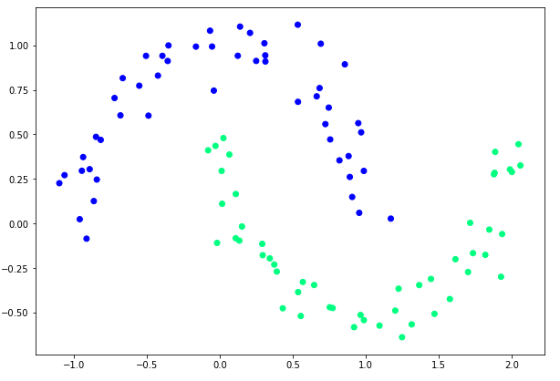

# Introduction
{:.no_toc}

Deep neural network architectures such as convolutional and long short-term memory networks have become increasingly popular as machine learning tools during the recent years. The availability of greater computational resources, more data, new algorithms for training deep models and easy to use libraries for implementation and training of neural networks are the drivers of this development. 
[Deep learning](https://en.wikipedia.org/wiki/Deep_learning) is a set of learning methods attempting to model data with complex architectures combining different non-linear transformations. Deep learning is recently showing a state-of-the-art performance in various fields and the goal of this tutorial is to introduce the basic principles of deep learning.
In most of the problems, our task will be to create a mathematical function which this function might take many numbers as input, perhaps thousands or even millions, and it might produce many numbers as outputs. This can be a complicated function that is not at all obvious just from looking at the input numbers.

Machine learning allows the computer to learn its own function based on data. we collect thousands or millions data and present all of this training data to the computer, and let it search for a function. We create a model that defines some large class of functions. The model includes parameters, variables that can take on any value. By choosing the values of the parameters,  a particular function out of all the many functions in the class defined by the model, will be slected. The mschine learning's job is to select values for the parameters. It tries to find values such that, when your training data is used as input, the output is as close as possible to the corresponding targets.

One of the simplest models is a linear model (y = Mx + b). This equation simply says that each output component is a linear combination of the input components. By setting the parameters ( M and b ), we can choose any linear combination. This is one of the very earliest machine learning models and it was called a [perceptron](https://en.wikipedia.org/wiki/Perceptron). The following image shows a basic model of perceptron.

>    

The linear model is very easy to formulate in a completely generic way but Unfortunately, linear models are also very limited and simply cannot fit most real datasets. The problem becomes even worse when you move to very high-dimensional data. As demonstrated in Figure 2, a linear model (in one dimension, that means a straight line) simply cannot fit most real datasets.

>    


A simple approach is to stack multiple linear transforms, one after another.  Look carefully at what we have done here. We start with an ordinary linear transform, M 1 x + b 1 . 
We then pass the result through a nonlinear function Phi(x) , and then apply a second linear transform to the result. The function Phi(x), which is known as the activation function, is an essential part of what makes this work. Without it, the model would still be linear, and no more powerful than the previous one. A linear combination of linear combinations is itself nothing more than a linear combination of the original inputs.This model is called a multilayer perceptron, or MLP for short. s

>    

The middle steps are called hidden layers. The name refers to the fact that they are neither inputs nor outputs, just intermediate values used in the process of calculating the result. Also notice that we have added a subscript to each Phi(x) . This indicates that different layers might use different nonlinearities.
Depth refers to the number of layers in the model. A model with only one hidden layer is described as shallow. A model with many hidden layers is described as deep. This is, in fact, the origin of the term “deep learning”; it simply means “machine learning using models with lots of layers.”
The following image shows a basic deep model. 

>    


In this section, we will walk through a simple model of how to use Galaxy deep learning tools to build and train a model to predict the toxicity of molecules. In a seperate tutorial, we will explain how toxicity prediction for molecules works in much greater depth, but in this section, we will treat it as a black-box example of how galaxy deep learning models can be used to solve machine learning challenges. 


> ### Agenda
>
> Performing a machine learning task (classification) using a tool involves the following steps:
>
> 1. TOC
> {:toc}
>
{: .agenda}

# Data upload

Let’s start with a pair of needed imports. The datasets required for this tutorial contain information about molecules in [Tox21](https://ntp.niehs.nih.gov/results/tox21/index.html) toxicity dataset that is transformed into matrices and vectors for use in machine learning analyses. 

We use 200 features of molecules which include the ...., ..., and so on. In addition to these features, the training dataset contains one more column as `target`. It has a binary value (0 or 1) for each row. `0` indicates non-toxic and `1` indicates toxic.


> ###  Hands-on: Data upload
>
> 1. Create a new history for this tutorial
>
>    
>
> 2. Import the following datasets and choose the type of data as `tabular`.
>
>    ```
>    https://zenodo.org/record/1401230/files/tox21_train.tsv
>    https://zenodo.org/record/1401230/files/tox21_test.tsv
>    ```
>
>    
>
> 3. Rename datasets to `tox21_train` and `tox21_test`.
>
>    
>
{: .hands_on}


# Create a deep learning model architecture
In this step, we will create a deep learning model architecture. This model learns a mapping function between each row and its target. 

> ###  Hands-on: Create deep learning model architucture
>
> **Create a deep learning model architecture**  with the following parameters to create:
>    - *"Select keras model type"*: `Sequential`
>    - *"Input shape"*: `(200,)`
>    - *"Choose the type of layer"*: `Dense`
>    - *"units"*: `30` 
>       > ###  Comment
>       >
>       > we have created one dense layer with 30 nodes so far. For simplicity keep all the advanced setting values the default. In the next step we are going to create more layers.
>       {: .comment}
>    - "+ Insert LAYERS:" 
>    - *"Choose the type of layer"*: `Dense`
>    - *"units"*: `2`
>       > ###  Comment
>       >
>       > It is the output layer and number of units depends on number of target classes.
>       {: .comment}
{: .hands_on}

# Create deep learning model

The previous step produced only the architucture of the model (`JSON` file) which we will use to creat the deep learning model. This brings us to the next step: just how do we create the complete deep learning model? MLPs provide us with a (mostly) generic model that can be used for any problem. Now we want a similarly generic algorithm to find the optimal values of the model’s parameters for a given
problem. How do we do that?

Next you need to define a loss function L y, y , where y is the actual output from the model and y is the target value specified in the training set. This is how you measure whether the model is doing a good job of reproducing the training data. In other words, we take every sample in the training set, try using each one as an input to the model, and see how close the output is to the target value. Then we average this over the whole training set.

Now that we have a way to measure how well the model works, we need a way to improve it. We want to search for the parameter values that minimize the average loss over the training set. There are many ways to do this, but most work in deep learning uses some variant of the gradient descent algorithm.

Most optimization algorithms used in deep learning are based on SGD, but there are many variations that improve on it in different ways. Fortunately, you can usually treat these algorithms as black boxes and trust them to do the right thing without understanding all the details of how they work. Two of the most popular algorithms used today are called Adam and RMSProp. If you are in doubt about what algorithm
to use, either one of those will probably be a reasonable choice.

# Data Validation


Suppose you have done everything described so far. You collected a large set of training data. You selected a model, then ran a training algorithm until the loss became very small. Congratulations, you now have a function that solves your problem!
Sorry, it’s not that simple! All you really know for sure is that the function works well on the training data. You might hope it will also work well on other data, but you certainly can’t count on it. Now you need to validate the model to see whether it works
on data that it hasn’t been specifically trained on.
To do this you need a second dataset, called the test set. It has exactly the same form as the training set, a collection of x, y pairs, but the two should have no samples in common. You train the model on the training set, then test it on the test set.


> ###  Hands-on: Create deep learning model
>
> **Create a deep learning model**  with the following parameters to create:
>    - *"Choose a building mode"*: `Build a training model`
>    - *"Select the dataset containing model configurations (JSON)"*: `Keras Model Config` 
>    - *"Do classification or regression?"*: `KerasGClassifier`
>    - *"Select a loss function"*: `mse/MSE/mean_squared_error`
>    - *"Select an optimizer"*: `SGD-Stochastic gradient decent optimizer`
>       > ###  Comment
>       >
>       > Most optimization algorithms used in deep learning are based on SGD, but there are many variations that improve on it in different ways. Fortunately, you can usually treat these algorithms as black boxes and trust them to do the right thing without understanding all the details of how they work. Two of the most popular algorithms used today are called Adam and RMSProp.
>       {: .comment}
>    - *"Select metrics"*: `acc/accuracy`
>    - *"epochs"*: `1`
>    - *"batch_size"*: `32`
>       > ###  Comment
>       >
>       > The algorithm is iterative means that we need to get the results multiple times to get the most optimal result. So, it is better if we divide the data into smaller sizes and give it to our computer one by one and update the weights of the model at the end of every step to fit it to the data given.
As I said, you can’t pass the entire dataset into the neural net at once. So, you divide dataset into Number of Batches. 
One Epoch is when an ENTIRE dataset is passed forward and backward through the neural network only ONCE.
Since one epoch is too big to feed to the computer at once we divide it in several smaller batches. passing the entire dataset through a neural network is not enough. And we need to pass the full dataset multiple times to the same neural network.
>       {: .comment}


# Predict using a trained model
The previous step produced a model which we will train and use to predict toxicity.The first thing you need, of course, is a collection of data to train it on. This dataset is known as the training set. It should consist of a large number of (x,y) pairs, also known as samples. Each sample specifies an input to the model, and what you want the model’s output to be when given that input. In our example, the training set could be a collection of molecule features, along with labels indicating whether or not each molecule toxic.
The last column of the training dataset contains a category/class for each row. The classifier learns a mapping between data row and its category which is called a trained model. The trained model is used to predict the categories of the unseen data. 


> ###  Hands-on: Model learning and Prediction
>
>
>  **Model Prediction**  with the following parameters to train the regressor:
>    -  *"Choose the dataset containing pipeline/estimator object"*: `Keras Model Builder on data`
>    - *"Select invocation method"*: `predict`
>    - *"Select input data type for prediction"*: `tabular data`
>    -  *"Training samples dataset"*: `tox21_train`
>    -  *"Does the dataset contain header"*: `Yes`
>    -  *"Choose how to select data by column"*: `All columns EXCLUDING by column index(s)`
>    -  *"Select target column(s)"*: `c:201`

{: .hands_on}

# See predictions results
We can see the prediction resu this part. The last column of the predicted dataset shows the category of each row. A row either gets `0` (no breast cancer) or `1` (breast cancer) as its predicted category.

> ###  Hands-on: See the predicted column
> You can see the acuracy as a prediction result. 
> 
{: .hands_on}


> ###  Additional ML Resources
>
> Read more about **Deep learning with keras** [here](http://scikit-learn.org/stable/).
{:.details}
