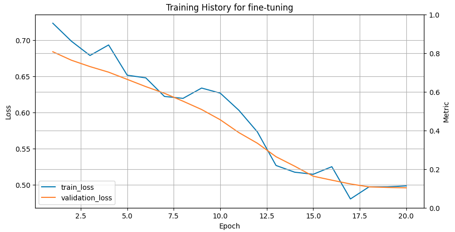

The advent of large language models has transformed the field of natural language processing, enabling machines to comprehend and generate human-like language with unprecedented accuracy. Pre-trained language models, such as BERT, RoBERTa, and their variants, have achieved state-of-the-art results on a wide range of tasks, from sentiment analysis and question answering to language translation and text classification. Moreover, the emergence of transformer-based models, such as Generative Pre-trained Transformer (GPT) and its variants, has enabled the creation of highly advanced language models that can generate coherent and context-specific text. The latest iteration of these models, ChatGPT, has taken the concept of conversational AI to new heights, allowing users to engage in natural-sounding conversations with machines. However, despite their impressive capabilities, these models are not yet perfect, and their performance can be significantly improved through fine-tuning. Fine-tuning involves adapting the pre-trained model to a specific task or domain by adjusting its parameters to optimize its performance on a target dataset. This process allows the model to learn task-specific features and relationships that may not be captured by the pre-trained model alone, resulting in highly accurate and specialized language models that can be applied to a wide range of applications. In this article, we will delve into the world of fine-tuning large language models, exploring the benefits and challenges of this approach, as well as the various techniques and strategies that can be employed to achieve optimal results. Protein large language models (LLMs) represent a groundbreaking advancement in bioinformatics, leveraging the power of deep learning to understand and predict the behavior of proteins at an unprecedented scale. These models, exemplified by the ProtTrans suite, are inspired by natural language processing (NLP) techniques, applying similar methodologies to biological sequences. ProtTrans models, including BERT and T5 adaptations, are trained on vast datasets of protein sequences, enabling them to capture the complex patterns and functions encoded within amino acid sequences. By interpreting these sequences much like language, protein LLMs offer transformative potential in drug discovery, disease understanding, and synthetic biology, bridging the gap between computational predictions and experimental biology.

> <agenda-title></agenda-title>
>
> In this tutorial, we will cover:
>
> 1. TOC
> {:toc}
>
{: .agenda}

## Open JupyterLab in Galaxy Europe


### Open JupyterLab

> <hands-on-title>GPU-enabled Interactive Jupyter Notebook for Machine Learning</hands-on-title>
>
> - 
>    - *"Do you already have a notebook?"*: `Start with default notebooks`
>    - Click *"Run Tool"*
>
>    > <comment-title></comment-title>
>    >  If you do not have access to this resource in Galaxy Europe, please apply for it at: [Access GPU-JupyterLab](http://usegalaxy.eu/gpu-request). It may take a day or two to receive access.
>    >
>    {: .comment}
{: .hands_on}


### Fetch notebook and protein sequences

> <hands-on-title>Fetch data from Zenodo</hands-on-title>
>
> 1. Create a new folder named `fine-tuning` alongside other folders such as "data", "outputs", "elyra" or you can use your favourite folder name.
> 2. Inside the created folder, clone a code repository by clicking on "Git" icon.
> 3. In the shown popup, provide the repository path as shown below and then, click on "clone":
>    ```
>    https://github.com/anuprulez/fine-tune-protTrans-repository
>    ```
>
{: .hands_on}


## Fine-tuning notebook

From the cloned repository, open the `fine-tune-protTrans-dephophorylation.ipynb` notebook. The notebook contains all the necessary script for processing protein sequences, creating and configuring protein large language model, training it on the protein sequences and evaluating them on the test protein sequences and visualising results. Let's look at these key steps of fine-tuning.

### Install necessary Python packages
The protein large language model has been developed using Pytorch and the model weights are stored at HuggingFace. Therefore, to recreate the model, packages such as Pytorch, Transformers, SentencePiece 
needs to be installed in the notebook. Additional packages such Scikit-learn, Pandas, Matplotlib and Seaborn are also required for data preprocessing, manipulation and visualisation of model training and test performances. 	All the necessary packages are installed in the notebook using `!pip install` command. Note: the installed packages have a lifespan equal to that of the notebook session. When a new session of JupyterLab is created, all the packages needs to be installed again.

### Fetch and split data
After installing all the packages and importing necessary Python packages, protein sequences (available as a FASTA file) alongwith their labels are read into the notebook. These sequences are further divided into training and validation sets. Training set is used for fine-tuning the protein large language model and validation set is used for model evaluation after each training epoch.

### Define configurations for LoRA with transformer (ProtT5) model
The protein large language model (ProtT5) used in this tutorial has over 1.2 billion parameters (1,209,193,474) and it is impossible to train such a large model on any commercial GPU having 15GB of memory. To make fine tuning process feasible on such GPUs, low ranking adaption (LoRA) technique has been devised. LoRA learns low rank matrices and when these are multiplied, they take the shape of matrix of original large language model. While fine tuning, the weight matrices of the original large language model are kept frozen (not updated) and only these low rank matrices are updated. Once fine-tuning is finished, these low rank matrices are combined with the original frozen weight matrices to update the model. Essentially, all the knowledge obtained by fine-tuning on a small dataset is contained in the low rank matrices. This approach help retain the original knowledge of the model while adding the additional knowledge from the fine tuning dataset. When LoRA is applied to the ProtT5 model, the trainable parameters become little over 3 million (3,559,426) making it possible to fine-tune on a commercial GPU with at least around 10 GB of memory. The following figure shows a comparison between [fine-tuning with and without LoRA](https://magazine.sebastianraschka.com/p/lora-and-dora-from-scratch). Fine tuning without LoRA requires additional weight matrices to be of the same size as the original model which needs much large amount of computational resources compared to using LoRA where much small sized weight matrices are learned.

.")

### Create ProtT5 model
The ProtT5 model (inspired by [T5](https://huggingface.co/docs/transformers/en/model_doc/t5)) has two significant components - [encoder and sequence classifier](https://github.com/agemagician/ProtTrans/blob/master/Fine-Tuning/PT5_LoRA_Finetuning_per_prot.ipynb). Encoder learns representation of protein sequences and classifier is used for downstream classification of the learned representations of sequences. Self-attention technique is used to learn sequence representations by computing weights of highly interacting regions in sequences and thereby, establishing long-range dependencies in sequences. Amino acids in protein sequences are represented in vector spaces in combination of positional embedding to maintain the order of amino acids in sequences.  

### Create model training method and train
Once the model architecture is created, the weights of the pre-trained ProtT5 is downloaded from [HuggingFace](https://huggingface.co/Rostlab/ProstT5). HuggingFace provides an openly available repository of pretrained weights of many LLM-like architectures such as ProtT5, [Llama](https://huggingface.co/meta-llama/Meta-Llama-3-8B), [BioGPT](https://huggingface.co/microsoft/BioGPT-Large) and so on. The download of the pretrained weights is facilitated by a Python package, `Transformers` which provides methods for downloading weight matrices and tokenizers. After downloading the model weights and its tokenizer, the original model is modified by adding LoRA layers to have low rank matrices and original weights are frozen. This brings down the number of parameters of the original ProtT5 model from 1.2 billion to 3.5 million. The LoRA updated model is then trained for a certain number of epochs when the error rate stops going down, signifying training stabilisation. The fine-tuned model is then saved to a file for later reuse for prediction.

### Analyse results
The saved trained model is recreated and used for prediction the classes of protein sequences from the test set. Different metrics are used to assess the performance of fine-tuning such as Matthews’s correlation coefficient (MCC), specificity, sensitivity, accuracy, ROC-AUC and confusion matrix. The higher the value of MCC and closer to 1, better is the correlation between true and predicted classes. High specificity means that there are few false positive results in the predictions while high sensitivity refers to a few false negatives. Accuracy provides the fraction of correctly predicted sequences from the entire test set. The ROC-AUC metric specifies how well a classifier distinguishes between two classes in binary classification problem. Its value varies between 0 and 1 where 1 means the perfect classifier and 0.5 means random guessing. The training history plot below shows the error of the fine-tuning process going down and stabilising around training iteration 20.



The performance of the fine-tuned model is reasonable showing ROC-AUC as 0.8 and shows accuracy of 0.74, classifying 37 out of 50 sequences correctly. The confusion matrix further elaborates the results of fine-tuning showing classification performance of both classes (0 and 1).


## Conclusion


