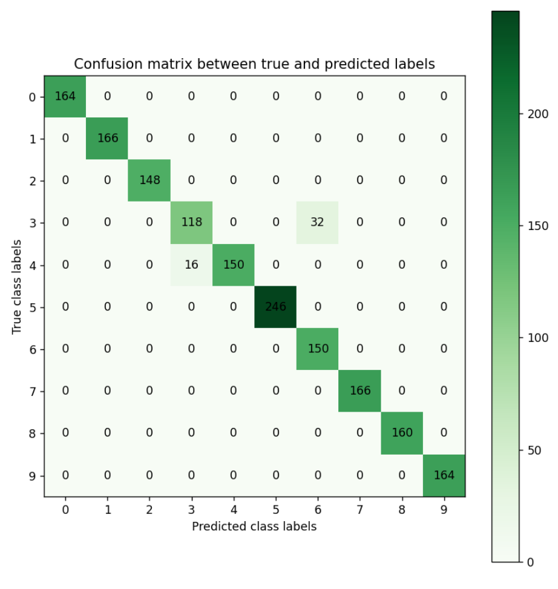

# Introduction


The classification of fruits and vegetables offers many useful applications such as 
automated harvesting by robots, building up stocks for supermarkets, effective detection 
of specific defects, and determining fruit ripeness (, 
, ). Machine Learning (ML) techniques 
such as Deep Learning (DL) are commonly used for image classification problems in various 
domains, including in agriculture (). DL is a technique inspired 
by how a human brain operates. Due to the increased availability of compute capacity and 
training data, DL techniques have become very popular in recent years. In this tutorial,
we will use Galaxy's ML toolkit to build a DL model to classify fruit and vegetable 
images. Our DL model is trained and evaluated on Fruit 360 dataset ()  

> <agenda-title></agenda-title>
>
> In this tutorial, we will cover:
>
> 1. TOC
> {:toc}
>
{: .agenda}
## Overview of convolutional neural networks (CNN)

Here we provide a brief overview of CNN. For a more in depth discussion, please refer to the CNN tutorial cited in the requirements 
section. CNN were inspired by how the visual cortex of the brain processes visual information (). There are 
two types of cells in our visual cortex: **simple cells** detect objects at certain angles/locations, and **complex** cells,
which receive inputs from multiple simple cells, and detect movement. In 1980, inspired by hierarchical structure of complex and 
simple cells, Fukushima proposed *Neocognitron* (), a hierarchical neural network used for handwritten Japanese 
character recognition. In 1989, LeCun et. al. () proposed a CNN that could be trained by backpropagation 
algorithm. CNN gained immense popularity when they outperformed other models at ImageNet Challenge, a competition in object 
classification and detection on hundreds of object categories and millions of images.

## Architecture of CNN

A typical CNN has the following 4 layers ()

1. Input layer
2. Convolution layer
3. Pooling layer
4. Fully connected layer

Please note that we will explain a 2 dimensional (2D) CNN here. But the same concepts apply to a 1 (or 3) dimensional CNN as well.

### Input layer

The input layer represents the input to the CNN. An example input, could be a 28 by 28 pixel grayscale image. We do not
"flatten" the input to a 1D vector. This makes capturing spatial relationships easier.

### Convolution layer

The convolution layer is composed of multiple **filters** (also called **kernels**). Filters for a 2D image are also 2D. Suppose 
we have a 28 by 28 pixel grayscale image. Each pixel is represented by a number between 0 and 255, where 0 represents the color 
black, 255 represents the color white, and the values in between represent different shades of gray. Suppose we have a 3 by 3 
filter (9 values in total), and the values are randomly set to 0 or 1. Convolution is the process of placing the 3 by 3 filter 
on the top left corner of the image, multiplying filter values by the pixel values and adding the results, moving the filter to 
the right one pixel at a time and repeating this process (Figure 1). When we get to the top right corner of the image, we simply 
move the filter down one pixel and restart from the left. This process ends when we get to the bottom right corner of the image.

")

Covolution operator has several parameters. 

1. Filter size
2. Padding
3. Stride
4. Dilation
5. Activation function

Filter size can be 5 by 5, 3 by 3, and so on. Larger filter sizes should be avoided as more weights need to be learned (more 
compute capacity, more training time, more chance of overfitting). Also, odd sized filters are preferred to even sized filters, 
due to the nice geometric property of all the input pixels being around the output pixel.

If you look at Figure 1 you see that after applying a 3 by 3 filter to a 4 by 4 image, we end up with a 2 by 2 image -- the 
size of the image has gone down. If we want to keep the image size the same, we can use *padding* (Figure 2). We pad the input 
in every direction with 0's before applying the filter. If the padding is 1 by 1, then we add 1 zero in evey direction. If its 
2 by 2, then we add 2 zeros in every direction, and so on.

")

As mentioned before, we start the convolution by placing the filter on the top left corner of the image, and after multiplying 
filter and image values (and adding them), we move the filter to the right and repeat the process. How many pixels we move to 
the right (or down) is the *stride*. In figure 1 and 2, the stride of the filter is 1. We move the filter one pixel to the right 
(or down). But we could use a different stride. Figure 3 shows an example of using stride of 2.

")

When we apply a, say 3 by 3, filter to an image, our filter's output is affected by pixels in a 3 by 3 subset of the image. If we 
like to have a larger *receptive field* (portion of image that affect filter's output), we could use *dilation*. If we set the 
dilation to 2 (Figure 4), instead of a contiguous 3 by 3 subset of the image, every other pixel of a 5 by 5 subset of the image 
affects the filter's output.

")

After the filter scans the whole image, we apply an activation function to filter output to introduce non-linearlity. The preferred 
activation function used in CNN is ReLU (). ReLU leaves pixels with positive values in filter output as is, 
and replaces negative values with 0. Figure 5 shows the results of applying ReLU activation function to a filter output.


Figure 6 illustrates the calculations for a convolution operation, via a 3 by 3 filter on a single channel 5 by 5 input 
(5 x 5 x 1). Figure 7 illustrates the calculations when the input has 3 channels. To show this in 2 dimensions, we are 
displaying each channel in input and filter separately. Figure 9 shows a sample multi-channel 2D convolution in 3 dimensions. 


As Figures 7 and 8 show the output of a multi-channel 2D filter is a single channel 2D image. Applying *multiple* filters to the 
input image results in a multi-channel 2D image for the output. For example, if the input image is 28 by 28 by 3 
(rows x columns x channels), and we apply a 3 by 3 filter with 1 by 1 padding, we would get a 28 by 28 by 1 image. If we apply 15 
filters to the input image, our output would be 28 by 28 by 15. Hence, the number of filters in a convolution layer allows us to 
increase or decrease the channel size.

")

### Pooling layer

The pooling layer performs down sampling to reduce the spatial dimensionality of the input. This decreases the number of parameters, 
which in turn reduces the learning time and computation, and the likelihood of overfitting. The most popular type of pooling is 
*max pooling*. Its usually a 2 by 2 filter with a stride of 2 that returns the maximum value as it slides over the input data, 
similar to convolution filters.

### Fully connected layer

The last layer in a CNN is a fully connected layer. We connect all the nodes from the previous layer to this fully connected layer, 
which is responsible for classification of the image.

")

As shown in Figure 9, a typical CNN usually has more than one convolution plus pooling layer. Each convolution plus pooling layer 
is responsible for feature extraction at a different level of abstraction. For example, the filters in the first layer could detect 
horizontal, vertical, and diagonal edges. The filters in the next layer could detect shapes, and the filters in the last layer could 
detect collection of shapes. Filter values are randomly initialized and are learned by the learning algorithm. This makes CNN very 
powerful as they not only do classification, but can also automatically do feature extraction. This distinguishes CNN from other classification techniques (like Support Vector Machines), which cannot do feature extraction.

## Fruit 360 dataset

Fruit 360 is a dataset with 90380 images of 131 fruits and vegetables 
(https://www.kaggle.com/moltean/fruits). Images are 100 pixel by 100 pixel and are color 
(RGB) images (Hence, 3 values for each pixel). There are 67,692 images in the training 
dataset and 22,688 images in the test dataset. The dataset we use for this tutorial is a 
subset of fruit 360 dataset, containing only 10 fruits/vegetables (Strawberry, 
Apple_Red_Delicious, Pepper_Green, Corn, Banana, Tomato_1, Potato_White, Pineapple, 
Orange, and Peach). We selected a subset of fruits/vegetables, so the dataset size is 
smaller and the neural network can be trained faster. Our training dataset has 5,015 images 
and our testing dataset has 1,679 images.

The utilities used to create the subset dataset, along with step by step instructions, can 
be found here: https://github.com/kxk302/fruit_dataset_utilities. First, we created feature 
vectors for each image. Images are 100 pixel by 100 pixel and are color (RGB) images 
(3 values for each pixel). Hence, each image can be represented by 30,000 values 
(100 X 100 X 3). Second, we selected a subset of 10 fruit/vegetable images. Training and 
testing dataset sizes go from 7 GB and 2.5 GB for 131 fruits/vegetables to 500 MB and 
177 MB for 10 fruits/vegetables, respectively. Third, we created separate files for feature 
vectors and labels. Finally, we mapped the labels for the 10 selected fruits/vegetables to 
a range of 0 to 9. Full dataset labels are in the 0 to 130 range, as the full dataset 
includes 131 fruits/vegetables. The 10 labels for out dataset are as follows: Strawberry:0, 
Apple_Red_Delicious:1, Pepper_Green:2, Corn:3, Banana:4, Tomato_1:5, Potato_White:6, Pineapple:7, 
Orange:8, Peach:9.  

## Get data

> <hands-on-title>Data upload</hands-on-title>
>
> 1. Make sure you have an empty analysis history.
>
>    
>
> 2. **Rename your history** to make it easy to recognize
>
>    > <tip-title>Rename a history</tip-title>
>    >
>    > * Click on the title of the history (by default the title is `Unnamed history`)
>    >
>    >   
>    >
>    > * Type `Galaxy Introduction` as the name
>    > * Press <kbd>Enter</kbd>
>    >
>    {: .tip}
>
>
> 3. Import the files from [Zenodo]({{ page.zenodo_link }})
>
>    ```
>    {{ page.zenodo_link }}/files/train_X_10.tsv
>    {{ page.zenodo_link }}/files/train_y_10.tsv
>    {{ page.zenodo_link }}/files/test_X_10.tsv
>    {{ page.zenodo_link }}/files/test_y_10.tsv
>    ```
>
>    
>
> 4. Rename the datasets as `train_X_10`, `train_y_10`, `test_X_10`, and `test_y_10` respectively.
>
>    
>
> 5. Check that the datatype of all the three datasets is `tabular`.
>
>    
>
{: .hands_on}

## Classification of fruit 360 dataset images with CNN

In this section, we define a CNN and train it using fruit 360 dataset training data. The 
goal is to learn a model such that given an image of a fruit/vegetable, we can predict 
what fruit/vegetable it is (Labels are in the range of 0 to 9). We then evaluate the trained 
CNN on the test dataset and plot the confusion matrix.

In order to train the CNN, we must have the One-Hot Encoding (OHE) representation of the training
labels. This is needed to calculate the categorical cross entropy loss function. OHE encodes labels
as a **one-hot** numeric array, where only one element is 1 and the rest are 0's. For example, if
we had 3 fruits (apple, orange, banana) and their labels were 1, 2, and 3, the OHE
represntation of apple would be (1,0,0), the OHE representation of orange would be (0,1,0), and the
OHE representation of banana would be (0,0,1). For apple with label 1, the first element of array
is 1 (and the rest are 0's); For Orange with label 2, the second element of the array is 1 (and the
rest are 0's); And for Banana with label 3, the third element of the array is 1 (and the rest are 0's).
We have 10 fruits/vegetables in our dataset and we would just have an array of size 10, where only one
element is 1, corresponding to fruit/vegetable label, and the rest are 0's.


In order to calculate the OHE of labels, we must first extract the labels column from train_y_10 file.
train_y_10 file has 3 columns: Label_name (string representation of label), file_name (name of fruit/vegetable
image file), and Label (integer representation of label). We extract Label from train_y_10, and then calcuate
its OHE representation.

### **Extract the Label column from train_y_10**

> <hands-on-title>Advanced Cut</hands-on-title>
>
> - 
>    - *"File to cut"* : Select `train_y_10`
>    - *"Operation"* : Select `Keep`
>    - *"Delimited by"*: Select `Tab`
>    - *"Cut by"*: Select `fields`
>    - *"List of fields"*: Select `Column: 3`
>    - Click *"Execute"*
>
{: .hands_on}

### **Create One-Hot Encoding (OHE) representation of training labels**

> <hands-on-title>One-Hot Encoding</hands-on-title>
>
> - 
>    - *"Input file"* : Select the output of the previous step.
>    - *"Does the dataset contain header?"* : Select `Yes`
>    - *"Total number of classes"*: Select `10`
>    - Click *"Execute"*
>
{: .hands_on}

### **Create a deep learning model architecture**

> <hands-on-title>Model config</hands-on-title>
>
> - 
>    - *"Select keras model type"*: `sequential`
>    - *"input_shape"*: `(30000,)`
>    - In *"LAYER"*:
>        -  *"1: LAYER"*:
>            - *"Choose the type of layer"*: `Core -- Reshape`
>                - *"target_shape"*: `(100,100,3)`
>        -  *"2: LAYER"*:
>            - *"Choose the type of layer"*: `Convolutional -- Conv2D`
>                - *"filters"*: `16`
>                - *"kernel_size"*: `5`
>                - *"Activation function"*: `relu`
>                - *"Type in key words arguments if different from the default"*: `input_shape=(100, 100, 3)`
>        -  *"3: LAYER"*:
>            - *"Choose the type of layer"*: `Pooling -- MaxPooling2D`
>                - *"pool_size"*: `(2,2)`
>        -  *"4: LAYER"*:
>            - *"Choose the type of layer"*: `Convolutional -- Conv2D`
>                - *"filters"*: `32`
>                - *"kernel_size"*: `5`
>                - *"Activation function"*: `relu`
>        -  *"5: LAYER"*:
>            - *"Choose the type of layer"*: `Pooling -- MaxPooling2D`
>                - *"pool_size"*: `(2,2)`
>        -  *"6: LAYER"*:
>            - *"Choose the type of layer"*: `Convolutional -- Conv2D`
>                - *"filters"*: `64`
>                - *"kernel_size"*: `5`
>                - *"Activation function"*: `relu`
>        -  *"7: LAYER"*:
>            - *"Choose the type of layer"*: `Pooling -- MaxPooling2D`
>                - *"pool_size"*: `(2,2)`
>        -  *"8: LAYER"*:
>            - *"Choose the type of layer"*: `Core -- Flatten`
>        -  *"9: LAYER"*:
>            - *"Choose the type of layer"*: `Core -- Dense`
>                - *"units"*": `256`
>                - *"Activation function"*: `relu`
>        -  *"10: LAYER"*:
>            - *"Choose the type of layer"*: `Core -- Dense`
>                - *"units"*": `10`
>                - *"Activation function"*: `softmax`
>    - Click *"Execute"*
{: .hands_on}

Each image is passed in as a vector of size 30,000 (100 x 100 X 3 = 30,000). The reshape 
layer reshapes it into (100, 100, 3) dimensions -- 100 rows (image height), 100 columns 
(image width), and 3 channels. Channel size is 3 since the image is color (RGB) and each 
color pixel can be represented by 3 integers, representing the Red, Green, and Blue 
primary colors. Our CNN then has 3 convolution + pooling layers. The first convolution layer 
has 16 filters (output channel size would be 16), and filter size is 5 x 5. The second convolutional
layer has 32 filters (output channel size would be 32), and filter size is 5 x 5. The third 
convolutional layer has 64 filters (output channel size would be 64), and filter size is 5 x 5. All
3 pooling layers are MaxPool layers with pool size of 2 x 2. Afterwards, we flatten the previous layer's 
output (every row/column/channel would be an individual node), then add a fully connected layer with 256
nodes and relu activation function. Finally, we add a fully connected layers with 10 nodes, and use 
softmax activation function to get the probability of each fruit/vegetable. Fruit/vegetable with the 
highest probability is predicted by CNN. The model config can be downloaded as a JSON file.

### **Create a deep learning model**

> <hands-on-title>Model builder (Optimizer, loss function, and fit parameters)</hands-on-title>
>
> - 
>    - *"Choose a building mode"*: `Build a training model`
>    - *"Select the dataset containing model configuration"*: Select the *Keras Model Config* from the previous step.
>    - *"Do classification or regression?"*: `KerasGClassifier`
>    - In *"Compile Parameters"*:
>        - *"Select a loss function"*: `categorical_crossentropy`
>        - *"Select an optimizer"*: `Adam - Adam optimizer `
>        - *"Select metrics"*: `acc/accuracy`
>    - In *"Fit Parameters"*:
>        - *"epochs"*: `40`
>        - *"batch_size"*: `50`
>    - Click *"Execute"*
{: .hands_on}

A loss function measures how different the predicted output is from the expected output. For multi-class classification problems, 
we use *categorical cross entropy* as loss function. Epochs is the number of times the whole training data is used to train the 
model. Setting *epochs* to 40 means each training example in our dataset is used 40 times to train our model. If we update network 
weights/biases after all the training data is feed to the network, the training will be very slow (as we have 5014 training examples 
in our dataset). To speed up the training, we present only a subset of the training examples to the network, after which we update 
the weights/biases. *batch_size* decides the size of this subset. The model builder can be downloaded as a zip file.

### **Deep learning training and evaluation**

> <hands-on-title>Training the model</hands-on-title>
>
> - 
>    - *"Select a scheme"*: `Train and Validate`
>    - *"Choose the dataset containing pipeline/estimator object"*: Select the *Keras Model Builder* from the previous step.
>    - *"Select input type:"*: `tabular data`
>        - *"Training samples dataset"*: Select `train_X_10` dataset
>        - *"Choose how to select data by column:"*: `All columns`
>        - *"Dataset containing class labels or target values"*: Select the OHE representation of `train_y_10` dataset
>        - *"Choose how to select data by column:"*: `All columns`
>    - Click *"Execute"*
>
>
{: .hands_on}

The training step generates 3 datasets. 1) accuracy of the trained model, 2) the trained model, downloadable as a zip file, and 
3) the trained model weights, downloadable as an hdf5 file. These files are needed for prediction in the next step.

### **Model Prediction**

> <hands-on-title>Testing the model</hands-on-title>
>
> - 
>    - *"Choose the dataset containing pipeline/estimator object"* : Select the trained model from the previous step.
>    - *"Choose the dataset containing weights for the estimator above"* : Select the trained model weights from the previous step.
>    - *"Select invocation method"*: `predict`
>    - *"Select input data type for prediction"*: `tabular data`
>    - *"Training samples dataset"*: Select `test_X_10` dataset
>    - *"Choose how to select data by column:"*: `All columns`
>    - Click *"Execute"*
>
{: .hands_on}

The prediction step generates 1 dataset. It's a file that has predictions (0 to 9 for the predicted fruit/vegetable) for every image 
in the test dataset.

### **Machine Learning Visualization Extension**

> <hands-on-title>Creating the confusion matrix</hands-on-title>
>
> - 
>    - *"Select a plotting type"*: `Confusion matrix for classes`
>    - *"Select dataset containing the true labels"*": `test_y_10`
>    - *"Does the dataset contain header:"*: `Yes`
>    - *"Choose how to select data by column:"*: `Select columns by column header name(s)`
>    	- *"Type header name(s):"*: `Label`
>    - *"Select dataset containing the predicted labels"*": Select `Model Prediction` from the previous step
>    - *"Does the dataset contain header:"*: `Yes`
>    - Click *"Execute"*
>
{: .hands_on}

**Confusion Matrix** is a table that describes the performance of a classification model. It lists the number of examples that were 
correctly classified by the model, True positives (TP) and true negatives (TN). It also lists the number of examples that were 
classified as positive that were actually negative (False positive, FP, or Type I error), and the number of examples that were 
classified as negative that were actually positive (False negative, FN, or Type 2 error). Given the confusion matrix, we can 
calculate **precision** and **recall** . Precision is the fraction of predicted positives that are true 
positives (Precision = TP / (TP + FP)). Recall is the fraction of true positives that are predicted (Recall = TP / (TP + FN)). 
One way to describe the confusion matrix with just one value is to use the **F score**, which is the harmonic mean of precision 
and recall 

$$ Precision = \frac{\text{True positives}}{\text{True positives + False positives}} $$

$$ Recall = \frac{\text{True positives}}{\text{True positives + False negatives}} $$

$$ F score = \frac{2 * \text{Precision * Recall}}{\text{Precision + Recall}} $$



Figure 1 is the resultant confusion matrix for our image classification problem. The first row in the table represents the *true* 
fruit/vegetable with 0 as class label, which is strawberry (we have 164 strawberry images with 0 as class label). The second row 
represents the *true* fruit/vegetable with 1 as class label, which is Apple_Red_Delicious (We have 166 Apple_Red_Delicious images 
with 1 as class label). Similarly, you can count the true class labels for fruits/vegetables with class label of 2 to 9 by adding 
up the numbers in the corresponding row. The first column from the left represents the *predicted* fruit/vegetable with 0 as class 
label, which is strawberry (Our CNN predicted 164 images as being strawberry, and having class label 0). The second column from 
the left represents the *predicted* fruit/vegetable with 1 as class label, which is Apple_Red_Delicious (Our CNN predicted 166 
images as being Apple_Red_Delicious, and having class label 1). Similarly, you can count the predicted class labels for 
fruits/vegetables with class labels 2 to 9 by adding up the numbers in the corresponding column.

For label 3, which is corn, looking at the green cell in the 4th row and 4th column, we see that our CNN has correctly 
predicted 118 images as being a corn image (True positives). Adding the numbers in the other rows in column 4, we see that 
our CNN has incorrectly predicted 16 images as being corn (False positives). Adding the numbers on the 4th row besides the 
True positives, we see that our CNN has incorrectly predicted 32 corn images as being label Potato_White (False negatives). 
Given these numbers we can calculate Precision, Recall, and the F score for digit 0 as follows:

$$ Precision = \frac{\text{True positives}}{\text{True positives + False positives}} = \frac{118}{118 + 16} = 0.88 $$

$$ Recall = \frac{\text{True positives}}{\text{True positives + False negatives}} = \frac{118}{118 + 32} = 0.78 $$

$$ F score = \frac{2 * \text{Precision * Recall}}{\text{Precision + Recall}} = \frac{2 * 0.88 * 0.78}{0.88 + 0.78} = 0.82 $$

You can calculate the Precision, Recall, and F score for other digits in a similar manner.

# Conclusion


In this tutorial, we briefly described convolutional neural networks (CNN) and their application to image classification problems.
We then used Galaxy's ML toolkit to solve an image classification problem using CNN on fruit 360 dataset.
