> <comment-title>Galaxy-Ludwig Tool</comment-title>
>
> The Ludwig tool described in this tutorial is only available at: 
> [Cancer-Galaxy](https://cancer.usegalaxy.org)
>
> Galaxy-ML tools > Ludwig Experiment
>
{:  .comment}

Using the MNIST image dataset of handwritten digits as input, we will build an image recognition model with the Galaxy-Ludwig tool. The goal is to classify the handwritten digit in each image.

To accomplish this, three steps are needed: (i) upload Ludwig files and image files to Galaxy (ii) Set up and running the Ludwig experiment function on Galaxy, and (iii) Evaluate the image classification model. As a bonus step, we'll also explore (iv) improving the model's classification performance (Figure 1).


> <agenda-title></agenda-title>
>
> In this tutorial, we will cover:
>
> 1. TOC
> {:toc}
>
{: .agenda}


> <comment-title>Background</comment-title>
>
> [MNIST dataset](https://yann.lecun.com/exdb/mnist/) provides the database of handwritten digits
> the database has a training set of 60,000 examples, and a test set of 10,000 examples.
> at our planet and its environment for the ultimate benefit of all European citizens.
> It is a subset of a larger set available from NIST.
> The digits have been size normalized and centered in a fixed-size image.
{:  .comment}

# Files Format
Before starting our hands-on, here is a brief explanation of the three files generated for the Ludwig Experiment tool.

## Image_Files.zip 

Since our model will learn directly from the PNG files containing the handwritten numbers, we need to upload these files as well. The images are stored in two main folders: one for training and one for testing. Another folder, named after the figure label, is used to store the figures (Figure 2).

Notice that we are going to work with compressed file (.zip), Galaxy-Ludwig knows how to decompress the files and have them ready.

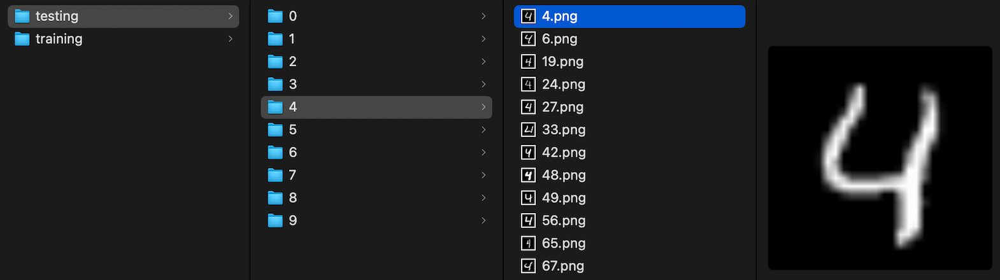

## MNIST_dataset.csv

The MNIST dataset consists of images and their corresponding labels. For the purpose of this tutorial, mnist_dataset.csv file is created and contains three columns: image_path, label and, split.

Briefly, the image_path column provides the file paths to the images that will be fed into the deep learning algorithm. The label column contains the correct classifications, ranging from 0 to 9, for the handwritten digits in the images. The split column indicates whether the data should be used for training (0) or testing (2) the model.

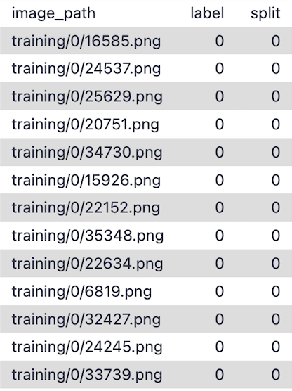{: width="50%" height="10%"}
 
## Config.yaml

The config.yaml file is crucial as it defines the entire structure of your machine learning experiment. This configuration file tells Ludwig how to process your data, what model to use, how to train it, and what outputs to generate.

The rationale on how this file was constructed for this dataset is the following:
i) The model takes images as input and uses a stacked convolutional neural network (CNN) to extract features.
ii) It consists of two convolutional layers followed by a fully connected layer, with dropout applied to both the second convolutional layer and the fully connected layer to reduce overfitting. 
iii) The split configuration is used to divide the dataset based on the 'split' column rather than using a random split (which is the default). In this configuration, rows labeled with '0' are included in the training set, while rows labeled with '2' are included in the testing set. If a validation category is needed, rows are labeled with '1'. 
iv) The model is trained to classify images into categories (e.g., recognizing digits), and it will train for 5 epochs.

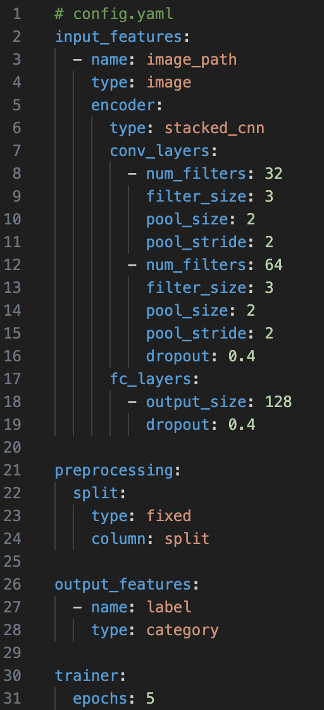{: width="50%" height="5%"}


# Galaxy-Ludwig Tool

Ludwig simplifies the complexities of machine learning by automating essential steps such as data preprocessing, model architecture selection, hyperparameter tuning, and device management. This streamlined approach is particularly beneficial for Galaxy users who are more interested in addressing their scientific questions than in navigating the intricacies of machine learning workflows.

## Prepare environment and get the data 

> <hands-on-title> Environment and Data Upload </hands-on-title>
>
> 1. Create a new history for this tutorial. If you are not inspired, you can name it *image classifier*.
>
>    
>
> 2. Import the files from Zenodo or from the shared data library
>
>    ```
>    https://zenodo.org/records/13292895/files/mnist_images.zip
>    https://zenodo.org/records/13357260/files/mnist_dataset.csv 
>    https://zenodo.org/records/13713095/files/config.yaml
>    ```
>
>    
>
> 3. Check that the data format assigned for each file is **zip**, **csv**, and **yaml**, respectively.
>    If it is not, follow the Changing the datatype tip.
>
>    
>
> 5. Add a tag (`Stacked CNN`) to the dataset corresponding to `config.yaml`
>    This is important to trace back on what configurations the model was built on.
>
>    
>
{: .hands_on}

## Ludwig Experiment

> <hands-on-title> Task description </hands-on-title>
>
> 1.  with the following parameters:
>    -  *"Select the dataset containing model configuration"*: `config.yaml`
>    -  *"Input dataset"*: `mnist_dataset.csv`
>    -  *"Raw data"*: `mnist_images.zip`
> Run the tool 
{: .hands_on}

## Ludwig Experiment Outputs files

After your model is trained and tested, you should see three new files in your history list:

- Ludwig Experiment Report: An HTML file containing the evaluation report of the trained model.
 
- Ludwig Experiment Trained Model: A composite dataset of the trained Ludwig model.
 
- Ludwig Experiment Predictions CSV: A CSV file with the prediction results from the model evaluations.

To evaluate the model, the Ludwig Experiment Report contains all the necessary information.

# Ludwig Experiment Report

Before we begin, it's crucial to determine the most appropriate metric for a given machine learning problem. While accuracy is a useful metric, other performance measures might be more suitable depending on the specific goal. For instance, an overfitted model might exhibit high accuracy due to class imbalance in the dataset. Therefore, the purpose of building the model should guide the interpretation of various metrics.

In this section, we will demonstrate how to evaluate the results of an image classifier model, providing you with a foundational understanding of how to interpret the model's performance.

## Confusion matrix

A confusion matrix is powerful for evaluating the performance of a deep learning model, especially in classification tasks. It provides a granular view of model performance, helping to refine the model. It achieves that by showing the predicted labels with the actual labels in a structured table format, where rows are the actual values and columns the prediction from the model (Figure 5).

 with the predicted labels produced by the model.")

Understanding the confusion matrix allows to calculate and interpreting: Recall, Precision, Specificity, Accuracy, and other aspects involved such as bias.

The starting point is the confusion matrix generated after training and testing the model (Figure 6). As usual, the diagonal elements represent the correctly predicted samples, giving you a sense of how well your model predicted all possible labels before conducting a more in-depth analysis.

The confusion matrix plot:

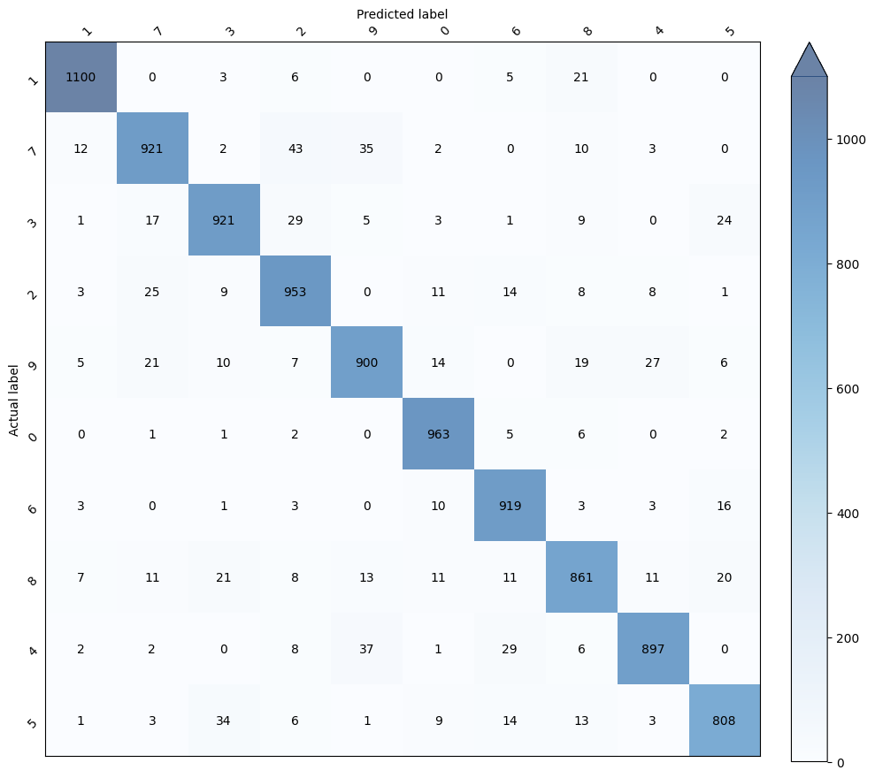

For example, we can interpret the results for the handwritten digit '1' (Figure 7a) and for digit '7' (Figure 7b). Each analysis provides a snapshot of the model's performance for each tested digit.

 Analysis of the digit '1' and its corresponding confusion matrix. B) Analysis of the digit '7' and its corresponding confusion matrix.")

Based on the analysis presented, we can conclude that (i) the model demonstrates a remarkable ability to identify the digits, (ii) with slightly better predictions for the digit '1' compared to the digit '7'. (iii) It's important to note that the confusion matrix also provides insight into the model's bias; for example, if the numbers along the diagonal are low and the off-diagonal numbers are high, it may indicate bias. The model shows a strong tendency to confuse the digit '1' with the digit '8' and the digit '7' with the digit '2' and '9'. 

## Entropy

In the context of a confusion matrix, entropy measures the uncertainty or disorder in the model's predictions (Figure 8). A confusion matrix with low entropy would have high values concentrated along the diagonal (indicating correct predictions) and low values elsewhere, suggesting that the model is confident and accurate in its classifications. Conversely, a high entropy confusion matrix would have more evenly distributed values, indicating more frequent misclassifications and greater uncertainty in the model's predictions. In simple terms, entropy helps quantify how mixed or "confused" the model is when making decisions, with higher entropy reflecting more confusion.

The confusion matrix plot:


The lowest entropy value, observed for digit '0' (0.1147), indicates that the model is highly confident and accurate in predicting this digit, with fewer misclassifications and greater certainty. Conversely, the highest entropy value, seen for digit '8' (0.6066), suggests that the model experiences more uncertainty and confusion when predicting this digit, leading to more frequent misclassifications. Additionally, the entropy for digit '1' is lower than that for digit '7', confirming our earlier observation that the model classifies digit '1' more effectively. This variability in entropy can guide further improvements in model training and tuning, with the goal of reducing uncertainty and enhancing prediction accuracy across all digits.

## Combined Loss

The Loss vs. Epoch graph represents the learning progress during the training of a neural network. The x-axis shows the epochs, where one epoch means that each sample in the training dataset has had an opportunity to update the model’s internal parameters. The y-axis represents the loss, a numerical metric indicating how incorrect the model's predictions are. The objective of training is to minimize this loss, aiming to reduce it to the lowest possible value.

> <tip-title>Loss Function details</tip-title>
>In image classification tasks, cross-entropy loss, also known as log loss, is the most frequently used loss function. For binary classification (two classes), binary cross-entropy is used, while sparse categorical cross-entropy is applied when classifying three or more categories. The model produces a probability vector indicating the likelihood that the input image belongs to each predefined category. This predicted vector is then compared to the actual output, which is represented by a vector of the same size, where the correct category is assigned a probability of 1, and all other categories are assigned a probability of 0.
>
{: .tip}

In the graph (Figure 9), there is a training curve. When training a model, you'll often look at a loss curve to determine if the model has converged. It could also help in detecting overfitting and underfitting and can provide insights for implementing early stopping.

> <tip-title>Overfitting</tip-title>
>Overfitting occurs when the network fails to generalize well to unseen data because it begins to model the noise and randomness in the training dataset.
>
>
{: .tip}

> <tip-title>Underfitting</tip-title>
>Underfitting happens when the patterns in the training dataset are too complex for our model. It can’t capture them, so it has a poor performance on training and validation sets. 
>
>
{: .tip}

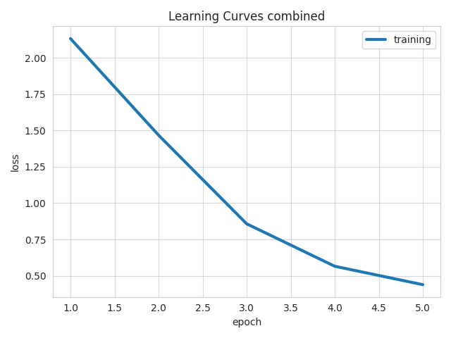

Based on the training curve (blue line), we can draw the following conclusions:

- CONSISTENT IMPROVEMENT:
    Training loss consistently decrease over the five epochs. This indicates that the model is effectively learning and improving its performance on the dataset.
- APPROACHING CONVERGENCE:
    By Epoch 5, the training loss has reduced to less than 0.5. The gradual reduction in losses suggests that the model is approaching convergence, where further training may yield diminishing returns in terms of performance improvement.

## Accuracy

Plotting accuracy over epochs in deep learning is a common practice to visualize how well a model is learning to make correct predictions as training progresses. The x-axis represents the number of epochs, which are complete passes through the training dataset, while the y-axis shows the accuracy, typically expressed as a percentage.
As training progresses, the accuracy on the training data usually increases, indicating that the model is learning to correctly classify more examples. 

> <tip-title>Plotting accuracy and/or Loss</tip-title>
> Plotting accuracy and plotting loss are both essential for monitoring the performance of a deep learning model, but they serve different purposes and provide different insights. While accuracy provides a straightforward measure of model performance, loss offers deeper insights into the training process, making both plots valuable for different aspects of model evaluation.
{: .tip}

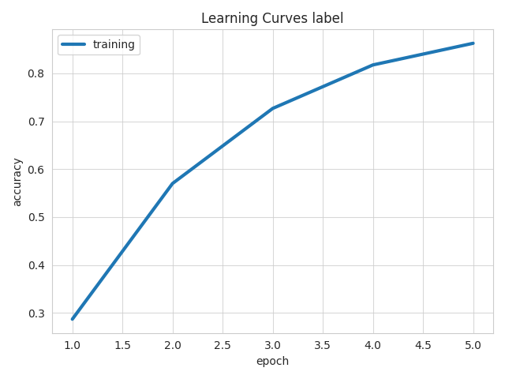

Based on the training curve (blue line), we can draw the following conclusions:

- THE DATASET IS RELATIVELY EASY FOR THE MODEL TO LEARN:
    The model starts with a relatively high training accuracy of >0.8.
- CONSISTENT IMPROVEMENT:
    Training accuracies increase steadily across the epochs. This consistent upward trend indicates that the model is learning effectively and becoming more accurate in its predictions with each epoch.

## Hits at K

This metric measures the proportion of times the correct item is found within the top-k predictions made by the model. X-axis (Epochs) represents the number of training cycles (epochs) completed. Y-axis (Hits at k) represents the hit rate, or the frequency with which the correct item appears in the top k predictions.

> <tip-title>Hits at K trend</tip-title>
> Upward Trend: An upward trend in the graph indicates that the model is improving, as it becomes more likely to rank the correct item within the top k predictions as training progresses. Plateauing: If the graph plateaus, it suggests that the model's performance has stabilized and further training may not yield significant improvements. Fluctuations: Fluctuations in the graph could indicate overfitting, underfitting, or instability in the model's training process.
{: .tip}

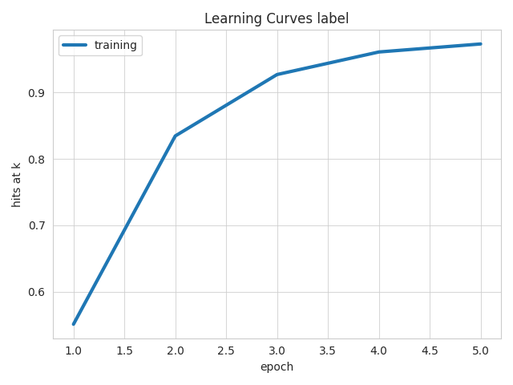

Based on the training curve (blue line), we can draw the following conclusions:

- GOOD MODEL PERFORMANCE:
    The model shows consistent improvement over the epochs and Hits at k approaching near-perfect levels. 
- CONVERGENCE:
    Overall, the graph would depict a rapid increase in performance early on, followed by a plateau as the model approaches optimal performance. This indicates successful training with effective generalization.

# Changing model's configuration (Epoch = 15)

When designing a neural network, it is unfortunately not possible to determine the optimal number of neurons, layers, or other hyperparameters solely from a problem description. There is limited guidance available for selecting appropriate initial values, making it challenging to identify a starting point.

A widely adopted approach involves making an initial estimate based on prior experience with networks designed for similar problems. This experience could be derived from your own work or gathered from secondary sources, such as training courses, blogs, or research papers. From there, it is advisable to experiment with different configurations and carefully evaluate the performance of each before selecting the most effective architecture.

Since we have gathered insights from our recent model, we can now begin testing new configurations and comparing them to the previous results.

## Changing Epochs

For this new configuration, the file has been modified to adjust the Epoch value, increasing it from 5 to 15. Upload the file using the following link:

```
https://zenodo.org/records/13716147/files/config_test_2.yaml
```
If you are comfortable using the same history to run and obtain the results, that is fine. Click on the "Upload Data" button in the navigation bar on the left side, then select "Paste/Fetch Data" to paste the link.

Alternatively, you can create a new history to keep your experiment organized. Follow the steps below to start the new history.

> <tip-title>create new history and upload files</tip-title> 
>
>> <hands-on-title> Environment and Data Upload </hands-on-title>
>>
>> 1. Create a new history for this tutorial. If you are not inspired, you can name it *climate101*.
>>
>>    
>>
>> 2. Import the files from Zenodo or from the shared data library
>>
>>    ```
>>    https://zenodo.org/records/13292895/files/mnist_images.zip
>>    https://zenodo.org/records/13357260/files/mnist_dataset.csv 
>>    https://zenodo.org/records/13716147/files/config_test_2.yaml
>>    ```
>>
>>    
>>
>> 3. Check that the data format assigned for each file is **zip**, **csv**, and **yaml**, respectively.
>>    If it is not, follow the Changing the datatype tip.
>>
>>    
>>
>> 5. Add a tag (`Stacked CNN`) to the dataset corresponding to `config.yaml`
>>    This is important to trace back on what configurations the model was built on.
>>
>>    
>>
>{: .hands_on}
>
{: .tip}

Run the experiment once again. If you need a refresher on how to set up the Ludwig experiment to run the tool, follow the instructions below.

><tip-title>Ludwig Experiment</tip-title>
>
>><hands-on-title> Task description </hands-on-title>
>>
>> 1.  with the following parameters:
>> -  *"Select the dataset containing model configuration"*: `config.yaml`
>> -  *"Input dataset"*: `mnist_dataset.csv`
>> -  *"Raw data"*: `mnist_images.zip`
>>
>>> <comment-title> short description </comment-title>
>>>
>>> Once all the inputs are in place, press the 'RUN TOOL' button to start your job.
>>{: .comment}
>>
>{: .hands_on}
>
{: .tip}

## Ludwig Experiment Report

Here are the results from the new model we have trained and validated. Using your knwoledge from the previous analysis, answers the following questions:

> <comment-title>Confusion Matrix</comment-title>
>
>
>> <question-title></question-title>
>>
>> 1. For which label(s) did the model increase the number of correct predictions?
>>
>>> <solution-title></solution-title>
>>>
>>> 1. The model improved prediction across all labels.
>>>
>>{: .solution}
>>
>{: .question}
>
{:  .comment}

> <comment-title>Entropy</comment-title>
>
>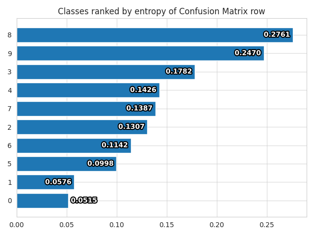
>> <question-title></question-title>
>>
>> 1. For which label(s) did the model decrease the entropy? 
>>
>> 2. Why did the order of the labels change compared to the previous results?
>>
>>> <solution-title></solution-title>
>>>
>>> 1. The model decreased entropy across all labels. 
>>>
>>> 2. For some labels, the entropy drop was more pronounced, moving those labels toward the bottom of the list.
>>>
>>{: .solution}
>>
>{: .question}
>
{:  .comment}

> <comment-title>Loss</comment-title>
>
>
>> <question-title></question-title>
>>
>> 1. Did the increase in Epochs have a significant impact on the model's loss?
>>
>>> <solution-title></solution-title>
>>>
>>> 1. The model's training loss curve showed improvement, reaching a loss below 0.25 by the end of the epochs. 
>>>
>>{: .solution}
>>
>{: .question}
>
{:  .comment}

> <comment-title>Accuracy</comment-title>
>
>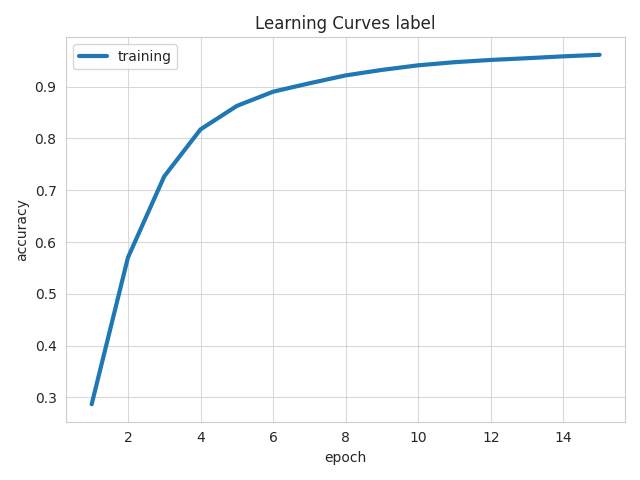
>> <question-title></question-title>
>>
>> 1. Did the increase in Epochs hava a significant impact on the model's accuracy 
>>
>>> <solution-title></solution-title>
>>>
>>> 1. In alignment with the data presented by the confusion matrix, the accuracy exhibited an improvement.
>>>
>>{: .solution}
>>
>{: .question}
>
{:  .comment}

> <comment-title>Hits at K</comment-title>
>
>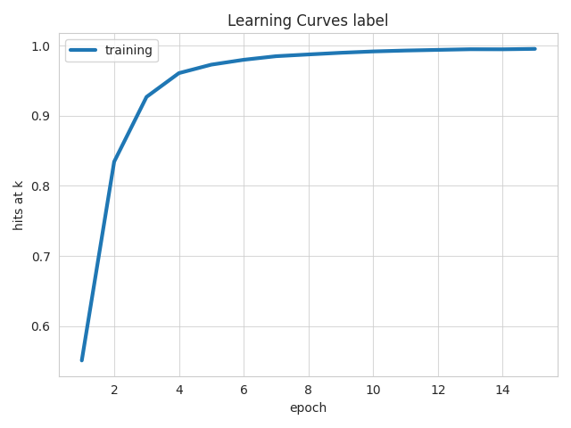
>> <question-title></question-title>
>>
>> 1. Can we infer that, overall, the model is making more accurate label predictions based on the hits at k?
>>
>>> <solution-title></solution-title>
>>>
>>> 1. Yes, the curve for training has approached to 1, indicating that the correct label is now present within the top-k predictions more frequently. 
>>>
>>{: .solution}
>>
>{: .question}
>
{:  .comment}

## One more graph - F1 Score vs Frequency

The F1 score is a metric used to evaluate the performance of a classification model, particularly in cases where the dataset is imbalanced, meaning some classes are more frequent than others. It combines two other important metrics: precision and recall, into a single score that balances them both.

> <tip-title>Precision definition</tip-title>
> Precision: Precision measures the accuracy of positive predictions. It is the ratio of correctly predicted positive observations to the total predicted positives. In other words, it answers the question, "Of all the instances the model predicted as positive, how many were actually positive?
>
>
{: .tip}

> <tip-title>Recall definition</tip-title>
> Recall, also known as sensitivity or true positive rate, measures how well the model identifies all the actual true cases. It is the ratio of correctly predicted positive observations to all observations in the actual class. It answers the question, "Of all the actual true, how many did the model correctly identify? 
>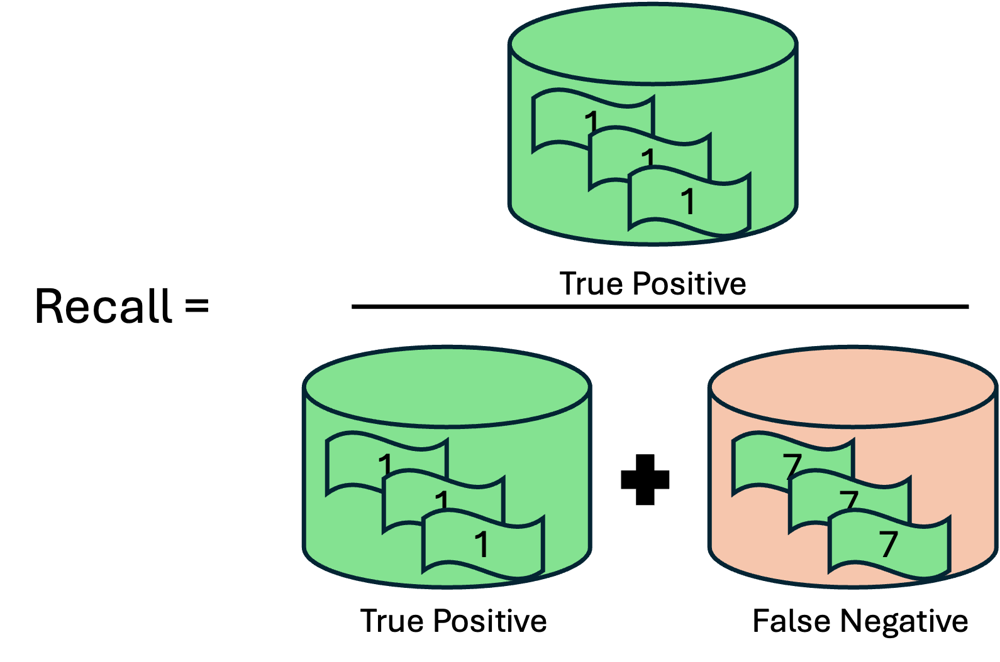
>
{: .tip}


> <tip-title>F1 score definition</tip-title>
> The F1 score is the harmonic mean of precision and recall. Unlike the simple average, the harmonic mean gives more weight to lower values, so the F1 score will be high only if both precision and recall are high.
>
>
{: .tip}

The F1 score vs. frequency label graph is a valuable tool for diagnosing how well a model handles different classes, especially in datasets where some classes are much more common than others. By analyzing this graph, you can identify areas where your model might need more attention, ensuring balanced and accurate predictions across all classes.


Digits like '1' (occurrences > 7800 and F1 score > 0.992) and '0' (occurrences > 6800 and F1 score > 0.980) suggest that the model has learned to accurately identify these digits, despite of the difference when looking the frequency of the digits. Digit '5', with a lower frequency, still achieves a strong F1 score. Although its frequency is the lowest among the digits, the F1 score remains high, indicating that the model maintains a good balance of precision and recall even with fewer examples. This reflects the robustness of the CNN model.

# Conclusion
In this tutorial, we demonstrated how to utilize the Galaxy-Ludwig tool to build an image recognition model using the MNIST dataset of handwritten digits. We followed a structured approach consisting of 
- uploading necessary files, 
- running the Ludwig experiment, and 
- evaluating the model's performance. 

Through the process, we have seen how Ludwig simplifies the complexities of machine learning workflows, making it accessible and efficient for users. Additionally, we explored ways to enhance model performance by adjusting configurations and analyzing detailed evaluation metrics. 

By the end of this tutorial, you should have a solid understanding of how to deploy a handwritten digit classification model and interpret its results effectively.
