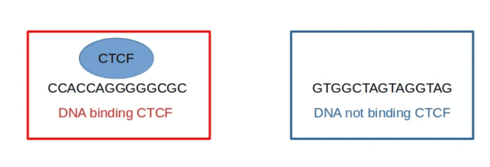

After preparing, training, and utilizing a language model for DNA sequences, we can now fine-tune a pre-trained Large Language Model (LLM) for specific DNA sequence classification tasks. Here, we will use a pre-trained model from Hugging Face, specifically the [Mistral-DNA-v1-17M-hg38](https://huggingface.co/RaphaelMourad/Mistral-DNA-v1-17M-hg38), and adapt it to classify DNA sequences based on their biological functions. Our objective is to classify sequences according to whether they bind to transcription factors.

> <comment-title>Transcription factors</comment-title>
>
> Transcription factors are proteins that play a crucial role in regulating gene expression by binding to specific DNA sequences, known as enhancers or promoters, near the genes they control. These proteins act as molecular switches, turning genes on or off in response to various cellular signals and environmental cues. By binding to DNA, transcription factors either promote or inhibit the recruitment of RNA polymerase, the enzyme responsible for transcribing DNA into RNA, thereby influencing the rate of transcription.
> 
> 
>
> Transcription factors are essential for numerous biological processes, including cell differentiation, development, and response to external stimuli. Their ability to recognize and bind specific DNA sequences allows them to orchestrate complex gene expression programs, ensuring that the right genes are expressed at the right time and in the right place within an organism. Understanding the function and regulation of transcription factors is vital for deciphering the molecular mechanisms underlying health and disease, and it opens avenues for developing targeted therapeutic interventions.
>
{: .comment}

By fine-tuning the model, we aim to leverage its pre-trained knowledge of DNA sequences to achieve high accuracy in this classification task. This tutorial will guide you through the necessary steps, from data preparation to model evaluation, ensuring you can apply these techniques to your own research or projects.

We will use [`Mistral-DNA-v1-17M-hg38`](https://huggingface.co/RaphaelMourad/Mistral-DNA-v1-1M-hg38), a mixed model that was pre-trained on the entire Human Genome. It contains approximately 17 million parameters and was trained using the Human Genome assembly GRCh38 on sequences of 10,000 bases (10K):

```python
model_name="RaphaelMourad/Mistral-DNA-v1-17M-hg38"
```

> <comment-title>Pretraining a LLM</comment-title>
>
> To learn how to pretrain a LLM on DNA, please follow the dedicated ["Pretraining a Large Language Model (LLM) from Scratch on DNA Sequences"]() tutorial
>
{: .comment}


> <agenda-title></agenda-title>
>
> In this tutorial, we will cover:
>
> 1. TOC
> {:toc}
>
{: .agenda}

# Prepare resources

## Install dependencies

The first step is to install the required dependencies:

```python
!pip install accelerate==1.1.0
!pip install peft==0.13.2
!pip install torch==2.5.0
!pip install transformers -U
```

> <question-title></question-title>
>
> 1. What is `accelerate`?
> 2. What is `peft`?
> 3. What is `torch`?
> 4. What is `transformers`?
>
> > <solution-title></solution-title>
> >
> > 1. `accelerate` is a library by [Hugging Face](https://huggingface.co/) -- a platform that provides tools and resources for building, training, and deploying machine learning models -- designed to simplify the process of training and deploying machine learning models across different hardware environments. It provides tools to optimize performance on GPUs, TPUs, and other accelerators, making it easier to scale models efficiently.
> >
> > 2. The PEFT (Parameter-Efficient Fine-Tuning) Python library, developed by Hugging Face, is a tool designed to efficiently adapt large pretrained models to various downstream tasks without the need to fine-tune all of the model's parameters. By focusing on a small subset of parameters, PEFT significantly reduces computational and storage costs, making it feasible to fine-tune large language models (LLMs) on consumer-grade hardware. The library integrates seamlessly with the Hugging Face ecosystem, including Transformers, Diffusers, and Accelerate, enabling streamlined model training and inference. PEFT supports techniques like LoRA (Low-Rank Adaptation) and prompt tuning, and it can be combined with quantization to further optimize resource usage. Its open-source nature fosters collaboration and accessibility, allowing developers to customize models for specific applications quickly and efficiently.
> > 
> > 3. `torch`, also known as PyTorch, it is an open-source machine learning library developed by Facebook's AI Research lab. It provides a flexible platform for building and training neural networks, with a focus on tensor computations and automatic differentiation.
> > 
> > 4. `transformers` is a library by Hugging Face that provides implementations of state-of-the-art transformer models for natural language processing (NLP). It includes pre-trained models and tools for fine-tuning, making it easier to apply transformers to various NLP tasks.
> >
> {: .solution}
>
{: .question}

## Import Python libraries

Let's now import them.

```python
import os

import accelerate
import flash_attn
import numpy as np
import pandas as pd
import torch
import transformers
from accelerate import FullyShardedDataParallelPlugin, Accelerator
from pathlib import Path
from peft import (
    LoraConfig,
    get_peft_model,
    get_peft_model_state_dict,
    prepare_model_for_kbit_training,
)
from progressbar import ProgressBar
from random import randrange
from torch.utils.data import TensorDataset, DataLoader
from torch.distributed.fsdp.fully_sharded_data_parallel import FullOptimStateDictConfig, FullStateDictConfig
from transformers import (
    AutoTokenizer,
    AutoModel,
    BitsAndBytesConfig,
    EarlyStoppingCallback,
    set_seed,
)
```

> <comment-title>Versions</comment-title>
>
> This tutorial has been tested with following versions:
> - `numpy` = 1.19 (and not 1.2)
> - `transformers` > 4.47.1
> 
> You can check the versions with:
>
> ```python
> np.__version__
> transformers.__version__
> ```
{: .comment}

# Configure fine-tuning

## Check and configure available resources

We select the appropriate device (CUDA-enabled GPU if available) for running PyTorch operations

```python
torch.device('cuda' if torch.cuda.is_available() else 'cpu')
```

Let's check the GPU usage and RAM:

```python
!nvidia-smi
```

We now set an environment variable that configures how PyTorch manages CUDA memory allocations

```python
os.environ["PYTORCH_CUDA_ALLOC_CONF"] = "max_split_size_mb:32"
```

## Get data

We will the data with the 1st transcription factor (tf0) in mouse from . We can get the data for from GitHub:

```python
!git clone https://github.com/raphaelmourad/Mistral-DNA.git
```

We now need to uncompress the labeled data:

```python
!tar -xf Mistral-DNA/data/GUE.tar.xz -C Mistral-DNA/data/
```

We change the current working directory to the `Mistral-DNA` folder.

```python
os.chdir("Mistral-DNA/")
print(os.getcwd())
```

Let's define some variables:

```python
expe = "tf/0"
data_path = f"data/GUE/{ expe }" 
```

## Specify settings for quantization

Quantization is a technique used in machine learning and signal processing to reduce the precision of numerical values, typically to decrease memory usage and computational requirements. This process is particularly useful when working with large models as it allows them to be deployed on hardware with limited resources without significantly sacrificing performance.

Here, we use `BitsAndBytesConfig` to configure a 4-bit quantization. Using 4-bit precision reduces the memory footprint of the model, which is particularly useful for very large models that might not fit into GPU memory otherwise:

```python
bnb_config = BitsAndBytesConfig(
    load_in_4bit=True,
    bnb_4bit_use_double_quant=True,
    bnb_4bit_compute_dtype=torch.bfloat16
)
```

> <question-title></question-title>
>
> What do the parameters?
>
> 1. `load_in_4bit=True`
> 2. `bnb_4bit_use_double_quant=True`
> 3. `bnb_4bit_compute_dtype=torch.bfloat16`
>
> > <solution-title></solution-title>
> >
> > 1. `load_in_4bit=True`: Specifies that the model should be loaded with 4-bit quantization. Using 4-bit precision reduces the memory footprint of the model, which is particularly useful for very large models that might not fit into GPU memory otherwise.
> >
> > 2. `bnb_4bit_use_double_quant=True`: enables double quantization, which means that the quantization constants from the first quantization are quantized again. This further reduces the memory footprint, although it may introduce additional computational overhead.
> >
> > 3. `bnb_4bit_compute_dtype=torch.bfloat16`: sets the compute data type to bfloat16 (Brain Floating Point 16-bit format). Using bfloat16 can provide a good balance between computational efficiency and numerical stability, especially on hardware that supports this format, such as certain GPUs and TPUs.
> >
> {: .solution}
>
{: .question}

## Configure Accelerate

Now, we will configure the [Hugging Face Accelerate library](https://huggingface.co/docs/accelerate/en/index) to optimize the training process for large models using Fully Sharded Data Parallel (FSDP). This setup is crucial for efficiently utilizing GPU resources and enabling distributed training across multiple devices.

First, we need to configure the FSDP plugin, which will manage how model parameters and optimizer states are sharded across GPUs. This configuration helps in reducing memory usage and allows for the training of larger models.

```python
fsdp_plugin = FullyShardedDataParallelPlugin(
    state_dict_config=FullStateDictConfig(offload_to_cpu=True, rank0_only=False),
    optim_state_dict_config=FullOptimStateDictConfig(offload_to_cpu=True, rank0_only=False),
)
```
> <question-title></question-title>
>
> What do the parameters?
> 
> 1. `state_dict_config=FullStateDictConfig(offload_to_cpu=True, rank0_only=False)`?
> 2. `optim_state_dict_config=FullOptimStateDictConfig(offload_to_cpu=True, rank0_only=False)`?
>
> > <solution-title></solution-title>
> >
> > 1. `state_dict_config=FullStateDictConfig(offload_to_cpu=True, rank0_only=False)`
> >    - `FullStateDictConfig`: Configures how the model's state dictionary (parameters) is managed.
> >    - `offload_to_cpu=True`: Specifies that the model's parameters should be offloaded to CPU memory when not in use. This helps free up GPU memory, especially useful when working with large models.
> >    - `rank0_only=False`: Indicates that the state dictionary operations (like saving and loading) are not restricted to the rank 0 process. This allows all processes to participate in these operations, which can be beneficial for distributed training setups.
> >
> > 2. `optim_state_dict_config=FullOptimStateDictConfig(offload_to_cpu=True, rank0_only=False)`
> >    - `FullOptimStateDictConfig`: Configures how the optimizer's state dictionary is managed.
> >    - `offload_to_cpu=True`: Similar to the model's state dictionary, this setting offloads the optimizer states to CPU memory when not in use, further reducing GPU memory usage.
> >    - `rank0_only=False`: Allows all processes to handle the optimizer state dictionary operations, ensuring that the optimizer states are managed efficiently across the distributed setup.
> >
> {: .solution}
>
{: .question}

Next, we initialize the Accelerator from the Hugging Face Accelerate library, integrating the FSDP plugin for seamless distributed training:

```python
accelerator = Accelerator(fsdp_plugin=fsdp_plugin)
```

By passing the FSDP plugin to the `Accelerator`, we enable sharded data parallelism, which efficiently manages model and optimizer states across multiple GPUs.

With this configuration, the `Accelerator` will handle the complexities of distributed training, allowing us to focus on developing and experimenting with our models. This setup is particularly beneficial when working with large-scale models and limited GPU resources, as it optimizes memory usage and enables faster training times.

## Configure LoRA for Parameter-Efficient Fine-Tuning

We will configure the LoRA (Low-Rank Adaptation) settings for parameter-efficient fine-tuning of a large language model. LoRA is a technique that allows us to fine-tune only a small number of additional parameters while keeping the original model weights frozen, making it highly efficient for adapting large models to specific tasks.

We use the `LoraConfig` class to define the settings for LoRA. This configuration specifies how the low-rank adaptations are applied to the model.

```python
peft_config = LoraConfig(
    r=16,
    lora_alpha=16,
    lora_dropout=0.05,
    bias="none",
    task_type="SEQ_CLS",
    target_modules=["q_proj", "k_proj", "v_proj", "o_proj", "gate_proj"]
)
```

> <question-title></question-title>
>
> What do the parameters?
> 
> 1. `r=16`?
> 2. `lora_alpha=16`?
> 3. `lora_dropout=0.05`?
> 4. `bias="none"`?
> 5. `task_type="SEQ_CLS"`?
> 6. `target_modules=["q_proj", "k_proj", "v_proj", "o_proj", "gate_proj"]`?
>
> > <solution-title></solution-title>
> >
> > 1. `r=16`: This parameter specifies the rank of the low-rank matrices used in the adaptation. A higher rank allows the model to capture more complex patterns but also increases the number of trainable parameters.
> >
> > 2. `lora_alpha=16`: This scaling factor controls the magnitude of the updates applied by the low-rank matrices. It helps balance the influence of the adaptations relative to the original model weights.
> >
> > 3. `lora_dropout=0.05`: Dropout is applied to the low-rank matrices during training to prevent overfitting. A dropout rate of 0.05 means that 5% of the elements are randomly set to zero during each training step.
> >
> > 4. `bias="none"`: This setting specifies that no bias parameters are added to the low-rank adaptations. Other options include "all" to add biases to all layers or "lora_only" to add biases only to the LoRA layers.
> >
> > 5. `task_type="SEQ_CLS"`: This indicates that the model is being fine-tuned for a sequence classification task. Other task types might include "CAUSAL_LM" for causal language modeling or "SEQ_2_SEQ_LM" for sequence-to-sequence tasks.
> >
> > 6. `target_modules=["q_proj", "k_proj", "v_proj", "o_proj", "gate_proj"]`: This list specifies the modules within the model architecture to which the LoRA adaptations will be applied. These modules are typically the attention layers in transformer models:
> >    - `"q_proj"`: query projections
> >    - `"k_proj"`: key projections
> >    - `"v_proj"`: value projections
> >    - `"o_proj"`: output projections
> >    - `"gate_proj"`: gating projections in some architectures.
> >
> {: .solution}
>
{: .question}

By configuring LoRA in this way, we can efficiently adapt a large pretrained model to a specific task with minimal computational overhead, making it feasible to fine-tune on consumer-grade hardware. This approach is particularly useful for tasks like text classification, sentiment analysis, or any other application where we need to specialize a general-purpose language model.

## Configure Training Arguments

Let's now set up the training arguments using the `TrainingArguments` class from the Hugging Face Transformers library. These arguments define the training configuration, including hyperparameters and settings for saving and evaluating the model.

```python
training_args = transformers.TrainingArguments(
    output_dir="./results",
    evaluation_strategy="epoch",
    save_strategy="epoch",
    learning_rate=1e-5,
    per_device_train_batch_size=16,
    per_device_eval_batch_size=16,
    num_train_epochs=5,
    weight_decay=0.01,
    bf16=True,
    report_to="none",
    load_best_model_at_end = True,
    report_to="none",
)
```

> <question-title></question-title>
>
> What do the parameters?
>
> 1. `output_dir="./results"`
> 2. `evaluation_strategy="epoch"`
> 3. `save_strategy="epoch"`
> 4. `learning_rate=1e-5`
> 5. `per_device_train_batch_size=16`
> 6. `per_device_eval_batch_size=16`
> 7. `num_train_epochs=5`
> 8. `weight_decay=0.01`
> 9. `bf16=True`
> 10. `report_to="none"`
> 11. `load_best_model_at_end=True`
> 
> > <solution-title></solution-title>
> >
> > 1. `output_dir="./results"`: Specifies the directory where the model predictions and checkpoints will be saved.
> >
> > 2. `evaluation_strategy="epoch"`: The model will be evaluated at the end of each epoch. This allows for monitoring the model's progress and adjusting the training process as needed.
> >
> > 3. `save_strategy="epoch"`: The model checkpoints will be saved at the end of each epoch.  This ensures that checkpoints are available for each complete pass through the dataset.
> >
> > 4. `learning_rate=1e-5`: Sets the initial learning rate for the optimizer. This rate determines how much the model's weights are updated during training.
> >
> > 5. `per_device_train_batch_size=16`: The number of samples per device (e.g., GPU) to load for training. 
> >
> > 6. `per_device_eval_batch_size=16`: The number of samples per device to load for evaluation.
> >
> > 7. `num_train_epochs=5`: The total number of training epochs. An epoch is one complete pass through the training dataset.
> >
> > 8. `weight_decay=0.01`: Applies L2 regularization to the model weights to prevent overfitting.
> >
> > 9. `bf16=True`: Enables mixed precision training using bfloat16, which can speed up training and reduce memory usage on compatible hardware.
> >
> > 10. `report_to="none"`: Disables reporting to external services like WandB or TensorBoard. If you want to track metrics, you can set this to "wandb", "tensorboard", etc.
> >
> > 11. `load_best_model_at_end=True`: Ensures that the best model based on evaluation metrics is loaded at the end of training.
> >
> {: .solution}
>
{: .question}

These settings provide a balanced configuration for training a model efficiently while ensuring that the best version of the model is saved and can be used for further evaluation or deployment. Adjust these parameters based on your specific use case and available computational resources.

# Create and train model

- 
- test with and without LORA
- test with and without quantization
- test with regular attention and with flash attention 2
- test with and with bf16
- change learning rate
- change batch size

```python

# load tokenizer
tokenizer = transformers.AutoTokenizer.from_pretrained(
    model_name,
    model_max_length=200,
    padding_side="right",
    use_fast=True,
    trust_remote_code=True,
)
tokenizer.eos_token = "[EOS]"
tokenizer.pad_token = "[PAD]"
```

define datasets and data collator

```python
train_dataset = SupervisedDataset(
    tokenizer=tokenizer,
    data_path=Path(data_path / "train.csv"),
    kmer=-1,
)
val_dataset = SupervisedDataset(
    tokenizer=tokenizer,
    data_path=Path(data_path / "dev.csv"),
    kmer=-1,
)
test_dataset = SupervisedDataset(
    tokenizer=tokenizer,
    data_path=Path(data_path / "test.csv"),
    kmer=-1,
)
data_collator = DataCollatorForSupervisedDataset(tokenizer=tokenizer)
```

load model

```python
model=transformers.AutoModelForSequenceClassification.from_pretrained(
    model_name,
    num_labels=2,
    output_hidden_states=False,
    quantization_config=bnb_config,
    device_map='auto',
    trust_remote_code=True,
)
model.config.pad_token_id = tokenizer.pad_token_id
#model = prepare_model_for_kbit_training(model)
#model = get_peft_model(model, peft_config)
#model = accelerator.prepare_model(model)
```

Setup trainer

```python
trainer = transformers.Trainer(model=model,
                               args=training_args,
                               compute_metrics=compute_metrics,
                               train_dataset=train_dataset,
                               eval_dataset=val_dataset,
                               data_collator=data_collator,
                              callbacks = [EarlyStoppingCallback(early_stopping_patience=3)]
                              )
trainer.local_rank=training_args.local_rank
trainer.train()
```


Check metrics on test data
get the evaluation results from trainer

```python
results_path = training_args.output_dir+"/metrics"
results = trainer.evaluate(eval_dataset=test_dataset)
os.makedirs(results_path, exist_ok=True)
with open(os.path.join(results_path, "test_results.json"), "w") as f:
    json.dump(results, f)

file_metric="results/mixtral-dna/GUE/"+expe+"/metrics/test_results.json"
data_expe = pd.read_json(file_metric, typ='series')
print(data_expe)
```


    eval_loss                      0.424961
    eval_accuracy                  0.804000
    eval_f1                        0.800838
    eval_matthews_correlation      0.628276
    eval_precision                 0.824614
    eval_recall                    0.804000
    eval_runtime                   6.548800
    eval_samples_per_second      152.699000
    eval_steps_per_second          9.620000
    epoch                          3.000000
    dtype: float64
