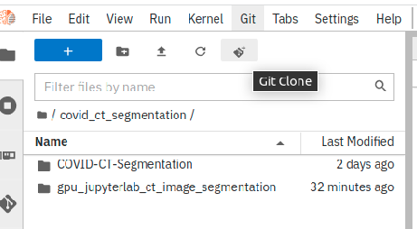
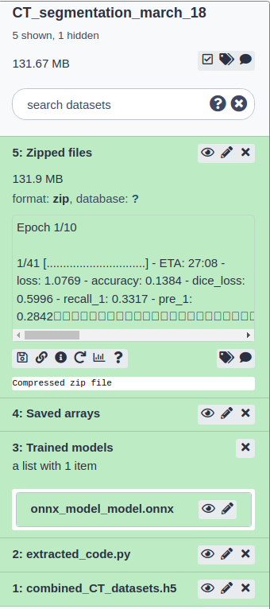

> <agenda-title></agenda-title>
>
> In this tutorial, we will cover:
>
> 1. TOC
> {:toc}
>
{: .agenda}

# Introduction
[Jupyterlab](https://jupyterlab.readthedocs.io/en/stable/) is a popular integrated development environment (IDE) for a variety of tasks in data science such as prototyping analyses, creating meaningful plots, data manipulation and preprocessing. Python is one of the most used languages in such an environment. Given the usefulness of Jupyterlab, more importantly in online platforms, a robust Jupyterlab notebook application has been developed that is powered by GPU acceleration and contains numerous packages such as Pandas, Numpy, Scipy, [Scikit-learn](https://scikit-learn.org/), [Tensorflow](https://www.tensorflow.org/), [ONNX](https://onnx.ai/) to support modern data science projects. It has been developed as an interactive Galaxy tool that runs on an isolated [docker container](https://github.com/anuprulez/ml-jupyter-notebook). The docker container has been built using [jupyter/tensorflow-notebook:tensorflow-2.6.0](https://hub.docker.com/layers/jupyter/tensorflow-notebook/tensorflow-2.6.0/images/sha256-23ac04200f8f6ee4a224f7f8cb48c810e24bc18cdd20a3614d1914e01f950969?context=explore) as the base container. Moreover, a Galaxy [tool](https://github.com/bgruening/galaxytools/pull/1157) ( `run_jupyter_job`) can be executed using [Bioblend](https://bioblend.readthedocs.io/) which uses Galaxy's remote job handling for long-running machine learning and deep learning training. The training happens remotely on a Galaxy cluster and the outcome datasets such as the trained models, tabular files and so on are saved in a Galaxy history for further use.

## Features of Jupyterlab
[Jupyterlab](https://jupyterlab.readthedocs.io/en/stable/) notebook has been augmented with several useful features and together they make it ready-to-use for quick prototyping and end-to-end artificial intelligence (AI) projects. Being able to **serve online** makes it convenient to share it with other researchers and users. Its features can be broadly classified into two categories - features that have been added solely as Python packages and those that have been added also as Python packages but have their respective user interfaces. We will briefly discuss these features and later, we will use some of those for building and using AI models.

#### Features (Python packages)
Accessibility to many features has been made possible by adding several compatible Python packages, the most prominent ones are Bioblend, [CUDA](https://developer.nvidia.com/cuda-toolkit) and ONNX. Using Bioblend the notebook can be **connected to Galaxy** and its histories, tools and workflows can be accessed and operated using various commands from the notebook. GPUs have accelerated AI research, especially deep learning. Therefore, the backend of the Jupyterlab is **powered by GPU** to make long-running AI training programs finish faster by parallelizing matrix multiplications. CUDA acts as a bridge between GPU and AI algorithms. In addition, a standard AI model format, **open neural network exchange (ONNX)**, has been supported in the notebook to transform Scikit-learn and Tensorflow models to `onnx` files. These model files can be conveniently shared and used for inference. Galaxy also supports `onnx` file format which makes it easier to interoperate such models from a notebook to Galaxy and vice-versa. Galaxy tool for **remote training** can also run on GPU. There are several additional packages, suited for performing machine learning tasks such as Scikit-learn and Tensorflow for developing AI algorithms, [Open-CV](https://github.com/opencv/opencv) and [Scikit-Image](https://scikit-image.org/) for image processing, [NiBabel](https://nipy.org/nibabel/) package for processing images files have been made available to researchers.

#### Features (Python packages with user interfaces)
There are other features, added as Python packages, that have user interface components. These include **[GPU utilization dashboards](https://github.com/rapidsai/jupyterlab-nvdashboard)** for monitoring the GPU usage and system memory utilization, **[Voila](https://github.com/voila-dashboards/voila)** for rendering output cells of a notebook in a separate tab hiding all code cells, interactive **[Bqplots](https://github.com/bqplot/bqplot)** for plotting, **[Git](https://github.com/jupyterlab/jupyterlab-git)** version control to clone, commit and maintain codebase directly from the notebook and **[Elyra AI](https://elyra.readthedocs.io/en/stable/)** pipelines for knitting together multiple notebooks to create a workflow. Many notebooks are created for processing datasets in different ways. These notebooks can be knit together to form one pipeline where each notebook transforms datasets taking a different form of data from its previous notebook and passing on the transformed datasets to its next notebook. An example workflow created using Elyra AI can be found by the name "METABRIC\_ML.pipeline" in the "elyra" folder of a typical Jupyterlab instance. These pipelines can also be executed remotely on multiple "runtimes" supported by docker containers. An example pipeline created in the notebook can be seen in Figure 1. These features, integrated into the Jupyterlab notebook, are useful for the efficient execution and management of data science projects.


In the following sections, we will look at two examples of machine learning analyses - image segmentation and prediction of 3D structure of protein sequences. We will go through each step of how to perform such analyses in this Jupyterlab notebook.

## Image segmentation
In an image classification task, a label is assigned to each image. For example, an image containing a cat gets a label as "cat" ("cat" is given an integer to be used in a machine learning program). But, in an image segmentation task, each pixel of an image gets a label. For example, in an image containing a cat, all the pixels occupied by the cat in the image are denoted by violet color (see Figure 2). More information can be found in the [image segmentation](https://www.tensorflow.org/tutorials/images/segmentation) tutorial. Image segmentation is a widely used technique in many fields such as medical imaging to find out abnormal regions in images of tissues, self-driving cars to detect different objects on highways and many more.


## COVID CT scan
Segmenting lung CT scans task to locate infected regions has been actively proposed to augment the RT-PCR testing for initial screening of COVID infection in humans. Deep learning has been used to predict these regions with high accuracy in studies such as ,  and many more. In Figure 3, the differences between the CT scans of a normal person and a person suffering from COVID-19 can be seen. The regions of the lungs marked by white patches are infected as discussed in .

 Lungs CT scan for a normal person and (right) lungs CT scan for a person having COVID-19")


## CT scans and masks
Figure 4 shows CT scans of infected lungs (top row) and borders around the infected regions have been drawn with red color (middle row). In the last row respective masks, from the CT scans, have been taken out denoting the infected regions. These masks are the "segmented" regions from the corresponding CT scans. While creating a dataset for training the deep learning model, Unet (briefly discussed in the following section), the CT scans are the data points and its "known" respective masks of infected regions become their labels ().


### Unet neural network
Unet neural network is widely used for segmentation tasks in images (). The name "Unet" resembles the shape of its architecture as "U" (see Figure 5). It has two parts - encoder and decoder. The left half of the "U" shape is the encoder that learns the feature representation (downsampling) at a lower level. The right half is the decoder that maps the low-resolution feature representation on the higher resolution (upsampling) pixel space.


In this tutorial, we will use the dataset of CTs scans and their respective masks to train an Unet neural network model. The model learns to map the infected regions in the CT scans to their masks. For prediction, the trained model is given unseen CT scans and for each CT scan, it predicts infected regions or masks. For this experiment, we will use Jupyterlab for cloning the notebooks from Github that contain scripts for downloading data, creating and training Unet model and prediction tasks. Data (CT scans and also the trained model) required for the notebooks can be downloaded from Zenodo (). The model can either be trained in Jupyterlab or can be sent to Galaxy's cluster for remote processing. After remote processing, the created datasets such as the trained model become available in new Galaxy history.

## Protein 3D structure
Understanding the structure of proteins provides insights into their functions. But, only a few proteins have known structures out of billions of known proteins. To advance in the direction of predicting their 3D structures only from their sequences, AlphaFold2 () has made a breakthrough to predict their structures with high accuracy. However, the databases that it uses are large, approximately 2 terabytes (TB), and are hard to store and manage. Therefore, to make it more accessible, a few approaches such as ColabFold (), have been developed that consume significantly less memory, much faster and produce 3D structures with similar accuracy. We will look at, in later sections, how we can use ColabFold to predict 3D structure of a protein sequence using the Jupyterlab infrastructure in Galaxy.

# Reproduce results from recent publications
First, we will discuss a few features of Jupyterlab to create and train a Unet deep learning model and then, predict segmented regions in COVID CT scans using the trained Unet model (). In addition, we will predict 3D structure of protein sequence using ColabFold (), a faster implementation of AlphaFold2. First, let's start the Jupyterlab instance on Galaxy Europe. The interactive tool can be found by searching "GPU enabled Interactive Jupyter Notebook for Machine Learning" name in the tool search.

## Open Jupyterlab

> <hands-on-title>GPU enabled Interactive Jupyter Notebook for Machine Learning</hands-on-title>
>
> - 
>    - *"Do you already have a notebook?"*: `Start with a fresh notebook`
>    - Click *"Execute"*
>
{: .hands_on}

Now, we should wait for a few minutes until Galaxy creates the required compute environment for opening a new Jupyterlab. Usually, this task takes around 10-15 minutes. The progress can be checked by clicking on the "User>Active Interactive tools". On "Active Interactive Tools" page, there is a list of all open interactive tools. When the job info shows "running" on the "Active Interactive Tools" page, then the name of the interactive tool gets associated with a URL to the running Jupyterlab. On clicking this URL, the running Jupyterlab can be opened. Several features of Jupyterlab running in Galaxy can be learned by going through the "home_page.ipynb" notebook. The folder "notebooks" contain several notebooks that show multiple use-cases of features and packages. Now, let's download the necessary notebooks from Github for performing image segmentation and predicting 3D structure of protein sequences.

## Clone Github repository
To use Git version control for cloning any codebase from GitHub, the following steps should be performed.

> <hands-on-title>Pull code</hands-on-title>
>
> 1. Create a new folder named `covid_ct_segmentation` alongside other folders such as "data", "outputs", "elyra" or you can use your favourite folder name.
> 2. Inside the created folder, clone a code repository by clicking on "Git" icon as shown in Figure 6.
> 3. In the shown popup, provide the repository path as shown below and then, click on "clone":
> > ```
> > https://github.com/anuprulez/gpu_jupyterlab_ct_image_segmentation
> > ```
> 4. The repository "anuprulez/gpu_jupyterlab_ct_image_segmentation" gets immediately cloned.
> 5. Move inside the created folder `gpu_jupyterlab_ct_image_segmentation`. A few notebooks can be found inside that are numbered.
>    
>
{: .hands_on}

Now, we have all the notebooks available for performing image segmentation and predicting 3D structures of protein sequences. The entire analysis of image segmentation can be completed in two ways - first by running 3 notebooks (numbered as 1, 2 and 3) in the Jupyterlab itself and second by using 4, 5 and 6 notebooks that start remote training on Galaxy cluster invoking another Galaxy tool from one of the notebooks. First, let's look at how we can run this analysis in the notebook itself.


## Use-case 1: Run image segmentation analysis

### Run notebooks in Jupyterlab

> <hands-on-title>Run notebooks in Jupyterlab</hands-on-title>
>
> 1. Download and save datasets in the notebook using **"1_fetch_datasets.ipynb"** notebook. It creates all the necessary folders and then, downloads two datasets - one "h5" file containing many matrices as sub-datasets belonging to training data, training labels, validation data, validation labels, test data and test labels. 
>
>    > <comment-title></comment-title>
>    >  Sub-datasets are stored as different variables after reading the original `h5` file once. For training, we only need these datasets/matrices - training data, training labels, validation data and validation labels. The matrices, test data and test labels, are used only for prediction. We use `h5` format for storing and retrieving datasets as all AI algorithms need input datasets in the form of matrices. Since, in the field of AI, there are many different types of datasets such as images, sequences, real numbers and so on, therefore, to converge all these different forms of datasets into one format, we use `h5` to store matrices. In any AI analysis, different forms of datasets can be stored as `h5` files. Therefore, for the image segmentation task, all the input datasets/matrices to the deep learning model are saved as sub-datasets in one `h5` file so that they can be easily created, stored, downloaded and used. This step may take a few minutes as it downloads around 450 MB of data from Zenodo (). Once these datasets are downloaded to the notebook, we can move to the next step to create a deep learning model and start training it.
>    >
>    {: .comment}
>
> 2. Create and train a deep learning Unet model using **"2_create_model_and_train.ipynb"** notebook. This will read the input `h5` dataset containing all images and train the model after creating deep learning model architecture.
>
>    > <comment-title></comment-title>
>    > This notebook first creates a deep learning architecture based on Unet including custom loss functions such as total variation and binary cross-entropy losses. After creating the deep learning architecture, all training datasets such as training data, training labels, validation data, validation labels are loaded from the combined `h5` file. In the next step, all the datasets and deep learning architecture are compiled together and training starts for 10 epochs (10 iterations over the entire training dataset). The training is fast as it runs on GPU and finishes in a few minutes and creates a trained model. In the last step, the trained model containing several files is converted to one `onnx` file. Once a trained model is ready, we can move to the next step to make predictions on unseen CT scan masks.
>    >
>    {: .comment}
>
> 3. Predict unseen masks using the trained model in **"3_predict_masks.ipynb"** notebook.
>
>    > <comment-title></comment-title>
>    > First, it reads test datasets from the combined "h5" file and then, loads the `onnx` model. Using this model, it predicts masks of unseen CT scans and then plots the ground truth and predicted masks in one plot (see Figure 7)
>    >
>    {: .comment}
>
>  are very close to the corresponding original masks in the second column")
>
> Figure 7 shows original lungs CT scans in the first column. The second column shows the corresponding true infected regions in white. The third and fourth columns show the infected regions predicted with different loss functions, one is the binary cross-entropy loss and another is the combination of binary cross-entropy loss and total variation loss. Binary cross-entropy calculates loss between two corresponding pixels of true and predicted images. It measures how close the two corresponding pixels are. But, total variation loss measures the amount of noise in predicted images as noisy regions usually show large variations in their neighbourhood. The noise in the predicted images gets minimized and the connectivity of predicted masks improves as well when minimizing this loss.
>
{: .hands_on}


### Run Jupyterlab notebooks remotely on a Galaxy cluster

The training task completed in the notebook above can also be sent to a Galaxy cluster by executing a Galaxy tool in the notebook itself. Using [Bioblend](https://bioblend.readthedocs.io/) APIs, datasets in the form of `h5` files and notebook are uploaded to a Galaxy history and then a Galaxy tool `run_jupyter_job` executes the notebook using the uploaded dataset on a Galaxy cluster and creates a trained model in the Galaxy history. Let's look at how to execute a notebook remotely on a Galaxy cluster.

> <hands-on-title>Run Jupyterlab notebooks remotely on a Galaxy cluster</hands-on-title>
>
> 1. Download and save datasets in the notebook using **"1_fetch_datasets.ipynb"** notebook in the same way as before. Ignore this step if this notebook has already been executed.
> 2. Execute **"5_run_remote_training.ipynb"** notebook to dynamically execute code inside **"4_create_model_and_train_remote.ipynb"** notebook on a remote cluster using a different Galaxy tool (`run_jupyter_job`). The notebook **"5_run_remote_training.ipynb"** provides the path of a notebook to be executed remotely along with the datasets to the Galaxy tool by calling a custom function `run_script_job` which is part of the Jupyterlab notebook. 
>
>    > <comment-title></comment-title>
>    > Executing **"5_run_remote_training.ipynb"** uploads datasets and dynamic Python script, extracted from the **"4_create_model_and_train_remote.ipynb"** notebook, to a newly created Galaxy history (Figure 8). When the task of uploading dataset and dynamic code is finished, the Galaxy tool (`run_jupyter_job`) executes the dynamically uploaded script with the uploaded dataset on a remote Galaxy cluster which is similar to running any other Galaxy tool. When the Galaxy tool (`run_jupyter_job`) finishes its execution, the resulting models and other datasets appear in the created Galaxy history. While the job is running on the Galaxy cluster, the Jupyter notebook can be closed as the model training task gets decoupled from the notebook and is entirely transferred to the Galaxy cluster. Specific history used for this job can be accessed in Galaxy. The Jupyterlab method `run_script_job` has multiple input parameters - `script_path`: relative path to the script that is to be executed remotely, `data_dict`: list of input datasets as `h5` files, `server`: Galaxy server URL, `key`: Galaxy API key and `new_history_name`: the name of the Galaxy history that is created). 
>    >
>    {: .comment}
>
>    > 
> 
> **Note**: The training may take longer depending on how busy Galaxy's queueing is as it sends the training task to be done on a Galaxy cluster. Therefore, this feature should be used when the training task is expected to run for several hours. The training time is higher because a large Docker container is downloaded on the assigned cluster and only then, the training task can proceed.
>
{: .hands_on}


When the Galaxy job finishes, it creates a history having a few datasets such as input `h5` dataset, dynamic Python script extracted from the notebook, a trained model saved as `onnx` file, all saved lists and NumPy arrays and a zipped file containing all the intermediate files created and saved in the dynamic script. One such example of a Galaxy history is available [here](https://usegalaxy.eu/u/kumara/h/ctsegmentationmarch18). Datasets from this history can be downloaded into the Jupyterlab notebook and further analyses can be performed. Using the notebook **"6_predict_masks_remote_model.ipynb"**, the trained model can be downloaded from the newly created Galaxy history to Jupyterlab notebook and then, it can be used to make predictions of unseen CT scan masks in the same way as shown in **"3_predict_masks.ipynb"** notebook.


## Use-case 2: Run ColabFold to predict 3D structure of protein

Google Deepmind’s AlphaFold2 has made a breakthrough in predicting the 3D structure of proteins with outstanding accuracy. However, due to their large database size (a few TB), it is not easily accessible to researchers. Therefore, a few approaches have been developed that replace the time-consuming steps of AlphaFold2 with slightly different steps to create input features and predict the 3D structure with comparable accuracy as AlphaFold2. One such approach is ColabFold which replaces the large database search in AlphaFold2 for finding homologous sequences by a significantly faster [MMseqs2 API](https://github.com/soedinglab/MMseqs2) call to generate input features based on the query protein sequence. ColabFold is approximately 16 times faster than AlphaFold2 in predicting 3D structures of protein sequences. To make it accessible in this Jupyterlab, it has been integrated into the Docker container by having two additional packages - ColabFold and the GPU enabled [JAX](https://github.com/google/jax) which is just-in-time compiler from Google used for mathematical transformations. In the following hands-on section, we will run a notebook and predict a 3D structure of a protein sequence. 

> <hands-on-title>Predict 3D structure of protein using ColabFold</hands-on-title>
>
> 1. Clone a Github repository by following the steps described in the previous hands-on section `Clone Github repository`. Ignore this step if already done.
> 2. Open **7_ColabFold_MMseq2.ipynb** notebook and execute it.
> 3. It needs a few minutes (around 5-10 minutes) to download AlphaFold2 weights (of size approximately 4 GB) and uses these weights for prediction. An example prediction is shown in figure 9. 
> 
>
{: .hands_on}


## Docker's security
For remote training, a dynamic Python script is sent to a Galaxy tool for execution on a Galaxy cluster that may pose security risks of containing malicious code. To minimize the security risks that come along with executing dynamic Python scripts, the Galaxy tool `run_jupyter_job` is executed inside a [Docker container](https://github.com/anuprulez/ml-jupyter-notebook). It is the same container inside which the Jupyterlab notebook runs. All the packages available inside the notebook are also available for the Galaxy tool. Programs run in isolated environments inside Docker containers and have their connections limited to necessary libraries, and network connections. Due to these restrictions, they have a reduced number of interactions with the host operating system.


# Conclusion
In this tutorial, we have discussed several features of the Jupyterlab notebook in Galaxy and used a few of them to perform an image segmentation task on COVID CT scans by training Unet, a deep learning model. In addition, we have used it for predicting 3D structure of a protein sequence which is a memory-intensive and time-consuming task. The ready-to-use infrastructure that we employed here for developing an AI algorithm and training a model shows that it is convenient for creating quick prototypes and end-to-end projects, accelerated by GPU, in the data science field without caring much about the storage and compute resources.

The possibility of remote execution of long-running training tasks obviates keeping the notebook or computer open till the training finishes and at the same time, the datasets and models stay safe in Galaxy history. The usage of `h5` files for input datasets to AI algorithms solves the problem of varying data formats across multiple fields that are used extensively for predictive tasks. Using `onnx` for creating, storing and sharing an AI model makes it easier to handle such it as one compact file. Git integration makes it easy to maintain an entire code repository directly in the notebook. The entire environment can be shared with other researchers only via sharing the URL of the Jupyterlab. Bioblend connects this infrastructure to Galaxy which makes its histories, workflows and tools accessible directly via the notebook. Overall, this infrastructure would prove useful for researchers having little access to large compute resources to develop and manage quick prototypes and end-to-end data science projects.
