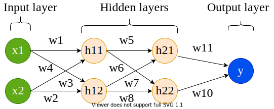
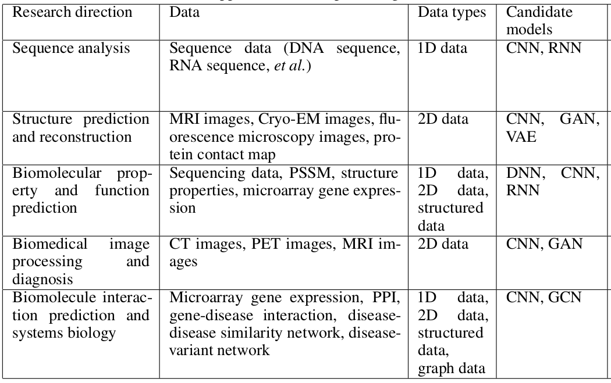
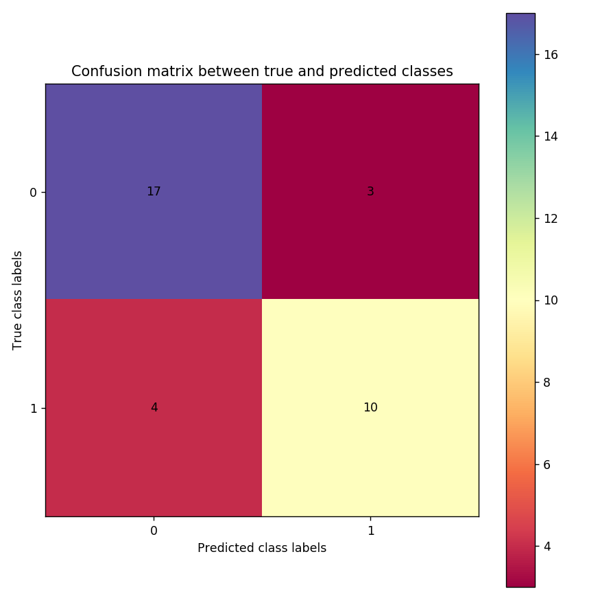

## Introduction

### Deep learning and neural networks
[Deep learning](https://en.wikipedia.org/wiki/Deep_learning), a branch of artificial intelligence, provides a collection of learning methods to model data with complex architectures to perform different non-linear transformations of data. Using these transformations, patterns are recognised in large volumes of data and new data can be categorised using these patterns extracted on existing data. These patterns are learned by computational models devised using different architectures of neural networks. In the recent years, the neural network architectures such as convolutional, long short-term memory networks, deep belief networks have become increasingly popular as machine learning tools in the fields of computer vision, image analysis, bioinformatics, speech recognition, natural language processing and so on achieving state-of-the-art performance, sometimes exceeding human performance. The availability of greater computational resources, more data, new algorithms for training deep models and easy to use libraries for implementation and training of neural networks are the drivers of this development. Deep learning works by approximating the mathematical function which maps data to its output and it has been shown that it can [approximate](https://arxiv.org/pdf/1910.03344.pdf) any function making it widely popular across multiple fields to analyse data. A neural network is a web of artificial neurons which are also called processing units. The idea of a neural network is inspired by [biological neural networks](https://en.wikipedia.org/wiki/Neural_circuit) where neuronal circuits are used to process information and learn. An artificial neural network is structured into multiple layers where each layer contains several neurons. The neurons from adjacent layers are interconnected ([feed-forward neural network](https://en.wikipedia.org/wiki/Feedforward_neural_network)) allowing the exchange of information between layers of neurons.

 and its corresponding weight w (w1, w2, ..., wn) are vectors. The input and its weight are transformed to produce an output y")

An artificial neuron is shown in Figure 1. The neuron, shown in orange, takes input `x` (only `x1` and `x2` are shown for simplicity) and computes output `y`. The entities `w1`, `w2` are the weights of the connections (between inputs and neuron). The weights and inputs are combined following the basic principles of mathematics to produce output `y` (shown in Figures 2, 3 and 4).

 of the input vector (x).")

 of the input vector (x).")

Weights denote the significance of a particular input to produce the observed output. When it is large, the input is significant and when small, the input is less significant to produce the output. These weights can be initialised randomly and they are modified throughout the learning by a neural network. Using the updated inputs (as shown in the above equations), the output is computed:


where *f* is an activation function. An [activation function](https://keras.io/activations/) is a mathematical function which translates the combination of inputs to an output. The choices of these functions are many - sigmoid, linear, tanh, ReLU and so on. For example, sigmoid is:


The above equation will return a real number between 0 and 1.

Rectified exponential linear unit (ReLU) is given by:

 activation function.")

As discussed earlier, neurons make the building blocks of a neural network and are arranged in several layers and a usual neural network looks like as shown in Figure 7.

#### Input layer
In the neural network (Figure 7), the input layer is shown in green. This layer receives input data and passes it on to the next layer. The number of neurons in this layer depends on the number of dimensions of input data. For example, if input data (matrix) is of size (500, 10), 500 rows (samples) and 10 columns (features), then the number of neurons in the input layer should be 10. Each neuron in input layer is connected to all neurons in the next layer. All these connections have a separate weight (denoted by `w`).

#### Hidden layer
The next two layers after the input layer are called hidden layers. In the first hidden layer too, all the neurons are connected to all other neurons in the adjacent (hidden) layer. The number of hidden layers determines if the resulting neural network is deep (2 or more hidden layers) or shallow. When the number of hidden layers is 2 or more, the structure or architecture of the neural network is deep and overall learning is called deep learning. More the number of hidden layers, the more complex the architecture is. A complex architecture is beneficial for learning unique patterns from big data. But, complex architecture is prone to [overfitting](https://en.wikipedia.org/wiki/Overfitting) when a neural network starts memorising data without learning unique and general patterns.



The number of hidden layers and the size of each hidden layer is not fixed as it completely depends on the data. If the dataset is small (say only 1,000 samples), then it is sufficient to choose a less complex architecture (fewer hidden layers) to avoid the danger of overfitting. However, if the dataset is large (say > 100,000 samples), more complex architecture can be chosen. In short, the architecture of the hidden layer is completely dependent on the nature and size of data.

#### Output layer
This layer collects output computed using input data and weights which are optimised during learning. An activation function is chosen to transform the combination of input and weight to an output. Some examples of activation functions have been discussed above.

#### Optimisation
Compted or predicted output, collected at the output layer, and the actual output are compared to find error (or loss). Neural network learning aims is to minimise this error so that the predicted output gets as close to the actual output as possible. This process of minimising error between predicted and actual output is called optimisation. There are several optimisers such as [gradient descent](https://en.wikipedia.org/wiki/Gradient_descent), root mean square propagation ([RMSProp](https://en.wikipedia.org/wiki/Stochastic_gradient_descent#RMSProp)), [adadelta](https://arxiv.org/pdf/1212.5701.pdf) and so on are available. These optimisers work by primarily adjusting the weights of connections so that the error is minimised. Once, a set of weights are achieved which provides the best accuracy or minimum error, the learning is terminated because the weights cannot be updated anymore which can further minimise the error.

#### Neural network training
Training is a process where input data is passed to a neural network at input layer and when finished, a trained model is created containing all the learned parameters such as weights of all connections in the neural network. Usually, a portion of data is extracted and saved as test data which is not used for training. It is used only for evaluating the trained model to get an unbiased estimate of learning and prediction strength. The partitioning of data into training and test can be set by deep learning practitioners. An example of partition can be - 70% training and 30% test data.

#### Batch and Epoch
While training a neural network, input data is passed in small batches. A batch is a subset of training data. An epoch is one iteration when all the training data is used for training in multiple batches. For example, if there is training data of size (500, 10) and batch size is fixed at 50, then there would be 10 batches (50 * 10 = 500) in each epoch. Each batch will have 50 samples and they are passed to the input layer of neural network. The loss computed at the output layer is propagated back and the weights are adjusted. The newly adjusted weights are used for the second batch of samples and so on. When all batches are finished, then one epoch of learning is done. The number of epochs and the size of a batch are parameters to be set by deep learning practitioners. These parameters depend on the size of data and should be tuned according to the data for optimum results.


#### Loss function
The error between the computed and actual output is calculated using a loss function which is necessary to evaluate the strength of learning. Learning is good when loss decreases with training epochs otherwise, training should be stopped and the architecture should be carefully adjusted. There are several choices of loss functions too. Functions such as root mean squared error (RMSE) and absolute error (AE) are used for regression problems while cross-entropy error functions such as binary cross-entropy and categorical cross-entropy are used in classification problems. An example of loss function is shown in Figure 8.

> <question-title></question-title>
>
> 1. What do you understand by an architecture of a neural network?
> 2. How does a neural network learn?
>
> > <solution-title></solution-title>
> >
> > 1. Architecture of a neural network consists of multiple layers such as input, hidden, convolutional, output and their number of respective neurons, optimiser, loss and activation functions etc.
> > 2. The learning happens by minimising the loss between the computed and actual output. The weights of all neuronal connections are adjusted (increased or decreased) to achieve the minimum loss. To ascertain the amount of change for weights, a technique known as backpropagation is used. Using this technique, the loss computed at the output layer is "propagated" back in the neural network (from output to input layer) and each neuronal connection is assigned a share of the total loss. In other words, how much each neuron is contributing to the total accumulated loss. For example, w1 is adjusted according to equation:
> > 
> > In the above equation, `L` is the total loss, `w1` is the weight of a connection between an input neuron and a hidden neuron. Similarly, all weights are adjusted and in the subsequent iteration, the updated weights are used to compute loss at the output layer. Parameter `n` is the learning rate which determines how small or big changes are needed in weights. It can either be a fixed quantity or a variable one. In case of a variable learning rate, it usually starts with a large number (say 1.0) and subsequently decays to a small number (say 0.001) as the training epochs proceed because initially a large learning rate helps to reach close to the minimum error quickly and then it is decayed to slow down the learning so that it stabilises at the minimum. More on backpropagation can be read [here](http://neuralnetworksanddeeplearning.com/chap2.html).
> >
> {: .solution}
>
{: .question}

### Relevance of deep learning in Bioinformatics
Deep learning is an established tool in finding patterns in big data for multiple fields of research such as computer vision, image analysis, drug response prediction, protein structure prediction and so on. Different research areas use different architectures of neural network which are suitable to their respective data. For example - in computer vision and image analysis, convolutional neural network (CNN) is popular, graph convolutional neural network is often used for drug response prediction, recurrent neural network is useful for identifying motifs in protein sequences and so on. The table below shows more examples of neural networks which are popular with different fields of bioinformatics. These use-cases of deep learning in bioinformatics prove that it is essential to explore deep learning algorithms to find patterns in big data in biology. More details can be found in [Deep learning in bioinformatics: Introduction, application, and perspective in the big data era](https://www.sciencedirect.com/science/article/pii/S1046202318303256).



## Get training and test datasets
The datasets used for this tutorial contain gene expression profiles of humans suffering from two types of cancer - [acute myeloid leukemia (AML)](https://en.wikipedia.org/wiki/Acute_myeloid_leukemia) and [acute lymphoblastic leukemia (ALL)](https://en.wikipedia.org/wiki/Acute_lymphoblastic_leukemia). The tutorial aims to differentiate between these two cancer types, predicting a cancer type for each patient, by learning unique patterns in gene expression profiles of patients. The data is divided into 2 parts - one for training and another for prediction. Each part contains two datasets - one has the gene expression profiles and another has labels (the types of cancer). The size of the training data (`X_train`) is (38, 7129) where 38 is the number of patients and 7129 is the number of genes. The label dataset (`y_train`) is of size (38, 1) and contains the information of the type of cancer for each patient (label encoding is 0 for ALL and 1 for AML). The test dataset (`X_test`) is of size (34, 7129) and contains the same genes for 34 different patients. The label dataset for test is `y_test` and is of size (34, 1). The neural network, which will be formulated in the remaining part of the tutorial, learns on the training data and its labels to create a trained model. The prediction ability of this model is evaluated on the test data (which is unseen during training to get an unbiased estimate of prediction ability). These datasets are uploaded to Galaxy by following the steps defined below:

> <hands-on-title>Data upload</hands-on-title>
>
> 1. Create a new history for this tutorial
>
>    
>
> 2. Import the files from [Zenodo](https://zenodo.org/record/3706539#.XmjDYHVKg5k)
>
>    ```
>    https://zenodo.org/record/3706539/files/X_test.tsv
>    https://zenodo.org/record/3706539/files/X_train.tsv
>    https://zenodo.org/record/3706539/files/y_test.tsv
>    https://zenodo.org/record/3706539/files/y_train.tsv
>    ```
>
> 3. Rename the datasets as `X_test`, `X_train`, `y_test` and `y_train` respectively.
>
>    
>    
>
> 4. Check that the datatype is `tabular`.
>
>    
>
{: .hands_on}


## Neural network architecture
Defining a neural network architecture needs to ascertain the types and number of layers, the number of neurons for each layer, activation functions for all layers, type of optimiser and loss function. Choosing these parameters may require many experiments with data as there is no golden rule to choose the best combination of these parameters. The neural network used in this tutorial has an input layer, 2 hidden layers and one output layer. The input layer has a parameter `input_shape` which is set according to the number of dimensions of data. It is set to (7129,) which is the number of genes present in data. The hidden layers have 16 neurons (units) each and the output layer has only one because a scalar output is expected (0 or 1). This partial architecture (having input shape, types and size of layers, and activation functions) of the neural network is defined as follows:

### Create architecture: Choose layers

> <hands-on-title>Create a deep learning model architecture using Keras</hands-on-title>
>
> 1. **Create a deep learning model architecture using Keras**  with the following parameters:
>    - *"Select keras model type"*: `Sequential`
>    - *"input_shape"*: `(7129, )`
>       
>    - In *"LAYER"*:
>        -  *"1: LAYER"*:
>            - *"Choose the type of layer"*: `Core -- Dense`
>                - *"units"*: `16`
>                - *"Activation function"*: `elu`
>        -  *"2: LAYER"*:
>            - *"Choose the type of layer"*: `Core -- Dense`
>                - *"units"*: `16`
>                - *"Activation function"*: `elu`
>        -  *"3: LAYER"*:
>            - *"Choose the type of layer"*: `Core -- Dense`
>                - *"units"*: `1`
>                - *"Activation function"*: `sigmoid`
> 
>
{: .hands_on}

The tool returns a JSON output file containing data about the neural network layers and their attributes like their types, number of units they have and their activation functions. This file is used as an input to the next step where the architecture of the neural network is completed by adding optimiser, loss function, and training parameters such as the number of epochs and batch size. The loss function is chosen as `binary_crossentropy` as the learning task is the classification of two labels (0 and 1).

### Create architecture: Add training parameters

> <hands-on-title>Create deep learning model with an optimizer, loss function and fit parameters</hands-on-title>
>
> 1. **Create deep learning model with an optimizer, loss function and fit parameters**  with the following parameters:
>    - *"Choose a building mode"*: `Build a training model`
>    - *"Select the dataset containing model configurations (JSON)"*: `Keras model config` (output of **Create a deep learning model architecture using Keras** )
>    - *"Do classification or regression?"*: `KerasGClassifier`
> 
>    `KerasGClassifier` is chosen because the learning task is classfication i.e. assigning each patient a type of cancer.
>    - In *"Compile Parameters"*:
>        - *"Select a loss function"*: `binary_crossentropy`
> 
>        The loss function is `binary_crossentropy` because the labels are discrete and binary (0 and 1).
>        - *"Select an optimizer"*: `RMSprop - RMSProp optimizer`
>    - In *"Fit Parameters"*:
>        - *"epochs"*: `10`
>        - *"batch_size"*: `4`
> 
>        The training data is small (only 38 patients). Therefore the number of epochs and batch size are also small.
>
{: .hands_on}

The tool returns a zipped file containing an object of the neural network architecture (define in the last two steps) which is used as a classifier to train it on data. Once the architecture is finalised, its associated object is used for training combining it with the training data as follows:

### Deep learning training
A neural network is trained on training data to learn hidden representations and mapping from features (genes) to both the types of cancer. As discussed earlier, the neural network minimises the error, which is given by the loss function, between actual and predicted labels while adjusting the weights of connections among neurons in multiple layers. Once the training is finished, the architecture and learned weights are saved. They are used to predict labels in test data. The deep learning training is set up as follows:

> <hands-on-title>Deep learning training and evaluation conduct deep training and evaluation either implicitly or explicitly</hands-on-title>
>
> 1. **Deep learning training and evaluation conduct deep training and evaluation**  with the following parameters:
>    - *"Select a scheme"*: `Train and validate`
>    - *"Choose the dataset containing pipeline/estimator object"*: `Keras model builder` (output of **Create deep learning model** )
>    - *"Select input type"*: `tabular data`
>    - *"Training samples dataset"*: `X_train`
>        - *"Does the dataset contain header"*: `Yes`
>        - *"Choose how to select data by column"*: `All columns`
>    - *"Dataset containing class labels or target values"*: `y_train`
>        - *"Does the dataset contain header"*: `Yes`
>        - *"Choose how to select data by column"*: `All columns`
>
{: .hands_on}

The tool gives 3 files as output - a tabular file containing output (accuracy of cross-validation) of training, a zipped file with the trained model (fitted estimator) and an H5 (HDF5) file containing the weights of neural network layers. The files containing the fitted estimator and weights are used to recreate the model and this recreated model is used to predict labels in test data.

### Prediction on test data
After training, the saved architecture (fitted estimator) and weights are used to predict labels for the test data. For each patient in the test data, a type of cancer is predicted using the trained model learned in the previous step.

> <hands-on-title>Model Prediction predicts on new data using a preffited model</hands-on-title>
> 
> 1. **Model Prediction predicts on new data using a preffited model**  with the following parameters:
>    - *"Choose the dataset containing pipeline/estimator object"*: `Fitted estimator or estimator skeleton` (output of **Deep learning training and evaluation** )
>    - *"Choose the dataset containing weights for the estimator above"*: `Weights trained` (output of **Create deep learning model** )
>    - *"Select invocation method"*: `predict`
>    - *"Select input data type for prediction"*: `tabular data`
>        - *"Training samples dataset"*: `X_test`
>        - *"Does the dataset contain header"*: `Yes`
>        - *"Choose how to select data by column"*: `All columns`
> 
>
{: .hands_on}

The tool returns the predicted labels (0 for ALL and 1 AML) for test data in a tabular format. The size of this data is (34,1) where 34 is the number of cancer patients in test data.

## Visualisation
Visualising the results is important to ascertain the generalisation ability of the trained model on an unseen dataset. Using a dataset with the actual labels for the test data, the performance of the trained model is estimated by comparing the actual labels against the predicted labels using a confusion matrix plot.

> <hands-on-title>Machine Learning Visualization Extension includes several types of plotting for machine learning</hands-on-title>
> 
> 1. **Machine Learning Visualization Extension includes several types of plotting for machine learning**  with the following parameters:
>    - *"Select a plotting type"*: `Confusion matrix for classes` 
>    - *"Select dataset containing true labels"*: `y_test`
>    - *"Does the dataset contain header"*: `Yes`
>    - *"Choose how to select data by column"*: `All columns`
>    - *"Select dataset containing predicted labels"*: `Model prediction` (output of **Model Prediction predicts on new data using a preffited model** )
>    - *"Does the dataset contain header"*: `Yes`
> 
>
{: .hands_on}

> <comment-title></comment-title>
> Please note that your predictions could be different from the plot shown in Figure 11 because the training data is small and the predictions may vary. Stability in predictions can be achieved if the deep learning model is trained on large data. But, for this tutorial, it is kept small to reduce the training time as the aim is to showcase how to create a pipeline for deep learning training. Generally, deep learning models are trained on large data and may keep running for a few hours to a few days.
{: .comment}

The image below shows [confusion matrix](https://en.wikipedia.org/wiki/Confusion_matrix) which is a square matrix. It contains actual labels on the y-axis and predicted labels on the x-axis. Each cell in the matrix plot gives the number of cancer patients who got predicted correctly or incorrectly. For example, the number in the top-left cell (0, 0) denotes how many of these patients are predicted correctly for ALL (17/20). The higher the number in this cell, the better is the model for this cell. In the top-right cell, 3 patients who have ALL but they are predicted having AML. Similarly, the bottom-right cell denotes how many patients are predicted correctly for AML (10/14). In the bottom-left cell, 4 patients have AML but are predicted as ALL.




## Conclusion
The tutorial presents a case-study to predict labels (ALL and AML) of 34 new cancer patients after learning gene expression profiles of 38 cancer patients through multiple steps of a deep learning pipeline. All these steps show how to create a neural network architecture using Galaxy's deep learning tools and analyse results using a confusion matrix visualisation. Similarly, multiple different architectures of neural networks can be created well-suited to datasets and aim of particular experiments. Moreover, it should be noted that one architecture of neural network giving promising results on a dataset may not work at all with another dataset. It is essential to perform multiple experiments with a dataset to formulate an optimal neural network architecture.


