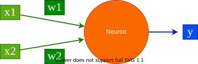

## Introduction

### Deep learning and neural networks
Deep learning is a branch of artificial intelligence which recognises patterns in large volumes of data. Using these learned patterns on the existing data, new data can be categorised. These patterns in data are learned by a computational model based on multiple architectures of neural networks. A neural network is a web of artificial neurons which is also called processing units. The idea of neural networks is inspired from mamalian cerebral cortex where neuronal circuits are used to learn. A neural network is structured into multiple layers where each layer contains several neurons. The neurons from adjacent layers are interconnected allowing the exchange of information. An artificial neuron is shown in Figure 1. The neuron, shown in orange, takes inputs (x1 and x2) and computes output (y). The entities w1 and w2 are the weights of the connections (between inputs and neuron). The weights and inputs are combined following the basic principles of mathematics. All the variables - inputs, weights and output - can either be scalars or vectors.

x1 = x1 * w1

x2 = x2 * w2



The weights denote the significance of a particular input to produce the observed output. When it is large, the input is significant and whnen small, the input less significant to produce the output. These weights can be initialised randomly and they are modified over the course of learning by a neural network. Using the updated inputs (as shown in above equations), the output is computed using:

y = f(x1 + x2)

where *f* is an activation function. An activation function is a mathematical function which translates the combination of inputs to an output. The choices of these functions are many - sigmoid, linear, tanh, ReLU and so on. For example, sigmoid is:

f(x) = 1 / (1 + exp(-x))

The above equation will return a real number between 0 and 1.

ReLU is:

f(x) = max(0, x)

Neurons make the building blocks of a neural network and are arranged in several layers. A usual neural network will look like as shown in Figure 2.


#### Input layer
In the neural network (Figure 2), the input layer is shown in green. This layer receives the input data and pass it on to the next layer. The number of neurons in this layer depends on the number of dimensions of input data. For example, if the input data (matrix) is of size (500, 10), 500 rows (samples) and 10 columns (features), then the number of neurons in the input layer is 10. Each neuron in the input layer is connected to all the neurons in the next layer. All these connections have a separate weight (denoted by w). 

#### Hidden layer
The next two layers after the input layer are called hidden layers. In the first hidden layer too, all the neurons are connected to all other neurons in the adjacent (hidden) layer. The number of hidden layers determine if the resulting neural network is deep (2 or more hidden layers) or shallow. When the number of hidden layers is 2 or more, the structure or architecture of the neural network is deep and overall learning is deep learning. More the number of hidden layers, the more complex the architecture is. The number of hidden layers and size of each hidden layer is not fixed. It completely depends on the data that is being learned on. If the dataset is small (say only 1,000 samples), then it is important to choose a less complex set of hidden layers because if complex architecture is chosen, then there is a danger of overfitting when the deep learning model starts memorising the data. However, if the dataset is large (say > 10,000 samples), more complex architecture can be chosen. In short, the architecture of hidden layer is completely dependent on the nature and size of data. 

#### Output layer
The output layer collects the computed output using the input data and the weights which are optimised during learning. An activation function is chosen to transform the computed inputs and weights to an output. Some examples of activation function are sigmoid, ReLU, tanh and so on.

#### Optimisation
At the output layer, the computed output is collected and this output is compared against the actual/real output to find the difference. The aim of learning is to minimise this error so that the computed output is as close to actual output as possible. This process of minimising the error between computed and actual output is called optimisation. There are several optimisers such as gradient descent, root mean square propagation (RMSProp), adadelta etc. are available. These optimisers work by primarily adjusting the weights of connections so that the error is minimised. Once, a set of weights are achieved which provides the best accuracy or minimum error, we stop the learning as they cannot be improved.

#### Neural network training
A training is a process where input data is passed to the network at the input layer and when finished, a trained model is created containing all the learned parameters such as weights of all connections in the network. Usually, a portion of data is extracted and saved as test data which is not used for training. It is used only for evaluating the trained model to get an unbiased estimate of the learning and prediction strength. The size of the test data can be set by deep learning practitioners. An example of partition can be - 70% training data and 30% test data.

#### Batch and Epoch
While training a neural network, input data is passed in small batches. A batch is a subset of complete training data. An epoch is one iteration when all the training data is used for training in multiple batches. For example, if there is a training data of size (500, 10) where there are 500 rows or samples and batch size is fixed at 50, then there would be 10 batches (50 * 10 = 500) in each epoch. Each batch will have 50 samples and they are pssed to the input layer and the loss is propagated back and the weights are adjusted. The newly adjusted weights are used for the second batch of samples and so on. When all batches are finished, then one epoch of learning is done. The number of epochs and the size of batch are parameters to be set by deep learning practitioners. These parameters depends on the size of data and should be tuned according to the data for optimum results.

> ###  Question
>
> 1. How does a neural network learn?
>
> > ###  Solution
> >
> > 1. The learning happens by minimising the loss between computed and actual output. The weights of different connections are adjusted (increased or decreased) 
to achieve the minimum loss. To ascertain the amount of change for weights, a technique known as backpropagation is used. Using this technique, the error computed at the output layer is "propagated" back in the neural network (from output to input layer) and each connection is assigned a share of the total error. In other words, how much each neuron is contributing to the total accumulated loss. For example, w1 is adjusted according to equation:
> > 
> > In the above equation, L is the total loss, w1 is the weight of a connection between an input neuron and a hidden neuron. Similarly, all the weights are adjusted and in the subsequent iteration, the updated weights are used to compute error at the output layer. More on backpropagation can be read [here](http://neuralnetworksanddeeplearning.com/chap2.html). Parameter *n* is the learning rate which determines how small or big changes are needed for weights. It can either be a fixed quantity or a variable one. In case of a variable learning rate, it usually starts with a large number (say 1.0) and subsequently decays to a small number (say 0.001) along training epochs because initially large learning rate helps to reach close to the minimum error quickly and then it is decayed to slow down the learning so that it stabilises at the minimum.
> >
> {: .solution}
>
{: .question}

#### Loss function
The error between the computed and actual output is calculated using a loss function. There are several choices of loss functions too. The functions such as root mean squared error and absolute error are used for regression problems while cross-entropy error functions are used in classification problems.


### Relevance of deep learning in Bioinformatics
Deep learning is an established tool in finding patterns in big data for multiple fields of research such as computer vision, image analysis, drug response prediction, protein structure prediction and so on. Different research areas use different architectures of neural network which are suitable to their respective data. For example, in computer vision and image analysis, convolutional neural network (CNN) is popular and produces state-of-the-art results, for drug response prediction, graph convutional neural network is often used, recurrent neural network is useful for identifying motif in protein sequences and so on. The table below shows more examples of neural networks which are popular with different fields of bioinformatics. These use-cases of deep learning prove that it is essential to explore deep learning algorithms to find patterns in big data in biology. More details can be found in [Deep learning in bioinformatics: Introduction, application, and perspective in the big data era](https://www.sciencedirect.com/science/article/pii/S1046202318303256)


## Get training and test datasets

The datasets used for this tutorial contains gene expression profiles of humans suffering from two diseases (cancer) - [acute myeloid leukemia (AML)](https://en.wikipedia.org/wiki/Acute_myeloid_leukemia) and [acute lymphoblastic leukemia (ALL)](https://en.wikipedia.org/wiki/Acute_lymphoblastic_leukemia). The aim of this tutorial is to differentiate between these two diseases (predicting the specific cancer) by learning unique patterns in gene expression profiles of cancer patients. The data is divided into 2 parts - one for training and another for predicting. Each part contains two datasets - one has the gene expression profiles and another has labels (type of cancer). The size of the training data (`X_train.csv`) is (38, 7129) where 38 is the number of cancer patients and 7129 is the number of genes. The data contains gene expression for all the genes (7129). The label data (`y_train.csv`) has size (38, 1) contains the information of the type of cancer for each cancer patient (label encoding is 0 for ALL and 1 for AML). The test data (`X_test.csv`) has size (34, 7129) containing the same genes for 34 different cancer patients. The label data for test is `y_test.csv` and has size (34, 1). The neural network, which will be formulated in the remaining part of the tutorial, learns on the training data to create a trained model. The prediction ability of this model is evaluated on the test data (which is unseen during training to get an unbiased estimate of prediction ability). These datasets are uploaded to Galaxy by following the steps defined below:

> ###  Hands-on: Data upload
>
> 1. Create a new history for this tutorial
>
>    
>
> 2. Import the files from [Zenodo](https://zenodo.org/record/3706539#.XmjDYHVKg5k)
>
>    ```
>    https://zenodo.org/record/3706539/files/X_test.tsv
>    https://zenodo.org/record/3706539/files/X_train.tsv
>    https://zenodo.org/record/3706539/files/y_test.tsv
>    https://zenodo.org/record/3706539/files/y_train.tsv
>    ```
>
>    
>
> 3. Check that the datatype is `tabular`.
>
>    
>
{: .hands_on}


## Neural network architecture
Defining a neural network architecture needs to ascertain types and number of layers, the number of neurons for each layer, the activation functions for all layers, type of optimiser and loss function. Choosing these parameters may require many experiments with the data as there is no guide how to choose the best combination of these parameters. The neural network used in this tutorial has an input layer, 2 hidden layers and one output layer. The input layer has a parameter `input_shape` which is set according to the number of dimensions of data. It is set to (7129,) which is the number of genes in the data. The hidden layers have 16 neurons (units) each and the output layer has only one because a scalar output is needed (0 or 1). This partial architecture (having input shape, types and size of layers, and activation functions) of the neural network is defined as follows: 

### Create architecture: Choose layers

> ###  Hands-on: Create a deep learning model architecture using Keras
>
> 1. **Create a deep learning model architecture using Keras**  with the following parameters:
>    - *"Select keras model type"*: `Sequential`
>    - *"input_shape"*: `(7129, )`
>       
>    - In *"LAYER"*:
>        - In *"1: LAYER"*:
>            - *"Choose the type of layer"*: `Core -- Dense`
>                - *"units"*: `16`
>                - *"Activation functions"*: `elu`
>        - In *"2: LAYER"*:
>            - *"Choose the type of layer"*: `Core -- Dense`
>                - *"units"*: `16`
>                - *"Activation functions"*: `elu`
>        - In *"3: LAYER"*:
>            - *"Choose the type of layer"*: `Core -- Dense`
>                - *"units"*: `1`
>                - *"Activation functions"*: `sigmoid`
> 
>
{: .hands_on}

The tool returns a JSON output file containing data about the nueral network layers and their attributes like their types, number of units they have and their activation functions. This file is used as an input to the next step where the architecture of the neural network is completed by adding optimiser, loss function, and training parameters such as number of epochs and batch size. The loss function is chosen as `binary_crossentropy` as the learning task is classification of two labels (0 and 1).

### Create architecture: Add training parameters

> ###  Hands-on: Create deep learning model with an optimizer, loss function and fit parameters
>
> 1. **Create deep learning model with an optimizer, loss function and fit parameters**  with the following parameters:
>    - *"Choose a building mode"*: `Build a training model`
>    - *"Select the dataset containing model configurations (JSON)"*: `Keras model config` (output of **Create a deep learning model architecture using Keras** )
>    - *"Do classification or regression?"*: `KerasGClassifier`
>    - In *"Compile Parameters"*:
>        - *"Select a loss function"*: `binary_crossentropy`
>        - *"Select an optimizer"*: `RMSprop - RMSProp optimizer`
>    - In *"Fit Parameters"*:
>        - *"epochs"*: 10`
>        - *"batch_size"*: 4
>
{: .hands_on}

The tool returns a zipped file containing an object of the neural network architecture (define in the last two steps) which is used as a classifier to train it on data. Once the architecture is finalised, its associated object is used for training combining it with the training data as follows:

### Deep learning training
Neural network is trained on training data to learn hidden representations and mapping from features (genes) to both the types of cancer. As discussed earlier, the neural network minimises the error, which is given by the loss function, between actual labels and the predicted labels while adjusting the weights of connections among neurons in multiple layers. Once the training is finished, the architecture and learned weights are saved. They are used to predict labels in test data. The deep learning training is set up as follows: 

> ###  Hands-on: Deep learning training and evaluation conduct deep training and evaluation either implicitly or explicitly
>
> 1. **Deep learning training and evaluation conduct deep training and evaluation**  with the following parameters:
>    - *"Select a scheme"*: `Train and validate`
>    - *"Choose the dataset containing pipeline/estimator object"*: `Keras model builder` (output of **Create deep learning model** )
>    - *"Select input type"*: `tabular data`
>    - *"Training samples dataset"*: `X_train.tsv`
>        - *"Does the dataset contain header"*: `Yes`
>        - *"Choose how to select data by column"*: `All columns`
>    - *"Dataset containing class labels or target values"*: `y_train.tsv`
>        - *"Does the dataset contain header"*: `Yes`
>        - *"Choose how to select data by column"*: `All columns`
>
{: .hands_on}

The tool gives 3 files as output - a `tabular` file containing output (accuracy of cross-validation) of training, a `zipped` file with the trained model (fitted estimator) and an `H5` file containing the weights of neural network layers. The files containing the fitted estimator and weights are used to recreate the model and this recreated model is used to predict labels in test data.

### Prediction on test data
After training, the saved architecture (fitted estimator) and weights are used to predict labels for the test data.

> ###  Hands-on: Model Prediction predicts on new data using a preffited model
> 
> 1. **Model Prediction predicts on new data using a preffited model**  with the following parameters:
>    - *"Choose the dataset containing pipeline/estimator object"*: `Fitted estimator or estimator skeleton` (output of **Deep learning training and evaluation** )
>    - *"Choose the dataset containing weights for the estimator above"*: `Weights trained` (output of **Create deep learning model** )
>    - *"Select invocation method"*: `predict`
>    - *"Select input data type for prediction"*: `tabular data`
>        - *"Training samples dataset"*: `X_test`
>        - *"Does the dataset contain header"*: `Yes`
>        - *"Choose how to select data by column"*: `All columns`
> 
>
{: .hands_on}

The tool returns the predicted labels (0 for ALL and 1 AML) for the test data in a tabular format. The size of this data is (34,1) where 34 is the number of cancer patients in the test data. As there is already a data with the actual labels for the test data, the performance of the trained model is compared against the predicted labels using a confusion matrix plot.

## Visualisation

> ###  Hands-on: Machine Learning Visualization Extension includes several types of plotting for machine learning
> 
> 1. **Machine Learning Visualization Extension includes several types of plotting for machine learning**  with the following parameters:
>    - *"Select a plotting type"*: `Confusion matrix for classes` 
>    - *"Select dataset containing true labels"*: `y_test.tsv`
>    - *"Does the dataset contain header"*: `Yes`
>    - *"Choose how to select data by column"*: `All columns`
>    - *"Select dataset containing predicted labels"*: `Model prediction` (output of **Model Prediction predicts on new data using a preffited model** )
> 
>
{: .hands_on}

The image below shows the [confusion matrix](https://en.wikipedia.org/wiki/Confusion_matrix) which is a symmetric. It contains actual labels on y-axis and predicted labels on x-axis. Each cell in the matrix plot gives the number of cancer patients who got predicted correctly or incorrectly. For example, the number in the top-left cell (0, 0) denotes that how many of these patients are predicted correctly for ALL (17/20). The higher the number in this cell, the better is the model for this cell. In the top-right cell, 3 patients who actually has ALL but they are predicted having AML. Similarly, the bottom-right cell denotes how many patients are predicted correctly for AML (10/14). In the bottom-left cell, 4 patients actually has AML but are predicted as ALL.


## Conclusion
The tutorial presents a case-study to predict labels (ALL and AML) of 34 new cancer patients after learning gene expression profiles of 38 cancer patients through multiple steps of a deep learning pipeline. All these steps show how to create a neural network architecture using Galaxy's deep learning tools and analyse results using a confusion matrix visualisation. In a similar way, multiple different architectures of neural networks can be created well-suited to the datasets and aim of particular experiments. Moreover, it should be noted that one architecture of neural network giving promising results on a dataset may not work at all with another dataset. It should be kept in mind to perform multiple experiments with a dataset to come to an optimal neural network architecture. 


{:.no_toc}

