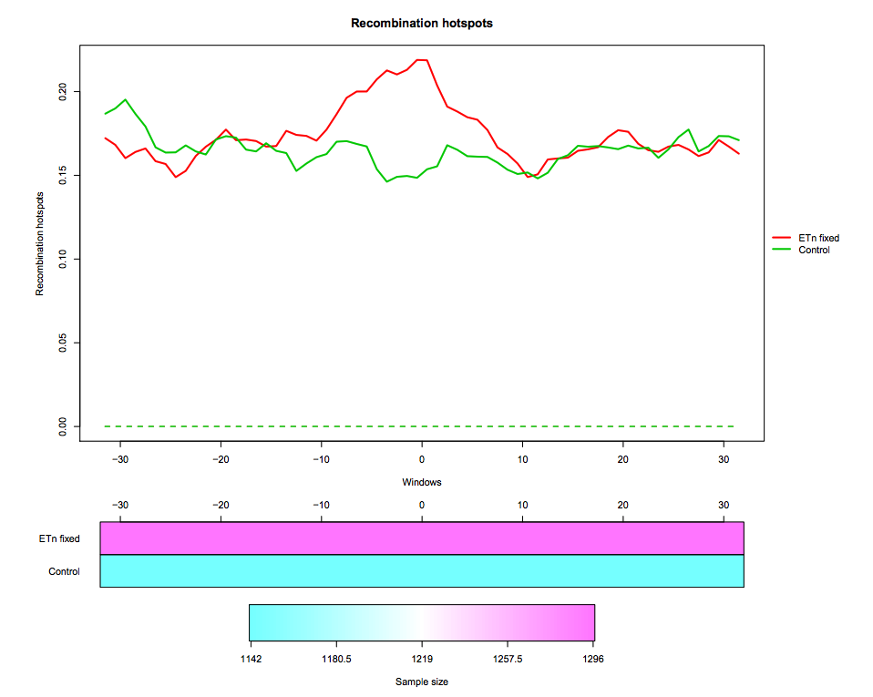
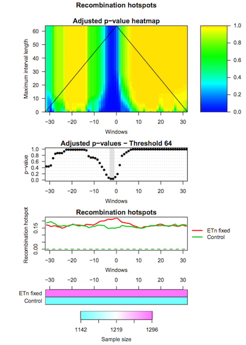
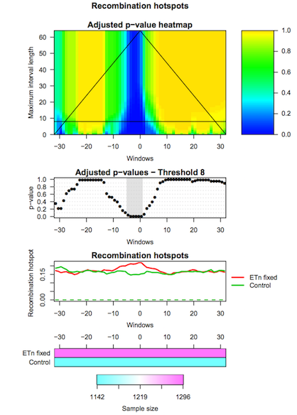

# Introduction
{:.no_toc}

IWTomics implements the Interval-Wise Testing (IWT) for omics data. This
inferential procedure tests for differences in "Omics" data between two groups
of genomic regions, and does not require fixing location and scale at the
outset.

In this tutorial we use real data about endogenous retroviruses (ERVs) in mouse.
In particular, we compare recombination hotspots in the flanking regions of fixed ETn versus control regions.
The dataset contains two region datasets "ETn fixed", "Control" and one feature "Recombination hotspots content". The region dataset "ETn fixed" contains 1296 genomic regions of 64 kb surrounding fixed ETns elements (32-kb flanking sequences upstream and 32-kb flanking sequences downstream of each element). The region dataset "Control" contains 1142 regions of 64 kb without elements, used as control in the test. The regions are aligned around their center (i.e. around the ETn integration sites).

Recombination hotspots measurements are associated to each "ETn fixed" and "Control" region. In particular, this feature is measured in 1-kb windows, so that each region is associated to a recombination hotspots curve made of 64 values. The measurement used is the feature content, i.e. the fraction of the 1-kb window that is covered by recombination hotspots

The data we use in this tutorial is available at [Zenodo](https://doi.org/10.5281/zenodo.1184682).

> ### Agenda
>
> IWTomics is composed of three steps (corresponding to three tools):
>
> 1. TOC
> {:toc}
>
{: .agenda}

# Step 1: Loading and pre-processing

> The first tool (IWTomics Load Smooth and Plot) imports a collection of genomic region datasets, and associates to each region multiple genomic feature measurements. It allows to align the regions in multiple ways (center, left, right or scale alignment), to smooth the feature curves (possibly filling gaps in the measurements) and to create a graphical representation of the feature measurements in each region datasets (aligned curves or pointwise quantile curves).

> ###  Hands-on: Get the data
> 1. Create a new history for this tutorial
> 2. Import datasets:
>    - Fixed ETn (`ETn_fixed.bed`) regions
>    - Control (`Control.bed`) regions
>    - Recombination Hotspot (`Recombination_hotspots.txt`) content
>     
>    ```
>    https://zenodo.org/record/1288429/files/ETn_fixed.bed
>    https://zenodo.org/record/1288429/files/Control.bed
>    https://zenodo.org/record/1288429/files/Recombination_hotspots.txt
>    ```
> 3. Import header files for regions and features:
>    - `regions_header.tabular`
>    - `features_header.tabular`
>
>    ```
>    https://zenodo.org/record/1288429/files/regions_header.tabular
>    https://zenodo.org/record/1288429/files/features_header.tabular
>    ```
{: .hands_on}

> ###  Hands-on: Pre-process data and create pointwise boxplot
> **Load, Smooth and Plot** : Run **Load, Smooth and Plot** with:
>    * Select the two region datasets `ETn_fixed.bed` and `Control.bed`.
>    * Select the region header file `regions_header.tabular`.
>    * Select the feature file `Recombination_hotspot.txt`.
>    * Select the feature header file `features_header.tabular`.
>    * Start positions are 0-based in this example; all region alignments are equivalent in this case.
>    * You can choose to smooth the feature curves.
>    * Select the graphical representation type **Pointwise quantile curves (boxplot)**.
>
> 
{: .hands_on}

# Step 2: Performing Interval-Wise Testing

> The second tool (IWTomics Test and Plot) statistically evaluates differences in genomic features between groups of regions along the genome. In particular, it implements the Interval-Wise Testing for omics data, an extended version of the Interval-Wise Testing for functional data presented in [Pini and Vantini (2017)](https://doi.org/10.1080/10485252.2017.1306627).

> It allows to perform multiple two sample permutation tests between pairs of region datasets, on several features. It returns the adjusted p-value curves for every test and all possible scales. Moreover, it creates a graphical representation of the Interval-Wise Testing results and a summary plot (optional) with p-values at the maximum scale. The tool IWTomics Plot with Threshold on Test Scale permits to select the scale to be used in the plots.

> ###  Hands-on: Test for difference between ETn and Control regions
> **Test and Plot** : Run **Test and Plot** with:
>    * Select the `IWTomicsData Object`, `Region Dataset IDs`, and `Feature IDs` created during **Step 1**.
>    * Select pairs of genomic region datasets to be compared using two-sample Interval-Wise Testing. In this example we consider one two-sample test contrasting `ETn_fixed` (select it as **Region 1**) to `Control` (select it as **Region 2**).
>    * Select feature measurements to be tested. In this example, select `Recomb_hot` feature.
>    * You can choose the test statistic, the number of permutations, and the significance level of the test (alpha).
>    * Select the graphical representation type **Pointwise quantile curves (boxplot)**.
>
> 
{: .hands_on}

# Step 3: Selecting test scale

> The third tool (IWTomics Plot with Threshold on Test Scale) allows to select the scale for the Interval-Wise Testing results. In particular it returns the p-value curves for the different tests performed at the selected scale, and it creates a graphical representation of the Interval-Wise Testing results and a summary plot (optional) at the selected scale.

> ###  Hands-on: Change scale for test results
> **Plot with Threshold on Test Scale** : Run **Plot with Threshold on Test Scale** with:
>    * Select the `IWTomicsData Object with Test Results`, `Test IDs`, and `Feature IDs` created during **Step 2**.
>    * Select the scale to be used in Interval-Wise Testing results and plot. Select the test identifier `ETn_fixed vs Control`, the feature identifier `Recomb_hot`, and the scale `8` (8-kb scale).
>    * Select the graphical representation type **Pointwise quantile curves (boxplot)**.
>
> 
{: .hands_on}

> ###  Additional resources:
>
> Read more about **IWTomics** [here](https://bioconductor.org/packages/release/bioc/vignettes/IWTomics/inst/doc/IWTomics.pdf).
{:.tip}  
