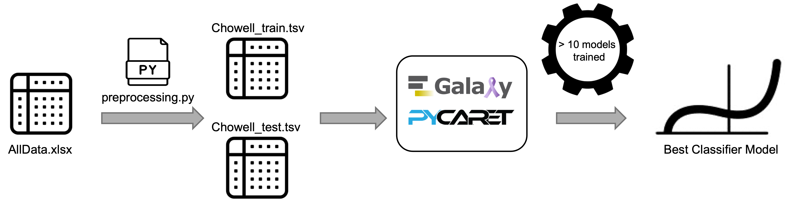

> <comment-title>PyCaret Model Comparison Tool</comment-title>
>
> The PyCaret Model Comparison tool described in this tutorial is currently available only on: 
> [Cancer-Galaxy](https://cancer.usegalaxy.org)
>
> Galaxy-ML tools > PyCaret Model Comparison 
>
> This tutorial will be updated as soon as the tool is incorporated into the main Galaxy project.
{:  .comment}

In this tutorial, we will use a comprehensive dataset of patients treated with immune checkpoint blockade (ICB) and non-ICB-treated patients across 18 solid tumor types to develop LORIS (Logistic Regression-based Immunotherapy-Response Score). The goal is to accurately predict patient responses to the treatment.

To achieve this, we will follow three essential steps: (i) upload the patient data training file to Galaxy, (ii) set up and run the PyCaret Model Comparison Tool to train the best model, and (iii) evaluate the model’s predictive performance by comparing it to the published LORIS model ().



> <agenda-title></agenda-title>
>
> In this tutorial, we will cover:
>
> 1. TOC
> {:toc}
>
{: .agenda}

> <comment-title>Background</comment-title>
>
> The [LORIS dataset](https://github.com/rootchang/LORIS/blob/main/02.Input/AllData.xlsx) contains clinical, pathologic, and genomic features from a diverse cohort of patients, providing a foundation for robust analysis and model development. The raw dataset (xlsx) includes 10 distinct cohorts:
>
> Chowell_train, 2) Chowell_test, 3) MSK1, 4) MSK2, 5) Kato_panCancer, 6) Shim_NSCLC, 7) Vanguri_NSCLC, 8) Ravi_NSCLC, 9) Pradat_panCancer, 10) MSK_nonICB.
>
> To keep this tutorial concise, we will focus on the Chowell_train cohort for model training and the Chowell_test cohort for testing the PanCancer model.
>
{:  .comment}

# Dataset composition to train the model 
Before we begin the hands-on session, here’s a brief explanation of the features we’ll be using. These features were selected based on the findings of Chang et al. (2024), who identified them as the most important for training the model.

## TMB (Tumor mutation burden)
Tumor mutation burden (TMB) is defined as the total number of somatic mutations within a specified region of the tumor genome. It has been recognized as a biomarker for predicting the efficacy of immune checkpoint blockade (ICB) in solid tumors. The FDA has approved a threshold of 10 mutations per megabase (mut/Mb) as a biomarker for response to ICB treatment.

In this dataset, TMB values range from 0 to over 368 mutations per megabase, with some extreme values, such as 368.6 and 93.5. To mitigate the influence of these outliers, TMB values will be truncated at 50 mut/Mb, meaning any value exceeding 50 will be capped at 50. This is crucial because extreme TMB values can disproportionately skew the model’s learning process, leading to unreliable predictions.

## Systemic Therapy History
This feature is a binary variable that indicates whether a patient received chemotherapy or targeted therapy prior to immunotherapy. It is coded as 1 if the patient had undergone such treatments before starting immunotherapy, and 0 if they had not.

## Albumin
The albumin feature represents the albumin levels measured in patients, which is an important biomarker often associated with nutritional status and liver function. The values are measured in grams per deciliter (g/dL) and typically range between 2.1 and 4.9 g/dL in the dataset. Higher levels of albumin are generally associated with better overall health and can serve as an indicator of a patient's ability to recover or respond to treatments like immunotherapy.

## Cancer Type
The CancerType feature represents the type of cancer diagnosed in each patient, which can vary significantly across the dataset. Common types include Non-Small Cell Lung Cancer (NSCLC), Small Cell Lung Cancer (SCLC), Melanoma, Endometrial cancer, and other cancer types such as Gastric, Colorectal, Renal, and Breast cancer. This feature is critical for understanding the heterogeneity of the patient cohort and may influence treatment decisions, response rates, and outcomes.

Incorporating this feature into a machine learning model requires translating the categorical CancerType into one-hot encoded variables. Each cancer type will be represented as a binary feature (0 or 1), with each type becoming a separate column in the dataset. This enables the model to interpret the presence or absence of a specific cancer type for each patient.

## NLR (blood neutrophil–lymphocyte ratio)
The neutrophil–lymphocyte ratio (NLR), a biomarker derived from the ratio of neutrophils to lymphocytes in the blood, is increasingly used in cancer research due to its association with inflammation and immune response. It can serve as a prognostic factor in various cancer types. Higher NLR values often indicate a poorer prognosis, potentially reflecting a more aggressive disease or impaired immune response.

In this dataset, NLR values range, for example, from 0.8 to 88, with several extreme outliers. To address this, NLR values will be truncated at 25, meaning any value above 25 will be capped at 25. This truncation is important for preventing extreme outliers from disproportionately influencing the machine learning model.

## Age
n predictive models for patient outcomes, age is a crucial feature because it is often correlated with various health factors and disease risks. As people age, their immune systems, metabolism, and ability to recover from illnesses may change, influencing how they respond to treatments, medications, or disease progression. Including age as a feature helps models account for the biological changes that occur over time and can improve the accuracy of predictions across different age groups.

However, there are limits to how predictive age might be, particularly for extreme values. For example, patients over a certain age may share similar health characteristics, and further increases in age may not significantly add predictive value. Truncating age to a maximum value (like 85) helps avoid overemphasizing small differences between very old patients, where the added predictive power might be negligible.

## Response
The Response feature is a categorical target variable indicating whether patients benefited from immune checkpoint blockade (ICB) therapy, classified as 0 (no benefit) or 1 (benefit). The model is trained using all previous features to predict patient outcomes when ICB is chosen as the treatment.

# Prepare environment and get the data 
> <comment-title>Preprocessing the raw data</comment-title>
>
> The raw data published by () can be found here: 
> [LORIS raw dataset](https://github.com/rootchang/LORIS/blob/main/02.Input/AllData.xlsx)
> 
> We preprocessed the raw data using a Python script to:
> 1) Extract the `Chowell_train` and `Chowell_test` tab from the excel file.
> 2) Select the 7 features (`TMB`, `Systemic Therapy History`, `Albumin`, `Cancer Type`, `NLR`, `Age`, and `Response`) important for building the model.
> 3) Truncate the values for `Age`, `NLR`, and `TMB`.
> 4) Encode `Cancer Type` using one-hot encoding. 
> 5) Save the dataset as a .tsv file.
>
> A Jupyter notebook for preprocessing can be found at Dockstore: [LORIS_preprocessing](https://dockstore.org/notebooks/github.com/paulocilasjr/pycaret-use-case/preprocessing:main?tab=info)
>
{:  .comment}

> <hands-on-title> Environment and Data Upload </hands-on-title>
>
> 1. Create a new history for this tutorial. If you are not inspired, you can name it *LORIS model classifier*.
>
>    
>
> 2. Import the files from Zenodo or from the shared data library
>
>    ```
>    https://zenodo.org/records/13885908/files/Chowell_train_Response.tsv
>    https://zenodo.org/records/13885908/files/Chowell_test_Response.tsv
>    ```
>
>    
>
> 3. Check that the data format assigned for the file is **tsv**.
>    If it is not, follow the Changing the datatype tip.
>
>    
>
> 5. Add a tag (`LORIS model dataset`) to the dataset corresponding to `Chowell_train_Response.tsv` and `Chowell_test_Response.tsv`
>    This is important to trace back on what dataset the model was built on.
>
>    
>
{: .hands_on}

# Using PyCaret Model Comparison Tool
> <hands-on-title> Task description </hands-on-title>
>
> 1.  with the following parameters:
>    -  *"Input Dataset (CSV or TSV)"*: `Chowell_train_Response.tsv`
>    -  *"Test Dataset (CSV or TSV)"*: `Chowell_test_Response.tsv`
>    -  *"Select the target column"*: `C22: Response`
>    -  *"Task"*: `Classification`
> Run the tool 
{: .hands_on}

# Tool output files
After training and testing your model, you should see two new files in your history list:

- PyCaret Model Comparison Best Model: The PyCaret model pickle file. This file allows the model to be reused without requiring retraining, ensuring consistent predictions.

- PyCaret Model Report: This file contains all the plots for the models trained, along with the best model selected.

For this tutorial, we will focus on the PyCaret Model Report.

# PyCaret Model Report 
The PyCaret HTML report provides a comprehensive and interactive overview of the trained model’s performance in an accessible, browser-ready format. This report documents key aspects of the model’s training and evaluation process, offering insights into how well the model performed on both the training and test datasets. The report consists of four tabs: Setup & Best Model, Best Model Plots, Feature Importance, and Explainer.


Below is a brief explanation of the content in each tab of the report.

> <tip-title>Setup & Best Model Tab</tip-title>
>- Setup Parameters: Documents the initial configurations used in the PyCaret Model Comparison Tool.
>- Best Model Class and Hyperparameters: Specifies the model selected as the best performer from the comparison, along with the model’s hyperparameters as determined through tuning.
>- Performance Metrics: Summarizes key evaluation metrics, including Accuracy, ROC-AUC, Recall, Precision, F1-Score, Cohen’s Kappa, Matthews Correlation Coefficient (MCC), and Training Time (in seconds).
>
{: .tip}

> <tip-title>Best Model Plots Tab</tip-title>
>- Training and Test Evaluation Plots: Displays visualizations of the model’s performance, including an ROC-AUC curve for binary classification, Confusion Matrix, Precision-Recall (PR) curve, Error Analysis, and a Classification Report for detailed class-level performance.
>- Additional Model Insights: Includes diagnostic plots like the Learning Curve, Calibration Plot, Validation Curve (VC), and various dimensionality reduction plots (Manifold, RFE).
>- Feature Importance: Shows the contribution of each feature to the model, both individually and collectively (All Features), providing insight into the factors influencing model decisions.
>
{: .tip}

> <tip-title>Feature Importance Tab</tip-title>
>- Feature Importance Analysis from a Trained Random Forest: This analysis, while not directly linked to the LASSO logistic regression model, provides additional insights into feature significance within alternative models. These insights can help validate or contrast with results from the primary model, offering a broader perspective on feature influence. 
>-  SHAP Summary from a Trained LightGBM Model: SHAP (SHapley Additive exPlanations) values offer a unified measure of feature contributions, showing how each feature impacts predictions. This approach is particularly valuable for interpreting model decisions and understanding the feature contributions across predictions.
>
{: .tip}

> <tip-title>Explainer Tab</tip-title>
>- Mean Absolute SHAP Value (Average Impact on Predicted Response): Displays each feature's overall contribution to predictions. Higher SHAP values indicate features with a more significant influence on the model's outcomes, helping identify the most impactful inputs.
>- Permutation Importance (Decrease in ROC AUC with Randomized Feature): Shows how essential each feature is for model performance by randomly shuffling each feature and observing the resulting decrease in ROC AUC. A significant drop suggests high feature importance.
>- Partial Dependence Plot (PDP): Displays the average effect of a feature on predictions, indicating whether it has a linear, nonlinear, or interactive effect on outcomes.
>- Percentage 1 vs. Predicted Probability: Compares the true proportion of positive cases (label=1) with predicted probabilities, helping evaluate the model’s calibration by showing how closely predictions align with observed outcomes.
>- Cumulative Percentage per Category (Top X%): Measures the cumulative impact of each category in the top percentages, useful for understanding feature value concentration and distribution.
>- Percentage Above and Below Cutoff: Analyzes model performance at a specified threshold, offering insight into sensitivity and specificity when predictions exceed or fall below the cutoff.
>- Confusion Matrix: A detailed matrix showing True Positives, False Positives, True Negatives, and False Negatives, allowing assessment of prediction accuracy, error distribution, and balance.
>- Lift Curve: Visualizes the model's improvement over random chance across prediction deciles, with lift values indicating the model's effectiveness in identifying positive instances.
>- ROC AUC Curve: Plots True Positive Rate vs. False Positive Rate across thresholds, with AUC as a measure of class distinction. A higher AUC reflects better performance in differentiating classes.
>- PR AUC Curve: Displays Precision vs. Recall, focusing on performance for the positive class. Especially useful in imbalanced datasets, where a higher AUC indicates effective identification of positive instances while maintaining precision.
>
{: .tip}

# LORIS PanCancer LLR6 Model Robustness:

Understanding the objective of this analysis is essential. Since we aim to build a model comparable to the one published by , we will use the metrics from that paper as a benchmark to assess the performance of the model we develop through Galaxy-PyCaret.

> <tip-title>Robustness definition </tip-title>
>
> Some evidence is considered robust if it holds up across reasonable variations in analysis, while fragile evidence depends heavily on specific analytical choices, such as the inclusion or exclusion of certain observations or covariates.
>
> Robustness, therefore, refers to assessing the reliability of previous findings by applying different analytical approaches to the same dataset.>
>
>
{: .tip}

## Classification Algorithms
A key feature of PyCaret is its capability to train and compare multiple models with minimal code. By default, PyCaret evaluates a diverse range of algorithms, including linear models, tree-based models, and ensemble methods, ranking these models based on their performance. The primary metric used to determine the best-performing model is the accuracy. 


In this case, the best-performing algorithm for this dataset matches the findings reported in the article: the Logistic Regression model.

## Hyperparameters
The model from  for the Pan-Cancer LLR6 model has the following hyperparameters set: C = 0.1, Class Weight = Balanced, L1 ratio = 1, max iter = 100, Penalty = Elasticnet, Solver = Saga.

The hyperparameter search performed by Galaxy-PyCaret resulted in slightly different settings for the model: C = 1.0, Class Weight = None, L1 ratio = None, max iter = 1000, Penalty = L2, Solver = LBFGS.


The differences found in the hyperparameters guide the analysis towards testing the robustness of the LORIS Score proposed by .

> <comment-title>Hyperparameters meaning</comment-title>
>
> *Penalty* - Defines the type of regularization applied to the model to prevent overfitting. Options for linear and logistic regression are: `L1`, `L2`, and `Elasticnet`. Briefly, L1 (Lasso Regression) removes less important features, helping to overcome overfitting as well as performing dimension reduction. However, when most features (variables) in the model are useful, L2 (Ridge Regression) is used. Elasticnet regularization combines both L1 and L2, addressing multicollinearity while also enabling feature selection. When Elasticnet is selected, it opens the L1 Ratio parameter.
>
> *L1-Ratio* - Controls the balance between L1 and L2 penalties. A value of `1` uses purely L1 regularization, which encourages sparsity. A value of `0` uses purely L2.
>
> *C* - Is the inverse of the regularization strength. A smaller C (like `0.1`) implies stronger regularization, which prevents overfitting by penalizing large coefficients and also makes the model simpler (smaller coefficients). In contrast, higher values make the model more complex.
>
> *Solver* - Specifies the optimization algorithm used for fitting the model. `SAGA` is well-suited for large datasets and supports the Elasticnet penalty. It is also effective for sparse data and is fast for L1. `LBFGS` is a quasi-Newton optimization algorithm, efficient for smaller datasets, supports L2 regularization, but does not support Elasticnet.
>
> *Class Weight* - Is used to handle imbalanced classes by adjusting the weight associated with each class. Balanced adjusts these weights inversely proportional to class frequencies in the data, giving more weight to the minority class.
>
> *Max Iter* - Specifies the `maximum number` of iterations the solver will run before stopping. If convergence is achieved earlier, it will stop; if not, you may need to increase the value.
>
{:  .comment}

## Model Evaluation Metrics
In this study, we compare the performance of machine learning models built using two different frameworks: PyCaret and Scikit-learn (). The comparison focuses on four model evaluation metrics—Accuracy, Area Under the Curve (AUC), F1 Score, and Matthews Correlation Coefficient (MCC)—to assess the relative strengths and performance of each model and draw conclusions about the robustness of the LORIS Score.


- Accuracy
Accuracy measures the proportion of correct predictions among all predictions. The PyCaret model outperformed the Scikit-learn model in terms of accuracy, achieving 0.80 compared to 0.6803 for the Scikit-learn model. This suggests that the PyCaret model was able to correctly classify a higher percentage of samples, indicating better overall predictive performance on the given dataset. Furthermore, the higher accuracy across multiple runs demonstrates a level of consistency in the performance of the LORIS Score, regardless of the specific model-building tool used.

- Area Under the Curve (AUC)
AUC provides an aggregate measure of performance across all classification thresholds, with higher values indicating better model performance. The PyCaret model exhibited a moderate AUC of 0.7599, slightly outperforming the Scikit-learn model’s AUC of 0.7155. This suggests that the PyCaret model had better discrimination between positive and negative classes, demonstrating a more robust ability to distinguish between the two across various thresholds. Despite using different frameworks, both models achieved relatively high AUC values, which reinforces the LORIS Score's consistent discriminatory power and overall robustness.

- F1 Score
The F1 Score is the harmonic mean of precision and recall, offering a balanced measure of a model’s ability to correctly classify both positive and negative classes, particularly in the context of imbalanced datasets. The Scikit-learn model achieved a higher F1 score of 0.5289, compared to the PyCaret model’s F1 score of 0.4246. This suggests that, while the PyCaret model outperformed in terms of accuracy and AUC, the Scikit-learn model might have demonstrated a better balance between precision and recall, making it more effective at identifying positive instances.

- Matthews Correlation Coefficient (MCC)
The MCC is a more balanced metric for binary classification, as it considers all four categories from the confusion matrix (True Positive, True Negative, False Positive, False Negative). The Scikit-learn model achieved a higher MCC of 0.4652, compared to the PyCaret model’s MCC of 0.3764. This suggests that, while both models showed moderate performance, the Scikit-learn model demonstrated a better balance between false positives and false negatives, making it more reliable in terms of overall classification accuracy, especially in the case of imbalanced datasets.

The comparison between the PyCaret and Scikit-learn models demonstrates consistent performance across multiple evaluation metrics, such as accuracy, AUC, F1 score, and MCC. The slight differences in the results reflect the inherent flexibility of the LORIS Score, showing that a model built using two different frameworks—PyCaret and Scikit-learn—can still yield comparable performance. 

The results suggest that small variations in the analytical approach do not significantly impact the model's ability to distinguish between classes, thereby providing confidence in the robustness of the LORIS Score for future applications.

# Conclusion
In this tutorial, we demonstrated how to use the Galaxy-PyCaret Comparison Tool to build a machine learning model for ICB treatment patient selection using clinical data. We followed a structured approach consisting of:
- Uploading datasets (.tsv)
- Running the PyCaret Comparison
- Evaluating the model's performance using the metrics published by  as the gold standard.

Throughout the process, we showcased how PyCaret simplifies the complexities of machine learning workflows, making them more accessible and efficient for users. Additionally, we explored the robustness of the LORIS Score by building a Logistic Regression model with different hyperparameters.

By the end of this tutorial, you should have a solid understanding of how to deploy a traditional machine learning model using tabular data and effectively interpret its results.
