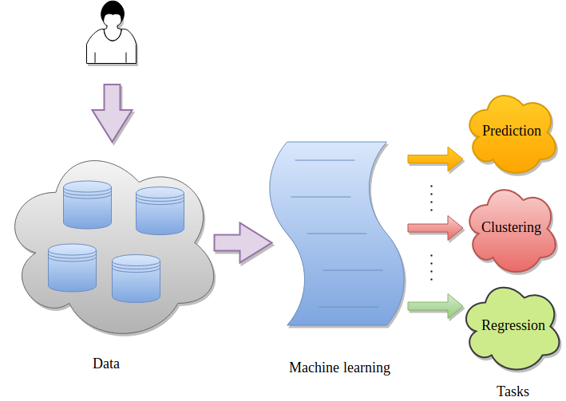
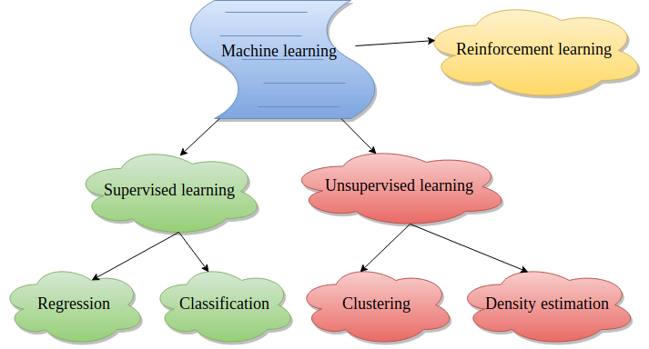
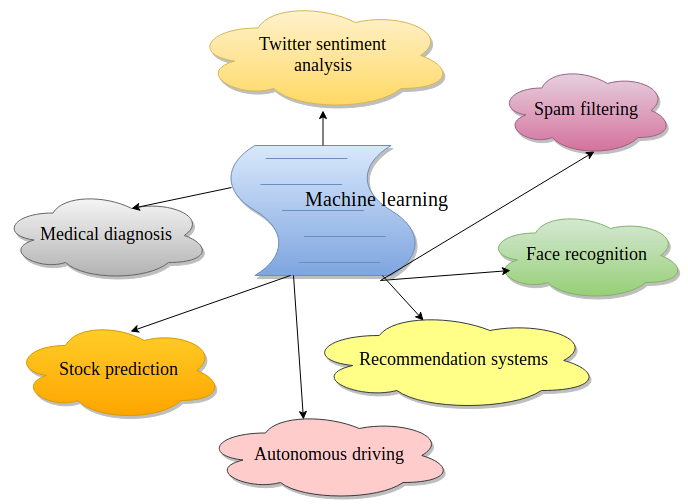
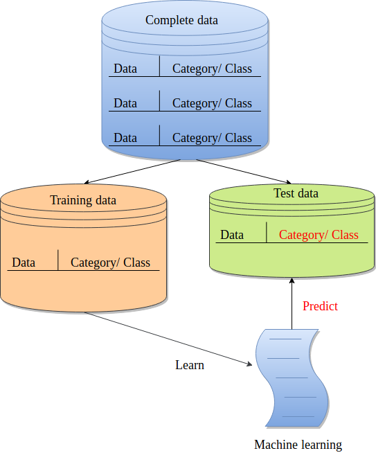

# Introduction


[Machine learning](https://en.wikipedia.org/wiki/Machine_learning) uses techniques from statistics, mathematics and computer science to make computer programs learn from data. It is one of the most popular fields of computer science and finds applications in multiple streams of data analysis such as [classification](https://en.wikipedia.org/wiki/Statistical_classification), [regression](https://en.wikipedia.org/wiki/Regression_analysis), [clustering](https://en.wikipedia.org/wiki/Cluster_analysis), [dimensionality reduction](https://en.wikipedia.org/wiki/Dimensionality_reduction), [density estimation](https://en.wikipedia.org/wiki/Density_estimation) and many more. Some real-life applications are spam filtering, medical diagnosis, autonomous driving, recommendation systems, facial recognition, stock prices prediction and many more. The following image shows a basic flow of any machine learning task. Data is provided by a user to a machine learning algorithm for analysis.



There are multiple ways in which machine learning can be used to perform data analysis. They depend on the nature of data and the kind of data analysis. The following image shows the most popular ones. In [supervised learning](https://en.wikipedia.org/wiki/Supervised_learning) techniques, the categories of data records are known beforehand. But in [unsupervised learning](https://en.wikipedia.org/wiki/Unsupervised_learning), the categories of data records are not known.



In general, machine learning can be used in multiple real-life tasks by applying its variants as depicted in the following image.



The following image shows how a classification task is performed. The complete data is divided into training and test sets. The training set is used by a classifier to learn features. It results in a trained model and its robustness (of learning) is evaluated using the test set (unseen by the classifier during the training).



This tutorial shows how to use a machine learning module implemented as a Galaxy tool. The data used in this tutorial is available at [Zenodo](https://zenodo.org/record/1468039#.W8zyxBRoSAo).

> <agenda-title></agenda-title>
>
> Performing a machine learning task (classification) using a tool involves the following steps:
>
> 1. TOC
> {:toc}
>
{: .agenda}

# Data upload

The datasets required for this tutorial contain 9 features of breast cells which include the thickness of clump, cell-size, cell-shape and so on ([more information](https://github.com/EpistasisLab/penn-ml-benchmarks/tree/master/datasets/classification/breast-w)). In addition to these features, the training dataset contains one more column as `target`. It has a binary value (0 or 1) for each row. `0` indicates no breast cancer and `1` indicates breast cancer. The test dataset does not contain the `target` column.


> <hands-on-title>Data upload</hands-on-title>
>
> 1. Create a new history for this tutorial
>
>    
>
> 2. Import the following datasets and choose the type of data as `tabular`.
>
>    ```
>    https://zenodo.org/record/1401230/files/breast-w_train.tsv
>    https://zenodo.org/record/1401230/files/breast-w_test.tsv
>    ```
>
>    
>
> 3. Rename datasets to `breast-w_train` and `breast-w_test`.
>
>    
>
> 4. The datasets should look like these:
>
>
>     with targets (9 features and one target).")
>
>
>     (9 features and no target).")
{: .hands_on}


# Train a classifier
In this step, we will use the [SVM (support vector machine)](https://scikit-learn.org/stable/modules/svm.html#svm-classification) classifier for training on the `breast-w_train` dataset. The classifier learns a mapping between each row and its category. SVM is a memory efficient classifier which needs only those data points which lie on the decision boundaries among different classes to predict a class for a new sample. The rest of the data points can thrown away. We will use the `LinearSVC` variant of SVM which is faster. Other variants `SVC` and `NuSVC` have high running time for large datasets. The last column of the training dataset contains a category/class for each row. The classifier learns a mapping between data row and its category which is called a trained model. The trained model is used to predict the categories of the unseen data.

> <hands-on-title>Train a classifier</hands-on-title>
>
> **Support vector machines (SVMs) for classification**  with the following parameters to train:
>    - *"Select a Classification Task"*: `Train a model`
>        - *"Classifier type"*: `Linear Support Vector Classification`
>        - *"Select input type"*: `tabular data`
>        -  *"Training samples dataset"*: `breast-w_train` tabular file
>        - *"Does the dataset contain header"*: `Yes`
>        - *"Choose how to select data by column"*: `All columns EXCLUDING some by column header name(s)`
>        - *"Type header name(s)"*: `target`
>        -  *"Dataset containing class labels or target values"*: `breast-w_train` tabular file
>        - *"Does the dataset contain header"*: `Yes`
>        - *"Choose how to select data by column"*: `Select columns by column header name(s)`
>        - *"Type header name(s):"*: `target`
>
{: .hands_on}


# Predict using a trained model
The previous step produced a trained model (`zip` file) which we will use to predict classes for the test data (`breast-w_test`).

> <hands-on-title>Predict using a trained model</hands-on-title>
>
> **Support vector machines (SVMs) for classification**  with the following parameters
>
>    - *"Select a Classification Task"*: `Load a model and predict`
>        -  *"Models"*: `Zipped `file (output of **Support vector machines (SVMs) for classification** )
>        -  *"Data (tabular)"*: `breast-w_test` file
>        - *"Does the dataset contain header"*: `Yes`
>        - *"Select the type of prediction"*: `Predict class labels`
>
{: .hands_on}


# See predictions
The last column of the predicted dataset shows the category of each row. A row either gets `0` (no breast cancer) or `1` (breast cancer) as its predicted category.

> <hands-on-title>See the predicted column</hands-on-title>
> 1. Click on `view data` link of the dataset created after executing the previous step.
> 2. The last column of the `tabular` data shows the predicted category (`target`) for each row.
>
{: .hands_on}


> <details-title>Additional ML resources</details-title>
>
> Read more about **machine learning using scikit-learn** [here](http://scikit-learn.org/stable/).
{:.details}
