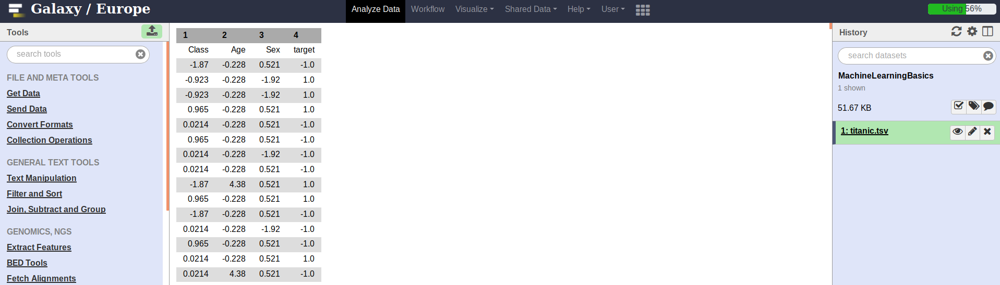
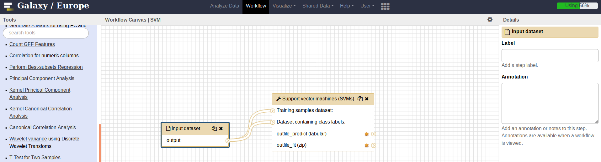
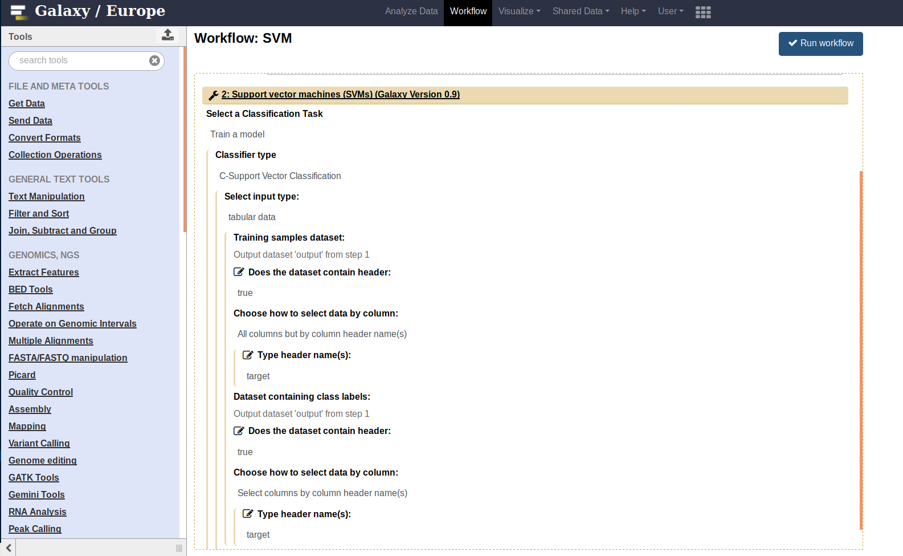
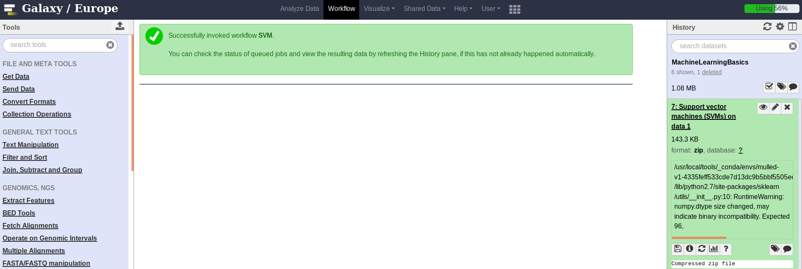

# Introduction
{:.no_toc}
Machine learning uses the techniques from statistics, mathematics and computer science to make computer programs learn from data. It is one of the most popular fields of computer science and finds applications in multiple streams of data analysis like classification, regression, clustering, dimensionality reduction, density estimation and many more. Some real-life applications are spam filtering, medical diagnosis, autonomous driving, recommendation systems, facial recognition, stock prices prediction and many more. The following image shows a basic flow of any machine learning task. A user has data and it is given to a machine learning algorithm for analysis.


There are multiple ways in which machine learning can be used to perform data analysis. They depend on the nature of data and the kind of data analysis. The following image shows the most popular ones.


The following image shows how a classification task is performed. The complete data is divided into training and test sets. The training set is used by a classifier to learn features. It results in a trained model and it is evaluated using the test set (unseen by the classifier during the training).


This tutorial shows how to use machine learning modules implemented as Galaxy tools. Few machine learning tools are present in the tools collection under the header "statistics". These tools can be used to create workflows to perform a machine learning task.

The data used in this tutorial is available at [EpistasisLab](https://github.com/EpistasisLab/penn-ml-benchmarks/blob/master/datasets/classification/titanic/titanic.tsv.gz).

> ### Agenda
>
> Performing a machine learning task (classification) using a workflow involves the following steps:
>
> 1. TOC
> {:toc}
>
{: .agenda}

# Step 1: Upload dataset

> ###  Hands-on: Get the data
> 1. Create a new history in Galaxy.
> 2. Download and import the following dataset in the history:
>     
>    ```
>    https://github.com/EpistasisLab/penn-ml-benchmarks/blob/master/datasets/classification/titanic/titanic.tsv.gz
>    ```
> 

# Step 2: Create a workflow

> ###  Hands-on: Create a workflow and assign correct parameters to the tools
> 1. Select an input dataset tool.
> 2. Connect it to a machine learning tool (Support vector machine) present in the "statistics" tool collection in Galaxy.
> 3. Update the parameters of the tools according to the uploaded dataset.
>    
>  
> 
> 

{: .hands_on}

# Step 3: Execute the workflow

> After updating the parameters of the tools, the workflow should be executed to perform the classification task on the uploaded dataset. The resulting dataset is created in the history.

> ###  Hands-on: Execute the workflow
>    * Click on the "Run workflow" button (shown in the previous image) to execute the workflow. The following image shows the resulting dataset.
> 
> 
{: .hands_on}

> ###  Additional resources:
>
> Read more about **machine learning using scikit-learn** [here](http://scikit-learn.org/stable/).
{:.tip}  
