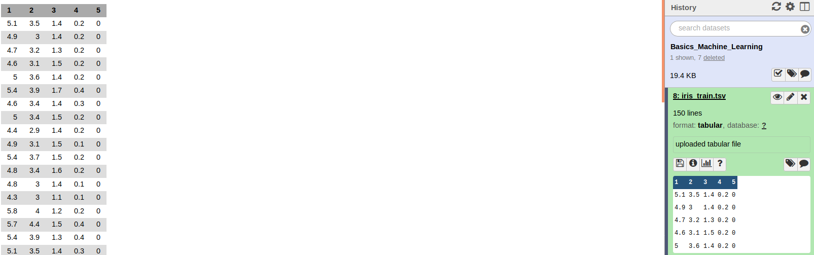
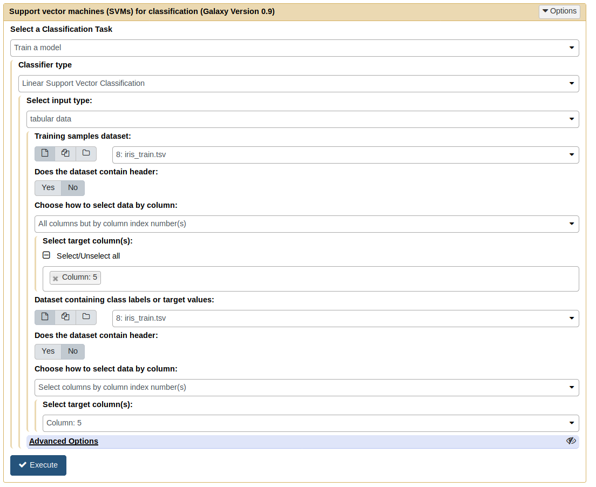
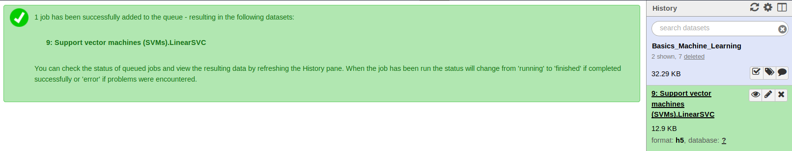
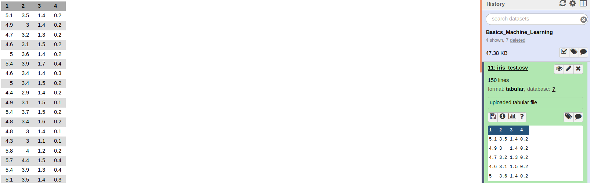
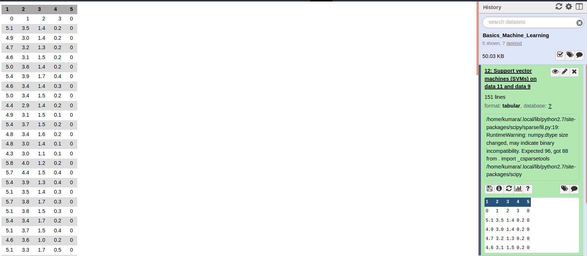

# Introduction
{:.no_toc}

Machine learning uses the techniques from statistics, mathematics and computer science to make computer programs learn from data. It is one of the most popular fields of computer science and finds applications in multiple streams of data analysis like classification, regression, clustering, dimensionality reduction, density estimation and many more. Some real-life applications are spam filtering, medical diagnosis, autonomous driving, recommendation systems, facial recognition, stock prices prediction and many more. The following image shows a basic flow of any machine learning task. A user has data and it is given to a machine learning algorithm for analysis.


There are multiple ways in which machine learning can be used to perform data analysis. They depend on the nature of data and the kind of data analysis. The following image shows the most popular ones.


The following image shows how a classification task is performed. The complete data is divided into training and test sets. The training set is used by a classifier to learn features. It results in a trained model and it is evaluated using the test set (unseen by the classifier during the training).


This tutorial shows how to use machine learning modules implemented as Galaxy tools. Few machine learning tools are present in the tools collection under the header "statistics". These tools can be used to create workflows to perform a machine learning task.

The data used in this tutorial is available at [Zenodo](https://doi.org/10.5281/zenodo.1404173).

> ### Agenda
>
> Performing a machine learning task (classification) using a workflow involves the following steps:
>
> 1. TOC
> {:toc}
>
{: .agenda}

# Step 1: Upload dataset

> ###  Hands-on: Get the data 
> 1. Create a new history in Galaxy.
> 2. Download and import the following dataset ("iris_train.csv") in the history. This dataset contains information about Iris flowers and has five numerical columns. The first four columns give information about the flower's sepal and petal length and width, respectively. The fifth column gives the category of flowers (Iris-Setosa, Iris-Versicolour and Iris-Virginica) based on the sizes of sepals and petals from the other four columns. The category's information is encoded as numbers (0, 1 and 2).
>    ```
>    https://doi.org/10.5281/zenodo.1404173
>    ```
> 
{: .hands_on}


# Step 2: Choose a classifier and update its parameters

> ###  Hands-on: Linear support vector machines and its parameters
> 1. Choose "Support vector machines" tool from the "statistics" tool category.
> 2. Update its parameters as shown in the image below. 
> 3. Choose "train a model" as a classification task and choose the type of classifier "Linear support vector classification".
> 4. Choose the type of data as "tabular". The first four columns of the uploaded data are the dataset and the last column as the "labels" or "targets".
> 
> 
{: .hands_on}


# Step 3: Execute the classifier

> ###  Hands-on: Execute the classifier
> 1. Click on the "Execute" button (shown in the previous image) to execute the classifier.
> 2. See the resulting model (new dataset) in the history. The following image shows the resulting dataset (in the history with ```h5``` format).
> 
> 
{: .hands_on}


# Step 4: Upload test data

> ###  Hands-on: Upload test data
> 1. Upload the test dataset "iris_test.csv" from [Zenodo](https://doi.org/10.5281/zenodo.1404173).
> 2. This dataset does not contain the category column. This column will be predicted in the following steps using the trained model (from step 3).
> 
> 
{: .hands_on}


# Step 5: Choose trained model to predict

> ###  Hands-on: Choose trained model to predict
> 1. Choose "Support vector machines" tool from the "statistics" tool category.
> 2. Set the classification task as "load a model and predict". Choose the trained model created in step 3 to predict. 
> 3. Choose the test data from the previous step.
> 4. Execute the tool.
> 
> 
{: .hands_on}


# Step 6: See predictions

> ###  Hands-on: See the predicted columns
> 1. Click on "view data" link of the dataset created after executing the previous step.
> 2. The last column shows the predicted category for each row.
> 
> 
{: .hands_on}


> ###  Additional resources:
>
> Read more about **machine learning using scikit-learn** [here](http://scikit-learn.org/stable/).
{:.tip}
