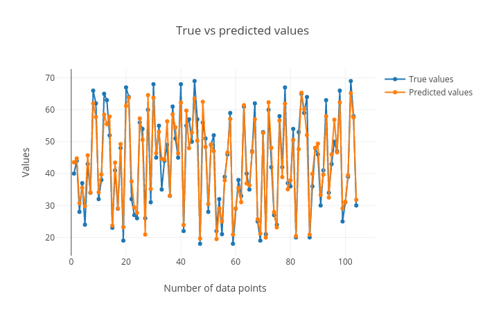

# Introduction


In this tutorial you will learn how to use Galaxy tools to solve [regression](https://en.wikipedia.org/wiki/Regression_analysis) problems. First, we will introduce the concept of regression briefly, and then examine linear regression, which models the relationship between a target variable and some explanatory variables (also known as independent variables). Next, we will discuss gradient boosting regression, an more advanced regressor model which can model nonlinear relationships between variables. Then, we will show how to visualize the results in each step. Finally, we will discuss how to train our models by finding the values of their parameters that minimize a cost function. We will work through a real problem to learn how the models and learning algorithms work.

In this tutorial we will build a regression model for chronological age prediction, based on DNA methylation. This is based on the work of [Jana Naue et al. 2017](https://www.sciencedirect.com/science/article/pii/S1872497317301643?via%3Dihub), in which biomarkers are examined to predict the chronological age of humans by analyzing the DNA methylation patterns. Different machine learning algorithms are used in this study to make an age prediction.

It has been recognized that within each individual, the level of [DNA methylation](https://www.ncbi.nlm.nih.gov/pmc/articles/PMC3174260/) changes with age. This knowledge is used to select useful biomarkers from DNA methylation datasets. The [CpG sites](https://en.wikipedia.org/wiki/CpG_site) with the highest correlation to age are selected as the biomarkers (and therefore features for building a regression model). In this tutorial, specific biomarkers are analyzed by machine learning algorithms to create an age prediction model.


> <agenda-title></agenda-title>
>
> In this tutorial, we will cover:
>
> 1. TOC
> {:toc}
>
{: .agenda}


# Regression

Regression analysis attempts to determine the relationship between one target variable and a series of independent variables. A regressor learns the mapping between the features of a dataset row (i.e. the values for each of the independent variables) and its target value. It tries to fit a curve for the targets, which can be linear or non-linear. When the targets in a dataset are real numbers, the machine learning task is known as regression and each sample in the dataset has a real-valued output or target. Figure [1](#figure-1) shows how a regression curve is fitted which best explains all these points. Here, the curve is a straight line, so this is an example of linear regression. The regression task is to learn this curve, which explains the underlying distribution of the data points. The curve can then be used to make predictions for new data points; the target for a new sample will lie on the curve learned by the regression task.


Linear regression is a technique used to analyze a linear relationship between input variables (independent variables) and a single target variable. A linear relationship means that the data points tend to follow a straight line. Simple linear regression involves only a single input variable. Figure 2 shows a dataset with a linear relationship.


In linear regression, our goal is to find the line that best models the path of the data points. Figure 3 shows the dataset we used in Figure 2 with a line of best fit through it. The position of the line is determined by certain fitting coefficients (in this simple case, the gradient and intercept) and linear regression helps us pick appropriate values for these coefficients. In this example we have only one input variable and the problem is therefore simple linear regression. Note that in real problems we have more than one input variable. In this case, we call it multiple linear regression. Adding extra input variables just means that we’ll need to find more weights.


> <details-title>Cost function</details-title>
>
> Once we have a prediction in regression problems, we need some way to tell if it’s reasonable or not. A cost function helps us do this. The cost function compares all the predictions against their actual values and provides a single number that we can use as a measure. Two common cost functions are the error and squared error. The error is how far our prediction is away from the actual value (Figure 4).
>
>
> We know an error above the actual value and an error below the actual value should be about as bad as each other. The squared error makes this clear because both positive and negative values of the error result in a positive squared error. We will use the Mean Squared Error (MSE) function as our cost function. This function finds the average squared error value for all of our data points. Cost functions are important to us because they measure how accurate our model is against the target values.
>
{: .details}


# Analyze DNA methylation dataset

As a benchmark, we will use the [DNA methylation dataset](https://www.sciencedirect.com/science/article/pii/S1872497317301643?via%3Dihub) to predict the chronological age. One important reason to choose this dataset for an age prediction task is that DNA methylation changes with age and this change occurs at specific CpG sites in humans. 
It has been recognized that DNA methylation analysis, which mostly occurs in a CpG sequence context, can give additional information besides the DNA profile.  It has been shown that DNA methylation changes with age within each individual. This alteration in DNA methylation occurs at specific CpG sites in all individuals, but with individual differences in “speed”, showing more DNA methylation differences in older twins compared to young ones.

Epigenomic and phenotypic changes which are age-dependent are also contained in these cells. This knowledge is used to select useful biomarkers from the DNA methylation dataset. The CpG sites with the highest correlation to age are selected as biomarkers (features). In this study, specific biomarkers are analyzed by machine learning algorithms to create an age prediction model.

In this tutorial, we will apply a couple of ([scikit-learn](https://scikit-learn.org/stable/)) machine learning tools to DNA methylation datasets to predict the chronological age of humans.

## Get training and test datasets

Whole blood samples are collected from humans with their ages falling in the range 18-69 and the best age-correlated CpG sites in the genome are chosen as features. The dataset is divided into two parts - training and test sets. The training set is used to train a regressor and the test set is used to evaluate the performance of the trained model. We proceed with the analysis by uploading new datasets and creating a new history. 

> <hands-on-title>Data upload</hands-on-title>
>
> 1. Create a new history for this tutorial
> 2. Import the files from [Zenodo](https://zenodo.org/record/2545213#.XEWTJ9-YVa0)
>
>    ```
>    https://zenodo.org/record/2545213/files/train_rows.csv
>    https://zenodo.org/record/2545213/files/test_rows_labels.csv
>    https://zenodo.org/record/2545213/files/test_rows.csv
>    ```
>
>    
>
> 3. Rename the datasets as `train_rows`, `test_rows_labels` and `test_rows` respectively.
>
>    
>
> 4. Check that the datatype of all the three datasets is `tabular`.
>
>    
>
{: .hands_on}

The datasets from this study contain features (present as columns). The last column in the dataset refers to `Age`, which is used as labels/targets. Since the targets are real numbers, the machine learning task becomes a regression problem. Using these features and targets, a model is built which learns a mapping between these input features and targets. The training set contains `208` rows corresponding to individual samples and `13` features (age-correlated CpG sites in DNA methylation dataset). The last column is `Age`. The test set contains `104` rows and the same number of features as the training set. The `Age` column in the test set is predicted after training on the training set. Another dataset `test_rows_labels` contains the true age values of the test set which is used to compute scores between true and predicted age.
The `train_rows` contains a column `Age` which is the label or target. We will evaluate our model on `test_rows` and compare the predicted age with the true age in `test_rows_labels`
{: .comment}

> <details-title>Test-train data splitting data within Galaxy</details-title>
> For this task, test and training datasets are provided. However, if you want to analyze your own data, you can check out the **Split Dataset** tool, which can split a dataset into training and test subsets with a number of advanced options.
>
{: .details}

## Learn the linear model from training dataset

At the first step, to learn the mapping between several features and the targets, we will apply a linear regressor. It learns features from the training dataset and maps all the rows to their respective targets. The process of mapping gives a trained model.

The dataset is divided into two parts - training and test sets. The training set is used to train a regressor and the test set is used to evaluate the performance of the trained model.

> <hands-on-title>Train a model</hands-on-title>
>
> 1. **Generalized linear models for classification and regression**  with the following parameters to train the regressor:
>    - *"Select a Classification Task"*: `Train a model`
>       - *"Select a linear method"*: `Linear Regression model`
>          - *"Select input type"*: `tabular data`
>             -  *"Training samples dataset"*: `train_rows`
>             -  *"Does the dataset contain header"*: `Yes`
>             -  *"Choose how to select data by column"*: `All columns EXCLUDING some by column header name(s)`
>                -  *"Type header name(s)"*: `Age`
>             -  *"Dataset containing class labels or target values"*: `train_rows`
>             -  *"Does the dataset contain header"*: `Yes`
>             -  *"Choose how to select data by column"*: `Select columns by column header name(s)`
>                -  *"Type header name(s)"*: `Age`
> 2. Rename the generated file to `LinearRegression_model`
{: .hands_on}

> <question-title></question-title>
>
> What is learned by the linear regressor?
>
> > <solution-title></solution-title>
> >
> > The linear regressor learns the coefficients of the best fit line to the data.
> > 
> {: .solution}
>
{: .question}

## Predict age using test dataset

After learning on the training dataset, we should evaluate the performance on the test dataset to know whether the model created by the learning algorithm from the training dataset is good or not. This model is used to predict a new sample and a similar accuracy is expected.

Now, we will predict age in the test dataset using this model in order to see if the model has learned important features which can be generalized on a new dataset. The test dataset (`test_rows`) contains the same number of features but does not contain the `Age` column; the age will instead be predicted using the trained model.


> <hands-on-title>Predict targets using the model</hands-on-title>
>
> 1. **Generalized linear models for classification and regression**  with the following parameters to predict targets of test dataset using the trained model:
>    - *"Select a Classification Task"*: `Load a model and predict`
>       -  *"Models"*: `LinearRegression_model`
>       -  *"Data (tabular)"*: `test_rows`
>       -  *"Does the dataset contain header"*: `Yes`
>       -  *"Select the type of prediction"*: `Predict class labels`
> 2. Rename the generated file to `predicted_data_linear`
{: .hands_on}

## Visualize the prediction

We will evaluate the predictions by comparing them to the expected targets. In the previous step, we generated predictions for the test dataset (`predicted_data_linear`). We have one more dataset (`test_rows_labels`) which contains the true age values of the test set. Using the true and predicted values of age in the test set, we will verify the performance by analyzing the plots. As you can see, `predicted_data_linear` has no header, so first we need to remove the header from `test_rows_labels` to perform the comparison.

> <hands-on-title>Remove the header</hands-on-title>
>
> 1. **Remove beginning of a file**  with the following parameters:
>       -  *"Remove first"*: `1`
>       -  *"from"*: `test_rows_labels`
> 2. Rename the generated file to `test_rows_labels_without_header`
{: .hands_on}


Now we visualize and analyze the predictions using the **Plot actual vs predicted curves and residual plots** tool in Galaxy.
Hint: Please find the above tool in "Graph/Display data" tool section in Galaxy.

> <hands-on-title>Check and visualize the predictions</hands-on-title>
> 1. **Plot actual vs predicted curves and residual plots**  with the following parameters to visualize the predictions:
>    -  *"Select input data file"*: `test_rows_labels_without_header`
>    -  *"Select predicted data file"*: `predicted_data_linear`
{: .hands_on}

The visualization tool creates the following plots:

1. True vs. predicted targets curves: In this plot the corresponding points in both these curves should be close to each other for a good regression performance. We can see that the plot shows this behaviour.

    

2. [Scatter plot](https://towardsdatascience.com/everything-you-need-to-know-about-scatter-plots-for-data-visualisation-924144c0bc5) for true vs. predicted targets: We can see in the scatter plot (figure [6](#figure-6)) that most of the points lie along the x=y curve. It means that the true and predicted ages are close to each other. The root mean square error (`RMSE`) is `4.1` and the R2 score is `0.93`.

    

3. [Residual plot](http://docs.statwing.com/interpreting-residual-plots-to-improve-your-regression/) between residual (predicted - true) and predicted targets: The residual plot shown in figure [7](#figure-7) is generated to see if there is any visible pattern between residual (predicted age - true age) and predicted age. For a good regression performance, this plot should exhibit a random pattern and the points should be symmetrically distributed along the y=0 line.

     and predicted targets. The plot shows a random pattern of points.")

These plots are important to visualize the quality of regression and the true and predicted targets - how close or far they are from each other. The closer they are, the better the prediction.

> <details-title>R2 (coefficient of determination)</details-title>
> In both the parts, learning on datasets is done using cross-validation and [R2](https://scikit-learn.org/stable/modules/generated/sklearn.metrics.r2_score.html) scoring metric is used to evaluate the performance of the trained model. The closer it is to 1.0, the better it is. If it is negative, then the trained model is not good. To infer how its values exhibit model performance, we can compare the figures [8](#figure-8) and [9](#figure-9). In both the plots, the true and predicted targets are plotted in a scatter plot. For a good model, most of the points should lie along the `x = y` line as the true and predicted targets are close to each other. In figure [8](#figure-8), we can see that the points are scattered and do not show any pattern. Therefore, the R2 score is `-0.06`. On the other hand, figure [9](#figure-9) shows a better pattern as most of the points lie along the line and the R2 score is almost `1.0`. For RNA-seq dataset, we will compute the cross-validated R2 score using the training set and for DNA methylation dataset, we will compute the R2 score for the test set.
>
> 
>
>
>
{: .details}


> <question-title></question-title>
>
> Inspect the plots. What can you say about the predictions?
>
> > <solution-title></solution-title>
> >
> > Figures 5, 6 and 7 show that the prediction is acceptable and the predicted age lies about close to the true age, but the reults can be improved by using better algorithms such as ensemble-based regressors. 
> >
> {: .solution}
{: .question}


## Using ensemble methods for regression

Linear regression is a useful technique but isn’t always the right choice for our real problems. Linear regression is a good choice when there is a linear relationship between your independent and dependent variables and you are trying to predict continuous values.

It is not a good choice when the relationship between independent and dependent variables is more complicated. For example, Figure 10 shows a dataset that does not have a linear relationship so linear regression would not be a good choice.


To learn the mapping between several features and the targets, in the next step, we will apply the
[Gradient boosting regressor](https://scikit-learn.org/stable/modules/generated/sklearn.ensemble.GradientBoostingRegressor.html#sklearn.ensemble.GradientBoostingRegressor). It is an ensemble-based regressor because its prediction is the collective performance of multiple weak learners (e.g. decision trees). It learns features from training dataset and maps all the rows to their respective targets (real numbers). The process of mapping gives a trained model.

> <comment-title></comment-title>
> An [*ensemble*](https://scikit-learn.org/stable/modules/ensemble.html#ensemble) method uses multiple learning models internally for better predictions and boosting is a method of converting weak learners into strong learners.
{: .comment}

[Jana Naue et al. (2017)](https://www.sciencedirect.com/science/article/pii/S1872497317301643?via%3Dihub) used [Random Forest](https://scikit-learn.org/stable/modules/generated/sklearn.ensemble.RandomForestRegressor.html#sklearn.ensemble.RandomForestRegressor) (another ensemble-based regressor) as regressor and we can conclude from this study that an ensemble-based regressor works well on this DNA methylation dataset. Therefore, we will use gradient boosting to build a prediction model.

Like the random forest method, gradient boosting is an ensemble-based regressor, because it uses multiple decision tree regressors internally and makes predictions by taking the collective performances of predictions made by multiple decision trees. It has a good predictive power and is robust to outliers. It creates an ensemble of weak learners (decision trees) and iteratively minimizes errors. One disadvantage, which comes from its basic principle of boosting, is that it cannot be parallelized. *Hint:* Please find the following tool in "Machine learning" tool section in Galaxy.

> <hands-on-title>Train a model</hands-on-title>
>
> 1. **Ensemble methods for classification and regression**  with the following parameters to train the regressor:
>    - *"Select a Classification Task"*: `Train a model`
>       - *"Select an ensemble method"*: `Gradient Boosting Regressor` (*Note:* choose `Gradient Boosting Regressor` not `Gradient Boosting Classifier`)
>          - *"Select input type"*: `tabular data`
>             -  *"Training samples dataset"*: `train_rows`
>             -  *"Does the dataset contain header"*: `Yes`
>             -  *"Choose how to select data by column"*: `All columns EXCLUDING some by column header name(s)`
>                -  *"Type header name(s)"*: `Age`
>             -  *"Dataset containing class labels or target values"*: `train_rows`
>             -  *"Does the dataset contain header"*: `Yes`
>             -  *"Choose how to select data by column"*: `Select columns by column header name(s)`
>                -  *"Type header name(s)"*: `Age`
> 2. Rename the generated file to `gradient_boosting_model`
{: .hands_on}

> <question-title></question-title>
>
> What is learned by the gradient boosting regressor?
>
> > <solution-title></solution-title>
> >
> > **Gradient boosting** regressor learns multiple attributes like **feature_importances_** (weight for each feature/column),
> > **oob_improvement_** (which stores incremental improvements in learning), **estimators_** (collection of weak learners) and a few more.
> > These attributes are used to predict the target for a new sample and are stored in the trained model. They can be accessed by using the **Estimator attributes** tool on the `gradient_boosting_model` dataset.
> > 
> {: .solution}
>
{: .question}

After learning on the training dataset, we should evaluate the performance on the test dataset.

> <hands-on-title>Predict targets using the model</hands-on-title>
>
> 1. **Ensemble methods for classification and regression**  with the following parameters to predict targets of test dataset using the trained model:
>    - *"Select a Classification Task"*: `Load a model and predict`
>       -  *"Models"*: `gradient_boosting_model`
>       -  *"Data (tabular)"*: `test_rows`
>       -  *"Does the dataset contain header"*: `Yes`
>       -  *"Select the type of prediction"*: `Predict class labels`
> 2. Rename the generated file to `predicted_data_gradient_boosting`
{: .hands_on}

Now we can visualize and analyze the predictions using the **Plot actual vs predicted curves and residual plots** tool.
> <hands-on-title>Check and visualize the predictions</hands-on-title>
> 1. **Plot actual vs predicted curves and residual plots**  with the following parameters to visualize the predictions:
>    -  *"Select input data file"*: `test_rows_labels` (*Note:* use the `test_rows_labels` dataset, not the `test_rows_labels_without_header` one)
>    -  *"Select predicted data file"*: `predicted_data_gradient_boosting`
{: .hands_on}


 

R2 score is 0.93, the same as the linear model, but the RMSE is smaller (3.85), which tells us that the predicted targets are closer to the true targets.

## Create data processing pipeline

In the final step, we will create a pipeline learner with the **Pipeline builder** tool but this time, we just specify the regressor. The **Pipeline builder** tool will wrap this regressor and return a zip file. By choosing `Yes` from the boolean option, tunable hyperparameters will be output in a separate file.

> <hands-on-title>Create pipeline</hands-on-title>
>
> 1. **Pipeline builder**  with the following parameters:
>    - In *"Final Estimator"*:
>        - *"Choose the module that contains target estimator"*: `sklearn.ensemble`
>            - *"Choose estimator class"*: `GradientBoostingRegressor`
>            - *"Type in parameter settings if different from default"*: `random_state=42`
>        - In *"Output parameters for searchCV?"*: `Yes`
> 
>      `random_state` could be set to any arbitrary integer number; its purpose is to ensure a determistic and therefore reproducible result.
>
{: .hands_on}


### Search for the best values of hyperparameters

After the **New Pipeline/Estimator** dataset and its tunable hyperparameters are produced by the **Pipeline builder** tool, we will use the **Hyperparameter search** tool to find the best values for each hyperparameter. These values will lead us to create the best model based on the search space chosen for each hyperparameter. We use only one parameter `n_estimators` of `Gradient boosting` regressor for this task. This parameter specifies the number of boosting stages the learning process has to go through. The default value of `n_estimators` for this regressor is `100`. However, we are not sure if this gives the best accuracy. Therefore, it is important to try setting this parameter to different values to find the optimal one. We choose some values which are less than `100` and a few more than `100`. The hyperparameter search will look for the optimal number of estimators and gives the best-trained model as one of the outputs. This model is used in the next step to predict age in the test dataset.


> <details-title>5-fold cross-validation</details-title>
>
> This is a model validation technique which estimates the performance of a predictive model on an unseen dataset. A dataset is divided into `5` folds and these folds are categorized into training and validation sets. The idea of cross-validation is shown in figure [12](#figure-12). The complete dataset is divided into `5` equal parts. 4 out of the 5 parts are used for training and the remaining 1 part is used for validating the performance of training. This is done for `5` folds/iterations; each time the validation set (1/5 of the dataset) is different. In all five folds, the complete dataset is used for training and validation. The final validation performance is averaged over `5` folds.
>
> 
>The image demonstrates how the 5-fold cross-validation works. The complete dataset is divided into 5 equal parts/folds. 4 parts (80%) of the data (training set shown in yellow) are used for training the model and the remaining one part is used for evaluating (validation set shown in blue) the trained model. This is repeated for 5 times till every part/fold is used as the validation set. The accuracies computed for different validation folds are averaged to give 5-fold cross-validation accuracy.
>
{: .details}

> <hands-on-title>Hyperparameter search</hands-on-title>
>
> 1. **Hyperparameter search**  with the following parameters:
>    - *"Select a model selection search scheme"*: `GridSearchCV - Exhaustive search over specified parameter values for an estimator `
>        -  *"Choose the dataset containing pipeline/estimator object"*: `zipped` file (output of **Pipeline builder** )
>        - *"Is the estimator a deep learning model?"*: `No`
>        - In *"Search parameters Builder"*:
>             -  *"Choose the dataset containing parameter names"*: `tabular` file (the other output of **Pipeline builder** )
>             - In *"Parameter settings for search"*:
>                 -  *"1: Parameter settings for search"*
>                    - *"Choose a parameter name (with current value)"*: `n_estimators: 100`
>                    - *"Search list"*: `[25, 50, 75, 100, 200]`
>        - In *"Advanced Options for SearchCV"*:
>            - *"Select the primary metric (scoring)"*: `Regression -- 'r2'`
>
>               A scoring metric can be set. In this tutorial, we use `Regression -- 'r2'`
>
>            - *"Select the cv splitter"*: `KFold`
>
>               There are different ways to split the dataset into training and validation sets. In our tutorial, we will use `KFold` which splits the dataset into `K` consecutive parts. It is used for cross-validation. It is set to `5` using another parameter `n_splits`.
>
>                - *"n_splits"*: `5`
>                - *"Whether to shuffle data before splitting"*: `Yes`
>                - *"Random seed number"*: `3111696`
>
>                   It is set to an integer and used to retain the randomness/accuracy when *"Whether to shuffle data before splitting"* is `Yes` across successive experiments.
>
>            - *"Raise fit error"*: `No`
>
>               While setting different values for a parameter during hyperparameter search, it can happen that wrong values are set, which may generate an error. To avoid stopping the execution of a regressor, it is set to `No` which means even if a wrong parameter value is encountered, the regressor does not stop running and simply skips that value.
>
>    - *"Select input type"*: `tabular data`
>        -  *"Training samples dataset"*: `train_rows` tabular file
>        - *"Does the dataset contain header"*: `Yes`
>        - *"Choose how to select data by column"*: `All columns EXCLUDING some by column header name(s)`
>            - *"Type header name(s)"*: `Age`
>        -  *"Dataset containing class labels or target values"*: `train_rows` tabular file
>        - *"Does the dataset contain header"*: `Yes`
>        - *"Choose how to select data by column"*: `Select columns by column header name(s)`
>            - *"Type header name(s)"*: `Age`
>    - *"Whether to hold a portion of samples for test exclusively?"*: `Nope`
>    - *"Save best estimator?"*: `Fitted best estimator or Detailed cv_results_ from nested CV`
>
{: .hands_on}

> <question-title></question-title>
>
> What is the optimal number of estimators for the given dataset?
>
> Hint: Please look at the `mean_test_score` column in the tabular result from the **Hyperparameter search** tool.
>
> > <solution-title></solution-title>
> >
> > 75. (Even though the default value of the number of estimators for the gradient boosting regressor is `100`, `75` gives the best accuracy. That's why it is important to perform hyperparameter search to tune these parameters for any dataset). 50 estimators also give almost the same accuracy.
> >
> {: .solution}
>
{: .question}

Using the **Hyperparameter search** tool, we optimized our model, based on the training data. Now, we will predict the age from the test dataset using this model.

> <hands-on-title>Predict age</hands-on-title>
>
> 1. **Ensemble methods for classification and regression**  with the following parameters:
>    - *"Select a Classification Task"*: `Load a model and predict`
>        -  *"Models"*: `zipped` file (output of **Hyperparameter search** )
>        -  *"Data (tabular)"*: `test_rows` tabular file
>        - *"Does the dataset contain header"*: `Yes`
>
{: .hands_on}


Now we will verify the performance by creating and analyzing the plots.

> <hands-on-title>Create regression plots</hands-on-title>
>
> 1. **Plot actual vs predicted curves and residual plots of tabular data**  with the following parameters:
>    -  *"Select input data file"*: `test_rows_labels` tabular file
>    -  *"Select predicted data file"*: `tabular` file (output of **Ensemble methods for classification and regression** )
>
{: .hands_on}


> <question-title></question-title>
>
> Inspect the plots. What can you say about the predictions?
>
> > <solution-title></solution-title>
> >
> > The figures show that the prediction is very good because the predicted age lies close to the true age. 
> {: .solution}
{: .question}


We can see in the scatter plot (figure [13](#figure-13)) that most of the points lie along the `x = y` curve. This tells us that the true and predicted ages are close to each other. The root mean square error (`RMSE`) is `3.74` and the R2 score is `0.94`.

 age against the predicted age.")

As you can see in the figure, there is no visible pattern between the plotted points, which means our model is good.


We can see that the predicted values are close to the true values.


Figure [13](#figure-13) shows that we achieved an R2 score of `0.94` and root mean square score of `3.74` for the test set using Gradient boosting regressor. [Jana Naue et al. 2017](https://www.sciencedirect.com/science/article/pii/S1872497317301643?via%3Dihub) mention a similar root mean square score (`3.93`) using the random forest regressor. The root mean square score shows the difference between the true and predicted age of humans. The R2 score (`0.94`) is close to the best achievable score of `1.0` which shows that the trained model is good. Overall, the second part of the analysis also shows that using the machine learning tools in Galaxy, we can achieve state-of-the-art predictions mentioned in the recent scientific studies.


# Conclusion
By following these steps, we learned how to perform regression and visualize the predictions using Galaxy's machine learning and plotting tools. The features of the training dataset are mapped to the real-valued targets. This mapping is used to make predictions on an unseen (test) dataset. 
The quality of predictions is visualized using multiple plots to ascertain the robustness of machine learning tasks. There are many other regressors in the machine learning suite which can be tried out on these datasets to find how they perform. Different datasets can also be analyzed using these regressors. The regressors have many parameters which can be altered while performing the analyses to see if they affect the prediction accuracy. It may be beneficial to perform a hyperparameter search to tune these parameters for different datasets. 
