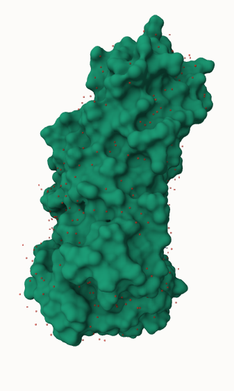
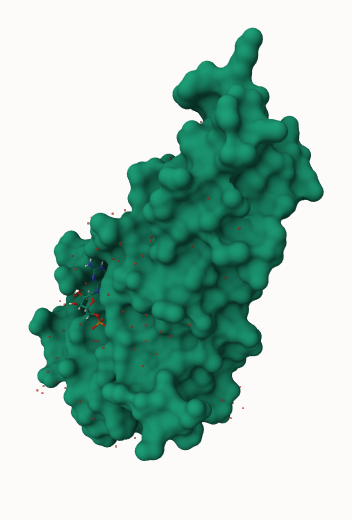
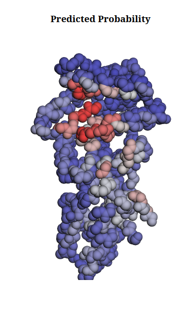
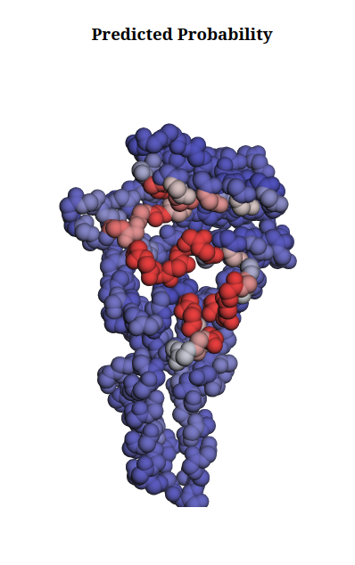
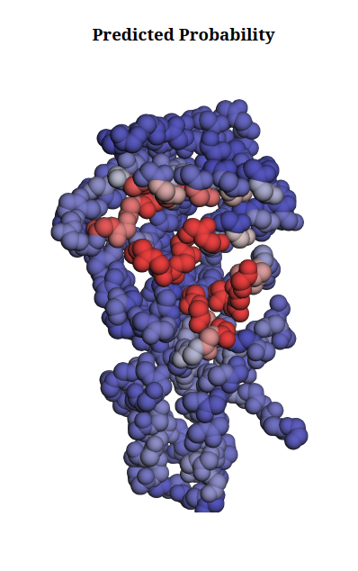
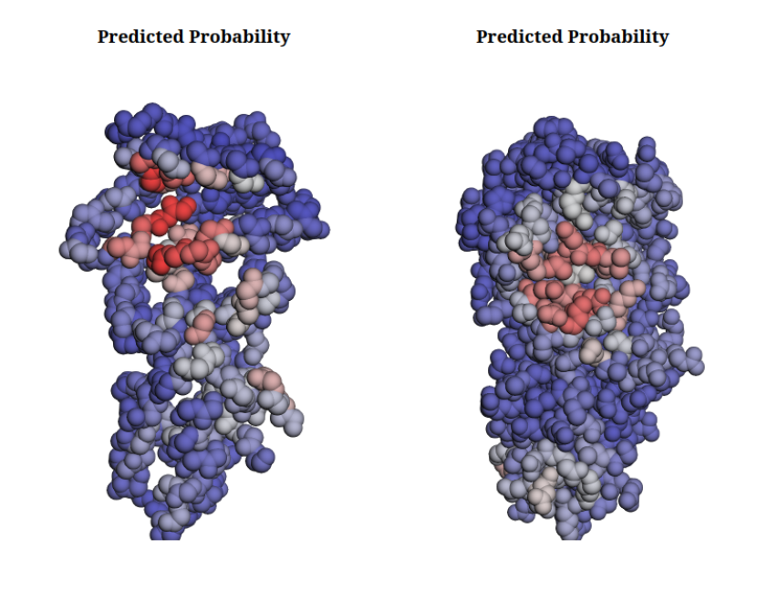
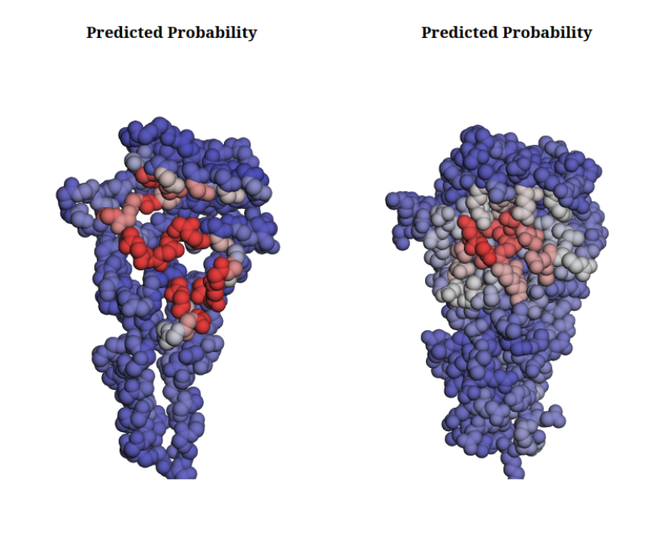
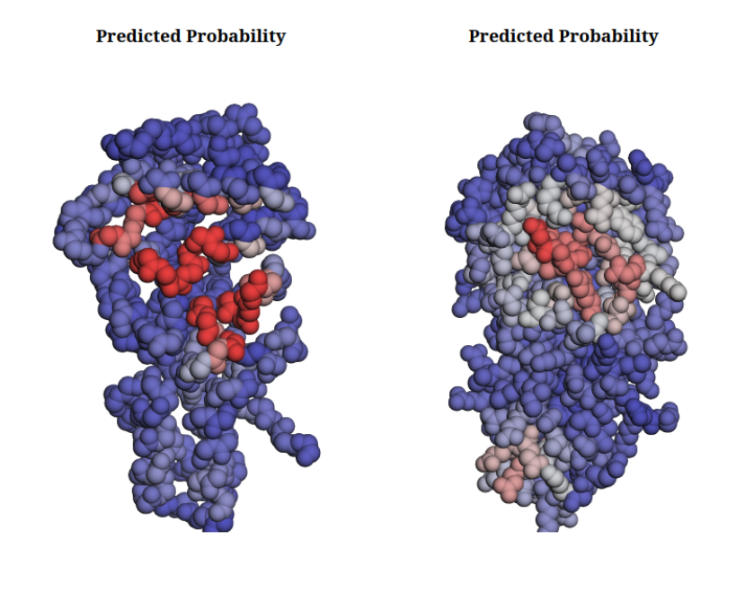

Proteins are not static objects. They constantly move and change shape, and these conformational changes can be especially important when a ligand binds.
A protein structure captured **before ligand binding** is called the **apo** form, while a structure captured **with a ligand bound** is called the **holo** form (for more information about apo and holo state, please take a look at [How different are structurally flexible and rigid binding sites?](https://pubmed.ncbi.nlm.nih.gov/17059826/)).

Why does this matter?

In the holo structure, the protein has already adopted a conformation compatible with the ligand. As a result, the binding pocket is often easier to identify: the pocket is already **pre-organized around the ligand**.

But what happens when the ligand is not there?
And what if the structure we use is not an experimentally determined structure at all, but a **Colabfold prediction**?

This tutorial explores exactly that question. We will use SIMORGH () to address this challenge.

Simorgh is a deep learning framework built on SE(3)-equivariant neural networks for ligand-binding site prediction.
It combines local geometric reasoning with information from diverse protein states.
A message-passing module first encodes the spatial context of individual residues within each structure, followed by an aggregation module that integrates these residue-level representations across the ensemble.
By explicitly modeling structural variability, Simorgh identifies binding sites that are meaningful across multiple protein states, rather than being biased toward a single structure.


> <warning-title>LICENSE</warning-title>
>
> SIMORGH is only available for NON-COMMERCIAL use. Permission is only granted for academic, research, and educational purposes. Before using, be sure to review, agree, and comply with the license.
> For commercial use, please review the SIMORGH license on GitHub and contact the [copyright holders](https://github.com/amisteromid/SIMORGH)
{: .warning}


We will use the **Escherichia coli Signal Recognition Particle Receptor FtsY** as our example.
FtsY binds **Guanosine-5'-diphosphate (GDP)**, and experimentally determined structures are available in either apo or holo conformations.

We will work with two experimental structures; 6N5J represents the apo state (), and 6FQD represents the Holo state ().

The interesting question is:

If we predict the ligand-binding site from different structural representations of the same protein, how much does the prediction change?

To answer this, we will compare **three structural modalities**:
* Native apo structure — experimentally determined
* Native holo structure — experimentally determined
* Colabfold structure — computationally predicted from sequence


> <agenda-title></agenda-title>
>
> In this tutorial, we will cover:
>
> 1. TOC
> {:toc}
>
{: .agenda}

# Get the structures

## Experimental structures

> <hands-on-title> Get PDB file </hands-on-title>
>
> 1.  with the following parameters:
>    - *"PDB accession code"*: `6N5J`
>    - In *"Additional options"*:
>       - *"Output Tags"*: `#apo`
>
> 2. Rename the data `6N5J PDB`
>
> 3.  with the following parameters:
>    - *"PDB accession code"*: `6FQD`
>    - In *"Additional options"*:
>       - *"Output Tags"*: `#holo`
>
> 4. Rename the data `6FQD PDB`
>
{: .hands_on}

> <question-title></question-title>
>
> View the PDB files by clicking on the eye icon .
> It will visualize the PDB with the `Molstar Viewer`.
> In the **Components** section, click on the three dots right side of the **Polymer**. Then **Add Representation** and then select **Molecular Surface**
>
> 1. Compare the apo and holo structures, focusing on their cavities.
> Which structure has a deeper and more clearly defined pocket?
> What might this difference suggest about the effect of ligand binding on the protein structure?
>
> > <solution-title></solution-title>
> >
> > 1. The holo structure has a deeper and better-defined pocket, with a shape that is more complementary to the ligand.
> > The apo structure generally has a shallower or less well-defined cavity.
> > This illustrates how ligand binding can reshape or stabilize a binding pocket to accommodate the ligand.
> >
> > 
> >
> > 6N5J PDB
> >
> > 
> >
> > 6FQD PDB
> >
> {: .solution}
>
{: .question}

## Predicted structures

We will use Colabfold () to predict the 3D structure of our protein.

Please note that since the training data consist of BBFlow conformations, applying relaxation during inference introduces a distribution shift that may alter the structural features learned by the model.
Therefore, it is preferable to avoid unnecessary relaxation during inference. To do that we will exclude AMBER relaxation.

> <hands-on-title> Colabfold prediction </hands-on-title>
>
> 1. Create a new **fasta** dataset (`FtsY.fasta`) from the following:
>
>    ```text
>    >6N5J_1|Chains A, B|Signal recognition particle receptor FtsY|Escherichia coli (strain K12) (83333)
>    GFARLKRSLLKTKENLGSGFISLFRGKKIDDDLFEELEEQLLIADVGVETTRKIITNLTEGASRKQLRDAEALYGLLKEE
>    MGEILAKVDEPLNVEGKAPFVILMVGVNGVGKTTTIGKLARQFEQQGKSVMLAAGDTFRAAAVEQLQVWGQRNNIPVIAQ
>    HTGADSASVIFDAIQAAKARNIDVLIADTAGRLQNKSHLMEELKKIVRVMKKLDVEAPHEVMLTIDASTGQNAVSQAKLF
>    HEAVGLTGITLTKLDGTAKGGVIFSVADQFGIPIRYIGVGERIEDLRPFKADDFIEALFARED
>    ```
>
>    
>
> 2.  with the following parameters:
>    - *"Data input method"*: `FASTA file`
>    - *"Query sequence fasta"*: `FtsY.fasta`
>
> 3.  with the following parameters:
>    - *"Tar file output from colabfold MSA tool"*: `Output of Colabfold MSA`
>    - In *"Advanced options"*:
>       - *"How many recycles to run?"*: `5`
>       - *"Number of ensembles"*: `1`
>       - *"Set seed"*: `42`
>       - *"Number of models to use for structure prediction"*: `1`
>       - *"Use AMBER"*: `Don't use AMBER`
>
> 4.  with the following parameters:
>    - *"Input List"*: `PDB predictions` output of Colabfold Alphafold
>    - *"How should a dataset be selected?"*: `The first dataset`
>
> 5. Rename the data `FtsY Colabfold predicted`
>
> 6. Add the tag: `#colabfold`
>
{: .hands_on}


> <question-title></question-title>
>
> 1. Why might a Colabfold predicted structure differ from the experimental apo or holo structures?
>
> > <solution-title></solution-title>
> >
> > 1. Colabfold predicts the structure based on sequence and evolutionary information.
> > It typically predicts an averaged or lowest-energy state (often apo-like), but it does not know about specific ligands present in the experimental holo environment.
> >
> {: .solution}
>
{: .question}

# Structure preprocessing

## PDB cleanup

Next we should preprocess the raw experimental PDB structures to fix structural anomalies. We will use pdbfixer () to identify and model missing heavy atoms, insert missing flexible loops or internal side chains based on the sequence, remove crystallographic water molecules or unwanted ligand, replace non-standard residue entries with standard amino acids, and add explicit hydrogen atoms at specified pH levels to ensure physical completeness for downstream modeling.

> <hands-on-title>  PDBFixer </hands-on-title>
>
> 1.  with the following parameters:
>    - *"PDB input file"*: `6N5J PDB`
>    - *"Missing atoms to be added"*: `Heavy atoms only`
>    - *"Which heterogens to keep"*: `None`
>    - *"Replace nonstandard residues with standard equivalents?"*: `Yes`
>
> 2. Rename the data `6N5J PDB fixed`
>
> 3.  with the following parameters:
>    - *"PDB input file"*: `6FQD PDB`
>    - *"Missing atoms to be added"*: `Heavy atoms only`
>    - *"Which heterogens to keep"*: `None`
>    - *"Replace nonstandard residues with standard equivalents?"*: `Yes`
>
> 4. Rename the data `6FQD PDB fixed`
>
{: .hands_on}

> <question-title></question-title>
>
> 1. Why is it important to replace non-standard residues with standard equivalents?
>
> > <solution-title></solution-title>
> >
> > 1. Downstream tools like SIMORGH or BBFlow are often trained on standard amino acids.
> > Non-standard residues can cause errors or be ignored during the prediction process if they are not explicitly handled by the models.
> >
> {: .solution}
>
{: .question}

## Retrieve chain B

Since FtsY is a homodimer, we will use a single chain B for simplicity. For this task, we will use *"Text reformating with awk"* tool () to reformat our PDB files.

The command `rectype = substr($0,1,6)`, gets the characters 1-6 of the current line (such as ATOM, HETATM, or TER).

Then the command `chain = substr($0,22,1)` gets the character 22 of the line which corresponds to either A or B (the chain identifiers).

Then, `if ((rectype ~ /^ATOM/ || rectype ~ /^HETATM/ || rectype ~ /^TER/) && chain == "A") next` skips any line that is `ATOM, HETATM, or TER` and it is chain `A`.

Finally, `print` outputs any line that is not skipped.

In summary, "Keep everything except ATOM/HETATM/TER records from chain A."

Copy the following script in the ***"AWK Program"*** of the following tool:
```
{
  rectype = substr($0,1,6)
  chain = substr($0,22,1)
  if ((rectype ~ /^ATOM/ || rectype ~ /^HETATM/ || rectype ~ /^TER/) && chain == "A") next
  print
}
```

> <hands-on-title>   Text reformatting with awk </hands-on-title>
>
> 1.  with the following parameters:
>    - *"File to process"*: `6N5J PDB fixed`
>    - *"AWK Program"*: `copy the text from above`
>
> 2. Rename the data `6N5J PDB fixed chainB`
>
> 3.  with the following parameters:
>    - *"File to process"*: `6FQD PDB fixed`
>    - *"AWK Program"*: `copy the text from above`
>
> 4. Rename the data `6FQD PDB fixed chainB`
>
{: .hands_on}

# Binding Site Prediction with SIMORGH

A single protein structure is only one snapshot of a moving molecule. To capture this motion, we generate a conformational ensemble for each structure using BBFlow ().
BBFlow is a structure-conditioned flow-matching model for generating diverse protein backbone ensembles.
Given a protein backbone as input, it stochastically samples structurally distinct states, capturing the underlying geometric heterogeneity of the protein.
This structural diversity is then leveraged by SIMORGH to predict ligand-binding sites, reducing bias from relying on a single input structure and improving the performance.


> <hands-on-title> SIMORGH </hands-on-title>
>
> 1.  with the following parameters:
>    - *"I certify that I am NOT using this tool for commercial purposes."*: `Yes`
>    - *"PDB file"*: `6N5J PDB fixed chainB`
>    - *"Run BBflow?"*: `Yes`
>    - *"Number of conformations to sample"*: `8`
>
> 2.  with the following parameters:
>    - *"I certify that I am NOT using this tool for commercial purposes."*: `Yes`
>    - *"PDB file"*: `6FQD PDB fixed chainB`
>    - *"Run BBflow?"*: `Yes`
>    - *"Number of conformations to sample"*: `8`
>
> 3.  with the following parameters:
>    - *"I certify that I am NOT using this tool for commercial purposes."*: `Yes`
>    - *"PDB file"*: `FtsY Colabfold predicted`
>    - *"Run BBflow?"*: `Yes`
>    - *"Number of conformations to sample"*: `8`
>
{: .hands_on}


> <question-title></question-title>
>
> 1. Which prediction identifies a more concentrated binding site?
>
> 2. Which prediction shows a more intense binding-site signal (color)?
>
> 3. Is the ColabFold prediction more similar to the apo or holo
>
> > <solution-title></solution-title>
> >
> > 1. The holo prediction appears more concentrated, whereas the apo prediction shows more spatially scattered predictions.
> > This indicates a more clearly defined potential binding pocket in the holo structure.
> > However, a concentrated prediction does not by itself establish prediction accuracy; it primarily suggests a strong potential druggable pocket.
> >
> > 2. The holo structure shows a more intense signal.
> > The intensity represents the model's confidence in its prediction for the corresponding residues or regions.
> > A stronger signal indicates a higher predicted probability of binding.
> > However, this should be interpreted as model confidence rather than direct evidence that the prediction is experimentally correct.
> >
> > 3. ColabFold predictions are largely influenced by the structures represented in the ColabFold training data, which are primarily derived from experimentally determined structures in the PDB.
> > Depending on the protein, the prediction may resemble either the apo or holo conformation.
> > In general, however, the prediction tends to represent a low-energy state of the protein in the absence of the ligand, and binding pockets may therefore be less organized than in the holo structure.
> >
> > Interestingly, in this example, the ColabFold prediction is closer to the holo structure.
> > This could indicate either that SIMORGH is robust to ligand-free structural predictions and can recover a ligand-compatible conformation, or that the ColabFold model has learned a structural bias toward the holo-like conformation from its training data.
> >
> > 
> >
> > Apo structure prediction on BBflow ensemble
> >
> > 
> >
> > holo structure prediction on BBflow ensemble
> >
> > 
> >
> > Colabfold structure prediction on BBflow ensemble
> >
> {: .solution}
>
{: .question}


# What Does SIMORGH Actually Learn?

SIMORGH can incorporate protein dynamics in two stages.

* Stage 1 --> **Conformation Augmentation**
    The first encoder sees different conformations of the same protein.
    Instead of learning from a single static structure, SIMORGH is exposed to the **structural variability of the protein**.
* Stage 2 --> **Learned Aggregation**
    SIMORGH then learns how to combine the embeddings from these different conformations into **one final prediction**.

In other words:
**Multiple conformations** --> **Multiple embeddings** --> **Learned aggregation** --> **Final prediction**

This allows the model to use information from the protein's dynamic ensemble rather than relying on a single structural snapshot.


# Bonus Challenge

Although this would not count as a prediction that incorporates learned protein dynamics, you can run SIMORGH without BBFlow to isolate the effect of aggregation.

This time we run SIMORGH on `6N5J PDB fixed chainB` without using BBflow.

> <hands-on-title> SIMORGH </hands-on-title>
>
> 1.  with the following parameters:
>    - *"I certify that I am NOT using this tool for commercial purposes."*: `Yes`
>    - *"PDB file"*: `6N5J PDB fixed chainB`
>    - *"Run BBflow?"*: `No`
>
{: .hands_on}

> <question-title></question-title>
>
> 1. How does the prediction on the static 6N5J PDB fixed chainB (without BBFlow) compare to the prediction that used the BBFlow ensemble?
>
> > <solution-title></solution-title>
> >
> > 1. Simorgh shows a consistent improvement when using the BBFlow ensemble.
> > However, the difference is usually subtle and may not be visually apparent.
> > The improvement is more evident in quantitative metrics, such as precision–recall, where we typically observe a few percent gain.
> >
> > > <comment-title>All-atom vs backbone</comment-title>
> > > The static structure contains all atoms, whereas the one generated by BBFlow contains only the backbone.
> > > This difference is only relevant for the visualisation,
> > > since SIMORGH takes only the backbone as input and does not use the side chains.
> > {: .comment}
> >
> > 
> >
> > Apo structure prediction on bbflow ensemble (left) and static structure (right).
> >
> > 
> >
> > Holo structure prediction on bbflow ensemble (left) and static structure (right).
> >
> > 
> >
> > Colabfold structure prediction on bbflow ensemble (left) and static structure (right).
> >
> {: .solution}
>
{: .question}

# Conclusion

In this tutorial, you learned how to prepare different structural modalities of the same protein (experimental apo, experimental holo, and predicted structures) for ligand-binding site prediction. We demonstrated that using a single static structure can introduce bias, depending on whether the protein is pre-organized for the ligand (holo) or not (apo/predicted).

By leveraging **BBFlow** to generate structural ensembles and **SIMORGH** to aggregate these diverse states, we can predict ligand-binding sites more robustly, capturing the dynamic nature of proteins and overcoming the limitations of static structural snapshots.
