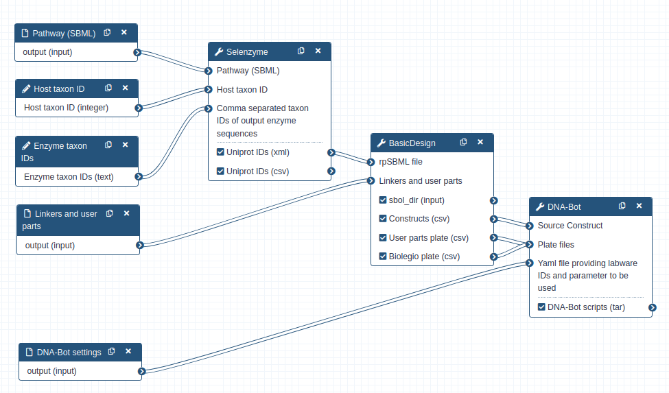
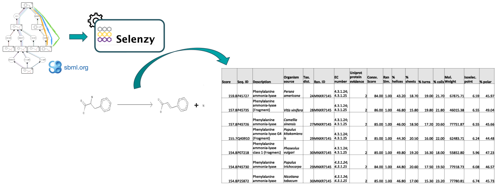
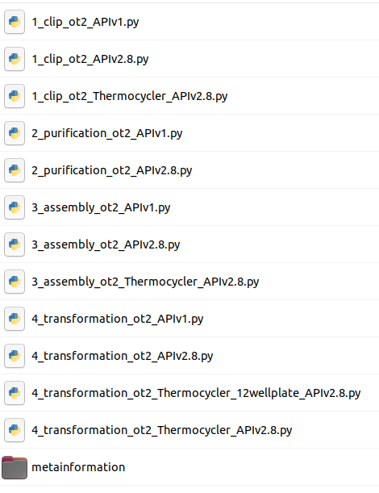
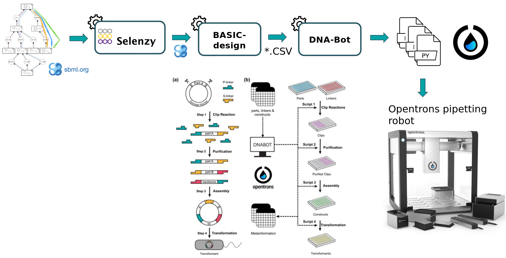

# Introduction


Synthetic biology is a novel engineering discipline which requires computational tools for the design of metabolic pathways for the production of chemicals such as SynBioCAD portal which is the first Galaxy set of tools for synthetic biology and metabolic engineering (). 

In this tutorial, we will use a set of tools from the **Genetic Design - BASIC Assembly Workflow** (https://galaxy-synbiocad.org) which will enable you to design plasmids implementing metabolic pathways for the bioproduction of lycopene in _E.coli_ (one of the preferred host cell for microbial biochemicals production).

Lycopene is a potent antioxidant and has been widely used in the fields of pharmaceuticals, nutraceuticals, and cosmetics. It's widely found in fruits including tomato, watermelon, guava, and papaya but the extraction method of lycopene from these natural sources is expensive, complicated and cannot match the large market demand.

To address this demand, synthetic biology and metabolic engineering have been employed to develop microbial cell factories (e.g. _E.coli_ strains) for lycopene production.

To design plasmids encoding lycopene bioproducing pathways, we will use the BASIC assembly method (as described in ) which relies on orthogonal linkers and type IIs restriction enzyme cleavage to provide a robust and accurate assembly of DNA parts into plasmid constructs. From these construct definition, the workflow will generate scripts enabling the automatic build of the plasmids as well as the transformation of strains using an Opentrons liquid handler robot. After downloading these scripts onto a computer connected to an Opentrons, one can perform the automated construction of the plasmids at the bench.

The workflow scheme we will use is shown below. First, we will run the steps of this workflow individually so as not to neglect the understanding of the intermediate steps as well. Then, we will run the workflow automatically so that it itself retrieves the outputs from the previous step and gives them as input to the next tool.



> <agenda-title></agenda-title>
>
> In this tutorial, we will cover:
>
> 1. TOC
> {:toc}
>
{: .agenda}

# Data Preparation

First we need to upload and prepare the following inputs to analyze:

- One SBML (Systems Biology Markup Language) file modeling a heterologous pathway producing lycopene such as those produced by the Pathway Analysis Workflow (https://galaxy-synbiocad.org).

- The `parts_for_lycopene.csv` file listing the parts to be used (linkers, backbone and promoters) in the constructions.

- Two YAML files providing two examples of settings, i.e. providing the identifiers of the laboratory equipment and the parameters to be used in the Opentrons scripts.

## Get data

> <hands-on-title>Data upload</hands-on-title>
>
> 1. Create a new history for this tutorial named *Genetic Design - BASIC Assembly Analysis*.
> 2. Import the input files from [Zenodo]({{ page.zenodo_link }}):
>
>    ```
>    https://zenodo.org/api/files/f58fe126-0ca2-4ca5-bc4b-0063f3a8951c/dnabot_london_settings.yaml
>    https://zenodo.org/api/files/f58fe126-0ca2-4ca5-bc4b-0063f3a8951c/dnabot_paris_settings.yaml
>    https://zenodo.org/api/files/f58fe126-0ca2-4ca5-bc4b-0063f3a8951c/parts_for_lycopene.csv
>    https://zenodo.org/api/files/f58fe126-0ca2-4ca5-bc4b-0063f3a8951c/rp_002_0011.xml
>    ```
>
>    
>
> 3. Rename the datasets if you want to shorten the file names.
>    Rename `rp_002_0011.xml` to `pathway.xml`.
>
>    
>
{: .hands_on}

# Find enzymes using **Selenzyme**

At first, a pathway generated by the **Pathway Analysis workflow** (https://galaxy-synbiocad.org) is provided as input to the Selenzyme tool (). Selenzyme searches for enzymes corresponding to each reaction of the pathway. It performs a reaction similarity search in the reference reaction database [MetaNetX](https://www.metanetx.org) and outputs an updated SBML file annotated with the enzyme UniProt IDs.
The tool provides several scores that can be combined in order to define an overall score. Scores are given for reaction similarity, conservation based on a multiple sequence alignment, phylogenetic distance between source organism and host, and additional scores calculated from sequence properties as shown in the example bellow.



> <hands-on-title>Annotate enzymes with Uniprot IDs from a SBML pathway</hands-on-title>
>
> 1. Run  with the following parameters:
>    -  *"Pathway (SBML)"*: Select `pathway.xml` from your current history
>    - In *"Advanced Options"*:
>        - *"Host taxon ID"*: Leave the default value `83333`. This stands for using E. coli as the chassis host.
>        - *"Comma separated taxon IDs of output enzyme sequences"*: *enter `553` which is the taxon ID of the Pantoea ananatis strain from which we want to extact enzymes*
>
>    > <comment-title></comment-title>
>    >
>    > This tool will produce annotated pathway with UniProt IDs in XML and CSV format.
>    {: .comment}
>
{: .hands_on}

> <question-title></question-title>
>
> 1. How are identified the enzyme in the SBML file?
>
> > <solution-title></solution-title>
> >
> > 1. Enzyme are identified by their UniProt ID
> >
> {: .solution}
>
{: .question}

# Generate potential constructs from SBML file using **BasicDesign**

Second, the BasicDesign tool extracts enzyme IDs contained in the SBML (previously produced by Selenzyme) to generate genetic constructs compliant with the BASIC assembly approach. It uses as input an SBML file annotated with enzyme IDs for each reaction, and optionally one or several CSV files listing by their IDs the linkers, the promoters and the backbone used (`parts_for_lycopene.csv`). Example, below:

*id,type,sequence,comment*\
*L1,neutral linker,,*\
*L2,neutral linker,,*\
*L3,neutral linker,,*

For **linkers**, the type annotation should be one of *neutral linker*, *methylated linker*, *peptide fusion linker* or *RBS linker*. For **user parts**, type should be one of *backbone* or *constitutive promoter*. Other type will raise a warning and will be omited.

BasicDesign converts the SBML file into CSV files describing the DNA-parts to be included into each construct (in an operon format, i.e. with only one promoter) and enumerate possible combinations of promoters, RBSs and enzymes into constructs. Depending on the numbers of enzymes per reaction, of RBSs and promoters available, and whether or not to perform CDS permutation within the operon, the number of constructs may vary.

> <hands-on-title>Generate genetic constructs from the previously annotated SBML file</hands-on-title>
>
> 1. Run  with the following parameters:
>    -  *"rpSBML file": `uniprot_ids` (output of **Selenzyme**  in xml format)*
>    - In *"Advanced Options"*:
>        -  *"Linkers and user parts": Select `parts_for_lycopene.csv` from your current history in csv format*
>
>    > <comment-title></comment-title>
>    >
>    > This tool will output a CSV constructs file (listing the constructs to be built), where each row corresponds to one construct and consists of a sequence of BASIC linker and DNA part IDs. The two other outputted CSV files provide the plate coordinates of (i) the BASIC linkers and (ii) the DNA-parts that the user will need to provide. Additionally, one SBOL (Synthetic Biology Open Language) file is produced for each construct generated. These files can be downloaded and visualized using online tools such as [VisBOL](https://visbol.org/).
>    {: .comment}
>
{: .hands_on}

> <question-title></question-title>
>
> 1. How many constructs did you get ?
>
> > <solution-title></solution-title>
> >
> > 1. 88 construct designs were generated in CSV and SBOL format.
> >
> {: .solution}
>
{: .question}

# Generating python scripts using **DNA-Bot**

 In the last step, the DNA-Bot tool () reads the list of constructs (previously produced by BasicDesign) and the DNA-parts position on the source plates and generates a set of python scripts to drive an Opentrons liquid handling robot for building the the plasmids. Optional parameters can be set by the user to define the plastic labwares to be used, and set protocol parameters such as washing or incubation times for purification step (`dnabot_paris_settings.yaml`).

> <hands-on-title>Generate DNA Bot python scripts</hands-on-title>
>
> 1. Run  with the following parameters:
>    -  *"Source Construct"*: `Constructs` (output of **BasicDesign** )
>    -  *"Plate files"*: Select these two files: `User parts plate` (output of **BasicDesign** ), `Biolegio plate` (output of **BasicDesign** ) with **Multiple datasets**.
>    - In *"Advanced Options"*:
>        -  *"Yaml file providing labware IDs and parameter to be used (Optionally)"*: Select either `dnabot_paris_settings.yaml` or `dnabot_london_settings.yaml` from your history)
>
>
>
>    > <comment-title></comment-title>
>    >
>    > This tool will output DNA-Bot scripts in tar format. You need to download it and decompress the archive. After downloading these scripts onto a computer connected to an Opentrons, one can perform the automated construction of the plasmids at the bench. Additional metadata meaningful to keep track of parameters are also outputted by the tool.
>    > 
>    > 
>    {: .comment}
{: .hands_on}

> <question-title></question-title>
>
> 1. Looking at the scripts names, can you figure out the main steps of DNA-Bot ?
>
> > <solution-title></solution-title>
> >
> > 1. DNA-Bot outputs python scripts that implement the 4 assembly steps: clip reactions, purification, assembly and strain transformation. In short, the **Clip reactions** step prepares the mixes for the ligation of the individual DNA parts with the linkers; the **Purification** step purifies the linker-ligated DNA parts using magnetic beads and the Opentrons magnetic module; the **Assembly** step mixes the DNA purified parts to build the final constructs; while the **Transformation** step transforms the chassis micro-organism with the plasmid and inoculates onto agar.
> >
> {: .solution}
>
{: .question}

# Run the **Genetic Design - BASIC Assembly Workflow**

In this section, you can run the Genetic Design - BASIC Assembly Workflow more easily and fastly following these instructions:

> <hands-on-title>Execute the entire workflow in one go.</hands-on-title>
>
> 1. Import your **Genetic Design - Basic Assembly Workflow** by uploading the [**workflow file**](https://training.galaxyproject.org/training-material/topics/synthetic-biology/tutorials/basic_assembly_analysis/workflows/Genetic_Design_BASIC_Assembly.ga).
>
>    
>
> 2. Click on *Workflow* on the top menu bar of Galaxy. You will see **Genetic Design - Basic Assembly Workflow**
> 3. Click on the  (*Run workflow*) button next to your workflow
> 4. Provide the workflow with the following parameters:
>    -  *"Pathway (SBML)":* Select `pathway.xml` from your current history
>    - *"Host taxon ID"*: Leave the default value `83333`. This stands for using E. coli as the chassis host.
>    - *"Comma separated taxon IDs of output enzyme sequences"*: enter `553` which is the taxon ID of the Pantoea ananatis strain from which we want to extact enzymes
>    -  *"Linkers and user parts": Select `parts_for_lycopene.csv` from your current history in csv format*
>    -  *"DNA-Bot settings (Optionally)"*: Select either `dnabot_paris_settings.yaml` or `dnabot_london_settings.yaml` from your history)
>
>    > <comment-title></comment-title>
>    >
>    > All the outputs will be automatically generated and identical to the previous ones. 
>    {: .comment}
{: .hands_on}


