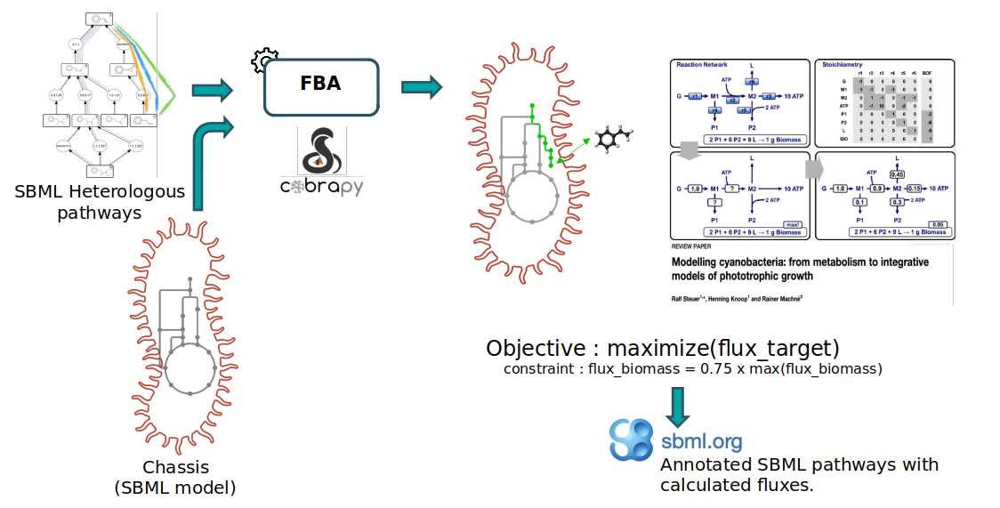
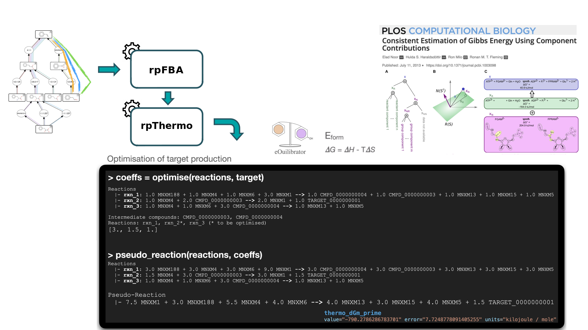
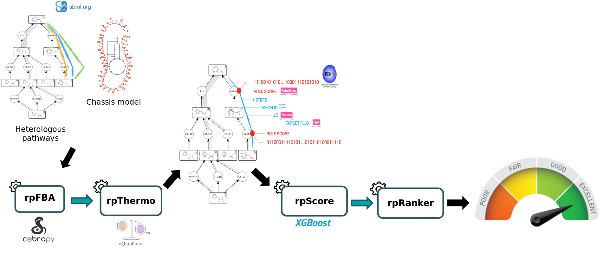

# Introduction
{:.no_toc}

Progress in synthetic biology is enabled by powerful bioinformatics tools such as those aimed to design metabolic pathways for the production of chemicals. These tools are available in SynBioCAD portal which is the first Galaxy set of tools for synthetic biology and metabolic engineering ().

In this tutorial, we will use a set of tools from the **Pathway Analysis workflow** which will enable you to evaluate a set of heterelogous pathways previously produced by RetroSynthesis workflow in a chassis organism (E.Coli iML1515). These workflows are available in [Galaxy SynbioCAD platform](https://galaxy-synbiocad.org). The goal is to inform the user as to the theoretically best performing pathways by ranking them based on the four criteria: target product flux, thermodynamic feasibility, pathway length and enzyme availability.

We recommend that you follow the Retrosynthesis tutorial before starting the current tutorial which will enable you to find pathways to synthesize heterologous compounds producing Lycopene in chassis organisms (E.Coli iML1515).

Four main steps will be run using the following workflow:

To rank the computed heterelogous pathways, we need to calculate some metrics. This is why an in-house Flux Balance Analysis (FBA) was developed to calculate the production flux of a given target (Lycopene). The method forces a fraction of its maximal flux through the biomass reaction while optimizing for the target molecule. This is achieved by rpFBA tool.

Secondly, we will use rpThermo tool to compute thermodynamics values (based on Gibbs free energies) for each pathway by using a linear equation system solver to know whether a reaction direction of a pathway is feasible in physiological conditions.

After that, rpScore is used to calculate the enzyme availability score for the chemical transformation where high values favor less promiscuous reaction rules and express better confidence.

Finally, the length of the pathway is taken into consideration where shorter pathways are favored over longer pathways.


Note that we will run the steps of this workflow individually so as not to neglect the understanding of the intermediate steps as well. Then, we will run the workflow automatically so that it itself retrieves the outputs from the previous step and gives them as input to the next tool.

> ### Agenda
>
> In this tutorial, we will cover:
>
> 1. TOC
> {:toc}
>
{: .agenda}

# Data Preparation

First we need to upload and prepare the following inputs to analyze:

- A set of pathways provided in the SBML format (Systems Biology Markup Language) to be ranked, modeling heterologous pathways such as those outputted by the **RetroSynthesis workflow** (available in [Galaxy SynbioCAD platform](https://galaxy-synbiocad.org)).

- The GEM (Genome-scale metabolic models) which is a formalized representation of the metabolism of the host organism (the model is E. coli iML1515), provided in the SBML format.

## Get data

> ###  Hands-on: Data upload
>
> 1. Create a new history for this tutorial named *Pathway Analysis*.
> 2. Import the files from [Zenodo]({{ page.zenodo_link }}) :
>
>    ```
>    https://zenodo.org/api/files/5db78fa1-b8cb-4046-b57c-8a9d00806f42/rp_001_0001.xml
>    https://zenodo.org/api/files/5db78fa1-b8cb-4046-b57c-8a9d00806f42/rp_001_0006.xml
>    https://zenodo.org/api/files/5db78fa1-b8cb-4046-b57c-8a9d00806f42/rp_001_0011.xml
>    https://zenodo.org/api/files/5db78fa1-b8cb-4046-b57c-8a9d00806f42/rp_002_0001.xml
>    https://zenodo.org/api/files/5db78fa1-b8cb-4046-b57c-8a9d00806f42/rp_002_0006.xml
>    https://zenodo.org/api/files/5db78fa1-b8cb-4046-b57c-8a9d00806f42/rp_002_0011.xml
>    https://zenodo.org/api/files/5db78fa1-b8cb-4046-b57c-8a9d00806f42/rp_003_0001.xml
>    https://zenodo.org/api/files/5db78fa1-b8cb-4046-b57c-8a9d00806f42/rp_003_0116.xml
>    https://zenodo.org/api/files/5db78fa1-b8cb-4046-b57c-8a9d00806f42/rp_003_0231.xml
>    https://zenodo.org/api/files/5db78fa1-b8cb-4046-b57c-8a9d00806f42/SBML_Model_iML1515.xml
>    ```
>
>    
>
> 3. Create a list or collection named `Heterologous pathways` and composed of the 9 rpSBML pathways.
>
>    
>
{: .hands_on}

# Compute the target product flux

Firstly, in the RetroSynthesis workflow (available in [Galaxy SynbioCAD platform](https://galaxy-synbiocad.org)), molecules contained within a full SBML model are used to generate heterologous pathways. As a result, the calculated heterologous pathways can easily be merged into the full organism GEM (Genome-scale metabolic models) (E.Coli iML1515), enabling the whole-cell context to calculate the production flux of a given target (Lycopene). The provided model is in SBML format and was previously downloaded from the [BiGG database](http://bigg.ucsd.edu/). 

The FBA (Flux Balance Analysis) method used to calculate the flux is a mathematical approach (as decribed in section Methods in ) which uses the COBRApy package () and proposes 3 different analysis methods (standard FBA, Parsimonious FBA, Fraction of Reaction).

The first two methods are specific to COBRApy package and the last one `Fraction of Reaction` is an in-house analysis method (as decribed in section Methods in ) to consider the potential burden that the production of a target molecule may have on the cell and the impact of the target itself.

The objective of FBA is to simulate the flux of a target while considering this potential burden. Under such simulation conditions, the analysis that returns a low flux may be caused by the starting native compound itself not having a high flux, or the cofactors required having a low flux, while the pathways with high flux would be caused by both the starting compound and the cofactors being in abundance. In either case, bottlenecks that limit the flux of the pathway may be identified and pathways that do not theoretically generate high yields can be filtered out.

We first perform FBA (with COBRApy) for the biomass reaction and record its flux. The upper and lower bounds of the biomass reaction are then set to the same amount, defined as a fraction of its previously recorded optimum (default is 75% of its optimum). This ensures that any further FBA solution would have a fixed biomass production regardless of the conditions set for further analysis.

The method forces a fraction of its maximal flux through the biomass reaction while optimizing for the target molecule, records the flux directly to the SBML file and all changed bounds are reset to their original values before saving the file.



> ###  Comment
>
> Compounds that cannot carry any flux are temporarily removed from the reaction for the FBA evaluation. Such cases can happen due to side substrates or products of predicted reactions that do not match any chassis compound. This enables FBA to consider whole-cell conditions for the theoretical production of the user’s target molecule.
>
{: .details}

> ###  Hands-on: Calculating the flux of a target using Flux Balance Analysis (FBA)
>
> 1. Run  with the following parameters:
>    -  *"Pathway (rpSBML)"*: Select `Heterologous pathways` (Input dataset collection) from your current history.
>    -  *"Model (SBML)"*: Select `SBML_Model_iML1515.xml` (Input dataset) from your current history.
>    - *"SBML compartment ID"*: Leave the default value `c`.
>
>    > ###  Choose a compartment corresponding to your model
>    >
>    > You can specify the compartment from which the chemical species were extracted.
>    > The default is `c`, the BiGG code for the cytoplasm.
>    {: .comment}
>
>    - *"biomass reaction ID"*: Specify the biomass reaction ID that will be restricted in the "fraction" simulation type `R_BIOMASS_Ec_iML1515_core_75p37M`.
>
>    > ###  How to select the Biomass reaction ID ?
>    >
>    > The biomass reaction ID objective is extracted from the current model *E.Coli iML1515*. You can search the term `biomass` in your XML model and pick the ID where `core` is noticed.
>    {: .comment}
>
>    - *"Constraint based simulation type"*: `Fraction of Reaction`
>
{: .hands_on}

> ###  Questions
>
> 1. What is the FBA score for `rp_003_0001` pathway ?
>
> > ###  Solution
> >
> > 1. View the SBML rp_003_0001 file and look for `fba_fraction` value in `<groups:listOfGroups>` section: value= `0.23693089430893874`.
> >
> {: .solution}
>
{: .question}

## Compute thermodynamics values

Thermodynamic analysis were performed to every chemical species involved in each reaction to calculate the Gibbs free energy of reactions and heterologous pathways. We use eQuilibrator () to calculate the formation energy either using public database ID reference (when recognized with the tools internal database) or by decomposing the chemical structure and calculating its formation energy using the component contribution method.

Thereafter, the species involved in a reaction are combined (with consideration for stoichiometry) and the thermodynamic feasibility of the pathway is estimated by taking the sum of the Gibbs free energy of each participating reaction (See Thermodynamics in Methods section for further details: ).



> ###  Hands-on: Compute thermodynamics values for each pathway using rpThermo tool
>
> 1.  with the following parameters:
>    -  *"Input File"*: `pathway_with_fba` (output of **Flux balance analysis** )
>
>    > ###  Comment
>    >
>    > The tool takes as input pathways in SBML format and returns annotated pathways (with thermodynamics information for each reaction) in SBML format too.
>    {: .comment}
>
{: .hands_on}

> ###  Questions
>
> 1. What is the thermodynamic score attributed to the reaction with the following *EC (Enzyme Commission) number* *2.5.1.29* for `rp_001_0001` pathway ?
>
> > ###  Solution
> >
> > 1. View the SBML rp_001_0001 file and search the reaction ID `2.5.1.29` contained in `<listOfReactions>`. The corresponding value is indicated in `thermo_dGm_prime` field : `-242.348`.
> >
> {: .solution}
>
{: .question}

## Compute the enzyme availability score for the chemical transformations

Enzyme availability for the chemical transformation is also taken into consideration, where high values favor less promiscuous reaction rules and express better confidence. The method used to compute enzyme availability score is described in the Methods section (cf. Retrosynthesis from target to chassis: ).

rpScore tool compute a global score from the previous annotated pathways. This score is calculated from a learning process based on features describing the pathway (thermodynamic feasibility, target flux with fixed biomass, length) and the reactions within the pathway (reaction SMARTS (Canonical SMiles ARbitrary Target Specification), Gibbs free energy, enzyme availability score).

> ###  Hands-on: Calculate the enzyme availability score using rpscorer tool
>
> 1.  with the following parameters:
>    -  *"Pathway (rpSBML)"*: `pathway_with_thermo` (output of **Thermo** )
>
>    > ###  Comment
>    >
>    > This tool will print out the probability for the pathway to be a valid pathway in SBML format.
>    {: .comment}
>
{: .hands_on}

> ###  Questions
>
> 1. What is the computed global score for `rp_001_0001` pathway ?
>
> > ###  Solution
> >
> > 1. View the SBML file `rp_001_0001` and search for `global_score` : value=`0.975147980451584`.
> >
> {: .solution}
>
{: .question}

## Rank annotated pathways

Finally, **rpRanker** ranks the previous set of heterologous pathways, based on their length, to reveal what are the most likely pathways to produce the target molecule (*Lycopene*) in an organism of choice (*E.Coli*). Shorter pathways are favored over longer pathways.

> ###  Hands-on: Rank annotated pathways using rpRanker tool
>
> 1.  with the following parameters:
>    -  *"Pathways"*: `scored_pathway` (output of **Score Pathway** )
>
>    > ###  Comment
>    >
>    > This tool will output a CSV file wich contains the pathway IDs and their corresponding score.
>    {: .comment}
>
{: .hands_on}


> ###  Questions
>
> 1. What are the 3 top ranked pathways ?
>
> > ###  Solution
> >
> > 1. `002_0011`, `001_0011` ,`002_0006`.
> >
> {: .solution}
>
{: .question}

# Run the **Pathway Analysis Workflow**

In this section, you can run the Pathway Analysis Workflow more easily and fastly following these instructions:

> ###  Hands-on: Execute the entire workflow in one go.
>
> 1. Import your **Pathway Analysis Workflow** by uploading the [**workflow file**](https://training.galaxyproject.org/training-material/topics/synthetic-biology/tutorials/basic_assembly_analysis/workflows/main_workflow.ga).
>
>    
>
> 2. Click on *Workflow* on the top menu bar of Galaxy. You will see **Pathway Analysis Workflow**
> 3. Click on the  (*Run workflow*) button next to your workflow
> 4. Provide the workflow with the following parameters:
>    -  *"Heterologous pathways":* Select `Heterologous pathways` (Input dataset collection) from your current history.
>    -  *"Chassis where to produce target from"*: Select `SBML_Model_iML1515.xml` (Input dataset) from your current history.
>    - *"Cell compartment ID"*: Enter value `c`.
>    - *"biomass reaction ID"*: Specify the biomass reaction ID that will be restricted in the "fraction" simulation type `R_BIOMASS_Ec_iML1515_core_75p37M`.
>
>    > ###  Comment
>    >
>    > All the outputs will be automatically generated and identical to the previous ones. 
>    {: .comment}
{: .hands_on}

# Conclusion
{:.no_toc}

To select the best pathways for producing the Lycopene in *E.Coli*, some metrics have to be computed: Flux balance analysis, thermodynamics, pathway length, and reaction SMARTS. This is achieved using the tools from the following pathway analysis workflow.

