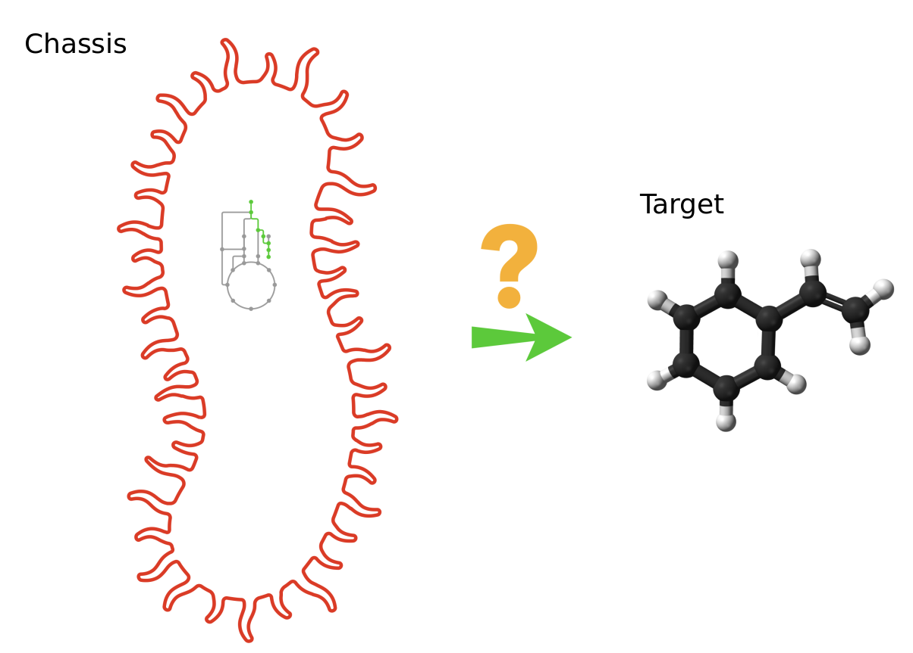
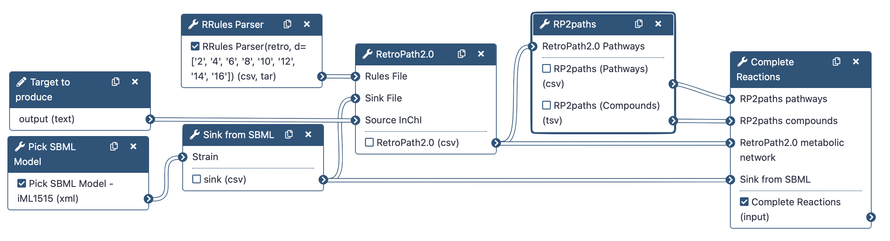

# Introduction

[Galaxy-SynBioCAD portal](https://galaxy-synbiocad.org/) is the first toolshed for synthetic biology, metabolic engineering, and industrial biotechnology (). It provides a set of Retrosynthesis tools aimed at finding pathways to synthesize heterologous compounds in chassis organisms (**RetroRules** (), **RetroPath2.0** (), **RP2Paths**, **rpCompletion**).

Retrosynthesis is a concept originally proposed for synthetic chemistry where chemists have to work backwards, starting from a target product to reach precursors that are endogenous to the chassis (host organism).

Typically, the target compound, also named “source compound” is the compound of interest one wishes to produce, while the precursors are usually compounds that are natively present in a chassis strain.

In this tutorial, we want to obtain the reactions producing the lycopene (source) into the iML1515 _Escherichia Coli_ strain (chassis).

To do that, we will use the following RetroSynthetis Workflow composed of 3 key steps.

First, we aggregate the metabolites present in the chassis and download reaction rules.

Then, RetroPath2.0 generates feasible metabolic routes between a collection of chemical species contained within a GEM SBML (Systems Biology Markup Language) file of the selected organism, a target molecule that the user wishes to produce, and reaction rules extracted from RetroRules.

Lastly, the metabolic network is then deconstructed into individual pathways using RP2paths and rpCompletion takes those individual metabolic pathways to filter them (duplicated pathways are removed), splits them into sub-pathways by adding the appropriate cofactors, and finally converted them to SBML files.

Note that we will run the steps of this workflow individually so as not to neglect the understanding of the intermediate steps as well. Then, we will run the workflow automatically so that it itself retrieves the outputs from the previous step and gives them as input to the next tool.

> <agenda-title></agenda-title>
>
> In this tutorial, we will cover:
>
> 1. TOC
> {:toc}
>
{: .agenda}

# Data Preparation

RetroSynthesis workflow will be run with the following inputs:

1. The International Chemical Identifier (InChI) of the compound of interest to produce,
2. The structure of metabolites present in the chosen chassis (E. coli),
3. Reaction rules (generated by RRules Parser node that calls RetroRules).

The data used are pretty straight forward to obtain.  
Firstly, we download an SBML model, then we select all sinks to use into the RetroPath2.0 software from this model.  
Lastly, we request from RetroRules all possible reactions to find a chemical reaction cascade that produces the target.

## Download a model

> <hands-on-title>Select a model.</hands-on-title>
>
> 1. Run  with the following parameters:
>    -  *"Strain"*: `Escherichia coli str. K-12 substr. MG1655 (iML1515)`
>
>    > <comment-title>What does this tool do?</comment-title>
>    >
>    > The selected SBML model is downloaded from the [BiGG database](http://bigg.ucsd.edu/).
>    {: .comment}
>
{: .hands_on}

> <question-title></question-title>
>
> 1. What is the file format of the model?
>
> > <solution-title></solution-title>
> >
> > 1. The SBML is based on XML.
> >
> {: .solution}
>
{: .question}

## Create a sink file from the SBML model

> <hands-on-title>Generate a sink file.</hands-on-title>
>
> 1. Run  with the following parameters:
>    -  *"Strain"*: `sbml_model` (output of **Pick SBML Model** )
>    - *"SBML compartment ID"*: `c`
>
>    > <comment-title>Choose a compartment corresponding to your model</comment-title>
>    >
>    > You can specify the compartment from which the tool will extract the chemical species.
>    > The default is `c`, the BiGG code for the cytoplasm.
>    > If the user wishes to upload an SBML file from another source, then this value must be changed.
>    {: .comment}
{: .hands_on}

> <question-title></question-title>
>
> 1. What this tool does?
> 2. How many columns are in the file?
>
> > <solution-title></solution-title>
> >
> > 1. This tool creates a friendly CSV file format that can be used as sink input for RetroPath2.0.
> > 2. Click on , you should see 2 columns: "Name" and "InChi"
> >
> {: .solution}
>
{: .question}

## Retrieve the reaction rules

> <hands-on-title>Generate a file with all reactions.</hands-on-title>
>
> 1. Run  with the following parameters:
>    - *"Rule Type"*: `retro`
>    - *"Select the diameters of the reactions rules"*: `2`, `4`, `6`, `8`, `10`, `12`, `14` and `16`
>    -  *"Compress output"*: `no`
>
>    > <comment-title>How to choose a right diameter ?</comment-title>
>    >
>    > The diameter of the sphere including the atoms around the reacting center.
>    > The higher is the diameter, the more specific are the rules.
>    {: .comment}
{: .hands_on}

> <question-title></question-title>
>
> 1. Does a low diameter select specific rules?
> 2. How many rows are in the file?
>
> > <solution-title></solution-title>
> >
> > 1. No, a low diameter selects more unspecific rules.
> > 2. More than 200 thousands!
> >
> {: .solution}
>
{: .question}

# Run the Retrosynthesis algorithm

RetroPath2.0 is an open-source tool for building retrosynthesis networks by combining reaction rules and a retrosynthesis-based algorithm to link the desired target compound to a set of available precursors.
The RetroPath2.0 tool is freely available at [myExperiment](https://www.myexperiment.org/workflows/4987.html).
The retrosynthesis network is outputted as a CSV file providing reactions in the reaction SMILES format and chemicals in both SMILES and InChI formats along with other information like the score for each reaction.

## Launch **RetroPath2.0**

> <hands-on-title>Build a reaction network</hands-on-title>
>
> 1. Run  with the following parameters:
>    -  *"Rules File"*: `out_rules` (output of **RRules Parser** )
>    -  *"Sink File"*: `sink` (output of **Sink from SBML** )
>    - *"InChI type"*: `By string`
>        - *"Source InChI"*: InChI=1S/C40H56/c1-33(2)19-13-23-37(7)27-17-31-39(9)29-15-25-35(5)21-11-12-22-36(6)26-16-30-40(10)32-18-28-38(8)24-14-20-34(3)4/h11-12,15-22,25-32H,13-14,23-24H2,1-10H3/b12-11+,25-15+,26-16+,31-17+,32-18+,35-21+,36-22+,37-27+,38-28+,39-29+,40-30+
>
>    > <tip-title>InChi format</tip-title>
>    >
>    > Be careful, you must have `InChi=` in front of your InChi key.
>    {: .tip}
{: .hands_on}

> <question-title></question-title>
>
> 1. What is the file format produce by RetroPath2.0?
>
> > <solution-title></solution-title>
> >
> > 1. A csv file.
> >
> {: .solution}
>
{: .question}

# Enumerate pathways with **RP2paths**

The RetroPath2.0 algorithm produces a reaction network, we want to have one pathway per file in SBML format.
We need to split the network and perform some adjustments to these pathways.

## Split the network
> <hands-on-title>Build a reaction network</hands-on-title>
>
> 1. Run  with the following parameters:
>    -  *"RetroPath2.0 Pathways"*: `Reaction_Network` (output of **RetroPath2.0** )
>
>    > <comment-title>Principle</comment-title>
>    >
>    > Extracts the set of pathways that lies in a metabolic space file output by the RetroPath2.0 workflow
>    {: .comment}
{: .hands_on}

> <question-title></question-title>
>
> 1. Why producing multiple pathways?
> 2. How many outputs are produced?
>
> > <solution-title></solution-title>
> >
> > 1. One network could represent several pathways, so several solutions.
> > 2. Two outputs are produced: one corresponding to the metabolites, the other one corresponding to the pathways.
> >
> {: .solution}
>
{: .question}

## Refine reactions

> <hands-on-title>Refine reactions</hands-on-title>
>
> 1. Run  with the following parameters:
>    -  *"RP2paths pathways"*: `master_pathways` (output of **RP2paths** )
>    -  *"RP2paths compounds"*: `compounds` (output of **RP2paths** )
>    -  *"RetroPath2.0 metabolic network"*: `Reaction_Network` (output of **RetroPath2.0** )
>    -  *"Sink from SBML"*: `sink` (output of **Sink from SBML** )
>
>    > <comment-title>Principle</comment-title>
>    >
>    > Each reaction rule can correspond to several template reactions, the task here is to enumerate the different possible transformations according to these templates.
>    > Because the RetroRules reaction rules consider only one substrate at a time, some compounds are by purpose omitted: the task here is to complete the predicted reactions by putting back these omitted compounds (mostly  cofactors).
>    > The node converts each predicted pathway to distinct SBML files.
>    {: .comment}
{: .hands_on}

> <question-title></question-title>
>
> 1. How many solutions are found?
> 2. In which file format are the pathways?
> 2. Do these pathways are a good solution?
>
> > <solution-title></solution-title>
> >
> > 1. We have 9 candidates.
> > 2. The pathways are represented in a SBML format.
> > 3. It's a trap! We don't know if they represent a good solution. We need to evaluate them.
> >
> {: .solution}
{: .question}

# Run the **RetroSynthesis Workflow**

In this section, you can run the RetroSynthesis Workflow more easily and fastly following these instructions:

> <hands-on-title>Execute the entire workflow in one go.</hands-on-title>
>
> 1. Import your **RetroSynthesis workflow** by uploading the [**workflow file**](https://training.galaxyproject.org/training-material/topics/synthetic-biology/tutorials/basic_assembly_analysis/workflows/RetroSynthesis.ga).
>
>    
>
> 2. Click on *Workflow* on the top menu bar of Galaxy. You will see **RetroSynthesis** workflow.
> 3. Click on the  (*Run workflow*) button next to your workflow
> 4. Provide the workflow with the following parameters:
>    - *"Target to produce":* Provide the following Inchi source:  `InChI=1S/C40H56/c1-33(2)19-13-23-37(7)27-17-31-39(9)29-15-25-35(5)21-11-12-22-36(6)26-16-30-40(10)32-18-28-38(8)24-14-20-34(3)4/h11-12,15-22,25-32H,13-14,23-24H2,1-10H3/b12-11+,25-15+,26-16+,31-17+,32-18+,35-21+,36-22+,37-27+,38-28+,39-29+,40-30+`
>    - *"Strain":* Select `Escherichia coli str. K-12 substr. MG1655 (iML1515)` SBML model.
>
>    > <comment-title></comment-title>
>    >
>    > All the outputs will be automatically generated and identical to the previous ones. 
>    {: .comment}
{: .hands_on}

# Conclusion

In this tutorial we produced candidates pathways to produce Lycopene in an Esherichia Coli strain.
Three main steps were involved:
1. Preprocessing data
2. Run Retrosynthesis algorithm with RetroPath2.0
3. Enumerate all solutions found by RetroPath2.0
