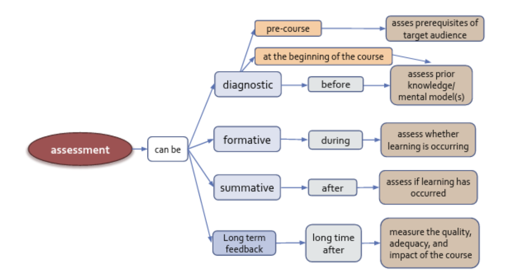
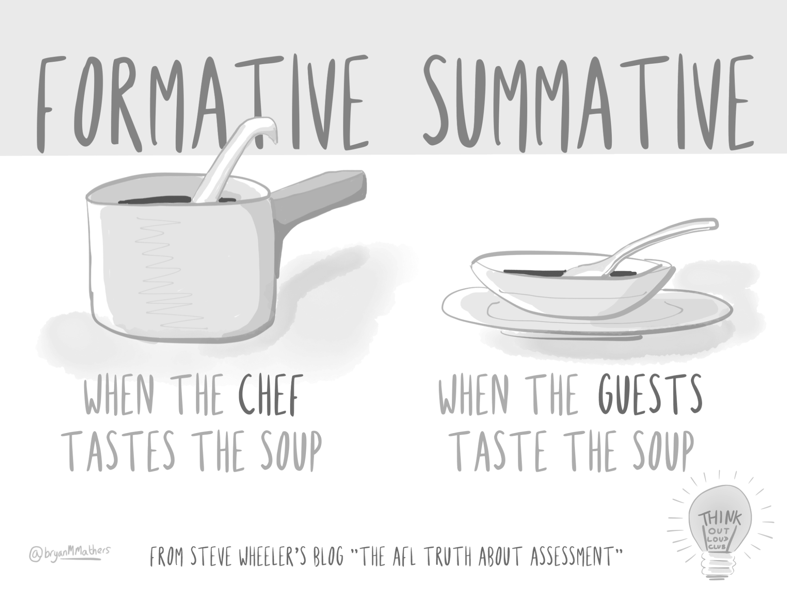

# Introduction
{:.no_toc}

* **Assessment**: evaluation or estimation of the nature, quality, or ability of someone or something
* **Feedback**: integrate the output of the assessment in the learning process

Teaching goal for this session is to develop an understanding of **different types of feedback**,when to give and receive feedback, and for which **purpose**.

By the end of this session, you will be able to:
* **Describe** the differences between formative and summative assessment
* **Tell** why frequent feedback is important
* **List** and **describe** a few techniques for formative feedback

### Assessment and feedback in the Nicholls process

[Via et al, Course design: Considerations for trainers – a Professional Guide, 2020](https://f1000research.com/documents/9-1377)

## Assessments

### Categorizing assessment

There are different types of assessment and different ways that we can categorize them.
1. **Pre-course assessment** (before the course) - verify the target audience of the course
2. **Preventive assessment** (beginning of the course) - final adjustments of the course to the reality of the participants
3. **Formative assessment** (during the course) - pilot in real time if learning is taking place
4. **Summative assessment** (right after the course) - measure and evaluate the knowledge and skills acquired
5. **Strategic evaluation** (after the course, long time after the course) - measure the adequacy, quality and impact of the course

### Diagnostic Assessment

> ###  Break-out room discussion  (15 min)
>
> Split into groups of 4, depending on the number of participants.
>
> Discuss how you could collect information from learners at the beginning of a course or lesson and how you can use it.
>	* Write it in a notebook and discuss with the rest of the group.
{: .hands_on}

**Anonymous questionnaires **allow to have an idea of the level of knowledge of the whole group of learners.

**Non-anonymous **and personal questionnaires allow to find out if the learner has a necessary pre-required knowledge. in the negative case indicate an appropriate teaching choice to palliate this lack.

### Formative and summative assessment, when to use, purpose

Formative assessment takes place **during** teaching and learning. Its purpose is to help both instructors and learners to become aware of what the focus should be. Its purpose is to **improve the quality of student learning**, _not_ to provide evidence for evaluating or grading students.

#### Summative assessment

1. Aligned to LOs
    * to levels of complexity
    * to what you taught
    * to the level you taught it
2. Objective
3. Feasible

#### Formative assessment

Formative assessment / feedback can be used to collect information about learners':

* prior knowledge
    * which knowledge gaps need to be filled before moving on
* mental models
    * whether their mental models are correct
* goals and objectives
    * if learners goals and objectives are aligned to the course's goals and outcomes
* frequent mistakes
    * which types of mistakes need special attention

### Collecting formative assessment

> ###  Break-out room discussion  (10 min)
>
> Split into groups of 4, depending on the number of participants.
>
> Discuss how you could collect information on learners’
>	* mental models
>   * goals and objectives
>   * frequent mistakes
> For each, write an example.
{: .hands_on}

### Examples of formative assessment to collect data from learners

* Type of assessments used during this course
    * Questionnaires
    * Instant feedbacks or minute cards
    * Multiple Choice Question (MCQ)
* Tools
    * Shared notes
        * Silent time for free writing, answering
        * +1 to answers
        * Open questions
    * Google form as post-its
    * [Mentimeter](https://www.mentimeter.com/)
    * [Socrative](https://www.socrative.com/)

#### Multiple Choice Questions and mental models

> ###  Multiple Choice Questions and mental models  (5 min)
>
>   * Look at this example of a MCQ
>       * Q: What is 27+15 ?
>       * Possible answers
>           * 42
>           * 32
>           * 312
>           * 33
>       * Correct answer:42, but each of the other answers provides valuable insights
>   * Choose one wrong answer
>   * Write which misconception is associated with that wrong answer
> >  Discussion
> > Have a more in-depth discussion on the challenges and advantages in constructive effective MCQ exercises.
> > {: .tip}
{: .hands_on}

### Many possible ways for the formative assessments

* Instant feedback
    * Hand / Fist of five
    * Minute cards
        * Idea
            * Green: _Name one positive thing about the workshop so far_
            * Red: _Name one thing about the workshop that could be improved_
        * How to do it?
            * Sticky note
            * Google form
            * Anonymous answer to shared notes
* Group activities
    * Idea
        * Solve problems in groups
        * Do exercises in front of the class
        * Asking to describe the strategy they would adopt to solve a problem
    * How to do it?
        * F2F
        * Breaking rooms: Speaking or written in chat
        * Dedicated channels in chat tools
    * Asking questions to learners and getting responses orally;
    * Asking them to describe the strategy they would adopt to solve a problem;
    * Asking them to solve a problem in groups, or individually but in front of the class;
    * Using brainstorming and discussions;
    * Providing diagnostic questionnaires;
* Shared notes
    * Idea
        * Collaborative note taking
        * Output of group activities
        * Exercises
        * Opinions, ideas, comments, thoughts
        * Questions, answers
    * Tools
        * Google docs
        * Etherpad
        * HackMD
* Asking questions & discussions
    * Asking questions to learners and getting responses orally;
* Brainstorming & concept maps
    * From wikipedia: Brainstorming is a [group creativity technique](https://en.wikipedia.org/wiki/Creativity_technique) by which efforts are made to find a conclusion for a specific problem by gathering a list of ideas spontaneously contributed by its members.
    * In other words, brainstorming is a situation where a group of people meet to generate new ideas and solutions around a specific domain of interest by removing inhibitions. People are able to think more freely and they suggest as many spontaneous new ideas as possible. All the ideas are noted down without criticism and after the brainstorming session the ideas are evaluated.
    * Brainstorming should address a specific question; sessions addressing multiple questions are inefficient.
    * The brainstorming technique can be used to build a concept map as a group.
* Self-evaluation & peer-evaluation

#### How frequent should be formative feedback

> ###  Self-reflect  (5 min)
>
> Think about this session: how many feedback opportunities have you had so far?
>
> >  Get feedback often
> > In this tutorial so far, there were at least 3 feedback opportunities
> > {: .tip}
{: .hands_on}

Formative assessment should be frequent
* Ideally every 5 min
* At least every 10-15 min
* Attention span: 10-15 min
* Refocus attention

## Dealing with feedback

#### Feedback is hard

* Humans focus more on negative feedback than on positive (you are not alone)
* Breath deeply
* Try to see the point in the criticism, learn from it
* Don’t take it personally

Trainees feedback should be considered along other forms of quality evidence:
* Review what they have effectively learned (in exams)
* Consider your own experience of teaching
* Discuss with colleagues and friends
* Look at the feedback from past sessions of the same course
* Look at the response rates
* Look at the counter examples (contradictions)
* Look at the repetitive patterns (not at only one single answer)

#### Learn and teach others how to give good feedback

* One positive / One negative
* One up / one down

## Combining the 4 sessions

⏰ 10 min

#### Six strategies for effective learning

1. Spaced practice: Creating a study schedule that spreads study activities out over time
2. Interleaving: Switching between topics while studying
3. Elaboration: Asking and explaining why and how things work
4. Concrete examples: When studying abstract concepts, illustrating them with specific examples
5. Dual coding: Combining words with visuals
6. Retrieval practice: Bringing learned information to mind from long term memory

#### 7 evidence-based learning principles

* **Principle P1: **Students' **prior knowledge** can help or hinder learning.
* **Principle P2: **How students **organise knowledge** influences how they learn and apply what they know.
* **Principle P3: **Students **motivation** determines, directs and sustains what they do learn.
* **Principle P4: **To develop mastery, students must acquire **component skills**, practice **integrating** them, and  know when to **apply** what they have learned
* **Principle P5: Goal-directed** practice coupled with **targeted feedback** enhances the quality of students' learning
* **Principle P6: **Students' current level of development interacts with the **social, emotional, and intellectual climate** of the course to impact learning
* **Principle P7: **To become self-directed learners, students must learn to **monitor and adjust **their approaches to learning.

