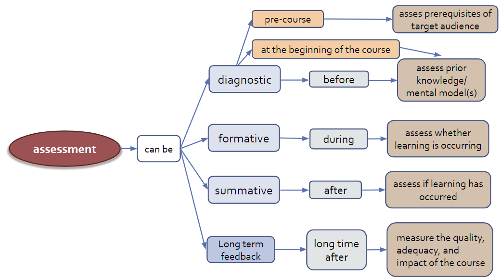
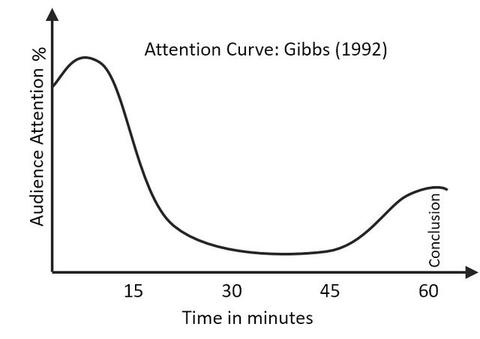
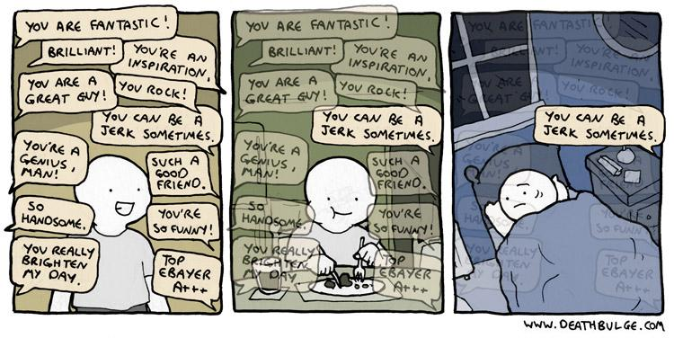
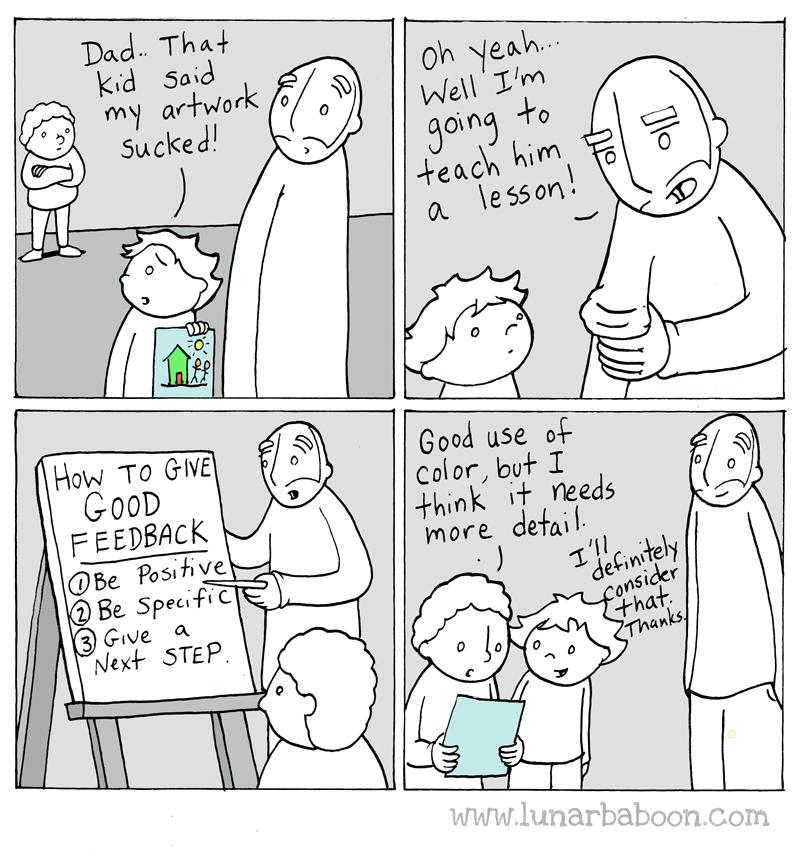

# Introduction

* **Assessment**: evaluation or estimation of the nature, quality, or ability of someone or something
* **Feedback**: integrate the output of the assessment in the learning process

Teaching goal for this session is to develop an understanding of **different types of feedback**,when to give and receive feedback, and for which **purpose**.
By the end of this session, you will be able to:
* **Describe** the differences between formative and summative assessment
* **Tell** why frequent feedback is important
* **List** and **describe** a few techniques for formative feedback

The flowchart below highlights where the assessment and feedback phase falls in the overall Nicholls process ( and ):

![A flow chart of the five phases of the instructional design. The 1st phase is to select the Learning Outcomes, followed by the selection of the corresponding Learning Experiences. The third phase is to select the content that is relevant to the LO. The fourth phase is the development of the necessary assessments for the learners, with the final phase being the evaluation of the effectiveness of the LE and the LO, at which point the flow connects back to the first phase for the refinement of the process.](images/NichollsPhases.png "5 phases of instructional design described by Nicholls et al in Developing teaching and learning in higher education. London, UK: Routledge. pp 51-75")

# Assessments

There are different types of assessments:

Assessment | Timing | Objectives
--- | --- | ---
**Pre-course assessment** | Before the course | verify the target audience of the course
**Preventive assessment** | Beginning of the course | final adjustments of the course to the reality of the participants
**Formative assessment** | During the course | pilot in real time if learning is taking place
**Summative assessment** | Right after the course | measure and evaluate the knowledge and skills acquired
**Strategic evaluation** | After the course, long time after the course | measure the adequacy, quality and impact of the course

and different ways that we can categorise them:

<!-- 
> <hands-on-title>Diagnostic Assessment - Break-out room discussion  - *⏰ 15 min*</hands-on-title>
>
> - Split into groups of 4, depending on the number of participants.
> - Discuss how you could collect information from learners at the beginning of a course or lesson and how you can use it.
> - Write it in a notebook and discuss with the rest of the group.
{: .hands_on}-->



## Formative vs summative assessment

- **Formative** assessment takes place **during** teaching and learning. Its purpose is to help both instructors and learners to become aware of what the focus should be. Its purpose is to **improve the quality of students' learning**, not to provide evidence for evaluating or grading students.

- **Summative** assessment takes place **at the end** of teaching and learning. Its purpose is to evaluate learners' learning by comparing it against a standard or benchmark, and provide evidence for evaluating or grading students.

    > <comment-title>At the end of teaching</comment-title>
    >
    > For summative assessment, 'the end' does not necessarily mean the end of an entire course or module of study.
    > Summative assessments may be distributed throughout a course, after a particular unit (or collection of topics) has been taught, but graded any how.
    {: .comment}

    What are the methods for summative assessment? You do remember some of the methods used in summative assessment when you are a student (1-5) or from being a teacher:
    - Questionnaires
    - Interviews
    - Observations
    - Testing: specific test created by the teacher or establishment made to include all points of a unit or specific information taught in a given time frame
    - Projects: a culminating project that synthesizes knowledge

    Summative assessment should be
    - Aligned to LOs (levels of complexity, what you taught, the level you taught it)
    - Objective
    - Feasible

. But she can still change the recipe for the future guests (future students). In formative assessment, the instructor can direct the learning on the fly, correct the direction, address mistakes/misconceptions/missing knowledged. In summative assessment, the learners have passed a test and they can't go back in time to do it better. The mark was decided. A summative assessment can indicate how the teaching was (if the instructor realises that the whole class of learners did poorly in the exam, this indicates that the teaching may be a cause), but in the best case scenario she can improve her course for the next cohort of learners (not for those who had finished the course/semester/year)")

In training, the scope here,  the focus is on formative assessment (collect information / feedback on how learning is progressing). We will from now on only talk about formative assessment.

Formative assessment takes place **during** teaching and learning. Its purpose is to help both instructors and learners to become aware of what the focus should be. Its purpose is to **improve the quality of student learning**, _not_ to provide evidence for evaluating or grading students.

Formative assessment collect feedback (information) from learners' on their learning progress :
- **Goals and objectives**: if learners goals and objectives are aligned to the course's goals and outcomes
- **Prior knowledge**: which knowledge gaps need to be filled before moving on
- **Mental models**: whether their mental models are correct
- **Frequent mistakes**: which types of mistakes need special attention
- **Ability to perform a task**

<!-- 
> <hands-on-title>Collecting formative assessment - Break-out room discussion  - *⏰ 10 min*</hands-on-title>
>
> - Split into groups of 4, depending on the number of participants.
>
> - Discuss how you could collect information on learners’
>	* mental models
>   * goals and objectives
>   * frequent mistakes
> - For each, write an example.
{: .hands_on} -->



It should be highlighted that the **best practice** for teaching is to:
- Constantly **monitor** what is happening to students' learning
- Investigate when things do not **proceed as planned** or expected
- Act upon to **improve** learning
- Provide feedback to learners on how to progress

## Collecting data from learners through formative assessment

Formative assessment & feedback can be done in many different ways:
- Providing **diagnostic questionnaires**
- Asking **questions** to learners and getting responses orally
- Asking them to **describe the strategy** they would adopt to solve a problem
- Asking them to **solve a problem** in groups, or individually but in front of the class
- Using **brainstorming** and **discussions**

### Diagnostic questionnaires

#### Questionnaires

**Anonymous questionnaires** allow to have an idea of the level of knowledge of the whole group of learners.**Non-anonymous** and personal questionnaires allow to find out if the learner has a necessary pre-required knowledge. in the negative case indicate an appropriate teaching choice to palliate this lack.

#### Instant feedbacks or minute cards

Before each long break, for example lunch or between days, we have learners complete **minute cards** to share anonymous feedback. At an in-person workshop, paper sticky notes double as minute cards, with the two different colors used for positive and constructive feedback. At an online workshop, this may be done by making a copy of the [Virtual Minute Card Template](https://docs.google.com/forms/d/1p7iOV5HNvy4POS4g6eottY8RSfKq4kaoKz1-jIFYTMI/template/preview) from the Carpentries on Google Forms. Other tools can work as well, but we do recommend making sure that feedback is private and anonymous. A public-facing sticky note board will receive different (and less useful) feedback.

During long breaks, instructors read through the minute cards and look for patterns. At the start of each half day, the Instructors take a few minutes to address commonly raised issues with the whole class. The non-teaching Instructor can also type answers to the questions in the Etherpad.

Another way to get instant feedback is the **Fist of five**. It is a simple format for asking for agreement or disagreement, or understanding on a topic by a show of hands. Each hand signal has a different meaning:
- Fist: "I do not understand"
- 1 finger – index finger: "I have (major) concerns that need to be heard and resolved immediately."
- 2 Fingers – index finger and middle finger or thumb and index finger: "I have (minor) concerns that we need to resolve now."
- 3 fingers – thumb, index finger and middle finger or index finger, middle finger and ring finger: "I have (minor) concerns but can live with the continuying. My concerns should be resolved soon."
- 4 Fingers – Index finger, middle finger, ring finger and little finger or thumb, index finger, middle finger and ring finger: "I got it."
- 5 fingers (Five) – Showing open hand: "I am enthusiastic and we can continue"

#### Multiple Choice Question (MCQ) to evaluate mental models

Look at this example of a MCQ

- Question: "What is 27+15 ?"
- Possible answers
    - 42
    - 32
    - 312
    - 33
- Correct answer: 42, but each of the other answers provides valuable insights

> <question-title>Multiple Choice Questions and mental models</question-title>
>
> In the previous MCQ, which misconception is associated with
> 1. 32
> 2. 312
> 3. 33
>
> > <solution-title></solution-title>
> > 1. If they answer 32, they are throwing away the carry completely.
> > 2. If they answer 312, they know that they can't just discard the carried '1', but doesn't understand that it's actually a ten and needs to be added into the next column. In other words, they are treating each column of numbers as unconnected to its neighbors.
> > 3. If they answer 33 then they know they have to carry the 1, but are carrying it back into the same column it came from.
> {: .solution}
{: .question}

### Group activities

Many group activities are possible
- Solve problems in groups
- Do exercises in front of the class
- Asking to describe the strategy they would adopt to solve a problem
- Using brainstorming

    Brainstorming should address a specific question; sessions addressing multiple questions are inefficient. The brainstorming technique can be used to build a concept map as a group.

- Shared notes for
    - Collaborative note taking
    - Output of group activities
    - Exercises
    - Opinions, ideas, comments, thoughts
    - Questions, answers

    Tools like Google docs, Etherpad or HackMD could be used



## How frequent should be formative feedback



<!-- 
> <hands-on-title>Self-reflect  (5 min)</hands-on-title>
>
> - Think about this session: how many feedback opportunities have you had so far?
>
> > <tip-title>Get feedback often</tip-title>
> > In this tutorial so far, there were at least 3 feedback opportunities
> {: .tip}
{: .hands_on} -->

Formative assessment should be frequent: ideally **every 5 min**, at least every 10-15 min. Indeed, the attention span is 10-15 min and attention should be refocused after that.

# Dealing with feedback

Feedback is hard.

Humans focus more on negative feedback than on positive (you are not alone). How to deal with (bad) feedback received from trainees:
* **Breath deeply**
* Try to see the point in the criticism, **learn from it**
* **Don't take it personally**

Trainees feedback should be considered along other forms of quality evidence:
* Review what they have effectively learned (in exams)
* Consider your own experience of teaching
* Discuss with colleagues and friends
* Look at the feedback from past sessions of the same course
* Look at the response rates
* Look at the counter examples (contradictions)
* Look at the repetitive patterns (not at only one single answer)

# Conclusions

