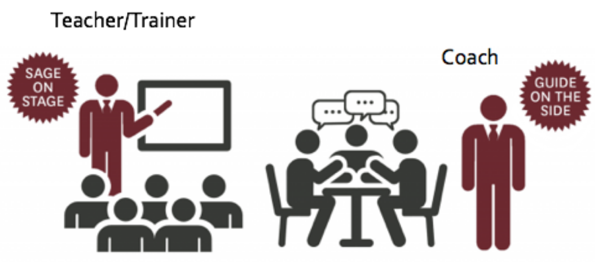

# Introduction
{:.no_toc}

> ###  Resources / Reading recommendation
>
> This tutorial is significantly based on the 3rd session of ELIXIR Train the Trainer curriculum, but also:
> - [Teaching Tech Together ](https://teachtogether.tech)
> - [How Learning works, ](https://www.academia.edu/6743627/How_Learning_Works_Seven_Research_Based_Principles_for_Smart_Teaching_Susan_A_Ambrose_Michael_W_Bridges_Michele_DiPietro_Marsha_C_Lovett_Marie_K_Norman_with_a_Foreword_by_Richard_E_Mayer)
> - Understanding how we learn 
> - [Instructor Training, The Carpentries](https://carpentries.github.io/instructor-training/08-motivation/index.html)
>
{: .comment}

> ### Agenda
>
> In this tutorial, we will cover:
>
> 1. TOC
> {:toc}
>
{: .agenda}

# Effective training

## Effective training & good trainer

> ###  What makes training effective and a good trainer? (10 min - Discussion in groups of 2)
>
> - Recall concrete examples of your past training experience
> - Share with your colleague
> - List 3 keywords for effective training
> - List 3 keywords for a good trainer
>
{: .hands_on}

Training / teaching is effective if
- brings learners to Learning Objectives (LO)
- is engaging
- is well designed

A trainer / teacher is effective when they
- facilitates learning 
- sets clear LOs
- identifies appropriate LEs
- is engaging
- is inspiring 
- is empathetic
- is accessible

GOBLET ([Global Organisation for _Bioinformatics_ Learning, Education & Training (GOBLET)](https://www.mygoblet.org/)) developed the skill matrix for a trainer / teacher:  

</a>")

The idea is that there are four areas in which a good trainer should be or become skilled. In many cases, trainers focus on the area of communication and are less aware about their "level" in the other areas.

This matrix is then a tool for self evaluation:
- In which area(s) do you feel you would need improvement?
- In which area(s) do you feel you are ok?

> ###  What makes training effective and a good trainer? (5 min - Silent reflection)
>
> - Look at the GOBLET Skill Matrix
> - Reflect on which areas do you need to develop in
> - Write in the shared notes which skills you need to improve in each area of the GOBLET matrix
>
{: .hands_on}

> ###  GOBLET
>
> [Global Organisation for _Bioinformatics_ Learning, Education & Training (GOBLET)](https://www.mygoblet.org/) aims to coordinate world-wide bioinformatics training activities:
> - to share, not duplicate, effort;
> - to share, not duplicate, cost;
> - to work together in a mutually respectful way towards common solutions and a sustainable future
>
{: .comment}

## Effective training practices for effective learning

> ###  Get ready to teach this part
>
> Read the chapter "In the Classroom" from [Teaching Tech Together](https://teachtogether.tech/en/index.html#s:classroom)
>
{: .tip}

We are now going to watch a short video (13 min) in which Eric Mazur, professor at the Harvard University, will discuss some of these teaching practices and a paradigm change: from the traditional lecture to active learning-based approaches. Can you recognise the main features of this change of paradigm?

<iframe width="560" height="315" src="https://www.youtube.com/embed/Z9orbxoRofI" title="YouTube video player" frameborder="0" allow="accelerometer; autoplay; clipboard-write; encrypted-media; gyroscope; picture-in-picture" allowfullscreen></iframe>

> ###  Reflect on Mazur's interview (5 min - Silent reflection)
>
> - Write something that really impressed you in Mazur’s interview
>
{: .hands_on}

From the Eric Mazur's interview, learners who actively interact with the material, the teacher, and other learners:
- They will learn better and more
- They will better remember what they learn
- They will be more able to apply their knowledge to different fields

In other words, for learning to actually occur, you should select teaching practices (learning experiences) that promote active, interactive and collaborative learning, what Mazur expresses as "learning by doing". 
Let's discuss a few more insights about active learning and stress the main differences between the most used technique worldwide (Lecturing) and the active learning approach. You will see that we are talking about an actual change of paradigm.

### Active, interactive and collaborative learning

As Mitchell Waldrop pointed out in , learners who **actively engage with course materials** will end up:
- retaining it for much longer
- being better able to apply their knowledge broadly

Active Learning is anything course-related that all students in a class session are called upon to do other than simply watching, listening and taking notes ().

Typical teaching practice: lecturing | Active learning
--- | ---
Teacher-centered | Student-centered
Teaching by telling | Teaching by questioning
Teacher speaks and students listen | Collaborative learning
Few interactions student/teacher and student/student | High interactivity (student/teacher, and student/student)
Few questions | Discussion with teacher follows, not precedes
The same few students engaged | All students engaged

Do you recognise the paradigm change proposed by Eric Mazur?

With the help of Mazur, you hopefully started believing that active, interactive and collaborative learning is worth considering and deserves you give it a go in one of your future training courses.

Should this be the case, you may have questions like: 
- how do I choose the active learning techniques for my lessons? 
- what "active learning" means in terms of "teaching / training practices"?
- which is the most effective technique I can incorporate in my teaching?
- is there any "ideal" teaching technique I should absolutely learn?

**There is not "the" ideal teaching technique nor the "most effective" teaching technique.**

You may remember from the Nichols' steps of curriculum design, that it is essential that you align learning experiences to the learning outcomes of your course. In other words, for each LO, you should identify the learning experience(s) that will best support the achievement of the LO. 

More in general, to decide how to teach and choose the most appropriate learning experience(s), you may use three criteria:
- What is your purpose / goal (is it to inspire learners? is it to ensure they will remember a concept?)
- The Bloom's level at which you intend to teach (a specific topic; this may change from topic to topic)
- The learning outcome(s) the learning experience is designed for
   
   A lecture is not suitable to teach learners implement an algorithm. It may show how to do it, so that they may be able to describe how to do it, but if you want them to be able to do it, you will have to choose a learning experience where learners will have the chance to practice algorithm implementation. 

Inspired by Eric Mazur and the idea of active learning,  summarized some teaching practices that you may wish to implement in your lessons:

| Learning experience | Highest Bloom's levels supported | Example TG(s) _"This LE will allow me to..."_                                                                                                                       | Example LO(s) _"Learners will be able to..."_                                                                                 |
| ------------------- | -------------------------------- | ----------------------------------------------------------------------------------------------------------------------------------------------------------------- | --------------------------------------------------------------------------------------------------------------------------- |
| Lecture, webinar    | Remember, Comprehend             | Inspire learners, ignite learners' enthusiasm, clarify/explain a concept, provide an overview, give context, summarise content                                    | _list_ the key points of the lecture/webinar, _summarise_ take home message(s)                                              |
| Exercise, practical | Apply, Analyse                   | Help learners digest course materials, solve typical problems, apply knowledge, show how to do things with appropriate guidance, give an idea of how a tool works | _follow_ a set of instructions or protocol, _calculate_ a set of results or outcomes from a given protocol                  |
| Flipped class       | Apply, Analyse                   | Teach learners how to formulate questions, help learners to memorise new information & concepts, or analyse & understand course materials                         | _summarise_ the content material, \*ask\* appropriate questions                                                             |
| Peer instruction    | Synthesise, Evaluate             | Prepare learners to defend an argument, give learners opportunities to explain things, thereby helping to develop critical thinking & awareness                   | _explain_ how they solved an exercise, _evaluate_ others' choices/decisions, _diagnose_ errors in the exercise-solving task |
| Group discussion    | Synthesise, Evaluate             | Give learners opportunities to practice questioning, develop new ideas & critical thinking                                                                        | _communicate_ their own ideas, _defend_ their own opinions                                                                  |
| Group work          | Synthesise, Evaluate             | Promote collaborative work & peer instruction, provide opportunities for giving/receiving feedback, & digesting course materials                                  | _provide_ feedback on their peers' work, _share_ ideas, _explain_ the advantages of team-work                               |
| Problem-solving     | Synthesise, Evaluate             | Promote learner abilities to identify & evaluate solutions, develop new ideas, make decisions, evaluate decision effectiveness, troubleshoot                      | _diagnose_ faulty reasoning or an underperforming result, _correct_ errors                                                  |

In the table, Learning experience (from the learner point of view) is the Teaching practice (from the teacher point of view).

This table is useful to reinforce the concepts discussed in previously and provides you with criteria to choose the most suitable learning experience(s) for the Bloom's level, TG(s) and LO(s).

You should be kind of familiar  with some of the learning experiences listed in the table, e.g., lecture/webinar, group discussion, work in groups, problem solving. Some of you might not be familiar with the techniques of "peer instruction" and "flipped classroom".
These two techniques can be implemented in many different ways and incorporated into your course in a "light way or very extensively. This will depend on your familiarity with the technique. At the beginning, our suggestion is that you try with something "minima" test it, see how you feel and how learners receive it, and then you increase the amount of learning experiences involving peer instruction and flipped classroom. 

### Peer instruction

It is a 1-to-1 instruction in a scalable way by interleaving formative assessment with learner discussion.

> ###  Peer-to-peer or peer-learning: what is it? (2-min video)
>
> <iframe width="560" height="315" src="https://www.youtube.com/watch?v=MYa4hgcMRNc" title="YouTube video player" frameborder="0" allow="accelerometer; autoplay; clipboard-write; encrypted-media; gyroscope; picture-in-picture" allowfullscreen></iframe>
>
{: .details}

In its "traditional" form, the teacher
1. Gives a brief introduction to the topic.
2. Gives learners a multiple choice question (MCQ) that probes for their misconceptions
3. Has all the learners vote on their answers to the MCQ
    2. If the learners all have the **right** answer, move on
    3. If they all have the same wrong answer, **address** that specific misconception
    4. If they have a mix of right and wrong answers, give them several minutes to argue with each other in groups of 2–4, then vote again

You may also be creative and implement this technique in your own way.

> ###  Concept Tests at Avanti's Learning Centre in Kanpur (2-min video)
>
> <iframe width="560" height="315" src="https://www.youtube.com/watch?t=1&v=2LbuoxAy56o" title="YouTube video player" frameborder="0" allow="accelerometer; autoplay; clipboard-write; encrypted-media; gyroscope; picture-in-picture" allowfullscreen></iframe>
>
{: .details}

> ###  Does that work?
> 
> It has been studied extensively in a wide variety of contexts, including programming (references??). Learners value peer instruction even at first contact.
>
> Group discussion significantly improves learners' understanding. It uncovers gaps in their reasoning and forces them to clarify their thinking. Re-polling the class then lets the teacher know if they can move on or if further explanation is necessary. A final round of additional explanation after the correct answer is presented gives learners one more chance to solidify their understanding.
>  
> Peer discussion actually does enhance understanding. Even when none of the learners in a discussion group originally knew the correct answer. As long as there is a diversity of opinion within the group, their misconceptions cancel out.
> 
{: .details}

### Flipped classroom

In its standard approach,

1. Before the course, out of class, students prepare to participate in class activities
2. During the course in the class, students practice applying key concepts with feedback
3. After the course, out of class, students check their understanding and extend their learning

Flipping class requires a lot of preparation. The teacher need to explain the method to learners and make an "agreement" with them: they have to commit to work on the materials you will give them prior the flipped class and you will commit to give them "manageable" materials.

Don’t start by flipping an entire course. Start small. Test. Add up.

## Other teaching practices for active learning

- Brief question-and-answer sessions: a classic to distribute attention

    > ###  Recommendation for brief question-and-answer sessions
    > 
    > When doing, the teachers should **make sure that everybody has a voice and that attention is fairly distributed**
    > 
    > Tools like sticky notes could be used. Each learners write their name on a sticky note and put it on their laptop. Each time the teacher calls on them or answers one of their questions, they take their sticky note down. Once all the sticky notes are down, everyone puts theirs up again. It makes it easy for the teacher to see who they haven't spoken with recently and to avoid unconscious bias and interacting preferentially with their most extroverted learners
    > 
    > Without a check like this, it is too easy to create a feedback loop in which<>
    > - Extroverts get more attention, leads to them doing better and leads to them getting more attention
    > - Quieter, less confident, or marginalized learners are left behind
    > 
    > Such tools shows learners that attention is being distributed fairly. When they _are_ called on, they won't feel like they're being picked on
    > 
    {: .details}

- Think, pair, share: a lightweight technique that helps people improve ideas through discussion with their peers

    > ###  Think, pair, share
    > 
    > In this form of peer instruction, Teacher proposes an activity, a question, a problem and then follow 3 steps>
    >
    > 1. **THINK**: Each person starts by thinking individually about it and jotting down a few notes
    > 2. **PAIR**: students explain their ideas to each other in pairs, merging them or selecting the most promising
    > 3. **SHARE**: a few pairs present their ideas to the whole group
    >
    > For example, a teacher asks a question (a problem to solve)
    > 1. Students **THINKS** singularly. The teacher can check results (technology can be used for that)
    > 2. Students talks in **PAIRS** and find an agreement. The teacher can check results
    > 3.  Students **SHARE** their answers under the teacher's guide
    > 
    > Why does it work?
    > It forces people to externalize their cognition and gives a chance to spot and resolve gaps or contradictions in their ideas _before_ exposing them to a larger group
    {: .details}

- Take notes together / shared notes

    > ###  Shared notes
    > 
    > This form of real-time elaboration forces to organize and reflect on material as it's coming in, which in turn increases the likelihood of transfer it to long-term memory
    >
    > It also allows people to compare what they think they're hearing with what other people are hearing, and helps to fill in gaps and correct misconceptions right away.
    >
    > It gives the more advanced learners in the class something useful to do. Rather than getting bored and doing something else during class, they take the lead in recording what's being said. They are kept engaged.
    > 
    > It allows less advanced learners to focus more of their attention on new material.
    > 
    > Finally, it provides the notes that are usually more helpful *to learners* than those the teacher would prepare in advance. Learners are more likely to write down what they actually found new rather than what the teacher predicted would be new.
    {: .details}

- Work in groups, e.g. with projects

- Pair programming

    > ###  Pair programming
    > 
    > <iframe width="560" height="315" src="https://www.youtube.com/embed/vgkahOzFH2Q" title="YouTube video player" frameborder="0" allow="accelerometer; autoplay; clipboard-write; encrypted-media; gyroscope; picture-in-picture" allowfullscreen></iframe>
    >
    > Used for Software development, two programmers work together on one computer: 
    > - One person (the driver) does the typing
    > - The other (the navigator) offers comments and suggestions
    > The two switch roles several times per hour. This practice is found effective in professional work
    >
    > For learning, 2 learners work together on 1 computer. They can help each other during practical exercises, clarify each other’s misconceptions when solution is presented and also discuss common interests during breaks.
    >
    > It is a good way to teach. It increases success rate in introductory courses, leads better software, higher learner confidence in their solutions and more benefits for learners from underrepresented groups
    {: .details}

- Discussions / debate with all learners

    As for brief Q&A session, teachers should make sure that everybody has a voice.

- Brainstorming with all learners

    As for brief Q&A session, teachers should make sure that everybody has a voice.

- Hands-on activities, e.g. running tools on their own, commands, analysis

    Galaxy is a great tool for that. That is why tutorials from the GTN are developed around that ideas.

    > ###  Recommendation for brief question-and-answer sessions
    > 
    > During training session, teachers could use sticky notes as status flags. They Give each learner two sticky notes of different colors, such as orange and green.
    > 
    > If someone has completed an exercise and wants it checked, they put the green sticky note on their laptop. If they run into a problem and need help, they put up the orange one
    >
    > It is much better than having people raise their hands. It is more discreet and so students are more likely to actually do it. They keep working while their flag is raised rather than trying to type one-handed
    > And teacher can quickly see from the front of the room what state the class is in. 
    > 
    > It is particularly helpful when people in mixed-ability classes are working through material at their own speed
    > 
    {: .details}

- Have learners make predictions

    Research has shown that people learn more from demonstrations if they are asked to predict what's going to happen. It fits naturally into live coding / analysis: after adding or changing a few lines of a program, the teacher asks the class what is going to happen when it runs. 

    If the example is even moderately complex, prediction can serve as a motivating question for a round of peer instruction.

- Build an artefact (e.g. concept map)

> ###  Which strategies for active learning training did you use? (10 min - Qizz + discussion)
>
> 
>
{: .hands_on}

What have we learned about teaching practices / learning experiences?
1. Select learning experiences according to the criteria discussed earlier:
    - reflect on your TG(s)
    - write LOs AND identify the corresponding Bloom's level 
2. Select learning experiences allowinglearners to achieve LOs
3. Always remember that learning occurs BY DOING
4. Be aware of other practices and behaviours supporting:
    - interactivity
    - a positive and engaging learning environment
    - active and collaborative learning
    - stimulating lessons
    - frequent feedback 

### Examples of practives and behaviors to improve delivery and learning

Other teaching practices that can improve content delivery. Specially supporting
- interactivity
- a positive and engaging learning environment
- active and collaborative learning
- stimulating lessons
- frequent feedback 

Here are some examples. None of the practices described here are essential

- Start with introductions
    - Begin by introducing yourself

        If you're an expert, tell them a bit about how you got to where you are. If you're only two steps ahead of them, emphasize what you and they have in common.

        Whatever you say, the goals are to make yourself more approachable and encourage their belief that they can succeed.

    - Introduction of learners to each other
        
        In a class of a dozen, it can be done verbally. In a larger class or if they are strangers to one another, you can have them each write a line or two about themselves in the shared notes or split into small groups or breakout rooms.

- Pay attention on how you set up the learning environment (both in presence and online)

    - Learners environment
        - Send setup instructions per email before

            > ###  Check our dedicated tutorials to set up Galaxy for teaching
            >
            > - [Organizing a workshop]()
            > - [Running a workshop as instructor]()
            > - [Set up a Galaxy for Training]()
            > - [UseGalaxy.eu's Training Infrastructure as a Service]()
            >
            {: .tip }

        - Have everyone run some tests at the beginning to check
    - Yours
        - Same as learners
        - Food + drinks
- Introduce blended multimedia materials to create engaging activities
- Collect instant feedback (see [dedicated tutorial]())
- Let learners do recaps
    
    Organise recap sessions at the end of lessons or at the beginning of the following ones where learners are actively involved. You may ask them to do the recaps.

- Repeat each questions aloud back to them before answering to to ensure you and all the other learners understood the question and gives you a a chance to redirect the question to something you're more comfortable answering

- Introduce physical exercises, short, relaxing breaks

    In day-long training courses, you may introduce very short sessions of stretching (or even one moment meditation and then doing 1 minute meditation together). You might feel ridiculous, but you have no idea of how learners appreciate these types of activities and how these create a relaxed climate in the class.

- Introduce challenges or games

    Before using gamification, it is though better to learn how to do it. Gamification can be a very powerful and engaging technique. 

- Never teach alone. Teach together. Whenever possible...

    There are different models to teach together or **[co-teaching](https://teachtogether.tech/en/index.html#g:co-teaching)**>
    - Team teaching: Both teachers deliver a single stream of content in tandem, taking turns like musicians taking solos.
    - Teach and assist: Teacher A teaches while Teacher B moves around the classroom to help struggling learners. 
    - Alternative teaching: Teacher A provides a small set of learners with more intensive or specialized instruction while Teacher B delivers a general lesson to the main group.
    - Teach and observe: Teacher A teaches while Teacher B observes the learners, collecting data on their understanding to help plan future lessons.
    - Parallel teaching: The class is divided in two and the teachers present the same material simultaneously to each.
    - Station teaching: The learners are divided into small groups that rotate from one station or activity to the next while teachers supervise where needed.

    With two or more trainers in the classroom, the class can be observed from different angles, it is easier to detect learners who are not comfortable or struggling or lagging behind. It is possible to provide one-to-one support without stopping the lesson flow.  It is also important that trainers teaching together provide feedback to each other.

    > ###  Recommendations for co-teaching
    > 
    > If you and a partner are co-teaching:
    > - Take 2–3 minutes before the start of each class to confirm who’s teaching what. If you have time, try drawing or reviewing a concept map together.
    > - Use that time to work out a couple of hand signals as well. "You're going too fast", "speak up", "that learner needs help", and, "It’s time for a bathroom break" are all useful.
    > - Each person should teach for at least 10–15 minutes at a stretch, since learners will be distracted by more frequent switch-ups.
    > - The person who isn't teaching shouldn't interrupt, offer corrections or elaborations, or do anything else to distract from what the person teaching is doing or saying. The one exception is to ask leading questions if the learners seem lethargic or  unsure of themselves.
    > - Each person should take a couple of minutes before they start teaching to see what their partner is going to teach after they’re done, and then *not* present any of that material.
    > - The person who isn't teaching should stay engaged with the class, not catch up on their email. Monitoring the shared notes, keeping an eye on the learners to see who’s struggling, jotting down some feedback to give your teaching partner at the next break—anything that contributes to the lesson is better than anything that doesn’t.
    > - Take a few minutes when the class is over to congratulate or commiserate with each other
    {: .details}
    
- Assess prior knowledge and mental models to tailor the lesson on learners' actual needs, to address misconceptions, to learn about your learners (see [dedicated tutorial]())

    The more you know about your learners before you start teaching, the more you will be able to help them.

- Learn learners names and use them.

- Avoid homework in All-day formats
    
    Learners who have spent an entire day programming will be tired. If you give them homework to do after hours, they'll start the next day tired as well.

Each of the techniques presented here will make your classes better, but you shouldn't try to adopt them all at once. The reason is that every new practice increases *your* cognitive load as well as your learners', since you are all now trying to learn a new way to learn as well as the lesson's subject matter. If you are working with a group repeatedly, you can introduce one new technique every few lessons; if you only have them for a one-day workshop, it's best to pick just one method they haven't seen before and get them comfortable with that.

# Motivation and demotivation

> ###  Get ready to teach this part
>
> - Read the chapter "What factors motivate Students to learn?", *[How Learning works, Ambrose et al, 2010](https://www.academia.edu/6743627/How_Learning_Works_Seven_Research_Based_Principles_for_Smart_Teaching_Susan_A_Ambrose_Michael_W_Bridges_Michele_DiPietro_Marsha_C_Lovett_Marie_K_Norman_with_a_Foreword_by_Richard_E_Mayer)*
> - Check ["Motivation and Demotivation" section](https://carpentries.github.io/instructor-training/08-motivation/index.html), Instructor Training, The Carpentries
>
{: .tip }

In order to facilitate learning, we had to learn (a bit) how learning works. But motivation is key to learning. If we want to enhance motivation, we have to learn a bit how motivation works.
Motivation is personal and it is very difficult to work with demotivated learners. Often, teachers cannot do much with deep lack of motivation. Here, we want to see what can trainers do to enhance motivation.
Adult learners usually come motivated to courses and the point is to not demotivate them

## Motivation

What is motivation?
- Motivation refers to the **personal investment** that an individual has in reaching a desired state or outcome ()
- **Learning** results from what the **student does and thinks** and **only** from what the student does and thinks. **The teacher** can advance learning only by influencing what the student **does** to learn (Herbert A. Simon - Nobel Laureate, one of the founders of Cognitive Science)

    This means that the responsibility of the learning is on the learners. If the learners are not motivated, they will not learn (or hardly learn anything).

- **Principle P3**: Student's motivation determines, directs and sustains what they do learn ()

Motivation influences:
- Direction
- Intensity
- Persistence
- Quality
Of the learning behaviors

> ###  Recall a motivating learning experience (5 min - Silent reflection)
>
> Write in the shared notes about a **motivating** experience in your life (as a learner) and how it impacted you
>
> > ###  For trainer
> >
> > The trainer will comment learners' motivating experiences, trying to identify and highlight "patterns of motivation". Key features of motivation (value, expectancy, environment) could be introduced starting from learners' experiences.
> > 
> > Example: 
> > - Learner's experience: "I felt very much motivated by a teacher saying that, based on my performance during classes, I would have been perfectly able to achieve all the course learning outcomes.""
> > - Trainer takes the opportunity to introduce the concept of "expectancy""' as one of the three pillars of motivation.
> >
> {: .tip }
{: .hands_on}

> **Principle P3**: Student's motivation determines, directs and sustains what they do learn
>
> 

2 important and central concepts to understand motivation
- Subjective value of a goal

    The value is the value a learner attributes to a goal

- Expectancies, or expectations for successful attainment of that goal

    It has to do with the feeling of achieving a goal.

When you have expectancy and value, you can achieve motivation:

### Goals

- Influence of students' goals on learning and behaviours
    - Goals: basic organizing feature of motivated behavior
    - The type of goals will influence behavior
- Possible goals
    - Learning goals: the goal is **learning** (acquire knowledge and skills
    - Performance goals
        - getting a good grade
        - protecting a desired self-image
        - projecting a positive reputation and public persona
        - demonstrating to others that they are intelligent and smart
    - Affective goals, e.g. have fun
    - Social goals, e.g. make new friends
    - Work-avoidance goals, e.g. finish work as quickly as possible

Students' goals for themselves may **differ** from teachers' goals for them

#### Performance goals vs Learning goals

- When guided by performance goals, students
    - concerned with normative standards
    - Try to do what is necessary to demonstrate competence to
        1. appear intelligent
        2. gain status
        3. Acquire recognition and praise
- When guided by learning goals, students try
    - Gain competence
    - Truly learn
- Powerful learning situation when alignment of students and teachers goals
- Higher motivation when more than goal satisfied

### Value

Goal’s importance = subjective value of a goal
- Key feature influencing the motivation
- Lack of perceived value → lack of motivation

> ###  Check the tutorial on principles of learning
>
> For more details about how learning works and values, check our [tutorial]()
>
{: .tip }

3 main sources of values
- **attainment value** = satisfaction that one gains from mastery and accomplishment of a goal

    Example: Solving complex mathematical theorems

- **intrinsic value** = satisfaction that one gains simply from doing the task
    - source of intrinsic motivation
    - spend hours writing a computer program
- **instrumental value** = degree to which an activity helps one accomplish other important goals = extrinsic rewards
    - praise
    - public recognition
    - money
    - material goods
    - an interesting career
    - a high-status job
    - etc

Not necessarily conflicting source of value, potentially reinforcing.
By working hard in a course, a biology student may derive value from multiple sources
- Solving challenging problems (attainment value)
- Engaging their fascination with biological processes (intrinsic value)
- Advancing their chances of getting into good medical school (instrumental value)

### Expectancies

- Value alone insufficient to motivate behavior
- Expectancies = goals and outcomes that people believe they can successfully achieve
- 2 necessary forms of expectancies
    - Outcome expectancies = belief that specific actions will bring about a desired outcome (Carver & Scheier, 1998)
        - Holding positive outcome expectancies → motivation
        - "If I do all the assigned readings and participate in class discussion, I will be able to learn the material well enough to solve problems in the exam and achieve a passing grade"
    - Efficacy expectancies = belief that one is capable of identifying, organizing, initiating, and executing a course of action that will bring about a desired outcome (Bandura, 1997)
        - Belief in personal agency
        - In order to hold a positive expectancy for success, learners must not only believe that doing the assigned work can earn a passing grade, they must also believe that they are capable of doing the work necessary to earn a passing grade
- Student’s expectation for success determined by prior experience in similar context

    "I am not good at math"

- Highest motivation, effort and persistence of it among students who attribute successful performance to a combination of ability and effort

### Perceptions of the environment

Interaction of value and expectancies within broader environmental context
* The complex dynamics of the classroom:
    * its tone
    * the interpersonal forces at play
    * inclusivity
    * the nature and structure of communication patterns
* e.g. "The instructor is approachable and several of my classmates seem willing to help me if I run into troubles"

Perception of the environment along a continuum from supportive to unsupportive → impact on motivation

* No value and no expectation
    * Rejecting: disengage, anger
* High expectancies - no value:: task doable but unimportant
    * Evading - difficulty to pay attention
* Lack of confidence in their ability
    * Hopeless: no expectation of success
    * Fragile: want to succeed, try to protect their sense of self-esteem, making excuse
* High expectation - see value
    * Defiant: "I will show you"
    * Motivated

Important point: interaction between value, expectancy and environment to produce an array of distinctive learner behavior

### Strategies to improve motivation

What can I do to motivate the learners (taking into account value, expectancy, environment)?

 provides a number of strategies that may help
1. **Establish value**: Increase the value that students place on the goals and activities identified and created for students
2. **Build positive expectancies**: Strengthen students’ expectancies
3. **Address value and expectancies**: Create an environment that supports motivation

> ###  Strategies to improve motivation (15 min - Groups of 2 people)
> - Discuss the following strategies as associated with **establishing value**, **building positive expectancies** and/or **addressing value and expectancies**
>   - Connect the material to students' interests
>   - Provide authentic, real-world tasks/example
>   - Show relevance to students’ current academic/working lives
>   - Demonstrate the relevance of higher-level skills to students’ future professional lives
>   - Identify and reward what you value
>   - Show your own passion and enthusiasm for the discipline
>   - Build positive expectations
>   - Ensure alignment of outcomes, assessments, and instructional strategies
>   - Identify an appropriate level of challenge
>   - Provide early success opportunities
>   - Articulate your expectations
>   - Provide targeted feedback
>   - Be fair
>   - Describe effective study strategies
>   - Give students an opportunity to reflect
>   - Provide flexibility and control
> - Add for each strategy
>   - **1** if the strategy **establish value**
>   - **2** if the strategy **build positive expectancies**
>   - **3** if the strategy **address value and expectancies**
>   - **?** if you do not know or do not find an agreement
>
{: hands-on }

Strategies to **establish value**
- Connect the material to learners’ interests
    - More motivated with material that interests them or has relevance for important aspects of their lives
    - Using data, examples, applications
- Provide authentic, real-world tasks
    * A real task performed by someone doing their work
    * See the relevance and value of otherwise abstract concepts and theories
    * Best: identify tasks for your own work that could be useful to others
- Show relevance to learners’ current academic/working lives
    * Make explicit connection between content of different courses
    * Better understanding the value of each course as building blocks
- Demonstrate the relevance of higher-level skills to learners’ future professional lives
    * Explaining how various skills can serve more broadly
    * Example: writing in lab reports for developing written communication skills
- Identify and reward what you value
    * In the syllabus, through feedback, through modeling
    * Reward through assessments
- Show your own passion and enthusiasm for the discipline
    * Powerful and contagious
    * Raise curiosity

The Carpentries approach: Teach most useful first
* Learners do something that _they_ think is useful in their daily work within 15 minutes of starting each lesson
* Not only motivates them, it also helps build their confidence in trainers, so that if it takes longer to get to something they find useful in a later topic, they will persist with the lesson

Strategies to **Build positive expectancies**
* Ensure alignment of objectives, assessments, and instructional strategies
    * More coherent picture of what will be expected of learner
    * More motivated because more confident and in control of learning
* Identify an appropriate level of challenge
    * May be difficult
    * Need to know who are learners
    * Pre-assessment to evaluate prior knowledge and future goals
* Create assignments that provide an appropriate level of challenge
    * Set standards that are challenging but attainable with learner effort
    * Difficult: depend on learner cohorts
    * Diagnostic and early assessment
* Provide early success opportunities
    * Expectation for future performance influenced by past experiences
    * Early success → sense of efficacy
* Articulate your expectations
    * Clear goals to know the desired outcome and clear expectations in order to reach them
    * Help make the connection between a course of action and a desired outcome more concrete and tangible → more positive outcome expectancy
    * Help setting realistic expectations by identifying areas with potential difficult
    * Let know what support expecting from you
* Provide rubrics
    * A scoring tool that explicitly represents performance expectations for an assignment
    * Divides the work into component parts and provides clear descriptions of different levels of quality associated with each component
    * Direct learners’ behaviors toward intended goals
* Provide targeted feedback
    * Powerful motivating effect
    * Most effective when it is
        * Timely: close enough in proximity to the performance
        * Constructive: strengths, weakness, suggestions for future actions
* Be fair
    * Particularly relevant when multiple graders
* Educate learners about the ways we explain success and failure
    * For example we frequently attribute
        * Success to things about us
        * Failures to things about the external world
    * Help shape the attributions for success and failure
* Describe effective study strategies
    * Give alternatives to the behaviors
    * Help adjust expectations about being able to successfully obtain their goals

Strategies to **Address value and expectancies**
* Provide learners with options and the ability to make choices
    * Lends to a sense of control, which can contribute to a learner’s expectation of success
* Give learners an opportunity to reflect
    * Facilitating reflection with specific questions: help structure the process to support motivation

## Demotivation

Motivation can go both ways

> ###  Recall a demotivating experience (5 min - Silent reflection)
>
> - Write in the shared notes about a **demotivating** experience in your life (as a learner) and how it impacted you
>
{: .hands_on}

Things you should not do as instructors
* Tell learners they are rubbish because they use a technology, etc
* Say negative things about a technology or applications
* Pretend to know more than what you do
* Dive into complex or detailed technical discussions with one or two people
* Use diminishing language "just", "simply", "obviously", "don’t you know?"
* Hinder autonomy
    * Take over the learner's keyboard. It is rarely a good idea to type anything for your learners
    * Doing so can be demotivating for the learner (as it implies you do not think they can do it themselves or that you do not want to wait for them)
    * It also wastes a valuable opportunity for your learner to develop muscle memory and other skills that are essential for independent work.
* Deliver long unidirectional lectures
* Feign surprise
    * Saying things like “I cannot believe you do not know X” or “You have never heard of Y?” signals to the learner that they do not have some required pre-knowledge of the material you are teaching, that they do not belong at the workshop, and it may prevent them from asking questions in the future.

It can be difficult to avoid these demotivators entirely. Teaching yourself to avoid these types of comments takes practice, but is well worth the effort. No one likes to be made fun of.

### Systemic and psychological demotivators

Other factors can contribute to demotivation. Some of which are either systemic, or built into our psychological makeup as human beings. We cannot always control these demotivators - often they come from outside the classroom - but we can be aware of them, and take certain actions to lessen their impact by thinking carefully about the language that we use and how we interact with our learners.

* Stereotype threat
    * Reminding people of negative stereotypes, even in subtle ways, can make them anxious about the risk of confirming those stereotypes, in turn reducing their performance
    * Clearest examples in computing are gender-related
    * To do
        * Avoid thinking in terms of a deficit model, use a systems approach
        * Not highlight people based on their identity with a minority group: draws attention to the stereotype
        * Ask people to sign up for workshops in small teams rather than as individuals when possible
* Impostor syndrome
    * Belief that one is not good enough for a job or position, and that one’s achievements are due to luck rather than talent or skill
    * To do
        * Sharing stories of mistakes that you have made or things you struggled to learn
        * Emphasize that you want questions
        * Remember, it is much more important to _be_ smart than to _look_ smart
    * [Resources for teaching about and dealing with imposter syndrome](https://adainitiative.org/continue-our-work/impostor-syndrome-training/)
* Accessibility issue
    * It helps everyone
        * Proper captioning of images, for example, benefits people with no or limited vision by giving screen readers something to say: but it also makes the images more findable by exposing their content to search engines.
    * To do
        * Know what you need to do
            * [Posters of dos and do nots from UK home office](https://hodigital.blog.gov.uk/category/accessibility/)
            * [W3C Accessibility Initiative’s checklist for presentations](http://www.w3.org/WAI/teach-advocate/accessible-presentations/)
            * Liz Henry’s blog post about[ accessibility at conferences](https://modelviewculture.com/pieces/unlocking-the-invisible-elevator-accessibility-at-tech-conferences)
            * I[nterview with Chad Taylor](https://modelviewculture.com/pieces/qa-making-tech-events-accessible-to-the-deaf-community)
        * Know how well you are doing
            * Sites like[ WebAIM](http://webaim.org/) to check how accessible your online materials
        * Involve people with disabilities in decision-making
* Inclusivity
    * Policy of including people who might otherwise be excluded or marginalized
    * Lee’s paper “[What can I do today to create a more inclusive community in CS?](https://carpentries.github.io/instructor-training/files/papers/lee-create-inclusive-community-2015.pdf)”
    * To do
        * Ask learners to email you before the workshop to explain how they believe the training could help them achieve their goals;
        * Review notes to make sure they are free from gendered pronouns, that they include culturally diverse names, etc.;
        * Emphasize that what matters is the rate at which they are learning, not the level of knowledge they had when they started;
        * Encouraging pair programming
        * Mitigate actively behavior that some learners may find intimidating
            * e.g., use of jargon or “questions” that are actually asked to display knowledge.

# Conclusion
{:.no_toc}

> ###  ... (5 min - Silent reflection)
>
> - Read the Teaching Strategies List for active learning
> - Think and write in the shared notes which of these strategies you apply or have already applied in your teaching
> - Think and write in the shared notes which strategies you would like to apply in next future and why
>
{: .hands_on}