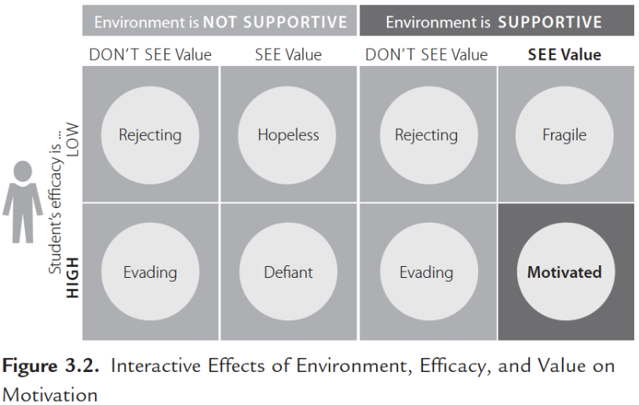

# Introduction

In order to facilitate learning, we had to learn (a bit) how learning works. But motivation is key to learning. If we want to enhance motivation, we have to learn a bit how motivation works.
Motivation is personal and it is very difficult to work with demotivated learners. Often, teachers cannot do much with deep lack of motivation. Here, we want to see what can trainers do to enhance motivation.
Adult learners usually come motivated to courses and the point is to not demotivate them.

> <comment-title>Resources / Reading recommendation</comment-title>
>
> This tutorial is significantly based on the 3rd session of ELIXIR Train the Trainer curriculum, but also:
> - [Teaching Tech Together ](https://teachtogether.tech)
> - [How Learning works, ](https://www.academia.edu/6743627/How_Learning_Works_Seven_Research_Based_Principles_for_Smart_Teaching_Susan_A_Ambrose_Michael_W_Bridges_Michele_DiPietro_Marsha_C_Lovett_Marie_K_Norman_with_a_Foreword_by_Richard_E_Mayer)
> - Understanding how we learn 
> - [Instructor Training, The Carpentries](https://carpentries.github.io/instructor-training/08-motivation/index.html)
>
> To get ready to teach this tutorial
> - Read the chapter "What factors motivate Students to learn?" in [How Learning works, ](https://www.academia.edu/6743627/How_Learning_Works_Seven_Research_Based_Principles_for_Smart_Teaching_Susan_A_Ambrose_Michael_W_Bridges_Michele_DiPietro_Marsha_C_Lovett_Marie_K_Norman_with_a_Foreword_by_Richard_E_Mayer)
> - Check ["Motivation and Demotivation" section](https://carpentries.github.io/instructor-training/08-motivation/index.html), Instructor Training, The Carpentries
>
{: .comment}

> <agenda-title></agenda-title>
>
> In this tutorial, we will cover:
>
> 1. TOC
> {:toc}
>
{: .agenda}

# Motivation

What is motivation?
- Motivation refers to the **personal investment** that an individual has in reaching a desired state or outcome ()
- **Learning** results from what the **student does and thinks** and **only** from what the student does and thinks. **The teacher** can advance learning only by influencing what the student **does** to learn (Herbert A. Simon - Nobel Laureate, one of the founders of Cognitive Science)

    This means that the responsibility of the learning is on the learners. If the learners are not motivated, they will not learn (or hardly learn anything).

- **Principle P3**: Student's motivation determines, directs and sustains what they do learn ()

Motivation influences **direction**, **intensity**, **persistence** and **quality** of the learning behaviors.

<!-- 
> <hands-on-title>Recall a motivating learning experience (5 min - Silent reflection)</hands-on-title>
>
> Write in the shared notes about a **motivating** experience in your life (as a learner) and how it impacted you
>
>
{: .hands_on}-->



> <tip-title>For trainer</tip-title>
>
> The trainer will comment learners' motivating experiences, trying to identify and highlight "patterns of motivation". Key features of motivation (value, expectancy, environment) could be introduced starting from learners' experiences.
>
> Example:
> - Learner's experience: "I felt very much motivated by a teacher saying that, based on my performance during classes, I would have been perfectly able to achieve all the course learning outcomes.""
> - Trainer takes the opportunity to introduce the concept of "expectancy""' as one of the three pillars of motivation.
>
{: .tip }

## Goals

To say that someone is motivated tells us little unless we say what the person is motivated to do. Thus, **goals** serve as the basic organising feature of motivated behaviour. They act as the compass that guides and directs a broad range of purposeful actions.

Researcher have identified different categories of goals whose the type influence behavior
- **Performance goal**:
    - protecting a desired self-image
    - projecting a positive reputation and public persona
    - passing exams
    - appear intelligent
    - acquire recognition and praise.
- **Learning goal**: gain competence and truly learn what an activity or task can teach them (adult learners)
- **Work-avoidant goals**: desire to finish work as quickly as possible with as little effort as possible
- **Social goals**: making friends
- **Affective goals**: engaging in stimulating activities, e.g. have fun

> <details-title>Performance goals vs Learning goals</details-title>
>
> When guided by performance goals, students concerned with normative standards try to do what is necessary to demonstrate competence to
> 1. appear intelligent
> 2. gain status
> 3. Acquire recognition and praise
>
> When guided by learning goals, students try to
> - Gain competence
> - Truly learn
>
{: .details}

Learners' goals for themselves may **differ** from teachers' goals for them. Powerful learning situation happen when goals of of learners and teachers are aligned, but also when more than one goal satisfied.

## Value

What is also playing an important role in motivation? The importance of the goals, the **subjective value** of the goals, i.e. the value a learner attributes to the goals. A lack of of perceived value leads to a lack of motivation-

There are 3 main sources of values
- **Attainment value**: satisfaction that one gains from mastery and accomplishment of a goal

    Example: satisfaction from solving complex problems to demonstrate the ability to solve them

- **Intrinsic value**: satisfaction that one gains simply from doing the task; source of intrinsic motivation

    Example: spend hours writing a computer program

- **Instrumental value**: degree to which an activity helps one accomplish other important goals = extrinsic rewards

    Examples:
    - Praise
    - Public recognition
    - An interesting career
    - A good salary

The difference sources of value are not necessarily conflicting, but potentially reinforcing.

For example, by working hard in a course, a biology student may derive value from multiple sources
- Solving challenging problems (attainment value)
- Engaging their fascination with biological processes (intrinsic value)
- Advancing their chances of getting into good medical school (instrumental value)

## Expectancies

Although one must value a desired outcome in order to be motivated to pursue it, value alone is insufficient to motivate behavior. People are also motivated to pursue goals and outcomes that they believe they can successfully achieve.

Conversely, if they do not expect to successfully achieve a desired goal or outcome, they will not be motivated to engage in the behaviors necessary to achieve it. Motivational theorists refer to these expectations as **expectancies**.

**Expectancies**, or expectations for successful attainment of that goal, are the goals and outcomes that people believe they can achieve. It has to do with the feeling of achieving a goal. When you have goals, value and expectancy, you can achieve motivation:

![4 main boxes: a grey one with "Goals" written in it, a green one with "Motivation" in it, an blue one with "Value. A goal's importance" written in it, an orange one with "Expectancy / Efficacy" in it. 5 smaller boxes stacked on each other on the left of the "Goals" box with "Performance goals", "Social goals", "Learning goals", "Work-avoidant goals", "Affective goals" written inside. "Basic features of" written between "Goals" and "Motivation". 2 arrows from "Value" and "Expectancy" to "Motivation"](./images/motivation_concept_map_l4.png)

We describe two forms of expectancies that help inform our understanding of motivated behavior:
- **Outcome expectancies**: the belief that specific actions will bring about a desired outcome ()

    Holding positive outcome expectancies leads to motivation

    For example, "If I do all the assigned readings and participate in class discussion, I will be able to learn the material well enough to solve problems in the exam and achieve a passing grade"

- **Efficacy expectancies**: the belief that one is capable of identifying, organizing, initiating, and executing a course of action that will bring about a desired outcome ()

    It is the belief in personal agency. In order to hold a positive expectancy for success, learners must not only believe that doing the assigned work can earn a passing grade, they must also believe that they are capable of doing the work necessary to earn a passing grade

Learners' expectation for success is determined by prior experience in similar context. For example, the thought: "I am not good at math"

Highest motivation, effort and persistence of it happen among students who attribute successful performance to a combination of ability and effort.

With goals, value and expectancy, motivation leads to a **goal directed behaviour** which is key to support **learning and performance**.

![6 main boxes: a grey one with "Goals" written in it, a green one with "Motivation" in it, an blue one with "Value. A goal's importance" written in it, an orange one with "Expectancy / Efficacy" in it, a yellow one with "Goal-directed behavior" in it, a light blue with "Learning and Performance" written. 5 smaller boxes stacked on each other on the left of the "Goals" box with "Performance goals", "Social goals", "Learning goals", "Work-avoidant goals", "Affective goals" written inside. "Basic features of" written between "Goals" and "Motivation". 2 arrows from "Value" and "Expectancy" to "Motivation". 1 arrow  from "Motivation" to "Goal-directed behavior" with "Leads to" written below. 1 arrow from "Goal-directed behavior" to "Learning and Performance" with "Supports" written below](images/motivation_concept_map_l6.png)

Value and Expectancy are then two key pillars of motivation but that they're are not sufficient to be fully motivated to learn.

## Learning environment

There is a third pillar of motivation, which is the learning context or environment.

![7 main boxes: a grey one with "Goals" written in it, a green one with "Motivation" in it, an blue one with "Value. A goal's importance" written in it, an orange one with "Expectancy / Efficacy" in it, a yellow one with "Goal-directed behavior" in it, a light blue with "Learning and Performance" written, a lila one with "Environment" written. 5 smaller boxes stacked on each other on the left of the "Goals" box with "Performance goals", "Social goals", "Learning goals", "Work-avoidant goals", "Affective goals" written inside. "Basic features of" written between "Goals" and "Motivation". 3 arrows from "Value", "Expectancy" and "Environment" to "Motivation". 1 arrow  from "Motivation" to "Goal-directed behavior" with "Leads to" written below. 1 arrow from "Goal-directed behavior" to "Learning and Performance" with "Supports" written below](images/motivation_concept_map_l7.png)

**Principle 6**: Students' current level of development interacts with the social, emotional, and intellectual climate of the course to impact learning ()

Perception of the environment along a continuum from supportive to unsupportive has impact on motivation.

What do we mean about this? To better understand, we should consider the following **aspects for an unbiased and fair environment**:

- discrimination issues and inclusivity
- stereotypes

    > <details-title>Examples of stereotypes</details-title>
    >
    > Providing extra or less support to groups of students based on the belief that, in certain disciplines, some groups are not very gifted whereas others are innately talented (e.g. women are not strong in the STEMs or Asians are good at math) represents a type of bias very difficult to detect and it is a subtle form of racial stereotype (see e.g., https://theconversation.com/asians-are-good-at-math-why-dressing-up-racism-as-a-compliment-just-doesnt-add-up-128731, https://www.hepg.org/her-home/issues/harvard-educational-review-volume-89,-issue-4/herarticle/asians-are-good-at-math-is-not-a-compliment)
    >
    {: .details}

- complex dynamics of a class
- accessibility (including venue, materials and teacher accessibility)
- mindset (growth vs fixed mindset)

    > <details-title>About mindset (from )</details-title>
    >
    > Someone with a **growth mindset** views intelligence, abilities, and talents as learnable and capable of improvement through effort. On the other hand, someone with a **fixed mindset** views those same traits as inherently stable and unchangeable over time.
    >
    > Mindset is an outgrowth of the age-old nature vs. nurture debate (that is, how much of our ability and personality are hardwired into us, and how much is the result of how we're raised?). Recent studies suggest nurture is more important than nature—that growing up in a safe, secure, and inspirational environment outweighs innate abilities and behaviors.  agrees with this assessment: The crux of her argument in Mindset is that we can continue to improve throughout our lives by nurturing our growth, and that doing so far outweighs whatever natural talents we do or don't possess.
    >
    > We can just recommend you to have also a look at the [Book summary of  ](https://www.shortform.com/summary/mindset-the-new-psychology-of-success-summary-carol-dweck?gclid=CjwKCAjwgr6TBhAGEiwA3aVuIfDQDR77RVaUfjyQVrmQQ5ELPCl5fjLlbnfSZ2RPbdwoObh6POrJzhoCkZkQAvD_BwE)
    >
    {: .details}

All these aspects will influence the climate of a classroom. For example, "The instructor is approachable and several of my classmates seem willing to help me if I run into troubles"

In order to have fully MOTIVATED learners, it is important that:
- Learners **see the value**
- Learner self-efficacy is **high** and
- The environment is **supportive**

> <details-title>About Figure "Interactive effects of environment, efficacy, and value on motivation" from </details-title>
>
> 1. If no value and no expectation, leaners will reject learning with disengagement and even anger
> 2. If high expectancies but no valuem: the task is doable but unimportant, learners will evade and have difficulty to pay attention
> 3. If value but low expectancyies, they lack of confidence in their ability.
>    - If the environment is NOT supportive, they are hopeless with no expectation of success
>    - If the environment is supportive, they are fragile; they want to succeed, try to protect their sense of self-esteem and making excuse
> 4. If value and high expectation
>    - If the environment is NOT supportive, they will be defiant: "I will show you"
>    - If the environment is supportive, they are motivated
>
{: .details}

# Demotivation

Motivation can go both ways: motivation and de-motivation are strictly connected.
Adult learners usually come motivated to courses and the point is to not demotivate them.
In many cases, to not de-motivate learners is an excellent way to support motivation.

<!-- 
> <hands-on-title>Recall a demotivating experience (5 min - Silent reflection)</hands-on-title>
>
> Write in the shared notes about a **demotivating** experience in your life (as a learner) and how it impacted you
>
{: .hands_on}-->



**Things you should not do as instructors**
- Tell learners they are rubbish because they use a technology, etc
- Say negative things about a technology or applications
- Pretend to know more than what you do
- Deliver long unidirectional lectures
- Dive into complex or detailed technical discussions with one or two people
- Use diminishing language "just", "simply", "obviously", "don’t you know?"

    > <details-title>About dismissive language</details-title>
    >
    > Unaware usage of dismissive language (like "just", "easy", etc.) or of apparently "innocent" terms from the point of view of the "white heterosexual male" may be demotivating and / or offensive to certain minority groups (non white and / or non heterosexual and / or non male).
    >
    {: .details}

- Hinder autonomy

    > <details-title>Why taking over the learner's keyboard hinder autonomy?</details-title>
    >
    > It is rarely a good idea to type anything for your learners
    >
    > Doing so can be demotivating for the learner (as it implies you do not think they can do it themselves or that you do not want to wait for them)
    >
    > It also wastes a valuable opportunity for your learner to develop muscle memory and other skills that are essential for independent work.
    >
    {: .details}

- Feign surprise with "I cannot believe you do not know X" or "You have never heard of Y?"

    > <details-title>Why may feigning surprise trigger demotivation?</details-title>
    >
    > Saying things like "I cannot believe you do not know X" or "You have never heard of Y?" signals to the learner that they do not have some required pre-knowledge of the material you are teaching, that they do not belong at the workshop, and it may prevent them from asking questions in the future.
    >
    {: .details}

It can be difficult to avoid these demotivators entirely. Teaching yourself to avoid these types of comments takes practice, but is well worth the effort. No one likes to be made fun of.

> <details-title>Systemic and psychological demotivators</details-title>
>
> Other factors can contribute to demotivation. Some of which are either **systemic**, or **built into our psychological makeup** as human beings. We cannot always control these demotivators - often they come from outside the classroom - but we can be aware of them, and take certain actions to lessen their impact by thinking carefully about the language that we use and how we interact with our learners.
>
> - **Stereotype threat**: Reminding people of negative stereotypes, even in subtle ways, can make them anxious about the risk of confirming those stereotypes, in turn reducing their performance. Clearest examples in computing are gender-related
>
>   > <tip-title>What can you as instructor?</tip-title>
>   > - Avoid thinking in terms of a deficit model, use a systems approach
>   > - Not highlight people based on their identity with a minority group: draws attention to the stereotype
>   > - Ask people to sign up for workshops in small teams rather than as individuals when possible
>   {: .tip }
>
> - **Impostor syndrome**: Belief that one is not good enough for a job or position, and that one's achievements are due to luck rather than talent or skill ([Resources for teaching about and dealing with imposter syndrome](https://adainitiative.org/continue-our-work/impostor-syndrome-training/))
>
>   > <tip-title>What can you as instructor?</tip-title>
>   > - Sharing stories of mistakes that you have made or things you struggled to learn
>   > - Emphasize that you want questions
>   > - Remember, it is much more important to _be_ smart than to _look_ smart
>   {: .tip }
>
> - **Accessibility issue**: It helps everyone to provide proper captioning of images, for example, benefits people with no or limited vision by giving screen readers something to say, but it also makes the images more findable by exposing their content to search engines.
>
>   > <tip-title>What can you as instructor?</tip-title>
>   > - Know what you need to do
>   >   - [Posters of dos and do nots from UK home office](https://hodigital.blog.gov.uk/category/accessibility/)
>   >   - [W3C Accessibility Initiative’s checklist for presentations](http://www.w3.org/WAI/teach-advocate/accessible-presentations/)
>   >   - Liz Henry’s blog post about[ accessibility at conferences](https://modelviewculture.com/pieces/unlocking-the-invisible-elevator-accessibility-at-tech-conferences)
>   >   - [Interview with Chad Taylor](https://modelviewculture.com/pieces/qa-making-tech-events-accessible-to-the-deaf-community)
>   > - Know how well you are doing using sites like[ WebAIM](http://webaim.org/) to check how accessible your online materials
>   > - Involve people with disabilities in decision-making
>   {: .tip }
>
> - **Inclusivity**: Policy of including people who might otherwise be excluded or marginalized
>
>   > <tip-title>What can you as instructor?</tip-title>
>   > - Read Lee's paper ["What can I do today to create a more inclusive community in CS?"](https://docs.google.com/document/d/1hLivou9-_wmsZuzKI2pCGQu0KHVIgYfJSaYhvTgO0Wo/edit?usp=sharing)
>   > - Ask learners to email you before the workshop to explain how they believe the training could help them achieve their goals
>   > - Review notes to make sure they are free from gendered pronouns, that they include culturally diverse names, etc.;
>   > - Emphasize that what matters is the rate at which they are learning, not the level of knowledge they had when they started;
>   > - Encouraging pair programming
>   > - Mitigate actively behavior that some learners may find intimidating, e.g., use of jargon or "questions" that are actually asked to display knowledge.
>   {: .tip }
>
{: .details }

# Strategies to improve motivation and avoid demotivation

Motivation is personal and it is very difficult to work with demotivated learners. Often, teachers cannot do much with deep lack of motivation.
But this is not always true: **there are things a trainer can do to support learners' motivation and to NOT demotivate them**. For example, using stereotypes will demotivate minority-status individuals.

**What can we do to increase learners' motivation?**

We can act to establish or reinforce the value of goals, we can help build positive expectancies and we can definitely create an environment that supports motivation.

 provides a number of strategies that may help

1. **Establish value**: Increase the value that students place on the goals and activities identified and created for students

    > <details-title>Strategies to Establish value</details-title>
    >
    > 1. **Connect the material to learners' interests**: More motivated with material that interests them or has relevance for important aspects of their lives
    >    1. **Show relevance to learners' current academic/working lives**: When presenting knowledge and skills, tell students which ones will be particularly useful for taking other courses fruitfully, make explicit connection between content of different courses for a better understanding the value of each course as building blocks
    >    2. **Demonstrate the relevance of higher-level skills to learners' future     professional lives**: When presenting knowledge and skills, tell students which ones will be particularly useful for their professional lives by explaining how various skills can serve more broadly. Example: writing in lab reports for developing written communication skills
    >
    > 2. **Provide examples and tasks from real situations / problems**: Use examples, datasets, problems, contexts taken from real situations as much as possible. Best: tasks for your own work that could be useful to others
    >
    > 3. **Identify and reward what you value**: What are your learning goals? What values do you associate with achieving those goals? Is your goal to acquire new skills and you value them as they allow you to participate in interesting projects? Share it with the students (in the syllabus, through feedback, through modeling), talk with them about what you value (in learning) and reward through assessments
    >
    > 4. **Show your own passion and enthusiasm for the discipline**: it is powerful and contagious, and raise curiosity
    >
    > 5. **Ensure alignment of objectives, assessments, and instructional strategies**: Choose learning activities allowing the achievement of learning outcomes in a targeted way and design exams assessing whether students have achieved LOs.
    >
    {: .details}

    > <tip-title>The Carpentries approach: Teach most useful first</tip-title>
    >
    > Learners do something that _they_ think is useful in their daily work within 15 minutes of starting each lesson.
    >
    > Not only motivates them, it also helps build their confidence in trainers, so that if it takes longer to get to something they find useful in a later topic, they will persist with the lesson
    {: .tip}

2. **Build positive expectancies**: Strengthen students' expectancies

    > <details-title>Strategies to Build positive expectancies</details-title>
    >
    > 1. **Identify an appropriate level of challenge**: Propose activities that are not too simple or too complex for the level of the students, but always commensurate with the level reached. It may be difficult: you need to know who are learners, for example using pre-assessment to evaluate prior knowledge and future goals
    >
    > 2. **Promote growth mindset**: According to psychologist Carol Dweck, people with growth mindsets are able to embrace challenges and view failures as a stepping stone to their own personal growth, rather than proof of inadequacy. Those who adopt this mentality do not care so much about being intelligent, but rather believe that their talents can be developed through hard work, commitment and feedback. For this reason, failure is perceived as a possibility of future success. On the contrary, considering one's abilities as static, immutable and talent as something that one has or does not possess, is the demonstration of a static mindset, or fixed-mindset.
    >
    > 3. **Provide early success opportunities**: At the beginning of the course or when starting a new topic, create activities or tasks in which students can immediately see the usefulness of what you are teaching and can carry out the activities and complete tasks with "success" and in any case thanks to a job well done rather than extraordinary insights. Expectation for future performance influence by past experiences: early success gives a sense of efficacy.
    >
    > 4. **Articulate your expectations**: Use the Syllabus and first day of class to establish the course climate. From the beginning of the course, discuss the syllabus in detail and in particular what you expect students will be able to do if they achieve the learning outcomes and how they will be assessed. Clear goals to know the desired outcome and clear expectations in order to reach them help make the connection between a course of action and a desired outcome more concrete and tangible. It leads to more positive outcome expectancy. You can help setting realistic expectations by identifying areas with potential difficult and letting know what support expecting from you
    >
    > 5. **Provide frequent and targeted formative feedback**: Use any possible occasion to provide feedback to learners and collect feedback from learners. It has a powerful motivating effect. It is more effective when it is:
    >    - Timely: close enough in proximity to the performance
    >    - Constructive: strengths, weakness, suggestions for future actions
    >
    {: .details}

3. **Create an environment that supports motivation**

    > <details-title>Strategies to Create an environment that supports motivation</details-title>
    >
    > 1. **Be fair**: And find your way to show learners you are fair, to make them feel they are in a fair environment.
    >
    > 2. **Describe effective study strategies**: Recommend study strategies to students. For example, you can think about talking to them about the 6 effective learning strategies, explaining to them what the research says about what works in the learning process and what doesn't. It helps to adjust expectations about being able to successfully obtain their goals
    >
    > 3. **Give learners an opportunity to reflect**: Create moments, tasks, activities and assignments where students are encouraged to reflect, with specific questions. It helps to structure the process to support motivation
    >
    > 4. **Address discrimination issues (Code of Conduct)**: Explicitly discuss your position on discriminatory behaviours and what are the rules in your class.
    >
    > 5. **Avoid the use of stereotypes – genders, ethnicity**: In many cases, the use of stereotypes can be completely unaware. Even devoting more time to students who are thought to be "weaker" by stereotype (for example women in STEM) could be a form of unconscious use of stereotype and therefore even be counterproductive.
    >
    > 6. **Be aware of and remove accessibility limitations in your material, teaching set-up, environment**: In the case of accessibility to the teaching material, in addition to making it fully accessible to all students, it would be necessary to take into account those who suffer from dyslexia or who are colour-blind or visually impaired, which is a further level of accessibility. Accessibility to the classroom set-up concerns, for example, the possibility that from the last row one sees and feels as from the first. Accessibility to the classroom does not only concern the disabled. In fact, worrying about accessibility for the disabled sends a message of great inclusiveness to all students. Some even argue that teachers, as an exercise of empathy, should travel from the street to the classroom in a wheelchair to understand all the obstacles that a person who cannot walk would encounter.
    >
    > 6. **Be accessible, supportive and encouraging**: With all the students, but with particular attention to those who appear most disheartened and in difficulty.
    >
    > 7. **Don't leave anyone behind**: Using formative feedback, try to always be aware of what is going on in your classroom and realise if anyone is left behind or is missing out. As much as possible, make sure you take the class forward without leaving anyone behind.
    >
    > 8. **Provide learners with options and the ability to make choices (promote independence)**: Create activities where students can make choices and develop independence. It lends to a sense of control, which can contribute to a learner's expectation of success
    >
    > 9. **Mitigate actively behavior that some learners may find intimidating**: Pay attention to the dynamics of the class, for example inappropriate jokes made by students, or inappropriate comments that could make some other student uncomfortable.
    >
    {: .details}

> <hands-on-title>Strategies to improve motivation - _⏰ 15 min - Groups of 2 people_</hands-on-title>
>
> - Pick 1 strategy associated with **establishing value**, **building positive expectancies** and/or **creating an environment that supports motivation value and expectancies**
>
>   > <details-title>Strategies</details-title>
>   >
>   > 1. **Establish value**
>   >    1. **Connect the material to learners' interests**: More motivated with material that interests them or has relevance for important aspects of their lives
>   >        1. **Show relevance to learners' current academic/working lives**: When presenting knowledge and skills, tell students which ones will be particularly useful for taking other courses fruitfully, make explicit connection between content of different courses for a better understanding the value of each course as building blocks
>   >        2. **Demonstrate the relevance of higher-level skills to learners' future     professional lives**: When presenting knowledge and skills, tell students which ones will be particularly useful for their professional lives by explaining how various skills can serve more broadly. Example: writing in lab reports for developing written communication skills
>   >
>   >    2. **Provide examples and tasks from real situations / problems**: Use examples, datasets, problems, contexts taken from real situations as much as possible. Best: tasks for your own work that could be useful to others
>   >
>   >    3. **Identify and reward what you value**: What are your learning goals? What values do you associate with achieving those goals? Is your goal to acquire new skills and you value them as they allow you to participate in interesting projects? Share it with the students (in the syllabus, through feedback, through modeling), talk with them about what you value (in learning) and reward through assessments
>   >
>   >    4. **Show your own passion and enthusiasm for the discipline**: it is powerful and contagious, and raise curiosity
>   >
>   >    5. **Ensure alignment of objectives, assessments, and instructional strategies**: Choose learning activities allowing the achievement of learning outcomes in a targeted way and design exams assessing whether students have achieved LOs.
>   >
>   > 2. **Build positive expectancies**
>   >
>   >    1. **Identify an appropriate level of challenge**: Propose activities that are not too simple or too complex for the level of the students, but always commensurate with the level reached. It may be difficult: you need to know who are learners, for example using pre-assessment to evaluate prior knowledge and future goals
>   >
>   >    2. **Promote growth mindset**: According to psychologist Carol Dweck, people with growth mindsets are able to embrace challenges and view failures as a stepping stone to their own personal growth, rather than proof of inadequacy. Those who adopt this mentality do not care so much about being intelligent, but rather believe that their talents can be developed through hard work, commitment and feedback. For this reason, failure is perceived as a possibility of future success. On the contrary, considering one's abilities as static, immutable and talent as something that one has or does not possess, is the demonstration of a static mindset, or fixed-mindset.
>   >
>   >    3. **Provide early success opportunities**: At the beginning of the course or when starting a new topic, create activities or tasks in which students can immediately see the usefulness of what you are teaching and can carry out the activities and complete tasks with "success" and in any case thanks to a job well done rather than extraordinary insights. Expectation for future performance influence by past experiences: early success gives a sense of efficacy.
>   >
>   >    4. **Articulate your expectations**: Use the Syllabus and first day of class to establish the course climate. From the beginning of the course, discuss the syllabus in detail and in particular what you expect students will be able to do if they achieve the learning outcomes and how they will be assessed. Clear goals to know the desired outcome and clear expectations in order to reach them help make the connection between a course of action and a desired outcome more concrete and tangible. It leads to more positive outcome expectancy. You can help setting realistic expectations by identifying areas with potential difficult and letting know what support expecting from you
>   >
>   >    5. **Provide frequent and targeted formative feedback**: Use any possible occasion to provide feedback to learners and collect feedback from learners. It has a powerful motivating effect. It is more effective when it is:
>   >    - Timely: close enough in proximity to the performance
>   >    - Constructive: strengths, weakness, suggestions for future actions
>   >
>   > 3. **Create an environment that supports motivation**
>   >
>   >    1. **Be fair**: And find your way to show learners you are fair, to make them feel they are in a fair environment.
>   >
>   >    2. **Describe effective study strategies**: Recommend study strategies to students. For example, you can think about talking to them about the 6 effective learning strategies, explaining to them what the research says about what works in the learning process and what doesn't. It helps to adjust expectations about being able to successfully obtain their goals
>   >
>   >    3. **Give learners an opportunity to reflect**: Create moments, tasks, activities and assignments where students are encouraged to reflect, with specific questions. It helps to structure the process to support motivation
>   >
>   >    4. **Address discrimination issues (Code of Conduct)**: Explicitly discuss your position on discriminatory behaviours and what are the rules in your class.
>   >
>   >    5. **Avoid the use of stereotypes – genders, ethnicity**: In many cases, the use of stereotypes can be completely unaware. Even devoting more time to students who are thought to be "weaker" by stereotype (for example women in STEM) could be a form of unconscious use of stereotype and therefore even be counterproductive.
>   >
>   >    6. **Be aware of and remove accessibility limitations in your material, teaching set-up, environment**: In the case of accessibility to the teaching material, in addition to making it fully accessible to all students, it would be necessary to take into account those who suffer from dyslexia or who are colour-blind or visually impaired, which is a further level of accessibility. Accessibility to the classroom set-up concerns, for example, the possibility that from the last row one sees and feels as from the first. Accessibility to the classroom does not only concern the disabled. In fact, worrying about accessibility for the disabled sends a message of great inclusiveness to all students. Some even argue that teachers, as an exercise of empathy, should travel from the street to the classroom in a wheelchair to understand all the obstacles that a person who cannot walk would encounter.
>   >
>   >    6. **Be accessible, supportive and encouraging**: With all the students, but with particular attention to those who appear most disheartened and in difficulty.
>   >
>   >    7. **Don't leave anyone behind**: Using formative feedback, try to always be aware of what is going on in your classroom and realise if anyone is left behind or is missing out. As much as possible, make sure you take the class forward without leaving anyone behind.
>   >
>   >    8. **Provide learners with options and the ability to make choices (promote independence)**: Create activities where students can make choices and develop independence. It lends to a sense of control, which can contribute to a learner's expectation of success
>   >
>   >    9. **Mitigate actively behavior that some learners may find intimidating**: Pay attention to the dynamics of the class, for example inappropriate jokes made by students, or inappropriate comments that could make some other student uncomfortable.
>   {: .details}
>
> - Think about a concrete example of what you could do / say in the classroom to implement that strategy.
>
{: .hands_on }

# Conclusion

As intructor, you should remember:
- Make sure that prerequisites for a course are made explicit – but levels of knowledge will spread widely
- Emphasize that what matters is the rate at which they are learning
- Share stories of mistakes that you have made or things you struggled to learn
- Be aware of the impostor syndrome
- Encourage pair programming and group work
- Remember, it is much more important to be smart than to *look* smart
