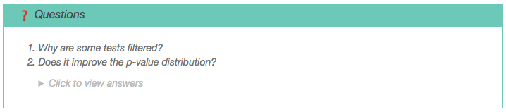

# Introduction
{:.no_toc}

Galaxy is a great solution to train the bioinformatics concepts:

- numerous bioinformatics tools are available (almost 5,000 in the [ToolShed](https://toolshed.g2.bx.psu.edu/))
- it can be used by people without any computer science skills
- it trains to use technology, outlining available resources and efforts that have made them accessible to researchers
- it is scalable

In 2016 the Galaxy Training Network decided to set up a new infrastructure to ease delivering Galaxy-related training material. The idea was that of providing it as a shared community effort, using open and online-based platforms.

We took inspiration from [Software Carpentry](https://software-carpentry.org), and collected everything [on a GitHub repository](https://github.com/galaxyproject/training-material).
We decided on a structure based on tutorials grouped by topics, and coupled with hands-on sections, thus providing support for on-line self-training as well as workshops. Each tutorial follows the same structure, and comes with a virtualised instance to run the training material everywhere.

In this tutorial, you will learn how to write your first tutorial in Markdown and contribute it to the Galaxy Training Network.

> ### Agenda
>
> In this tutorial, we will deal with:
>
> 1. TOC
> {:toc}
>
{: .agenda}

# Setting up a new tutorial

Here, we want to develop a small tutorial to explain how to use BLAST.

## Clone the Galaxy Training material repository

Before anything, we need to get a local copy of the content of the GitHub repository by cloning it

> ###  Hands-on: Clone the GitHub repository
>
> 1. Clone the repository locally with: `git clone https://github.com/galaxyproject/training-material.git`
> 2. Check that you have the same structure as the one in [GitHub](https://github.com/galaxyproject/training-material)
{: .hands_on}

## Defining the topic

The first step we need to define is in which topic to place our new tutorial. This can be tricky: when we structured the repository, we decided to use as topics the categories that are used in the [ToolShed](https://toolshed.g2.bx.psu.edu/). The ToolShed assigns a category to each tool. Therefore, to decide where to put your tutorial, have a look at which ToolShed's category the main tools in your tutorial belong. For example, this tutorial will rely on the NCBI Blast+ tool.

> ###  Hands-on: Defining the topic for the tutorial
>
> 1. Search for NCBI Blast+ on the [ToolShed](https://toolshed.g2.bx.psu.edu/)
> 2. Check in which category it has been placed
>
>    > ###  Questions
>    >
>    > In which topic will you put the new tutorial?
>    >
>    >    <details>
>    >    <summary>Click to view the answers</summary>
>    >    If we search for [NCBI Blast+ in the ToolShed](https://toolshed.g2.bx.psu.edu/view/devteam/ncbi_blast_plus/7538e2bfcd41), it is placed in 2 categories (bottom): "Next Gen Mappers", and "Sequence Analysis".
>    >    We decided to put it in "Sequence analysis" because this is the most general one for this tutorial.
>    >    </details>
>    {: .question}
{: .hands_on}

## Creating the directory for the tutorial

Once the topic has been chosen, we can finally create the tutorial. A tutorial in the Galaxy Training Network contains:
- the tutorial's content
- the tutorial's metadata (description)
- the tutorial's technical support, such as the needed tools and datasets
- a workflow
- a Galaxy Interactive Tour

To ease this process, we created a template for new tutorials, complete with all aforementioned requirements.

> ###  Hands-on: Copy the required files
>
> 1. Copy the `tutorial1` directory (you can find it in `templates/tutorials/`) in `topics/sequence-analysis/tutorials`
> 2. Rename the copied directory to `similarity-search`
{: .hands_on}

## Keeping track of the changes

You need to keep track of all your new changes with a version control system (VCS). To do so, you will use Git as VCS, and GitHub as your personal hosting service.

This repository of tutorials is developed collaboratively among more than 40 contributors. Therefore, to ease the collaboration, we are using the [GitHub flow](https://guides.github.com/introduction/flow/) approach, which is based on forks, branches, and pull requests.
Let's start tracking your changes!

> ###  Hands-on: Start keeping track of the changes
>
> 1. [Create a fork](https://help.github.com/articles/fork-a-repo/) of this repository on GitHub. Your account will contain a copy of the original collaboratively developed training material
> 2. Link your fork on GitHub to the local (cloned) copy on your machine:
>     `git remote add fork https://github.com/<YOUR_GITHUB_USERNAME>/training-material`
> 3. Create a new branch called "similarity-search" in your local copy:
>     `git checkout -b similarity-search`
> 4. Add your changes to the new branch:
>     `git add topics/sequence-analysis/tutorials/similarity-search`
> 5. Commit your changes in that branch:
>     `git commit -m "Set up the similarity search tutorial"`
> 6. Push the new branch to your fork on GitHub:
>     `git push fork similarity-search`
{: .hands_on}

The GitHub interface can also help you in the process of editing a file. It will automatically create a fork of this repository where you can safely work.

We will now start to fill the different files together. We recommend you to commit your changes regularly: it helps following them, but also revert them if needed.


# Filling the tutorial content

Once we set up the infrastructure, we are ready to write the tutorial

## Finding a good toy dataset

The first question to come is what data to use for walking the tutorial through the hands-on sections. The selected data must be informative enough to illustrate the meaning of using a tool or a given technique, but not too big to require long waiting times for its processing during a workshop. Typically, the selected data should be the informative subset of a full real-life dataset.

For example for our tutorial, we generated a small dataset by

- Taking one 16S sequences (used for test of a Galaxy tool)
- Generating a reference database
    - Blasting it on the NR database on [NCBI Blast](https://blast.ncbi.nlm.nih.gov/Blast.cgi?PROGRAM=blastn&PAGE_TYPE=BlastSearch&LINK_LOC=blasthome)
    - Extracting one similar sequence found with Blast
    - Searching and extracting 2 other sequences of the same species using the [NCBI Nucleotide database](https://www.ncbi.nlm.nih.gov/nuccore)

We then developed the tutorial and tested it on this toy dataset. Once we were ready to share it, we uploaded the toy datasets on [Zenodo](https://zenodo.org/) to obtain a dedicated DOI (in the [Galaxy training network community](https://zenodo.org/communities/galaxy-training/?page=1&size=20)).

## Filling the tutorial

The tutorial's content will be placed in the file `tutorial.md`. Its syntax and structure are simple, and will follow the scheme:

```
---
layout: tutorial_hands_on
topic_name: training
tutorial_name: create-new-tutorial
---
# Introduction
{:.no_toc}

blabla

# Section 1

blabla

## Subsection 1

blabla

# Section 2

blabla

## Subsection 2

blabla

# Conclusion
{:.no_toc}

blabla
```

### Metadata

The tutorial needs to start with some medatada on its top:

- `layout: tutorial_hands_on` (keep the default)
- `topic_name: training` with the name of the topic
- `tutorial_name: create-new-tutorial` with the name of tutorial

These metadata are there to help the templating system linking between the tutorial's file and the global [metadata]({{site.baseurl}}/topics/training/tutorials/create-new-tutorial-metadata/tutorial.html).
If not correctly defined, the tutorial will not be found within the website.

> ###  Hands-on: Fix the top metadata
>
> 1. Change the `tutorial_name` and the `topic_name` to fit to the ones defined in the metadata
> 2. Check if the tutorial has been correctly added at [http://localhost:4000/training-material/topics/sequence-analysis/similarity-search ](http://localhost:4000/training-material/topics/sequence-analysis/similarity-search)
{: .hands_on}

### Content

The tutorial's content is written directly after the short section of metadata. This is written in Markdown, a simple markup langage.

> ###  Tip: Markdown
>
> Check [this cheatsheet](https://github.com/adam-p/markdown-here/wiki/Markdown-Cheatsheet) to learn more how to use Markdown.
{: .tip}

The Markdown content is then transformed into a user friendly webpage throughout a templating system. With this approach, there is no need to add the name of every tutorial each time, since they are automatically added based on the tutorial's metadata.

We recommend to structure the tutorials as follows:

- An introduction, to bring an overview of the tutorial with its use cases, data, and methods
- Multiple sections, representing the steps of the analysis, complete with their hands-on parts (practicing is an important part of the learning process)
- A conclusion to summarize what has been done in the tutorial (with a scheme)

> ###  Hands-on: Structuring the tutorial
>
> 1. Add a small description of the dataset
> 2. Add one or two sections with ideas for the tutorial
> 3. Add a small conclusion
{: .hands_on}

> ###  Tip: Adding images with caption
>
> To add an image in Markdown file, we need to use ``.
>
> We added a small plugin to add a caption for each image:
>
> 
>
> The preceding string "Figure" and its corresponding number is automatically added before its caption, which is in turn placed below the image by providing all informations in the Markdown call of the image:
>
>   ```
>   
>   ```
>
> We can also cross-reference images inside our Markdown with an anchor. For example, we can link to [the previous figure](#figure-1) using `[the display text](#figure-nb)` (changing `nb` with the image's number).
{: .tip}

> ###  Tip: Writing mathematical expressions
>
> Mathematical expressions can be written in LaTeX, and rendered with [MathJax](https://www.mathjax.org/).
>
> Surround your math expression with two `$` signs (like in LaTeX math blocks):
>
> - inline expressions, *e.g.* `$$ 5 + 5 $$` will be rendered as $$ 5 + 5 $$
> - block expressions, *e.g.* `$$ 5 + 5 $$` will be rendered in its own line block as
>
>   $$ 5 + 5 $$
>
>
> Dollar signs are therefore *reserved characters* for instructing the templating system to open/close LaTeX math blocks. In case you don't want any math block to be opened/closed, but still be able to write a dollar sign, you have to *escape* it. Escaping enables the templating system to render the escaped character as a normal character.
>
>    > ###  Comments
>    > LaTeX code that uses the pipe symbol `|` in inline math statements may lead to a line being recognized as a table line by the templating system.
>    > This can be avoided by using the `\vert` command instead of `|`
>    {: .comment}
{: .tip}

### Improving the learning experience

To improve the learning experience in our tutorial, we defined some boxes to highlight their content.

They are defined always with the same structure:

```
> ### <an emoji> Type of box: Name of the box
> list
{: .type_of_box}
```

For a correct rendering of the tutorial's content, the templating system requires this structure to be kept as it.
The different defined boxes are:

- Overview

    This box at the top of each tutorial is automatically generated using the metadata we defined

    > ###  Hands-on: Checking the metadata
    >
    > 1. Check that the metadata added previously are correctly filling the overview box
    >
    >    > ###  Questions
    >    >
    >    > What metadata hasn't been added to this box?
    >    >
    >    >    <details>
    >    >    <summary>Click to view the answers</summary>
    >    >    The take-home messages are not added to this box but into the last box of the tutorial
    >    >    </details>
    >    {: .question}
    {: .hands_on}

- Agenda

    In most tutorial, the second box is the agenda box at the end of the introduction. It indicates the plan of the tutorial

        > ### Agenda
        >
        > In this tutorial we will deal with:
        >
        > 1. TOC
        > {:toc}
        >
        {: .agenda}

    No need to fill the list, since this will be done automatically reusing each section's title.

    To avoid adding the "Introduction" and "Conclusion", we add `{:.no_toc}` below the section name.

    

    > ###  Hands-on: Add an agenda box to the tutorial
    >
    > 1. Add an agenda box to the tutorial that fit the structure we defined previously
    {: .hands_on}

- Hands-on

    We think that actually walking through the tutorial by doing all its steps is important for learning its concepts. We therefore emphasize trying each step by regularly adding hands-on sections, where trainees are encouraged to do the analysis by themselves. We designed some special boxes to make these sections easy to find.

        > ###  Hands-on: Sorting BAM dataset
        >
        > 1. **Sort BAM dataset** : Sort the paired-end BAM file by "Read names" with **Sort BAM
        {: .hands_on}

    

    with the

    - `` emoji to define that is an hands-on
    - Short imperative sentence to make it easy to identify the tasks
    - Name of the tool in bold with the `` emoji to make it easy to identify a Galaxy tool
    - Parameters for the tool as a sublist<br/>
    <br/>

    > ###  Hands-on: Add an hands-on box
    >
    > 1. Add a hands-on box to run a BLAST of the small sequence dataset against the chosen database
    {: .hands_on}

-  Questions

    Questions are there to force the trainees to think about what they are currently doing, and to put things in perspective.
    They also help the instructors by exposing and clarify common scenarios, errors, or applications.

        > ###  Questions
        >
        > 1. Why are some tests filtered?
        > 2. Does it improve the *p*-value distribution?
        >
        >    <details>
        >    <summary>Click to view the answers</summary>
        >    Content goes here.
        >    </details>
        {: .question}

    

    Questions have to be quick to answer, and answers can be also provided as multiple choices (MCQs).
    With well choosen wrong answers, MCQs can do much more than just measure how much someone knows.

    In the box below and hidden we add also the correct answer, so that self-trainees can check the solution and its explanation.

    > ###  Hands-on: Add a question box
    >
    > 1. Add an hands-on box to construct the BLAST database
    {: .hands_on}

- Tips

        > ###  Tip: Importing data via links
        >
        > * Copy the link location
        > * Open the Galaxy Upload Manager
        > * Select **Paste/Fetch Data**
        > * Paste the link into the text field
        > * Press **Start**
        {: .tip}

    

- Comments

        > ###  Comments
        > - Edit the "Database/Build" to select "dm3"
        > - Rename the datasets according to the samples
        {: .comment}

    

- Key points

    This last box of the tutorial is automatically filled with the take-home messages defined in the metadata


To render the boxes correctly, the syntax needs to be correct. If it does't work, have a look at similar tutorials and get inspiration.
Boxes can be nested, *e.g.* for having tips inside a hands-on:

```
> ###  Hands-on: Defining the topic for the tutorial
>
> 1. Search for NCBI Blast+ on the [ToolShed](https://toolshed.g2.bx.psu.edu/)
> 2. Check in which category it is
>
>    > ###  Questions
>    >
>    > In which topic will you put the tutorial?
>    >
>    >    <details>
>    >    <summary>Click to view the answers</summary>
>    >    If we search for [NCBI Blast+ in the ToolShed](https://toolshed.g2.bx.psu.edu/view/devteam/ncbi_blast_plus/7538e2bfcd41), it is attributed to 2 categories (bottom): "Next Gen Mappers" and "Sequence Analysis".
>    >    We decided to put it in "Sequence analysis" because this is the most general one for this tutorial.
>    >    </details>
>    {: .question}
{: .hands_on}
```

# Adding slides (optional)

Sometimes we also need slides to support the tutorial's topics. With the current infrastructure we are able to also provide this functionality, and integrate a tutorial with further support material.

Although the slide file's extension is .html, all slides are written in Markdown as well, and their content is rendered as a webpage thanks to [`Remark`](https://remarkjs.com). However, adding slides is not enough: we first need to tell the templating system to search for them by changing `slides` in the metadata from `no` to `yes`.

Once it is done, the slides for our tutorial will be accessible at [http://localhost:4000/topics/sequence-analysis/tutorials/similarity-search/slides.html ](http://localhost:4000/topics/sequence-analysis/tutorials/similarity-search/slides.html)

We can now fill the `slides.html` file as follows:


```
---
layout: tutorial_slides
topic_name: "sequence-analysis"
tutorial_name: search-similarity
logo: "GTN"
---

# What is similarity search?

---

### What is blast?


---

### Next slide
```

On the top, as for the tutorial's `tutorial.md`, we need to define some metadata to link the slides with the corresponding tutorial. The metadata of the tutorial can then be used also to automatically fill the first slides (with the title, requirements, etc)  and the last slide (take-home message).

Each new slide is introduced by `---`, and the content of each slide is written in Markdown.

> ###  Hands-on: Add some slides for the tutorial
>
> 1. Add a few slides to explain the similarity search
> 2. Make sure they are accessible and correctly generated
{: .hands_on}

# Conclusion
{:.no_toc}

> ### Developing GTN training material
>
> This tutorial is part of a series to develop GTN training material, feel free to also look at:
>
> 1. [Writing content in markdown](../create-new-tutorial-content/tutorial.html)
> 1. [Defining metadata](../create-new-tutorial-metadata/tutorial.html)
> 1. [Setting up the infrastructure](../create-new-tutorial-jekyll/tutorial.html)
> 1. [Creating Interactive Galaxy Tours](../create-new-tutorial-tours/tutorial.html)
> 1. [Building a Docker flavor](../create-new-tutorial-docker/tutorial.html)
> 1. [Submitting the new tutorial to the GitHub repository](../../../dev/tutorials/github-contribution/slides.html)
{: .agenda}
