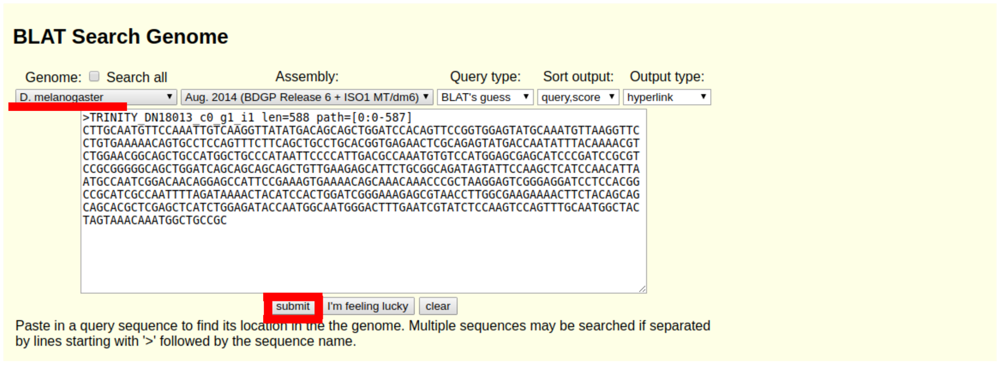

> <agenda-title></agenda-title>
>
> In this tutorial, we will cover:
>
> 1. TOC
> {:toc}
>
{: .agenda}

# Introduction

We chose D. melanogaster for its relatively small genome (to scale for the time/memory requirements of our experiments), for its ability to produce alternative isoforms (as a Eukaryota), and because it is a well-known species: a reference genome is available.
This is where we got the data: https://www.ncbi.nlm.nih.gov/sra/SRX675217

 <question-title>Question</question-title>
>
> 1. Write here the characteristics of the complete sequencing dataset:
>    
>    ●	Run accession id
>    
>    ●	Sequencing technology
>    
>    ●	Library preparation
>    
>    ●	Single / Paired-end ?
>    
>    ●	Number of reads 
>
> > <solution-title>Solution</solution-title>
> >
> >     ●	Run accession id: SRX675217
> >     ●	Sequencing technology: Illumina HiSeq 2000
> >     ●	Library preparation: RNA-seq (cDNA)
> >     ●	Single / Paired-end ?:  Single
> >     ●	Number of reads: 10.4M
> >
> {: .solution}
>
{: .question}

For this practical workshop, we built a reduced dataset (11421 SE reads):
1.	9 regions of interest from the 2L chromosome were selected
2.	Reads that aligned onto those regions were extracted (= 7245 reads)
3.	Reads with adapter sequences were added (+ 2176 reads)
4.	rRNA reads were added (+ 2000 reads)

#  Cleaning - Pre-processing

## Datasets preparation

> <hands-on-title> Data Upload </hands-on-title>
>
> 1. Create a new history for this tutorial
> 2. Import the files from [Zenodo]({{ page.zenodo_link }}) or from
>    the shared data library (`GTN - Material` -> `{{ page.topic_name }}`
>     -> `{{ page.title }}`):
>
>    
>
>    
>
> 3. Check that the datatype
{: .hands_on}

## Initial quality control with **FastQC**

> <hands-on-title> Run FastQC on the raw dataset </hands-on-title>
>
>  with the following parameters:
>    -  *"Raw read data from your current history"*: `SRR1543719.sample.fastqsanger`
{: .hands_on}

> <question-title>Question</question-title>
> 1. How many reads are in this dataset?
> 2. What sequencing length was used?
> 3. How would you qualify the sequencing quality of this run?
> 4. Are there any quality problems we should deal with? 
>
> > <solution-title>Solution</solution-title>
> >
> > 1. 11421 reads
> > 2. 76
> > 3. Correct
> > 4. Per base sequence content /Per sequence GC content / Adapter content / Overrepresented sequences
> >
> {: .solution}
>
{: .question}

## Quality trimming/filtering - Adapter sequences removal with **Trimmomatic**

> <hands-on-title> Run Trimmomatic on the raw dataset </hands-on-title>
>
> 1.  with the following parameters:
>    - *"Single-end or paired-end reads?"*: `Single-end`
>        -  *"Input FASTQ file"*: `SRR1543719.sample.fastqsanger`
>    - *"Perform initial ILLUMINACLIP step?"*: `Yes`
>    - In *"Trimmomatic Operation"*:
>        -  *"Insert Trimmomatic Operation"*
>            - *"Select Trimmomatic operation to perform"*: `Sliding window trimming (SLIDINGWINDOW)`
>        -  *"Insert Trimmomatic Operation"*
>            - *"Select Trimmomatic operation to perform"*: `Drop reads with average quality lower than a specified level (AVGQUAL)`
>                - *"Minimum average quality required to keep a read"*: `25`
>        -  *"Insert Trimmomatic Operation"*
>            - *"Select Trimmomatic operation to perform"*: `Drop reads below a specified length (MINLEN)`
>                - *"Minimum length of reads to be kept"*: `50`
>    - *"Output trimmomatic log messages?"*: `Yes`
>      
> 2. Rename the cleaned dataset “SRR1543719.sample.trimmomatic.fq”
{: .hands_on}

> <question-title>Question</question-title>
>
> 1. Which adapter sequences should we use? 
>
> > <solution-title>Solution</solution-title>
> >
> > 1. TruSeq3
> >
> {: .solution}
>
{: .question}

## Intermediate quality control wit with **FastQC**

> <hands-on-title> Run FastQC on the cleaned dataset </hands-on-title>
>
> 1.  with the following parameters:
>    -  *"Raw read data from your current history"*: `fastq_out` (output of **Trimmomatic** )
>
> > <tip-title>**Quality comparison with MultiQC**</tip-title>
> >
> > -  with the following parameters:
> >   - In *"Results"*:
> >     -  *"Insert Results"*
> >       - *"Which tool was used generate logs?"*: `FastQC`
> >         - In *"FastQC output"*:
> >           -  *"Insert FastQC output"*
> >             -  *"FastQC output"*: `text_file` (output of **FastQC** )
> >       -  *"Insert Results"*
> >         - *"Which tool was used generate logs?"*: `FastQC`
> >           - In *"FastQC output"*:
> >             -  *"Insert FastQC output"*
> >             -    *"FastQC output"*: `text_file` (output of **FastQC** )
> >   -   *"Report title"*: `RAw data VS Cleaned data`
> >      
>    {: .tip}
>
{: .hands_on}

> <question-title>Question</question-title>
>
> 1. How many reads are left after this cleaning step? 
> 2. Compare the quality graphs between the raw and cleaned datasets. What do you observe?
> 3. What is the influence of the strimming/filtering parameters? Try re-running Trimmomatic after changing the quality thresholds.
> 4. What can you say about the read lengths?
> 5. Are there any adapter sequences left? 
>
> > <solution-title>Solution</solution-title>
> >
> > 1. 9946 reads
> > 2. Better quality for cleaned data
> > 3. - Remove the adapters
> >    - truncate the read portions of 4bp having a minimum quality of 20
> >    - remove the reads having a quality lower than 25 and those smaller than 50bp.
> > 4. Distribution of read length around 76 bp
> > 5. Less than 4% of adapters from 60bp
> > 
> {: .solution}
>
{: .question}

## rRNA sequences removal with **Filter with SortMeRNA**

> <hands-on-title> Run SortMeRNA on the quality cleaned dataset </hands-on-title>
>
> 1.  with the following parameters:
>    - *"Sequencing type"*: `Reads are not paired`
>        -  *"Querying sequences"*: `fastq_out` (output of **Trimmomatic** )
>    - *"Databases to query"*: `Databases from your history`
>        -  *"rRNA databases"*: `silva-euk-28s-id98.fasta`, `silva-euk-18s-id95.fasta`, `silva-bac-23s-id98.fasta`, `silva-bac-16s-id90.fasta`, `silva-arc-23s-id98.fasta`, `silva-arc-16s-id95.fasta`, `rfam-5s-database-id98.fasta`, `rfam-5.8s-database-id98.fasta`
>    - *"Include aligned reads in FASTA/FASTQ format?"*: `Yes (--fastx)`
>        - *"Include rejected reads file?"*: `Yes`
>    - *"Generate statistics file"*: `Yes`
>    - *"Alignment report"*: `Do not report alignments`
>      
> 2. Step 2 - Rename the non-rRNA reads file “SRR1543719.sample.trimmomatic.non_rna.fq”
>    
> 4. Run  on the non-rNRA reads file, with the following parameters:
>    -  *"Raw read data from your current history"*: `output_other` (output of **Filter with SortMeRNA** )
>      
{: .hands_on}

> <question-title>Question</question-title>
>
> 1. Which file contains the non-rRNA reads? 
> 2. How many reads are left after rRNA removal?
> 3. What changes in the FastQC metrics and graphs do you see after this step?
> 4. Looking at SortMeRNA logs, what can you say about the taxonomic composition of this sample?
> 5. Was this a helpful step? Try to think ahead and imagine a scenario in which removing the rRNA sequences would greatly simplify or improve the downstream analysis?
>
> > <solution-title> Solution </solution-title>
> >
> > 1. Unaligned reads
> > 2. 7727 reads
> > 3. There are fewer over-represented sequences.
> > 4. ?
> > 5. Remove noise source RNAs, i.e. RNAs that are not targeted.
> >  
> {: .solution}
>
{: .question}

# With-reference RNA-seq analysis

## Datasets preparation
> <hands-on-title> Steps </hands-on-title>
>
> 
> 1. Create a new history called “With reference RNA-seq”
> 2. Copy the non-rRNA reads file from the “Cleaning” history into this new history
>  
> 4. Rename the non-rRNA reads file something like “SRR1543719.sample.cleaned.fq”
> 
> 6. Copy the following datasets from the shared history “Initial datasets” into the “With reference RNA-seq” history:
>    
>    ●	reference genome: “D_melanogaster.BDGP6.22.dna.toplevel.fa”
> 
>    ●	genome annotation: “D_melanogaster.BDGP6.22.96.gtf”
> 
>    ●	reference transcriptome: “D_melanogaster.BDGP6.22.cdna.all.fa”

## Alignment against the reference genome with **HISAT2**

> <hands-on-title> Run HISAT2 to align the cleaned reads against the reference genome </hands-on-title>
>
> 1.  with the following parameters:
>    - *"Source for the reference genome"*: `Use a genome from history`
>        -  *"Select the reference genome"*: `D_melanogaster.BDGP6.22.dna.toplevel.fa` 
>    - *"Is this a single or paired library"*: `Single-end`
>        -  *"FASTA/Q file"*: `output_other` (output of **Filter with SortMeRNA** )
>    - In *"Summary Options"*:
>        - *"Output alignment summary in a more machine-friendly style."*: `Yes`
>        - *"Print alignment summary to a file."*: `Yes`
>          
> 2. Rename the BAM file “SRR1543719.sample.cleaned.hisat2.bam”
>
{: .hands_on}

> <question-title> Question </question-title>
>
> 1. How many reads were mapped? 
> 2. How many reads have multiple alignments? 
>
> > <solution-title> Solution </solution-title>
> >
> > 1. 9.74% (58 + 7396)
> > 2. 58 reads
> >
> {: .solution}
>
{: .question}

***TODO***: *IGV part with screenshot* 

## Gene expression counting with **featureCounts**

> <hands-on-title> Run featureCounts on the aligned reads file (BAM) </hands-on-title>
>
> 1.  with the following parameters:
>    -  *"Alignment file"*: `output_alignments` (output of **HISAT2** )
>    - *"Gene annotation file"*: `A GFF/GTF file in your history`
>        -  *"Gene annotation file"*: `D_melanogaster.BDGP6.22.96.gtf`
>    - *"Output format"*: `Gene-ID "\t" read-count (MultiQC/DESeq2/edgeR/limma-voom compatible)`
>    - *"Does the input have read pairs?"*: `No, single-end.`
>
> 2. Rename the counts file something like "SRR1543719.sample.cleaned.hisat2.featureCounts.gene_counts.tab"
>
> 3. Keep only genes with count >= 10 (keep the headers):
>     with the following parameters:
>    -  *"Filter"*: `output_short` (output of **featureCounts** )
>    - *"With following condition"*: `c2>=10`
>    - *"Number of header lines to skip"*: `0`
>
> 4.  Rename the filtered counts file "SRR1543719.sample.cleaned.hisat2.featureCounts.gene_counts.filtered.tab"
>    
{: .hands_on}

> <question-title> Question </question-title>
>
> 1. How many reads were:
>    ●	used to count gene expression? 
>    ●	excluded because of mapping quality? 
>    ●	not aligned on any gene? 
>    ●	aligned on multiple genes at once?
> 
> 3. How many genes are expressed at all?
>     
> > <tip-title> Help </tip-title>
> >
> >  with the following parameters:
> >   -  *"Filter"*: `output_short` (output of **featureCounts** )
> >   - *"With following condition"*: `c2>=10`
> >   - *"Number of header lines to skip"*: `0`
>    {: .tip}
>
> > <solution-title> Solution </solution-title>
> >
> > 1. ●	used to count gene expression? 5705
> >    ●	excluded because of mapping quality? 0
> >    ●	not aligned on any gene? 1179
> >    ●	aligned on multiple genes at once? 181
> >    
> > 2. 21 genes
> >
> {: .solution}
>
{: .question}

## Transcriptome assembly with reference with **StringTie**

> <hands-on-title> Run StringTie on the aligned reads file </hands-on-title>
>
> 1.  with the following parameters:
>    -  *"Input mapped reads"*: `output_alignments` (output of **HISAT2** )
>    - *"Use a reference file to guide assembly?"*: `Use reference GTF/GFF3`
>        - *"Reference file"*: `Use a file from history`
>            -  *"GTF/GFF3 dataset to guide assembly"*:`D_melanogaster.BDGP6.22.96.gtf`
>        - *"Output files for differential expression?"*: `DESeq2/edgeR/limma-voom`
>    - In *"Advanced Options"*:
>        - *"Output gene abundance estimation file?"*: `Yes`
>          
> 2. Rename the assembled transcripts file "SRR1543719.sample.cleaned.stringtie.transcripts.gtf"
>
> 3. Rename the gene and transcript count files "SRR1543719.sample.cleaned.stringtie.gene_counts.tab" and "SRR1543719.sample.cleaned.stringtie.transcript_counts.tab"
>
{: .hands_on}

> <question-title> Question </question-title>
>
> 1. How many transcripts were assembled by StringTie? 
> 2. How many genes do these transcripts represent?
> 3. Where are these genes located? What do you think about it?
> 4. How many genes are supported by at least 10 reads? 
>
> > <solution-title> Solution </solution-title>
> >
> > 1. 24 transcripts
> > 2. 13 genes
> > 3. Chr X , 3R, 2L, rDNA
> > 4. 10 genes
> >
> {: .solution}
>
{: .question}

***TODO***: *IGV part with screenshot*

## Gene/Transcript expression estimation by pseudo-mapping with **Salmon quant**

> <hands-on-title> Run Salmon on the cleaned reads against the reference transcriptome </hands-on-title>
>
> 1.  with the following parameters:
>    - *"Select salmon quantification mode:"*: `Reads`
>        - *"Select a reference transcriptome from your history or use a built-in index?"*: `Use one from the history`
>            - In *"Salmon index"*:
>                -  *"Transcripts FASTA file"*: `D_melanogaster.BDGP6.22.cdna.all.fa`
>                - {% icon param-file % *"Reference genome"* : `D_melanogaster.BDGP6.22.dna.toplevel.fa`
>        - In *"Data input"*:
>            - *"Is this library mate-paired?"*: `Single-end`
>                -  *"FASTQ/FASTA file"*: `output_other` (output of **Filter with SortMeRNA** )
>                - *"Specify the strandedness of the reads"*: `Infer automatically (A)`
>    -  *"File containing a mapping of transcripts to genes"*: `D_melanogaster.BDGP6.22.96.gtf`
>
> 2. Rename the gene and transcript quantification files something like "SRR1543719.sample.cleaned.salmon.gene_quantif.tab" and "SRR1543719.sample.cleaned.salmon.transcript_quantif.tab"
>
> 3. Using “cut” on the the gene quantification file, keep only the columns containing the gene IDs and the gene pseudo-counts.
>     with the following parameters:
>    - *"Cut columns"*: `c1,c5`
>    -  *"From"*: `output_gene_quant` (output of **Salmon quant** )
>
> 4. Filter the previous file to keep only genes with pseudo-count >= 10 (keep the headers).
>     with the following parameters:
>    -  *"Filter"*: `out_file1` (output of **Cut** )
>    - *"With following condition"*: `c2>=10`
>    - *"Number of header lines to skip"*: `0`
>
> 6. Join the Salmon gene quantification file with the featureCounts gene count file.
>     with the following parameters:
>    -  *"1st file"*: `out_file1` (output of **Filter** )
>    - *"Column to use from 1st file"*: `c1`
>    -  *"2nd File"*: `out_file1` (output of **Filter** )
>    - *"Column to use from 2nd file"*: `c1`
>    - *"Value to put in unpaired (empty) fields"*: `NA`
>
> 7. Rename the joined file something like "SRR1543719.sample.cleaned.gene_quantif_matrix.tab".
>
{: .hands_on}

> <question-title> Question </question-title>
>
> 1. According to Salmon, how many genes are expressed at all? 
> 2. Why Salmon quantification files cannot be called “count” files?
> 3. What can you tell about the gene expression values estimated by mapping vs. pseudo-mapping?
> 4. Why do you think Salmon identifies more genes expressed than the mapping pipeline? 
>
> > <solution-title> Solution </solution-title>
> >
> > 1. 17 genes.
> > 2. quantify the abundance of reads and do not count (float).
> > 3. Pseudo mapping overestimates gene expression.
> > 4. It is based on the reference transcriptome and not on the genome. Thus, there is no ambiguity with the isoforms.
> >
> {: .solution}
>
{: .question}

***TODO***: *IGV part with screenshot*

# TP *De Novo* transcriptome analysis

**Goal**: We will assemble the cleaned reads to obtain RNA transcripts. We intend to obtain a reference transcriptome using assembly techniques, without relying on a reference genome (de novo). In our case, we study a sample of the reads. Therefore we will build a small part of the entire transcriptome and a short list of variants.

**Tools**: as mentioned in the course, we will use Trinity for full-length transcript assembly (https://github.com/trinityrnaseq/trinityrnaseq/wiki).

## Transcripts assembly with **Trinity**

> <hands-on-title> Launch Trinity in Galaxy </hands-on-title>
>
> 1.  with the following parameters:
>    - *"Are you pooling sequence datasets?"*: `Yes`
>        - *"Paired or Single-end data?"*: `Single-end`
>            -  *"Single-end reads"*: `output_other` (output of **Filter with SortMeRNA** )
>            - *"Strand specific data"*: `No`
>    - In *"Additional Options"*:
>        - *"Use the genome guided mode?"*: `No`
{: .hands_on}

> <question-title> Preliminary question </question-title>
>
> 1. Which parameters should you set? Notice that:
>     ●	Reads are single-end.
>     ●	The read bank: is non-stranded.
> 2. When Trinity is finished, how many contigs are output?
> 
> >  <solution-title> Solution </solution-title>
> > 
> > 1. ●	Reads are single-end: `Paired or Single-end data?`
> >    ●	The read bank: is non-stranded: `Strand specific data.`
> > 2. 115 contigs
> > 
>  {: .solution}
> 
{: .question}

## Assembly and contig visualization with BLAT

To visualize Trinity contigs, we will use the BLAT tool from UCSC. Even though its index strategy differs, this tool is conceptually very close to the aligner BLAST. It will allow us to align the contigs to the reference genome and then display the alignments.

> <hands-on-title> Here’s a small how-to: </hands-on-title>
>
> 1. Copy the sequence you want to visualize.
>    
> 3. Paste it in the BLAT field at UCSC’s website (https://genome.ucsc.edu in your web browser), then check the parameters (genome)
>    
> 
> 
> 4. Compute the contig to genome alignment using Submit
> 
> 
> 
> 6. Select the most suited alignment if there are several of them. To do so, not only you will check the IDENTITY, but also START, END, QSIZE results
>    
> 
>
{: .hands_on}

> <question-title> Question about contigs visualization </question-title>
>
> 1. What START, END, QSIZE columns stand for in the BLAT result? Why is identity result not always sufficient?
> 2. How to distinguish exons and introns displays? Recognize your query, versus the annotated transcripts.
> 3. Have a look at some contigs using BLAT. Observe the following properties:
>    - On which chromosome do they align? 
>    - Are they fully aligned? 
>    - Do you notice multiple mapping (several loci)? 
>    - How many exons are included in your contigs?
>    - Is your contig appearing in annotations?
> 
> >  <solution-title> Solution </solution-title>
> > 
> > 1. - **START**: start of the alignment of our contig.
> >    - **END**: end of the alignment of our contig.
> >    - **QSIZE**: size of the aligned contig.
> >   Identity does not take alignment size into accountIdentity does not take alignment size into account.
> > 2. The beginning and end of the exons are colored blue, when we access the details.
> > 3. - **On which chromosome do they align?** Chr 2L and Chr 3R
> >    - **Are they fully aligned?** Not really, miss the first position.
> >    - **Do you notice multiple mapping (several loci)?** Yes, caused by introns
> >    - **How many exons are included in your contigs?** 4 exons
> >    - **Is your contig appearing in annotations?** Yes
> > 
>  {: .solution}
> 
{: .question}

> <comment-title>To go further with assembly...</comment-title>
> - We would rely on TransRate or RNAQuast to proof-check our assembly results (see course)
> - We would annotate our contigs (for instance with BUSCO)
{: .comment}

# Conclusion

 Congratulations on successfully completing this tutorial!
