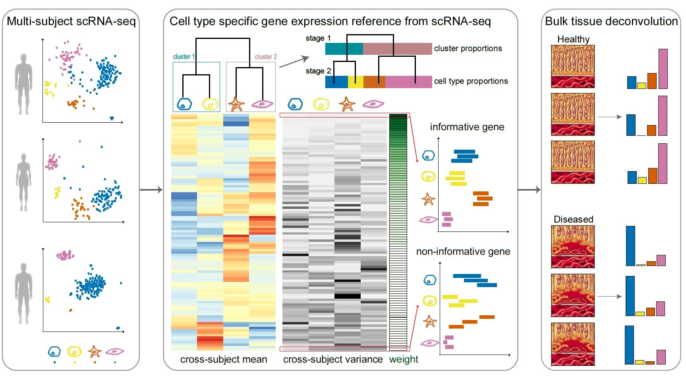

# Introduction
{:.no_toc}

<!-- @Wendi - I'm using info from here: https://xuranw.github.io/MuSiC/articles/MuSiC.html -->

Bulk RNA-seq expression data obtained from RNA-sequencing contains a mixture of the expression of several types of cells. We wish to deconvolve this data to obtain more precise estimates of the proportions of this type of data.

By combining bulk data with multi-subject single cell expression data obtained from single-cell RNA-sequencing, we can use this as a reference for estimating the cell type proportions in the bulk data.

In this tutorial we will be using the [MuSiC](https://xuranw.github.io/MuSiC/articles/MuSiC.html) tool suite .


**Please follow our
[tutorial to learn how to fill the Markdown]({{ site.baseurl }}/topics/contributing/tutorials/create-new-tutorial-content/tutorial.html)**

> ### Agenda
>
> In this tutorial, we will cover:
>
> 1. TOC
> {:toc}
>
{: .agenda}

# Bulk RNA-seq Cell Type Deconvolution

Explanation of some terms


## Background

What is deconvoltion and why is it needed.


## MusiC

MuSiC utilizes cell-type specific gene expression from single-cell RNA sequencing (RNA-seq) data to characterize cell type compositions from bulk RNA-seq data in complex tissues. By appropriate weighting of genes showing cross-subject and cross-cell consistency, MuSiC enables the transfer of cell type-specific gene expression information from one dataset to another.

Solid tissues often contain closely related cell types which leads to collinearity. To deal with collinearity, MuSiC employs a tree-guided procedure that recursively zooms in on closely related cell types. Briefly, we first group similar cell types into the same cluster and estimate cluster proportions, then recursively repeat this procedure within each cluster.



## Expression Set

Expression Set objects are a datatype class to contain and describe high-throughput expression level assays. They are a container for high-throughput assays and experimental metadata. ExpressionSet class is derived from eSet, and requires a matrix named exprs as assayData member.

The ExpressionSet class is designed to combine several different sources of information into a single convenient structure. An ExpressionSet can be manipulated (e.g., subsetted, copied) conveniently, and is the input or output from many Bioconductor functions.

The data in an ExpressionSet is complicated, consisting of expression data from microarray experiments (assayData; assayData is used to hint at the methods used to access different data components, as we will see below), ‘meta-data’ describing samples in the experiment (phenoData), annotations and meta-data about the features on the chip or technology used for the experiment (featureData, annotation), information related to the protocol used for processing each sample (and usually extracted from manufacturer files, protocolData), and a flexible structure to describe the experiment (experimentData). The ExpressionSet
class coordinates all of this data, so that you do not usually have to worry about the details.


# Workflow Overview 

In this tutorial we will be constructing  ExpressionSet objects, inspecting, and annotating them, and then finally processing them with the MuSiC RNA-Deconvolution analysis suite.

Below is an overview of the workflow that will be used throughout this tutorial.


Note how two ExpressionSet objects are constructed: one from bulk RNA-seq tabular assay data, and the other from single-cell RNA-seq tabular assay data. A blind analysis of cell proportion estimation is performed, along side a guided analysis using pre-grouped cell types.


# Cell Proportion Estimation

Here we will extract cell proportions from a bulk data of **XXX TISSUE TYPE** from **CITE ET AL**, using a single cell dataset from **CITE ET AL** containing **XXX LIST OF CELL TYPES**. If the deconvolution is good, and that datasets are compatible with sufficient enough overlap, we should be able to reprise the same cell types from the bulk data.

## Get data

> ###  Hands-on: Data upload
>
> 1. Create a new history for this tutorial
> 2. Import the files from [Zenodo]({{ page.zenodo_link }}) or from
>    the shared data library (`GTN - Material` -> `{{ page.topic_name }}`
>     -> `{{ page.title }}`):
>
>    ```
>    # bulk RNA datasets
>    https://zenodo.org/record/5554814/files/GSE50244bulkeset.expression.tabular
>    https://zenodo.org/record/5554814/files/GSE50244bulkeset.phenotype.tabular
>    # single-cell RNA datasets
>    https://zenodo.org/record/5554814/files/EMTABesethealthy.expression.tabular
>    https://zenodo.org/record/5554814/files/EMTABesethealthy.phenotype.tabular
>    ```
>
>    
>
>    
>
> 3. Rename the datasets
> 4. Check that the datatype
>
>    
>
> 5. Add to each database a tag corresponding to `#bulk` and `#scrna`
>
>    
>
{: .hands_on}

## Building the Expression Set objects

Here we shall build two ExpressionSet objects corresponding to the bulk and single-cell datatypes. 

## **Construct Expression Set Object**

> ###  Hands-on: Build the Expression Set inputs
>
> 1.  with the following parameters:
>    -  *"Assay Data"*: `bulk_assay.tab` (Input dataset)
>    -  *"Phenotype Data"*: `bulk_pheno.tab` (Input dataset)
>    - In *"Meta Data"*:
>        -  *"Insert Meta Data"*
>            - *"Label"*: `This is a meaningful piece of text`
>    - Execute
>
>    > ###  Comment
>    >
>    > An ExpressionSet object has many data slots, the principle of which are the experiment data, the phenotype data, as well more "meta" data pertaining to experiment information and additional annotations.
>    {: .comment}
>
> 2.  with the following parameters:
>    -  *"Assay Data"*: `scrna_assay.tab` (Input dataset)
>    - *"Annotation"*: `Another meaningful piece of text`
>
{: .hands_on}

## **Inspect Expression Set Object**

We will now inspect these objects we juset created to see what information we can extract out of them, and how these multiple datasets are summarized within the object.

> ###  Hands-on: Viewing General Information
> 1.  Click on the `#scrna` dataset in the history view (output of **Construct Expression Set Object** )
>    - Wait for the dataset to expand and see the properites
{: .hands_on}

> ###  Questions
>
> 1. How many samples are in dataset?
> 2. How many genes?
>
> > ###  Solution
> >
> > 1. XXX Answer for question1
> > 2. XXX Answer for question2
> >
> {: .solution}
>
{: .question}

We can also extract specific information pertaining to Samples or Features:

> ###  Hands-on: Extracting Feature Data
> 1.  with the following parameters:
>    -  *"ESet Dataset"*: `#scrna` (output of **Construct Expression Set Object** )
>    - *"Inspect"*: `Feature Data Table`
>
>    > ###  Comment
>    >
>    > "Features" are synonymous with "genes" in a genomic setting, but data scientists tend to prefer to use the former term, as it can be used in other non-genomic settings.
>    {: .comment}
>
{: .hands_on}

.. and if necessary extract the general information itself as a standalone text-file

> ###  Hands-on: General Information as a text file
>
> 1.  with the following parameters:
>    -  *"ESet Dataset"*: `#scrna` (output of **Construct Expression Set Object** )
>    {: .comment}
>
{: .hands_on}


# Estimating Cell Type proportions

Instead of selecting marker genes, MuSiC gives weights to each gene. The weighting scheme is based on cross-subject variation: up-weigh genes with low variation and down-weigh genes with high variation. Here we demonstrate step by step with the human pancreas datasets.


## Sub-step with **MuSiC**

> ###  Hands-on: Task description
>
> 1.  with the following parameters:
>    -  *"scRNA Dataset"*: `out_rds` (output of **Construct Expression Set Object** )
>    -  *"Bulk RNA Dataset"*: `out_rds` (output of **Construct Expression Set Object** )
>    - *"Purpose"*: `Estimate Proportions`
>        - *"Comma list of cell types to use from scRNA dataset"*: `{'id': 5, 'output_name': 'output'}`
>
>    ***TODO***: *Check parameter descriptions*
>
>    ***TODO***: *Consider adding a comment or tip box*
>
>    > ###  Comment
>    >
>    > A comment about the tool or something else. This box can also be in the main text
>    {: .comment}
>
{: .hands_on}

***TODO***: *Consider adding a question to test the learners understanding of the previous exercise*

> ###  Questions
>
> 1. Question1?
> 2. Question2?
>
> > ###  Solution
> >
> > 1. Answer for question1
> > 2. Answer for question2
> >
> {: .solution}
>
{: .question}

## Sub-step with **MuSiC**

> ###  Hands-on: Task description
>
> 1.  with the following parameters:
>    -  *"scRNA Dataset"*: `out_rds` (output of **Construct Expression Set Object** )
>    -  *"Bulk RNA Dataset"*: `out_rds` (output of **Construct Expression Set Object** )
>    - *"Purpose"*: `Compute Dendrogram`
>        - In *"Cluster Groups"*:
>            -  *"Insert Cluster Groups"*
>                - *"Cluster ID"*: `C1`
>            -  *"Insert Cluster Groups"*
>                - *"Cluster ID"*: `C2`
>                -  *"List of Gene Markers"*: `output` (Input dataset)
>
>    ***TODO***: *Check parameter descriptions*
>
>    ***TODO***: *Consider adding a comment or tip box*
>
>    > ###  Comment
>    >
>    > A comment about the tool or something else. This box can also be in the main text
>    {: .comment}
>
{: .hands_on}

***TODO***: *Consider adding a question to test the learners understanding of the previous exercise*

> ###  Questions
>
> 1. Question1?
> 2. Question2?
>
> > ###  Solution
> >
> > 1. Answer for question1
> > 2. Answer for question2
> >
> {: .solution}
>
{: .question}


## Re-arrange

To create the template, each step of the workflow had its own subsection.

***TODO***: *Re-arrange the generated subsections into sections or other subsections.
Consider merging some hands-on boxes to have a meaningful flow of the analyses*

# Conclusion
{:.no_toc}

Sum up the tutorial and the key takeaways here. We encourage adding an overview image of the
pipeline used.