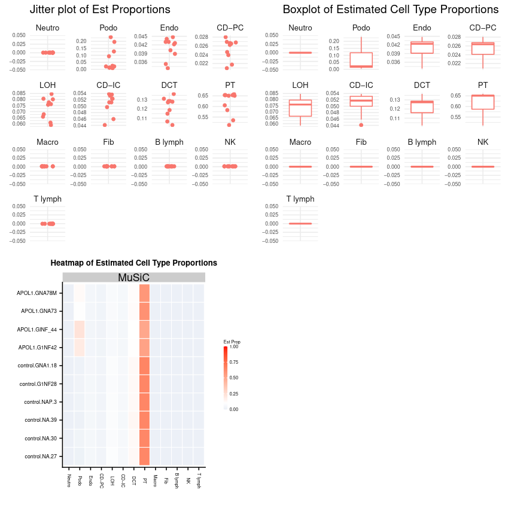

# Introduction
{:.no_toc}

<!-- using info from here: https://xuranw.github.io/MuSiC/articles/MuSiC.html -->

Bulk RNA-seq expression data obtained from RNA-sequencing contains a mixture of the expression of several types of cells. We wish to deconvolve this data to obtain more precise estimates of the proportions of this type of data.

By combining bulk data with multi-subject single cell expression data obtained from single-cell RNA-sequencing, we can use this as a reference for estimating the cell type proportions in the bulk data.

In this tutorial we will be using sample bulk and single-cell RNA-seq assays/matrices of similar tissues from different sources to illustrate how one can infer cell type abundances in the RNA-seq.

> ### Agenda
>
> In this tutorial, we will cover:
>
> 1. TOC
> {:toc}
>
{: .agenda}

## Bulk RNA-seq Cell Type Deconvolution

The heterogeneity that exists in the cellular composition of bulk RNA-seq can add bias to the results from differential expression analysis. In order to circumvent this limitation, RNA-seq deconvolution aims to infer cell type abundances by modelling the gene expressions levels as weighted sums of cell type specific expression profiles. 

Many different computational methods have been developed to estimate these cell type proportions, but in this tutorial we will be using the [MuSiC](https://xuranw.github.io/MuSiC/articles/MuSiC.html) tool suite  to estimate the proportion of individual cell types in our bulk RNA-seq datasets.

### MusiC

MuSiC utilizes cell-type specific gene expression from single-cell RNA sequencing (RNA-seq) data to characterize cell type compositions from bulk RNA-seq data in complex tissues. By appropriate weighting of genes showing cross-subject and cross-cell consistency, MuSiC enables the transfer of cell type-specific gene expression information from one dataset to another.

Solid tissues often contain closely related cell types which leads to collinearity. To deal with collinearity, MuSiC employs a tree-guided procedure that recursively zooms in on closely related cell types. Briefly, MuSic first groups similar cell types into the same cluster and estimate cluster proportions, then recursively repeats this procedure within each cluster.


### Expression Set

Expression Set objects are a datatype class to contain and describe high-throughput expression level assays. They are a container for high-throughput assays and experimental metadata. ExpressionSet class is derived from eSet, and requires a matrix named exprs as assayData member.

The ExpressionSet class is designed to combine several different sources of information into a single convenient structure. An ExpressionSet can be manipulated (e.g., subsetted, copied) conveniently, and is the input or output from many Bioconductor functions.

The data in an ExpressionSet is complicated, consisting of expression data from microarray experiments (assayData; assayData is used to hint at the methods used to access different data components, as we will see below), ‘meta-data’ describing samples in the experiment (phenoData), annotations and meta-data about the features on the chip or technology used for the experiment (featureData, annotation), information related to the protocol used for processing each sample (and usually extracted from manufacturer files, protocolData), and a flexible structure to describe the experiment (experimentData). The ExpressionSet class coordinates all of this data, so that you do not usually have to worry about the details.

# Cell Proportion Estimation

Here we will extract cell proportions from a bulk data of human pancreas data from  concerning 56 638 genes across 89 samples, using a single cell human pancreas dataset from  containing 25 453 genes across 2209 cells, clustered into 14 cell types, from 6 healthy subject and 4 with Type-II diabetes (T2D). If the deconvolution is good, and that datasets are compatible with sufficient enough overlap, we should be able to reprise the same cell types from the bulk data.

## Get data

> ###  Hands-on: Data upload
>
> 1. Create a new history for this tutorial *"Deconvolution: Cell Type inference of Human Pancreas Data"*
> 2. Import the files from [Zenodo]({{ page.zenodo_link }}) or from
>    the shared data library (`GTN - Material` -> `{{ page.topic_name }}`
>     -> `{{ page.title }}`):
>
>    * Human pancreas bulk RNA datasets (tag: `#bulk`)
>
>      ```
>      https://zenodo.org/record/5719228/files/GSE50244bulkeset.expression.tabular
>      https://zenodo.org/record/5719228/files/GSE50244bulkeset.phenotype.tabular
>      ```
>    * Human pancreas single-cell RNA datasets (tag: `#scrna`)
>      ```
>      https://zenodo.org/record/5719228/files/EMTABesethealthy.expression.tabular
>      https://zenodo.org/record/5719228/files/EMTABesethealthy.phenotype.tabular
>      ```
>
>    
>
>    
>
> 3. Rename the datasets
> 
> 4. Check that the datatype
>
>    
>
> 5. Add to each `expression` file a tag corresponding to `#bulk` and `#scrna`
>
>    
>
{: .hands_on}

### Exploring the Datasets

   TODO, exploring the datasets
   
   Section here about what the single cell data looks like. Dimensions, how many cells, etc.
    
   Section here about what the bulk cell data looks like. There are 89 subjects that we wish to assign cell types to.
    
   Section here about the phenotype data for the single cell data. Data has been clustered, important. 
   How many unique cell types are there?
   Maybe here we detect how many unique cell types there are?
   Which ones will we be using for the next analysis?
    
   Section here about the phenotype data for the bulk data. Talk about the factors, and how hba1c is related to type-II diabetes (T2D), and we will look for the proportions of this factor in the deconvolved data.
    
   It is well known that the beta cell proportions is related to T2D disease status. In the progress of T2D, the number of beta cells decreases. One of the most important test for T2D is HbA1c (hemoglobin A1c) test. When HbA1c level is greater than 6.5%, the patient is diagnosed as T2D. Let’s look at the beta cell proportions with HbA1c level.


## Building the Expression Set objects

Here we shall build two ExpressionSet objects corresponding to the bulk and single-cell datatypes. 

### **Construct Expression Set Object**

> ###  Hands-on: Build the Expression Set inputs
>
> 1.  with the following parameters:
>    -  *"Assay Data"*: `GSE50244bulkeset.expression.tabular` (Input dataset)
>    -  *"Phenotype Data"*: `GSE50244bulkeset.phenotype.tabular` (Input dataset)
>
>    > ###  Comment
>    >
>    > An ExpressionSet object has many data slots, the principle of which are the experiment data, the phenotype data, as well more "meta" data pertaining to experiment information and additional annotations.
>    {: .comment}
>
> 2.  with the following parameters:
>    -  *"Assay Data"*: `EMTABesethealthy.expression.tabular` (Input dataset)
>    -  *"Phenotype Data"*: `EMTABesethealthy.phenotype.tabular` (Input dataset)
>
{: .hands_on}

#### **Inspect Expression Set Object**

We will now inspect these objects we juset created to see what information we can extract out of them, and how these multiple datasets are summarized within the object.

> ###  Hands-on: Viewing General Information
> 1.  Click on the `#scrna` *General Info* dataset in the history view (output of **Construct Expression Set Object** )
{: .hands_on}

From these datasets we can also extract specific information pertaining to Samples or Features:

> ###  Hands-on: Extracting a List of Features
> 1.  with the following parameters:
>    -  *"ESet Dataset"*: `#scrna` (output of **Construct Expression Set Object** )
>    - *"Inspect"*: `Feature Data Table`
>
>
{: .hands_on}

We can also extract the general information itself as a standalone text-file

> ###  Hands-on: Dimensional information as a tabular file
>
> 1.  with the following parameters:
>    -  *"ESet Dataset"*: `#scrna` (output of **Construct Expression Set Object** )
>    - *"Inspect"*: `Dimension`
>    {: .comment}
>
{: .hands_on}

> ###  Questions
>
> 1. How many samples are in dataset?
> 2. How many genes?
>
> > ###  Solution
> >
> > 1. 1097 samples
> > 2. 25 453 genes
> >
> {: .solution}
>
> > ###  Comment
> >
> > "Features" are synonymous with "genes" in a genomic setting, but data scientists tend to prefer to use the former term, as it can be used in other non-genomic settings.
> >
> {: .comment}
>
{: .question}


## Estimating Cell Type proportions

<!-- Maybe this goes in a comment? -->
Instead of selecting marker genes, MuSiC gives weights to each gene. The weighting scheme is based on cross-subject variation, by up-weighing genes with low variation and down-weighing genes with high variation. Here we demonstrate this step-by-step with the human pancreas datasets.

The deconvolution of 89 subjects from  are performed with the bulk data GSE50244 expression set and single cell reference EMTAB. The estimation was constrained on 6 major cell types: alpha, beta, delta, gamma, acinar and ductal, which make up over 90% of the whole islet.

### Cell Type estimation with **MuSiC**

  In this section we will use one of the factors from the bulk RNA-seq phenotypes related to the the Type-II Diabetes (T2D) disease status, namely the `hba1c` factor described in phenotype data.
    

> ###  Hands-on: Task description
>
> 1.  with the following parameters:
>    -  *"scRNA Dataset"*: `#scrna` (output of **Construct Expression Set Object** )
>    -  *"Bulk RNA Dataset"*: `#bulk` (output of **Construct Expression Set Object** )
>    - *"Purpose"*: `Estimate Proportions`
>        - *"Cell Types Label from scRNA dataset"*: `cellType`
>        - *"Samples Identifier from scRNA dataset"*: `sampleID`
>        - *"Comma list of cell types to use from scRNA dataset"*: `alpha,beta,delta,gamma,acinar,ductal`
>        - *"Phenotype factors"*: `(leave blank)`
>        - *"Excluded phenotype factors"*: `sampleID,SubjectName`
>        - *"Phenotype Target"*: `hba1c`
>        - *"Phenotype Target Threshold"*: `6.5`
>        - *"Sample Disease Group"*: `T2D`
>        - *"Sample Disease Group (Scale)"*: `5`
>        - *"Plot Title"*: `HbA1c vs Beta Cell Type Proportion`
>
>    > ###  Comment
>    >
>    > It's important to set a phenotype target threshold, otherwise no cells will be matched for the phenotype target. In this case, when the HbA1c level is greater than 6.5%, the patient is diagnosed as T2D.
>    {: .comment}
>
{: .hands_on}

The estimated proportions are normalized to sum to 1 across included cell types. Here we use GSE50244.bulk.eset as the bulk.eset input and EMTAB.eset as sc.eset input. The clusters is specified as cellType while samples is sampleID. As stated before, we only included 6 major cell types as select.ct.

MuSic by compares itself against a previous method of deconvolution known as Non-negative Least-Squares (NNLS), which MuSic supercededs via its Weighted Non-negative Least-Squares (W-NNLS) methodology.


In the above image you can see that (a) the estimated proportion of cells for each of the 6 declared types, as calculated by MuSiC and the NNLS methods respectively. In the (b) section, this is better represented as a box plot to show you where the distribution of cell type proportions lie.


 cell type proportions by disease factor, and (bottom) hba1c factor expression against beta cell type proportion")

As stated previously, it is well known that the beta cell proportions is related to T2D disease status. In the progress of T2D, the number of beta cells decreases. In the above image we can see in the (a) section that we have the same information as previous, but we also distinguish between cells that show a high affinity to T2D status over the Normal cell phenotypes. Section (b) further explores this with a linear regression showing the cell type proportion of cells with Hba1c expression, where we see that there is a significant negative correlation between HbA1c levels and beta cell proportions, after adjusted Age, BMI and Gender. 


> ###  Comment
>
>  We can extract the coefficients of this fitting by looking at the `Log of Music Fitting Data` in the `Summaries and Logs` output collection:
> 
>  ```
>  Coefficients:
>               Estimate Std. Error t value Pr(>|t|)    
>  (Intercept)  0.797148   0.194757   4.093  0.00011 ***
>  age          0.002639   0.001772   1.489  0.14087    
>  bmi         -0.013620   0.007276  -1.872  0.06529 .  
>  hba1c       -0.061396   0.025403  -2.417  0.01819 *  
>  genderMale   0.079874   0.039274   2.034  0.04566 *  
>  
>  ```
>
{: .comment}

### Proportions of Cell Type to each Bulk RNA sample 

One question we might wish to ask is that what affinity did each of the 6 single cell types have to each of the 89 subjects in the bulk data?

For this we can look at the raw data  `MuSiC Estimated Proportions of Cell Types` in the `Proportion Matrices`, to get a glimpse of cell type compositions on a bulk RNA sample level.

Both the MuSiC and the NNLS calculations of this data is best represented in the below heatmap, with RNA samples as rows and cell types as columns:


> ###  Questions
>
> 1. Which cell types are under-represented in the NNLS method?
> 2. Which cell types do not appear to be present in both?
>
> > ###  Solution
> >
> > 1. Here it is evident that the previous NNLS method over-represents the Alpha cell type compared to the MuSiC method which gives more weight to the Beta and Ductal cell types, which were under-represented in the NNLS method.
> > 2. The Delta and Gamma cell types appear empty in both.
> >
> {: .solution}
>
{: .question}


# Estimation of cell type proportions with pre-grouping of cell types

  In the previous section we estimated cell types under the assumption that that the gene expression between cell types was largely independent.
  
  However, solid tissues often contain closely related cell types, and correlation of gene expression between these cell types leads to collinearity, which makes it difficult to resolve their relative proportions in bulk data. 
  
  To deal with collinearity, MuSiC employs a tree-guided procedure that recursively zooms in on closely related cell types. 
  
  Briefly, similar cell types are grouped into the same cluster and their cluster proportions are estimated, then this procedure is recursively repeated within each cluster. At each recursion stage, only genes that have low within-cluster variance are used, as they are used as consistent genes across cell types. This is critical as the mean expression estimates of genes with high variance are affected by the pervasive bias in cell capture of scRNA-seq experiments, and thus cannot serve as reliable reference.

  In this section we will use mouse data as well as known epithelial and immune cell markers.
  
## Get data

> ###  Hands-on: Data upload
>
> 1. Create a new history for this tutorial *"Deconvolution: Dendrogram of Mouse Data"*
> 2. Import the files from [Zenodo]({{ page.zenodo_link }}) or from
>    the shared data library (`GTN - Material` -> `{{ page.topic_name }}`
>     -> `{{ page.title }}`):
>
>    * Mouse kidney bulk RNA datasets (tag: `#bulk`)
>
>      ```
>      https://zenodo.org/record/5719228/files/Mousebulkeset.expression.tabular
>      https://zenodo.org/record/5719228/files/Mousebulkeset.phenotype.tabular
>      ```
>    * Mouse kidney single-cell RNA datasets (tag: `#scrna`)
>      ```
>      https://zenodo.org/record/5719228/files/Mousesubeset.expression.tabular
>      https://zenodo.org/record/5719228/files/Mousesubeset.phenotype.tabular
>      ```
>
>    
>
>    
>
> 3. Rename the datasets
> 
> 4. Check that the datatype
>
>    
>
> 5. Add to each `expression` file a tag corresponding to `#bulk` and `#scrna`
>
>    
>
{: .hands_on}

### Exploring the Datasets

  As before, you may choose to explore the bulk and scrna datasets.
  
  TODO Tooltip here for exploring the expression sets and phenotype datasets


### Colinearity Dendrogram with **MuSiC** to determine cell type similarities

 Determining cell type similarities reqzures first producing a design matrix as well as a cross-subject mean of relative abundance, using a tree-blased clustering method of the cell types we wish to cluster.

> ###  Hands-on: Task description
>
> 1.  with the following parameters:
>    -  *"scRNA Dataset"*: `#scrna` (output of **Construct Expression Set Object** )
>    -  *"Bulk RNA Dataset"*: `#bulk` (output of **Construct Expression Set Object** )
>    - *"Purpose"*: `Compute Dendrogram`
>        - *"Cell Types Label from scRNA Dataset"*: `cellType`
>        - *"Cluster Types Label from scRNA dataset"*: `clusterType`
>        - *"Samples Identifier from scRNA dataset"*: `sampleID`
>        - *"Comma list of cell types to use from scRNA dataset"*:  
>           `Endo,Podo,PT,LOH,DCT,CD-PC,CD-IC,Fib,Macro,Neutro,B lymph,T lymph,NK`
>
{: .hands_on}


> ###  Questions
>
> 1. What do you notice about the cells clustering?
> 2. How many clusters can you see with a height threshold above 650 in the "Cluster log(Design Matrix)"?
>
> > ###  Solution
> >
> > 1. The immune cells are clustered together and the kidney specific cells are clustered together. Notice that DCT and PT are within the same high-level grouping. 
> > 2. The cut-off of 650. Here we cut 13 cell types into 4 groups:
> >
> >    ```
> >    Group 1: Neutro
> >    Group 2: Podo
> >    Group 3: Endo, CD-PC, CD-IC, LOH, DCT, PT
> >    Group 4: Fib, Macro, NK, B lymph, T lymph
> >    ```
> >
> {: .solution}
>
{: .question}


### Heatmap of Cell Type Similarities using **MuSiC**
   
We shall use the 4 cell type groups determined by the cut off threshold in the above question box. To improve the clustering, we shall upload known Epithelial and Immune cell markers.

   
> ###  Hands-on: Upload marker genes and generate heatmap
> 1. Import the files from [Zenodo]({{ page.zenodo_link }}) or from
>    the shared data library (`GTN - Material` -> `{{ page.topic_name }}`
>     -> `{{ page.title }}`):
> 
>    ```
>    https://zenodo.org/record/5719228/files/epith.markers
>    https://zenodo.org/record/5719228/files/immune.markers
>    ```
>    
>
>    
>
> 2.  with the following parameters:
>    - **Note: Shortcut!**
>      > ###  Tip
>      >
>      > Here we actually re-use all the inputs from the previous **MuSiC**  step, plus add a few extra. To speed this up, you can simply click on the re-run icon  under any of its outputs.
>      {: .tip}
>    
>    -  *"scRNA Dataset"*: `#scrna` (output of **Construct Expression Set Object** )
>    -  *"Bulk RNA Dataset"*: `#bulk` (output of **Construct Expression Set Object** )
>    - *"Purpose"*: `Compute Dendrogram`
>        - *"Cell Types Label from scRNA Dataset"*: `cellType`
>        - *"Cluster Types Label from scRNA dataset"*: `clusterType`
>        - *"Samples Identifier from scRNA dataset"*: `sampleID`
>        - *"Comma list of cell types to use from scRNA dataset"*:  
>           `Endo,Podo,PT,LOH,DCT,CD-PC,CD-IC,Fib,Macro,Neutro,B lymph,T lymph,NK`
>        - In *"Cluster Groups"*:
>            -  *"Insert Cluster Groups"*
>                - *"Cluster ID"*: `C1`
>                - *"Comma list of cell types to use from scRNA dataset"*: `Neutro`
>            -  *"Insert Cluster Groups"*
>                - *"Cluster ID"*: `C2`
>                - *"Comma list of cell types to use from scRNA dataset"*: `Podo`
>            -  *"Insert Cluster Groups"*
>                - *"Cluster ID"*: `C3`
>                - *"Comma list of cell types to use from scRNA dataset"*:  
>                   `Endo,CD-PC,LOH,CD-IC,DCT,PT`
>                - *"Marker Gene Group Name"*:`Epithelial`
>                -  *"List of Gene Markers"*: `epith.markers` (Input dataset)
>            -  *"Insert Cluster Groups"*
>                - *"Cluster ID"*: `C4`
>                - *"Comma list of cell types to use from scRNA dataset"*:   
>                   `Macro,Fib,B lymph,NK,T lymph`
>                - *"Marker Gene Group Name"*:`Immune`
>                -  *"List of Gene Markers"*: `immune.markers` (Input dataset)
>
>    > ###  Comment
>    >
>    > The C1 (Neutrophil) and C2 (Podocyte) clusters do not use marker genes for the dendrogram clustering in this dataset.
>    {: .comment}
>
{: .hands_on}




> ###  Questions
>
> Most of the expression in the above plot appears to be derived from one cell type.
> 
> 1. Which cell type dominates the plot?
> 2. What does this tell you about the bulk RNA?
>
> > ###  Solution
> >
> > 1. The PT cells appear to dominate.
> > 2. Most of the expression in the bulk RNA dataset is derived solely from the PT cells, and could be a monogenic cell line.
> >
> {: .solution}
>
{: .question}


# Conclusion
{:.no_toc}

In this tutorial we constructed ExpressionSet objects, inspected, and annotated them, and then finally processing them with the MuSiC RNA-Deconvolution analysis suite.

Below is an overview of the workflow that was used throughout this tutorial.


Note how two ExpressionSet objects are constructed: one from bulk RNA-seq tabular assay data, and the other from single-cell RNA-seq tabular assay data. A blind analysis of cell proportion estimation is performed, along side a guided analysis using pre-grouped cell types.


