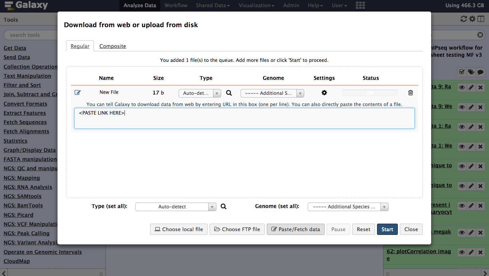
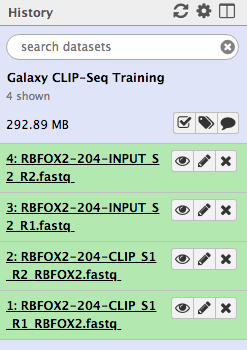
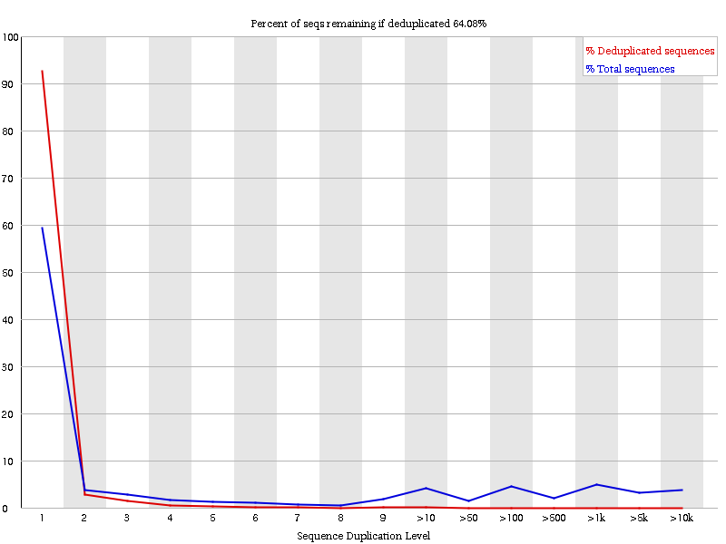
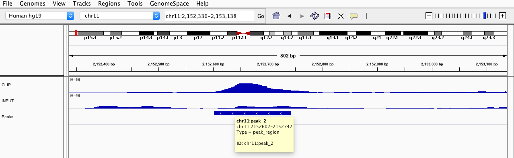
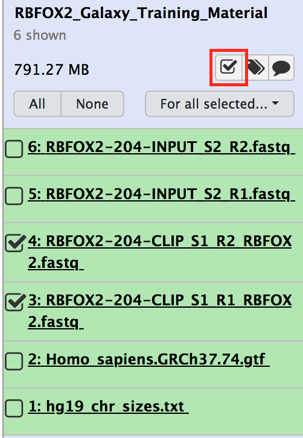
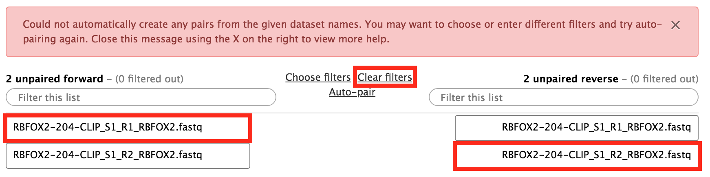
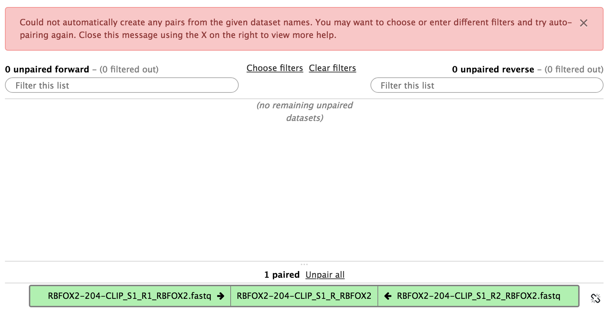

# Introduction


The eCLIP data provided here is a subset of the eCLIP data of RBFOX2 from a study published by *Nostrand et al.* (). The dataset contains the first biological replicate of RBFOX2 CLIP-seq and the input control experiment (FASTQ files). The data was changed and downsampled to reduce data processing time, consequently the data does not correspond to the original source pulled from *Nostrand et al.* (). Also included is a text file (.txt) encompassing the chromosome sizes of hg38 and a genome annotation (.gtf) file taken from [Ensembl](http://ftp.ensemblorg.ebi.ac.uk/pub/release-74/gtf/homo_sapiens/).

**Table 1**: Data from RBFOX2 CLIP-Seq and control experiment which we are going to use in this tutorial from a study published by *Nostrand et al.* ([2016](). PE stands for a paired-end read library. Hep G2 is a human liver cancer cell line. Replicate is the number of the biological replicate. Stranded means, if the read-library is strand specific, i.e., in a specific forward-reverse direction.

| Cellular state | Datatype | Description | Replicate | ENCODE Accession | Library type | Read length | Stranded? |
| ---            | ---      | :-:     | :-:       | ---           | :-:          | :-:         | :-:       |
| Hep G2            | eCLIP | RBFOX2   | 1         | ENCSR987FTF     | PE           | 175-300          | Yes        |
| Hep G2            | eCLIP | input   | 1         | ENCSR799EKA     | PE           | 175-300          | Yes        |


> <agenda-title></agenda-title>
>
> In this tutorial, we will cover:
>
> 1. TOC
> {:toc}
>
{: .agenda}

# Finding Binding Motifs for RBFOX2

RBFOX2 is a relevant development and tissue-specific splicing factor with the conserved motif `TGCATG`. It binds mainly in introns. We therefore want to process and validate the data from human liver cancer cells (HepG2) to find this conserved motif and in the process identify the function of RBFOX2 as well as describe the function of the targeted RNA.

## Step 1: Get data

> <hands-on-title>Data upload</hands-on-title>
> 1. Create and name a new history for this tutorial.
>
>    
>
> 2. Import the following files from [Zenodo](https://zenodo.org/record/2579279).
>
>    ```
>    https://zenodo.org/record/2579279/files/hg38_chr_sizes.txt
>    https://zenodo.org/record/2579279/files/Homo_sapiens.GRCh38.87.gtf
>    https://zenodo.org/record/2579279/files/RBFOX2-204-CLIP_S1_R1_RBFOX2.fastq
>    https://zenodo.org/record/2579279/files/RBFOX2-204-CLIP_S1_R2_RBFOX2.fastq
>    https://zenodo.org/record/2579279/files/RBFOX2-204-INPUT_S2_R1.fastq
>    https://zenodo.org/record/2579279/files/RBFOX2-204-INPUT_S2_R2.fastq
>    ```
>
>    
>
>    
>
>   
>
{: .hands_on}

# Step 2: Quality Control

As for any NGS data analysis, CLIP-seq data must be quality controlled before being aligned to a reference genome. For more detailed information on NGS quality control, check out the [tutorial for NGS](). One crucial thing to check for CLIP-Seq data is the sequence duplication levels. PCR duplications occur naturally in any NGS experiment during the PCR amplification of the genetic material. CLIP-Seq is prone to many PCR duplicates because of the sparse material that is obtained during a CLIP-Seq experiment resulting in high PCR cycles in many occasions. More information about the problem of PCR duplicates can be found [in this guide](http://www.cureffi.org/2012/12/11/how-pcr-duplicates-arise-in-next-generation-sequencing/).

## Report with **FastQC**

> <hands-on-title>Quality control with FastQC</hands-on-title>
>
> 1. **FastQC** : Run the tool **FastQC** on each FASTQ file to assess the quality of the raw data. An explanation of the results can be found on the [FastQC web page](https://www.bioinformatics.babraham.ac.uk/projects/fastqc/).
>
>    > <tip-title>Running a tool on multiple data files</tip-title>
>    >
>    > You can run this tool - and many other tools - on all the FASTQ files at once!
>    > To do this, first select the "Multiple datasets" icon (two stacked pages) under the "Input FASTQ file" heading in the **FASTQC** Tool Form, then shift+click to select multiple FASTQ files.
>    {: .tip}
>
> 2. Check the **Sequence Duplication Levels** plot.
>
>   .")
>
>    > <question-title></question-title>
>    >
>    > 1. Has our data high sequence duplication levels?
>    > 2. Why is there still a small spike in the red line?
>    > 3. What does the headline tell you?
>    >
>    > > <solution-title></solution-title>
>    > > 1. Yes, ideally we would see a blue line with one high peak in a duplication of one, everything else should be zero.
>    > > 2. Spikes in the red line come from different duplication levels in the original data (blue line).
>    > > 3. The headline states an expected value of reads that would remain after a de-duplication step. A high percentage suggest, that no de-duplication step is needed. This should also correspond with the red line.
>    > {: .solution }
>    {: .question}
{: .hands_on}

# Step 3: Removal of Adapters, Barcodes and Unique Molecular Identifiers (UMIs)

It is often necessary to remove adapter and barcodes sequences as well as UMIs. <br/>
**Adapters** (or primers) are needed for PCR amplification and sequencing in a standard NGS protocol. Unfortunately, it might happen during the sequencing that the machine does not stop at the read end and sequences through the adapter as well. That is why, we need to check if our reads contain those sequences which we are then cutting out.<br/>
**Barcodes** on the other hand are especially designed for a read library and intentionally sequenced. Sometimes experiments are sequenced at the same time which is called **multiplexing**. Multiplexing allows for a better data normalisation and comparison. The barcodes are then used to divide the un-multiplexed data set into the individual read libraries. (**Note: Our data is already de-multiplexed, i.e., we do not have to take barcode sequences into account.**)<br/>
**UMIs** are similar to barcodes but these sequences are unique for each read. UMIs were introduced since iCLIP to deal with the high duplication levels of a CLIP experiment. Because each read contain an UMI, PCR duplicates of that read also contain the same UMI, which makes it possible to fuse all reads with the same UMI.

## Removal of adapter sequences with **Cutadapt**

In this task we are going to remove two 3' and two 5' adapters from the reads (Note: The eCLIP protocol uses more adapter sequences, for more information take a look in the original publication ).

> <hands-on-title>Adapter Removal</hands-on-title>
>
> **Cutadapt (v. 4.0)**  with the following parameters:
>    - *"Single-end or Paired-end reads?"*: `Paired-end`
>    -  *"FASTQ/A file #1"*: `FASTQ R1`
>    -  *"FASTQ/A file #2"*: `FASTQ R2`
>    - *"Read 1 Options"*:
>       - In *"3' Adapters"*:
>            - Click on *"Insert 3' Adapters"*:
>            - In *"1: 3' Adapters"*:
>                - *"Source"*: `Enter custom sequence`
>                    - *"Enter custom 3' adapter sequence"*: `AACTTGTAGATCGGA`
>            - Click on *"Insert 3' Adapters"*:
>            - In *"2: 3' Adapters"*:
>                - *"Source"*: `Enter custom sequence`
>                    - *"Enter custom 3' adapter sequence"*: `AGGACCAAGATCGGA`
>        - In *"5' (Front) Adapters"*:
>            - Click on *"Insert 5' (Front) Adapters"*:
>            - In *"1: 5' (Front) Adapters"*:
>                - *"Source"*: `Enter custom sequence`
>                    - *"Enter custom 5' adapter sequence"*: `CTTCCGATCTACAAGTT`
>            - Click on *"Insert 5' (Front) Adapters"*:
>            - In *"2: 5' (Front) Adapters"*:
>                - *"Source"*: `Enter custom sequence`
>                    - *"Enter custom 5' adapter sequence"*: `CTTCCGATCTTGGTCCT`
>       - *"Cut bases from reads before adapter trimming"*: `-5`
>    - *"Read 2 Options"*:
>       - In *"3' Adapters"*:
>            - Click on *"Insert 3' Adapters"*:
>            - In *"1: 3' Adapters"*:
>                - *"Source"*: `Enter custom sequence`
>                    - *"Enter custom 3' adapter sequence"*: `AACTTGTAGATCGGA`
>            - Click on *"Insert 3' Adapters"*:
>            - In *"2: 3' Adapters"*:
>                - *"Source"*: `Enter custom sequence`
>                    - *"Enter custom 3' adapter sequence"*: `AGGACCAAGATCGGA`
>        - In *"5' (Front) Adapters"*:
>            - Click on *"Insert 5' (Front) Adapters"*:
>            - In *"1: 5' (Front) Adapters"*:
>                - *"Source"*: `Enter custom sequence`
>                    - *"Enter custom 5' adapter sequence"*: `CTTCCGATCTACAAGTT`
>            - Click on *"Insert 5' (Front) Adapters"*:
>            - In *"2: 5' (Front) Adapters"*:
>                - *"Source"*: `Enter custom sequence`
>                    - *"Enter custom 5' adapter sequence"*: `CTTCCGATCTTGGTCCT`
>    - *"Adapter Options"*:
>        - *"Minimum overlap length"*: `5`
>    - *"Filter Options"*:
>        - *"Minimum length (R1)"*: `10`
>        - *"Specify a minimum/maximum length for reverse reads (R2)"*: `Disabled`
>
>   > <comment-title>Why do we remove 5 bp from the first read?</comment-title>
>   > In eCLIP it can happen that the sequencing goes over the first read into the UMI, which is at the 3' end of the first read. The UMI is 5 bp long in our data. To make sure our first read in the read pair does not contain the UMI, we simply remove the last 5 bp from it. The UMI that we actually need for the de-duplication is located on the 5' end of our second read in the read pair.
>   {: .comment}
>
>    > <comment-title>Do the same thing for the input control data set.</comment-title>
>    >
>    > If you processed the RBFOX2 FASTQ dataset then do the same thing for the input control dataset or *vice verca*.
>   {: .comment}
>
{: .hands_on}

## Removal of UMIs with **UMI-tools extract**

In this task we are going to remove the UMI at the 5' end of the second read. We are then going to use the removed UMIs later on to de-duplicate our read library and account for PCR duplicates.

> <hands-on-title>UMI Removal</hands-on-title>
>
> 1. **UMI-tools extract**  with the following parameters:
>    - *"Library type"*: `Paired-end`
>     -  *"Reads in FASTQ format"*: `FASTQ R2` (output from the **Cutadapt** call )
>     -  *"Reads in FASTQ format"*: `FASTQ R1`  (output from the **Cutadapt** call )
>     - *"Barcode on both reads?"*: `Barcode on first read only`
>    - *"Use Known Barcodes?"*: `No`
>    - *"Method to extract barcodes"*: `String`
>    - *"Barcode pattern for first read"*: `NNNNN`
>    - *"Is the barcode at the 5' end?"*: `Yes`
>    - *"Output log?"*: `Yes`
>    - *"Enable quality filter?"*: `No`
>
>   > <comment-title>Do the same thing for the input control data set.</comment-title>
>   >
>   > If you processed the RBFOX2 FASTQ dataset then do the same thing for the input control dataset or *vice verca*.
>   {: .comment}
>
>   > <question-title></question-title>
>   > 1. What is the meaning of the barcode pattern?
>   >
>   >   > <solution-title></solution-title>
>   >   > 1. The symbol "N" defines our UMI. The symbol "X" are nucleotides that we would reattach to our read. It is important to note, that the UMI can be encompassed by an in-line barcode, that is why we need two distinct symbols "N" and "X".
>   > {: .solution }
>   {: .question}
>
{: .hands_on}

# Step 4: Aligning Reads to a Reference Genome

To determine where DNA fragments originated in the genome, the sequenced reads must be aligned to a reference genome. This is equivalent to solving a jigsaw puzzle, but unfortunately, not all pieces are unique. In principle, you could do a BLAST analysis to figure out where the sequenced pieces fit best in the known genome. However, this can take a couple of weeks. Nowadays, there are many read alignment programs. STAR  is one of them that works well with CLIP-Seq data. STAR is able to use genome as well as transcriptome data. This ability is handy, since CLIP-Seq generates transcriptome data, consequently we have to take RNA processing steps like splicing events into account.

## Aligning with **RNA STAR**

> <hands-on-title>Alignment</hands-on-title>
>
> 1. **RNA STAR**  with the following parameters:
>    - *"Single-end or paired-end reads"*: `Paired-end (as individual datasets)`
>     -  *"RNA-Seq FASTQ/FASTA file, forward reads"*: `FASTQ R2` (output from **UMI-tools extract** )
>     -  *"RNA-Seq FASTQ/FASTA file, reverse reads"*: `FASTQ R1` (output from **UMI-tools extract** )
>    - *"Custom or built-in reference genome"*: `Use a built-in index`
>        - *"Reference genome with or without an annotation"*: `use genome reference with builtin gene-model`
>            - *"Select reference genome"*: `Homo sapiens (hg38+GRCh38.87)`
>    - *"Count number of reads per gene"*: `No`
>    - *"Would you like to set output parameters (formatting and filtering)?"*: `Yes`
>        - *"Extra SAM attributes to include"*: `All`
>        - *"Include strand field flag XS"*: `Yes -- and reads with inconsistent and/or non-canonical introns are filtered out`
>        - *"Would you like to set additional output parameters (formatting and filtering)?"*: `Yes`
>    - *"Other parameters (seed, alignment, limits and chimeric alignment)"*: `Extended parameter list`
>        - In *"Alignment parameters"*:
>            - *"Use end-to-end read alignments, with no soft-clipping?"*: `Yes`
>        - *"Would you like to set chimeric alignment parameters?"*: `No`
>
>   > <comment-title>Note: We have switched R1 and R2 as forward and reverse reads!</comment-title>
>   >
>   > We need to do that because the eCLIP read library is organised in a way such that the first mate (R1) is in reverse and the second mate (R2) in forward orientation.
>   {: .comment}
>
>   > <comment-title>Soft-Clipping vs Hard-Clipping</comment-title>
>   >
>   > Clipping is a way to deal with low quality bases during the alignment step. In **Soft-Clipping** the bases at the 5' and 3' end of the read are not part of the alignment. In **Hard-Clipping** the bases at the 5' and 3' end of the read are not part of the alignment **and** will be completely removed from the read sequence in the BAM file.
>   {: .comment}
>
>   > <comment-title>Do the same thing for the input control data set.</comment-title>
>   >
>   > If you processed the RBFOX2 FASTQ dataset then do the same thing for the input control dataset or *vice verca*.
>   {: .comment}
>
>   > <question-title></question-title>
>   >
>   > 1. Can you think of a reason why we disabled the soft-clipping?
>   >
>   >   > <solution-title></solution-title>
>   >   >
>   >   > 1. In eCLIP the cross linking position should be at the beginning of the second read. If we would enable soft-clipping, we would add potential bases with low quality at the end of our second reads that would blur our cross linking position and we would lose precision to detect potential binding regions of RBFOX2.
>   > {: .solution}
> {: .question}
>
{: .hands_on}

# Step 5: De-Duplication

Lets return to the UMIs which we extracted in step three. Since we have mapped the reads to our reference genome, we can now identify which reads might be duplicated or not. The UMI-tools  will help us again in this matter.

## De-duplication with **UMI-tools deduplicate**

> <hands-on-title>De-Duplication</hands-on-title>
>
> 1. **UMI-tools deduplicate**  with the following parameters:
>    -  *"Reads to deduplicate in SAM or BAM format"*: `bam` (output of **RNA STAR** )
>    - *"extract_umi_method"*: `Read ID`
>    - *"Separator between read id and UMI."*: `_`
>    - *"Method used to identify PCR duplicates within reads."*: `Identify clusters based on hamming distance and resolve networks by using the node counts`
>    - *"Edit distance threshold"*: `1`
>    - *"BAM is paired end"*: `Yes`
>
>   > <comment-title>What is the purpose of the method we have chosen for the de-duplication?</comment-title>
>   >
>   > `UMI-tools deduplication` has several methods. The method we have picked is called the  **adjacency** method. For detailed information have a look at method descriptions of UMI-tools . For a brief explanation: the method fuses reads together when they have the same coordinates and the same UMI. However, sequencing errors can occur in the UMI. Thus, in the **adjacency** method we fuse also UMIs that differ in a maximal number of characters and where we identify a lot of copies, i.e., the method creates clusters of nodes, a node for each individual UMI, and fuses these nodes based on the [hamming distance](https://en.wikipedia.org/wiki/Hamming_distance) and read counts.
>   {: .comment}
>
>   > <comment-title>Do the same thing for the input control data set.</comment-title>
>   >
>   > If you processed the RBFOX2 bam file then do the same thing for the input control bam or *vice verca*.
>   {: .comment}
>
>   > <question-title></question-title>
>   >
>   > 1. Why are we doing the de-duplication after the read mapping?
>   > 2. What is the edit distance threshold?
>   >
>   >   > <solution-title></solution-title>
>   >   >
>   >   > 1. Because we need the coordinates of the reads to see if some reads have the same coordinates and the same UMI.
>   >   > 2. `UMI-tools dedulication` uses the hamming distance between UMIs to detect sequencing errors in the UMIs. A hamming distance of 1 means, that two UMIs are the same if they differ in maximal one character. If two characters are different, then these are two disparate UMIs.
>   > {: .solution}
> {: .question}
>
{: .hands_on}

## Quality check of the de-duplication with **FastQC**

> <hands-on-title>De-duplication quality control</hands-on-title>
>
> 1. **FastQC**  with the following parameters:
>    -  *"Short read data from your current history"*: `bam` (output of **UMI-tools deduplicate** )
> 2. View the **Sequence Duplication Levels** plot.
> 
>
>   > <question-title></question-title>
>   >
>   > 1. What can you see, if you compare the duplication levels to our first quality control in step two?
>   > 2. Why are the duplication levels still high?
>   >
>   >   > <solution-title></solution-title>
>   >   >
>   >   > 1. We have reduced the duplication levels.
>   >   > 2. The duplication levels are still high, because we don't have the full data sets (reads are missing).
>   > {: .solution}
> {: .question}
>
{: .hands_on}

# Step 6: Second Quality Control

In this section we check the quality of our mapped reads and see if our samples are correlated or not. It is actually not really necessary for our data sets, because of the small sample size. However, for bigger analyses it is wise to check if some samples may encompass major quality problems.

## Check the read coverage with **plotFingerprint**

> <hands-on-title>Check the read coverage</hands-on-title>
>
> 1. **plotFingerprint**  with the following parameters:
>    - *"Sample order matters"*: `No`
>    - *"Bam file"*: `both bam files` (output of **UMI-tools deduplicate** )
>    - *"Show advanced options"*: `yes`
>     - *"Bin size in bases"*: `100`
>    - *"Show advanced output settings"*: `no`
> 2. View the output image.
>  of a specified length and sums the per-base coverage that overlap with those regions. The x-axis therefore orders the bins from lowest coverage to highest coverage. The plot here is too idealistic which is because of our small data set.")
>
>   > <comment-title>What does this graph represent, especially for CLIP-Seq data?</comment-title>
>   >
>   > It shows us how good the CLIP Signal compared to the control signal is. Now be careful, CLIP-Seq experiments involve either a total RNA control or a negative control with another protein that unspecifically binds RNA (e.g., IgG). An ideal total RNA control (input control) like ours with perfect uniform distribution of reads along the genome/transcriptome (i.e. without enrichments) and infinite sequencing coverage should generate a straighter, diagonal line. On the other hand, a very specific and strong CLIP enrichment will be indicated by a prominent and steep rise of the cumulative sum towards the highest rank. Yet, a negative control often has the same sharp slope at the end as a CLIP experiment but often depicts a straighter, diagonal line in the beginning like the input control.
>   {: .comment}
>
>   > <question-title></question-title>
>   >
>   > 1. How do (or should) input datasets differ from CLIP datasets?
>   > 2. What do you think about the quality of the CLIP experiment?
>   >
>   >   > <solution-title></solution-title>
>   >   >
>   >   > 1. We expect that the control (input) has a different, more straighter, diagonal slope than the CLIP experiment.
>   >   > 2. Both the CLIP experiment and the control are closely related. It is maybe wise to check the correlation of the two samples.
>   > {: .solution}
> {: .question}
>
{: .hands_on}

For additional information on how to interpret **plotFingerprint** plots, read the information [the DeepTools documentation](https://deeptools.readthedocs.io/en/latest/content/tools/plotFingerprint.html#background).

## Correlation between Samples

We have seen that our input control and our CLIP experiment might be strongly correlated, meaning, that our potential RBFOX2 binding regions are not truly enrichment when comparing to a our control.
We are therefore going to further check the correlation between our control and CLIP experiment.

> <hands-on-title>Assessing correlation between samples</hands-on-title>
>
> 1. **multiBamSummary**  with the following parameters:
>    - *"Sample order matters"*: `No`
>    - *"Bam file"*: `both bam files` (output of **UMI-tools deduplicate** )
>    - *"Choose computation mode"*: `Bins`
>     - *"Bin size in bp"*: `1000`
>    - *"Show advanced options"*: `no`
> 2. **plotCorrelation**  with the following parameters:
>    -  *"Matrix file from the multiBamSummary tool"*: `outFile` (output of **multiBamSummary** )
>    - *"Correlation method"*: `Spearman`
>    - *"Plotting type"*: `Heatmap`
>    - *"Skip zeros"*: `Yes`
>    - *"Image file format"*: `png`
> 3. View the output image.
>  of a specified length and sums the per-base coverage that overlap with those regions. The correlation between these bins is then calculated for each pair of samples. An ideal plot would result in two disparate clusters: one for the biological replicates of your CLIP-Seq experiment and one for the replicates of your control. A bad plot would happen if your control and CLIP-Seq experiment end up in one cluster, which means that they are closely related and something went wrong in the laboratory.")
>
>   > <question-title></question-title>
>   >
>   > 1. Why do we want to skip zeros in plotCorrelation?
>   > 2. What happens if the Spearman correlation method is replaced by the Pearson method?
>   > 3. What does the correlation tell you about our data?
>   >
>   >   > <solution-title></solution-title>
>   >   >
>   >   > 1. Large areas of zeros would lead to a correlation of these areas. The information we would get out of this computation would be meaningless.
>   >   > 2. The clusters would be different.
>   >   > 3. Despite the result of `plotFingerprint`, we see that the correlation between our experiment and control is not nearly as significant as we thought.
>   > {: .solution}
> {: .question}
>
{: .hands_on}

# Step 7: Peak Calling

Peak calling is one of the most important steps in the data analysis of CLIP-Seq, next to mapping. There exist a variety of peak callers like [PEAKachu](https://github.com/tbischler/PEAKachu), PureCLIP () or Piranha () each with different underlying assumptions and parameters. It is difficult (nearly impossible) to find a generic solution for every data set. We are going to use `PEAKachu` to find possible binding motifs for our data. `PEAKachu` is able to incorporate control data in contrast to other peak callers like `Piranha`, thus allowing to find binding regions that are significantly enriched in comparison to our control (input) data.

## Peak calling with **PEAKachu**

> <hands-on-title>Peak calling</hands-on-title>
>
> 1. **PEAKachu**  with the following parameters:
>    -  *"Experiment Libraries"*: `bam RBFOX2` (output of **UMI-tools deduplicate** )
>    -  *"Control Libraries"*: `bam Input` (output of **UMI-tools deduplicate** )
>    - *"Pairwise Replicates"*: `No`
>    - *"Paired End"*: `Yes`
>    - *"Maximum Insert Size"*: `"200"`
>    - *"Select Mode"*: `Adaptive`
>        - *"Normalisation Method."*: `DESeq2`
>    - *"Mad Multiplier"*: `"0.0"`
>    - *"Fold Change Threshold"*: `"2.0"`
>    - *"Adjusted p-value Threshold"*: `"0.05"`
> 2. Take a look at the MA plot of **PEAKachu**.
>  and A (mean average). It shows you the general trend of the log2 fold-change in dependence of the average mean of the expression rate of the peaks. Points in a straight, diagonal line symbolise the behavior of the logarithm which is often visible for low expressed peaks, because one read can change the fold-change quite drastically. The blue lines depict the normalisation constants. Read dots are significant peaks. It is hard to tell what a good MA plot would look like. Even a small number of significant peaks can be enough, depending on the biological question you ask.")
>
>   > <comment-title>Adjusted p-value Threshold</comment-title>
>   >
>   > P-values are calculated by DESeq2. A low p-value represent a significantly enriched binding region. Since we are doing thousands of independent hypothesis testings, we have to correct for significant p-values that happen just by chance. DESeq2 uses the Benjamini-Hochberg procedure as a correction. For more information read [this handbook](http://www.biostathandbook.com/multiplecomparisons.html).
>   {: .comment}
>
>   > <comment-title>Fold-Change Threshold</comment-title>
>   >
>   > The fold-change is calculated by DESeq2 and is actually a log2 fold-change. Because we want significantly enriched binding regions, we basically search for peaks that are at least four times higher in our CLIP experiment than in our control.
>   {: .comment}
>
>   > <question-title></question-title>
>   >
>   > 1. What happens if we decrease or increase the log2 fold-change threshold of 2.0?
>   > 2. Take a look into the peak output file of PEAKachu. Why aren't there any p-values?
>   > 3. Is the log2 fold-change alone a good measurement to validate our peaks? Maybe the MA plot helps you to figure out this question?
>   >
>   > > <solution-title></solution-title>
>   > >
>   > > 1. If we would **decrease** the log2 fold-change threshold then we would get more peaks. However, we would also increase the number of false positives, i.e., peaks that are **not** significantly enriched.<br/>
>   > >    If we would **increase** the log2 fold-change threshold, then we would decrease the number of peaks and possible false positives. However, we would also increase the number of false negatives, i.e., we would lose potentially interesting binding sites.
>   > > 2. PEAKachu works mainly with replicated data, because DESeq2 calculates only p-values for data sets where the experiment and control have at least two replicates. This feature makes statistically sense, because data sets without replicates are not representative enough to make general assumptions, but for the purpose of demonstration we are going to ignore this fact.
>   > > 3. Yes and no. A significant fold-change with high read counts (read coverage) might be enough to validate a peak. However, some peaks can also be covered by very few reads and still have a high fold-change, e.g., log2(4/1). It is for you to decide if a fold-change like log2(4/1) is enough evidence that the binding region is significantly enriched.
>   > {: .solution}
>   {: .question}
>
{: .hands_on}

# Step 8: Peak Analysis

In this last step, we are going to analyse the peaks that we obtained from the previous step. This should give you a small glimpse of what someone might be interested in. Therefore we want to answer in this step the following questions:
1) Which sequential motifs are potentially conserved in our binding regions, i.e., what are potential binding motifs of RBFOX2? 2) Which RNAs does RBFOX2 preferentially bind and what are their biological function?

## Motif detection with **MEME-ChIP**

Lets first find out which sequence motifs RBFOX2 might preferentially bind to.

> <hands-on-title>Motif detection</hands-on-title>
>
> 1. **Text reformatting**  with the following parameters:
>    -  *"File to process"*: `tabular` (output of **PEAKachu** )
>    - *"AWK Program"*: `NR>1{if($3 < $4) {print $1,$3,$4,"clip_peak_"NR-1,$9,$5;}else {print $1,$4,$3,"clip_peak_"NR-1,$9,$5;}}`
> 2. Set the datatype of the output generated by **Text reformatting** as `bed`
>
>    
>
> 3. **SlopBed**  with the following parameters:
>    -  *"BED/VCF/GFF file"*: `bed` (output of **Text reformatting** )
>    - *"Genome file"*: `hg38_chr_sizes.txt` (file from your history)
>    - *"Choose what you want to do"*: `Increase the BED/GFF/VCF entry by the same number base pairs in each direction.`
>        - *"Number of base pairs"*: `20`
> 4. **Extract Genomic DNA**  with the following parameters:
>    -  *"Fetch sequences for intervals in"*: `bed` (output of **SlopBed** )
>    - *"Interpret features when possible"*: `Yes`
>    - *"Choose the source for the reference genome"*: `locally cached`
>        - *"Using reference genome"*: `hg38`
>    - *"Select output format"*: `fasta`
> 5. **MEME-ChIP**  with the following parameters:
>    -  *"Primary sequences"*: `FASTA` (output of **Extract Genomic DNA** )
>    - *"Sequence alphabet"*: `DNA`
>    - *"Options Configuration"*: `Advanced`
>        - *"Limit of sequences to pass to MEME"*: `100`
>        - *"Should subsampling be random?"*: `Yes`
>            - *"Seed for the randomized selection of sequences"*: `123`
>        - *"E-value threshold for including motifs"*: `0.05`
>        - *"Search given strand only"*: `Yes`
>        - *"What is the expected motif site distribution?"*: `Zero or one occurances per sequence`
>        - *"Minimum motif width"*: `5`
>        - *"Maximum motif width"*: `20`
>        - *"Maximum number of motifs to find"*: `20`
>        - *"Stop DREME searching after reaching this E-value threshold"*: `0.05`
>        - *"Stop DREME searching after finding this many motifs"*: `5`
>    - *"I certify that I am not using this tool for commercial purposes."*: `Yes`
> 6. View the **MEME-ChIP** html.
>
>  of each position and thus stands for the probability that the nucleotide at a certain position is the specific letter (for DNA: T,C,G,A). Bigger letters stand for a higher probability. For more information read [this Wikipedia article](https://en.wikipedia.org/wiki/Sequence_logo).")
>
>   > <comment-title>MEME and DREME</comment-title>
>   >
>   > **MEME** and **DREME** are two motif finding tools that MEME-ChIP uses. More information about theses tools can be found on [meme-suite.org](http://meme-suite.org/).
>   {: .comment}
>
>   > <comment-title>What is the purpose of SlopBED?</comment-title>
>   >
>   > **PEAKachu** might underestimate the length of the binding regions, because the actually protein-RNA-binding concentrates on the cross linking site that is one nucleotide long. Thus, we extend the peaks from **PEAKachu** by 20 bp at each site. A true conserved binding motif will not be affected by it, if we make the region to wide.
>   {: .comment}
>
>   > <comment-title>What is the meaning of the E-value?</comment-title>
>   >
>   > The E-value represents the expected number of times we would find our sequence motif in a database (peak file), just by chance. This means, that a small E-value correspond to a very significant motif, because the expected number we would find that motif in our peak file just by chance is very low. Other sequences like repeats will have a high E-value on the other hand.
>   {: .comment}
>
>   > <question-title></question-title>
>   >
>   > 1. Click on the link under the column **Discovery/​Enrichment Program** for two of the motifs one from **MEME** and one from **DREME**. What is the site-count for the most significant motif? How many sequences have we checked for **MEME** and for **DREME**? What is the fraction of sequences that covered that motif? (MEME-ChIP version 4.11.2)
>   > 2. Have we found the motif `TGCATG`?
>   >
>   >   > <solution-title></solution-title>
>   >   >
>   >   > 1. For the result with MEME-ChIP version 4.11.2: **MEME** site count = 37, total sequences = 100, fraction = 37%; **DREME** site count = 103, total sequences = 247, fraction = 41.7%.
>   >   > 2. Yes.
>   > {: .solution}
> {: .question}
>
{: .hands_on}

## Functional analysis with **RNA Centric Annotation System**

Lets move to the next step and find out where these motifs might come from, i.e., which kind of RNAs RBFOX2 preferentially bind to. For that we will use the `RNA Centric Annotation System`. Run the tool and then try to answer the subsequent questions.

> <hands-on-title>Functional analysis</hands-on-title>
>
> 1. **RNA Centric Annotation System (v. 1.5.4)**  with the following parameters:
>    - *"Genome Version"*: `hg38`
>    -  *"Target regions in BED format"*: `bed` (output of **SlopBed** )
>    -  *"Reference annotation in ENSEMBL GTF format"*: `Homo_sapiens.GRCh37.74.gtf` (file from your history)
>    - *"Run annotation."*: `Yes`
>    - *"Run GO term enrichment"*: `Yes`
>    - *"Run gene set enrichment"*: `No`
>    - *"Run motif search"*: `No`
>    - *"Downsampling (N)"*: `"0"`
> 2. View the output html of **RNA Centric Annotation System**
>
>   > <question-title></question-title>
>   >
>   > 1. What is the main target region of RBFOX2 (e.g., cds, exon, 5' UTR)? Does this confirm the literature.
>   > 2. From which cellular compartments do the targets come from?
>   > 3. Where does RBFOX2 mainly bind around the intron-exon boundaries and total transcript?
>   >
>   >   > <solution-title></solution-title>
>   >   >
>   >   > 1. Introns and transcripts. Yes.
>   >   > 2. Actin filaments, actin cytoskeleton, cell projection part etc.
>   >   > 3. Around the exon-intron boundaries more at the 3' ends of transcripts.
>   > {: .solution}
> {: .question}
>
{: .hands_on}

# Additional Step

Sometimes it is wise to take a look at individual peaks; maybe to check the peak calling algorithm or the general quality of the read coverage of the called peaks. We will cover the motivation behind this step in this section and explain why it would be wise to further inspect your results. For this we take the de-duplicated reads in step 5 and the called peaks in step 7 to take a deeper look inside our data.

## Generating bigWig files of the alignment ends

We will first generate coverage files that gives us a better visualization for our read coverage along the genome. SAM or BAM files can be used too, but they are often to big and harder to handle, if you try to inspect the read coverage. Therefore we are going to generate a bigWig (binary form of a BedGraph) file.

> <hands-on-title>Task description</hands-on-title>
>
> 1. **Extract alignment ends**  with the following parameters:
>    -  *"Alignments in SAM or BAM format"*: `bam` (output of **UMI-tools deduplicate** )
> 2. **SortBED**  with the following parameters:
>    -  *"Sort the following BED file"*: `bed` (output of **Extract alignment ends** )
>    - *"Sort by"*: `chromosome, then by start position (asc)`
> 3. **Create a BedGraph of genome coverage**  with the following parameters:
>    -  *"The BAM or BED file from which coverage should be computed"*: `bed` (output of **SortBED** )
>    - *"Report regions with zero coverage"*: `No`
>    - *"Treat split/spliced BAM or BED12 entries as distinct BED intervals when computing coverage."*: `No`
>    - *"Calculate coverage based on"*: `both strands combined`
> 4. **Wig/BedGraph-to-bigWig**  with the following parameters:
>    -  *"Convert"*: `bedgraph` (output of **Create a BedGraph of genome coverage** )
>    - *"Converter settings to use"*: `Default`
>
>   > <comment-title>Do the Same thing for the input control data set.</comment-title>
>   >
>   > If you processed the RBFOX2 bam dataset then do the same thing for the input control dataset or *vice verca*.
> {: .comment}
>
{: .hands_on}

## Inspection of peaks and aligned data with IGV

Next we are going to use the generated bigWig files of our alignment ends and the peaks we obtained from `PEAKachu` and investigate the read coverage of our called peaks with [IGV](http://software.broadinstitute.org/software/igv/). This is an alternative to Trackster. For more information about IGV follow the  [tutorial]({{site.baseurl}}/topics/introduction/tutorials/igv-introduction/tutorial.html).<br/>

**Try to answer the questions for this hands-on.** It will give you an idea why it would be wise to inspect the read coverage of the peaks.

> <hands-on-title>IGV</hands-on-title>
>
> 1. Open IGV on your local computer.
> 2. Choose as a reference genome **hg38**.
> 3. Download and drag-and-drop the following files from galaxy into IGV:
>     - **peaks_annotations.gff** of PEAKachu 
>     - **CLIP.bigWig** of Wig/BedGraph-to-bigWig 
>     - **INPUT.bigWig** of Wig/BedGraph-to-bigWig 
> 4. Inspect the peaks (e.g., <b>chr11:peak_2</b> chr11:2152602-2152742)
> 
>
>   > <question-title></question-title>
>   >
>   > 1. What are the ideal conditions that PEAKachu  will call a peak.
>   > 2. What are the challenges a peak caller has to face? What defines a peak (significantly enriched region)?
>   > 3. Imagine you find a region that should be definitely be a peak but your peak caller does not spot it. What can you do?
>   >
>   >   > <solution-title></solution-title>
>   >   >
>   >   > 1. High read coverage in the region for the CLIP experiment and low read coverage in the region for the input control.
>   >   > 2. As simply explained in the previous answer, a peak (significantly binding region) should be significantly enriched in the CLIP experiment and not in the input control. However, the difficulty is to find out if two adjacent peaks are two distinct peaks or just one big peak. Furthermore, very small bumps can also be just an artifact of a way bigger peak. In addition, a high read coverage in the CLIP experiment and not in the input control does not necessarily mean that we have an enriched region. The significance depends on the background (noise) of our data. A good normalisation is therefore crucial.
>   >   > 3. From question two you might know now, that this is not an easy question. Every peak caller has different parameters that can be optimised for your type of problem. If you find a spot that you think should be certainly a peak, than play around with the parameters and options of the peak caller, or switch to another algorithm.
>   > {: .solution}
> {: .question}
>
{: .hands_on}

# Conclusion


In this tutorial you imported raw eCLIP data, evaluated the quality of the read library before the read processing, removed adapter sequences and unique molecular identifier from the reads, aligned the reads to a reference genome, de-duplicated the read library, analysed the quality of the de-duplication and read mapping, found significantly enriched regions (peaks) for the protein RBFOX2 and finally scrutinised the peaks on potential conserved motifs and target RNAs. In addition, you took a short glimpse on the quality of the peak calling. Keep in mind, the read library for CLIP-Seq data might have different formats for different protocols (e.g, PAR-CLIP). However, the overall analysis you learned in this tutorial stays nearly the same.

### Remark about Workflow


In order to use the workflow linked to this tutorial, you have to create two lists of dataset pairs; one for you control and one for your CLIP experiment.

> <tip-title>Creating a list of dataset pairs.</tip-title>
>
> * Click on the check box icon in the history.
> 
> * Select the data files for your experiment (or control).
> * Select **For all selected...** below the check box icon.
> * Select **Build List of Dataset Paris**
> * In the new window, if you see no files and a warning, then select **Clear filters**. After that, organise the files into forward-reverse pairs.
> 
>
>  
> * Give the list a name and click on the button **Create list**.
{: .tip}
