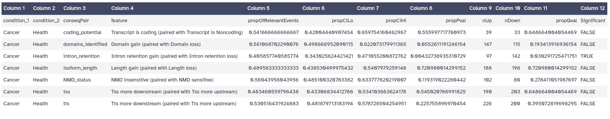

# Introduction

Discovered over 40 years ago, alternative splicing formed a large part of the puzzle explaining how proteomic complexity can be achieved with a limited set of genes  (). The majority of eukaryote genes have multiple transcriptional isoforms, and recent data indicate that each transcript of protein-coding genes contain 11 exons and produce 5.4 mRNAs on average (). In humans,  approximately 95% of multi-exon genes show evidence of alternative splicing (AS) and approximately 60% of genes have at least one alternative transcription start site, some of which exert antagonistic functions (, ).

AS regulation is essential for providing cells and tissues their specific features, and for their response to environmental changes (, ). Differential usage of isoforms in different conditions, often referred to as isoform switching (IS), can have substantial biological impact, caused by the difference in the functional potential of the two isoforms ().

Extensive alternative splicing programmes contribute to the regulation of cell differentiation and organ development, and its disruption has been demonstrated to be able to contribute to virtually every aspect of cancer progression (, ) (fig. 1). Cancer is a disease characterized by the uncontrolled growth and spread of abnormal cells in the body. It can start almost anywhere in the human body, which is made up of trillions of cells. From a molecular point of view, cancer is caused by changes to genes that control cell function, particularly how they grow and divide. There are more than 100 types of cancer, and they are usually named for the organs or tissues where they form. Some common types of cancer include carcinomas, sarcomas, leukemias, and lymphomas.


Alterations in gene splicing and isoform switching has been demonstrated to have significant impact on cancer development and progression. For instance, the unannotated isoform of TNS3 was found to be a novel driver of breast cancer  (). These alterations can lead to the activation of oncogenes (OCGs) or the inactivation of tumor suppressor genes (TSGs), which can promote or suppress tumorigenesis, respectively (). However, the strict classification of cancer genes as either OCGs or TSGs may be an oversimplification, as some genes can exhibit a dual role in cancer development, often impacting the same facet of tumorigenesis (). 

In this tutorial, we aim to perform a genome-wide analysis of the isoform switch phaenomena in cancer, which offers improved resolution over gene expression, with the objective of identifying genes of potential clinical relevance.

> <agenda-title></agenda-title>
>
> In this tutorial, we will cover:
>
> 1. TOC
> {:toc}
>
{: .agenda}


# Background on data

The datasets consist of twelve FASTQ files, generated through the Illumina NovaSeq 6000 sequencing system. The samples were obtained by strand-specific RNA sequencing on PANC1 cell line samples. The protocol used for extracting the samples includes the depletion of rRNAs by subtractive hybridization, a general strategy for mRNA enrichment in RNA-seq samples. The original datasets are available in the NCBI SRA database, with the accession number [PRJNA542693](https://www.ncbi.nlm.nih.gov/bioproject/PRJNA542693).

## Get data

The first step of our analysis consists of retrieving the RNA-seq datasets from Zenodo and organizing them into collections.

> <hands-on-title>Retrieve miRNA-Seq and mRNA-Seq datasets</hands-on-title>
>
> 1. Create a new history for this tutorial
> 2. Import the files from Zenodo:
>
>    - Open the file  __upload__ menu
>    - Click on __Rule-based__ tab
>    - *"Upload data as"*: `Collection(s)`
>    - Copy the following tabular data, paste it into the textbox and press <kbd>Build</kbd>
>
>      ```
>      SRR9050437F	Health tissue	{{ page.zenodo_link }}/files/SRR9050437_forward.fastqsanger.gz	fastqsanger.gz	1
>      SRR9050437R	Health tissue	{{ page.zenodo_link }}/files/SRR9050437_reverse.fastqsanger.gz	fastqsanger.gz	2
>      SRR9050438F	Health tissue	{{ page.zenodo_link }}/files/SRR9050438_forward.fastqsanger.gz	fastqsanger.gz	1
>      SRR9050438R	Health tissue	{{ page.zenodo_link }}/files/SRR9050438_reverse.fastqsanger.gz	fastqsanger.gz	2
>      SRR9050439F	Health tissue	{{ page.zenodo_link }}/files/SRR9050439_forward.fastqsanger.gz	fastqsanger.gz	1
>      SRR9050439R	Health tissue	{{ page.zenodo_link }}/files/SRR9050439_reverse.fastqsanger.gz	fastqsanger.gz	2
>      SRR9050440F	Cancer tissue	{{ page.zenodo_link }}/files/SRR9050440_forward.fastqsanger.gz	fastqsanger.gz	1
>      SRR9050440R	Cancer tissue	{{ page.zenodo_link }}/files/SRR9050440_reverse.fastqsanger.gz	fastqsanger.gz	2
>      SRR9050441F	Cancer tissue	{{ page.zenodo_link }}/files/SRR9050441_forward.fastqsanger.gz	fastqsanger.gz	1
>      SRR9050441R	Cancer tissue	{{ page.zenodo_link }}/files/SRR9050441_reverse.fastqsanger.gz	fastqsanger.gz	2
>      SRR9050442F	Cancer tissue	{{ page.zenodo_link }}/files/SRR9050442_forward.fastqsanger.gz	fastqsanger.gz	1
>      SRR9050442R	Cancer tissue	{{ page.zenodo_link }}/files/SRR9050442_reverse.fastqsanger.gz	fastqsanger.gz	2
>      ```
>
>    - From **Rules** menu select `Add / Modify Column Definitions`
>       - Click `Add Definition` button and select `List Identifier(s)`: column `A`
>
>         > <tip-title>Can't find <i>List Identifier</i>?</tip-title>
>         > Then you've chosen to upload as a 'dataset' and not a 'collection'. Close the upload menu, and restart the process, making sure you check *Upload data as*: **Collection(s)**
>         {: .tip}
>
>       - Click `Add Definition` button and select `Collection Name`: column `B`
>       - Click `Add Definition` button and select `URL`: column `C`
>       - Click `Add Definition` button and select `Type`: column `D`
>       - Click `Add Definition` button and select `Pair-end Indicator`: column `E`
>
>    - Click `Apply` and press <kbd>Upload</kbd>
>
> 
{: .hands_on}

Next we will retrieve the remaining datasets.

> <hands-on-title>Retrieve the additional datasets</hands-on-title>
>
> 1. Import the files from Zenodo:
>
>    - Open the file  __upload__ menu
>    - *"Upload data as"*: `Datasets`
>    - Once again, copy the tabular data, paste it into the textbox and press <kbd>Build</kbd>
>
>      ```
>      CPAT_header.tab  {{ page.zenodo_link }}/files/CPAT_header.tab
>      active_site.dat.gz	{{ page.zenodo_link }}/files/active_site.dat.gz
>      gencode.v42.lncRNA_transcripts.fa.gz	{{ page.zenodo_link }}/files/gencode.v42.lncRNA_transcripts.fa.gz
>      gencode.v42.pc_transcripts.fa.gz	{{ page.zenodo_link }}/files/gencode.v42.pc_transcripts.fa.gz
>      gencode.v43.annotation.gtf.gz	{{ page.zenodo_link }}/files/gencode.v43.annotation.gtf.gz
>      gencode.v43.transcripts.fa.gz	{{ page.zenodo_link }}/files/gencode.v43.transcripts.fa.gz
>      GRCh38.p13.genome.fa.gz	{{ page.zenodo_link }}/files/GRCh38.p13.genome.fa.gz
>      Pfam-A.hmm.dat.gz	{{ page.zenodo_link }}/files/Pfam-A.hmm.dat.gz
>      Pfam-A.hmm.gz	{{ page.zenodo_link }}/files/Pfam-A.hmm.gz
>      ```
>
>    - From **Rules** menu select `Add / Modify Column Definitions`
>       - Click `Add Definition` button and select `Name`: column `A`
>       - Click `Add Definition` button and select `URL`: column `B`
>    - Click `Apply` and press <kbd>Upload</kbd>
>
>
{: .hands_on}

> <details-title>Dataset subsampling</details-title>
>
> As indicated above, for this tutorial the depth of the samples was reduced in order to speed up the time needed to carry out the analysis. This was done as follows:
>
> > <hands-on-title>Dataset subsampling</hands-on-title>
> >
> > 1.  with the following parameters:
> >    -  *"Multiple datasets"*: Each of the FASTQ files
> >    - *"Subsampling approach"*: `Take every N-th sequence (or pair e.g. every fifth sequence)`
> >    - *"N"*: `100`
> {: .hands_on}
>
> In this way, we will only take 1% of reads at a random sampling rate.
{: .details}

# Quality assessment

Once we have got the datasets, we can start with the analysis. The first step is to perform the quality assessment. Since this step is deeply covered in the tutorial [Quality control](), we won't describe this section in detail.


> <comment-title>Inicial quality evaluation (OPTIONAL)</comment-title>
>
>   For the initial quality evaluation it is necessary a pre-processing step consisting in interlacing the paired-end reads; this step is required because **FastQC** is not able to process separated paired-end reads. The problem is that the interlacing step will takes some time, so if you are in a hurry, it is recommended to skip this step. The `Raw data QC` files generated by **FastQC** will be combine into a a single one by making use of **MultiQC**.
>
>   > <hands-on-title>Initial quality evaluation</hands-on-title>
>   >
>   > 1.  with the following parameters:
>   >    - *"Type of paired-end datasets"*: `1 paired dataset collection`
>   >        -  *"Paired-end reads collection"*: `Health collection`
>   >
>   > 2. Repeat the previous step
>   >
>   > 3.  with the following parameters:
>   >    -  *"Raw read data from your current history"*: output of **FASTQ interlacer** 
>   >
>   > 4. Repeat the previous step
>   >
>   > 5. Repeat the previous procedure with the `Cancer collection`
>   >
>   > 6.  with the following parameters:
>   >    - In *"Results"*:
>   >        -  *"Insert Results"*
>   >            - *"Which tool was used generate logs?"*: `FastQC`
>   >                - In *"FastQC output"*:
>   >                    -  *"Insert FastQC output"*
>   >                        -  *"FastQC output"*: `RawData` from the **Health collection** (output of **FastQC** )
>   >                    -  *"Insert FastQC output"*
>   >                        -  *"FastQC output"*: `RawData` from the **Cancer collection** (output of **FastQC** )
>   >    - *"Report title"*: `Raw data QC`
>   >
>   >
>   {: .hands_on}
>
> 
>   Let's evaluate the per base sequence quality and the adapter content.
>
>   . Adapter content (b).")
>
>   As we can appreciate in the figure 2.a, the per base quality of all reads seems to be very good, with values over 30 in all cases. With respect to the adapter content, the adapter content is over 20% in most samples; it means that we need to pre-process the reads before pretending to start the isoform analysis, because otherwise the results could be affected as a result of adapter contaminations.
>
{: .comment}


## Read pre-processing with fastp

In order to remove the adaptors we will make use of **fastp**, which is able to detect the adapter sequence by performing a per-read overlap analysis, so we won't even need to specify the adapter sequences. 

> <hands-on-title>Pre-process reads with fastp</hands-on-title>
>
> 1.  with the following parameters:
>    - *"Single-end or paired reads"*: `Paired Collection`
>        -  *"Select paired collection(s)"*: `Heath collection`
>        - In *"Global trimming options"*:
>            - *"Trim front for input 1"*: `10`
>    - In *"Overrepresented Sequence Analysis"*:
>        - *"Enable overrepresented analysis"*: `Yes`
>        - *"Overrepresentation sampling"*: `50`
>    - In *"Filter Options"*:
>        - In *"Quality filtering options"*:
>            - *"Qualified quality phred"*: `20`
> 2. Rename the output as `Trimmed health collection`
>
> 3. Repeat the procude with the `Cancer collection` dataset.
>
{: .hands_on}

# RNA-seq mapping and isoform quantification 

The following section can be considered as the hard-core part of the training, the reason is  not because of it’s complexity (not all the details about the computational procedures will be presented, just those elements required for a basic understanding), but because it allows to characterize isoform quantification approach as genome-guided-based method. 

> <comment-title>Transcriptome-reconstruction approaches</comment-title>
>
>  The different methods for estimating transcript/isoform abundance can be classified depending on two main requirements: reference sequence and alignment. reference-guided transcriptome assembly strategy requires to aligning sequencing reads to a reference genome first, and then assembling overlapping alignments into transcripts. In contrast, *de novo* transcriptome assembly methods directly reconstructs overlapping reads into transcripts by utilising the redundancy of sequencing reads themselves ().
>
{: .comment}

In that section makes use of three main tools: **RNA STAR**, considered a state-of-the-art mapping tool for RNA-seq data, **RSeQC**, a package that allows comprehensively evaluate different aspects of the RNA-seq data, and **Stringtie**, which uses a genome-guided transcriptome assembly approach along with concepts from de novo genome assembly to perform transcript assembly and quantification. 

## RNA-seq mapping with **RNA STAR**

**RNA STAR** is a splice-aware RNA-seq alignment tool that allows to identify canonical and non-canonical splice junctions by making use of sequential maximum mappable seed search in uncompressed suffix arrays followed by seed clustering and stitching procedure (). One advantage of **RNA STAR** with respect to other tools is that it includes a feature called *two-pass mode*, a framework in which splice junctions are separately discovered and quantified, allowing robustly and accurately identify  splice junction patterns for differential splicing analysis and variant discovery.

> <details-title>RNA STAR two-pass mode</details-title>
>
> During two-pass mode splice junctions are discovered in a first alignment pass with high stringency, and are used as annotation in a second pass to permit lower stringency alignment, and therefore higher sensitivity (fig. 3). Two-pass alignment enables sequence reads to span novel splice junctions by fewer nucleotides, conferring greater read depth and providing significantly more accurate quantification of novel splice junctions that one-pass alignment ().
>
> . Third, these discovered splice junctions, and expressed annotated splice junctions are used to re-index the genome. Finally, alignment is performed a second time, quantifying novel and annotated splice junctions using the same, relatively lower stringency (3 nt minimum spanning length), producing splice junction expression (source: Veeneman et al., 2016)")
>
{: .details}


The choice of **RNA STAR** as mapper is also determined by the sequencing technology; it has been demonstrated adequate for short-read sequencing data, but when using long-read data, such as PacBio or ONT reads, it is recommended to use **GMAP** as alignment tool (). 

> <comment-title>Intron spanning in RNA-seq analysis</comment-title>
>
> RNA-seq mappers need to face the challenge associated with intron spanning of mature mRNA molecules, from which introns have been removed by splicing (single short read might align to two locations that are separated by 10 kbp or more). The complexity of this operation can be better understood if we take in account that for a typical human RNA-seq data set using 100-bp reads, more than 35% of the reads will span multiple exons.
>
{: .comment}

So, let's perform the mapping step.

> <hands-on-title> Task description </hands-on-title>
>
> 1.  with the following parameters:
>    - *"Single-end or paired-end reads"*: `Paired-end (as collection)`
>        -  *"RNA-Seq FASTQ/FASTA paired reads"*: `Trimmed health collection` (output of **fastp** )
>    - *"Custom or built-in reference genome"*: `Use reference genome from history and create temporary index`
>        -  *"Select a reference genome"*: `GRCh38.p13.genome.fa.gz`
>        - *"Build index with or without known splice junctions annotation"*: `build index with gene-model`
>            -  *"Gene model (gff3,gtf) file for splice junctions"*: `gencode.v43.annotation.gtf.gz`
>    - *"Use 2-pass mapping for more sensitive novel splice junction discovery"*: `Yes, perform single-sample 2-pass mapping of all reads`
>
> 2. Rename the output as `Mapped health collection`
>
> 3. Repeat the procedure with the `Cancer collection` dataset.
>
{: .hands_on}


Before moving to the transcriptome assembly and quantification step, we are going to use **RSeQC** in order to obtain some RNA-seq-specific quality control metrics.

## RNA-seq specific quality control metrics with **RSeQC**

RNA-seq-specific quality control metrics, such as sequencing depth, read distribution and coverage uniformity, are essential to ensure that the RNA-seq data are adequate for transcriptome reconstruction and alternative splicing analysis. For example, the use of RNA-seq with unsaturated sequencing depth gives imprecise estimations  and fails to detect low abundance splice junctions, limiting the precision of many analyses ().

In this section we will make use of of the **RSeQC** toolkit in order to generate the RNA-seq-specific quality control metrics. But before starting, we need to convert the annotation GTF file into BED12 format, which will be required in subsequent steps.

> <hands-on-title>GTF to BED12 GTF conversion</hands-on-title>
>
> 1.  with the following parameters:
>    -  *"GTF File to convert"*: `gencode.v43.annotation.gtf.gz`
>    - *"Advanced options"*: `Set advanced options`
>        - *"Ignore groups without exons"*: `Yes`
> 
> 2. Rename the output as `BED12 annotation`
>
{: .hands_on}

We are going to use the following RSeQC modules:

- **Infer Experiment**: inference of RNA-seq configuration
- **Gene Body Coverage**: compute read coverage over gene bodies
- **Junction Saturation**: check junction saturation
- **Junction Annotation**: compares detected splice junctions to a reference gene model
- **Read Distribution**: calculates how mapped reads are distributed over genome features

Once all required outputs have been generated, we will integrate them by using **MultiQC** in order to interpret the results.

> <hands-on-title> Raw reads QC</hands-on-title>
>
> 1.  with the following parameters:
>    -  *"Input BAM file"*: `Mapped health collection`
>    -  *"Reference gene model"*: `BED12 annotation`
>
> 2.  with the following parameters:
>    -  *"Input BAM file"*: `Mapped health collection`
>    -  *"Reference gene model"*: `BED12 annotation`
>
> 3.  with the following parameters:
>    -  *"Input BAM/SAM file"*: `Mapped health collection`
>    -  *"Reference gene model"*: `BED12 annotation` 
>    - *"Output R-Script"*: `Yes`
>
> 4.  with the following parameters:
>    -  *"Input BAM/SAM file"*: `Mapped health collection` 
>    -  *"Reference gene model"*: `BED12 annotation` 
>
> 5.  with the following parameters:
>    -  *"Input BAM/SAM file"*: `Mapped health collection`
>    -  *"Reference gene model"*: `BED12 annotation`
>
> 6. Repeat the previous steps with he `Cancer health collection` dataset
>
{: .hands_on}

Now, we will integrate the outputs into **MultiQC**.

> <hands-on-title> Task description </hands-on-title>
>
> 1.  with the following parameters:
>    - In *"Results"*:
>        -  *"Insert Results"*
>            - *"Which tool was used generate logs?"*: `STAR`
>                - In *"STAR output"*:
>                    -  *"Insert STAR output"*
>                        - *"Type of STAR output?"*: `Log`
>                            -  *"STAR log output"*: `log` collections
>        -  *"Insert Results"*
>            - *"Which tool was used generate logs?"*: `RSeQC`
>                - In *"RSeQC output"*:
>                    -  *"Insert RSeQC output"*
>                        - *"Type of RSeQC output?"*: `Infer experiment`
>                            -  *"RSeQC infer experiment"*: select **RNA-seq experiment configuration** collections
>                    -  *"Insert RSeQC output"*
>                        - *"Type of RSeQC output?"*: `Read distribution`
>                            -  *"RSeQC read distribution: stats output"*: select **stat** collections
>                    -  *"Insert RSeQC output"*
>                        - *"Type of RSeQC output?"*: `Junction saturation`
>                            -  *"RSeQC junction saturation: junction saturation plot Rscript file*: select **Rscript** collections
>                    -  *"Insert RSeQC output"*
>                        - *"Type of RSeQC output?"*: `Junction annotation`
>                            -  *"RSeQC junction annotation: stats file"*: select **stats** collections
>                    -  *"Insert RSeQC output"*
>                        - *"Type of RSeQC output?"*: `Gene body coverage`
>                            -  *"RSeQC gene body coverage: stats file"*: select **stats** collections
>
{: .hands_on}


First, we will evaluate the plot corresponding to the RNA STAR alignment scores (figure 6), which will allow us to easily compare the samples to get an overview of the quality of the samples. As a general criteria, we can consider that good quality samples should have at least 75% of the reads uniquely mapped. In our case, of samples have unique mapping values over 90%.


Now we can have a look at the **RSeQC** results;  we will evaluate the RSeQC **Read Distribution plot** (figure 7). 

.")

In that case, all samples show a similar trend, both in health and cancer samples, with most reads mapping on CDS exons (around 72%), 5'UTR (around 4.5%) and 3'UTR (around 13.5%).

Now we will evaluate the results of the **Infer Experiment** module, which allows to speculate the experimental design (whether sequencing is strand-specific, and if so, how reads are stranded) by sampling a subset of reads from the BAM file and comparing their genome coordinates and strands with those of the reference gene model ().  

.")

As can be appreciated in the image, the proportion of reads assigned as *sense* is similar to the ones assigned as *antisense*, which indicates that in that case our RNA-seq data is non-strand specific. 

Now, let's evaluate the results generated by the **Gene Body Coverage** module. It scales all transcripts to 100 nt and calculates the number of reads covering each nucleotide position. The plot generated from this information illustrates the coverage profile along the gene body, defined as the entire gene from the transcription start site to the end of the transcript (fig. 5).


The gene body coverage pattern is highly influenced by the RNA-seq protocol, and it is useful for identifying artifacts such as 3' skew in libraries. For example, a skew towards increased 3' coverage can happen in degraded samples prepared with poly-A selection. According the figure 5, there're not bias in our reads as a result of sequencing technical problems.

Other important metric for alternative splicing analysis is the one provided by the **Junction Saturation** module, which allows to determine if the current sequencing depth is sufficient to perform alternative splicing analyses by comparing the detected splice junctions to reference gene model (fig. 6). 

Since for a well annotated organism both the number of expressed genes and spliced junctions is considered to be almost fixed, if the number of known junctions reaches a plateau means that the current sequencing depth is almost saturated for known junction detection. In other words, nearly all known junctions have already been detected, and deeper sequencing will not likely detect additional known junctions. Using an unsaturated sequencing depth would miss many rare splice junctions ().

> <comment-title>RSeQC junction saturation details</comment-title>
>
> This approach helps identify if the sequencing depth is sufficient for alternative splicing analysis. However, it relies on the reference gene model for junction comparison, which might not be complete or accurate for all organisms. In addition, it might not provide enough information for novel junction detection, as the sequencing depth might still be insufficient for detecting new splice junctions.
>
{: .comment}

, and the splice junctions from each subset is detected (green) and and compared them to the reference model (grey).")

As we can appreciate in the plot, the known junctions tend to stabilize around 160.000, which indicates that the read sequencing depth is good enough for performing the alternative splicing analysis.

After confirming that the saturation level is good enough, finally, we will check the output generated by the RSeQC junction annotation module (figure 8); it allows to distinguish between splice junctions (multiple reads show the same splicing event) and splice events (single read level). In addition, the detected junctions are divided in three exclusive categories: known splicing junctions, partial novel splicing junction (one of the splice site is novel) and new splicing junctions (figure 8).

, partial novel splicing junction (one of the splice site is novel) (grey) and new splicing junctions (green).")

According to the results, despite the number of new (or partially new) splicing junctions is relatively slow (around 0.5%), a large proportion of reads show novel splicing junction patterns.

After evaluating the quality of the RNA-seq data, we can start with the transcriptome assembly step.

## Transcriptome assembly and quantification with **StringTie**


StringTie is a fast and highly efficient assembler of RNA-Seq alignments into potential transcripts. It uses a network flow algorithm to reconstruct transcripts and quantitate them simultaneously. This algorithm is combined with an assembly method to merge read pairs into full fragments in the initial phase (, ).

> <comment-title>StringTie algorithm</comment-title>
>
> StringTie first groups the reads into clusters, collapsing the reads that align to the identical location on the genome and keeping a count of how many alignments were collapsed,  then creates a splice graph for each cluster from which it identifies transcripts, and then for each transcript it creates a separate flow network to estimate its expression level using a maximum flow algorithm () (figure 10).
>
> > 
>
> StringTie uses an aggressive strategy for identifying and removing spurious spliced alignments. If a spliced read is aligned with more than 1% mismatches, keeping in mind that Illumina sequencers have an error rate < 0.5%, then StringTie2 requires 25% more reads than usual (the default is 1 read per bp) to support that particular spliced alignment. In addition, if a spliced read spans a very long intron (more than 100,000 bp), StringTie2 accepts that alignment (and the intron) only if a larger anchor of 25 bp (10 bp is the default) is present on both sides of the splice site. Here the term “anchor” refers to the portion of the read aligned within the exon beginning at the exon-intron boundary ().
>
>
{: .comment}

The main reason underlying the greater accuracy of StringTie most likely derives from its optimization criteria. By balancing the coverage (or flow) of each transcript across each assembly, it incorporates depth of coverage constraints into the assembly algorithm itself. When assembling a whole genome, coverage is a crucial parameter that must be used to constrain the algorithm; otherwise an assembler may incorrectly collapse repetitive sequences. Similarly, when assembling a transcript, each exon within an isoform should have similar coverage, and ignoring this parameter may produce sets of transcripts that are parsimonious but wrong ().


> <details-title>StringTie long RNA-seq assembly</details-title>
>
> To handle the high error rates in the long reads, StringTie implements two techniques. First, it correct potentially wrong splice sites by checking all the splice sites present in the alignment of a read with a high-error alignment rate. If a splice site is not supported by any low-error alignment reads, then it tries to find a nearby splice site (within 10 bp, by default) that is supported by the most alignments among all nearby splice sites. Secondly, it implements a pruning algorithm that reduces the size of the splicing graph to a more realistic size by removing the edges in the graph starting from the edge least supported by reads to the most supported edge, until the number of nodes in the splicing graph falls under a given threshold (by default 1000 nodes).
>
{: .details}

Despite in this training we make use of RNA STAR as mapping tool, it is possible to use different splice-aware aligner such as HISAT2. Independently of the tool, each record with a spliced alignment should have the XS tag in the SAM/BAM file, which indicates the genomic strand from which the RNA that produced the read originated . 

> <hands-on-title> Task description </hands-on-title>
>
> 1.  with the following parameters:
>    - *"Input options"*: `Short reads`
>        -  *"Input short mapped reads"*: `Mapped health collection`
>    - *"Use a reference file to guide assembly?"*: `Use reference GTF/GFF3`
>        - *"Reference file"*: `Use a file from history`
>            -  *"GTF/GFF3 dataset to guide assembly"*: `gencode.v43.annotation.gtf.gz`
>        - *"Use Reference transcripts only?"*: `Yes`
>        - *"Output files for differential expression?"*: `Ballgown`
>
{: .hands_on}

Stringtie generates six collection with three elements each one, but we will use only the **transcript-level expression measurements** dataset collection.

> <details-title>Transcription-level expression measurements file</details-title>
>
>  The transcript-level expression measurements (t_tab.ctab) file includes one row per transcript, with the following columns:
> 
> - t_id: numeric transcript id
> - chr, strand, start, end: genomic location of the transcript
> - t_name: generated transcript id
> - num_exons: number of exons comprising the transcript
> - length: transcript length, including both exons and introns
> - gene_id: gene the transcript belongs to
> - gene_name: HUGO gene name for the transcript, if known
> - cov: per-base coverage for the transcript (available for each sample)
> - FPKM: Estimated FPKM for the transcript (available for each sample)
>
{: .details}


# Isoform analysis with **IsoformSwitchAnalyzeR**

IsoformSwitchAnalyzeR is an open-source R package that enables both  analyze changes in genome-wide patterns of alternative splicing and specific gene isoforms switch consequences (note: alternative splicing literally will result in isoform switches). An advantage of IsoformSwitchANalyzeR over other approaches is that it allows allows to integrate multiple layers of information, such as previously annotated coding sequences, de-novo coding potential predictions, protein domains and signal peptides. In addition, IsoformSwitchAnalyzeR facilitates identification of IS by making use of a new statistical methods that tests each individual isoform for differential usage, identifying the exact isoforms involved in an isoform switch ()

> <comment-title>Nonsense mediated decay</comment-title>
>
> If transcript structures are predicted (either de-novo or guided) IsoformSwitchAnalyzeR offers an accurate tool for identifying the dominant ORF of the isoforms. The knowledge of isoform positions for the CDS/ORF allows for prediction of sensitivity to Nonsense Mediated Decay (NMD) — the mRNA quality control machinery that degrades isoforms with pre-mature termination codons (PTC).
>
{: .comment}

In this training, the IsoformSwitchAnalyzeR stage is divided in four steps:

1. Data import: import into IsoformSwitchAnalyzer the transcription-level expression measurement dataset generated by Stringtie. This step also requires to import the GTF annotation file and the transcriptome.
2. Pre-processing step: non-informative gene/isoforms are removed from the datasets and differentially isoform usage analysis with DEXSeq. Once the IS have been found, the corresponding nucleotide and aminoacid sequences are extracted.
3. Outward sequence analysis: The sequences obtained in the previous step are used in order to evaluate their coding potential and the motifs that they contain by using two different tools: **PfamScan** and **CPAT**.
4. Isoform switching analysis: The final step involves importing and incorporating the results of the external sequence analysis, identifying intron retention, predicting functional consequences and generating the reports.


> <comment-title>On the alternative splicing concept</comment-title>
>
> In accordance with the IsoformSwitchAnalyzeR developers, in this training the concept of alternative splicing englobes both alternative splicing (AS), alternative transcription start sites (ATSS) as well as alternative transcription start sites (ATTS).
>
{: .comment}


Now, we can start with the isoform switch analysis.

## Import data into **IsoformSwitchAnalyzeR**

The first step of the IsoformSwitchAnalyzeR pipeline is to import the required datasets.

> <comment-title>Salmon as source of transcript-expression data</comment-title>
>
> In addition of Stringtie, it is possible to import dada from **SALMON**. The main advantage of Salmon over StringTie for isoform differential expression analysis is its speed and computational efficiency, while achieving similar accuracies when analyzing known transcripts. However, **StringTie** is considered a better alternative if we are interested in novel transcript features.
>
{: .comment}

> <hands-on-title> Task description </hands-on-title>
>
> 1.  with the following parameters:
>    - *"Tool function mode"*: `Import data`
>        - In *"1: Factor level"*:
>            - *"Specify a factor level, typical values could be 'tumor' or 'treated'"*: `Cancer`
>            -  *"Transcript-level expression measurements"*: `transcript-level expression measurements` (output of **StringTie** )
>        - In *"2: Factor level"*:
>            - *"Specify a factor level, typical values could be 'tumor' or 'treated'"*: `Health`
>            -  *"Transcript-level expression measurements"*: `transcript-level expression measurements` collection (output of **StringTie** )
>        - *"Quantification data source"*: `StringTie`
>            - *"Average read length"*: `140`
>        -  *"Genome annotation (GTF)"*: `gencode.v43.annotation.gtf.gz`
>        -  *"Transcriptome"*: `gencode.v43.transcripts.fa.gz`
>
{: .hands_on}

It generates a **switchAnalyzeRlist** object that contains all relevant information about the isoforms involved in isoform swtches, such as each comparison of an isoform between conditions.


## Pre-processing step

Once the datasets have been imported into a RData file, we can start with the pre-processing step. In order to enhace the reliability of the downstream analysis, it is important to remove the non-informative genes/isoforms (e.g. single isoform genes and non-expressed isoforms). 

After the pre-processing, IsoformSwitchAnalyzieR performs the differential isoform usage analysis by using **DESXSeq**, which despite originally designed for testing differential exon usage, it has demonstrated to perform exceptionally well for differential isoform usage. DEXSeq uses generalized linear models to assess the significance of observed differences in isoform usage values between conditions, taking into account the biological variation between replicates ().

> <comment-title>Difference in isoform fraction contept</comment-title>
>
> IsoformSwitchAnalyzeR measures isoform usage vian isoform fraction (IF) values which quantifies the fraction of the parent gene expression originating from a specific isoform, (calculated as isoform_exp / gene_exp). Consequently, the difference in isoform usage is quantified as the difference in isoform fraction (dIF) calculated as IF2 - IF1, and these dIF are used to measure the effect size  (). 
>
{: .comment}

IsoformSwitchAnalyzeR uses two parameters to define a significant isoform switch:

- Alpha: the FDR corrected P-value (Q-value) cutoff.
- dIFcutoff: the minimum (absolute) change in isoform usage (dIF).

This combination is used since a Q-value is only a measure of the statistical certainty of the difference between two groups and thereby does not reflect the effect size which is measured by the dIF values ().

> <comment-title>Isoform or gene resolution analysis?</comment-title>
>
> Despite IsoformSwitchAnalyzeR supports both isoform and gene resolution analysi, it is recommended to tu use the isoform-level analysis. The reason is that since the analysis is restricted to genes involved in isoform switch, gene-level analysis is conditioned by higher false positive rates. 
>
{: .comment}

> <hands-on-title>IsoformSwitchAnalyzeR pre-processing step</hands-on-title>
>
> 1.  with the following parameters:
>    - *"Tool function mode"*: `Analysis part one: Extract isoform switches and their sequences`
>        -  *"IsoformSwitchAnalyzeR R object"*: `SwitchList` (output of **IsoformSwitchAnalyzeR** )
>
>   > <comment-title>Reduce to switch genes option</comment-title>
>   >
>   > An important argument is the 'Reduce to switch genes' optin. When enabled, it will reduce/subset  of genes to those which each contains at least one differential used isoform, as indicated by the alpha and dIFcutoff cutoffs. This option ensures the rest of the workflow runs significantly faster since isoforms from genes without IS are not analyzed.
>   >
>   {: .comment}
>
{: .hands_on}


## Outward sequence analysis

The next step is to use to use generated FASTA files corresponding to the aminoacid and nucleotide sequences to perform the external analysis tools. In that case, we will use **PfamScan** for predicting protein domains and **CPAT** predicting the coding potential. This informatin will be integrated in the downstream analysis.

> <comment-title>Additional sequence analysis tools</comment-title>
>
> Note that **IsoformSwitchAnalyzeR** allows to integrate additional sources, such as prediction of signal peptides (SignalP) and intrinsically disordered regions (IUPred2AIUPred2A or NetSurfP-2). However, those tools are not currenly available in Galaxy, so for this reason we will not make use of them. You can find more information in the [IsoformSwitchAnalyzeR viggette](https://bioconductor.org/packages/release/bioc/vignettes/IsoformSwitchAnalyzeR/inst/doc/IsoformSwitchAnalyzeR.html#advice-for-running-external-sequence-analysis-tools-and-downloading-results).
>
{: .comment}

### Protein domain identification with **PfamScan**

PfamScan is an open-source tool developed by the EMBL-EBI for identifying protein motifs. It allows to search FASTA sequences against Pfam HMM libraries. This tool requires three input datasets:

- Pfam-A HMMs in an HMM library searchable with the hmmscan program: Pfam-A.hmm.gz
- Pfam-A HMM Stockholm file associated with each HMM required for PfamScan: Pfam-A.hmm.dat.gz
- Active sites dataset: active_sites.dat.gz

> <comment-title>Pfam database</comment-title>
>
> Pfam is a collection of multiple sequence alignments and profile hidden Markov models (HMMs). Each Pfam profile HMM represents a protein family or domain.  Pfam families are divided into two categories, Pfam-A and Pfam-B. 
>
> Pfam-A is a collection of manually curated protein families based on seed alignments, and it is the primary set of families in the Pfam database. Pfam-B is an automatically generated supplement to Pfam-A, containing additional protein families not covered by Pfam-A, derived from clusters produced by MMSeqs2. For most applications, Pfam-A is likely to provide more accurate and interpretable results, but using Pfam-B can be helpful when no Pfam-A matches are found.
>
{: .comment}

> <hands-on-title> Domain identification with PfamScan </hands-on-title>
>
> 1.  with the following parameters:
>    -  *"Protein sequences FASTA file"*: `aminoacid sequences` (output of **IsoformSwitchAnalyzeR** )
>    -  *"Pfam-A HMM library"*: `Pfam-A.hmm.gz`
>    -  *"Pfam-A HMM Stockholm file"*: `Pfam-A.hmm.dat.gz`
>    - *"Predict active site residues"*: `Enabled`
>        -  *"Active sites file"*: `active_sites.dat.gz`
>
> 2. Rename the output as `Pfam_domains.tab`.
>
{: .hands_on}

### Coding probablity prediction with **CPAT**

CPAT (Coding-Potential Assessment Tool ) is an open-source alignment-free tool, which uses logistic regression to distinguish between coding and noncoding transcripts on the basis of four sequence features. To achieve this goal, CPAT computes the following four metrics: maximum length of the open reading frame (ORF), ORF coverage, Fickett TESTCODE and Hexamer usage bias.

Each of those metrics is computed from a set of known protein-coding genes and another set of non-coding genes. CPAT will then builds a logistic regression model using theses as predictor variables and the “protein-coding status” as the response variable. After evaluating the performance and determining the probability cutoff, the model can be used to predict new RNA sequences.

> <details-title>CPAT scores in detail</details-title>
>
> CPAT makes use of for predictior variables for performing the coding-potential analysis. The figure 10 shows the scoring distribution between coding and noncoding transcripts for the four metrics.
>
>  and noncoding (blue) sequences for the four CPAT metrics. (A) ORF size. (B) ORF coverage. (C) Fickett score (TESTCODE statistic). (D) Hexamer usage bias measured by log-likelihood ratio.")
> 
> The maximum length of the ORF (figure 10,A) is one of the most fundamental features used to distinguish ncRNA from messenger RNA because a long putative ORF is unlikely to be observed by random chance in noncoding sequences.
>
> The ORF coverage (figure 10, B)  is the ratio of ORF to transcript lengths. This feature has demonstrated to have good classification power, and it is highly complementary to, and independent of, the ORF length (some large ncRNAs may contain putative long ORFs by random chance, but usually have much lower ORF coverage than protein-coding RNAs).
>
> The Fickett TESTCODE (figure 10, C) distinguishes protein-coding RNA and ncRNA according to the combinational effect of nucleotide composition and codon usage bias. It is independent of the ORF, and when the test region is ≥200 nt in length (which includes most lncRNA), this feature alone can achieve 94% sensitivity and 97% specificity.
>
> Finally, the fourth metric is the hexamer usage bias (figure 10, D), determines the relative degree of hexamer usage bias in a particular sequence. Positive values indicate a coding sequence, whereas negative values indicate a noncoding sequence.
>
{: .details}


> <hands-on-title>Coding prediction with CPAT</hands-on-title>
>
> 1.  with the following parameters:
>    -  *"Query nucletide sequences"*: `Nucleotide sequences` (output of **IsoformSwitchAnalyzeR** )
>    -  *"Reference genome"*: `GRCh38.p13.genome.fa.gz`
>    -  *"Coding sequences file"*: `gencode.v42.pc_transcripts.fa.gz`
>    -  *"Non coding sequeces file"*: `gencode.v42.lncRNA_transcripts.fa.gz`
> 
>
{: .hands_on}

CPAT generates four files:

- No ORF: Sequence IDs or BED entries with no ORF found. Should be considered as non-coding.
- ORF probabilities (TSV): ORF information (strand, frame, start, end, size, Fickett TESTCODE score, Hexamer score) and coding probability.
- ORF best probabilities (TSV): The information of the best ORF. This file is a subset of the previous one.
- ORF sequences (FASTA): The top ORF sequences (at least 75 nucleotides long) in FASTA format.

For the downstream analysis, we will use only the `ORF best probabilities`, but it will require some minor modifications in order to be used as input to **IsoformSwitchAnalyzeR**.

> <hands-on-title>Required format modifications on CPAT output</hands-on-title>
>
> 1.  with the following parameters:
>    - *"Remove first"*: `1`
>    -  *"From"*: `ORF best probabilities (TSV)` (output of **CPAT** )
>
> 2.  with the following parameters:
>    -  *"File to process"*: output of **Remove beginning**
>    - *"AWK Program"*: `{print i++"\t"$1"\t"$3"\t"$8"\t"$9"\t"$10"\t"$11"\t""-"}`
>
> 3.  with the following parameters:
>    -  *"Concatenate Dataset"*: `CPAT_header.tab`
>    - In *"Dataset"*:
>       - Click in "*Insert Dataset*"
>           - In *"1: Dataset"*:
>               -  *"Select"*: output of **Text reformatting**
>
{: .hands_on}

## Isoform switching analysis

Once the expression data has been integrated and the required auxiliar information has been generated, we can start with the final stage of the analysis. IsoformSwitchAnalyzeR will extract the isoforms with significant changes in their isoform usage and the isoform, that compensate for the changes. Then, those isoforms are classified according to their contribution to gene expression (determinated by the dIF values).Finally, the isoforms with increased contribution (dIF values larger than the dIFcutoff) are compared in a pairwise manner to the isoforms with negative contribution.

IsoformSwitchAnalyzeR allows two analysis modes:

1. Analysis of individual isoform switching
2. Genome-wide analysis of isoform switching

In the next sections we will illustrate both different use-cases.

### Gene-specific isoform switching analysis

The gene-specific mode is interesting for those experimental designs which aim to evaluate a pre-selected set of genes of interest. For this purpose, we can analyze the expression pattern of the [gene RGMB](http://www.ensembl.org/Homo_sapiens/Gene/Summary?g=ENSG00000174136;r=5:98768650-98798643) (repulsive guidance molecule BMP co-receptor b), whose aberrant expression is suggested to be associated with cancer cell proliferation through the BMP pathway ().

> <hands-on-title>Gene-specific isoform switching analysis</hands-on-title>
>
> 1.  with the following parameters:
>    - *"Tool function mode"*: `Analysis part two: Plot all isoform switches and their annotation`
>        -  *"IsoformSwitchAnalyzeR R object"*: `switchList` (output of **IsoformSwitchAnalyzeR** )
>        - *"Analysis mode"*: `Analyze specific gene`
>        - *"Gene name"*: `RGMB`
>        - *"Include prediction of coding potential information"*: `CPAT`
>            -  *"CPAT result file"*: `ORF best probabilities (TSV)` (output of **CPAT** )
>        - *"Include Pfam information"*: `Enabled`
>            -  *"Include Pfam results (sequence analysis of protein domains)"*: output of **PfamScan** )
>        - *"Include SignalP results"*: `Disabled`
>        - *"Include prediction of intrinsically disordered Regions (IDR) information"*: `Disabled`
>
{: .hands_on}

Let's have a look at the generated plot (fig. 13).


In that case, we can appreciate that despite differences in overall gene expression is not statistically significant between health and cancerous tissues, there exists statistically significant isoform switching: the isoform [ENST00000308234.11](https://www.uniprot.org/uniprotkb/J3KNF6/entry), which encodes the 478 aminoacid Repulsive guidance molecule BMP co-receptor b protein is repressed in cancer; on the other hand, the isoform [ENST00000513185.3](https://www.uniprot.org/uniprotkb/Q6NW40/entry), which encodes the 437 aminoanid Repulsive guidance molecule B is induced.

### IsoformSwitchAnalyzer genome-wide analysis

A genome-wide analysis is both useful for getting an overview of the extent of isoform switching as well as discovering general patterns. In this training we will perform three different summaries/analyses for both the analysis of alternative splicing and isoform switches with predicted consequences:

1. Global summary statistics for summarizing the number of switches with predicted consequences and the number of splicing events occurring in the different comparisons.
2. Analysis of splicing/consequence enrichment for analyzing whether a particular consequence/splice type occurs more frequently than the opposite event.
3. Analysis of genome-wide changes in isoform usage for analyzing the genome-wide changes in isoform usage for all isoforms with particular opposite pattern events.

> <comment-title>Difference in isoform fraction</comment-title>
>
> If an isoform has a significant change in its contribution to gene expression, there must per definition be reciprocal changes in one (or more) isoforms in the opposite direction, compensating for the change in the first isoform. Thus,the isoforms used more (positive dIF) can be compared to the isoforms used less (negative dIF) and by systematically identify differences annotation it is possible to identify potential function consequences of the isoform switch.
>
{: .comment}

> <hands-on-title>Isoform switch analysis</hands-on-title>
>
> 1.  with the following parameters:
>    - *"Tool function mode"*: `Analysis part two: Plot all isoform switches and their annotation`
>        -  *"IsoformSwitchAnalyzeR R object"*: `switchList` (output of **IsoformSwitchAnalyzeR** )
>        - *"Analysis mode"*: `Full analysis`
>        - *"Include prediction of coding potential information"*: `CPAT`
>            -  *"CPAT result file"*: `orf_seqs_prob_best` (output of **CPAT** )
>        - *"Include Pfam information"*: `Enabled`
>            -  *"Include Pfam results (sequence analysis of protein domains)"*: `output` (output of **PfamScan** )
>        - *"Include SignalP results"*: `Disabled`
>        - *"Include prediction of intrinsically disordered Regions (IDR) information"*: `Disabled`
>   
>   > <comment-title>Only significantly differential isoforms</comment-title>
>   >
>   > A more strict analysis can be performed by enabling the **Only significantly differential used isoforms**  option, which causes to only consider significant isoforms meaning the compensatory changes in isoform usage are ignored unless they themselves are significant.
>   >
>   {: .comment}
>
{: .hands_on}

It generates five tabular files with the results of the different statistical analysis:

- Splicing summary: values of the different splicing events
- Splicing enrichment: results of enrichment statistical analysis for the different splicing events.
- Consequences summary: values of global usage of isoform switches
- Consequences enrichment: results of enrichment statistical analysis for the different functional consequences.
- Switching gene/isoforms: list of genes with statistically significant isoform swiching between conditions (table 1). The switches are ranked (by p-value or switch size).

> <question-title></question-title>
>
> What are the the top three isoform switches (as defined by alpha and dIFcutoff)?
>
>
> > <solution-title></solution-title>
> >
> > The top three genes are HSPA8, RPS2 and RLP41 (fig. 14).
> >
> > 
> >
> >
> {: .solution}
{: .question}


In addition, it provides a RData object and three collections of plots: isoform switches with predicted functional consequences, isoform switches without predicted functional consequences and genome-wide plots.

#### Analysis of splicing enrichment

Alternative splicing events are classified for each isoform comparing it to the hypothetical pre-RNA generated by combining all the exons within a gene.

> <comment-title>Interpretation of splicing events</comment-title>
>
> The events are interpreted as follows:
>
>  of two isoforms compared as indicated by the color of the splice patterns. The corresponding classification of the event (middle column) and the abreviation used (right column).")
>
> - ES: Exon Skipping. Compared to the hypothetical pre-RNA a single exon was skipped in the isoform analyzed.
> - MEE: Mutually exclusive exon. Special case were two isoforms form the same gene contains two mutually exclusive exons and which are not found in any of the other isoforms from that gene.
> - MES: Multiple Exon Skipping. Compared to the hypothetical pre-RNA multiple consecutive exon was skipped in the isoform analyzed.
> - IR: Intron Retention. Compared to the hypothetical pre-RNA an intron was retained in the isoform analyzed.
> - A5: Alternative 5’end donor site. Compared to the hypothetical pre-RNA an alternative 5’end donor site was used. Since it is compared to the pre-RNA, the donor site used is per definition more upstream than the pre-RNA (the upstream exon is shorter).
> - A3: Alternative 3’end acceptor site. Compared to the hypothetical pre-RNA an alternative 3’end acceptor site was used. Since it is compared to the pre-RNA, the donor site used is per definition more downstream than the pre-RNA (the downstream exon is shorter).
> - ATSS: Alternative Transcription Start Sites. Compared to the hypothetical pre-RNA an alternative transcription start sites was used. Since it is compared to the pre-RNA, the ATSS site used is per definition more downstream the the pre-RNA.
> - ATTS: Alternative Transcription Termination Sites. Compared to the hypothetical pre-RNA an alternative transcription Termination sites was used. Since it is compared to the pre-RNA, the ATTS site used is per definition more upstream than the pre-RNA.
>
{: .comment}


From the figure 16 , it can be hypothesised that some of the alternative splicing events are not equally used (e.g. IR). To formally analyze this type of uneven alternative splicing, IsoformSwithAnalyzeR computes the fraction of events being gains (as opposed to loss) and perform a statistical analysis of this fraction by using a binomial test (fig. 17).

 of isoform switches (x-axis) resulting in gain of a specific alternative splice event (indicated by y axis) in the switch from health to cancer. Dashed line indicate no enrichment/depletion. Color indicate if FDR < 0.05 (red) or not (black).")

We can see that despite the probability of intron retention is higher in cancer, while health tissues utilizes alternative 3’ acceptor sites (A3) and alternative 5’ acceptor sites (A5) more when compared with the hyphotetical pre-RNA.


#### Analysis of consequence enrichment

To analyze large-scale patterns in predicted isoform switch consequences, IsoformSwitchAnalyzer computes all isoform switches resulting in a gain/loss of a specific consequence (e.g. protein domain gain/loss) when comparing cancer and ctrl (fig. 18). According the results many types of isoform switch consequences were either enriched or depleted in isoform switches between health and tumoral samples (e.g. intron retention).


To assess this observation, a standard proportion test is performed (fig. 19. The results indicate that differences in intron retention between health and cancer samples is statistically significant.

 resulting in the consequence indicated by y axis, in the switches from cancer to control. Dashed line indicate no enrichment/depletion. Color indicate if FDR < 0.05 (red) or not (black).")

According with the plot, the difference in intron retention is statistically significant; it means that the probability of a specific intron to remain unspliced in the mature polyadenylated mRNA in cancer tissues is higher than in health tissues.

> <question-title></question-title>
>
> What is the adjusted P-value corresponding to the Intron retention gain/lost feature test?
>
>   > <details-title>Consequences enrichment dataset</details-title>
>   >
>   > The consequences enrichment tabular dataset includes the following columns:
>   >
>   > - conseqPair: The set of opposite consequences considered.
>   > - feature: Description of the functional consequence
>   > - propOfRelevantEvents: Proportion of total number of genes being of the type described in the feature column.
>   > - propCiLo: The lower boundary of the confidence interval.
>   > - propCiHi: The high boundary of the confidence interval.
>   > - propPval: The p-value associated with the null hypothesis.
>   > - nUp: The number of genes with the consequence described in the feature column.
>   > - nDown: The number of genes with the opposite consequence of what is described in the feature column.
>   > - propQval: The adjusted P-value resulting when p-values are corrected using FDR (BenjaminiHochberg).
>   >
>   {: .details}
>
> > <solution-title></solution-title>
> >
> > This information can be found in the eighth column of the Consequences enrichment dataset (fig. 20).
> >
> > 
> >
> > In that case, the adjusted P-value is 0.030291725471751.
> >
> {: .solution}
{: .question}


#### Analysis of genome-wide changes in isoform usage

This type of analysis is particular interesting if the expected difference between conditions is large, since such effects could result in genome-wide changes (fig. 21).

 and 75th percentiles.")

According the results, genome-wide differences in A3 splicing events are statistically significant, meaning it is a global phenomenon, whereas none of the other splice types are general (i.e. they seem to only happen in a specific subset of the data).

# Conclusion

Despite the large amount of RNA-seq data and computational methods available, isoform-based expression analysis is rare. Here we present a pipeline for  the statistical identification and analysis of splicing event and isoform switches with predicted functional consequences.