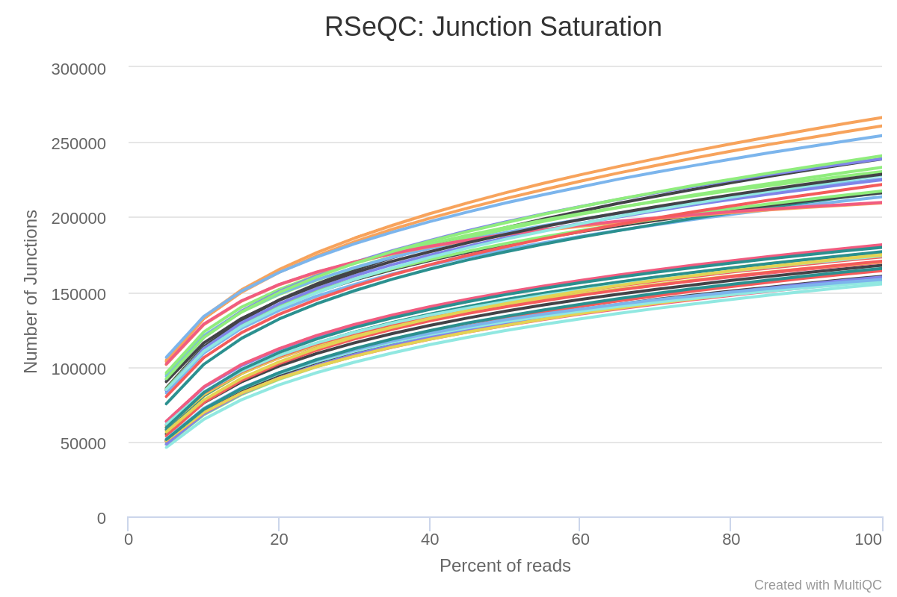
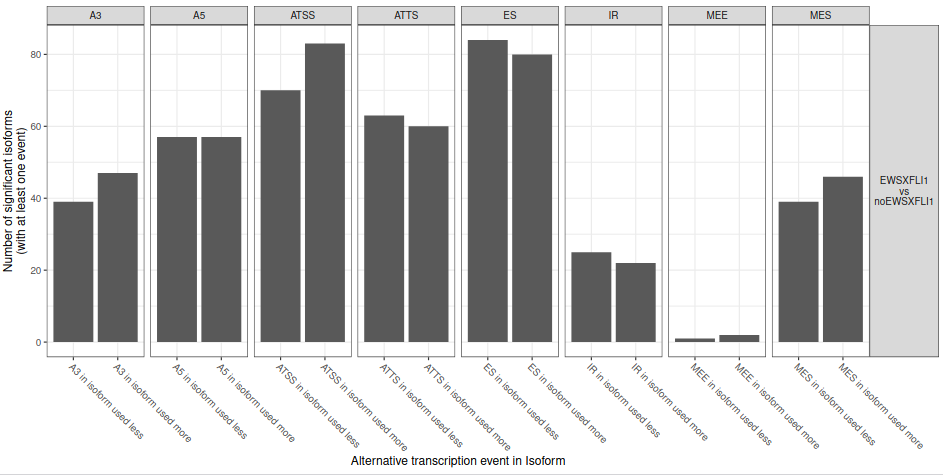
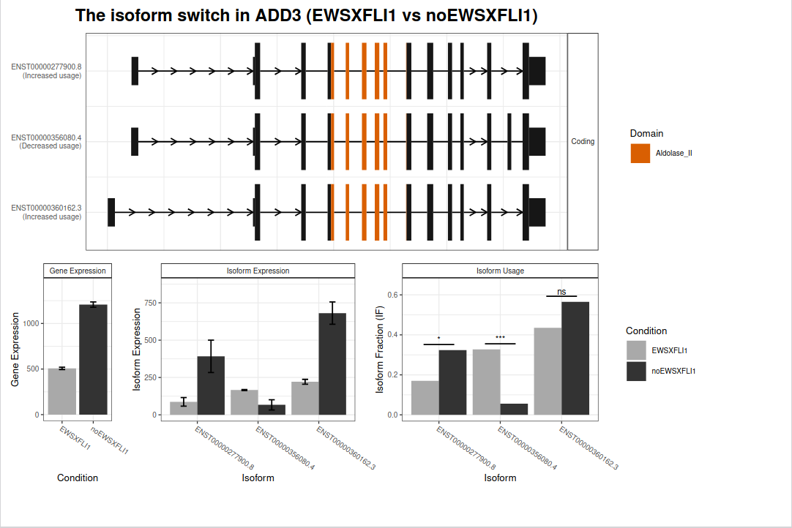

# Introduction

<!-- Needs to be edited! -->

Hepatoblastoma (HB) is the most common malignant pediatric liver tumor and one of the fastest-rising cancers in children younger than 5 years .

> <agenda-title></agenda-title>
>
> In this tutorial, we will cover:
>
> 1. TOC
> {:toc}
>
{: .agenda}

# Experimental design

Text about experimental design.

# Background on data

Text about data background.

## Get data

The first step of our analysis consists of retrieving the RNA-seq datasets from Zenodo and organizing them into collections.

> <hands-on-title>Retrieve miRNA-Seq and mRNA-Seq datasets</hands-on-title>
>
> 1. Create a new history for this tutorial
> 2. Import the files from Zenodo:
>
>    - Open the file  __upload__ menu
>    - Click on __Rule-based__ tab
>    - *"Upload data as"*: `Collection(s)`
>    - Copy the following tabular data, paste it into the textbox and press <kbd>Build</kbd>
>
>      ```
>      SRR11611349	Control miRNA	https://zenodo.org/record/4710649/files/SRR11611349_MIRNASEQ_CTL.fastqsanger.gz	fastqsanger.gz
>      SRR11611350	Control miRNA	https://zenodo.org/record/4710649/files/SRR11611350_MIRNASEQ_CTL.fastqsanger.gz	fastqsanger.gz
>      SRR11611351	Control miRNA	https://zenodo.org/record/4710649/files/SRR11611351.MIRNASEQ_CTLfastqsanger.gz	fastqsanger.gz
>      SRR11611352	BR treated miRNA	https://zenodo.org/record/4710649/files/SRR11611352_MIRNASEQ_BL.fastqsanger.gz	fastqsanger.gz
>      SRR11611353	BR treated miRNA	https://zenodo.org/record/4710649/files/SRR11611353_MIRNASEQ_BL.fastqsanger.gz	fastqsanger.gz
>      SRR11611354	BR treated miRNA	https://zenodo.org/record/4710649/files/SRR11611354_MIRNASEQ_BL.fastqsanger.gz	fastqsanger.gz
>      SRR1019436	Control mRNA	https://zenodo.org/record/4710649/files/SRR1019436_RNASEQ_CTL.fastqsanger.gz	fastqsanger.gz
>      SRR1019437	Control mRNA	https://zenodo.org/record/4710649/files/SRR1019437_RNASEQ_CTL.fastqsanger.gz	fastqsanger.gz
>      SRR1019438	BR treated mRNA	https://zenodo.org/record/4710649/files/SRR1019438_RNASEQ_BL.fastqsanger.gz	fastqsanger.gz
>      SRR1019439	BR treated mRNA	https://zenodo.org/record/4710649/files/SRR1019439_RNASEQ_BL.fastqsanger.gz	fastqsanger.gz
>      ```
>
>    - From **Rules** menu select `Add / Modify Column Definitions`
>       - Click `Add Definition` button and select `List Identifier(s)`: column `A`
>
>         > <tip-title>Can't find <i>List Identifier</i>?</tip-title>
>         > Then you've chosen to upload as a 'dataset' and not a 'collection'. Close the upload menu, and restart the process, making sure you check *Upload data as*: **Collection(s)**
>         {: .tip}
>
>       - Click `Add Definition` button and select `Collection Name`: column `B`
>       - Click `Add Definition` button and select `URL`: column `C`
>       - Click `Add Definition` button and select `Type`: column `D`
>
>    - Click `Apply` and press <kbd>Upload</kbd>
>
> 
{: .hands_on}

Next we will retrieve the remaining datasets.

> <hands-on-title>Retrieve the additional datasets</hands-on-title>
>
> 1. Import the files from Zenodo:
>
>    - Open the file  __upload__ menu
>    - *"Upload data as"*: `Datasets`
>    - Once again, copy the tabular data, paste it into the textbox and press <kbd>Build</kbd>
>
>      ```
>      annotation_AtRTD2.gtf	https://zenodo.org/record/4710649/files/annotation_AtRTD2_19April2016.gtf.gz
>      transcriptome.fasta	https://zenodo.org/record/4710649/files/transcriptome_AtRTD2_12April2016.fasta.gz
>      star_miRNA_seq.fasta	https://zenodo.org/record/4710649/files/star_miRNA_seq.fasta
>      mature_miRNA_AT.fasta	https://zenodo.org/record/4710649/files/mature_miRNA_AT.fasta
>      miRNA_stem-loop_seq.fasta	https://zenodo.org/record/4710649/files/miRNA_stem-loop_seq.fasta
>      ```
>
>    - From **Rules** menu select `Add / Modify Column Definitions`
>       - Click `Add Definition` button and select `Name`: column `A`
>       - Click `Add Definition` button and select `URL`: column `B`
>    - Click `Apply` and press <kbd>Upload</kbd>
>
>
{: .hands_on}

> <details-title>Dataset subsampling</details-title>
>
> As indicated above, for this tutorial the depth of the samples was reduced in order to speed up the time needed to carry out the analysis. This was done as follows:
>
> > <hands-on-title>Dataset subsampling</hands-on-title>
> >
> > 1.  with the following parameters:
> >    -  *"Multiple datasets"*: Each of the fastq files
> >    - *"Subsampling approach"*: `Take every N-th sequence (or pair e.g. every fifth sequence)`
> >    - *"N"*: `100`
> {: .hands_on}
>
> In this way, we will only take 1% of reads at a random sampling rate.
{: .details}

# Initial quality control

Quality assessment text.

## Sub-step with **FASTQ interlacer**

> <hands-on-title> Task description </hands-on-title>
>
> 1.  with the following parameters:
>    - *"Type of paired-end datasets"*: `1 paired dataset collection`
>        -  *"Paired-end reads collection"*: `output` (Input dataset collection)
>
{: .hands_on}

Repeat with the other collection.

## Sub-step with **FastQC**

> <hands-on-title> Task description </hands-on-title>
>
> 1.  with the following parameters:
>    -  *"Raw read data from your current history"*: `outfile_pairs_from_coll` (output of **FASTQ interlacer** )
>
{: .hands_on}

Repeat with the other collection.

## Sub-step with **MultiQC**

> <hands-on-title> Task description </hands-on-title>
>
> 1.  with the following parameters:
>    - In *"Results"*:
>        -  *"Insert Results"*
>            - *"Which tool was used generate logs?"*: `FastQC`
>                - In *"FastQC output"*:
>                    -  *"Insert FastQC output"*
>                        -  *"FastQC output"*: `text_file` (output of **FastQC** )
>    - *"Report title"*: `Raw data QC`
>
{: .hands_on}


# Preprocessing of sequencing reads

## Sub-step with **fastp**

> <hands-on-title> Task description </hands-on-title>
>
> 1.  with the following parameters:
>    - *"Single-end or paired reads"*: `Paired Collection`
>        -  *"Select paired collection(s)"*: `output` (Input dataset collection)
>        - In *"Global trimming options"*:
>            - *"Trim front for input 1"*: `10`
>    - In *"Overrepresented Sequence Analysis"*:
>        - *"Enable overrepresented analysis"*: `Yes`
>        - *"Overrepresentation sampling"*: `50`
>    - In *"Filter Options"*:
>        - In *"Quality filtering options"*:
>            - *"Qualified quality phred"*: `20`
>    - In *"Output Options"*:
>        - *"Output HTML report"*: `Yes`
>        - *"Output JSON report"*: `Yes`
>
{: .hands_on}

Repeat with the other collection

## Sub-step with **MultiQC**

> <hands-on-title> Task description </hands-on-title>
>
> 1.  with the following parameters:
>    - In *"Results"*:
>        -  *"Insert Results"*
>            - *"Which tool was used generate logs?"*: `fastp`
>                -  *"Output of fastp"*: `report_json` (output of **fastp** )
>        -  *"Insert Results"*
>            - *"Which tool was used generate logs?"*: `fastp`
>                -  *"Output of fastp"*: `report_json` (output of **fastp** )
>
{: .hands_on}


# Transcriptome assembly and quantification 

## Sub-step with **RNA STAR**

> <hands-on-title> Task description </hands-on-title>
>
> 1.  with the following parameters:
>    - *"Single-end or paired-end reads"*: `Paired-end (as collection)`
>        -  *"RNA-Seq FASTQ/FASTA paired reads"*: `output_paired_coll` (output of **fastp** )
>    - *"Custom or built-in reference genome"*: `Use reference genome from history and create temporary index`
>        -  *"Select a reference genome"*: `output` (Input dataset)
>        - *"Build index with or without known splice junctions annotation"*: `build index with gene-model`
>            -  *"Gene model (gff3,gtf) file for splice junctions"*: `output` (Input dataset)
>    - *"Use 2-pass mapping for more sensitive novel splice junction discovery"*: `Yes, perform single-sample 2-pass mapping of all reads`
>    - *"Per gene/transcript output"*: `No per gene or transcript output`
>    - In *"BAM output format specification"*:
>        - *"Read alignment tags to include in the BAM output"*: ``
>    - In *"Output filter criteria"*:
>        - *"Would you like to set additional output filters?"*: `No`
>    - In *"Algorithmic settings"*:
>        - *"Configure seed, alignment and limits options"*: `Use Defaults`
>
{: .hands_on}

## Sub-step with **Junction Annotation**

<!-- Needs to be edited -->

It compare detected splice junctions to reference gene model. splicing annotation is performed in two levels: splice event level and splice junction level.

- Splice read: An RNA read, especially long read, can be spliced more than once, therefore, 100 spliced reads can produce >= 100 splicing events.
- Splice junction: multiple splicing events spanning the same intron can be consolidated into one splicing junction.

Detected junctions were divided to 3 exclusive categories:

- Annotated (known): The junction is part of the gene model. Both splice sites, 5’ splice site (5’SS) and 3’splice site (3’SS) are annotated by reference gene model.
- Complete_novel: Both 5’SS and 3’SS are novel.
- Partial_novel: One of the splice site (5’SS or 3’SS) is novel, and the other splice site is annotated.

> <hands-on-title> Task description </hands-on-title>
>
> 1.  with the following parameters:
>    -  *"GTF File to convert"*: `output` (Input dataset)
>    - *"Advanced options"*: `Set advanced options`
>        - *"Ignore groups without exons"*: `Yes`
>
{: .hands_on}

> <hands-on-title> Task description </hands-on-title>
>
> 1.  with the following parameters:
>    -  *"Input BAM/SAM file"*: `mapped_reads` (output of **RNA STAR** )
>    -  *"Reference gene model"*: `bed_file` (output of **Convert GTF to BED12** )
>
{: .hands_on}

## Sub-step with **Junction Saturation**

<!-- Needs to be edited -->

It’s very important to check if current sequencing depth is deep enough to perform alternative splicing analyses. For a well annotated organism, the number of expressed genes in particular tissue is almost fixed so the number of splice junctions is also fixed. The fixed splice junctions can be predetermined from reference gene model. All (annotated) splice junctions should be rediscovered from a saturated RNA-seq data, otherwise, downstream alternative splicing analysis is problematic because low abundance splice junctions are missing. This module checks for saturation by resampling 5%, 10%, 15%, …, 95% of total alignments from BAM or SAM file, and then detects splice junctions from each subset and compares them to reference gene model.

> <hands-on-title> Task description </hands-on-title>
>
> 1.  with the following parameters:
>    -  *"Input BAM/SAM file"*: `mapped_reads` (output of **RNA STAR** )
>    -  *"Reference gene model"*: `bed_file` (output of **Convert GTF to BED12** )
>    - *"Sampling bounds and frequency"*: `Default sampling bounds and frequency`
>    - *"Output R-Script"*: `Yes`
>
{: .hands_on}

## Sub-step with **Read Distribution**

<!-- Needs to be edited -->

Provided a BAM/SAM file and reference gene model, this module will calculate how mapped reads were distributed over genome feature (like CDS exon, 5’UTR exon, 3’ UTR exon, Intron, Intergenic regions). When genome features are overlapped (e.g. a region could be annotated as both exon and intron by two different transcripts) , they are prioritize as: CDS exons > UTR exons > Introns > Intergenic regions, for example, if a read was mapped to both CDS exon and intron, it will be assigned to CDS exons.

> <hands-on-title> Task description </hands-on-title>
>
> 1.  with the following parameters:
>    -  *"Input BAM/SAM file"*: `mapped_reads` (output of **RNA STAR** )
>    -  *"Reference gene model"*: `bed_file` (output of **Convert GTF to BED12** )
>
{: .hands_on}

## Sub-step with **Infer Experiment**

<!-- Needs to be edited -->

This program is used to “guess” how RNA-seq sequencing were configured, particulary how reads were stranded for strand-specific RNA-seq data, through comparing the “strandness of reads” with the “standness of transcripts”.

> <hands-on-title> Task description </hands-on-title>
>
> 1.  with the following parameters:
>    -  *"Input BAM file"*: `mapped_reads` (output of **RNA STAR** )
>    -  *"Reference gene model"*: `bed_file` (output of **Convert GTF to BED12** )
>
{: .hands_on}

## Sub-step with **MultiQC**

> <hands-on-title> Task description </hands-on-title>
>
> 1.  with the following parameters:
>    - In *"Results"*:
>        -  *"Insert Results"*
>            - *"Which tool was used generate logs?"*: `STAR`
>                - In *"STAR output"*:
>                    -  *"Insert STAR output"*
>                        - *"Type of STAR output?"*: `Log`
>                            -  *"STAR log output"*: `output_log` (output of **RNA STAR** )
>                    -  *"Insert STAR output"*
>                        - *"Type of STAR output?"*: `Log`
>        -  *"Insert Results"*
>            - *"Which tool was used generate logs?"*: `RSeQC`
>                - In *"RSeQC output"*:
>                    -  *"Insert RSeQC output"*
>                        - *"Type of RSeQC output?"*: `Infer experiment`
>                            -  *"RSeQC infer experiment: configuration output"*: `output` (output of **Infer Experiment** )
>                    -  *"Insert RSeQC output"*
>                        - *"Type of RSeQC output?"*: `Infer experiment`
>                    -  *"Insert RSeQC output"*
>                        - *"Type of RSeQC output?"*: `Read distribution`
>                    -  *"Insert RSeQC output"*
>                        - *"Type of RSeQC output?"*: `Read distribution`
>                    -  *"Insert RSeQC output"*
>                        - *"Type of RSeQC output?"*: `Junction saturation`
>                    -  *"Insert RSeQC output"*
>                        - *"Type of RSeQC output?"*: `Junction saturation`
>                    -  *"Insert RSeQC output"*
>                        - *"Type of RSeQC output?"*: `Junction annotation`
>                    -  *"Insert RSeQC output"*
>                        - *"Type of RSeQC output?"*: `Junction annotation`
>
{: .hands_on}





## Sub-step with **StringTie**

<!-- Needs to be edited -->

StringTie is a fast and highly efficient assembler of RNA-Seq alignments into potential transcripts. It uses a novel network flow algorithm as well as an optional de novo assembly step to assemble and quantitate full-length transcripts representing multiple splice variants for each gene locus. Its input can include not only alignments of short reads that can also be used by other transcript assemblers, but also alignments of longer sequences that have been assembled from those reads.

> <hands-on-title> Task description </hands-on-title>
>
> 1.  with the following parameters:
>    - *"Input options"*: `Short reads`
>        -  *"Input short mapped reads"*: `mapped_reads` (output of **RNA STAR** )
>    - *"Use a reference file to guide assembly?"*: `Use reference GTF/GFF3`
>        - *"Reference file"*: `Use a file from history`
>            -  *"GTF/GFF3 dataset to guide assembly"*: `output` (Input dataset)
>        - *"Use Reference transcripts only?"*: `Yes`
>        - *"Output files for differential expression?"*: `Ballgown`
>
{: .hands_on}

# Isoform analysis

## Sub-step with **IsoformSwitchAnalyzeR**

> <hands-on-title> Task description </hands-on-title>
>
> 1.  with the following parameters:
>    - *"Tool function mode"*: `Import data`
>        - In *"1: Factor level"*:
>            - *"Specify a factor level, typical values could be 'tumor' or 'treated'"*: `Cancer`
>            -  *"Transcript-level expression measurements"*: `transcript_expression` (output of **StringTie** )
>        - In *"2: Factor level"*:
>            - *"Specify a factor level, typical values could be 'tumor' or 'treated'"*: `Health`
>            -  *"Transcript-level expression measurements"*: `transcript_expression` (output of **StringTie** )
>        - *"Quantification data source"*: `StringTie`
>            - *"Average read length"*: `140`
>        -  *"Genome annotation (GTF)"*: `output` (Input dataset)
>        -  *"Transcriptome"*: `output` (Input dataset)
>
{: .hands_on}

## Sub-step with **IsoformSwitchAnalyzeR**

> <hands-on-title> Task description </hands-on-title>
>
> 1.  with the following parameters:
>    - *"Tool function mode"*: `Analysis part one: Extract isoform switches and their sequences`
>        -  *"IsoformSwitchAnalyzeR R object"*: `switchList` (output of **IsoformSwitchAnalyzeR** )
>
{: .hands_on}

## Sub-step with **PfamScan**

> <hands-on-title> Task description </hands-on-title>
>
> 1.  with the following parameters:
>    -  *"Protein sequences FASTA file"*: `isoformAA` (output of **IsoformSwitchAnalyzeR** )
>    -  *"Pfam-A HMM library"*: `output` (Input dataset)
>    -  *"Pfam-A HMM Stockholm file"*: `output` (Input dataset)
>    - *"Predict active site residues"*: `Enabled`
>        -  *"Active sites file"*: `output` (Input dataset)
>
{: .hands_on}

## Sub-step with **CPAT**

> <hands-on-title> Task description </hands-on-title>
>
> 1.  with the following parameters:
>    -  *"Query nucletide sequences"*: `isoformNT` (output of **IsoformSwitchAnalyzeR** )
>    -  *"Reference genome"*: `output` (Input dataset)
>    -  *"Coding sequences file"*: `output` (Input dataset)
>    -  *"Non coding sequeces file"*: `output` (Input dataset)
>
{: .hands_on}

> <hands-on-title> Task description </hands-on-title>
>
> 1.  with the following parameters:
>    - *"Remove first"*: `1`
>    -  *"From"*: `CPAT on data...`
>
> 2.  with the following parameters:
>    -  *"File to process"*: `Remove beginning on data...`
>    - *"AWK Program"*: `{print i++"\t"$1"\t"$3"\t"$8"\t"$9"\t"$10"\t"$11"\t""-"}`
>
> 3.  with the following parameters:
>    -  *"Concatenate Dataset"*: `CPAT_header.tab`
>    - In *"Dataset"*:
>       - Click in "*Insert Dataset*"
>    - In *"1: Dataset"*:
>       -  *"Select"*: `Text reformatting on...`
>
{: .hands_on}

## Sub-step with **IsoformSwitchAnalyzeR**

> <hands-on-title> Task description </hands-on-title>
>
> 1.  with the following parameters:
>    - *"Tool function mode"*: `Analysis part two: Plot all isoform switches and their annotation`
>        -  *"IsoformSwitchAnalyzeR R object"*: `switchList` (output of **IsoformSwitchAnalyzeR** )
>        - *"Analysis mode"*: `Full analysis`
>        - *"Include prediction of coding potential information"*: `CPAT`
>            -  *"CPAT result file"*: `orf_seqs_prob_best` (output of **CPAT** )
>        - *"Include Pfam information"*: `Enabled`
>            -  *"Include Pfam results (sequence analysis of protein domains)"*: `output` (output of **PfamScan** )
>        - *"Include SignalP results"*: `Disabled`
>        - *"Include prediction of intrinsically disordered Regions (IDR) information"*: `Disabled`
>
{: .hands_on}







## Re-arrange

To create the template, each step of the workflow had its own subsection.

***TODO***: *Re-arrange the generated subsections into sections or other subsections.
Consider merging some hands-on boxes to have a meaningful flow of the analyses*

# Conclusion

Sum up the tutorial and the key takeaways here. We encourage adding an overview image of the
pipeline used.