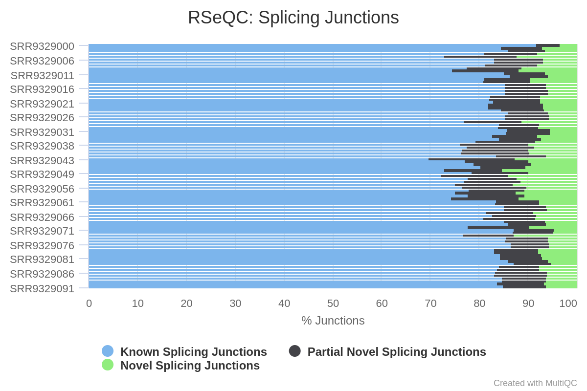
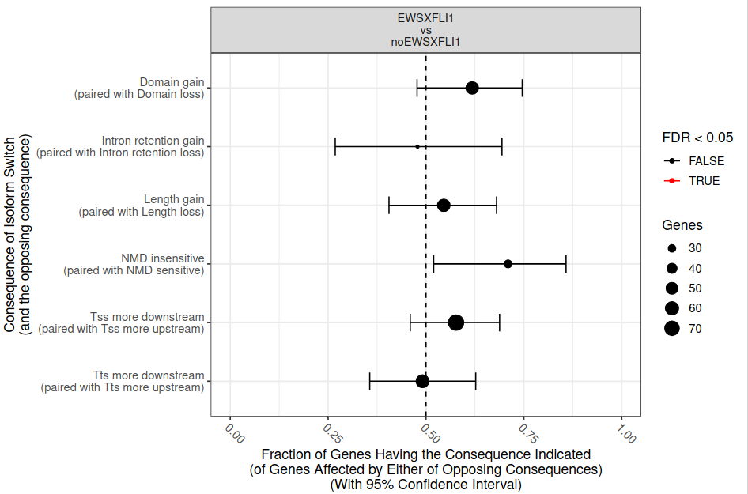
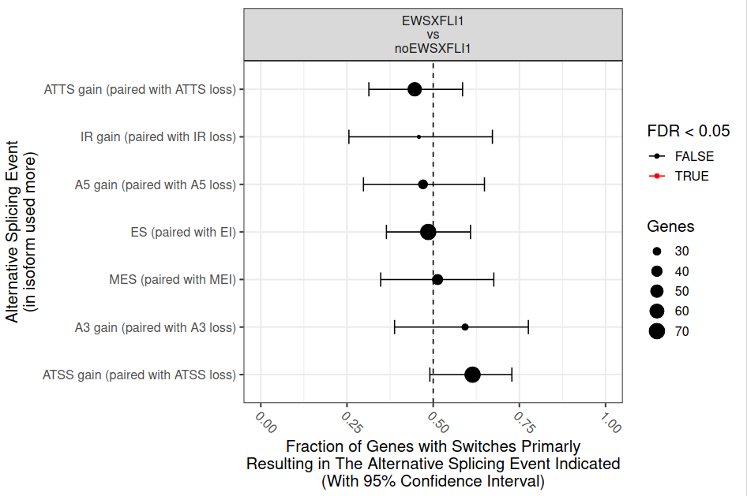
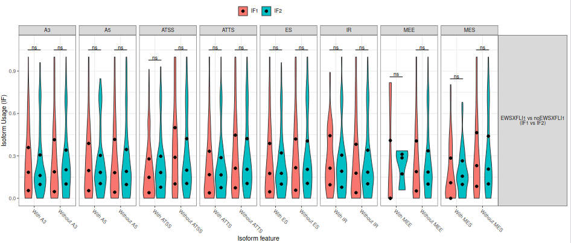

# Introduction

Hepatoblastoma (HB) is the most common malignant pediatric liver tumor and one of the fastest-rising cancers in children younger than 5 years (incidence has tripled in the last 30 years) (, ). The origin of HB is largely unknown; nearly all cases of hepatoblastoma occur in children with no previous known family history of hepatoblastoma (). The molecular analysis has shown that mutations of the Wnt/β-catenin cascade (a key regulator of cell fate and proliferation during liver development and regeneration) occur in the vast majority of human HB samples, and almost exclusively affect the CTNNB1 gene (encoding β-catenin), suggesting that β-catenin pathway activation is the driver event in HB (). 

Epigenetic profile analysis indicates HB tumors are characterized by genome-wide RNA editing and DNA methylation dysregulation (). Diverse studies have demonstrated the influence of aberrant methylation in hepatoblastoma biology by affecting genes involved in signaling and tumor suppression as well as its clinical relevance (). Although DNA methylation was originally thought to only affect transcription, emerging evidence shows that it also regulates alternative splicing, an evolutionarily conserved mechanism that increases transcriptome and proteome diversity by allowing the generation of multiple mRNA products from a single gene (). So far, seven basic types of alternative splicing have been identified, including exon skipping, alternative 5′-splice site, alternative 3′-splice site, mutually exclusive exons, intron retention, alternative promoter, and alternative polyadenylation (fig. 1).

 of two isoforms compared as indicated by the color of the splice patterns. The corresponding classification of the event (middle column) and the abreviation used (right column).")

Discovered over 40 years ago, alternative splicing formed a large part of the puzzle explaining how proteomic complexity can be achieved with a limited set of genes  (). The majority of eukaryote genes have multiple transcriptional isoforms, and recent data indicate that each transcript of protein-coding genes contain 11 exons and produce 5.4 mRNAs on average (). In humans,  approximately 95% of multi-exon genes show evidence of alternative splicing (AS) and approximately 60% of genes have at least one alternative transcription start site, some of which exert antagonistic functions (, ). AS regulation is essential for providing cells and tissues their specific features, and for their response to environmental changes (, ). Differential usage of isoforms in different conditions, often referred to as isoform switching, can have substantial biological impact, caused by the difference in the functional potential of the two isoforms (). Isoform switches are implicated in many diseases and are especially prominent in cancer; this fact has  has motivated genome-wide screens for isoform switches with predicted functional consequences ().

In this tutorial, we aim to perform a genome-wide analysis of the isoform switching phaenomena in hepatoblasmoma, which offers improved resolution over gene expression, with the objective of identify genes of clinical relevance.

> <agenda-title></agenda-title>
>
> In this tutorial, we will cover:
>
> 1. TOC
> {:toc}
>
{: .agenda}


# Background on data

The datasets consist of ten FASTQ files, generated through the Illumina HiSeq 4000 sequencing system. The samples were obtaned by strand-specific RNA sequencing on hepatoblastoma paired samples. The procotol used for extracting the samples includes the depletion of rRNAs by subtractive hybridization, a general strategy for mRNA enrichment in RNA-seq samples. The original datasets are available in the NCBI SRA database, with the accession number [PRJNA416439](https://www.ncbi.nlm.nih.gov/bioproject/?term=PRJNA416439). For this tutorial, subsets from the original data were generated in order to reduce the analysis run time.

## Get data

The first step of our analysis consists of retrieving the RNA-seq datasets from Zenodo and organizing them into collections.

> <hands-on-title>Retrieve miRNA-Seq and mRNA-Seq datasets</hands-on-title>
>
> 1. Create a new history for this tutorial
> 2. Import the files from Zenodo:
>
>    - Open the file  __upload__ menu
>    - Click on __Rule-based__ tab
>    - *"Upload data as"*: `Collection(s)`
>    - Copy the following tabular data, paste it into the textbox and press <kbd>Build</kbd>
>
>      ```
>      SRR11611349	Control miRNA	https://zenodo.org/record/4710649/files/SRR11611349_MIRNASEQ_CTL.fastqsanger.gz	fastqsanger.gz
>      SRR11611350	Control miRNA	https://zenodo.org/record/4710649/files/SRR11611350_MIRNASEQ_CTL.fastqsanger.gz	fastqsanger.gz
>      SRR11611351	Control miRNA	https://zenodo.org/record/4710649/files/SRR11611351.MIRNASEQ_CTLfastqsanger.gz	fastqsanger.gz
>      SRR11611352	BR treated miRNA	https://zenodo.org/record/4710649/files/SRR11611352_MIRNASEQ_BL.fastqsanger.gz	fastqsanger.gz
>      SRR11611353	BR treated miRNA	https://zenodo.org/record/4710649/files/SRR11611353_MIRNASEQ_BL.fastqsanger.gz	fastqsanger.gz
>      SRR11611354	BR treated miRNA	https://zenodo.org/record/4710649/files/SRR11611354_MIRNASEQ_BL.fastqsanger.gz	fastqsanger.gz
>      SRR1019436	Control mRNA	https://zenodo.org/record/4710649/files/SRR1019436_RNASEQ_CTL.fastqsanger.gz	fastqsanger.gz
>      SRR1019437	Control mRNA	https://zenodo.org/record/4710649/files/SRR1019437_RNASEQ_CTL.fastqsanger.gz	fastqsanger.gz
>      SRR1019438	BR treated mRNA	https://zenodo.org/record/4710649/files/SRR1019438_RNASEQ_BL.fastqsanger.gz	fastqsanger.gz
>      SRR1019439	BR treated mRNA	https://zenodo.org/record/4710649/files/SRR1019439_RNASEQ_BL.fastqsanger.gz	fastqsanger.gz
>      ```
>
>    - From **Rules** menu select `Add / Modify Column Definitions`
>       - Click `Add Definition` button and select `List Identifier(s)`: column `A`
>
>         > <tip-title>Can't find <i>List Identifier</i>?</tip-title>
>         > Then you've chosen to upload as a 'dataset' and not a 'collection'. Close the upload menu, and restart the process, making sure you check *Upload data as*: **Collection(s)**
>         {: .tip}
>
>       - Click `Add Definition` button and select `Collection Name`: column `B`
>       - Click `Add Definition` button and select `URL`: column `C`
>       - Click `Add Definition` button and select `Type`: column `D`
>
>    - Click `Apply` and press <kbd>Upload</kbd>
>
> 
{: .hands_on}

Next we will retrieve the remaining datasets.

> <hands-on-title>Retrieve the additional datasets</hands-on-title>
>
> 1. Import the files from Zenodo:
>
>    - Open the file  __upload__ menu
>    - *"Upload data as"*: `Datasets`
>    - Once again, copy the tabular data, paste it into the textbox and press <kbd>Build</kbd>
>
>      ```
>      annotation_AtRTD2.gtf	https://zenodo.org/record/4710649/files/annotation_AtRTD2_19April2016.gtf.gz
>      transcriptome.fasta	https://zenodo.org/record/4710649/files/transcriptome_AtRTD2_12April2016.fasta.gz
>      star_miRNA_seq.fasta	https://zenodo.org/record/4710649/files/star_miRNA_seq.fasta
>      mature_miRNA_AT.fasta	https://zenodo.org/record/4710649/files/mature_miRNA_AT.fasta
>      miRNA_stem-loop_seq.fasta	https://zenodo.org/record/4710649/files/miRNA_stem-loop_seq.fasta
>      ```
>
>    - From **Rules** menu select `Add / Modify Column Definitions`
>       - Click `Add Definition` button and select `Name`: column `A`
>       - Click `Add Definition` button and select `URL`: column `B`
>    - Click `Apply` and press <kbd>Upload</kbd>
>
>
{: .hands_on}

> <details-title>Dataset subsampling</details-title>
>
> As indicated above, for this tutorial the depth of the samples was reduced in order to speed up the time needed to carry out the analysis. This was done as follows:
>
> > <hands-on-title>Dataset subsampling</hands-on-title>
> >
> > 1.  with the following parameters:
> >    -  *"Multiple datasets"*: Each of the fastq files
> >    - *"Subsampling approach"*: `Take every N-th sequence (or pair e.g. every fifth sequence)`
> >    - *"N"*: `100`
> {: .hands_on}
>
> In this way, we will only take 1% of reads at a random sampling rate.
{: .details}

# Quality assessment

Quality assessment text.

## Inicial quality evaluation

> <hands-on-title> Task description </hands-on-title>
>
> 1.  with the following parameters:
>    - *"Type of paired-end datasets"*: `1 paired dataset collection`
>        -  *"Paired-end reads collection"*: `output` (Input dataset collection)
>
> 2. Repeat the previos step
>
> 3.  with the following parameters:
>    -  *"Raw read data from your current history"*: `outfile_pairs_from_coll` (output of **FASTQ interlacer** )
>
> 4. Repeat the previous step
>
>
> 5.  with the following parameters:
>    - In *"Results"*:
>        -  *"Insert Results"*
>            - *"Which tool was used generate logs?"*: `FastQC`
>                - In *"FastQC output"*:
>                    -  *"Insert FastQC output"*
>                        -  *"FastQC output"*: `text_file` (output of **FastQC** )
>    - *"Report title"*: `Raw data QC`
>
{: .hands_on}


## RNA-seq data pre-processsing

> <hands-on-title> Task description </hands-on-title>
>
> 1.  with the following parameters:
>    - *"Single-end or paired reads"*: `Paired Collection`
>        -  *"Select paired collection(s)"*: `output` (Input dataset collection)
>        - In *"Global trimming options"*:
>            - *"Trim front for input 1"*: `10`
>    - In *"Overrepresented Sequence Analysis"*:
>        - *"Enable overrepresented analysis"*: `Yes`
>        - *"Overrepresentation sampling"*: `50`
>    - In *"Filter Options"*:
>        - In *"Quality filtering options"*:
>            - *"Qualified quality phred"*: `20`
>    - In *"Output Options"*:
>        - *"Output HTML report"*: `No`
>        - *"Output JSON report"*: `Yes`
{: .hands_on}


> <hands-on-title> Task description </hands-on-title>
> 2.  with the following parameters:
>    - In *"Results"*:
>        -  *"Insert Results"*
>            - *"Which tool was used generate logs?"*: `fastp`
>                -  *"Output of fastp"*: `report_json` (output of **fastp** )
>        -  *"Insert Results"*
>            - *"Which tool was used generate logs?"*: `fastp`
>                -  *"Output of fastp"*: `report_json` (output of **fastp** )
>
{: .hands_on}


# RNA-seq mapping and quantification 

<!-- Needs to be edited! -->

RNA-seq analysis begins by mapping reads against a reference genome to identify their genomic positions. This mapping information allows us to collect subsets of the reads corresponding to each gene, and then to assemble and quantify transcripts represented by those reads.

Using a mapping of reads to the reference genome, genome-guided transcript assemblers cluster the reads and build graph models representing all possible isoforms for each gene. One such model is a splice graph, in which nodes represent exons or parts of exons, and paths through the graph represent possible splice variants

StringTie uses a genome-guided transcriptome assembly approach along with concepts from de novo genome assembly to improve transcript assembly. Specifically, the inputs to StringTie can include not only spliced read alignments, but also the alignments of contigs that StringTie pre-assembles from read pairs.

## RNA-seq mapping with **RNA STAR**

<!-- Needs to be edited! -->

RNA-seq mappers need to solve an additional problem that is not encountered in DNA-only alignment: many RNA-seq reads will span introns. The RNA-seq processing captures and sequences mature mRNA molecules, from which introns have been removed by splicing. Thus, a single short read might align to two locations that are separated by 10,000 bp or more (the average human intron length is >6,000 bp, and some introns are >1 Mbp in length). For a typical human RNA-seq data set using 100-bp reads, >35% of the reads will span multiple exons. Aligning these multiexon spanning reads is a much more difficult task than aligning reads contained within one exon.

Two-pass alignment, a framework in which splice junctions are separately discovered and quantified, has recently gained traction owing largely to massive speed enhancements achieved by new aligners, which make aligning twice computationally feasible (Dobin et al., 2013; Engstrom et al., 2013). The rationale behind two-pass alignment is elegant: splice junctions are discovered in a first alignment pass with high stringency, and are used as annotation in a second pass to permit lower stringency alignment, and therefore higher sensitivity. In the absence of annotation, compared to traditional single-pass alignment, an independent analysis demonstrated that two-pass alignment with STAR provides comparable mapping rates (though more multimapping), similar mismatch alignment rates, reduced read truncation, superior read placement accuracy, comparable indel accuracy, improved splice junction recall, and better annotated splice junction detection, with comparable discovery of true novel splice junctions at the cost of more false positive discoveries (Engstrom et al., 2013). While the effects of two-pass alignment on transcript assembly and transcript quantification have also been investigated, our primary interest is in splice junction expression quantification, which is relevant to ascertaining the validity of discovered splice junctions, and has not yet been thoroughly investigated (Steijger et al., 2013). In light of the evidence that two-pass alignment can improve alignment rate and sensitivity, we investigated what advantages and disadvantages this approach might yield for splice junction quantification (Engstrom et al., 2013) .

. Third, these discovered splice junctions, and expressed annotated splice junctions are used to re-index the genome. Finally, alignment is performed a second time, quantifying novel and annotated splice junctions using the same, relatively lower stringency (3 nt minimum spanning length), producing splice junction expression.")

Consistent with parameter selection, we found that two-pass alignment enables sequence reads to span novel splice junctions by fewer nucleotides, which confers greater read depth over those splice junctions, and this effect disproportionately benefits samples with shorter reads. The expected read depth benefit from enabling shorter spanning lengths closely matched observed read depth increases across a variety of RNA-seq samples, and affected nearly every splice junction per sample. Further, by aligning significantly more reads to splice junctions, two-pass alignment provides significantly more accurate quantification of novel splice junctions that one-pass alignment, as evidenced by its tight concordance with gene annotation-driven alignment. This quantification is mostly very good, but non-canonical novel splice junctions are likely to be missed using default parameters. Finally, while we observe splice junctions which are likely alignment errors, we demonstrate that these are simple to identify using the distribution of reads spanning the splice junction by short lengths, here less than or equal to twelve nucleotides. In our experience, alignment errors are consistent between samples, underscoring both their sequence-driven nature, and their ease of identification. A similar alignment error classification method is utilized by FineSplice, which also works by modeling splice junction spanning length distributions, and would likely improve on the simple classifier presented here if extended from Tophat results to STAR results (Gatto et al., 2014) .

Beyond these practical benefits, in the context of cancer transcriptomics we anticipate great value in comparing known and novel splice junctions on equal footing, which is enabled only by two-pass alignment. While two-pass alignment particularly benefits shorter read sequences, and technology advances continue to extend read length, much 50 nt-100nt read data already exists and stands to benefit from more sensitive reanalysis. In addition to increased sensitivity for rare and low-expressed splice variants, applications include resolving isoform structures of novel non-coding RNAs and genes in non-human organisms, and supplying more confident novel isoforms for proteogenomic database searching. Successful application here to Arabidopsis RNA-seq data bolsters our optimism that the sequence-driven nature of two-pass alignment would benefit analysis of other organisms as well. While we used STAR here, any sequence alignment algorithm which permits scoring differences between annotated and unannotated splice junctions could be run in a two-pass alignment configuration, and should expect to see similar novel splice junction performance improvements .

> <hands-on-title> Task description </hands-on-title>
>
> 1.  with the following parameters:
>    - *"Single-end or paired-end reads"*: `Paired-end (as collection)`
>        -  *"RNA-Seq FASTQ/FASTA paired reads"*: `output_paired_coll` (output of **fastp** )
>    - *"Custom or built-in reference genome"*: `Use reference genome from history and create temporary index`
>        -  *"Select a reference genome"*: `output` (Input dataset)
>        - *"Build index with or without known splice junctions annotation"*: `build index with gene-model`
>            -  *"Gene model (gff3,gtf) file for splice junctions"*: `output` (Input dataset)
>    - *"Use 2-pass mapping for more sensitive novel splice junction discovery"*: `Yes, perform single-sample 2-pass mapping of all reads`
>    - *"Per gene/transcript output"*: `No per gene or transcript output`
>    - In *"BAM output format specification"*:
>        - *"Read alignment tags to include in the BAM output"*: ``
>    - In *"Output filter criteria"*:
>        - *"Would you like to set additional output filters?"*: `No`
>    - In *"Algorithmic settings"*:
>        - *"Configure seed, alignment and limits options"*: `Use Defaults`
>
{: .hands_on}

## RNA-seq specific quality control metrics with **RSeQC**

<!-- Needs to be edited! -->

Current RNA-seq protocols still possess several intrinsic biases and limitations, such as nucleotide composition bias, GC bias and PCR bias. These biases directly affect the accuracy of many RNA-seq applications (Benjamini and Speed, 2012; Hansen and Brenner, 2010) and can be directly checked from raw sequences using tools like FastQC. However, these raw sequence-based metrics are not sufficient to ensure the usability of RNA-seq data; other RNA-seq-specific quality control (QC) metrics, such as sequencing depth, read distribution and coverage uniformity, are even more important. For instance, sequencing depth must be saturated before carrying out many RNA-seq applications, including expression profiling, alternative splicing analysis, novel isoform identification and transcriptome reconstruction. The use of RNA-seq with unsaturated sequencing depth gives imprecise estimations (such as for RPKM and splicing index) and fails to detect low abundance splice junctions, thereby limit the precision of many analyses .

> <hands-on-title> Task description </hands-on-title>
>
> 1.  with the following parameters:
>    -  *"GTF File to convert"*: `output` (Input dataset)
>    - *"Advanced options"*: `Set advanced options`
>        - *"Ignore groups without exons"*: `Yes`
>
{: .hands_on}

### RNA-seq configuration analysis with **Infer Experiment**

<!-- Needs to be edited -->

This program is used to “guess” how RNA-seq sequencing were configured, particulary how reads were stranded for strand-specific RNA-seq data, through comparing the “strandness of reads” with the “standness of transcripts”.

> <hands-on-title> Task description </hands-on-title>
>
> 1.  with the following parameters:
>    -  *"Input BAM file"*: `mapped_reads` (output of **RNA STAR** )
>    -  *"Reference gene model"*: `bed_file` (output of **Convert GTF to BED12** )
>
{: .hands_on}

### Read coverage over gene bodies  with **Gene Body Coverage (BAM)**

<!-- Needs to be edited -->

Gene Body Coverage calculates read coverage over gene bodies. This is used to check if reads coverage is uniform and if there is any 5' or 3' bias.

> <hands-on-title> Task description </hands-on-title>
>
> 1.  with the following parameters:
>    -  *"Input BAM file"*: `mapped_reads` (output of **RNA STAR** )
>    -  *"Reference gene model"*: `bed_file` (output of **Convert GTF to BED12** )
>
{: .hands_on}

### Sequencing depth analysis with **Junction Saturation**

<!-- Needs to be edited -->

It’s very important to check if current sequencing depth is deep enough to perform alternative splicing analyses. For a well annotated organism, the number of expressed genes in particular tissue is almost fixed so the number of splice junctions is also fixed. The fixed splice junctions can be predetermined from reference gene model. All (annotated) splice junctions should be rediscovered from a saturated RNA-seq data, otherwise, downstream alternative splicing analysis is problematic because low abundance splice junctions are missing. This module checks for saturation by resampling 5%, 10%, 15%, …, 95% of total alignments from BAM or SAM file, and then detects splice junctions from each subset and compares them to reference gene model.

 The junction saturation test is very important for alternative splicing analysis, as using an unsaturated sequencing depth would miss many rare splice junctions .

> <hands-on-title> Task description </hands-on-title>
>
> 1.  with the following parameters:
>    -  *"Input BAM/SAM file"*: `mapped_reads` (output of **RNA STAR** )
>    -  *"Reference gene model"*: `bed_file` (output of **Convert GTF to BED12** )
>    - *"Sampling bounds and frequency"*: `Default sampling bounds and frequency`
>    - *"Output R-Script"*: `Yes`
>
{: .hands_on}

### Splice junction classification with **Junction Annotation**

<!-- Needs to be edited -->

It separates all detected splice junctions into ‘known’, ‘complete novel’ and ‘partial novel’ by comparing them with the reference gene model .

It compare detected splice junctions to reference gene model. splicing annotation is performed in two levels: splice event level and splice junction level.

- Splice read: An RNA read, especially long read, can be spliced more than once, therefore, 100 spliced reads can produce >= 100 splicing events.
- Splice junction: multiple splicing events spanning the same intron can be consolidated into one splicing junction.

Detected junctions were divided to 3 exclusive categories:

- Annotated (known): The junction is part of the gene model. Both splice sites, 5’ splice site (5’SS) and 3’splice site (3’SS) are annotated by reference gene model.
- Complete_novel: Both 5’SS and 3’SS are novel.
- Partial_novel: One of the splice site (5’SS or 3’SS) is novel, and the other splice site is annotated.

> <hands-on-title> Task description </hands-on-title>
>
> 1.  with the following parameters:
>    -  *"Input BAM/SAM file"*: `mapped_reads` (output of **RNA STAR** )
>    -  *"Reference gene model"*: `bed_file` (output of **Convert GTF to BED12** )
>
{: .hands_on}


### Genome features analysis with **Read Distribution**

<!-- Needs to be edited -->

Provided a BAM/SAM file and reference gene model, this module will calculate how mapped reads were distributed over genome feature (like CDS exon, 5’UTR exon, 3’ UTR exon, Intron, Intergenic regions). When genome features are overlapped (e.g. a region could be annotated as both exon and intron by two different transcripts) , they are prioritize as: CDS exons > UTR exons > Introns > Intergenic regions, for example, if a read was mapped to both CDS exon and intron, it will be assigned to CDS exons.

> <hands-on-title> Task description </hands-on-title>
>
> 1.  with the following parameters:
>    -  *"Input BAM/SAM file"*: `mapped_reads` (output of **RNA STAR** )
>    -  *"Reference gene model"*: `bed_file` (output of **Convert GTF to BED12** )
>
{: .hands_on}


### Aggregate results with **MultiQC**

> <hands-on-title> Task description </hands-on-title>
>
> 1.  with the following parameters:
>    - In *"Results"*:
>        -  *"Insert Results"*
>            - *"Which tool was used generate logs?"*: `STAR`
>                - In *"STAR output"*:
>                    -  *"Insert STAR output"*
>                        - *"Type of STAR output?"*: `Log`
>                            -  *"STAR log output"*: `output_log` (output of **RNA STAR** )
>                    -  *"Insert STAR output"*
>                        - *"Type of STAR output?"*: `Log`
>        -  *"Insert Results"*
>            - *"Which tool was used generate logs?"*: `RSeQC`
>                - In *"RSeQC output"*:
>                    -  *"Insert RSeQC output"*
>                        - *"Type of RSeQC output?"*: `Infer experiment`
>                            -  *"RSeQC infer experiment: configuration output"*: `output` (output of **Infer Experiment** )
>                    -  *"Insert RSeQC output"*
>                        - *"Type of RSeQC output?"*: `Infer experiment`
>                    -  *"Insert RSeQC output"*
>                        - *"Type of RSeQC output?"*: `Read distribution`
>                    -  *"Insert RSeQC output"*
>                        - *"Type of RSeQC output?"*: `Read distribution`
>                    -  *"Insert RSeQC output"*
>                        - *"Type of RSeQC output?"*: `Junction saturation`
>                    -  *"Insert RSeQC output"*
>                        - *"Type of RSeQC output?"*: `Junction saturation`
>                    -  *"Insert RSeQC output"*
>                        - *"Type of RSeQC output?"*: `Junction annotation`
>                    -  *"Insert RSeQC output"*
>                        - *"Type of RSeQC output?"*: `Junction annotation`
>                    -  *"Insert RSeQC output"*
>                        - *"Type of RSeQC output?"*: `Gene body coverage`
>                    -  *"Insert RSeQC output"*
>                        - *"Type of RSeQC output?"*: `Gene body coverage`
>
{: .hands_on}





## Transcripts quantification with **StringTie**

<!-- Needs to be edited -->

StringTie is a fast and highly efficient assembler of RNA-Seq alignments into potential transcripts. It uses a novel network flow algorithm as well as an optional de novo assembly step to assemble and quantitate full-length transcripts representing multiple splice variants for each gene locus. Its input can include not only alignments of short reads that can also be used by other transcript assemblers, but also alignments of longer sequences that have been assembled from those reads .

StringTie assembles transcripts and estimates their expression levels simultaneously. StringTie first groups the reads into clusters, then creates a splice graph for each cluster from which it identifies transcripts, and then for each transcript it creates a separate flow network to estimate its expression level using a maximum flow algorithm .


The main reason underlying the greater accuracy of StringTie most likely derives from its optimization criteria. By balancing the coverage (or flow) of each transcript across each assembly, it incorporates depth of coverage constraints into the assembly algorithm itself. When assembling a whole genome, coverage is a crucial parameter that must be used to constrain the algorithm; otherwise an assembler may incorrectly collapse repetitive sequences. Similarly, when assembling a transcript, each exon within an isoform should have similar coverage, and ignoring this parameter may produce sets of transcripts that are parsimonious but wrong .

StringTie is a transcript assembler that uses the optimization technique of maximum flow in a specially constructed flow network to determine gene expression levels, and does so while simultaneously assembling each isoform of a gene. And unlike other transcript assemblers, it incorporates alignment to both a genome and a de novo assembly of reads .

StringTie takes as input a SAM, BAM or CRAM file sorted by coordinate (genomic location). Any SAM record with a spliced alignment (i.e. having a read alignment across at least one junction) should have the XS tag (or the ts tag, see below) which indicates the transcription strand, the genomic strand from which the RNA that produced the read originated . 

> <hands-on-title> Task description </hands-on-title>
>
> 1.  with the following parameters:
>    - *"Input options"*: `Short reads`
>        -  *"Input short mapped reads"*: `mapped_reads` (output of **RNA STAR** )
>    - *"Use a reference file to guide assembly?"*: `Use reference GTF/GFF3`
>        - *"Reference file"*: `Use a file from history`
>            -  *"GTF/GFF3 dataset to guide assembly"*: `output` (Input dataset)
>        - *"Use Reference transcripts only?"*: `Yes`
>        - *"Output files for differential expression?"*: `Ballgown`
>
{: .hands_on}

Stringtie generates different table files; in our case, we are only interested in the collection called **transcript-level expression measurements** (t_tab.ctab files). Each file includes one row per transcript, with the following columns:

- t_id: numeric transcript id
- chr, strand, start, end: genomic location of the transcript
- t_name: generated transcript id
- num_exons: number of exons comprising the transcript
- length: transcript length, including both exons and introns
- gene_id: gene the transcript belongs to
- gene_name: HUGO gene name for the transcript, if known
- cov: per-base coverage for the transcript (available for each sample)
- FPKM: Estimated FPKM for the transcript (available for each sample)

# Genome-wide isoform switch analysis with **IsoformSwitchAnalyzeR**

<!-- Needs to be edited! -->

IsoformSwitchAnalyzeR enables analysis of changes in genome-wide patterns of alternative splicing and isoform switch consequences.

A genome-wide analysis is both useful for getting an overview of the extent of isoform switching as well as discovering general patterns. IsoformSwitchAnalyzeR supports this by providing four different summaries/analyses for both the analysis of alternative splicing and isoform switches with predicted consequences. All functions provide a visual overview as well as a data.frame with the summary statistics. The four analysis types supported are:

- Global summary statistics, implemented in the extractConsequenceSummary() and extractSplicingSummary() functions, which summarizes the number of switches with predicted consequences and the number of splicing events occurring in the different comparisons, respectively.
- Analysis of splicing/consequence enrichment, implemented in the extractConsequenceEnrichment() and extractSplicingEnrichment() functions, which analyzes whether a particular consequence/splice type occurs more frequently than the opposite event (e.g. domain loss vs domain gain) in a giving comparison (e.g. WT->KO1).
- Comparison of enrichment, implemented in extractConsequenceEnrichmentComparison() and extractSplicingEnrichmentComparison() functions, which compares the enrichment of a particular consequence/splice type between comparisons (e.g. compares the changes in WT->KO1 vs WT->KO2)
- Analysis of genome-wide changes in isoform usage, implemented in extractConsequenceGenomeWide() and extractSplicingGenomeWide() functions, which analyses the genome-wide changes in isoform usage for all isoforms with particular opposite pattern events. This type of analysis is particular interesting if the expected difference between conditions is large, since such effects could result in genome-wide changes. The analysis works by simultaneously analyzing all isoforms with a specific feature (e.g. intron retention) for changes in isoform usage.

## Import data into **IsoformSwitchAnalyzeR**


> <hands-on-title> Task description </hands-on-title>
>
> 1.  with the following parameters:
>    - *"Tool function mode"*: `Import data`
>        - In *"1: Factor level"*:
>            - *"Specify a factor level, typical values could be 'tumor' or 'treated'"*: `Cancer`
>            -  *"Transcript-level expression measurements"*: `transcript_expression` (output of **StringTie** )
>        - In *"2: Factor level"*:
>            - *"Specify a factor level, typical values could be 'tumor' or 'treated'"*: `Health`
>            -  *"Transcript-level expression measurements"*: `transcript_expression` (output of **StringTie** )
>        - *"Quantification data source"*: `StringTie`
>            - *"Average read length"*: `140`
>        -  *"Genome annotation (GTF)"*: `output` (Input dataset)
>        -  *"Transcriptome"*: `output` (Input dataset)
>
{: .hands_on}


## Filtering and isoform switching identification

<!-- Needs to be edited! -->

Once you have a switchAnalyzeRlist, there is a good chance that it contains a lot of genes/isoforms that are irrelevant for an analysis of isoform switches. Examples of such could be single isoform genes or non-expressed isoforms. These extra genes/isoforms will make the downstream analysis take (much) longer than necessary. Therefore we have implemented a pre-filtering step to remove these features before continuing with the analysis. Importantly, filtering can enhance the reliability of the downstream analysis as described in detail below.

By using preFilter() it is possible to remove genes and isoforms from all aspects of the switchAnalyzeRlist by filtering on:

- Multi-isoform genes
- Gene expression
- Isoform expression
- Isoform Fraction (isoform usage)
- Unwanted isoform classes
- Unwanted gene biotypes
- Genes without differential isoform usage
- Removal of single isoform genes is the default setting in preFilter() since these genes, per definition, cannot have changes in isoform usage.

Filtering on isoform expression allows removal of non-used isoforms that only appear in the switchAnalyzeRlist because they were in the isoform/gene annotation used. Furthermore, the expression filtering allows removal of lowly expressed isoforms where the expression levels might be untrustworthy. 


<!-- Needs to be edited! -->

Two major challenges in testing differential isoform usage have been controlling false discovery rates (FDR) and applying effect size cutoffs in experimental setups with confounding effects. Recent studies such as Love at al highlights DEXSeq (developed by Anders et al., see What To Cite — please remember to cite it) as being a good solution as it controls FDR quite well. We have therefore implemented a DEXSeq based test as the default in IsoformSwitchAnalyzeR. This test furthermore utilizes limma to produce effect sizes corrected for confounding effects.

An important argument in isoformSwitchTestDEXSeq is the ‘reduceToSwitchingGenes’. When TRUE this argument will cause the function to reduce/subset the switchAnalyzeRlist to the genes which each contains at least one differential used isoform, as indicated by the alpha and dIFcutoff cutoffs. This option ensures the rest of the workflow runs significantly faster since isoforms from genes without isoform switching are not analyzed.

> <hands-on-title> Task description </hands-on-title>
>
> 1.  with the following parameters:
>    - *"Tool function mode"*: `Analysis part one: Extract isoform switches and their sequences`
>        -  *"IsoformSwitchAnalyzeR R object"*: `switchList` (output of **IsoformSwitchAnalyzeR** )
>
{: .hands_on}

### Importing external sequence analysis and genome-wide analysis

### Protein domain identification with **PfamScan**

<!-- Needs to be edited! -->

PfamScan is used to search a FASTA sequence against a library of Pfam HMM.

Pfam is a database of protein families and domains that is widely used to analyse novel genomes, metagenomes and to guide experimental work on particular proteins and systems (1,2). Each Pfam family has a seed alignment that contains a representative set of sequences for the entry. A profile hidden Markov model (HMM) is automatically built from the seed alignment and searched against a sequence database called pfamseq using the HMMER software (http://hmmer.org/). All sequence regions that satisfy a family-specific curated threshold, also known as the gathering threshold, are aligned to the profile HMM to create the full alignment .

> <hands-on-title> Task description </hands-on-title>
>
> 1.  with the following parameters:
>    -  *"Protein sequences FASTA file"*: `isoformAA` (output of **IsoformSwitchAnalyzeR** )
>    -  *"Pfam-A HMM library"*: `output` (Input dataset)
>    -  *"Pfam-A HMM Stockholm file"*: `output` (Input dataset)
>    - *"Predict active site residues"*: `Enabled`
>        -  *"Active sites file"*: `output` (Input dataset)
>
{: .hands_on}

### RNA coding probablity prediction with **CPAT**

<!-- Needs to be edited! -->

CPAT is a bioinformatics tool to predict RNA’s coding probability based on the RNA sequence characteristics. To achieve this goal, CPAT calculates scores of these 4 linguistic features from a set of known protein-coding genes and another set of non-coding genes.

- ORF size
- ORF coverage
- Fickett TESTCODE
- Hexamer usage bias

CPAT will then builds a logistic regression model using these 4 features as predictor variables and the “protein-coding status” as the response variable. After evaluating the performance and determining the probability cutoff, the model can be used to predict new RNA sequences.

> <hands-on-title> Task description </hands-on-title>
>
> 1.  with the following parameters:
>    -  *"Query nucletide sequences"*: `isoformNT` (output of **IsoformSwitchAnalyzeR** )
>    -  *"Reference genome"*: `output` (Input dataset)
>    -  *"Coding sequences file"*: `output` (Input dataset)
>    -  *"Non coding sequeces file"*: `output` (Input dataset)
>
{: .hands_on}

> <hands-on-title> Task description </hands-on-title>
>
> 1.  with the following parameters:
>    - *"Remove first"*: `1`
>    -  *"From"*: `CPAT on data...`
>
> 2.  with the following parameters:
>    -  *"File to process"*: `Remove beginning on data...`
>    - *"AWK Program"*: `{print i++"\t"$1"\t"$3"\t"$8"\t"$9"\t"$10"\t"$11"\t""-"}`
>
> 3.  with the following parameters:
>    -  *"Concatenate Dataset"*: `CPAT_header.tab`
>    - In *"Dataset"*:
>       - Click in "*Insert Dataset*"
>    - In *"1: Dataset"*:
>       -  *"Select"*: `Text reformatting on...`
>
{: .hands_on}

If an isoform has a significant change in its contribution to gene expression, there must per definition be reciprocal changes in one (or more) isoforms in the opposite direction, compensating for the change in the first isoform. We utilize this by extracting the isoforms that are significantly differentially used and compare them to the isoforms that are compensating. Using all the information gathered through the workflow described above, the annotation of the isoform(s) used more (positive dIF) can be compared to the isoform(s) used less (negative dIF) and by systematically identify differences annotation we can identify potential function consequences of the isoform switch.

Specifically, IsoformSwitchAnalyzeR contains a function analyzeSwitchConsequences() which extracts the isoforms with significant changes in their isoform usage (defined by the alpha and dIFcutoff parameters, see Identifying Isoform Switches for details) and the isoform, with a large opposite change in isoform usage (also controlled via the dIFcutoff parameters) that compensate for the changes. Note that if an isoform-level test was not used, the gene is require to be significant (defined by the alpha parameter); but, isoforms are then selected purely based on their changes in dIF values.

These isoforms are then divided into the isoforms that increase their contribution to gene expression (positive dIF values larger than dIFcutoff) and the isoforms that decrease their contribution (negative dIF values smaller than -dIFcutoff). The isoforms with increased contribution are then (in a pairwise manner) compared to the isoform with decreasing contribution. In each of these comparisons the isoforms compared are analyzed for differences in their annotation (controlled by the consequencesToAnalyze parameter). Currently 22 different features of the isoforms can be compared, which include features such as intron retention, coding potential, NMD status, protein domains and the sequence similarity of the amino acid sequence of the annotated ORFs. 

> <hands-on-title> Task description </hands-on-title>
>
> 1.  with the following parameters:
>    - *"Tool function mode"*: `Analysis part two: Plot all isoform switches and their annotation`
>        -  *"IsoformSwitchAnalyzeR R object"*: `switchList` (output of **IsoformSwitchAnalyzeR** )
>        - *"Analysis mode"*: `Full analysis`
>        - *"Include prediction of coding potential information"*: `CPAT`
>            -  *"CPAT result file"*: `orf_seqs_prob_best` (output of **CPAT** )
>        - *"Include Pfam information"*: `Enabled`
>            -  *"Include Pfam results (sequence analysis of protein domains)"*: `output` (output of **PfamScan** )
>        - *"Include SignalP results"*: `Disabled`
>        - *"Include prediction of intrinsically disordered Regions (IDR) information"*: `Disabled`
>
{: .hands_on}









### Analysis of individual isoform switching

> <hands-on-title> Task description </hands-on-title>
>
> 1.  with the following parameters:
>    - *"Tool function mode"*: `Analysis part two: Plot all isoform switches and their annotation`
>        -  *"IsoformSwitchAnalyzeR R object"*: `switchList` (output of **IsoformSwitchAnalyzeR** )
>        - *"Analysis mode"*: `Analyze specific gene`
>        - *"Gene name"*: `Example name`
>        - *"Include prediction of coding potential information"*: `CPAT`
>            -  *"CPAT result file"*: `orf_seqs_prob_best` (output of **CPAT** )
>        - *"Include Pfam information"*: `Enabled`
>            -  *"Include Pfam results (sequence analysis of protein domains)"*: `output` (output of **PfamScan** )
>        - *"Include SignalP results"*: `Disabled`
>        - *"Include prediction of intrinsically disordered Regions (IDR) information"*: `Disabled`
>
{: .hands_on}


# Conclusion

Despite the large amount of RNA-seq data and computational methods available, isoform-based expression analysis is rare. This means that the potential of existing RNA-seq data is untapped, and as a consequence, our general understanding of differential isoform usage is poor. The few efforts at analyzing individual isoform switches have typically dealt with isoforms by describing their frequent occurrence rather than trying to systematically predict their consequence. Overall, this is unsatisfying, as isoform usage is important in disease and especially cancer, where many individual isoform switches have been described .

Here we present methods for the statistical identification and analysis of isoform switches with predicted functional consequences .