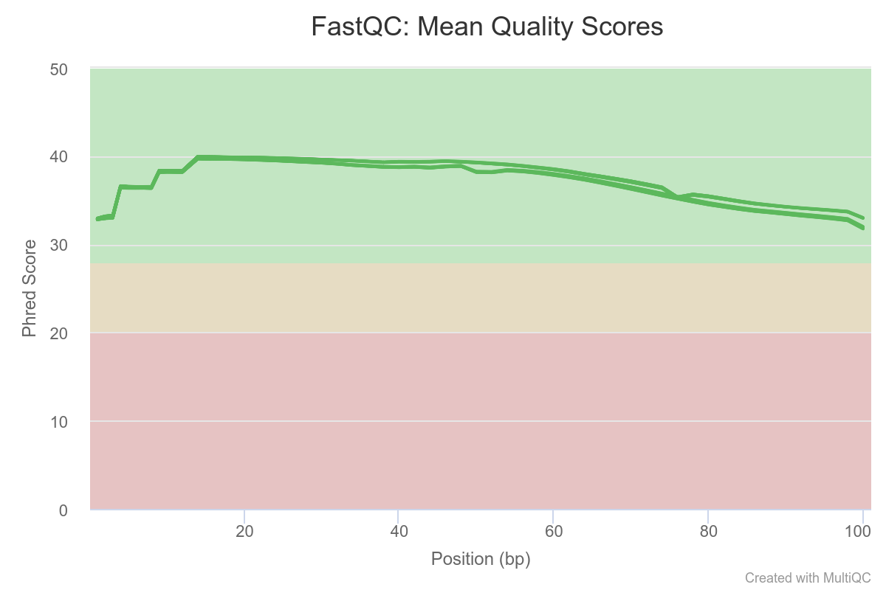
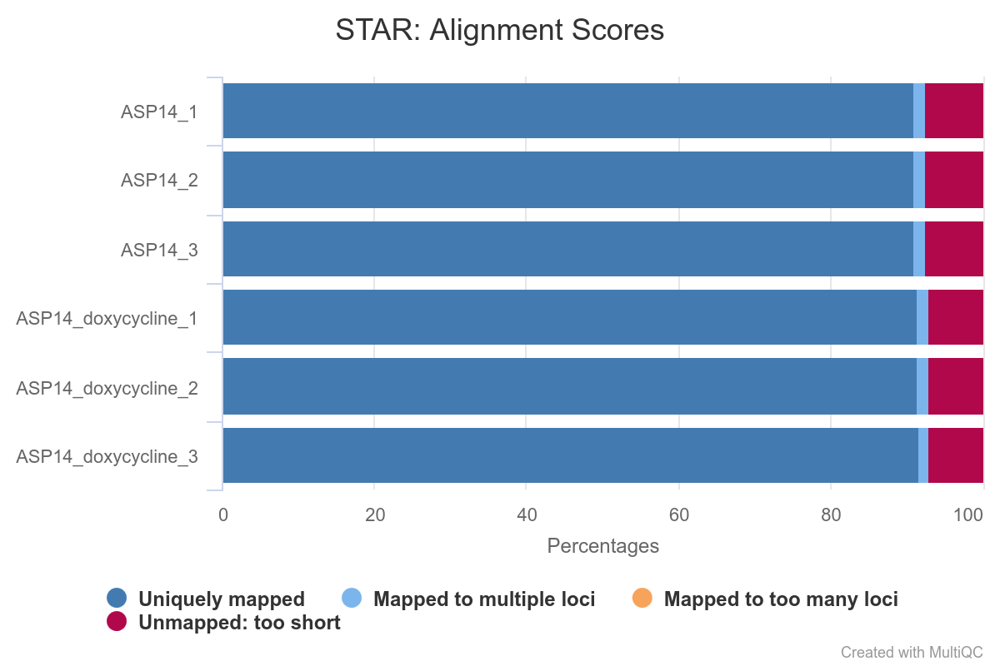
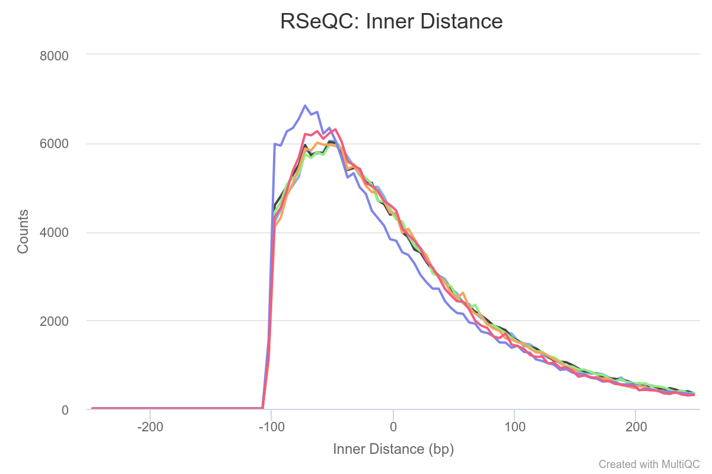
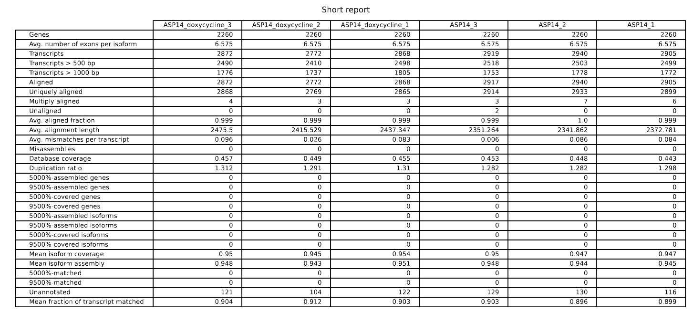
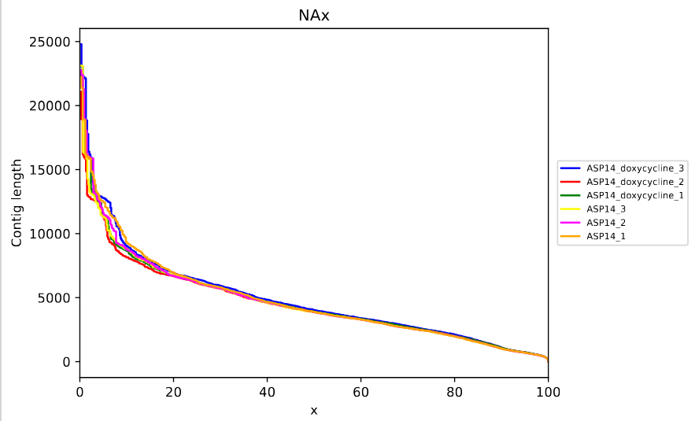
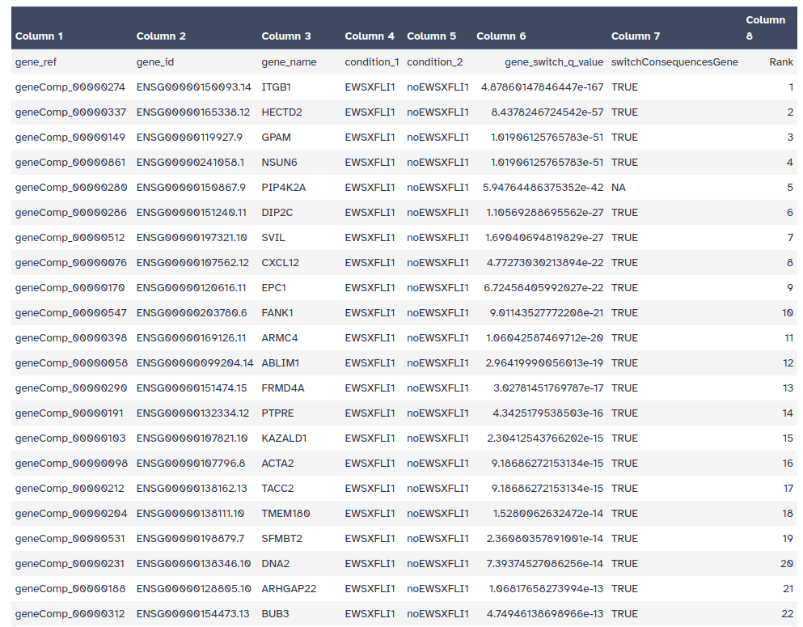
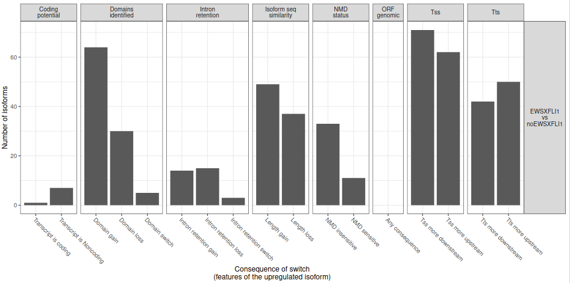

Discovered over 40 years ago, {AS} formed a large part of the puzzle explaining how proteomic complexity can be achieved with a limited set of genes  (). The majority of eukaryote genes have multiple transcriptional isoforms, and recent data indicate that each transcript of protein-coding genes contain 11 exons and produce 5.4 mRNAs on average (). In humans,  approximately 95% of multi-exon genes show evidence of {AS} and approximately 60% of genes have at least one alternative transcription start site, some of which exert antagonistic functions (, ). Its regulation is essential for providing cells and tissues their specific features, and for their response to environmental changes (, ).

Alterations in gene splicing has been demonstrated to have significant impact on cancer development, and multiple evidences indicate that its disruption can exhibit effects on virtually all aspect of tumor progression (, ). For instance, the unannotated isoform of TNS3 was found to be a novel driver of breast cancer (). 


Disregulation in {AS} can lead to the activation of {OCGs} or the inactivation of {TSGs}, which can promote or suppress tumorigenesis, respectively (). However, the strict classification of cancer genes as either {OCGs} or {TSGs} may be an oversimplification, as some genes can exhibit a dual role in cancer development, often impacting the same facet of tumorigenesis (). One of the mechanism that has been proposed to partially explain this apparently contradictory effect is the differential usage of isoforms, often referred to as {IS}. This regulatory phenomenon has been demonstrated to have a substantial biological impact in a diverse range of biological contexts, caused by functional diversity potential of the different isoforms (). 

In this tutorial, we aim to perform a genome-wide analysis of {IS} in cancer, with the objective of identifying genes of potential clinical relevance and gene regulatory networks on genome-scale.

> <agenda-title></agenda-title>
>
> In this tutorial, we will cover:
>
> 1. TOC
> {:toc}
>
{: .agenda}


# Background on data

The datasets consist of twelve FASTQ files, generated through the Illumina NovaSeq 6000 sequencing system. Half of the samples were obtained from PANC1 tumour lines, and the rest from control cells. The protocol used for extracting the samples includes the depletion of rRNAs by subtractive hybridization, a general strategy for mRNA enrichment in RNA-seq samples. For this training we will use a reduced set of reads, in order to speed up the analysis. The original datasets are available in the NCBI SRA database, with the accession number [PRJNA542693](https://www.ncbi.nlm.nih.gov/bioproject/PRJNA542693).

## Get data

The first step of our analysis consists of retrieving the RNA-seq datasets from Zenodo and organizing them into collections.

> <hands-on-title>Retrieve miRNA-Seq and mRNA-Seq datasets</hands-on-title>
>
> 1. Create a new history for this tutorial
> 2. Import the files from Zenodo:
>
>    - Open the file  __upload__ menu
>    - Click on __Rule-based__ tab
>    - *"Upload data as"*: `Collection(s)`
>    - Copy the following tabular data, paste it into the textbox and press <kbd>Build</kbd>
>
>      ```
>      SRR9050437_Health	{{ page.zenodo_link }}/files/SRR9050437F_health.fastq.gz	fastqsanger.gz	1
>      SRR9050437_Health	{{ page.zenodo_link }}/files/SRR9050437R_health.fastq.gz	fastqsanger.gz	2
>      SRR9050438_Health	{{ page.zenodo_link }}/files/SRR9050438F_health.fastq.gz	fastqsanger.gz	1
>      SRR9050438_Health	{{ page.zenodo_link }}/files/SRR9050438R_health.fastq.gz	fastqsanger.gz	2
>      SRR9050439_Health	{{ page.zenodo_link }}/files/SRR9050439F_health.fastq.gz	fastqsanger.gz	1
>      SRR9050439_Health	{{ page.zenodo_link }}/files/SRR9050439R_health.fastq.gz	fastqsanger.gz	2
>      SRR9050440_Cancer	{{ page.zenodo_link }}/files/SRR9050440F_cancer.fastq.gz	fastqsanger.gz	1
>      SRR9050440_Cancer	{{ page.zenodo_link }}/files/SRR9050440R_cancer.fastq.gz	fastqsanger.gz	2
>      SRR9050441_Cancer	{{ page.zenodo_link }}/files/SRR9050441F_cancer.fastq.gz	fastqsanger.gz	1
>      SRR9050441_Cancer	{{ page.zenodo_link }}/files/SRR9050441R_cancer.fastq.gz	fastqsanger.gz	2
>      SRR9050442_Cancer	{{ page.zenodo_link }}/files/SRR9050442F_cancer.fastq.gz	fastqsanger.gz	1
>      SRR9050442_Cancer	{{ page.zenodo_link }}/files/SRR9050442R_cancer.fastq.gz	fastqsanger.gz	2
>      ```
>
>    - From **Rules** menu select `Add / Modify Column Definitions`
>       - Click `Add Definition` button and select `List Identifier(s)`: column `A`
>
>         > <tip-title>Can't find <i>List Identifier</i>?</tip-title>
>         > Then you've chosen to upload as a 'dataset' and not a 'collection'. Close the upload menu, and restart the process, making sure you check *Upload data as*: **Collection(s)**
>         {: .tip}
>
>       - Click `Add Definition` button and select `URL`: column `B`
>       - Click `Add Definition` button and select `Type`: column `C`
>       - Click `Add Definition` button and select `Pair-end Indicator`: column `D`
>
>    - Click `Apply`, give a name to your collection like `All samples`  and press <kbd>Upload</kbd>
>
{: .hands_on}

Next we will retrieve the remaining datasets.

> <hands-on-title>Retrieve the additional datasets</hands-on-title>
>
> 1. Import the files from Zenodo:
>
>    - Open the file  __upload__ menu
>    - Click on __Rule-based__ tab
>    - *"Upload data as"*: `Datasets`
>    - Once again, copy the tabular data, paste it into the textbox and press <kbd>Build</kbd>
>
>      ```
>      CPAT_header.tab  {{ page.zenodo_link }}/files/CPAT_header.tab
>      active_site.dat.gz	{{ page.zenodo_link }}/files/active_site.dat.gz
>      GRCh38.p13.chrom5.gtf	{{ page.zenodo_link }}/files/GRCh38.p13.chrom5.gtf
>      GRCh38.p13.chrom5.fasta.gz	{{ page.zenodo_link }}/files/GRCh38.p13.chrom5.fasta.gz
>      Pfam-A.hmm.dat.gz	{{ page.zenodo_link }}/files/Pfam-A.hmm.dat.gz
>      Pfam-A.hmm.gz	{{ page.zenodo_link }}/files/Pfam-A.hmm.gz
>      ```
>
>    - From **Rules** menu select `Add / Modify Column Definitions`
>       - Click `Add Definition` button and select `Name`: column `A`
>       - Click `Add Definition` button and select `URL`: column `B`
>    - Click `Apply` and press <kbd>Upload</kbd>
>
>
{: .hands_on}

> <details-title>Dataset subsampling</details-title>
>
> As indicated above, for this tutorial the depth of the samples was reduced in order to speed up the time needed to carry out the analysis. This was done as follows:
>
> > <hands-on-title>Dataset subsampling</hands-on-title>
> >
> > 1.  converter with the following parameters:
> >    -  *"Fasta file"*: `GRCh38.p13.genome.fa.gz`
> > 2.  converter with the following parameters:
> >    -  *"Select lines from"*: Output of **Convert FASTA to Tabular**
> >    - *"Regular Expression2"*: `chr5`
> > 3.  converter with the following parameters:
> >    -  *"Tab-delimited file"*: Output of **Search in textfiles**
> >    - *"Title column(s)"*: `Column: 1`
> >    - *"Sequence column"*: `Column: 2`
> > 4.  converter with the following parameters:
> >    - In *"Source for the reference genome"*: `Use a genome from history`
> >         -  *"Select the reference genome"*: Output of **Tabular-to-FASTA**
> >    - In *"Is this a single or paired library"*: `Paired-end Dataset Collection`
> >         - *"Paired Collection"*: Select the collection of the original datasets
> >    - In *"Output options"*: `Specify output options`
> >         - *"Write aligned reads (in fastq format) to separate file(s)"*: `Yes`
> {: .hands_on}
>
> It will generate three collections: one with the aligned BAM files, one with the FASTQ files corresponding with the forward reads, and one with the FASTQ files corresponding to the reverse reads. Those FASTQ files are the ones that will be used in this training.
{: .details}

# Quality assessment

Once we have got the datasets, we can start with the analysis. The first step is to perform the quality assessment. Since this step is deeply covered in the tutorial [Quality control](), we won't describe this section in detail.


> <comment-title>Initial quality evaluation (OPTIONAL)</comment-title>
>
>   For the initial quality evaluation, it is necessary to perform a pre-processing step consisting in flattening the list of pairs into a simple list; this step is required because of issues between **FastQC** and **MultiQC**. The `Raw data QC` files generated by **FastQC** will be combine into a a single one by making use of **MultiQC**.
>
>   > <hands-on-title>Initial quality evaluation</hands-on-title>
>   >
>   > 1.  with the following parameters convert the list of pairs into a simple list:
>   >     - *"Input Collection"*: `All samples`
>   >
>   > 2.  with the following parameters:
>   >    -  *"Raw read data from your current history"*: Output of **Flatten collection**  selected as **Dataset collection**
>   >
>   >    
>   >
>   > 3.  with the following parameters:
>   >    - In *"Results"*:
>   >        -  *"Insert Results"*
>   >            - *"Which tool was used generate logs?"*: `FastQC`
>   >                - In *"FastQC output"*:
>   >                    -  *"Insert FastQC output"*
>   >                        -  *"FastQC output"*: `FastQC on collection: Raw data` (output of **FastQC** )
>   >    - *"Report title"*: `Raw data QC`
>   >
>   >
>   {: .hands_on}
>
>
>   Let's evaluate the per base sequence quality and the adapter content.
>
>   
>
>   As we can appreciate in the figure the per base quality of all reads seems to be very good, with values over 30 in all cases. In addition, according the report no samples werefound with adapter contamination higher than 0.1%.
>
{: .comment}


## Read pre-processing with fastp

In order to remove the adaptors we will make use of **fastp**, which is able to detect the adapter sequence by performing a per-read overlap analysis, so we won't even need to specify the adapter sequences.

> <hands-on-title>Pre-process reads with fastp</hands-on-title>
>
> 1.  with the following parameters:
>    - *"Single-end or paired reads"*: `Paired Collection`
>        -  *"Select paired collection(s)"*: `All samples`
>        - In *"Global trimming options"*:
>            - *"Trim front for input 1"*: `10`
>    - In *"Filter Options"*:
>        - In *"Quality filtering options"*:
>            - *"Qualified quality phred"*: `20`
> 2. Rename the output `fastp on collection X: Paired-end output` as `Trimmed samples`
>
{: .hands_on}

# RNA-seq mapping and evaluation

Mapping is crucial in genome-guided-based isoform analysis as it allows for the accurate identification and quantification of RNA isoforms present in a sample. That section makes use of two main tools: **RNA STAR**, considered a state-of-the-art mapping tool for RNA-seq data, and **RSeQC**, a critical tool in isoform analysis that provides comprehensive quality assessment metrics and analyses to evaluate the reliability and integrity of RNA-seq data. 

> <comment-title>Transcriptome-reconstruction approaches</comment-title>
>
>  The different methods for estimating transcript/isoform abundance can be classified depending on two main requirements: reference sequence and alignment. Reference-guided transcriptome assembly strategy requires to aligning sequencing reads to a reference genome first, and then assembling overlapping alignments into transcripts. In contrast, *de novo* transcriptome assembly methods directly reconstructs overlapping reads into transcripts by utilising the redundancy of sequencing reads themselves ().
>
{: .comment}

## RNA-seq mapping with **RNA STAR**

**RNA STAR** is a splice-aware RNA-seq alignment tool that allows to identify canonical and non-canonical splice junctions by making use of sequential maximum mappable seed search in uncompressed suffix arrays followed by seed clustering and stitching procedure (). One advantage of **RNA STAR** with respect to other tools is that it includes a feature called *two-pass mode*, a framework in which splice junctions are separately discovered and quantified, allowing robustly and accurately identify  splice junction patterns for differential splicing analysis and variant discovery.

> <comment-title>RNA STAR two-pass mode</comment-title>
>
> During two-pass mode splice junctions are discovered in a first alignment pass with high stringency, and are used as annotation in a second pass to permit lower stringency alignment, and therefore higher sensitivity (fig. 3). Two-pass alignment enables sequence reads to span novel splice junctions by fewer nucleotides, conferring greater read depth and providing significantly more accurate quantification of novel splice junctions that one-pass alignment ().
>
> . Third, these discovered splice junctions, and expressed annotated splice junctions are used to re-index the genome. Finally, alignment is performed a second time, quantifying novel and annotated splice junctions using the same, relatively lower stringency (3 nt minimum spanning length), producing splice junction expression. Source: Veeneman et al., 2016.")
>
{: .comment}

The choice of **RNA STAR** as mapper is also determined by the sequencing technology; it has been demonstrated adequate for short-read sequencing data, but when using long-read data, such as PacBio or ONT reads, it is recommended to use **Minimap2** as alignment tool.

> <comment-title>Inference of intron size (optional)</comment-title>
>
> If you are interested in analyzing non-human samples, it is a good idea to infer the **minimium and maximum intron sizes** before running **RNA STAR**.
>
> > <hands-on-title>Inference of intron size </hands-on-title>
> >
> > 1.  with the following parameters:
> >    -  *"GTF File to convert"*: `GRCh38.p13.chrom5.gtf`
> >    - *"Advanced options"*: `Set advanced options`
> >        - *"Ignore groups without exons"*: `Yes`
> >
> > 2. Rename the output as `BED12 annotation`
> >
> > 3.  with the following parameters:
> >    - *"Extract"*: `Introns`
> >        -  *"from"*: `BED12 annotation`
> >
> > 4.  with awk with the following parameters:
> >   -  *"File to process"*: output of **Gene BED To Exon/Intron/Codon BED** 
> >   - "*AWK Program*": `{print $3-$2}`
> >
> > 5.  data in ascending or descending order with the following parameters:
> >   -  *"Sort Dataset"*: output of **Cut** 
> >   - "*On column*": `Column 1`
> >   - "*In*": `Descending order`
> >   - "*Output unique values*": `Yes`
> >
> > 6.  with awk with the following parameters:
> >   -  *"File to process"*: output of **Gene BED To Exon/Intron/Codon BED** 
> >   - "*AWK Program*": `{all[NR] = $0} END{print all[int(NR*0.9999 - 0.5)]}`
> >
> > 7. Rename the output as `Minimum intron size`
> >
> > 8.  with awk with the following parameters:
> >   -  *"File to process"*: output of **Gene BED To Exon/Intron/Codon BED** 
> >   - "*AWK Program*": `{all[NR] = $0} END{print all[int(NR*0.001 - 0.5)]}`
> >
> > 9. Rename the output as `Maximum intron size`
> >
> {: .hands_on}
>
{: .comment}

Now we can perform the mapping step.

> <comment-title>ENCODE options</comment-title>
>
> In this training, for **RNA STAR**, we adopted the parameters from the [ENCODE pipeline](https://www.encodeproject.org/pipelines/), developed by the ENCODE RNA Working Group. It is **specially designed for the human genome**. If your samples belong to a different organism, probably you will need to adapt the configuration a bit. You can find more information in the [**RNA STAR** manual](https://github.com/alexdobin/STAR/blob/master/doc/STARmanual.pdf).
>
{: .comment}

> <hands-on-title> Generate intermediate file with RNA STAR</hands-on-title>
>
> 1.  with the following parameters:
>    - *"Single-end or paired-end reads"*: `Paired-end (as collection)`
>        -  *"RNA-Seq FASTQ/FASTA paired reads"*: `Trimmed samples` (output of **fastp** )
>    - *"Custom or built-in reference genome"*: `Use reference genome from history and create temporary index`
>        -  *"Select a reference genome"*: `GRCh38.p13.chrom5.fasta.gz`
>        - *"Build index with or without known splice junctions annotation"*: `build index with gene-model`
>            -  *"Gene model (gff3,gtf) file for splice junctions"*: `GRCh38.p13.chrom5.gtf`
>            - *"Length of the genomic sequence around annotated junctions*": `150`
>    - *"Would you like to set additional output filters?"*: `Yes`
>        - *"Would you like to keep only reads that contain junctions that passed filtering?*": `Yes`
>        - *"Maximum number of alignments to output a read's alignment results, plus 1*": `20`
>        - *"Maximum number of mismatches to output an alignment, plus 1*": `999`
>        - *"Maximum ratio of mismatches to read length*": `0.04`
>    - In *"Algorithmic settings"*:
>        - *"Configure seed, alignment and limits options*": `Extended parameter list`
>            -  In *"Alignment parameters"*:
>                - *"Minimum intron size*": `20`
>                - *"Maximum intron size*": `1000000`
>                - *"Maximum gap between two mates*": `1000000`
>                - *"Minimum overhang for spliced alignments*": `8`
>                - *"Minimum overhang for annotated spliced alignments*": `1`
>
> > <comment-title>Intron size values</comment-title>
> >
> >  Here we are using the parameters recommended by **ENCODE** for human samples. If you are working with a different organism, you can use the intron sizes computed previously.
> >
> {: .comment}
>
{: .hands_on}

The first **RNA STAR** run generates three collections: logs, alignments in BAM format, and a collection of BED files with splice junction coordinates. Now we will process the collection of BED files with the objective of filtering non-canonical (column 5 > 0), unannotated junction sites (column 6 == 0) and junctions supported by too few reads (column 7 > 5).

> <hands-on-title> Pre-processing of splice junction coordinates</hands-on-title>
> 1.  with the following parameters:
>   -  *"Datasets to concatenate"*: `spliced junctions.bed` (output of **RNA STAR** )
>
> 2.  with awk with the following parameters:
>   -  *"File to process"*: output of **Concatenate datasets** 
>   - "*AWK Program*": `($5 > 0 && $7 > 2 && $6==0)`
>
> 3.  columns from a table with the following parameters:
>   - "*Cut columns*": `c1,c2,c3,c4,c5,c6`
>   -  *"From"*: output of **Text reformatting** 
>
> 4.  data in ascending or descending order with the following parameters:
>   -  *"Sort Dataset"*: output of **Cut** 
>   - "*On column*": `Column 1`
>
> 5.  assuming sorted input file with the following parameters:
>   -  *"File to scan for unique values"*: output of **Sort** 
> 
> 6. Rename the output as `Splicing database`
>
{: .hands_on}

Finally, we will re-run **RNA STAR** in order to integrate the information about the new splicing events in the analysis.

> <hands-on-title> Sequence alignment with STAR</hands-on-title>
> 1.  with the following parameters:
>    - *"Single-end or paired-end reads"*: `Paired-end (as collection)`
>        -  *"RNA-Seq FASTQ/FASTA paired reads"*: `Trimmed samples` (output of **fastp** )
>    - *"Custom or built-in reference genome"*: `Use reference genome from history and create temporary index`
>        -  *"Select a reference genome"*: `GRCh38.p13.chrom5.fasta.gz`
>        - *"Build index with or without known splice junctions annotation"*: `build index with gene-model`
>            -  *"Gene model (gff3,gtf) file for splice junctions"*: `GRCh38.p13.chrom5.gtf`
>    - *"Use 2-pass mapping for more sensitive novel splice junction discovery"*: `Yes, I want to use multi-sample 2-pass mapping and I have obtained splice junctions database of all samples throught previous 1-pass runs of STAR`
>       -  *"Pregenerated splice junctions datasets of your samples"*: `Splicing database`
>            - *"Length of the genomic sequence around annotated junctions*": `150`
>    - *"Would you like to set additional output filters?"*: `Yes`
>        - *"Would you like to keep only reads that contain junctions that passed filtering?*": `Yes`
>        - *"Maximum number of alignments to output a read's alignment results, plus 1*": `20`
>        - *"Maximum number of mismatches to output an alignment, plus 1*": `999`
>        - *"Maximum ratio of mismatches to read length*": `0.04`
>    - In *"Algorithmic settings"*:
>        - *"Configure seed, alignment and limits options*": `Extended parameter list`
>            -  In *"Alignment parameters"*:
>                - *"Minimum intron size*": `20`
>                - *"Maximum intron size*": `1000000`
>                - *"Maximum gap between two mates*": `1000000`
>                - *"Minimum overhang for spliced alignments*": `8`
>                - *"Minimum overhang for annotated spliced alignments*": `1`
>    - *"Compute coverage"*: `Yes in bedgraph format`
>       - *"Generate a coverage for each strand (stranded coverage)"*: `No`
>
> 2. Rename the output `RNA STAR on collection X: mapped.bam` as `Mapped collection`
>
>
{: .hands_on}

Before moving to the transcriptome assembly and quantification step, we are going to use **RSeQC** in order to obtain some RNA-seq-specific quality control metrics.

## RNA-seq specific quality control metrics with **RSeQC**

RNA-seq-specific quality control metrics, such as sequencing depth, read distribution and coverage uniformity, are essential to ensure that the RNA-seq data are adequate for transcriptome reconstruction and {AS} analysis. For example, the use of RNA-seq with unsaturated sequencing depth gives imprecise estimations  and fails to detect low abundance splice junctions, limiting the precision of many analyses ().

In this section we will make use of of the **RSeQC** toolkit in order to generate the RNA-seq-specific quality control metrics.

We are going to use the following RSeQC modules:

- **Infer Experiment**: inference of RNA-seq configuration
- **Gene Body Coverage**: compute read coverage over gene bodies
- **Junction Saturation**: check junction saturation
- **Junction Annotation**: compares detected splice junctions to a reference gene model
- **Read Distribution**: calculates how mapped reads are distributed over genome features
- **Inner Distance**: calculate the inner distance (or insert size) between two paired RNA reads

Once all required outputs have been generated, we will integrate them by using **MultiQC** in order to interpret the results.

> <hands-on-title> Raw reads QC</hands-on-title>
>
> 1.  with the following parameters:
>    -  *"Input BAM file"*: `Mapped collection`
>    -  *"Reference gene model"*: `BED12 annotation`
>
> 2.  with the following parameters:
>    -  *"Input BAM file"*: `Mapped collection`
>    -  *"Reference gene model"*: `BED12 annotation`
>
> 3.  with the following parameters:
>    -  *"Input BAM/SAM file"*: `Mapped collection`
>    -  *"Reference gene model"*: `BED12 annotation`
>    - *"Minimum intron length (bp)"*: `20`
>    - *"Output R-Script"*: `Yes`
>
> 4.  with the following parameters:
>    -  *"Input BAM/SAM file"*: `Mapped collection`
>    -  *"Reference gene model"*: `BED12 annotation`
>    - *"Minimum intron length (bp)"*: `20`
>
> 5.  with the following parameters:
>    -  *"Input BAM/SAM file"*: `Mapped collection`
>    -  *"Reference gene model"*: `BED12 annotation`
>
> 6.  with the following parameters:
>    -  *"Input BAM/SAM file"*: `Mapped collection`
>    -  *"Reference gene model"*: `BED12 annotation`
>
{: .hands_on}

Now, we will integrate the outputs into **MultiQC**.

> <hands-on-title>Report integration with MultiQC</hands-on-title>
>
> 1.  with the following parameters:
>    - In *"Results"*:
>        -  *"Insert Results"*
>            - *"Which tool was used generate logs?"*: `STAR`
>                - In *"STAR output"*:
>                    -  *"Insert STAR output"*
>                        - *"Type of STAR output?"*: `Log`
>                            -  *"STAR log output"*: `log` collection
>        -  *"Insert Results"*
>            - *"Which tool was used generate logs?"*: `RSeQC`
>                - In *"RSeQC output"*:
>                    -  *"Insert RSeQC output"*
>                        - *"Type of RSeQC output?"*: `Infer experiment`
>                            -  *"RSeQC infer experiment"*: select **RNA-seq experiment configuration** collection
>                    -  *"Insert RSeQC output"*
>                        - *"Type of RSeQC output?"*: `Read distribution`
>                            -  *"RSeQC read distribution: stats output"*: select **stats (TXT)** collection
>                    -  *"Insert RSeQC output"*
>                        - *"Type of RSeQC output?"*: `Junction saturation`
>                            -  *"RSeQC junction saturation: junction saturation plot Rscript file*: select **Rscript** collections
>                    -  *"Insert RSeQC output"*
>                        - *"Type of RSeQC output?"*: `Junction annotation`
>                            -  *"RSeQC junction annotation: stats file"*: select **stats** collections
>                    -  *"Insert RSeQC output"*
>                        - *"Type of RSeQC output?"*: `Gene body coverage`
>                            -  *"RSeQC gene body coverage: stats file"*: select **stats (TXT)** collections
>                    -  *"Inner Distance output"*
>                        - *"Type of RSeQC output?"*: `Inner distance`
>                            -  *"RSeQC inner distance: frequency file"*: select **frequency (TXT)** collections
>
{: .hands_on}


First, we will evaluate the plot corresponding to the **RNA STAR** alignment scores (fig. 4), which will allow us to easily compare the samples to get an overview of the quality of the samples. As a general criteria, we can consider that good quality samples should have at least 75% of the reads uniquely mapped. In our case, of samples have unique mapping values over 90%.



Now we can have a look at the **RSeQC** results;  we will evaluate the RSeQC **Read Distribution plot** (fig. 5).

. Distribution of all features (A). Distribution of low frequency features (B).")

According the figure 5.A, all samples show show a similar trend, both in health and cancer samples, with most reads mapping on CDS exons (around 72%), 5'UTR (around 4.5%) and 3'UTR (around 13.5%). We can also evaluate the frequency of less common features by hidding the main ones; it can be done by clicking in the correspoding feature label. According the figure, mapping on the region `TSS_up_1kb` (transcription start site up to 5'kb upstream) seems to be slighly more frequent in cancer samples (fig. 5B).

Now we will evaluate the results of the **Infer Experiment** module, which allows to speculate the experimental design (whether sequencing is strand-specific, and if so, how reads are stranded) by sampling a subset of reads from the BAM file and comparing their genome coordinates and strands with those of the reference gene model ().

.")

As can be appreciated in the image, the proportion of reads assigned as *sense* is similar to the ones assigned as *antisense*, which indicates that in that case our RNA-seq data is non-strand specific.

Now, let's evaluate the results generated by the **Gene Body Coverage** module. It scales all transcripts to 100 nt and calculates the number of reads covering each nucleotide position. The plot generated from this information illustrates the coverage profile along the gene body, defined as the entire gene from the transcription start site to the end of the transcript (fig. 7).


The gene body coverage pattern is highly influenced by the RNA-seq protocol, and it is useful for identifying artifacts such as 3' skew in libraries. For example, a skew towards increased 3' coverage can happen in degraded samples prepared with poly-A selection. According the figure 7, there're not bias in our reads as a result of sequencing technical problems.

Other important metric for {AS} analysis is the one provided by the **Junction Saturation** module, which allows to determine if the current sequencing depth is sufficient to perform {AS} analyses by comparing the detected splice junctions to reference gene model (fig. 8). Since for a well annotated organism both the number of expressed genes and spliced junctions is considered to be almost fixed, we expect the number of known junctions to reach a plateau if the current sequencing depth is almost saturated for known junction detection. Using an unsaturated sequencing depth would miss many rare splice junctions (). As we can appreciate in the plot (fig. 8.A), the known junctions tend to stabilize around 7.000, which indicates that the read sequencing depth is good enough for performing the {AS} analysis.

> <comment-title>RSeQC junction saturation details</comment-title>
>
> This approach helps identify if the sequencing depth is sufficient for {AS} analysis. However, it relies on the reference gene model for junction comparison, which might not be complete or accurate for all organisms. In addition, it might not provide enough information for novel junction detection, as the sequencing depth might still be insufficient for detecting new splice junctions. 
>
{: .comment}

 and and compared them to the reference model (grey).")

Regarding the novel junctions (fig. 8.B), we can appreciate that the number of new splice junctions increase with the coverage.

After confirming that the saturation level is good enough, now we will check the output generated by the **RSeQC junction annotation** module; it allows to evaluate both splice junctions (multiple reads show the same splicing event) and splice events (single read level) (fig. 9).

, partial novel splicing junction (one of the splice site is novel) (grey) and new splicing junctions (green). Splice events refer to the number of times a RNA-read is spliced (A). Splice junctions correspond to multiple splicing events spanning the same intron.") 

According to the results, despite the number of new (or partially new) splicing junctions is relatively slow (around 0.5%) (fig. 9.B), a large proportion of reads show novel splicing junction patterns (fig. 9.A).

 

Finally from the the Inner Distance plot (fig. 10), we can infer some additional information about the degree of degradation of the samples. Usually veery short inner distances appear in old or degraded samples; in addition and values can be negative if the reads overlap consistently.

After evaluating the quality of the RNA-seq data, we can start with the transcriptome assembly step.

# Transcriptome assembly, quantification and evaluation

Once the mapping is done, in this section we will use the information contained in the BAM files to carry out the assembly of the transcriptomes, as well as the quantification of the transcripts. In addition, we will evaluate the transcriptome assemblies quality.

## Reference-based transcriptome assembly and quantification with **StringTie**

**StringTie** is a fast and highly efficient assembler of RNA-seq alignments into potential transcripts. It uses a network flow algorithm to reconstruct transcripts and quantitate them simultaneously. This algorithm is combined with an assembly method to merge read pairs into full fragments in the initial phase (, ).

> <comment-title>StringTie algorithm</comment-title>
>
> **StringTie** first groups the reads into clusters, collapsing the reads that align to the identical location on the genome and keeping a count of how many alignments were collapsed, then creates a splice graph for each cluster from which it identifies transcripts, and then for each transcript it creates a separate flow network to estimate its expression level using a maximum flow algorithm () (fig. 11). The algorithm groups the reads into distinct gene loci and then assembles each locus into as many isoforms as needed to explain the data. It begins with the most highly-expressed transcript, assembling and quantitating it simultaneously. The process is repeated until all reads are used, or until the number of remaining reads is below a user-adjustable level of transcriptional noise.
>
> 
>
> **StringTie** uses an aggressive strategy for identifying and removing spurious spliced alignments. If a spliced read is aligned with more than 1% mismatches, keeping in mind that Illumina sequencers have an error rate < 0.5%, then **StringTie** requires 25% more reads than usual to support that particular spliced alignment. In addition, if a spliced read spans a very long intron, **StringTie** accepts that alignment only if a larger anchor of 25 bp is present on both sides of the splice site. Here the term *anchor* refers to the portion of the read aligned within the exon beginning at the exon-intron boundary ().
>
>
{: .comment}

Transcriptome reconstruction, which involves assembling RNA-seq reads into transcription units, is a complex computational task due to three main challenges. Firstly, gene expression levels vary widely, with some genes having low read representation, complicating their identification. Secondly, reads arise from both mature mRNA and incompletely spliced precursor RNA, making it challenging to distinguish mature transcripts. Lastly, the short length of reads coupled with the presence of multiple isoforms per gene makes it difficult to determine the specific isoform responsible for each read ().

Then, let's start with the transcriptome assemby.

> <hands-on-title>Transcriptome assembly with StringTie</hands-on-title>
>
> 1.  with the following parameters:
>    - *"Input options"*: `Short reads`
>        -  *"Input short mapped reads"*: `Mapped collection`
>    - *"Use a reference file to guide assembly?"*: `Use reference GTF/GFF3`
>        - *"Reference file"*: `Use a file from history`
>            -  *"GTF/GFF3 dataset to guide assembly"*: `GRCh38.p13.chrom5.gtf`
>        - *"Use Reference transcripts only?"*: `No`
>    - In *"Advanced options"*:
>        - "*Minimum junction coverage*": `3`
>
> 2. Rename the generated collection as `Assembled transcripts coordinates`
>
> 3.  with the following parameters:
>    -  *"Input BED, GFF3 or GTF feature file "*: `Assembled transcripts`
>    - *"Reference Genome"*: `From your history`
>       -  *"Genome Reference Fasta"*: `GRCh38.p13.chrom5.fasta.gz`
>       - From *"Select fasta outputs"*: `fasta file with spliced exons for each GFF transcript`
>
> 4. Rename the collection as `Assembled transcripts sequences`
>
> 5. {% tool [StringTie merge](toolshed.g2.bx.psu.edu/repos/iuc/stringtie/stringtie_merge/2.2.1+galaxy1) with the following parameters:
>    -  *"Transcripts"*: `Assembled transcripts` (output of **StringTie**)
>    -  *"Reference annotation to include in the merging"*: `GRCh38.p13.chrom5.gtf`
>
> 6. Rename the output as `Reference transcriptome annotation`
>
{: .hands_on}

Now, we can perform the transcriptome quantification in a more accurate way by making use of the new transcriptome annotation.

> <hands-on-title>Isoform quantification with StringTie</hands-on-title>
>
> 1.  with the following parameters:
>    - *"Input options"*: `Short reads`
>        -  *"Input short mapped reads"*: `Mapped collection`
>    - *"Use a reference file to guide assembly?"*: `Use reference GTF/GFF3`
>        - *"Reference file"*: `Use a file from history`
>            -  *"GTF/GFF3 dataset to guide assembly"*: `Reference transcriptome annotation`
>        - *"Use Reference transcripts only?"*: `Yes`
>        - *"Output files for differential expression?"*: `Ballgown`
>    - In *"Advanced options"*:
>        - "*Minimum junction coverage*": `3`
>
> 2. Rename the collection `Transcript-level expression measurements` as `Transcriptomes quantification`
>
{: .hands_on}

**StringTie** generates six collection with six elements each one, but we will use only the `transcript-level expression measurements` dataset collection.

> <details-title>Transcription-level expression measurements file</details-title>
>
>  The transcript-level expression measurements (t_tab.ctab) file includes one row per transcript, with the following columns:
>
> - **t_id**: numeric transcript id
> - **chr**, **strand**, **start**, **end**: genomic location of the transcript
> - **t_name**: generated transcript id
> - **num_exons**: number of exons comprising the transcript
> - **length**: transcript length, including both exons and introns
> - **gene_id**: gene the transcript belongs to
> - **gene_name**: HUGO gene name for the transcript, if known
> - **cov**: per-base coverage for the transcript (available for each sample)
> - **FPKM**: Estimated FPKM for the transcript (available for each sample)
>
{: .details}

Before starting with the analysis of the isoforms, we will generate a FASTA file that will be used in the next step: the reference transcriptome. This output will be used in the next section.

> <hands-on-title>Extract reference transcriptome</hands-on-title>
>
> 1.  with the following parameters:
>    -  *"Input BED, GFF3 or GTF feature file "*: `Reference transcriptome annotation`
>    - *"Reference Genome"*: `From your history`
>       -  *"Genome Reference Fasta"*: `GRCh38.p13.chrom5.fasta.gz`
>       - From *"Select fasta outputs"*: `fasta file with spliced exons for each GFF transcript`
>
> 2. Rename the output as `Reference transcriptome sequences`
>
{: .hands_on}

## Transcriptome evaluation

The evaluation of assembled transcriptomes is crucial to assess the quality and accuracy of the transcript reconstruction process. It helps researchers ensure that the assembled transcripts represent the true expression patterns and capture the full diversity of transcripts present in the biological sample.

Two commonly used tools for evaluating assembled transcriptomes are **rnaQUAST** and **GFFCompare**. **rnaAQUAST** is specifically designed for assessing the quality of RNA-seq assemblies by comparing them to a reference genome. On the other hand, **GFFCompare** is a tool used for comparing and annotating assembled transcripts against a reference annotation file. 

### Annotation accuracy evaluation with **GFFCompare**

**GFFcompare** is an open-source utility designed to systematically compare one or more sets of transcript predictions to a reference annotation at different levels (). **GFFCompare** assigns class codes to each assembled transcript, indicating their relationship to the reference transcripts, such as complete match, partial match, novel transcripts, and alternative splicing events. This information will help us in understanding the reliability and completeness of the assembled transcriptome.

> <hands-on-title>Transcriptome accuracy evaluation</hands-on-title>
>
>  with the following parameters:
>    -  *"GTF inputs for comparison"*: `Reference transcriptome annotation` (output of **StringTie merge** )
>    - *"Use reference annotation"*: `Yes`
>       - *"Choose the source for the reference annotation*": `History`
>          - *"Reference annotation*": `GRCh38.p13.chrom5.gtf`
{: .hands_on}

The output of GFFCompare includes several files, which can be used to analyze the results in different ways. Some of the main output files are:

- **Annotated transcripts**: contains all the input transcripts annotated with several additional attributes: **xloc**, **tss_id**, **cmp_ref**, and **class_code**.
- **Loci file**: Lists the loci (locations) of the features in the input files.
- **RefMap**: Contains a list of input loci with their best matches in the reference annotation.
- **TMAP**: Lists the most closely matching reference transcript for each query transcript.
- **Accuracy stats**: Provides statistics on the comparison, including the number of input and reference features, the number of unique input features, and the total number of features.
- **Tracking file**: Contains the genomic coordinates of the input features and their matching or non-matching reference features.

> <details-title>Details on the GffCompare attributes</details-title>
>
> The **xloc** attribute indicates the super-locus to which a particular transcript belongs. The **tss_id** attribute serves as a unique identifier for the transcription start of that transcript. In cases where applicable, the **cmp_ref** attribute provides the nearest reference transcript, and the **class_code** attribute describes the relationship to this reference transcript. Additional information can be found in .
>
{: .details}

In order to have an overview of the transcriptome, we can have a look at the **sensitivity** and **precision** metrics, which can be found in the **accuracy stats** file. Sensitivity is defined as the proportion of true positives among the total predicted features, while precision is defined as the proportion of true positives among the total predicted features and false positives. 

> <question-title>Sensitivity and precision</question-title>
>
> 1. What are the sensitivity and precission at transcript level?
> 2. How many novel exons have been identified?
>
> > <solution-title></solution-title>
> >
> > 1. At transcript level, precission is 99.6% and sensitivity 91.3%.
> > 2. According the stats file, 112 new exons (0.6%) have been identified.
> > 
> {: .solution}
{: .question}

For a more in-depth analysis of the output, we could use the **TMAP** file and perform some text manipulation. For example, in order to extract the transcripts fully contained within a reference intron, we can filter for the **class_code** `i`.

> <hands-on-title>Extract novel transcripts information</hands-on-title>
>
> 1.  with the following parameters:
>    -  *"File to process"*: **TMAP** file
>    - *"AWK Program"*: `$3=="i"{print $0}`
> 
> 2.  columns from a table with the following parameters:
>   - "*Cut columns*": `c4`
>   -  *"From"*: output of **Text reformatting** 
>
> 3.  data in ascending or descending order with the following parameters:
>   -  *"Sort Dataset"*: output of **Cut** 
>   - "*Output unique values*": `Yes`
>
> 4.  with the following parameters:
>    - *"Select lines from"*: `Reference transcriptome annotation `
>    - *"that"*: `Match`
>    - *"Regular Expression"*: `\"MSTRG.7\"`(content of the file generated by **Sort** )
>
> 5.  with the following parameters:
>    -  *"Input BED, GFF3 or GTF feature file "*: output of **Search in textfiles** 
>    - *"Reference Genome"*: `From your history`
>       -  *"Genome Reference Fasta"*: `GRCh38.p13.chrom5.fasta.gz`
>       - From *"Select fasta outputs"*: `fasta file with spliced exons for each GFF transcript`
>
> 6. Rename the output as `Transcripts fully contained within a reference intron`
>
{: .hands_on}

### Transcriptome quality assessment with **rnaQUAST**

To assess the quality of assembled transcripts, we are going to use **rnaQUAST**, which will provide us diverse completeness/correctness statistics very useful in order to identify and address potential errors or gaps in the assembly process. In addition, it will allow us to identify misassembled transcriptomes, ensuring higher data quality for downstream analyses ().

rnaQUAST generates several metrics to evaluate the quality of transcriptome assemblies, such as:

- **Isoform metrics**: Aligned transcripts are compared to the gene database and calculates metrics such as sensitivity, specificity, and precision. These metrics assess how well the assembled transcripts match the known gene isoforms, indicating the completeness and correctness of the assembly.
- **Exon metrics**: It calculates metrics such as the number of correctly predicted exons, missed exons, and falsely predicted exons. These metrics provide insights into the accuracy of exon prediction.
- **Gene coverage by raw reads**: This metric indicates the extent to which the expression of genes in the dataset is captured by the assembled transcriptome.
- **BUSCO score**: This metric represents the completeness of the assembly based on conserved orthologs.

> <hands-on-title>Transcriptome evaluation</hands-on-title>
>
> 1.  with the following parameters:
>    -  *"Transcripts"*: `Assembled transcripts sequences`
>    -  *"Reference genome"*: `GRCh38.p13.chrom5.fasta.gz`
>    - *"Genome annotation"*: `Enabled`
>       -  *"GTF/GFF"*: `Reference transcriptome annotation`
>    - *"Disable infer genes"*: `Yes`
>    - *"Disable infer transcripts"*: `Yes`
>
> > <warning-title>Significant computational resources and run time</warning-title>
> > rnaQUAST can require around 2 hours to complete. Meanwhile we recommend you to continue and back to this part later.  
> {: .warning}
>
{: .hands_on}

By default, **rnaQUAST** generates a user-friendly report in PDF format; it summarizes of the metrics, plots and statistics computed across the different samples. The table (fig. 12) provides various metrics that describe completeness and correctness levels of the assembled transcripts, including NGA50, NGA75, misassemblies, and mismatches.



Let's have a look at the plots. The rnaQUAST cumulative isoform (fig. 13) can help us to identify any trends or patterns in the distribution of transcript and isoform lengths across different abundance levels.


According the plot, the transcripts length distribution is similar for all samples, except for SRR9050441; it suggests that the gene expression pattern this sample differs with respect to the remaining ones. Now, let's evaluate the cumulative substitution errors plot (fig. 13). Finally, we are going to evaluate the NAx plot (fig. 14).



NAx is a metric that represents the length for which the collection of all aligned contigs of that length or longer covers at least x percent of the total length of the aligned assembled contigs, ranging from 0 to 100, per assembler.In that case, we cannot appreciate differences regarding distribution of transcript lengths across the samples.

# Isoform switching analysis with **IsoformSwitchAnalyzeR**

**IsoformSwitchAnalyzeR** is an open-source R package that enables both analyze changes in genome-wide patterns of {AS} and specific gene isoforms switch consequences (note: {AS} literally will result in {IS}). An advantage of **IsoformSwitchAnalyzeR** over other approaches is that it allows allows to integrate multiple layers of information, such as previously annotated coding sequences, de-novo coding potential predictions, protein domains and signal peptides. In addition, IsoformSwitchAnalyzeR facilitates identification of IS by making use of a new statistical methods that tests each individual isoform for differential usage, identifying the exact isoforms involved in an {IS} ()

> <comment-title>Nonsense mediated decay</comment-title>
>
> If transcript structures are predicted (either de-novo or guided) **IsoformSwitchAnalyzeR** offers an accurate tool for identifying the dominant ORF of the isoforms. The knowledge of isoform positions for the CDS/ORF allows for prediction of sensitivity to Nonsense Mediated Decay (NMD) — the mRNA quality control machinery that degrades isoforms with pre-mature termination codons (PTC).
>
{: .comment}

In this training, the IsoformSwitchAnalyzeR stage is divided in four steps:

1. Data import: import into **IsoformSwitchAnalyzeR** the transcription-level expression measurement dataset generated by **Stringtie**. This step also requires to import the GTF annotation file and the transcriptome.
2. Pre-processing step: non-informative gene/isoforms are removed from the datasets and differentially isoform usage analysis with **DEXSeq**. Once the {IS} have been found, the corresponding nucleotide and aminoacid sequences are extracted.
3. Outward sequence analysis: The sequences obtained in the previous step are used in order to evaluate their coding potential and the motifs that they contain by using two different tools: **PfamScan** and **CPAT**.
4. Isoform splicing analysis: The final step involves importing and incorporating the results of the external sequence analysis, identifying intron retention, predicting functional consequences and generating the reports.


> <comment-title>On the alternative splicing concept</comment-title>
>
> In accordance with the IsoformSwitchAnalyzeR developers, in this training the concept of alternative splicing englobes both alternative splicing (AS), alternative transcription start sites (ATSS) as well as alternative transcription start sites (ATTS).
>
{: .comment}


Now, we can start with the {IS} analysis.

## Split collection between the 2 conditions

We will generate 2 collections from the Stringtie output, one with the cancer samples and one with the healthy samples.

> <hands-on-title> Split collection</hands-on-title>
>
> 1.  with the following parameters:
>    - *"Dataset collection"*: `Transcriptomes quantification`
>
> 2.  with the following parameters:
>    - *"Select lines from"*: `Extract element identifiers on data N` (output of  **Extract element identifiers** )
>    - *"that"*: `Match`
>    - *"Regular Expression"*: `Cancer`
>
> 3.  with the following parameters:
>    - *"Input collection"*: `StringTie on collection N: transcript-level expression measurements`
>    - *"How should the elements to remove be determined"*: `Remove if identifiers are ABSENT from file`
>        - *"Filter out identifiers absent from"*: `Search in textfiles on data N` (output of  **Search in textfiles** )
>
> 4. Rename both collections `Health transcriptomes quantification` (the filtered collection) and `Health transcriptomes quantification` (the discarted collection).
>
{: .hands_on}

## Import data

The first step of the IsoformSwitchAnalyzeR pipeline is to import the required datasets.

> <comment-title>Salmon as source of transcript-expression data</comment-title>
>
> In addition of Stringtie, it is possible to import dada from **SALMON**. The main advantage of Salmon over StringTie for isoform differential expression analysis is its speed and computational efficiency, while achieving similar accuracies when analyzing known transcripts. However, **StringTie** is considered a better alternative if we are interested in novel transcript features.
>
{: .comment}

> <hands-on-title>Import data with IsoformSwitchAnalyzeR </hands-on-title>
>
> 1.  with the following parameters:
>    - *"Tool function mode"*: `Import data`
>        - In *"1: Factor level"*:
>            - *"Specify a factor level, typical values could be 'tumor' or 'treated'"*: `Health`
>            -  *"Transcript-level expression measurements"*: `Transcripts Health`
>        - In *"2: Factor level"*:
>            - *"Specify a factor level, typical values could be 'tumor' or 'treated'"*: `Cancer`
>            -  *"Transcript-level expression measurements"*: `Transcripts Cancer`
>        - *"Quantification data source"*: `StringTie`
>            - *"Average read length"*: `140`
>            - From *"Analysis mode"*:
>              -  *"Annotation generated by StringTie merge"*: `Reference transcriptome annotation`
>        -  *"Genome annotation (GTF)"*: `GRCh38.p13.chrom5.gtf`
>        -  *"Transcriptome"*: `Reference transcriptome sequences`
>        - *"Remove non-conventional chromosomes"*: `Yes`
>
{: .hands_on}

It generates a **switchAnalyzeRlist** object that contains all relevant information about the isoforms involved in isoform swtches, such as each comparison of an isoform between conditions.


## Pre-processing step

Once the datasets have been imported into a RData file, we can start with the pre-processing step. In order to enhance the reliability of the downstream analysis, it is important to remove the non-informative genes/isoforms (e.g. single isoform genes and non-expressed isoforms).

After the pre-processing, **IsoformSwitchAnalyzieR** performs the differential isoform usage analysis by using **DESXSeq**, which despite originally designed for testing differential exon usage, it has been demonstrated to perform exceptionally well for differential isoform usage.**DEXSeq** uses generalized linear models to assess the significance of observed differences in isoform usage values between conditions, taking into account the biological variation between replicates ().

> <comment-title>Difference in isoform fraction concept</comment-title>
>
> IsoformSwitchAnalyzeR measures isoform usage vian isoform fraction (IF) values which quantifies the fraction of the parent gene expression originating from a specific isoform, (calculated as isoform_exp / gene_exp). Consequently, the difference in isoform usage is quantified as the difference in isoform fraction (dIF) calculated as IF2 - IF1, and these dIF are used to measure the effect size  ().
>
{: .comment}

IsoformSwitchAnalyzeR uses two parameters to define a significant {IS}:

- Alpha: the FDR corrected P-value (Q-value) cutoff.
- dIFcutoff: the minimum (absolute) change in isoform usage (dIF).

This combination is used since a Q-value is only a measure of the statistical certainty of the difference between two groups and thereby does not reflect the effect size which is measured by the dIF values ().

> <comment-title>Isoform or gene resolution analysis?</comment-title>
>
> Despite IsoformSwitchAnalyzeR supports both isoform and gene resolution analysi, it is recommended to tu use the isoform-level analysis. The reason is that since the analysis is restricted to genes involved in {IS}, gene-level analysis is conditioned by higher false positive rates.
>
{: .comment}

> <hands-on-title>IsoformSwitchAnalyzeR pre-processing step</hands-on-title>
>
> 1.  with the following parameters:
>    - *"Tool function mode"*: `Analysis part one: Extract isoform switches and their sequences`
>        -  *"IsoformSwitchAnalyzeR R object"*: `SwitchList` (output of **IsoformSwitchAnalyzeR** )
>   - In *"Sequence extraction parameters"*:
>       - "*Remove short aminoacid sequences*": `No`
>       - *"Remove ORFs containint STOP codons*": `No`
>
>   > <comment-title>Reduce to switch genes option</comment-title>
>   >
>   > An important argument is the 'Reduce to switch genes' option. When enabled, it will reduce/subset  of genes to those which each contains at least one differential used isoform, as indicated by the alpha and dIFcutoff cutoffs. This option ensures the rest of the workflow runs significantly faster since isoforms from genes without {IS} are not analyzed.
>   >
>   {: .comment}
>
{: .hands_on}


## Outward sequence analysis

The next step is to use to use generated FASTA files corresponding to the aminoacid and nucleotide sequences to perform the external analysis tools. In that case, we will use **PfamScan** for predicting protein domains and **CPAT** predicting the coding potential. This information will be integrated in the downstream analysis.

> <comment-title>Additional sequence analysis tools</comment-title>
>
> Note that **IsoformSwitchAnalyzeR** allows to integrate additional sources, such as prediction of signal peptides (SignalP) and intrinsically disordered regions (IUPred2AIUPred2A or NetSurfP-2). However, those tools are not currenly available in Galaxy, so for this reason we will not make use of them. You can find more information in the [IsoformSwitchAnalyzeR viggette](https://bioconductor.org/packages/release/bioc/vignettes/IsoformSwitchAnalyzeR/inst/doc/IsoformSwitchAnalyzeR.html#advice-for-running-external-sequence-analysis-tools-and-downloading-results).
>
{: .comment}


### Protein domain identification with **PfamScan**

PfamScan is an open-source tool developed by the EMBL-EBI for identifying protein motifs. It allows to search FASTA sequences against Pfam HMM libraries. This tool requires three input datasets:

- Pfam-A HMMs in an HMM library searchable with the hmmscan program: Pfam-A.hmm.gz
- Pfam-A HMM Stockholm file associated with each HMM required for PfamScan: Pfam-A.hmm.dat.gz
- Active sites dataset: active_sites.dat.gz

> <comment-title>Pfam database</comment-title>
>
> Pfam is a collection of multiple sequence alignments and profile hidden Markov models (HMMs). Each Pfam profile HMM represents a protein family or domain.  Pfam families are divided into two categories, Pfam-A and Pfam-B.
>
> Pfam-A is a collection of manually curated protein families based on seed alignments, and it is the primary set of families in the Pfam database. Pfam-B is an automatically generated supplement to Pfam-A, containing additional protein families not covered by Pfam-A, derived from clusters produced by MMSeqs2. For most applications, Pfam-A is likely to provide more accurate and interpretable results, but using Pfam-B can be helpful when no Pfam-A matches are found.
>
{: .comment}

> <hands-on-title> Domain identification with PfamScan </hands-on-title>
>
> 1.  with the following parameters:
>    -  *"Protein sequences FASTA file"*: `aminoacid sequences` (output of **IsoformSwitchAnalyzeR** )
>    -  *"Pfam-A HMM library"*: `Pfam-A.hmm.gz`
>    -  *"Pfam-A HMM Stockholm file"*: `Pfam-A.hmm.dat.gz`
>    - *"Predict active site residues"*: `Enabled`
>        -  *"Active sites file"*: `active_sites.dat.gz`
>
> 2. Rename the output as `Pfam_domains.tab`.
>
{: .hands_on}

### Coding probablity prediction with **CPAT**

**CPAT** (Coding-Potential Assessment Tool ) is an open-source alignment-free tool, which uses logistic regression to distinguish between coding and noncoding transcripts on the basis of four sequence features. To achieve this goal, **CPAT** computes the following four metrics: maximum length of the open reading frame (ORF), ORF coverage, Fickett TESTCODE and Hexamer usage bias.

Each of those metrics is computed from a set of known protein-coding genes and another set of non-coding genes. **CPAT** will then builds a logistic regression model using theses as predictor variables and the “protein-coding status” as the response variable. After evaluating the performance and determining the probability cutoff, the model can be used to predict new RNA sequences ().

> <details-title>CPAT scores in detail</details-title>
>
> CPAT makes use of for predictior variables for performing the coding-potential analysis. The figure 16 shows the scoring distribution between coding and noncoding transcripts for the four metrics.
>
>  and noncoding (blue) sequences for the four CPAT metrics. The different subplots correspond to ORF size (A), ORF coverage (B), Fickett score (TESTCODE statistic) (C) and hexamer usage bias measured by log-likelihood ratio (D). Source: Wang et al., 2013")
>
> The maximum length of the ORF (fig. 16.A) is one of the most fundamental features used to distinguish ncRNA from messenger RNA because a long putative ORF is unlikely to be observed by random chance in noncoding sequences.
>
> The ORF coverage (fig. 16.B)  is the ratio of ORF to transcript lengths. This feature has demonstrated to have good classification power, and it is highly complementary to, and independent of, the ORF length (some large ncRNAs may contain putative long ORFs by random chance, but usually have much lower ORF coverage than protein-coding RNAs).
>
> The Fickett TESTCODE (fig. 16.C) distinguishes protein-coding RNA and ncRNA according to the combinational effect of nucleotide composition and codon usage bias. It is independent of the ORF, and when the test region is ≥200 nt in length (which includes most lncRNA), this feature alone can achieve 94% sensitivity and 97% specificity.
>
> Finally, the fourth metric is the hexamer usage bias (fig. 16.D), determines the relative degree of hexamer usage bias in a particular sequence. Positive values indicate a coding sequence, whereas negative values indicate a noncoding sequence.
>
{: .details}

First, we will generate two intermediate files that we will use as input for CPAT.

> <hands-on-title>Extract lncRNA and protein sequences</hands-on-title>
>
> 1.  converter with the following parameters:
>    -  *"Select lines from"*: `GRCh38.p13.chrom5.gtf`
>    - *"Regular Expression2"*: `lncRNA`
> 2. Rename the output as `gencode.v43.annotation.chrm5.lncRNA.gtf`
> 3.  converter with the following parameters:
>    -  *"Select lines from"*: `GRCh38.p13.chrom5.gtf`
>    - *"Regular Expression2"*: `protein_coding`
> 4. Rename the output as `gencode.v43.annotation.chrm5.pc.gtf`
> 3.  with the following parameters:
>    -  *"Input BED, GFF3 or GTF feature file "*: `gencode.v43.annotation.chrm5.lncRNA.gtf` and `gencode.v43.annotation.chrm5.pc.gtf`
>    - *"Reference Genome"*: `From your history`
>       -  *"Genome Reference Fasta"*: `GRCh38.p13.chrom5.fasta.gz`
>       - From *"Select fasta outputs"*: `fasta file with spliced exons for each GFF transcript`
> 4. Rename the output as `lncRNA.fasta` and `coding.fasta`
{: .hands_on}

As result, we will have two new FASTA files, one of them corresponding to long non-coding RNAs and the other one corresponding to the sequences of protein coding isoforms. Now, we can run CPAT:


> <hands-on-title>Coding prediction with CPAT</hands-on-title>
>
> 1.  with the following parameters:
>    -  *"Query nucletide sequences"*: `Nucleotide sequences` (output of **IsoformSwitchAnalyzeR** )
>    -  *"Reference genome"*: `GRCh38.p13.chrom5.fasta.gz`
>    -  *"Coding sequences file"*: `lncRNA.fasta`
>    -  *"Non coding sequeces file"*: `coding.fasta`
>
{: .hands_on}

CPAT generates four files:

- **No ORF**: Sequence IDs or BED entries with no ORF found. Should be considered as non-coding.
- **ORF probabilities (TSV)**: ORF information (strand, frame, start, end, size, Fickett TESTCODE score, Hexamer score) and coding probability.
- **ORF best probabilities (TSV)**: The information of the best ORF. This file is a subset of the previous one.
- **ORF sequences (FASTA)**: The top ORF sequences (at least 75 nucleotides long) in FASTA format.

For the downstream analysis, we will use only the `ORF best probabilities`, but it will require some minor modifications in order to be used as input to **IsoformSwitchAnalyzeR**.

> <hands-on-title>Required format modifications on CPAT output</hands-on-title>
>
> 1.  with the following parameters:
>    - *"Remove first"*: `1`
>    -  *"From"*: `ORF best probabilities (TSV)` (output of **CPAT** )
>
> 2.  with the following parameters:
>    -  *"File to process"*: output of **Remove beginning**
>    - *"AWK Program"*: `{print i++"\t"$1"\t"$3"\t"$8"\t"$9"\t"$10"\t"$11"\t""-"}`
>
> 3.  with the following parameters:
>    -  *"Concatenate Dataset"*: `CPAT_header.tab`
>    - In *"Dataset"*:
>       - Click in "*Insert Dataset*"
>           - In *"1: Dataset"*:
>               -  *"Select"*: output of **Text reformatting**
>
> 4. Rename the output as `CPAT_file.tabular`
>
{: .hands_on}

## Isoform switching analysis

Once the expression data has been integrated and the required auxiliar information has been generated, we can start with the final stage of the analysis. **IsoformSwitchAnalyzeR** will extract the isoforms with significant changes in their isoform usage and the isoform, that compensate for the changes. Then, those isoforms are classified according to their contribution to gene expression (determinated by the dIF values). Finally, the isoforms with increased contribution (dIF values larger than the dIFcutoff) are compared in a pairwise manner to the isoforms with negative contribution.

IsoformSwitchAnalyzeR allows two analysis modes:

1. Analysis of individual {IS}
2. Genome-wide analysis of {IS}

In the next sections we will illustrate both different use-cases.

### Gene-specific isoform switching analysis

The gene-specific mode is interesting for those experimental designs which aim to evaluate a pre-selected set of genes of interest. For this purpose, we can analyze the expression pattern of the [gene RGMB](http://www.ensembl.org/Homo_sapiens/Gene/Summary?g=ENSG00000174136;r=5:98768650-98798643) (repulsive guidance molecule BMP co-receptor b), whose aberrant expression is suggested to be associated with cancer cell proliferation through the BMP pathway ().

> <hands-on-title>Gene-specific isoform switching analysis</hands-on-title>
>
> 1.  with the following parameters:
>    - *"Tool function mode"*: `Analysis part two: Plot all isoform switches and their annotation`
>        -  *"IsoformSwitchAnalyzeR R object"*: `switchList` (output of **IsoformSwitchAnalyzeR**  part 1)
>        - *"Analysis mode"*: `Analyze specific gene`
>        - *"Gene name"*: `RGMB`
>        - *"Include prediction of coding potential information"*: `CPAT`
>            -  *"CPAT result file"*: `CPAT_file.tabular`
>        - *"Include Pfam information"*: `Enabled`
>            -  *"Include Pfam results (sequence analysis of protein domains)"*: output of **PfamScan** 
>        - *"Include SignalP results"*: `Disabled`
>        - *"Include prediction of intrinsically disordered Regions (IDR) information"*: `Disabled`
>
{: .hands_on}

Let's have a look at the generated plot (fig. 17).


We can appreciate that there exists stringking differences between isoforms:

- The isoform [ENST00000308234.11](https://www.uniprot.org/uniprotkb/J3KNF6/entry), which encodes the 478 aminoacid **Repulsive guidance molecule BMP co-receptor b protein** is repressed in cancer. This transcript shows statistically significant differential usage.
- The isoform [ENST00000513185.3](https://www.uniprot.org/uniprotkb/Q6NW40/entry), which encodes the 437 aminoanid **Repulsive guidance molecule B** is induced.
- A new isoform has been identified: `MSTRG.905.6` (this is a random ID assigned by **StringTie**).

We will try to confirm this {IS} by visualising the coverage on this gene and more precisely on the region which is different between the two isoforms. We will take advantage of the coverage we generated with **STAR** and the annotation generated by **StringTie**, and will use a software called **pyGenomeTracks**

> <hands-on-title>Check isoform switching with pyGenometracks from STAR coverage</hands-on-title>
>
> 1. :
>    - *"Region of the genome to limit the operation"*: `chr5:98,762,495-98,803,294`
>    - In *"Include tracks in your plot"*:
>        -  *"Insert Include tracks in your plot"*
>            - *"Choose style of the track"*: `Bedgraph track`
>                - *"Plot title"*: You need to leave this field empty so the title on the plot will be the sample name.
>                -  *"Track file(s) bedgraph format"*: Select `RNA STAR on collection N: Coverage Uniquely mapped strand 1`.
>                - *"Minimum value"*: `0`
>                - *"height"*: `3`
>                - *"Show visualization of data range"*: `Yes`
>                - *"Include spacer at the end of the track"*: `1`
>        -  *"Insert Include tracks in your plot"*
>            - *"Choose style of the track"*: `Gene track / Bed track`
>                - *"Plot title"*: `Genes`
>                -  *"Track file(s) bed or gtf format"*: Select `Reference transcriptome annotation`
>                - *"height"*: `10`
>                - *"Put all labels inside the plotted region"*: `Yes`
>                - *"Bed style"*: `UCSC`
>                   - *"Configure other bed parameters"*:
>                       - *"When using gtf as input"*:
>                           - *"attribute to use as label"*: `transcript_id`
>
> 2. Repeat with *"Region of the genome to limit the operation"*: `chr5:98,767,000-98,775,000` in order to better see the 5' of the gene. 
>
>
{: .hands_on}

Let's have a look at the plots generated by **pyGenometracks**. The first plot (fig. 18), corresponding with the coordinates `chr5:98,762,495-98,803,294`, allows to evaluate the region corresponding to the whole gene. 


The second image shows a only the region corresponding to the 5'end (fig. 19). 


### IsoformSwitchAnalyzer genome-wide analysis

A genome-wide analysis is both useful for getting an overview of the extent of {IS} as well as discovering general patterns. In this training we will perform three different summaries/analyses for both the analysis of {AS} and {IS} with predicted consequences:

1. Global summary statistics for summarizing the number of switches with predicted consequences and the number of splicing events occurring in the different comparisons.
2. Analysis of splicing/consequence enrichment for analyzing whether a particular consequence/splice type occurs more frequently than the opposite event.
3. Analysis of genome-wide changes in isoform usage for analyzing the genome-wide changes in isoform usage for all isoforms with particular opposite pattern events.

> <comment-title>Difference in isoform fraction</comment-title>
>
> If an isoform has a significant change in its contribution to gene expression, there must per definition be reciprocal changes in one (or more) isoforms in the opposite direction, compensating for the change in the first isoform. Thus,the isoforms used more (positive dIF) can be compared to the isoforms used less (negative dIF) and by systematically identify differences annotation it is possible to identify potential function consequences of the {IS} event.
>
{: .comment}

> <hands-on-title>Isoform switch analysis</hands-on-title>
>
> 1.  with the following parameters:
>    - *"Tool function mode"*: `Analysis part two: Plot all isoform switches and their annotation`
>        -  *"IsoformSwitchAnalyzeR R object"*: `switchList` (output of **IsoformSwitchAnalyzeR**  part 1)
>        - *"Analysis mode"*: `Full analysis`
>        - *"Include prediction of coding potential information"*: `CPAT`
>            -  *"CPAT result file"*: `Concatenate datasets on data ...` (output of **Concatenate datasets** )
>        - *"Include Pfam information"*: `Enabled`
>            -  *"Include Pfam results (sequence analysis of protein domains)"*: `output` (output of **PfamScan** )
>        - *"Include SignalP results"*: `Disabled`
>        - *"Include prediction of intrinsically disordered Regions (IDR) information"*: `Disabled`
>     
>
>   > <comment-title>Only significantly differential isoforms</comment-title>
>   >
>   > A more strict analysis can be performed by enabling the **Only significantly differential used isoforms**  option, which causes to only consider significant isoforms meaning the compensatory changes in isoform usage are ignored unless they themselves are significant.
>   >
>   {: .comment}
>
{: .hands_on}

It generates five tabular files with the results of the different statistical analysis:

- **Splicing summary**: values of the different splicing events
- **Splicing enrichment**: results of enrichment statistical analysis for the different splicing events.
- **Consequences summary**: values of global usage of {IS}
- **Consequences enrichment**: results of enrichment statistical analysis for the different functional consequences.
- **Switching gene/isoforms**: list of genes with statistically significant isoform swiching between conditions. The switches are ranked (by p-value or switch size).

> <question-title>Top IS events</question-title>
>
> What are the the top three {IS} events (as defined by alpha and dIFcutoff)?
>
> > <solution-title></solution-title>
> >
> > The top three genes are [WDR70](https://www.ncbi.nlm.nih.gov/gene/55100), [STARD4](https://www.ncbi.nlm.nih.gov/gene/134429) and [MGAT1](https://www.ncbi.nlm.nih.gov/gene/4245) (fig. 20).
> >
> > 
> >
> > WDR70 is a protein coding gene predicted to be involved in regulation of DNA double-strand break processing and regulation of histone H2B conserved C-terminal lysine ubiquitination. STARD4 is a protein coding gene probably involved in the metabolism of steroid hormones. MGAT1 is a glycosyltransferase involved in the synthesis of protein-bound and lipid-bound oligosaccharides.
> > 
> {: .solution}
{: .question}

In addition, it provides a RData object and three collections of plots: {IS} events with predicted functional consequences, {IS} without predicted functional consequences and genome-wide plots.

#### Analysis of splicing enrichment

In this section we will assess whether there are differences with respect to the type of {AS} event .

> <comment-title>Interpretation of splicing events</comment-title>
>
> The events are classified by comparing the splicing patterns with a hypothetical pre-RNA (fig. 21).
>
>  of two isoforms compared as indicated by the color of the splice patterns. The corresponding classification of the event (middle column) and the abreviation used (right column).")
>
> Mutually exclusive exon (MEE) is a special case where two isoforms from the same gene contain exons which are not found in any of the other isoforms from that gene.
>
{: .comment}

First, we will start analyzing the total number of splicing events (fig. 22).


From the figure 22 , it can be hypothesised that some of the {AS} events are not equally used. To formally analyze this type of uneven {AS}, **IsoformSwithAnalyzeR** computes the fraction of events being gains (as opposed to loss) and perform a statistical analysis of this fraction by using a binomial test (fig. 23).

 of isoform switches (x-axis) resulting in gain of a specific alternative splice event (indicated by y axis) in the switch from health to cancer. The dashed line indicate no enrichment/depletion and the color indicate if FDR < 0.05 (red) or not (black).")

According to the results (fig. 23), there are not statistically significant differences in specific splicing type events between both experimental conditions. However, this result is affected by the fact that we are using only a fraction of the total data (remember that we subsampled the original datasets in order to speed up the analysis).

> <comment-title>Results on original full-data</comment-title>
>
> If we perform the analysis on the original datasets, we can see a more homogeneous distribution of the different splice junction patters (fig. 24.A).
>
> . The fraction (and 95% confidence inter-val) of isoform switches (x-axis) resulting in gain of a specific alternative splice event (indicated by y axis) in the switch from health to cancer. The dashed line indicate no enrichment/depletion and the color indicate if FDR < 0.05 (red) or not (black) (B).")
>
> According the results, there's statistically significant mutually exon skipping events in cancer tissues (fig. 24.B) On the other hand, health tissues utilize alternative 5’ acceptor sites (A5) more than cancer tissues, when compared with the hyphotetical pre-RNA.
>
{: .comment}

#### Analysis of consequence enrichment

To analyze large-scale patterns in predicted {IS} consequences, **IsoformSwitchAnalyzeR** computes all {IS} events resulting in a gain/loss of a specific consequence (e.g. protein domain gain/loss). According the results, some types of functional consequences seem to be enriched or depleted between health and tumoral samples (e.g. intron retention) (fig. 25).



To assess this observation, **IsoformSwitchAnalyzeR** performs a standard proportion test is performed (fig. 26). The results indicate that differences are not statistically significant.

 resulting in the consequence indicated by y axis, in the switches from cancer to control. Dashed line indicate no enrichment/depletion. Color indicate if FDR < 0.05 (red) or not (black).")

> <comment-title>Results on original full-data</comment-title>
>
> Let's have a look at the results corresponding to the complete original dataset analysis.
>
>  resulting in the consequence indicated by y axis, in the switches from cancer to control. Dashed line indicate no enrichment/depletion. Color indicate if FDR < 0.05 (red) or not (black).")
>
> According with the results, despite not being statistically significant, it seems that there is a gain in coding transcript in cancer samples (fig. 27.B). It means that differential isoform translates in the emergence of uncharacterized or unannotated open-reading frames, also known as novel open-reading frames (nORFs), in cancer. This phaenomenon has been reported previously by . According those authors, nORFs are typically smaller than canonical ORFs, the peptides or micro-proteins they encode are particularly attractive as putative allosteric cellular regulators. 
>
{: .comment}

> <question-title></question-title>
>
> What is the adjusted P-value corresponding to the Intron retention gain/lost feature test?
>
>   > <details-title>Consequences enrichment dataset</details-title>
>   >
>   > The consequences enrichment tabular dataset includes the following columns:
>   >
>   > - **conseqPair**: The set of opposite consequences considered.
>   > - **feature**: Description of the functional consequence
>   > - **propOfRelevantEvents**: Proportion of total number of genes being of the type described in the feature column.
>   > - **propCiLo**: The lower boundary of the confidence interval.
>   > - **propCiHi**: The high boundary of the confidence interval.
>   > - **propPval**: The p-value associated with the null hypothesis.
>   > - **nUp**: The number of genes with the consequence described in the feature column.
>   > - **nDown**: The number of genes with the opposite consequence of what is described in the feature column.
>   > - **propQval**: The adjusted P-value resulting when p-values are corrected using FDR (BenjaminiHochberg).
>   >
>   {: .details}
>
> > <solution-title></solution-title>
> >
> > This information can be found in the eighth column of the Consequences enrichment dataset.
> >
> > In that case, the adjusted P-value is 0.79052734375.
> >
> {: .solution}
{: .question}


#### Analysis of genome-wide changes in isoform usage

Here, we will evaluate the genome-wide changes in isoform usage. This type of analysis allows us to identify if differences in splicing events are genome-wide or restricted to specific regions, and is particularly interesting if the expected difference between conditions is large (fig. 28).

 and 75th percentiles.")

As expected from the previous results, in that case there are not statistically significant genome-wide differences in splicing events. Finally, we can have a look at the remaining plots (fig. 29). 

 vs dIF (change in isoform usage from condition) (A). The scaterplot represents the dIF vs gene log2 fold change (B).")

Here we can see that changes in gene expression and isoform switches are not in any way mutually exclusive, as there are many genes which are both differentially expressed (large gene log2FC) and contain isoform switches (color).

> <comment-title>Results on original full-data</comment-title>
>
> Let's have a look at the results corresponding to the complete original dataset analysis.
>
>  and 75th percentiles (A). The volcanoplot represent the -log(Q-value) vs dIF (change in isoform usage from condition) (B). The scaterplot represents the dIF vs gene log2 fold change (C)")
>
> According with results corresponding to the whole dataset (fig. 30.A), the differential isoform usage differences are not homogeneously distributed across the genome. It suggest that there should be some specific regions enriched in MES and alternative 5’ acceptor sites. 
>
{: .comment}

# Optional exercise: original data analysis

As additional activity, you can try to run the pipeline by using the original datasets. In that case we will make use of the Galaxy Workflow System, which will allow us to automatize the analysis by minimizing the number of required manual steps.

> <warning-title>Significant computational resources and run time</warning-title>
> When using the full data, the analysis can last for more than 48 hours.
{: .warning}


We will start by importing the datasets from Zenodo.

> <hands-on-title>Retrieve miRNA-Seq and mRNA-Seq datasets</hands-on-title>
>
> 1. Create a new history for this analsyis
> 2. Import the files from Zenodo:
>
>    - Open the file  __upload__ menu
>    - Click on __Rule-based__ tab
>    - *"Upload data as"*: `Collection(s)`
>    - Copy the following tabular data, paste it into the textbox and press <kbd>Build</kbd>
>
>      ```
>      SRR9050437_Health	{{ page.zenodo_link }}/files/SRR9050437_forward.fastqsanger.gz	fastqsanger.gz	1
>      SRR9050437_Health	{{ page.zenodo_link }}/files/SRR9050437_reverse.fastqsanger.gz	fastqsanger.gz	2
>      SRR9050438_Health	{{ page.zenodo_link }}/files/SRR9050438_forward.fastqsanger.gz	fastqsanger.gz	1
>      SRR9050438_Health	{{ page.zenodo_link }}/files/SRR9050438_reverse.fastqsanger.gz	fastqsanger.gz	2
>      SRR9050439_Health	{{ page.zenodo_link }}/files/SRR9050439_forward.fastqsanger.gz	fastqsanger.gz	1
>      SRR9050439_Health	{{ page.zenodo_link }}/files/SRR9050439_reverse.fastqsanger.gz	fastqsanger.gz	2
>      SRR9050440_Cancer	{{ page.zenodo_link }}/files/SRR9050440_forward.fastqsanger.gz	fastqsanger.gz	1
>      SRR9050440_Cancer	{{ page.zenodo_link }}/files/SRR9050440_reverse.fastqsanger.gz	fastqsanger.gz	2
>      SRR9050441_Cancer	{{ page.zenodo_link }}/files/SRR9050441_forward.fastqsanger.gz	fastqsanger.gz	1
>      SRR9050441_Cancer	{{ page.zenodo_link }}/files/SRR9050441_reverse.fastqsanger.gz	fastqsanger.gz	2
>      SRR9050442_Cancer	{{ page.zenodo_link }}/files/SRR9050442_forward.fastqsanger.gz	fastqsanger.gz	1
>      SRR9050442_Cancer	{{ page.zenodo_link }}/files/SRR9050442_reverse.fastqsanger.gz	fastqsanger.gz	2
>      ```
>
>    - From **Rules** menu select `Add / Modify Column Definitions`
>       - Click `Add Definition` button and select `List Identifier(s)`: column `A`
>       - Click `Add Definition` button and select `URL`: column `B`
>       - Click `Add Definition` button and select `Type`: column `C`
>       - Click `Add Definition` button and select `Pair-end Indicator`: column `D`
>
>    - Click `Apply`, provide the name `Original samples` and press <kbd>Upload</kbd>
>
{: .hands_on}

Next we will retrieve the datasets corresponding to the original reference genome data.

> <hands-on-title>Retrieve the additional datasets</hands-on-title>
>
> 1. Import the files from Zenodo:
>
>    - Open the file  __upload__ menu
>    - Click on __Rule-based__ tab
>    - *"Upload data as"*: `Datasets`
>    - Once again, copy the tabular data, paste it into the textbox and press <kbd>Build</kbd>
>
>      ```
>      gencode.v43.annotation.gtf.gz	{{ page.zenodo_link }}/files/gencode.v43.annotation.gtf.gz
>      GRCh38.p13.genome.fa.gz	{{ page.zenodo_link }}/files/GRCh38.p13.genome.fa.gz
>      ```
>
>    - From **Rules** menu select `Add / Modify Column Definitions`
>       - Click `Add Definition` button and select `Name`: column `A`
>       - Click `Add Definition` button and select `URL`: column `B`
>    - Click `Apply` and press <kbd>Upload</kbd>
>
>
{: .hands_on}


Also, you will need to import the additional datasets. Now, we will import the worfklow from WorkflowHub.

> <hands-on-title> Import a workflow </hands-on-title>
>
> 1. Click on the **Workflow** menu, located in the top bar.
> 2. Click on the **Import** button, located in the right corner.
> 3. In the section "Import a Workflow from Configured GA4GH Tool Registry Servers (e.g. Dockstore)", click on **Search form**.
>
> 4. In the **TRS Server: *workflowhub.eu*** menu you should type `Genome-wide alternative splicing analysis v.2`
> 5. Finally select the latest available version.
{: .hands_on}

Once we have imported the workflow, we can run the pipeline on the [original datasets](https://www.ncbi.nlm.nih.gov/bioproject/PRJNA542693).

> <hands-on-title>Genome-wide alternative splicing analysis workflow</hands-on-title>
>
> 1. Click in the **Workflow** menu, located in the top bar
> 2. Click in the  **Run workflow** buttom corresponding to `Genome-wide alternative splicing analysis v.2`
> 3. In the **Workflow: VGP genome profile analysis** menu:
>   -  "*Reference genome*": `GRCh38.p13.genome.fa.gz`
>   -  "*Genome annotation*": `gencode.v43.annotation.gtf.gz`
>   -  "*RNA-seq data collection*": `Original samples`
>   -  "*CPAT header*": `CPAT_header.tab`
>   -  "*Pfam-A HMM Stockholm file*": `Pfam-A.hmm.dat.gz`
>   -  "*Active sites dataset*": `active_site.dat.gz`
>   -  "*Pfam-A HMM library*": `Pfam-A.hmm.gz`
>
> 4. Click on the <kbd>Run workflow</kbd> buttom
>
>
{: .hands_on}

# Conclusion

Despite the large amount of RNA-seq data and computational methods available, isoform-based expression analysis is rare. Here we present a pipeline (fig. 31) for performing genome-wide alternative splicing analysis. 


