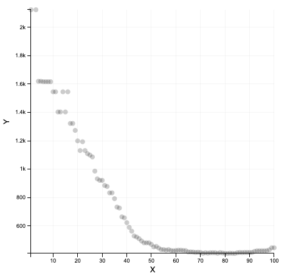
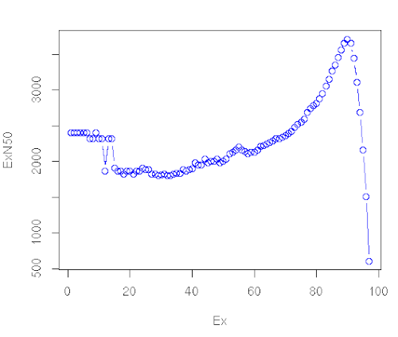
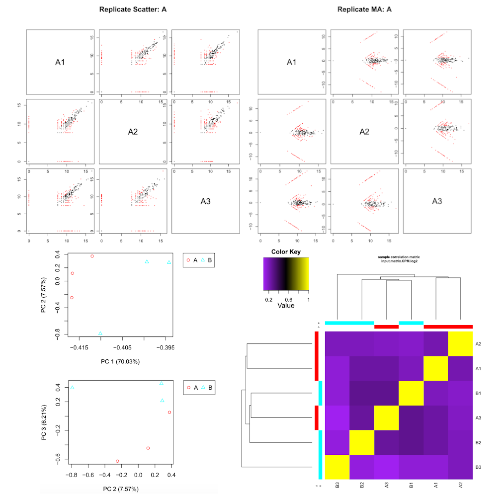

# Introduction


<!-- This is a comment. -->

As a result of the development of novel sequencing technologies, the years between 2008 and 2012 saw a large drop in the cost of sequencing. Per megabase and genome, the cost dropped to 1/100,000th and 1/10,000th of the price, respectively. Prior to this, only transcriptomes of organisms that were of broad interest and utility to scientific research were sequenced; however, these developed in 2010s high-throughput sequencing (also called next-generation sequencing) technologies are both cost- and labor- effective, and the range of organisms studied via these methods is expanding.

Examining non-model organisms can provide novel insights into the mechanisms underlying the "diversity of fascinating morphological innovations" that have enabled the abundance of life on planet Earth. In animals and plants, the "innovations" that cannot be examined in common model organisms include mimicry, mutualism, parasitism, and asexual reproduction. De novo transcriptome assembly is often the preferred method to studying non-model organisms, since it is cheaper and easier than building a genome, and reference-based methods are not possible without an existing genome. The transcriptomes of these organisms can thus reveal novel proteins and their isoforms that are implicated in such unique biological phenomena.

[(source)](https://en.wikipedia.org/wiki/De_novo_transcriptome_assembly)

> <agenda-title></agenda-title>
>
> In this tutorial, we will cover:
>
> 1. TOC
> {:toc}
>
{: .agenda}

# Read cleaning (20 minutes)

Known sequencing biases:
- Unknown nucleotides (Ns)
- Bad quality nucleotides
- Hexamers biases (Illumina. Now corrected ?)

Why do we need to correct those?
- To remove a lot of sequencing errors (detrimental to the vast majority of assemblers)
- Because most de-bruijn graph based assemblers can’t handle unknown nucleotides

## Get data

> <hands-on-title>Data upload</hands-on-title>
>
> 1. Create a new history for this tutorial
>
>    
>
> 2. Import the 12 `fq.gz` into a `List of Pairs` collection named `fastq_raw`
>    - Option 1: from a shared data library (ask your instructor)
>    - Option 2: from Zenodo using the URLs given below
>
>      [](https://doi.org/10.5281/zenodo.3541678)
>
>    ```
>    https://zenodo.org/record/3541678/files/A1_left.fq.gz
>    https://zenodo.org/record/3541678/files/A1_right.fq.gz
>    https://zenodo.org/record/3541678/files/A2_left.fq.gz
>    https://zenodo.org/record/3541678/files/A2_right.fq.gz
>    https://zenodo.org/record/3541678/files/A3_left.fq.gz
>    https://zenodo.org/record/3541678/files/A3_right.fq.gz
>    https://zenodo.org/record/3541678/files/B1_left.fq.gz
>    https://zenodo.org/record/3541678/files/B1_right.fq.gz
>    https://zenodo.org/record/3541678/files/B2_left.fq.gz
>    https://zenodo.org/record/3541678/files/B2_right.fq.gz
>    https://zenodo.org/record/3541678/files/B3_left.fq.gz
>    https://zenodo.org/record/3541678/files/B3_right.fq.gz
>    ```
>
>    
>    
>
> 3. Rename the datasets
> 4. Check that the datatype
>
>    
>
> 5. Add to each database a tag corresponding to ...
>
>    
>
{: .hands_on}

## Quality control

> <hands-on-title>Task description</hands-on-title>
>
> 1. **FastQC**  with the following parameters:
>   - *"Short read data from your current history"*: `fastq_raw` (collection)
>
{: .hands_on}

<!-- ## Quality control with **MultiQC** - step 2/2

> <hands-on-title>Task description</hands-on-title>
>
> 1. **MultiQC**  with the following parameters:
>    - In *"Results"*:
>        -  *"Insert Results"*
>            - *"Which tool was used generate logs?"*: `FastQC`
>                - In *"FastQC output"*:
>                    - *"Type of FastQC output?"*: `Raw data`
>                    - *"FastQC output"*: `data XX, data XX, and others (flattened)`
>
>    > <comment-title></comment-title>
>    >
>    > We agree that it's not comfortable. The wrapper of MultiQC must be improved
>    {: .comment}
>
{: .hands_on} -->

## Read cleaning with **Trimmomatic**

> <hands-on-title>Task description</hands-on-title>
>
> 1. **Trimmomatic**  with the following parameters:
>    - *"Single-end or paired-end reads?"*: `Paired-end (as collection)`
>    - *"Select FASTQ dataset collection with R1/R2 pair"*: `fastq_raw`
>    - *"Perform initial ILLUMINACLIP step?"*: `Yes`
>    - *"Adapter sequences to use"*: `TruSeq3 (additional seqs) (paired-ended, for MiSeq and HiSeq)`
>    - In *"Trimmomatic Operation"*:
>        -  *"Insert Trimmomatic Operation"*
>            - *"Select Trimmomatic operation to perform"*: `Cut bases off end of a read, if below a threshold quality (TRAILING)`
>        -  *"Insert Trimmomatic Operation"*
>            - *"Select Trimmomatic operation to perform"*: `Cut bases off start of a read, if below a threshold quality (LEADING)`
>        -  *"Insert Trimmomatic Operation"*
>            - *"Select Trimmomatic operation to perform"*: `Sliding window trimming (SLIDINGWINDOW)`
>        -  *"Insert Trimmomatic Operation"*
>            - *"Select Trimmomatic operation to perform"*: `Drop reads with average quality lower than a specific level (AVGQUAL)`
>                - *"Minimum length of reads to be kept"*: `25`
>        -  *"Insert Trimmomatic Operation"*
>            - *"Select Trimmomatic operation to perform"*: `Drop reads below a specified length (MINLEN)`
>                - *"Minimum length of reads to be kept"*: `50`
>    - *"Output trimmomatic log messages?"*: `Yes`
> 2. **Rename** the Dataset Collection
>    - `Trimmomatic on collection XX: paired` -> `fastqc_cleaned`
>
>    > <comment-title></comment-title>
>    >
>    > You can check the Trimmomatic log files to get the number of read before and after the cleaning
>    > ```
>    > Input Read Pairs: 10000
>    > Both Surviving: 8804 (88.04%)
>    > Forward Only Surviving: 491 (4.91%)
>    > Reverse Only Surviving: 456 (4.56%) Dropped: 249 (2.49%)
>    > ```
>    {: .comment}
>
>    
>
{: .hands_on}

## Quality control after cleaning

> <hands-on-title>Task description</hands-on-title>
>
> 1. **FastQC**  with the following parameters:
>   - *"Short read data from your current history"*: `fastqc_cleaned` (collection)
>
{: .hands_on}

# Assembly (120 minutes - computing)

## Assembly with **Trinity**

> <hands-on-title>Task description</hands-on-title>
>
> 1. **Trinity**  with the following parameters:
>    - *"Are you pooling sequence datasets?"*: `Yes`
>        - *"Paired or Single-end data?"*: `Paired-end collection`
>            - *"Strand specific data"*: `No`
>    - *"Run in silico normalization of reads"*: `No`
>    - In *"Additional Options"*:
>        - *"Use the genome guided mode?"*: `No`
> 2. **Rename** the Trinity output
>    - `Trinity on data 52, data 51, and others: Assembled Transcripts` -> `transcriptome_raw.fasta`
>
>    
>
{: .hands_on}

# Assembly assessment / cleaning

## Checking of the assembly statistics

> <hands-on-title>Task description</hands-on-title>
>
> 1. **Trinity Statistics**  with the following parameters:
>    - *"Trinity assembly"*: `transcriptome_raw.fasta`
>
>    > <comment-title></comment-title>
>    > This step, even with this toy dataset, will take around 2 hours
>    {: .comment}
>
{: .hands_on}

## Remapping on the raw transcriptome

> <hands-on-title>Task description</hands-on-title>
>
> 1. **Align reads and estimate abundance**  with the following parameters:
>    - *"Transcripts"*: `transcriptome_raw.fasta`
>    - *"Paired or Single-end data?"*: `Paired`
>        - *"Left/Forward strand reads"* -> `Multiple datasets`
>            - Click on the *Folder* button at the right
>                - *Type to Search*: `left`
>                - Select the 6 `Trimmomatic on ..._left.fq.gz`
>        - *"Right/Reverse strand reads"* -> `Multiple datasets`
>            - Click on the *Folder* button at the right
>                - *Type to Search*: `right`
>                - Select the 6 `Trimmomatic on ..._left.fq.gz`
>        - *"Strand specific data"*: `Yes`
>    - *"Abundance estimation method"*: `Salmon`
>    - In *"Additional Options"*:
>        - *"Trinity assembly?"*: `Yes`
> 2. **Rename** the 6 `* isoforms counts` :(
>    - Check in the information panel (**i** icon) the lineage of your file (ex: `A1_left.fq.gz` ... )
>    - Rename the datasets: `A1_raw`, `A2_raw`, `A3_raw`, `B1_raw`, `B2_raw`, `B3_raw`.
>
>    > <comment-title></comment-title>
>    >
>    > If you check at the Standard Error messages of your outputs. You can get the `Mapping rate`
>    > 1. Click on one dataset
>    > 2. Click on the little **i** icon
>    > 3. Click on *Tool Standard Error:	stderr*
>    > ```
>    > [2019-11-14 15:44:21.500] [jointLog] [info] Mapping rate = 44.4358%
>    > ```
>    {: .comment}
>
>    > <comment-title></comment-title>
>    >
>    > At this stage, you can now delete some useless datasets
>    > - `Trimmomatic on collection XX: unpaired`
>    > - `Align reads and estimate abundance on *: genes counts`
>    > Note that the dataset are just hidden. You can delete them permanently and make some room in the history options (the little wheel icon)
>    {: .comment}
>
>
{: .hands_on}

## Merge the mapping tables and compute normalizations

> <hands-on-title>Task description</hands-on-title>
>
> 1. **Build expression matrix**  with the following parameters:
>    - *"Abundance estimates"*: `A1_raw`, `A2_raw`, `A3_raw`, `B1_raw`, `B2_raw`, `B3_raw`
>    - *"Abundance estimation method"*: `Salmon`
>
{: .hands_on}

> <question-title></question-title>
>
> What are the three tables?
>
> > <solution-title></solution-title>
> >
> > 1. `estimated RNA-Seq fragment isoform counts (raw counts)``
> > 2. `matrix of isoform TPM expression values (not cross-sample normalized)`
> > 3. `matrix of TMM-normalized expression values`
> >
> {: .solution}
>
{: .question}

## Compute contig Ex90N50 statistic and Ex90 transcript count

> <hands-on-title>Task description</hands-on-title>
>
> 1. **Compute contig Ex90N50 statistic and Ex90 transcript count**  with the following parameters:
>    - *"Expression matrix"*: `Build expression matrix: matrix of TMM-normalized expression values`
>    - *"Transcripts"*: `transcriptome_raw.fasta`
> 2. Click on the visulization icon on the dataset `Compute contig Ex90N50 statistic and Ex90 transcript count: ExN50 statistics`
>    1. **Scatterplot - Creates a 2D-scatterplot from tabular datapoints**
>    2. *"X Column"*: select the Columns `1`
>    3. *"Y Column"*: select the Columns `2`
>
{: .hands_on}

### What we get


### What we should get with a real dataset

[(source)](https://github.com/trinityrnaseq/trinityrnaseq/wiki/Transcriptome-Contig-Nx-and-ExN50-stats)

## Transcriptome annotation completeness

> <hands-on-title>Task description</hands-on-title>
>
> 1. **Busco**  with the following parameters:
>    - *"Sequence to analyse"*: `transcriptome_raw.fasta`
>    - *"Mode"*: `transcriptome`
>    - *"Lineage"*: `eukaryota_odb9`
>
{: .hands_on}



## Filter low expression transcripts

> <hands-on-title>Task description</hands-on-title>
>
> 1. **Filter low expression transcripts**  with the following parameters:
>    - *"Trinity assembly"*: `transcriptome_raw.fasta`
>    - *"Expression matrix"*: `Build expression matrix: matrix of isoform TPM expression values (not cross-sample normalized)`
>    - *"Minimum expression level required across any sample"*: `1.0`
>    - *"Isoform filtering method"*: `Keep all isoforms above a minimum percent of dominant expression`
>        - *"Minimum percent of dominant isoform expression"*: `1`
>
>    > <comment-title></comment-title>
>    >
>    > If you check at the Standard Error messages of your outputs. You can get the `Retained` rate
>    > 1. Click on one dataset
>    > 2. Click on the little **i** icon
>    > 3. Click on *Tool Standard Error:	stderr*
>    > ```
>    > 	Retained 2096 / 2102 = 99.71% of total transcripts.
>    > ```
>    {: .comment}
>
> 2. **Rename** the output
>    - `Filter low expression transcripts on data 42 and data 14: filtered low expression transcripts` -> `transcriptome_filtered.fasta`
>
{: .hands_on}

## Checking of the assembly statistics after cleaning

> <hands-on-title>Task description</hands-on-title>
>
> 1. **Trinity Statistics**  with the following parameters:
>    - *"Trinity assembly"*: `transcriptome_filtered.fasta`
>
{: .hands_on}


# Annotation
## Generate gene to transcript map

> <hands-on-title>Task description</hands-on-title>
>
> 1. **Generate gene to transcript map**  with the following parameters:
>    - *"Trinity assembly"*: `transcriptome_filtered.fasta`
>
{: .hands_on}

## Peptide prediction

> <hands-on-title>Task description</hands-on-title>
>
> 1. **TransDecoder**  with the following parameters:
>    - *"Transcripts"*: `transcriptome_filtered.fasta`
>    - In *"Training Options"*:
>        - *"Select the training method"*: `Train with the top longest ORFs`
>
{: .hands_on}

## Similarity search

> <hands-on-title>Task description</hands-on-title>
>
> 1. **Diamond**  with the following parameters:
>    - *"What do you want to align?"*: `Align amino acid query sequences (blastp)`
>    - *"Input query file in FASTA or FASTQ format"*: `TransDecoder on data XXX: pep`
>    - *"Select a reference database"*: `Uniprot Swissprot`
>    - *"Format of output file"*: `BLAST Tabular`
>    - In *"Method to restrict the number of hits?"*: `Maximum number of target sequences`
>        - *"The maximum number of target sequence per query to report alignments for"*: `1`
> 3. **Rename** the Diamond output
>    - `Diamond on data XXX` -> `Diamond (blastp)`
> 2. **Diamond**  with the following parameters:
>    - *"What do you want to align?"*: `Align DNA query sequences (blastx)`
>    - *"Input query file in FASTA or FASTQ format"*: `transcriptome_filtered.fasta`
>    - *"Select a reference database"*: `Uniprot Swissprot`
>    - *"Format of output file"*: `BLAST Tabular`
>    - In *"Method to restrict the number of hits?"*: `Maximum number of target sequences`
>        - *"The maximum number of target sequence per query to report alignments for"*: `1`
> 4. **Rename** the Diamond output
>    - `Diamond on data XXX` -> `Diamond (blastx)`
>
>    > <comment-title></comment-title>
>    >
>    > Note that you can both use **Diamond**  or the **NCBI BLAST+ blastp**  and **NCBI BLAST+ blast** 
>    {: .comment}
>
{: .hands_on}

## Find signal peptides

> <hands-on-title>Task description</hands-on-title>
>
> 1. **SignalP 3.0**  with the following parameters:
>    - *"Fasta file of protein sequences"*: `TransDecoder on data XXX: pep`
>
{: .hands_on}

## Find transmembrane domains

> <hands-on-title>Task description</hands-on-title>
>
> 1. **TMHMM 2.0**  with the following parameters:
>    - *"FASTA file of protein sequences"*: `TransDecoder on data XXX: pep`
>
{: .hands_on}

## Search again profile database

> <hands-on-title>Task description</hands-on-title>
>
> 1. **hmmscan**  with the following parameters:
>    - *"Sequence file"*: `TransDecoder on data XXX: pep`
>
{: .hands_on}

## Transcriptome annotation using **Trinotate**

> <hands-on-title>Task description</hands-on-title>
>
> 1. **Trinotate**  with the following parameters:
>    - *"Transcripts"*: `transcriptome_filtered.fasta`
>    - *"Peptides"*: `TransDecoder on data XXX: pep`
>    - *"Genes to transcripts map"*: `Generate gene to transcript map on data XXX: Genes to transcripts map`
>    - *"BLASTP: Peptides vs Uniprot.SwissProt"*: `Diamond (blastp)`
>    - *"BLASTX: Transcripts vs Uniprot.SwissProt"*: `Diamond (blastx)`
>    - *"HMMER hmmscan: Peptides vs PFAM"*: `Table of per-domain hits from HMM matches of TransDecoder on data XXX: pep against the profile database`
>    - *"TMHMM on Peptides"*: `TMHMM results`
>    - *"SignalP on Peptides"*: `SignalP euk results`
>    - *"Let Galaxy downloading the Trinotate Pre-generated Resource SQLite database"*: `Yes`
>
{: .hands_on}

# Differential Expression (DE) Analysis

## Remapping on the filtered transcriptome using

> <hands-on-title>Task description</hands-on-title>
>
> 1. **Align reads and estimate abundance**  with the following parameters:
>    - *"Transcripts"*: `transcriptome_filtered.fasta`
>    - *"Paired or Single-end data?"*: `Paired`
>        - *"Left/Forward strand reads"* -> `Multiple datasets`
>            - Click on the *Folder* button at the right
>                - *Type to Search*: `left`
>                - Select the 6 `Trimmomatic on ..._left.fq.gz`
>        - *"Right/Reverse strand reads"* -> `Multiple datasets`
>            - Click on the *Folder* button at the right
>                - *Type to Search*: `right`
>                - Select the 6 `Trimmomatic on ..._left.fq.gz`
>        - *"Strand specific data"*: `Yes`
>    - *"Abundance estimation method"*: `Salmon`
>    - In *"Additional Options"*:
>        - *"Trinity assembly?"*: `Yes`
> 2. **Rename** the 6 `* isoforms counts` :(
>    - Check in the information panel (**i** icon) the lineage of your file (ex: `A1_left.fq.gz` ... )
>    - Rename the datasets: `A1`, `A2`, `A3`, `B1`, `B2`, `B3`.
>
>    > <comment-title></comment-title>
>    >
>    > If you check at the Standard Error messages of your outputs. You can get the `Mapping rate`
>    > 1. Click on one dataset
>    > 2. Click on the little **i** icon
>    > 3. Click on *Tool Standard Error:	stderr*
>    > ```
>    > [2019-11-14 15:44:21.500] [jointLog] [info] Mapping rate = 44.4358%
>    > ```
>    {: .comment}
>
>    > <comment-title></comment-title>
>    >
>    > At this stage, you can now delete some useless datasets
>    > - `Align reads and estimate abundance on *: genes counts`
>    > Note that the dataset are just hidden. You can delete them permanently and make some room in the history options (the little wheel icon)
>    {: .comment}
>
{: .hands_on}

## Merge the mapping tables and compute a TMM normalization

> <hands-on-title>Task description</hands-on-title>
>
> 1. **Build expression matrix**  with the following parameters:
>    - *"Abundance estimates"*: `A1`, `A2`, `A3`, `B1`, `B2`, `B3`
>    - *"Abundance estimation method"*: `Salmon`
> 2. **Describe samples and replicates**   with the following parameters:
>    - *"Samples"*
>        - *"1: Samples"*:
>            - *"Full sample name"*: `A1`
>            - *"Condition"*: `A`
>        - *"2: Samples"*:
>            - *"Full sample name"*: `A2`
>            - *"Condition"*: `A`
>        - ...:
>        - *"6: Samples"*:
>            - *"Full sample name"*: `B3`
>            - *"Condition"*: `B`
>
{: .hands_on}

## RNASeq samples quality check

> <hands-on-title>Task description</hands-on-title>
> 1. **RNASeq samples quality check**  with the following parameters:
>    - *"Expression matrix"*: `Build expression matrix: estimated RNA-Seq fragment isoform counts (raw counts)`
>    - *"Samples description"*: `Describe samples`
>
{: .hands_on}

## Differential expression analysis

> <hands-on-title>Task description</hands-on-title>
> 1. **Differential expression analysis**  with the following parameters:
>    - *"Expression matrix"*: `Build expression matrix: estimated RNA-Seq fragment isoform counts (raw counts)`
>    - *"Sample description"*: `Describe samples` (the last one)
>    - *"Differential analysis method"*: `DESeq2`
>
{: .hands_on}

## Extract and cluster differentially expressed transcripts

> <hands-on-title>Task description</hands-on-title>
>
> 1. **Extract and cluster differentially expressed transcripts**  with the following parameters:
>    - In *"Additional Options"*:
>        - *"Expression matrix"*: `Build expression matrix: estimated RNA-Seq fragment isoform counts (raw counts)`
>        - *"Sample description"*: `Describe samples`
>        - *"Differential expression results"*: `Differential expression results on data XXX and data XXX`
>        - *"p-value cutoff for FDR"*: `1`
>        - *"Run GO enrichment analysis"*: `No`
>
>    > <comment-title></comment-title>
>    >
>    > *"p-value cutoff for FDR"*: `1`
>    > Don't do this at home! It's because we have a Toy Dataset. The cutoff should be around `0.001`
>    {: .comment}
>
{: .hands_on}

## Partition genes into expression clusters

> <hands-on-title>Task description</hands-on-title>
>
> 1. **Partition genes into expression clusters**  with the following parameters:
>    - *"RData file"*: `Extract and cluster differentially expressed transcripts: RData file`
>    - *"Method for partitioning genes into clusters"*: `Cut tree based on x percent of max(height) of tree`
>
{: .hands_on}

# Conclusion


Sum up the tutorial and the key takeaways here. We encourage adding an overview image of the
pipeline used.
