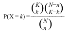
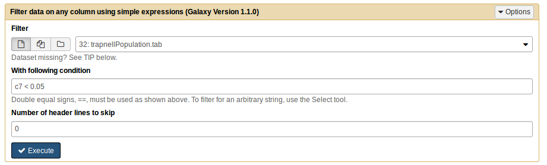
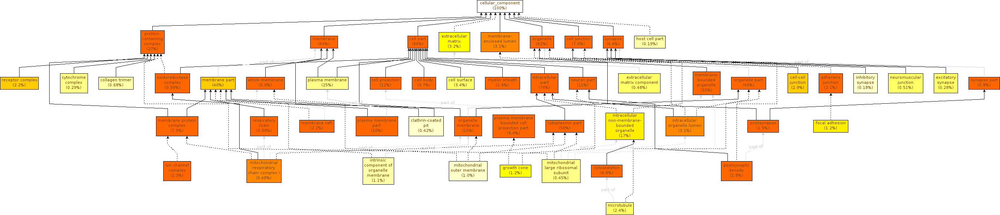

# Introduction
{:.no_toc}

When we have a large list of genes of interest (for example, a list of differentially expressed genes obtained from an RNA-Seq experiment), how do we extract biological meaning from that list?  
One way to do so is to perform functional enrichment analysis. This method consists of the application of statistical tests to verify if genes of interest are more often associated to certain biological functions than what would be expected in a random set of genes. In this tutorial you will learn about enrichment analysis and how to perform it.

**What is the Gene Ontology?**  
The [Gene Ontology](http://www.geneontology.org/) (GO) is a structured, controlled vocabulary and classification of gene function at the molecular and cellular level. It is divided in three separate sub-ontologies or GO types: biological process (e.g., signal transduction), molecular function (e.g., ATPase activity) and cellular component (e.g., ribosome). These sub-ontologies are structured as directed acyclic graphs (a hierarchy with multi-parenting) of GO terms.
 

> 
**Figure 1** QuickGO - http://www.ebi.ac.uk/QuickGO

**What are GO annotations?**  
Genes are associated to GO terms via GO annotations. Each gene can have multiple annotations even of the same GO type. An important notion to take into account when using GO is that, according to the **true path rule**, a gene annotated to a term is also implicitly annotated to each ancestor of that term in the GO graph. GO annotations have evidence codes that encode the type of evidence supporting them. Only a small minority of genes have experimentally verified  annotations; the large majority have annotations inferred electronically based on sequence homology or patterns.

> ### Overview
>
> In this tutorial, we will deal with:
> 
> 1. Functional Enrichment Analysis
> 2. Methods to simplify the results
> 3. Interpretation of the results
> {:toc}
>
{: .agenda}

 
# Functional Enrichment Analysis

To perform functional enrichment analysis, we need to have:
- A set of genes of interest (e.g., differentially expressed genes): **study set**
- A set with all the genes to consider in the analysis: **population set** (which must contain the study set)
- GO annotations, associating the genes in the population set to GO terms
- The GO ontology, with the description of GO terms and their relationships
 
For each GO term, we need to count the frequency (**k**) of genes in the study set (**n**) that are associated to the term, and the frequency (**K**) of genes in the population set (**N**) that are associated to the same term. Then we test how likely would it be to obtain at least **k** genes associated to the term if **n** genes would be randomly sampled from the population, given the frequency **K** and size **N** of the population.

The appropriate statistical test is the one-tailed variant of Fisher’s exact test, also known as the hypergeometric test for over-representation. When the one-tailed version is applied, this test will compute the probability of observing at least the sample frequency, given the population frequency.  The [hypergeometric distribution](https://en.wikipedia.org/wiki/Hypergeometric_distribution) measures precisely the probability of **k** successes in **n** draws, without replacement, from a finite population of size **N** that contains exactly **K** successful objects: 
> 

For this first exercise we will use data from [Trapnell et al. 2014](https://www.ncbi.nlm.nih.gov/pubmed/22383036 "Trapnell et al. data"). In this work, the authors created an artificial dataset of gene expression in *Drosophila melanogaster*, where 300 random genes were set to be differentially expressed between two conditions.

> ###  Hands-on:
> The datasets is available at [Zenodo](https://zenodo.org/record/1255038#.Wx4qTBwh3CI) to download.
> 1. **Create a new history** 
>
> 2. **Upload to the Galaxy** the following files:
>    - go.obo 
>    - drosophila_gene_association.fb 
>    - trapnellPopulation.tab 
>
>    > ###  Tip: Upload data to Galaxy [[1]](https://galaxyproject.github.io/training-material/topics/introduction/tutorials/galaxy-intro-peaks2genes/tutorial.html) 
>    > * **Click** on the upload button in the upper left of the interface.
>    >
>    >  
>    >
>    > * Press **Choose local file** and search for your file.
>    > * Press **Start** and wait for the upload to finish. Galaxy will automatically unpack the file.
>    {: .tip}
>
> 3. **Rename** the *go.obo* file to **GO** and *drosophila_gene_association.fb* file to **GO annotations Drosophila melanogaster**. 
>
>    > After you upload the files, and if you press the **eye icon** of *trapnellPopulation.tab* you should look someting like this:
>    > 
> **Figure 2** Trapnell file
>
>    > As you can see, we only have the population file. The file of the study population is missing, so well have to do a data manipulation to obtain it.
> 4. In the tool menu, navigate to `Filter and Sort -> Filter data on any column using simple expressions`.
>
>    > ###  Comments
>    > The study set represents the differentially expressed genes. These were chosen as having an adjusted p-value for the differential expression test (last column) smaller than a given threshold. The level of significance is gone to depend the results that you pretend to know, i.e., if is god to have an big selection of study set or not. In this case, we selected the genes with an adjusted p-value < 0,05. If you open the *trapnellPopulation.tab* file, the column 7 corresponds to the **p-values**.
>    {: .comment}
>
>    > Let's go create the study set with the help of the **Filter** tool.
> 
> 5. **Filter** : We need to change the following settings:
>
>    - **Filter**: `trapnellPopulation.tab`
>    - **With following condition**: `c7 < 0.05`
> 
>
> 6. This generate one file called *File on data 32*. **Rename** to trapnellStudy.
>
>    > ###  Comments
>    > Both files have the same type of information, the difference between them is the number of genes, as the genes in the study sample are a subset of the population. 
>    {: .comment}
>
> 7. **GOEnrichment** : Run `GOEnrichment` tool with the four files.
>    - Use the default options.
> 
> 
>
>    > ###  Questions
>    >
>    > What were be the GOEnrichment results?
>    > 

>    > 
>    > 
Click to view answers

>    > This will generate 6 files with the respective default names: MF_Result.txt, BP_Result.txt, CC_Result.txt, MF_Graph, BP_Graph and CC_Graph. The three Result files are tables with statistical tests for each GO Term, and the other three Graph files are image files displaying a graph view of the enriched GO terms.
>    > 

>    {: .question}
>
> 8. **Rename** files to MF Trapnell, BP Trapnell, CC Trapnell, MF graphTrapnell, BP graphTrapnell and CC graphTrapnell, respectively.
>
>
>
> As you can see, the output consists of a table with p-values and frequencies for each GO type plus an image with a graph view of the GO type, where you can visualize the enrichment results and highlighted enriched ontology branches. 
>
>    > ###  Comments
>    > For each GO term we obtain a p-value corresponding to a single, independent test. Since we are making multiple similar tests, the probability of at least one of them being a false positive increases. Therefore we need to make a correction for multiple testing.
>    {: .comment} 
>
>    > ###  Questions
>    >
>    > How many significant terms do we get?
>    > 
>    > 
 
>    > 
Click to view answers

>    > When we ask how many significant terms, we want to see GO terms that have a p-value < 0.05. According with the results, in Molecular Function we have 5 GO terms, Biological Process we have 43 GO terms and Component Cellular we have 10 GO terms.
>    > 

>    {: .question}
> 
>
>
> If you press the eye icon of the *Molecular Function* you should see something like this:
> 
> 
>
>    > ###  Comments
>    > The ~300 genes should be random. Nonetheless we still have significant terms… 
>    {: .comment} 
{: .hands_on}

> ###  Comments
>
> Let's go back a little bit, and reopen the trapnellPopulation file. If you go through the file, you'll see genes with 'NA', this means that there are genes in our population that are not differentially expressed.
{: .comment} 
> 
Let's go manipulate the trapnellPopulation.tab file to remove the genes that are not differentially expressed, to see the differences.
 
> ###  Hands-on:
>
> 1. **Filter** : We need to change the following settings:
>    - **Filter**: `trapnellPopulation.tab`
>    - **With following condition**: `c7 != 'NA'`
> 
>
> 2. This generate one file called *File on data 32*. **Rename** to trapnellNewPopulation.
> 3. **GOEnrichment** : Run `GOEnrichment` tool with the new population.
>    - Use the default options.
> 
>
> 4. **Rename** files to MF New Trapnell, BP New Trapnell, CC New Trapnell, MF New graphTrapnell, BP New graphTrapnell and CC New graphTrapnell, respectively.
> Let's go see again the graph **MF New graphTrapnell**.
>
> 
>
> 
> 
>
>    > ###  Questions
>    >
>    > 1. How many significant terms do we get? 
>    > 2. Why is different?
>    > 

>    >
>    > 
Click to view answers

>    > <ol type="1">
>    > <li> According with the results, in *Molecular Function* and *Biological Process* we have 0 GO terms and *Component Cellular* just 1 GO term. </li>
>    > <li> The non-differentially expressed genes that we exterminate do not have direct connection with the differentially expressed genes of our sample, so we will not get any GO term associated to the ontologies. And also because the genes we select are random genes, and consequently there should be no GO terms associated with the 3 ontologies, which means that the previous result (before the filtering) is not correct.</li>
>    > </ol>
>    > 

>    {: .question}
{: .hands_on}
 
 
# Simplification of graphs

Graphs views are essential, but sometimes the graph view can become overwhelming due to the size of the results. To exemplify this issue, we will next perform functional enrichment analysis using a more realistic dataset from a study using the mouse model organism. The original dataset can be found [here](https://www.ncbi.nlm.nih.gov/geo/query/acc.cgi?acc=GSE30352). In this [study](https://www.nature.com/articles/nature10532), the authors compared the gene expression of several tissues. Here, we will use results from the comparison between heart and brain.
  

> ###  Hands-on:
>
> For the first exercise we will use as a study set the differential genes (padjusted<0.05).
> 1. **Upload to Galaxy** the mouse_brain_vs._heart.txt, Mus_musculus_annotations_biomart_e92.tab and mouse_brain_vs_heart.difgenes.txt files.
> 2. **Rename** the *mouse_brain_vs._heart.txt* file to **Mouse population**, *Mus_musculus_annotations_biomart_e92.tab* file to **GO annotations _Mus musculus_** and *mouse_brain_vs_heart.difgenes.txt* file to **Mouse diff**. 
> 3. **GOEnrichment** <i class="fa fa-wrench" aria-hidden="true"></i>: Run `GOEnrichment` for the new study set.
>    - Select **'No'** in the Summarize Output option.
> 
> 
> 4. This will generate 6 files, with the respective names: MF_Result.txt, BP_Result.txt, CC_Result.txt, MF_Graph, BP_Graph and CC_Graph. **Rename** to MF tabDiff, BP tabDiff, CC tabDiff, MF grapDiff, BP grapDiff and CC grapDiff, respectively.
> 5. Analyze the table and graph from *Biological Process*.
> 
> 
> 
> 
>    > ###  Comments
>    > As you can see the three graphs are very complex and difficult to analyze.
>    {: .comment} 
{: .hands_on}

As you may notice, the number of enriched GO Terms is very high, with graphs that are too extensive to analyze manually. And this is despite the fact that GOEnrichment ignores singletons and skips dependent tests by default precisely to avoid enrichment results that are too extensive and not informative. 

The Summarize Output option in the GOEnrichment tool addresses this problem by conflating branches/families of enriched GO terms and selecting the most representative term(s) from them (usually 1-2 term per family). The greatly simplifies the results while retaining branch information, and thus ensuring that every enriched family of functions is present in the results. Some specificity is necessarily lost, but the trade-off is that the results become easier and more intuitive to analyze.
 
> ###  Hands-on:apnellPopulation.tab
>
> 1. **GOEnrichment** <i class="fa fa-wrench" aria-hidden="true"></i>: Re-run `GOEnrichment` with the same files.
>    - Use the default options (notice that by default the Summarize Option is on).
> 
> 2. Analyze again the table and graph from *Biological Process*.
> 
> 
> 
>
>    > ###  Questions
>    > 1. Are there differences in complexity comparing the graph with and without the summarize output option?
>    > 

>    >
>    > 
Click to view answers

>    > 1. Yes, there are differences. As you can see, the activation of the Summarize option reduces the size of the graph because this parameter causes families of GO terms to be conflated. Each major branch in the full results is still present in the summarized results, but now is reduced to 1 or 2 most representative terms, leading to a graph that is much easier to interpret while still containing all the key functional information.
>    > 

>    {: .question}
{: .hands_on}
 
Another approach to reduce the complexity of the results is to use a shallower version of GO, the GO slims. GO slims are transversal cuts of GO that cover all key branches but lack specific terms. Thus, using them leads to much simpler results than using the full GO, but also leads to a substantial loss in specificity, which is greater than that of the Summarize Output option. 

To test the GO slim approach, let us use the mouse dataset again. First, however, we need to use GOSlimmer tool to convert the annotations file from full GO to GO slim (as GO annotations are typically made to terms that are too specific to be in the GO slim, and thus need to be extended by the true path rule).

> ###  Hands-on:
>
> 1. **Upload to the Galaxy** the [goslim_generic.obo](http://www.geneontology.org/ontology/subsets/goslim_generic.obo) file.
> 2. **Rename** the *goslim_generic.obo* file to **GO Slim**.
> 3. **GOSlimmer** <i class="fa fa-wrench" aria-hidden="true"></i>: Run `GOSlimmer`.
> 
>    > ###  Comments
>    > You need to use the **GO** and **GO annotations _Mus musculus_** that you previously upload.
>    {: .comment}
> 
> 
> 
> This will generate one file called **Slim Annotations**.
{: .hands_on}
> 
> 
Now we will go use the GOEnrichment tool with the new Slim Annotations file and the same study set.
 
> ###  Hands-on:
>
> 1. **GOEnrichment** <i class="fa fa-wrench" aria-hidden="true"></i>: Run `GOEnrichment`.
>    - Use the **GOSlim**, **Slim Annotations**, **Mouse diff** and **Mouse population** files.
>    - Use the default options.
> 
>
> ###  Questions
>    >
>    > 1. What differences do you observe when comparing the results obtained with the GO Slim to those obtained with the full GO, with the Summarize Output option?
>    >
>    > *Component Cellular* with full GO
>    > 
>    > *Component Cellular* with GO Slim
>    > 
>    > 

>    >
>    > 
Click to view answers

>    > 1. The differences that you observed is because the ontology used. When we apply the summarize option with the full GO, the GOEnrichment tool will return a summarized output (as we have seen previously), more simplify if you do not use the summarize option. When we opted for GO Slim, the original annotation was summarized and because of this it will generate an even more summarized output, but consequently loses a lot of specification.
>    > 

>    {: .question}
>
{: .hands_on}

# Interpretation of the results
The interpretation of the results will depend on the biological information that we intend to extract. Enrichment analysis can be used in validation (e.g., of a protocol for extracting membrane proteins), characterization (e.g., of the effects of a stress in a organism) and elucidation (e.g., of the functions impacted by the knock-out of a transcription factor).

There is one important point to keep in mind during the analysis: statistically significant is different from biologically meaningful. That said, it is typically possible to obtain some biological or technical insight about the underlying experiment from statistically enriched terms, even if it isn’t readily apparent.

Terms that are very generic tend to be difficult to interpret, because the meaning they convey is shallow. On the other hand, very specific terms are generally not integrative and thus not useful in interpreting a gene set collectively. The interesting terms are those that are sufficiently specific to transmit substantial biological meaning, yet generic enough to integrate multiple genes.
 
For the second exercice, we will continue to work in the same study set before but now we go to analyze the over- and the underexpressed genes, and see the enriched GO terms presents in the brain and heart from the mouse.

> ###  Hands-on: 
>
> 1. **Upload to Galaxy** the mouseOverexpressed.txt and the mouseUnderexpressed.txt files. 
>
>    > ###  Questions
>    >
>    > How do you know which genes are over- and underexpressed? (open the Mouse population file)
>    > 

>    >
>    > 
Click to view answers

>    > It is through the logFC values that we derive the information whether the gene is over- or underexpressed. If the logFC value is positive it means that the gene is underexpressed, and if it is negative the gene is overexpressed.
>    > 

>    {: .question}
>
>    > ###  Comments
>    >
>    > In addition to logFC values, it is also necessary define the p-value cut-off for the differential expression test. In this case the cut-off used was 0.01.
>    >
>    {: .comment} 
>
> 2. **GOEnrichment** <i class="fa fa-wrench" aria-hidden="true"></i>: Run `GOEnrichment` for the both study files (*mouseOverexpressed.txt* and the *mouseUnderexpressed.txt*).
>    - Use the **GO**, the **GO annotations _Mus musculus_** and the **Mouse population** files.
>    - Use the default options.
> 
> 
>
> 3. This will generate 12 files, 6 for each sample, with the respective names: MF_Result.txt, BP_Result.txt, CC_Result.txt, MF_Graph, BP_Graph and CC_Graph. **Rename** according to sample (under- and overexpressed): MF tableUnder, BP tableUnder, CC tableUnder, MF graphUnder, BP graphUnder, CC graphUnder, MF tableOver, BP tableOver, CC tableOver , MF graphOver, BP graphOver and CC graphOver.
>
>    > ###  Questions
>    >
>    > Analyze the both Biological Process tables. According with the study, which tissues are over- and underexpressed?
>    > 

>    >
>    > 
Click to view answers

>    > The samples correspond to the expressions that occur in the tissues referring to the brain and heart, so the results in the tables (and also in the graphs) will have to correspond to the specific functions of each organ. When we analyze the tables, it is verified that in the **BP tableUnder** table (underexpressed genes) is constituted by genes expressed in the brain, which biologically makes sense. While in the **BP tableOver** table (genes overexpressed) we observe the genes that are expressed in heart. The application of GOErichment tool (as you can see) is great to see the enriched functions that exists in each organ.
>    > 

>    {: .question}
{: .hands_on}

# Conclusion
{:.no_toc}
Functional enrichment is a good way to look for certain patterns in populations but their analysis can become a complicated process because of its complexity. And the way to contorne the complexity is to use the GOEnrichment tool. This tool gives us an visualization more simplified, showing us the enriched GO terms from our sets. This simplification is generate because the Summarize Output option, this parameter will reduce the complexity and gives us the most representative/important terms, and consequently a better interpretation from our results.

